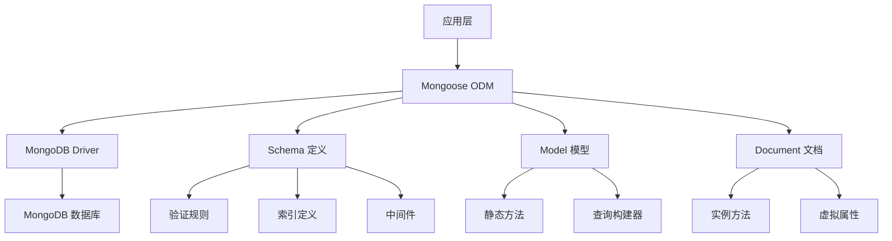

# 🍃 Mongoose ODM 完全指南

> Mongoose 是 MongoDB 的优雅对象建模工具，专为 Node.js 异步环境设计。它通过关系型数据库的思想来设计非关系型数据库，使 MongoDB 操作更加便捷和规范。

## 🎯 Mongoose 概述

### 📊 核心特性

| 特性 | 描述 | 优势 |
|------|------|------|
| **Schema 设计** | 定义数据结构和验证规则 | 🎯 数据结构化 |
| **模型抽象** | 提供面向对象的数据操作 | 🏗️ 代码组织性 |
| **数据验证** | 内置和自定义验证规则 | 🛡️ 数据完整性 |
| **中间件支持** | 生命周期钩子函数 | 🔧 业务逻辑扩展 |
| **类型转换** | 自动类型转换和处理 | ⚡ 开发效率 |

### 🏗️ Mongoose 架构



### 🔄 核心概念对比

| 概念 | MySQL | MongoDB | Mongoose |
|------|-------|---------|----------|
| **数据库** | Database | Database | Connection |
| **数据表** | Table | Collection | Model |
| **数据行** | Row | Document | Document |
| **字段** | Column | Field | Schema Field |
| **主键** | Primary Key | _id | _id |
| **外键** | Foreign Key | Reference | Populate |

## 🚀 安装和配置

### 📦 环境准备

```bash
# 安装 Mongoose
npm install mongoose

# 安装开发依赖
npm install --save-dev @types/mongoose

# 检查版本
npm list mongoose
```

### 🔗 数据库连接

```javascript
// config/database.js
const mongoose = require('mongoose');

// 数据库配置
const dbConfig = {
  url: process.env.MONGODB_URI || 'mongodb://localhost:27017/myapp',
  options: {
    useNewUrlParser: true,
    useUnifiedTopology: true,
    serverSelectionTimeoutMS: 5000,
    socketTimeoutMS: 45000,
    maxPoolSize: 10,
    minPoolSize: 5,
    maxIdleTimeMS: 30000,
    authSource: 'admin',
    // 如果需要认证
    // user: 'username',
    // pass: 'password'
  }
};

// 连接数据库
const connectDB = async () => {
  try {
    await mongoose.connect(dbConfig.url, dbConfig.options);
    console.log('✅ MongoDB 连接成功');
    
    // 连接事件监听
    mongoose.connection.on('connected', () => {
      console.log('🔗 Mongoose 连接已建立');
    });
    
    mongoose.connection.on('error', (err) => {
      console.error('❌ Mongoose 连接错误:', err);
    });
    
    mongoose.connection.on('disconnected', () => {
      console.log('⚠️ Mongoose 连接已断开');
    });
    
  } catch (error) {
    console.error('❌ MongoDB 连接失败:', error);
    process.exit(1);
  }
};

// 优雅断开连接
const disconnectDB = async () => {
  try {
    await mongoose.disconnect();
    console.log('🔚 MongoDB 连接已断开');
  } catch (error) {
    console.error('❌ 断开连接失败:', error);
  }
};

module.exports = { connectDB, disconnectDB };
```

### 🎯 连接选项详解

| 选项 | 描述 | 推荐值 | 说明 |
|------|------|--------|------|
| **useNewUrlParser** | 使用新的 URL 解析器 | `true` | 🔧 避免弃用警告 |
| **useUnifiedTopology** | 使用统一拓扑 | `true` | ⚡ 提升性能 |
| **maxPoolSize** | 最大连接池大小 | `10` | 🏊 控制并发连接 |
| **serverSelectionTimeoutMS** | 服务器选择超时 | `5000` | ⏱️ 快速失败 |
| **socketTimeoutMS** | Socket 超时时间 | `45000` | 🔌 长连接保持 |
| **bufferMaxEntries** | 缓冲区最大条目 | `0` | 🚫 禁用缓冲 |

## 📋 Schema 设计

### 🎨 基础 Schema 定义

```javascript
// models/User.js
const mongoose = require('mongoose');
const { Schema } = mongoose;

// 定义用户 Schema
const UserSchema = new Schema({
  // 基本信息
  username: {
    type: String,
    required: [true, '用户名是必填项'],
    unique: true,
    trim: true,
    minlength: [3, '用户名至少需要3个字符'],
    maxlength: [20, '用户名不能超过20个字符'],
    match: [/^[a-zA-Z0-9_]+$/, '用户名只能包含字母、数字和下划线']
  },
  
  email: {
    type: String,
    required: [true, '邮箱是必填项'],
    unique: true,
    lowercase: true,
    trim: true,
    match: [/^\w+([.-]?\w+)*@\w+([.-]?\w+)*(\.\w{2,3})+$/, '请输入有效的邮箱地址']
  },
  
  password: {
    type: String,
    required: [true, '密码是必填项'],
    minlength: [6, '密码至少需要6个字符'],
    select: false // 查询时默认不返回密码字段
  },
  
  // 个人信息
  profile: {
    firstName: {
      type: String,
      trim: true,
      maxlength: [50, '姓名不能超过50个字符']
    },
    lastName: {
      type: String,
      trim: true,
      maxlength: [50, '姓名不能超过50个字符']
    },
    avatar: {
      type: String,
      default: 'default-avatar.png'
    },
    bio: {
      type: String,
      maxlength: [500, '个人简介不能超过500个字符']
    },
    dateOfBirth: {
      type: Date,
      validate: {
        validator: function(value) {
          return value < new Date();
        },
        message: '出生日期不能是未来的时间'
      }
    }
  },
  
  // 状态信息
  status: {
    type: String,
    enum: {
      values: ['active', 'inactive', 'suspended'],
      message: '状态必须是: active, inactive, suspended'
    },
    default: 'active'
  },
  
  role: {
    type: String,
    enum: ['user', 'admin', 'moderator'],
    default: 'user'
  },
  
  // 设置和偏好
  preferences: {
    theme: {
      type: String,
      enum: ['light', 'dark', 'auto'],
      default: 'auto'
    },
    language: {
      type: String,
      default: 'zh-CN'
    },
    notifications: {
      email: { type: Boolean, default: true },
      push: { type: Boolean, default: true },
      sms: { type: Boolean, default: false }
    }
  },
  
  // 统计信息
  stats: {
    loginCount: { type: Number, default: 0 },
    lastLogin: { type: Date },
    postCount: { type: Number, default: 0 },
    followersCount: { type: Number, default: 0 },
    followingCount: { type: Number, default: 0 }
  },
  
  // 关联字段
  posts: [{
    type: Schema.Types.ObjectId,
    ref: 'Post'
  }],
  
  followers: [{
    type: Schema.Types.ObjectId,
    ref: 'User'
  }],
  
  following: [{
    type: Schema.Types.ObjectId,
    ref: 'User'
  }],
  
  // 时间戳
  createdAt: {
    type: Date,
    default: Date.now
  },
  
  updatedAt: {
    type: Date,
    default: Date.now
  }
}, {
  // Schema 选项
  timestamps: true,  // 自动管理 createdAt 和 updatedAt
  versionKey: false, // 禁用 __v 字段
  toJSON: { virtuals: true },  // 包含虚拟属性
  toObject: { virtuals: true }
});

// 添加索引
UserSchema.index({ email: 1 });
UserSchema.index({ username: 1 });
UserSchema.index({ 'profile.firstName': 1, 'profile.lastName': 1 });
UserSchema.index({ createdAt: -1 });

// 导出模型
module.exports = mongoose.model('User', UserSchema);
```

### 📝 数据类型详解

| 类型 | 用途 | 示例 | 验证选项 |
|------|------|------|----------|
| **String** | 文本数据 | `{ type: String, required: true }` | minlength, maxlength, match, enum |
| **Number** | 数值数据 | `{ type: Number, min: 0, max: 100 }` | min, max |
| **Boolean** | 布尔值 | `{ type: Boolean, default: false }` | - |
| **Date** | 日期时间 | `{ type: Date, default: Date.now }` | - |
| **ObjectId** | 对象 ID | `{ type: Schema.Types.ObjectId, ref: 'User' }` | - |
| **Array** | 数组 | `[String]` 或 `[{ type: String }]` | - |
| **Mixed** | 混合类型 | `{ type: Schema.Types.Mixed }` | - |
| **Buffer** | 二进制数据 | `{ type: Buffer }` | - |

### 🔧 Schema 选项

```javascript
// Schema 配置选项
const schema = new Schema({
  name: String
}, {
  // 集合名称
  collection: 'users',
  
  // 自动添加时间戳
  timestamps: true,
  
  // 禁用版本字段
  versionKey: false,
  
  // 严格模式
  strict: true,
  
  // 转换为 JSON 时的选项
  toJSON: {
    transform: function(doc, ret) {
      delete ret.password;
      delete ret.__v;
      return ret;
    },
    virtuals: true
  },
  
  // 转换为对象时的选项
  toObject: {
    virtuals: true
  }
});
```

## 🎭 虚拟属性和方法

### 🌟 虚拟属性

```javascript
// 添加虚拟属性
UserSchema.virtual('fullName').get(function() {
  return `${this.profile.firstName} ${this.profile.lastName}`;
});

// 设置虚拟属性
UserSchema.virtual('fullName').set(function(name) {
  const parts = name.split(' ');
  this.profile.firstName = parts[0];
  this.profile.lastName = parts[1];
});

// 虚拟计算属性
UserSchema.virtual('age').get(function() {
  if (!this.profile.dateOfBirth) return null;
  const today = new Date();
  const birthDate = new Date(this.profile.dateOfBirth);
  let age = today.getFullYear() - birthDate.getFullYear();
  const monthDiff = today.getMonth() - birthDate.getMonth();
  
  if (monthDiff < 0 || (monthDiff === 0 && today.getDate() < birthDate.getDate())) {
    age--;
  }
  
  return age;
});

// 虚拟关联
UserSchema.virtual('postCount', {
  ref: 'Post',
  localField: '_id',
  foreignField: 'author',
  count: true
});
```

### 📱 实例方法

```javascript
// 实例方法
UserSchema.methods.comparePassword = async function(candidatePassword) {
  const bcrypt = require('bcryptjs');
  return await bcrypt.compare(candidatePassword, this.password);
};

UserSchema.methods.generateAuthToken = function() {
  const jwt = require('jsonwebtoken');
  return jwt.sign(
    { _id: this._id, email: this.email },
    process.env.JWT_SECRET,
    { expiresIn: '7d' }
  );
};

UserSchema.methods.toPublicJSON = function() {
  const user = this.toObject();
  delete user.password;
  delete user.__v;
  return user;
};

UserSchema.methods.follow = async function(userId) {
  if (this.following.includes(userId)) {
    throw new Error('已关注该用户');
  }
  
  this.following.push(userId);
  this.stats.followingCount++;
  
  // 更新被关注用户的粉丝数
  await this.model('User').findByIdAndUpdate(userId, {
    $push: { followers: this._id },
    $inc: { 'stats.followersCount': 1 }
  });
  
  return this.save();
};
```

### 🏗️ 静态方法

```javascript
// 静态方法
UserSchema.statics.findByEmail = function(email) {
  return this.findOne({ email: email.toLowerCase() });
};

UserSchema.statics.findActiveUsers = function() {
  return this.find({ status: 'active' });
};

UserSchema.statics.getUserStats = async function() {
  const stats = await this.aggregate([
    {
      $group: {
        _id: '$status',
        count: { $sum: 1 }
      }
    }
  ]);
  
  return stats.reduce((acc, stat) => {
    acc[stat._id] = stat.count;
    return acc;
  }, {});
};

UserSchema.statics.searchUsers = function(query) {
  return this.find({
    $or: [
      { username: { $regex: query, $options: 'i' } },
      { 'profile.firstName': { $regex: query, $options: 'i' } },
      { 'profile.lastName': { $regex: query, $options: 'i' } }
    ]
  });
};
```

## 🔄 中间件系统

### 🚀 Pre 中间件

```javascript
// 保存前中间件
UserSchema.pre('save', async function(next) {
  // 只有在密码被修改时才进行加密
  if (!this.isModified('password')) return next();
  
  try {
    const bcrypt = require('bcryptjs');
    const salt = await bcrypt.genSalt(10);
    this.password = await bcrypt.hash(this.password, salt);
    next();
  } catch (error) {
    next(error);
  }
});

// 更新时间戳
UserSchema.pre('save', function(next) {
  this.updatedAt = Date.now();
  next();
});

// 验证中间件
UserSchema.pre('validate', function(next) {
  if (this.profile.firstName && this.profile.lastName) {
    this.profile.fullName = `${this.profile.firstName} ${this.profile.lastName}`;
  }
  next();
});

// 查询中间件
UserSchema.pre(/^find/, function(next) {
  // 默认不查询被删除的用户
  this.find({ deletedAt: { $exists: false } });
  next();
});
```

### 📤 Post 中间件

```javascript
// 保存后中间件
UserSchema.post('save', function(doc, next) {
  console.log(`用户 ${doc.username} 已保存`);
  next();
});

// 查询后中间件
UserSchema.post(/^find/, function(docs, next) {
  // 记录查询日志
  console.log(`查询返回 ${docs.length} 个用户`);
  next();
});

// 删除后中间件
UserSchema.post('remove', function(doc, next) {
  // 清理相关数据
  this.model('Post').deleteMany({ author: doc._id }, next);
});

// 错误处理中间件
UserSchema.post('save', function(error, doc, next) {
  if (error.name === 'MongoError' && error.code === 11000) {
    if (error.message.includes('email')) {
      next(new Error('邮箱已存在'));
    } else if (error.message.includes('username')) {
      next(new Error('用户名已存在'));
    } else {
      next(error);
    }
  } else {
    next(error);
  }
});
```

## 📊 查询操作

### 🔍 基础查询

```javascript
// models/queries.js
const User = require('./User');

class UserService {
  // 查找所有用户
  static async findAll() {
    return await User.find({})
      .select('-password')
      .sort({ createdAt: -1 })
      .limit(20);
  }
  
  // 根据 ID 查找用户
  static async findById(id) {
    return await User.findById(id)
      .select('-password')
      .populate('posts', 'title content createdAt')
      .populate('followers', 'username profile.avatar')
      .populate('following', 'username profile.avatar');
  }
  
  // 条件查询
  static async findByCondition(conditions) {
    return await User.find(conditions)
      .select('-password')
      .sort({ createdAt: -1 });
  }
  
  // 分页查询
  static async findWithPagination(page = 1, limit = 10, conditions = {}) {
    const skip = (page - 1) * limit;
    
    const [users, total] = await Promise.all([
      User.find(conditions)
        .select('-password')
        .sort({ createdAt: -1 })
        .skip(skip)
        .limit(limit),
      User.countDocuments(conditions)
    ]);
    
    return {
      users,
      pagination: {
        page,
        limit,
        total,
        pages: Math.ceil(total / limit)
      }
    };
  }
  
  // 模糊搜索
  static async search(query) {
    return await User.find({
      $or: [
        { username: { $regex: query, $options: 'i' } },
        { email: { $regex: query, $options: 'i' } },
        { 'profile.firstName': { $regex: query, $options: 'i' } },
        { 'profile.lastName': { $regex: query, $options: 'i' } }
      ]
    }).select('-password');
  }
}

module.exports = UserService;
```

### 📈 聚合查询

```javascript
// 聚合查询示例
UserSchema.statics.getAnalytics = async function() {
  const analytics = await this.aggregate([
    // 按状态分组统计
    {
      $group: {
        _id: '$status',
        count: { $sum: 1 },
        avgAge: { $avg: '$age' }
      }
    },
    
    // 按注册时间统计
    {
      $group: {
        _id: {
          year: { $year: '$createdAt' },
          month: { $month: '$createdAt' }
        },
        registrations: { $sum: 1 }
      }
    },
    
    // 排序
    {
      $sort: { '_id.year': -1, '_id.month': -1 }
    }
  ]);
  
  return analytics;
};

// 复杂聚合查询
UserSchema.statics.getUserEngagement = async function() {
  return await this.aggregate([
    {
      $match: { status: 'active' }
    },
    {
      $lookup: {
        from: 'posts',
        localField: '_id',
        foreignField: 'author',
        as: 'posts'
      }
    },
    {
      $lookup: {
        from: 'comments',
        localField: '_id',
        foreignField: 'author',
        as: 'comments'
      }
    },
    {
      $addFields: {
        postCount: { $size: '$posts' },
        commentCount: { $size: '$comments' },
        engagementScore: {
          $add: [
            { $multiply: [{ $size: '$posts' }, 2] },
            { $size: '$comments' }
          ]
        }
      }
    },
    {
      $sort: { engagementScore: -1 }
    },
    {
      $limit: 10
    }
  ]);
};
```

## 🔧 数据操作

### ➕ 创建文档

```javascript
// 创建用户服务
class UserService {
  // 创建单个用户
  static async create(userData) {
    try {
      const user = new User(userData);
      await user.save();
      return user.toPublicJSON();
    } catch (error) {
      throw new Error(`创建用户失败: ${error.message}`);
    }
  }
  
  // 批量创建用户
  static async createMany(usersData) {
    try {
      const users = await User.insertMany(usersData);
      return users.map(user => user.toPublicJSON());
    } catch (error) {
      throw new Error(`批量创建用户失败: ${error.message}`);
    }
  }
  
  // 创建或更新用户
  static async upsert(filter, updateData) {
    try {
      const user = await User.findOneAndUpdate(
        filter,
        updateData,
        { 
          new: true, 
          upsert: true,
          runValidators: true 
        }
      );
      return user.toPublicJSON();
    } catch (error) {
      throw new Error(`创建或更新用户失败: ${error.message}`);
    }
  }
}
```

### 📝 更新文档

```javascript
// 更新用户服务
class UserService {
  // 更新单个用户
  static async update(id, updateData) {
    try {
      const user = await User.findByIdAndUpdate(
        id,
        updateData,
        { 
          new: true, 
          runValidators: true 
        }
      ).select('-password');
      
      if (!user) {
        throw new Error('用户不存在');
      }
      
      return user;
    } catch (error) {
      throw new Error(`更新用户失败: ${error.message}`);
    }
  }
  
  // 批量更新
  static async updateMany(filter, updateData) {
    try {
      const result = await User.updateMany(filter, updateData);
      return {
        matched: result.matchedCount,
        modified: result.modifiedCount
      };
    } catch (error) {
      throw new Error(`批量更新失败: ${error.message}`);
    }
  }
  
  // 原子操作更新
  static async incrementStats(id, field, value = 1) {
    try {
      const user = await User.findByIdAndUpdate(
        id,
        { $inc: { [`stats.${field}`]: value } },
        { new: true }
      ).select('-password');
      
      return user;
    } catch (error) {
      throw new Error(`更新统计数据失败: ${error.message}`);
    }
  }
}
```

### 🗑️ 删除文档

```javascript
// 删除用户服务
class UserService {
  // 软删除
  static async softDelete(id) {
    try {
      const user = await User.findByIdAndUpdate(
        id,
        { deletedAt: new Date() },
        { new: true }
      );
      
      if (!user) {
        throw new Error('用户不存在');
      }
      
      return user;
    } catch (error) {
      throw new Error(`删除用户失败: ${error.message}`);
    }
  }
  
  // 硬删除
  static async hardDelete(id) {
    try {
      const user = await User.findByIdAndDelete(id);
      
      if (!user) {
        throw new Error('用户不存在');
      }
      
      // 清理相关数据
      await Promise.all([
        User.updateMany(
          { following: id },
          { $pull: { following: id } }
        ),
        User.updateMany(
          { followers: id },
          { $pull: { followers: id } }
        )
      ]);
      
      return user;
    } catch (error) {
      throw new Error(`删除用户失败: ${error.message}`);
    }
  }
  
  // 批量删除
  static async deleteMany(filter) {
    try {
      const result = await User.deleteMany(filter);
      return {
        deletedCount: result.deletedCount
      };
    } catch (error) {
      throw new Error(`批量删除失败: ${error.message}`);
    }
  }
}
```

## 🔗 关联查询

### 🎯 Populate 基础

```javascript
// 基础关联查询
const user = await User.findById(userId)
  .populate('posts')
  .populate('following', 'username profile.avatar')
  .populate('followers', 'username profile.avatar');

// 深层关联查询
const user = await User.findById(userId)
  .populate({
    path: 'posts',
    select: 'title content createdAt',
    populate: {
      path: 'comments',
      select: 'content author createdAt',
      populate: {
        path: 'author',
        select: 'username profile.avatar'
      }
    }
  });

// 条件关联查询
const user = await User.findById(userId)
  .populate({
    path: 'posts',
    match: { status: 'published' },
    select: 'title content createdAt',
    options: { sort: { createdAt: -1 }, limit: 10 }
  });
```

### 🎨 复杂关联示例

```javascript
// 文章模型
const PostSchema = new Schema({
  title: String,
  content: String,
  author: {
    type: Schema.Types.ObjectId,
    ref: 'User',
    required: true
  },
  tags: [String],
  likes: [{
    type: Schema.Types.ObjectId,
    ref: 'User'
  }],
  comments: [{
    type: Schema.Types.ObjectId,
    ref: 'Comment'
  }],
  createdAt: { type: Date, default: Date.now }
});

// 评论模型
const CommentSchema = new Schema({
  content: String,
  author: {
    type: Schema.Types.ObjectId,
    ref: 'User',
    required: true
  },
  post: {
    type: Schema.Types.ObjectId,
    ref: 'Post',
    required: true
  },
  createdAt: { type: Date, default: Date.now }
});

// 复杂查询示例
const getPostWithDetails = async (postId) => {
  return await Post.findById(postId)
    .populate('author', 'username profile.avatar')
    .populate('likes', 'username')
    .populate({
      path: 'comments',
      populate: {
        path: 'author',
        select: 'username profile.avatar'
      },
      options: { sort: { createdAt: -1 } }
    });
};
```

## 🔧 性能优化

### 📊 索引优化

```javascript
// 单字段索引
UserSchema.index({ email: 1 });
UserSchema.index({ username: 1 });
UserSchema.index({ createdAt: -1 });

// 复合索引
UserSchema.index({ status: 1, createdAt: -1 });
UserSchema.index({ 'profile.firstName': 1, 'profile.lastName': 1 });

// 文本索引
UserSchema.index({
  username: 'text',
  'profile.firstName': 'text',
  'profile.lastName': 'text'
});

// 地理位置索引
UserSchema.index({ location: '2dsphere' });

// 稀疏索引
UserSchema.index({ 'profile.phone': 1 }, { sparse: true });

// 唯一索引
UserSchema.index({ email: 1 }, { unique: true });

// TTL 索引（自动过期）
UserSchema.index({ 'session.expiresAt': 1 }, { expireAfterSeconds: 0 });
```

### 🚀 查询优化

```javascript
// 查询优化技巧
class UserService {
  // 使用精确匹配而非正则表达式
  static async findByUsernameExact(username) {
    return await User.findOne({ username: username.toLowerCase() });
  }
  
  // 使用投影减少数据传输
  static async findUsersBasicInfo() {
    return await User.find({})
      .select('username profile.firstName profile.lastName profile.avatar')
      .limit(50);
  }
  
  // 使用 lean() 获取纯 JavaScript 对象
  static async findUsersLean() {
    return await User.find({})
      .select('username email')
      .lean();
  }
  
  // 使用聚合管道优化复杂查询
  static async getUsersWithPostCount() {
    return await User.aggregate([
      {
        $lookup: {
          from: 'posts',
          localField: '_id',
          foreignField: 'author',
          as: 'posts'
        }
      },
      {
        $addFields: {
          postCount: { $size: '$posts' }
        }
      },
      {
        $project: {
          username: 1,
          email: 1,
          postCount: 1,
          posts: 0
        }
      }
    ]);
  }
}
```

## 🔒 数据验证

### 📝 内置验证器

```javascript
const UserSchema = new Schema({
  // 字符串验证
  username: {
    type: String,
    required: [true, '用户名是必填项'],
    unique: true,
    trim: true,
    minlength: [3, '用户名至少需要3个字符'],
    maxlength: [20, '用户名不能超过20个字符'],
    match: [/^[a-zA-Z0-9_]+$/, '用户名只能包含字母、数字和下划线']
  },
  
  // 数字验证
  age: {
    type: Number,
    min: [0, '年龄不能为负数'],
    max: [150, '年龄不能超过150']
  },
  
  // 枚举验证
  role: {
    type: String,
    enum: {
      values: ['user', 'admin', 'moderator'],
      message: '角色必须是: user, admin, moderator'
    }
  },
  
  // 数组验证
  tags: {
    type: [String],
    validate: {
      validator: function(arr) {
        return arr.length <= 5;
      },
      message: '标签最多只能有5个'
    }
  }
});
```

### 🎨 自定义验证器

```javascript
// 自定义验证器
UserSchema.path('email').validate(async function(value) {
  // 检查邮箱是否已存在
  const user = await mongoose.model('User').findOne({
    email: value,
    _id: { $ne: this._id }
  });
  return !user;
}, '邮箱已存在');

// 异步验证器
UserSchema.path('username').validate(async function(value) {
  // 检查用户名是否被保留
  const reservedNames = ['admin', 'root', 'api', 'www'];
  if (reservedNames.includes(value.toLowerCase())) {
    return false;
  }
  
  // 检查用户名是否已存在
  const user = await mongoose.model('User').findOne({
    username: value,
    _id: { $ne: this._id }
  });
  return !user;
}, '用户名不可用');

// 条件验证
UserSchema.path('profile.phone').validate(function(value) {
  // 只有当用户角色是 admin 时才要求填写电话
  if (this.role === 'admin') {
    return value && value.length > 0;
  }
  return true;
}, '管理员必须填写电话号码');
```

## 🧪 测试示例

### 📊 单元测试

```javascript
// test/user.test.js
const mongoose = require('mongoose');
const User = require('../models/User');

describe('User Model', () => {
  beforeAll(async () => {
    await mongoose.connect('mongodb://localhost:27017/test');
  });
  
  afterAll(async () => {
    await mongoose.connection.close();
  });
  
  beforeEach(async () => {
    await User.deleteMany({});
  });
  
  describe('创建用户', () => {
    test('应该成功创建用户', async () => {
      const userData = {
        username: 'testuser',
        email: 'test@example.com',
        password: 'password123'
      };
      
      const user = new User(userData);
      await user.save();
      
      expect(user.username).toBe('testuser');
      expect(user.email).toBe('test@example.com');
      expect(user.password).not.toBe('password123'); // 密码应该被加密
    });
    
    test('应该验证必填字段', async () => {
      const user = new User({});
      
      await expect(user.save()).rejects.toThrow();
    });
  });
  
  describe('用户方法', () => {
    test('应该正确比较密码', async () => {
      const user = new User({
        username: 'testuser',
        email: 'test@example.com',
        password: 'password123'
      });
      
      await user.save();
      
      const isMatch = await user.comparePassword('password123');
      expect(isMatch).toBe(true);
      
      const isNotMatch = await user.comparePassword('wrongpassword');
      expect(isNotMatch).toBe(false);
    });
    
    test('应该生成认证令牌', async () => {
      const user = new User({
        username: 'testuser',
        email: 'test@example.com',
        password: 'password123'
      });
      
      await user.save();
      
      const token = user.generateAuthToken();
      expect(token).toBeDefined();
      expect(typeof token).toBe('string');
    });
  });
});
```

## 🎯 最佳实践

### 🏆 代码组织

| 实践 | 描述 | 示例 |
|------|------|------|
| **模块化** | 按功能分离 Schema 和服务 | 📁 models/, services/, controllers/ |
| **命名规范** | 使用有意义的字段名 | 🏷️ createdAt, updatedAt, isActive |
| **索引策略** | 根据查询模式创建索引 | 🔍 常用查询字段添加索引 |
| **验证规则** | 在 Schema 层面进行数据验证 | ✅ required, unique, validate |
| **错误处理** | 统一的错误处理机制 | 🚨 try-catch, 错误中间件 |

### 🛡️ 安全考虑

```javascript
// 安全最佳实践
const userSchema = new Schema({
  email: {
    type: String,
    required: true,
    unique: true,
    lowercase: true,  // 自动转换为小写
    trim: true,       // 去除前后空格
    validate: {
      validator: function(v) {
        return /^\w+([.-]?\w+)*@\w+([.-]?\w+)*(\.\w{2,3})+$/.test(v);
      },
      message: '请输入有效的邮箱地址'
    }
  },
  
  password: {
    type: String,
    required: true,
    minlength: 8,
    select: false,    // 默认不返回密码字段
    validate: {
      validator: function(v) {
        // 密码强度验证
        return /^(?=.*[a-z])(?=.*[A-Z])(?=.*\d)(?=.*[@$!%*?&])[A-Za-z\d@$!%*?&]/.test(v);
      },
      message: '密码必须包含大小写字母、数字和特殊字符'
    }
  }
});

// 敏感数据过滤
userSchema.methods.toJSON = function() {
  const user = this.toObject();
  delete user.password;
  delete user.__v;
  return user;
};
```

### 📊 性能监控

```javascript
// 性能监控插件
const performancePlugin = function(schema) {
  // 查询性能监控
  schema.pre(/^find/, function() {
    this.start = Date.now();
  });
  
  schema.post(/^find/, function() {
    const duration = Date.now() - this.start;
    if (duration > 1000) {
      console.warn(`慢查询检测: ${this.getQuery()} 耗时 ${duration}ms`);
    }
  });
};

// 应用插件
UserSchema.plugin(performancePlugin);
```

## 📚 相关资源

### 🔗 官方文档
- [Mongoose 官方文档](https://mongoosejs.com/)
- [MongoDB 官方文档](https://docs.mongodb.com/)
- [Node.js 官方文档](https://nodejs.org/docs/)

### 🛠️ 常用插件
- [mongoose-paginate-v2](https://github.com/aravindnc/mongoose-paginate-v2) - 分页插件
- [mongoose-delete](https://github.com/dsanel/mongoose-delete) - 软删除插件
- [mongoose-unique-validator](https://github.com/blakehaswell/mongoose-unique-validator) - 唯一性验证
- [mongoose-autopopulate](https://github.com/mongodb-js/mongoose-autopopulate) - 自动关联查询

### 📖 学习资源
- [Mongoose 最佳实践](https://mongoosejs.com/docs/guide.html)
- [MongoDB 数据建模](https://docs.mongodb.com/manual/core/data-modeling-introduction/)
- [Node.js 后端开发](https://nodejs.dev/learn)

---

::: tip 💡 小贴士
Mongoose 的强大之处在于它将 MongoDB 的灵活性与关系型数据库的结构化相结合。通过合理使用 Schema 设计、数据验证和中间件，你可以构建出既灵活又可靠的数据层。
:::

::: warning ⚠️ 注意
在生产环境中，务必关注数据库性能和安全性。正确设置索引、实施数据验证，并定期监控数据库性能指标。
:::
