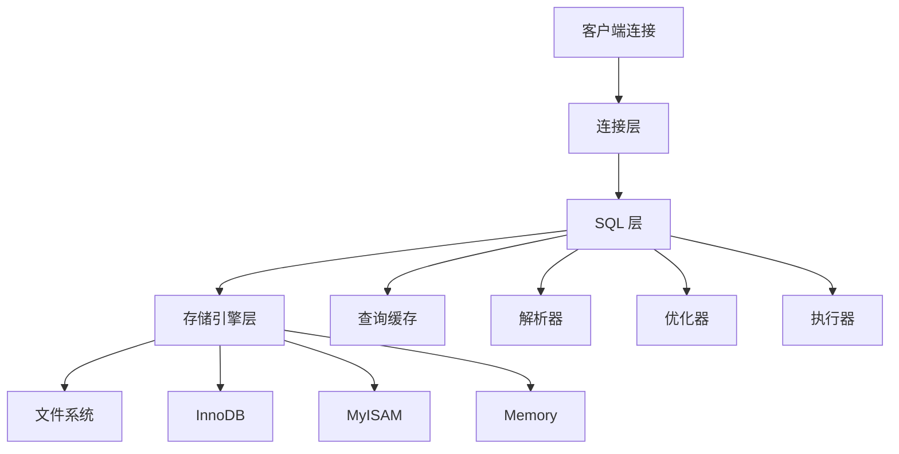

# 🐬 MySQL 数据库完全指南

> MySQL 是世界上最流行的开源关系型数据库管理系统，以其高性能、可靠性和易用性著称。本指南将带你深入了解 MySQL 的核心概念和实战技巧。

## 🎯 MySQL 概述

### 📊 MySQL 核心特性

| 特性 | 描述 | 优势 |
|------|------|------|
| **开源免费** | 完全开源的数据库系统 | 💰 降低成本 |
| **高性能** | 优化的查询引擎 | ⚡ 快速响应 |
| **可扩展性** | 支持集群和分片 | 📈 易于扩展 |
| **跨平台** | 支持多种操作系统 | 🌐 部署灵活 |
| **ACID 支持** | 完整的事务特性 | 🛡️ 数据安全 |

### 🏗️ MySQL 架构概览



## 🔗 连接 MySQL

### 🚀 基础连接

```bash
# 连接格式
mysql -h 主机地址 -u 用户名 -p 密码 -P 端口号

# 连接本机 MySQL
mysql -uroot -proot

# 连接远程 MySQL
mysql -h10.0.0.10 -uroot -proot -P3306

# 使用数据库
mysql> use test;

# 执行 SQL 文件
mysql> source /home/test/database.sql;
```

### ⚙️ 连接参数详解

| 参数 | 说明 | 示例 | 默认值 |
|------|------|------|--------|
| `-h` | 主机地址 | `-h127.0.0.1` | localhost |
| `-u` | 用户名 | `-uroot` | 当前系统用户 |
| `-p` | 密码 | `-ppassword` | 无 |
| `-P` | 端口号 | `-P3306` | 3306 |
| `-D` | 数据库名 | `-Dmydb` | 无 |

### 🔧 连接故障排除

```bash
# 进入 MySQL 安装目录 bin
cd /d "D:\Program Files\MySQL\MySQL Server 8.0\bin"
# 或使用 Docker
docker exec -it mysql-container /bin/bash

# 登录 root 用户
mysql -u root -p

# 查看 MySQL 用户配置
use mysql;
select host from user where user='root';

# 设置远程连接权限（仅开发环境）
update user set host = '%' where user ='root';
flush privileges;
```

## 📊 数据类型详解

### 🔢 整型数据类型

| 类型 | 字节 | 有符号范围 | 无符号范围 | 用途 |
|------|------|------------|------------|------|
| **TINYINT** | 1 | -128 ~ 127 | 0 ~ 255 | 🔴 状态标识 |
| **SMALLINT** | 2 | -32,768 ~ 32,767 | 0 ~ 65,535 | 📊 小数值 |
| **MEDIUMINT** | 3 | -8,388,608 ~ 8,388,607 | 0 ~ 16,777,215 | 📈 中等数值 |
| **INT** | 4 | -2,147,483,648 ~ 2,147,483,647 | 0 ~ 4,294,967,295 | 🎯 主键/外键 |
| **BIGINT** | 8 | -9,223,372,036,854,775,808 ~ 9,223,372,036,854,775,807 | 0 ~ 18,446,744,073,709,551,615 | 📏 大数值 |

### 💰 浮点数据类型

| 类型 | 字节 | 精度 | 用途 | 示例 |
|------|------|------|------|------|
| **FLOAT** | 4 | 单精度 | 🔸 一般浮点数 | 3.14159 |
| **DOUBLE** | 8 | 双精度 | 🔹 高精度浮点数 | 3.141592653589793 |
| **DECIMAL(M,D)** | 变长 | 精确小数 | 💰 金额计算 | DECIMAL(10,2) |

### 📅 日期时间类型

| 类型 | 字节 | 格式 | 范围 | 用途 |
|------|------|------|------|------|
| **DATE** | 3 | YYYY-MM-DD | 1000-01-01 ~ 9999-12-31 | 📅 日期 |
| **TIME** | 3 | HH:MM:SS | -838:59:59 ~ 838:59:59 | ⏰ 时间 |
| **DATETIME** | 8 | YYYY-MM-DD HH:MM:SS | 1000-01-01 00:00:00 ~ 9999-12-31 23:59:59 | 📆 日期时间 |
| **TIMESTAMP** | 4 | YYYY-MM-DD HH:MM:SS | 1970-01-01 00:00:01 ~ 2038-01-19 03:14:07 | ⏱️ 时间戳 |
| **YEAR** | 1 | YYYY | 1901 ~ 2155 | 📊 年份 |

### 📝 字符串类型

| 类型 | 最大长度 | 特点 | 用途 | 示例 |
|------|----------|------|------|------|
| **CHAR(M)** | 255 字符 | 定长，空格填充 | 🔤 固定长度字符串 | CHAR(10) |
| **VARCHAR(M)** | 65,535 字节 | 变长，节省空间 | 📝 可变长度字符串 | VARCHAR(255) |
| **TEXT** | 65,535 字节 | 长文本 | 📄 文章内容 | TEXT |
| **LONGTEXT** | 4GB | 超长文本 | 📚 大型文档 | LONGTEXT |

### 🎯 特殊类型说明

```sql
-- 布尔类型（实际是 TINYINT）
CREATE TABLE test_bool (
    id INT AUTO_INCREMENT PRIMARY KEY,
    is_active BOOLEAN DEFAULT TRUE,  -- 存储为 TINYINT(1)
    status TINYINT(1) DEFAULT 1      -- 0=false, 1=true
);

-- 无符号整型
CREATE TABLE test_unsigned (
    id INT UNSIGNED AUTO_INCREMENT PRIMARY KEY,  -- 只存储正数
    count BIGINT UNSIGNED DEFAULT 0
);

-- 精确小数
CREATE TABLE products (
    id INT AUTO_INCREMENT PRIMARY KEY,
    price DECIMAL(10,2) NOT NULL,  -- 最多10位数字，2位小数
    weight FLOAT(7,2)              -- 总共7位，2位小数
);
```

## 🔧 SQL 函数大全

### 📊 聚合函数

| 函数 | 功能 | 语法 | 示例 |
|------|------|------|------|
| **COUNT()** | 计数 | COUNT(column) | `SELECT COUNT(*) FROM users` |
| **SUM()** | 求和 | SUM(column) | `SELECT SUM(salary) FROM employees` |
| **AVG()** | 平均值 | AVG(column) | `SELECT AVG(age) FROM users` |
| **MAX()** | 最大值 | MAX(column) | `SELECT MAX(created_at) FROM posts` |
| **MIN()** | 最小值 | MIN(column) | `SELECT MIN(price) FROM products` |

### 📝 字符串函数

| 函数 | 功能 | 语法 | 示例 |
|------|------|------|------|
| **CONCAT()** | 字符串连接 | CONCAT(str1, str2, ...) | `SELECT CONCAT(first_name, ' ', last_name) AS full_name` |
| **LENGTH()** | 字符串长度 | LENGTH(str) | `SELECT LENGTH('Hello World')` -- 返回 11 |
| **SUBSTRING()** | 截取字符串 | SUBSTRING(str, pos, len) | `SELECT SUBSTRING('Hello World', 1, 5)` -- 返回 'Hello' |
| **UPPER()** | 转大写 | UPPER(str) | `SELECT UPPER('hello')` -- 返回 'HELLO' |
| **LOWER()** | 转小写 | LOWER(str) | `SELECT LOWER('WORLD')` -- 返回 'world' |
| **TRIM()** | 去除空格 | TRIM(str) | `SELECT TRIM('  hello  ')` -- 返回 'hello' |
| **REPLACE()** | 替换字符串 | REPLACE(str, from_str, to_str) | `SELECT REPLACE('Hello World', 'World', 'MySQL')` |

### 📅 日期时间函数

| 函数 | 功能 | 语法 | 示例 |
|------|------|------|------|
| **NOW()** | 当前日期时间 | NOW() | `SELECT NOW()` -- 2024-01-15 10:30:45 |
| **CURDATE()** | 当前日期 | CURDATE() | `SELECT CURDATE()` -- 2024-01-15 |
| **CURTIME()** | 当前时间 | CURTIME() | `SELECT CURTIME()` -- 10:30:45 |
| **DATE_FORMAT()** | 格式化日期 | DATE_FORMAT(date, format) | `SELECT DATE_FORMAT(NOW(), '%Y-%m-%d')` |
| **DATEDIFF()** | 日期差值 | DATEDIFF(date1, date2) | `SELECT DATEDIFF('2024-01-15', '2024-01-01')` -- 14 |
| **DATE_ADD()** | 日期加法 | DATE_ADD(date, INTERVAL expr unit) | `SELECT DATE_ADD(NOW(), INTERVAL 7 DAY)` |

### 🔢 数学函数

| 函数 | 功能 | 语法 | 示例 |
|------|------|------|------|
| **ABS()** | 绝对值 | ABS(number) | `SELECT ABS(-10)` -- 返回 10 |
| **ROUND()** | 四舍五入 | ROUND(number, decimals) | `SELECT ROUND(3.14159, 2)` -- 返回 3.14 |
| **CEIL()** | 向上取整 | CEIL(number) | `SELECT CEIL(3.14)` -- 返回 4 |
| **FLOOR()** | 向下取整 | FLOOR(number) | `SELECT FLOOR(3.14)` -- 返回 3 |
| **RAND()** | 随机数 | RAND() | `SELECT RAND()` -- 返回 0-1 之间的随机数 |
| **POW()** | 幂运算 | POW(base, exp) | `SELECT POW(2, 3)` -- 返回 8 |

### 🔄 条件函数

| 函数 | 功能 | 语法 | 示例 |
|------|------|------|------|
| **IF()** | 条件判断 | IF(condition, true_value, false_value) | `SELECT IF(age >= 18, '成年', '未成年') FROM users` |
| **CASE** | 多条件判断 | CASE WHEN condition THEN result END | `SELECT CASE WHEN score >= 90 THEN 'A' WHEN score >= 80 THEN 'B' ELSE 'C' END` |
| **IFNULL()** | 空值处理 | IFNULL(expr1, expr2) | `SELECT IFNULL(phone, '未填写') FROM users` |
| **COALESCE()** | 返回第一个非空值 | COALESCE(value1, value2, ...) | `SELECT COALESCE(mobile, phone, '无联系方式')` |

## 📤 数据导入导出

### 📤 数据导出

```bash
# 导出整个数据库
mysqldump -u用户名 -h主机 -p密码 -P端口 数据库名 > 导出文件.sql

# 导出指定表
mysqldump -uroot -h127.0.0.1 -proot -P3306 education users > d:/users.sql

# 导出表结构（不含数据）
mysqldump -uroot -proot --no-data education > structure.sql

# 导出数据（不含表结构）
mysqldump -uroot -proot --no-create-info education > data.sql

# 导出多个数据库
mysqldump -uroot -proot --databases db1 db2 > multiple_dbs.sql

# 导出所有数据库
mysqldump -uroot -proot --all-databases > all_dbs.sql
```

### 📥 数据导入

```bash
# 方法一：命令行导入
mysql -uroot -proot database_name < backup.sql

# 方法二：MySQL 内导入
mysql> use database_name;
mysql> source /path/to/backup.sql;

# 方法三：指定字符集导入
mysql -uroot -proot --default-character-set=utf8 database_name < backup.sql
```

### 📋 导入导出选项

| 选项 | 功能 | 使用场景 |
|------|------|----------|
| `--single-transaction` | 事务导出 | 🔒 InnoDB 表一致性 |
| `--lock-tables` | 锁表导出 | 🔐 MyISAM 表一致性 |
| `--where="condition"` | 条件导出 | 🎯 部分数据导出 |
| `--compress` | 压缩传输 | 🌐 网络传输优化 |
| `--hex-blob` | 二进制数据 | 📁 BLOB 字段处理 |

## 📚 SQL 语法基础

### 🏗️ 数据库操作

```sql
-- 创建数据库
CREATE DATABASE IF NOT EXISTS myblog 
CHARACTER SET utf8mb4 
COLLATE utf8mb4_unicode_ci;

-- 查看数据库列表
SHOW DATABASES;

-- 选择数据库
USE myblog;

-- 查看当前数据库
SELECT DATABASE();

-- 修改数据库字符集
ALTER DATABASE myblog CHARACTER SET utf8mb4 COLLATE utf8mb4_unicode_ci;

-- 删除数据库
DROP DATABASE IF EXISTS myblog;
```

### 🏗️ 数据表操作

```sql
-- 创建用户表
CREATE TABLE IF NOT EXISTS users (
    id INT AUTO_INCREMENT PRIMARY KEY COMMENT '用户ID',
    username VARCHAR(50) NOT NULL UNIQUE COMMENT '用户名',
    password VARCHAR(255) NOT NULL COMMENT '密码',
    email VARCHAR(100) UNIQUE COMMENT '邮箱',
    realname VARCHAR(20) NOT NULL COMMENT '真实姓名',
    avatar VARCHAR(255) DEFAULT NULL COMMENT '头像',
    status TINYINT DEFAULT 1 COMMENT '状态：1-正常，0-禁用',
    created_at TIMESTAMP DEFAULT CURRENT_TIMESTAMP COMMENT '创建时间',
    updated_at TIMESTAMP DEFAULT CURRENT_TIMESTAMP ON UPDATE CURRENT_TIMESTAMP COMMENT '更新时间',
    INDEX idx_username (username),
    INDEX idx_email (email),
    INDEX idx_status (status)
) ENGINE=InnoDB DEFAULT CHARSET=utf8mb4 COLLATE=utf8mb4_unicode_ci COMMENT='用户表';

-- 创建博客表（带外键）
CREATE TABLE IF NOT EXISTS blogs (
    id INT AUTO_INCREMENT PRIMARY KEY COMMENT '博客ID',
    title VARCHAR(200) NOT NULL COMMENT '标题',
    content LONGTEXT NOT NULL COMMENT '内容',
    summary TEXT COMMENT '摘要',
    author_id INT NOT NULL COMMENT '作者ID',
    category_id INT DEFAULT NULL COMMENT '分类ID',
    tags JSON DEFAULT NULL COMMENT '标签',
    view_count INT DEFAULT 0 COMMENT '浏览次数',
    like_count INT DEFAULT 0 COMMENT '点赞次数',
    is_published TINYINT DEFAULT 0 COMMENT '是否发布：1-已发布，0-草稿',
    published_at TIMESTAMP NULL COMMENT '发布时间',
    created_at TIMESTAMP DEFAULT CURRENT_TIMESTAMP COMMENT '创建时间',
    updated_at TIMESTAMP DEFAULT CURRENT_TIMESTAMP ON UPDATE CURRENT_TIMESTAMP COMMENT '更新时间',
    
    -- 索引
    INDEX idx_author (author_id),
    INDEX idx_category (category_id),
    INDEX idx_published (is_published),
    INDEX idx_created_at (created_at),
    FULLTEXT idx_title_content (title, content),
    
    -- 外键约束
    FOREIGN KEY (author_id) REFERENCES users(id) ON DELETE CASCADE ON UPDATE CASCADE
) ENGINE=InnoDB DEFAULT CHARSET=utf8mb4 COLLATE=utf8mb4_unicode_ci COMMENT='博客表';
```

### 📝 表结构操作

```sql
-- 查看表结构
SHOW TABLES;
SHOW COLUMNS FROM blogs;
DESCRIBE users;

-- 添加列
ALTER TABLE users ADD COLUMN phone VARCHAR(20) COMMENT '手机号';
ALTER TABLE users ADD COLUMN birth_date DATE COMMENT '出生日期';

-- 修改列
ALTER TABLE users MODIFY COLUMN phone VARCHAR(15);
ALTER TABLE users CHANGE COLUMN realname real_name VARCHAR(30);

-- 删除列
ALTER TABLE users DROP COLUMN birth_date;

-- 添加索引
ALTER TABLE users ADD INDEX idx_phone (phone);
ALTER TABLE users ADD UNIQUE KEY uk_phone (phone);

-- 删除索引
ALTER TABLE users DROP INDEX idx_phone;

-- 重命名表
ALTER TABLE users RENAME TO user_info;
```

## 🎯 数据操作 (CRUD)

### ➕ 插入数据 (CREATE)

```sql
-- 基础插入
INSERT INTO users (username, password, email, realname) 
VALUES ('john_doe', 'hashed_password', 'john@example.com', 'John Doe');

-- 批量插入
INSERT INTO users (username, password, email, realname) VALUES
('alice', 'password1', 'alice@example.com', 'Alice Smith'),
('bob', 'password2', 'bob@example.com', 'Bob Johnson'),
('charlie', 'password3', 'charlie@example.com', 'Charlie Brown');

-- 插入并忽略重复
INSERT IGNORE INTO users (username, password, email, realname) 
VALUES ('john_doe', 'new_password', 'john2@example.com', 'John Doe');

-- 插入或更新 (ON DUPLICATE KEY UPDATE)
INSERT INTO users (username, password, email, realname) 
VALUES ('john_doe', 'updated_password', 'john_new@example.com', 'John Doe Updated')
ON DUPLICATE KEY UPDATE 
    password = VALUES(password),
    email = VALUES(email),
    updated_at = CURRENT_TIMESTAMP;

-- 从其他表插入数据
INSERT INTO user_backup (username, email, realname)
SELECT username, email, realname FROM users WHERE status = 1;
```

### 🔍 查询数据 (READ)

```sql
-- 基础查询
SELECT * FROM users;
SELECT id, username, email FROM users;

-- 条件查询
SELECT * FROM users WHERE status = 1;
SELECT * FROM users WHERE username = 'john_doe';
SELECT * FROM users WHERE age BETWEEN 18 AND 65;
SELECT * FROM users WHERE email LIKE '%@gmail.com';
SELECT * FROM users WHERE created_at >= '2024-01-01';

-- 逻辑操作符
SELECT * FROM users WHERE username = 'john' AND status = 1;
SELECT * FROM users WHERE age < 18 OR age > 65;
SELECT * FROM users WHERE username IN ('john', 'alice', 'bob');
SELECT * FROM users WHERE email IS NOT NULL;

-- 排序和分页
SELECT * FROM users ORDER BY created_at DESC;
SELECT * FROM users ORDER BY username ASC, created_at DESC;
SELECT * FROM users LIMIT 10;                    -- 前10条
SELECT * FROM users LIMIT 10 OFFSET 20;          -- 跳过20条，取10条
SELECT * FROM users LIMIT 20, 10;                -- 从第21条开始，取10条

-- 分组和聚合
SELECT status, COUNT(*) as user_count FROM users GROUP BY status;
SELECT DATE(created_at) as date, COUNT(*) as daily_users 
FROM users 
GROUP BY DATE(created_at) 
HAVING COUNT(*) > 5
ORDER BY date DESC;

-- 子查询
SELECT * FROM blogs WHERE author_id IN (
    SELECT id FROM users WHERE status = 1
);

-- 连接查询
SELECT u.username, b.title, b.created_at
FROM users u
INNER JOIN blogs b ON u.id = b.author_id
WHERE u.status = 1 AND b.is_published = 1;

-- 左连接
SELECT u.username, COUNT(b.id) as blog_count
FROM users u
LEFT JOIN blogs b ON u.id = b.author_id
GROUP BY u.id, u.username;
```

### 🔄 更新数据 (UPDATE)

```sql
-- 基础更新
UPDATE users SET realname = 'John Smith' WHERE username = 'john_doe';

-- 批量更新
UPDATE users SET status = 0 WHERE created_at < '2023-01-01';

-- 多字段更新
UPDATE users SET 
    realname = 'John Smith Updated',
    email = 'john.smith@example.com',
    updated_at = CURRENT_TIMESTAMP
WHERE id = 1;

-- 基于计算的更新
UPDATE blogs SET view_count = view_count + 1 WHERE id = 1;

-- 连接更新
UPDATE users u
INNER JOIN (
    SELECT author_id, COUNT(*) as blog_count
    FROM blogs
    GROUP BY author_id
) b ON u.id = b.author_id
SET u.blog_count = b.blog_count;

-- 条件更新
UPDATE users SET status = CASE 
    WHEN last_login < '2023-01-01' THEN 0
    WHEN last_login < '2024-01-01' THEN 2
    ELSE 1
END;
```

### 🗑️ 删除数据 (DELETE)

```sql
-- 基础删除
DELETE FROM users WHERE id = 1;

-- 条件删除
DELETE FROM users WHERE status = 0 AND created_at < '2023-01-01';

-- 连接删除
DELETE u FROM users u
INNER JOIN blogs b ON u.id = b.author_id
WHERE b.is_published = 0;

-- 清空表（保留结构）
TRUNCATE TABLE temp_data;

-- 删除表
DROP TABLE IF EXISTS temp_table;
```

## 🔍 高级查询技巧

### 🔗 连接查询详解

| 连接类型 | 语法 | 特点 | 使用场景 |
|----------|------|------|----------|
| **INNER JOIN** | `A INNER JOIN B ON condition` | 只返回匹配的记录 | 🎯 获取完整关联数据 |
| **LEFT JOIN** | `A LEFT JOIN B ON condition` | 返回左表所有记录 | 📋 主表数据 + 关联信息 |
| **RIGHT JOIN** | `A RIGHT JOIN B ON condition` | 返回右表所有记录 | 📊 以右表为主的查询 |
| **FULL OUTER JOIN** | `A FULL OUTER JOIN B ON condition` | 返回两表所有记录 | 🔄 完整数据合并 |

```sql
-- 复杂连接查询示例
SELECT 
    u.username,
    u.email,
    p.title as profile_title,
    COUNT(b.id) as blog_count,
    MAX(b.created_at) as last_blog_date,
    AVG(b.view_count) as avg_views
FROM users u
LEFT JOIN user_profiles p ON u.id = p.user_id
LEFT JOIN blogs b ON u.id = b.author_id AND b.is_published = 1
WHERE u.status = 1
GROUP BY u.id, u.username, u.email, p.title
HAVING blog_count > 0
ORDER BY blog_count DESC, last_blog_date DESC
LIMIT 20;
```

### 📊 窗口函数 (MySQL 8.0+)

```sql
-- 排名函数
SELECT 
    username,
    view_count,
    ROW_NUMBER() OVER (ORDER BY view_count DESC) as row_num,
    RANK() OVER (ORDER BY view_count DESC) as rank_num,
    DENSE_RANK() OVER (ORDER BY view_count DESC) as dense_rank_num
FROM blogs;

-- 分组排名
SELECT 
    category_id,
    title,
    view_count,
    ROW_NUMBER() OVER (PARTITION BY category_id ORDER BY view_count DESC) as category_rank
FROM blogs;

-- 累计计算
SELECT 
    created_at,
    title,
    view_count,
    SUM(view_count) OVER (ORDER BY created_at) as cumulative_views,
    AVG(view_count) OVER (ORDER BY created_at ROWS BETWEEN 2 PRECEDING AND CURRENT ROW) as moving_avg
FROM blogs
ORDER BY created_at;
```

### 🎯 复杂查询示例

```sql
-- 查找每个分类下最受欢迎的博客
WITH CategoryTopBlogs AS (
    SELECT 
        category_id,
        title,
        view_count,
        ROW_NUMBER() OVER (PARTITION BY category_id ORDER BY view_count DESC) as rn
    FROM blogs
    WHERE is_published = 1
)
SELECT 
    c.name as category_name,
    ctb.title,
    ctb.view_count
FROM CategoryTopBlogs ctb
JOIN categories c ON ctb.category_id = c.id
WHERE ctb.rn = 1;

-- 查找活跃用户（最近30天发布过博客的用户）
SELECT 
    u.username,
    u.email,
    COUNT(b.id) as recent_blogs,
    MAX(b.created_at) as last_blog_date
FROM users u
INNER JOIN blogs b ON u.id = b.author_id
WHERE b.created_at >= DATE_SUB(NOW(), INTERVAL 30 DAY)
    AND b.is_published = 1
GROUP BY u.id, u.username, u.email
ORDER BY recent_blogs DESC;
```

## 🎯 最佳实践

### ✅ SQL 编写规范

1. **📝 命名规范**
   ```sql
   -- 推荐：使用小写字母和下划线
   CREATE TABLE user_profiles (
       user_id INT,
       first_name VARCHAR(50),
       last_name VARCHAR(50),
       created_at TIMESTAMP
   );
   
   -- 避免：使用驼峰命名或大写
   CREATE TABLE UserProfiles (
       UserId INT,
       FirstName VARCHAR(50)
   );
   ```

2. **🔍 索引优化**
   ```sql
   -- 为常用查询字段添加索引
   CREATE INDEX idx_users_email ON users(email);
   CREATE INDEX idx_blogs_author_published ON blogs(author_id, is_published);
   
   -- 复合索引的字段顺序很重要
   CREATE INDEX idx_blogs_status_date ON blogs(is_published, created_at);
   ```

3. **🛡️ 数据完整性**
   ```sql
   -- 使用外键约束
   ALTER TABLE blogs 
   ADD CONSTRAINT fk_blogs_author 
   FOREIGN KEY (author_id) REFERENCES users(id) 
   ON DELETE CASCADE ON UPDATE CASCADE;
   
   -- 使用检查约束 (MySQL 8.0.16+)
   ALTER TABLE users 
   ADD CONSTRAINT chk_users_age 
   CHECK (age >= 0 AND age <= 150);
   ```

### 🚀 性能优化

#### 🔍 查询优化技巧

```sql
-- 使用 EXPLAIN 分析查询
EXPLAIN SELECT * FROM users WHERE email = 'john@example.com';

-- 避免 SELECT *，只查询需要的字段
SELECT id, username, email FROM users WHERE status = 1;

-- 使用 LIMIT 限制结果集
SELECT * FROM blogs ORDER BY created_at DESC LIMIT 20;

-- 使用索引覆盖
SELECT id, title FROM blogs WHERE is_published = 1;  -- 如果有索引(is_published, id, title)
```

#### 💾 存储优化

```sql
-- 选择合适的数据类型
CREATE TABLE optimized_table (
    id INT UNSIGNED AUTO_INCREMENT PRIMARY KEY,  -- 无符号整型节省空间
    status TINYINT NOT NULL DEFAULT 1,           -- 状态用 TINYINT
    price DECIMAL(10,2) NOT NULL,                -- 金额用 DECIMAL
    created_at TIMESTAMP DEFAULT CURRENT_TIMESTAMP
);

-- 使用合适的字符集
CREATE TABLE utf8_table (
    content TEXT
) CHARACTER SET utf8mb4 COLLATE utf8mb4_unicode_ci;
```

### 🔒 安全实践

```sql
-- 创建专用用户，避免使用 root
CREATE USER 'app_user'@'%' IDENTIFIED BY 'strong_password';
GRANT SELECT, INSERT, UPDATE, DELETE ON myapp.* TO 'app_user'@'%';

-- 定期备份
-- 使用 mysqldump 或 MySQL Enterprise Backup

-- 启用慢查询日志
SET GLOBAL slow_query_log = 'ON';
SET GLOBAL long_query_time = 2;
```

## 🔗 相关资源

### 📚 学习资源

- [MySQL 官方文档](https://dev.mysql.com/doc/)
- [MySQL 性能调优指南](https://dev.mysql.com/doc/refman/8.0/en/optimization.html)
- [MySQL Workbench](https://www.mysql.com/products/workbench/) - 图形化管理工具

### 🛠️ 实用工具

- [phpMyAdmin](https://www.phpmyadmin.net/) - Web 管理界面
- [MySQL Shell](https://dev.mysql.com/doc/mysql-shell/8.0/en/) - 现代化命令行工具
- [Percona Toolkit](https://www.percona.com/software/database-tools/percona-toolkit) - 性能分析工具

---

::: tip 🎉 总结
MySQL 是功能强大的关系型数据库，掌握其核心概念、SQL 语法和优化技巧对于构建高性能应用至关重要。通过合理的设计、规范的编码和持续的优化，可以充分发挥 MySQL 的潜力。
:::
