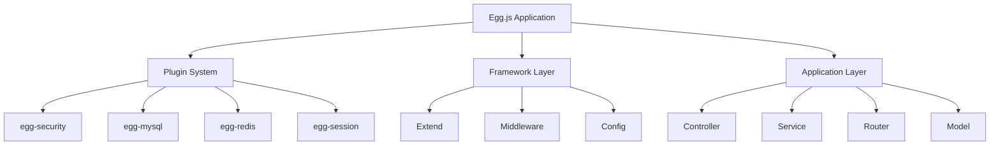

# 🥚 Egg.js 企业级框架详解

> Egg.js 是阿里巴巴开源的企业级 Node.js 框架，基于 Koa 2 构建，专为企业级应用而设计。它提供了完整的开发规范、插件机制和约定配置，帮助开发者快速构建高质量的企业级应用。

## 🎯 Egg.js 概述

### 📊 核心特性

| 特性 | 描述 | 优势 |
|------|------|------|
| **约定配置** | 约定大于配置的设计理念 | 🎯 减少配置工作量 |
| **插件机制** | 强大的插件生态系统 | 🔧 功能模块化扩展 |
| **多进程模型** | 基于 Cluster 的多进程架构 | 🚀 高性能和稳定性 |
| **渐进式开发** | 从简单到复杂的开发体验 | 📈 学习成本低 |
| **TypeScript** | 完整的 TypeScript 支持 | 💪 类型安全 |

### 🏗️ Egg.js vs 其他框架

| 框架 | 特点 | 适用场景 | 企业级特性 |
|------|------|----------|------------|
| **Egg.js** | 企业级、约定配置 | 🏢 大型企业应用 | ⭐⭐⭐⭐⭐ |
| **Express** | 简单、灵活 | 🌟 中小型项目 | ⭐⭐ |
| **Koa** | 轻量、现代 | 🎯 定制化需求 | ⭐⭐⭐ |
| **NestJS** | 装饰器、依赖注入 | 🚀 TypeScript 优先 | ⭐⭐⭐⭐ |

### 🌟 Egg.js 架构图



## 🚀 快速开始

### 📦 项目初始化

```bash
# 推荐使用脚手架快速生成项目
npm init egg --type=simple

# 或者逐步搭建
mkdir egg-example
cd egg-example
npm init
npm i egg --save
npm i egg-bin --save-dev
```

### 📁 项目结构

```
egg-project/
├── 📁 app/
│   ├── 📁 controller/         # 控制器
│   │   └── 📄 home.js
│   ├── 📁 extend/             # 扩展
│   │   ├── 📄 application.js
│   │   ├── 📄 context.js
│   │   ├── 📄 request.js
│   │   ├── 📄 response.js
│   │   └── 📄 helper.js
│   ├── 📁 middleware/         # 中间件
│   │   └── 📄 robot.js
│   ├── 📁 service/            # 服务层
│   │   └── 📄 news.js
│   ├── 📁 model/              # 数据模型
│   ├── 📁 view/               # 模板文件
│   │   └── 📄 home.tpl
│   └── 📄 router.js           # 路由配置
├── 📁 config/                 # 配置文件
│   ├── 📄 config.default.js
│   ├── 📄 config.prod.js
│   ├── 📄 config.test.js
│   └── 📄 plugin.js
├── 📁 test/                   # 测试文件
├── 📄 package.json
└── 📄 README.md
```

### ⚙️ package.json 配置

```json
{
  "name": "egg-example",
  "version": "1.0.0",
  "description": "Egg.js 企业级应用示例",
  "private": true,
  "egg": {
    "declarations": true
  },
  "dependencies": {
    "egg": "^3.0.0",
    "egg-scripts": "^2.0.0"
  },
  "devDependencies": {
    "egg-bin": "^5.0.0",
    "egg-ci": "^2.0.0",
    "egg-mock": "^5.0.0",
    "eslint": "^8.0.0",
    "eslint-config-egg": "^12.0.0"
  },
  "engines": {
    "node": ">=16.0.0"
  },
  "scripts": {
    "start": "egg-scripts start --daemon --title=egg-server-egg-example",
    "stop": "egg-scripts stop --title=egg-server-egg-example",
    "dev": "egg-bin dev",
    "debug": "egg-bin debug",
    "test": "npm run lint -- --fix && npm run test-local",
    "test-local": "egg-bin test",
    "cov": "egg-bin cov",
    "lint": "eslint .",
    "ci": "npm run lint && npm run cov"
  }
}
```

### 🔧 基础配置

```javascript
// config/config.default.js
/* eslint valid-jsdoc: "off" */

/**
 * @param {Egg.EggAppInfo} appInfo app info
 */
module.exports = appInfo => {
  const config = exports = {}

  // 用于 cookie 安全字符串
  config.keys = appInfo.name + '_1234567890_abcdef'

  // 中间件配置
  config.middleware = ['robot']

  // 机器人访问限制中间件配置
  config.robot = {
    ua: [/Baiduspider/i]
  }

  // 安全配置
  config.security = {
    csrf: {
      enable: false
    }
  }

  // 模板引擎配置
  config.view = {
    defaultViewEngine: 'nunjucks',
    mapping: {
      '.tpl': 'nunjucks'
    }
  }

  // 业务配置
  config.news = {
    pageSize: 5,
    serverUrl: 'https://hacker-news.firebaseio.com/v0'
  }

  // 用户自定义配置
  const userConfig = {
    // myAppName: 'egg'
  }

  return {
    ...config,
    ...userConfig
  }
}
```

## 🔌 插件系统

### 📚 插件概念

Egg.js 的插件机制是其核心特性之一，一个插件可以包含：

- **extend**：扩展基础对象的上下文
- **middleware**：加入中间件
- **config**：配置默认选项

### 🛠️ 插件配置

```javascript
// config/plugin.js
'use strict'

/** @type Egg.EggPlugin */
module.exports = {
  // 模板引擎插件
  nunjucks: {
    enable: true,
    package: 'egg-view-nunjucks'
  },
  
  // MySQL 数据库插件
  mysql: {
    enable: true,
    package: 'egg-mysql'
  },
  
  // Redis 缓存插件
  redis: {
    enable: true,
    package: 'egg-redis'
  },
  
  // Session 插件
  session: {
    enable: true,
    package: 'egg-session'
  },
  
  // 安全插件
  security: {
    enable: true,
    package: 'egg-security'
  },
  
  // 参数验证插件
  validate: {
    enable: true,
    package: 'egg-validate'
  }
}
```

### 🎯 常用插件示例

```javascript
// 安装和配置 MySQL 插件
npm i egg-mysql --save

// config/plugin.js
exports.mysql = {
  enable: true,
  package: 'egg-mysql'
}

// config/config.default.js
exports.mysql = {
  // 单数据库信息配置
  client: {
    host: 'localhost',
    port: '3306',
    user: 'root',
    password: 'password',
    database: 'test'
  },
  // 是否加载到 app 上，默认开启
  app: true,
  // 是否加载到 agent 上，默认关闭
  agent: false
}

// 在 Service 中使用
class UserService extends Service {
  async find(uid) {
    const user = await this.app.mysql.get('users', { id: uid })
    return user
  }
}
```

## 🎨 扩展机制

### 🔧 Context 扩展

```javascript
// app/extend/context.js
module.exports = {
  // 添加 isIOS 属性
  get isIOS() {
    const iosReg = /iphone|ipad|ipod/i
    return iosReg.test(this.get('user-agent'))
  },
  
  // 添加成功响应方法
  success(data, message = 'success') {
    this.body = {
      code: 200,
      data,
      message
    }
  },
  
  // 添加错误响应方法
  error(code = 500, message = 'Internal Server Error') {
    this.status = code
    this.body = {
      code,
      message
    }
  }
}
```

### 🛠️ Helper 扩展

```javascript
// app/extend/helper.js
const moment = require('moment')

module.exports = {
  // 时间格式化
  relativeTime(time) {
    return moment(new Date(time * 1000)).fromNow()
  },
  
  // 金额格式化
  formatMoney(amount) {
    return '¥' + amount.toFixed(2)
  },
  
  // 安全的 JSON 解析
  safeJsonParse(str, defaultValue = null) {
    try {
      return JSON.parse(str)
    } catch (e) {
      return defaultValue
    }
  }
}
```

### 🚀 Application 扩展

```javascript
// app/extend/application.js
module.exports = {
  // 获取当前时间戳
  get currentTime() {
    return Date.now()
  },
  
  // 生成唯一 ID
  generateId() {
    return Date.now().toString(36) + Math.random().toString(36).substr(2)
  }
}
```

## 🎮 控制器（Controller）

### 📝 基础控制器

```javascript
// app/controller/home.js
'use strict'

const Controller = require('egg').Controller

class HomeController extends Controller {
  async index() {
    const { ctx } = this
    ctx.body = 'Hello Egg.js!'
  }
  
  async user() {
    const { ctx } = this
    const { id } = ctx.params
    
    try {
      const user = await ctx.service.user.find(id)
      ctx.success(user)
    } catch (error) {
      ctx.error(500, error.message)
    }
  }
}

module.exports = HomeController
```

### 🗞️ 新闻控制器示例

```javascript
// app/controller/news.js
'use strict'

const Controller = require('egg').Controller

class NewsController extends Controller {
  async list() {
    const { ctx } = this
    const page = ctx.query.page || 1
    
    try {
      const newsList = await ctx.service.news.list(page)
      await ctx.render('news/list.tpl', { 
        list: newsList,
        page
      })
    } catch (error) {
      ctx.logger.error('获取新闻列表失败:', error)
      ctx.error(500, '获取新闻列表失败')
    }
  }
  
  async detail() {
    const { ctx } = this
    const { id } = ctx.params
    
    try {
      const news = await ctx.service.news.find(id)
      if (!news) {
        ctx.error(404, '新闻不存在')
        return
      }
      
      await ctx.render('news/detail.tpl', { news })
    } catch (error) {
      ctx.logger.error('获取新闻详情失败:', error)
      ctx.error(500, '获取新闻详情失败')
    }
  }
}

module.exports = NewsController
```

## 🔧 服务层（Service）

### 📰 新闻服务

```javascript
// app/service/news.js
'use strict'

const Service = require('egg').Service

class NewsService extends Service {
  async list(page = 1) {
    const { ctx } = this
    const { serverUrl, pageSize } = this.config.news
    
    try {
      // 获取新闻 ID 列表
      const { data: idList } = await ctx.curl(
        `${serverUrl}/topstories.json`,
        {
          data: {
            orderBy: '"$key"',
            startAt: `"${pageSize * (page - 1)}"`,
            endAt: `"${pageSize * page - 1}"`
          },
          dataType: 'json'
        }
      )
      
      // 并行获取新闻详情
      const newsList = await Promise.all(
        Object.keys(idList).map(key => {
          const url = `${serverUrl}/item/${idList[key]}.json`
          return ctx.curl(url, { dataType: 'json' })
        })
      )
      
      return newsList.map(res => res.data)
    } catch (error) {
      ctx.logger.error('获取新闻列表失败:', error)
      throw error
    }
  }
  
  async find(id) {
    const { ctx } = this
    const { serverUrl } = this.config.news
    
    try {
      const { data } = await ctx.curl(
        `${serverUrl}/item/${id}.json`,
        { dataType: 'json' }
      )
      
      return data
    } catch (error) {
      ctx.logger.error('获取新闻详情失败:', error)
      throw error
    }
  }
}

module.exports = NewsService
```

### 👤 用户服务

```javascript
// app/service/user.js
'use strict'

const Service = require('egg').Service

class UserService extends Service {
  async find(uid) {
    const { ctx } = this
    
    try {
      const user = await ctx.app.mysql.get('users', { id: uid })
      return user
    } catch (error) {
      ctx.logger.error('查询用户失败:', error)
      throw error
    }
  }
  
  async create(userInfo) {
    const { ctx } = this
    
    try {
      const result = await ctx.app.mysql.insert('users', userInfo)
      return result
    } catch (error) {
      ctx.logger.error('创建用户失败:', error)
      throw error
    }
  }
  
  async update(uid, userInfo) {
    const { ctx } = this
    
    try {
      const result = await ctx.app.mysql.update('users', userInfo, {
        where: { id: uid }
      })
      return result
    } catch (error) {
      ctx.logger.error('更新用户失败:', error)
      throw error
    }
  }
}

module.exports = UserService
```

## 🗺️ 路由配置

### 📍 基础路由

```javascript
// app/router.js
'use strict'

/**
 * @param {Egg.Application} app - egg application
 */
module.exports = app => {
  const { router, controller } = app
  
  // 首页
  router.get('/', controller.home.index)
  
  // 用户相关路由
  router.get('/user/:id', controller.home.user)
  
  // 新闻相关路由
  router.get('/news', controller.news.list)
  router.get('/news/:id', controller.news.detail)
}
```

### 🔄 RESTful 路由

```javascript
// app/router.js
'use strict'

module.exports = app => {
  const { router, controller } = app
  
  // RESTful 路由
  router.resources('users', '/api/users', controller.user)
  router.resources('posts', '/api/posts', controller.post)
  
  // 自定义路由
  router.get('/api/users/:id/posts', controller.user.posts)
  router.post('/api/auth/login', controller.auth.login)
  router.post('/api/auth/logout', controller.auth.logout)
}
```

## 🎭 模板渲染

### 🏗️ 模板引擎配置

```javascript
// config/plugin.js
exports.nunjucks = {
  enable: true,
  package: 'egg-view-nunjucks'
}

// config/config.default.js
exports.view = {
  defaultViewEngine: 'nunjucks',
  mapping: {
    '.tpl': 'nunjucks'
  }
}
```

### 📄 模板文件

```html
<!-- app/view/news/list.tpl -->
<!DOCTYPE html>
<html>
<head>
  <title>新闻列表</title>
  <link rel="stylesheet" href="/public/css/news.css">
</head>
<body>
  <div class="container">
    <h1>最新新闻</h1>
    <ul class="news-list">
      
      <li class="news-item">
        <h3><a href="/news/{{ item.id }}">{{ item.title }}</a></h3>
        <p class="meta">
          <span>作者：{{ item.by }}</span>
          <span>时间：{{ helper.relativeTime(item.time) }}</span>
          <span>评分：{{ item.score }}</span>
        </p>
      </li>
      
    </ul>
    
    <div class="pagination">
      <a href="/news?page={{ page - 1 }}">上一页</a>
      <span>第 {{ page }} 页</span>
      <a href="/news?page={{ page + 1 }}">下一页</a>
    </div>
  </div>
</body>
</html>
```

## 🛡️ 中间件

### 🤖 机器人访问限制

```javascript
// app/middleware/robot.js
'use strict'

/**
 * 机器人访问限制中间件
 * @param {Object} options - 中间件配置选项
 * @param {Egg.Application} app - egg application
 */
module.exports = (options, app) => {
  return async function robotMiddleware(ctx, next) {
    const source = ctx.get('user-agent') || ''
    const match = options.ua.some(ua => ua.test(source))
    
    if (match) {
      ctx.status = 403
      ctx.body = {
        code: 403,
        message: 'Go away, robot.'
      }
    } else {
      await next()
    }
  }
}

// config/config.default.js
exports.middleware = ['robot']
exports.robot = {
  ua: [/Baiduspider/i, /Googlebot/i]
}
```

### 🔐 身份验证中间件

```javascript
// app/middleware/auth.js
'use strict'

module.exports = (options, app) => {
  return async function authMiddleware(ctx, next) {
    const token = ctx.get('Authorization')
    
    if (!token) {
      ctx.status = 401
      ctx.body = {
        code: 401,
        message: '未授权访问'
      }
      return
    }
    
    try {
      // 验证 token
      const user = await ctx.service.auth.verifyToken(token)
      ctx.user = user
      await next()
    } catch (error) {
      ctx.status = 401
      ctx.body = {
        code: 401,
        message: 'Token 无效'
      }
    }
  }
}
```

## 🧪 单元测试

### 📝 测试配置

```javascript
// test/app/controller/home.test.js
'use strict'

const { app, assert } = require('egg-mock/bootstrap')

describe('test/app/controller/home.test.js', () => {
  it('should assert', async () => {
    const pkg = require('../../../package.json')
    assert(app.config.keys.startsWith(pkg.name))
  })

  it('should GET /', async () => {
    const result = await app.httpRequest()
      .get('/')
      .expect(200)
      
    assert(result.text === 'Hello Egg.js!')
  })
})
```

### 🔍 服务测试

```javascript
// test/app/service/news.test.js
'use strict'

const { app, assert } = require('egg-mock/bootstrap')

describe('test/app/service/news.test.js', () => {
  it('should get news list', async () => {
    const ctx = app.mockContext()
    const newsList = await ctx.service.news.list()
    
    assert(Array.isArray(newsList))
    assert(newsList.length > 0)
  })
  
  it('should get news detail', async () => {
    const ctx = app.mockContext()
    const news = await ctx.service.news.find(1)
    
    assert(news)
    assert(news.id === 1)
  })
})
```

## 🚀 部署和运维

### 🔧 生产环境配置

```javascript
// config/config.prod.js
'use strict'

module.exports = appInfo => {
  const config = exports = {}
  
  // 日志配置
  config.logger = {
    level: 'INFO',
    consoleLevel: 'INFO'
  }
  
  // 数据库配置
  config.mysql = {
    client: {
      host: process.env.DB_HOST,
      port: process.env.DB_PORT,
      user: process.env.DB_USER,
      password: process.env.DB_PASSWORD,
      database: process.env.DB_NAME
    }
  }
  
  // Redis 配置
  config.redis = {
    client: {
      host: process.env.REDIS_HOST,
      port: process.env.REDIS_PORT,
      password: process.env.REDIS_PASSWORD,
      db: 0
    }
  }
  
  return config
}
```

### 🎯 启动脚本

```bash
# 启动生产环境
npm run start

# 停止服务
npm run stop

# 重启服务
npm run restart

# 查看日志
tail -f logs/egg-web.log
```

## 💡 最佳实践

### 🎯 代码规范

::: tip 💡 开发建议

1. **统一的代码风格**：使用 ESLint 和 Prettier
2. **错误处理**：统一的错误处理机制
3. **日志记录**：合理使用日志级别
4. **配置管理**：区分不同环境的配置
5. **安全考虑**：输入验证和 CSRF 防护
6. **性能优化**：合理使用缓存和数据库连接池

:::

### 📊 性能优化

```javascript
// 使用 Redis 缓存
class NewsService extends Service {
  async list(page = 1) {
    const { ctx } = this
    const cacheKey = `news:list:${page}`
    
    // 先从缓存获取
    let newsList = await ctx.app.redis.get(cacheKey)
    if (newsList) {
      return JSON.parse(newsList)
    }
    
    // 缓存不存在，从 API 获取
    newsList = await this.getNewsFromApi(page)
    
    // 存入缓存，过期时间 5 分钟
    await ctx.app.redis.setex(cacheKey, 300, JSON.stringify(newsList))
    
    return newsList
  }
}
```

### 🔒 安全配置

```javascript
// config/config.default.js
exports.security = {
  csrf: {
    enable: true,
    ignoreJSON: true
  },
  xframe: {
    enable: true,
    value: 'SAMEORIGIN'
  },
  hsts: {
    enable: true,
    maxAge: 365 * 24 * 3600
  }
}
```

## 🔗 相关资源

- [Egg.js 官方文档](https://eggjs.org/)
- [Egg.js GitHub 仓库](https://github.com/eggjs/egg)
- [插件生态系统](https://eggjs.org/zh-cn/plugins/)
- [最佳实践指南](https://eggjs.org/zh-cn/tutorials/)

---

::: warning 🚨 注意事项
- 确保 Node.js 版本 >= 16.0.0
- 生产环境务必设置正确的安全配置
- 定期更新依赖包以获取安全补丁
- 合理设置日志级别避免敏感信息泄露
:::
