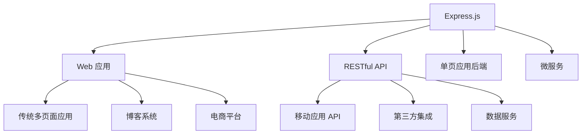

# 🚀 Express.js 服务器开发指南

> Express.js 是 Node.js 最流行的 Web 框架，以其极简、灵活和高性能著称。本指南将带你从零开始构建生产级的 Express.js 服务器应用。

## 🎯 Express 服务器概述

### 📊 核心特性

| 特性 | 描述 | 优势 |
|------|------|------|
| **极简设计** | 最小化的核心功能 | 🎯 轻量级，易于学习 |
| **灵活路由** | 强大的路由系统 | 🛣️ 支持各种路由模式 |
| **中间件架构** | 可扩展的中间件系统 | 🔧 功能模块化 |
| **模板引擎** | 支持多种模板引擎 | 🎨 灵活的视图渲染 |
| **高性能** | 基于 Node.js 的异步架构 | ⚡ 快速响应 |

### 🏗️ Express 应用场景



## 📦 项目初始化

### 🚀 基础环境搭建

```bash
# 创建项目目录
mkdir express-server
cd express-server

# 初始化项目
npm init -y

# 安装核心依赖
npm install express

# 安装开发依赖
npm install --save-dev nodemon

# 安装常用中间件
npm install body-parser cookie-parser express-session cors helmet morgan
```

### 📁 项目结构

```
express-server/
├── 📁 bin/
│   └── 📄 www                 # 启动脚本
├── 📁 public/                 # 静态文件目录
│   ├── 📁 images/
│   ├── 📁 javascripts/
│   └── 📁 stylesheets/
├── 📁 routes/                 # 路由文件
│   ├── 📄 index.js
│   └── 📄 users.js
├── 📁 views/                  # 模板文件
│   ├── 📄 error.ejs
│   ├── 📄 index.ejs
│   └── 📄 todos.ejs
├── 📁 middleware/             # 自定义中间件
├── 📁 models/                 # 数据模型
├── 📁 controllers/            # 控制器
├── 📄 app.js                  # 应用主文件
├── 📄 package.json
└── 📄 .env                    # 环境变量
```

### ⚙️ package.json 配置

```json
{
  "name": "express-server",
  "version": "1.0.0",
  "description": "Express.js 服务器应用",
  "main": "app.js",
  "scripts": {
    "start": "node app.js",
    "dev": "nodemon app.js",
    "test": "jest",
    "lint": "eslint ."
  },
  "dependencies": {
    "express": "^4.18.2",
    "mongoose": "^7.0.0",
    "mysql": "^2.18.1",
    "body-parser": "^1.20.2",
    "cookie-parser": "^1.4.6",
    "express-session": "^1.17.3",
    "cors": "^2.8.5",
    "helmet": "^7.0.0",
    "morgan": "^1.10.0",
    "moment": "^2.29.4"
  },
  "devDependencies": {
    "nodemon": "^3.0.1",
    "connect-livereload": "^0.6.1",
    "livereload": "^0.9.3"
  }
}
```

## 🛠️ 服务器配置

### 🎯 基础 Express 应用

```javascript
// app.js
const express = require('express');
const path = require('path');
const bodyParser = require('body-parser');
const cookieParser = require('cookie-parser');
const session = require('express-session');
const cors = require('cors');
const helmet = require('helmet');
const morgan = require('morgan');
const moment = require('moment');

// 创建 Express 应用实例
const app = express();

// 安全中间件
app.use(helmet());

// 跨域配置
app.use(cors({
  origin: 'http://localhost:3000',
  credentials: true
}));

// 日志中间件
app.use(morgan('combined'));

// 解析请求体
app.use(bodyParser.json());
app.use(bodyParser.urlencoded({ extended: false }));

// 解析 Cookie
app.use(cookieParser());

// 会话管理
app.use(session({
  secret: 'your-secret-key',
  resave: false,
  saveUninitialized: false,
  cookie: { secure: false }
}));

// 设置模板引擎
app.set('view engine', 'ejs');
app.set('views', path.join(__dirname, 'views'));

// 静态文件服务
app.use(express.static(path.join(__dirname, 'public')));

// 全局变量
app.locals.moment = moment;

// 启动服务器
const PORT = process.env.PORT || 3000;
app.listen(PORT, (err) => {
  if (err) {
    console.error('服务器启动失败:', err);
    throw err;
  }
  console.log(`🚀 服务器已启动，运行在端口 ${PORT}`);
});

module.exports = app;
```

### 🔧 开发环境配置

```javascript
// 开发环境热重载配置
if (process.env.NODE_ENV === 'development') {
  const livereload = require('livereload');
  const connectLiveReload = require('connect-livereload');
  
  // 创建 LiveReload 服务器
  const liveReloadServer = livereload.createServer();
  liveReloadServer.server.once('connection', () => {
    setTimeout(() => liveReloadServer.refresh('/'), 100);
  });
  
  // 连接 LiveReload 中间件
  app.use(connectLiveReload());
}
```

## 🗄️ 数据库集成

### 🍃 MongoDB 集成 (Mongoose)

```javascript
// models/database.js
const mongoose = require('mongoose');

// 连接 MongoDB 数据库
const connectDB = async () => {
  try {
    await mongoose.connect(process.env.MONGODB_URI || 'mongodb://localhost:27017/express-server', {
      useNewUrlParser: true,
      useUnifiedTopology: true,
    });
    console.log('✅ MongoDB 连接成功');
  } catch (error) {
    console.error('❌ MongoDB 连接失败:', error);
    process.exit(1);
  }
};

module.exports = connectDB;
```

### 📝 数据模型定义

```javascript
// models/Todo.js
const mongoose = require('mongoose');

// 定义 Todo Schema
const TodoSchema = new mongoose.Schema({
  task: {
    type: String,
    required: [true, '任务内容不能为空'],
    trim: true,
    maxlength: [200, '任务内容不能超过200个字符']
  },
  completed: {
    type: Boolean,
    default: false
  },
  priority: {
    type: String,
    enum: ['low', 'medium', 'high'],
    default: 'medium'
  },
  created_at: {
    type: Date,
    default: Date.now
  },
  updated_at: {
    type: Date,
    default: Date.now
  }
});

// 更新时间的中间件
TodoSchema.pre('save', function(next) {
  this.updated_at = Date.now();
  next();
});

module.exports = mongoose.model('Todo', TodoSchema);
```

### 🐬 MySQL 集成

```javascript
// models/mysql.js
const mysql = require('mysql');

// 创建数据库连接池
const pool = mysql.createPool({
  connectionLimit: 10,
  host: process.env.MYSQL_HOST || 'localhost',
  user: process.env.MYSQL_USER || 'root',
  password: process.env.MYSQL_PASSWORD || 'password',
  database: process.env.MYSQL_DATABASE || 'express_db',
  acquireTimeout: 60000,
  timeout: 60000,
  reconnect: true
});

// 连接测试
pool.getConnection((err, connection) => {
  if (err) {
    console.error('❌ MySQL 连接失败:', err);
    return;
  }
  console.log('✅ MySQL 连接成功');
  connection.release();
});

// 执行查询的辅助函数
const query = (sql, params) => {
  return new Promise((resolve, reject) => {
    pool.query(sql, params, (error, results) => {
      if (error) {
        reject(error);
      } else {
        resolve(results);
      }
    });
  });
};

module.exports = { pool, query };
```

## 🛣️ 路由设计

### 🎯 基础路由配置

```javascript
// routes/index.js
const express = require('express');
const router = express.Router();
const Todo = require('../models/Todo');

// 首页路由 - 显示所有待办事项
router.get('/', async (req, res) => {
  try {
    const todos = await Todo.find().sort({ created_at: -1 });
    res.render('todos', {
      title: '待办事项列表',
      tasks: todos.length > 0 ? todos : [],
      user: req.session.user
    });
  } catch (error) {
    console.error('获取待办事项失败:', error);
    res.status(500).render('error', { 
      message: '获取待办事项失败',
      error: error 
    });
  }
});

// 创建新的待办事项
router.post('/', async (req, res) => {
  try {
    const { task, priority } = req.body;
    
    // 数据验证
    if (!task || task.trim() === '') {
      return res.status(400).json({ error: '任务内容不能为空' });
    }
    
    const newTodo = new Todo({
      task: task.trim(),
      priority: priority || 'medium'
    });
    
    await newTodo.save();
    
    // 根据请求类型返回不同的响应
    if (req.xhr || req.headers.accept.indexOf('json') > -1) {
      res.json({ success: true, todo: newTodo });
    } else {
      res.redirect('/');
    }
  } catch (error) {
    console.error('创建待办事项失败:', error);
    if (req.xhr || req.headers.accept.indexOf('json') > -1) {
      res.status(500).json({ error: '创建待办事项失败' });
    } else {
      res.redirect('/?error=create_failed');
    }
  }
});

// 更新待办事项状态
router.put('/todo/:id', async (req, res) => {
  try {
    const { id } = req.params;
    const { completed, task, priority } = req.body;
    
    const updateData = {};
    if (completed !== undefined) updateData.completed = completed;
    if (task !== undefined) updateData.task = task;
    if (priority !== undefined) updateData.priority = priority;
    
    const updatedTodo = await Todo.findByIdAndUpdate(
      id,
      updateData,
      { new: true }
    );
    
    if (!updatedTodo) {
      return res.status(404).json({ error: '待办事项不存在' });
    }
    
    res.json({ success: true, todo: updatedTodo });
  } catch (error) {
    console.error('更新待办事项失败:', error);
    res.status(500).json({ error: '更新待办事项失败' });
  }
});

// 删除待办事项
router.delete('/todo/:id', async (req, res) => {
  try {
    const { id } = req.params;
    const deletedTodo = await Todo.findByIdAndDelete(id);
    
    if (!deletedTodo) {
      return res.status(404).json({ error: '待办事项不存在' });
    }
    
    res.json({ success: true, message: '待办事项已删除' });
  } catch (error) {
    console.error('删除待办事项失败:', error);
    res.status(500).json({ error: '删除待办事项失败' });
  }
});

module.exports = router;
```

### 📋 API 路由设计

```javascript
// routes/api.js
const express = require('express');
const router = express.Router();
const Todo = require('../models/Todo');

// API 基础响应格式
const apiResponse = (success, data, message, statusCode = 200) => {
  return {
    success,
    data,
    message,
    timestamp: new Date().toISOString()
  };
};

// 获取所有待办事项 API
router.get('/todos', async (req, res) => {
  try {
    const { page = 1, limit = 10, status, priority } = req.query;
    
    // 构建查询条件
    const query = {};
    if (status !== undefined) query.completed = status === 'completed';
    if (priority) query.priority = priority;
    
    // 分页查询
    const todos = await Todo.find(query)
      .sort({ created_at: -1 })
      .limit(limit * 1)
      .skip((page - 1) * limit);
    
    const total = await Todo.countDocuments(query);
    
    res.json(apiResponse(true, {
      todos,
      pagination: {
        page: parseInt(page),
        limit: parseInt(limit),
        total,
        pages: Math.ceil(total / limit)
      }
    }, '获取待办事项成功'));
  } catch (error) {
    console.error('API 获取待办事项失败:', error);
    res.status(500).json(apiResponse(false, null, '服务器内部错误'));
  }
});

// 创建待办事项 API
router.post('/todos', async (req, res) => {
  try {
    const { task, priority } = req.body;
    
    const newTodo = new Todo({
      task: task.trim(),
      priority: priority || 'medium'
    });
    
    await newTodo.save();
    
    res.status(201).json(apiResponse(true, newTodo, '创建待办事项成功'));
  } catch (error) {
    console.error('API 创建待办事项失败:', error);
    res.status(500).json(apiResponse(false, null, '创建待办事项失败'));
  }
});

// 统计数据 API
router.get('/stats', async (req, res) => {
  try {
    const totalTodos = await Todo.countDocuments();
    const completedTodos = await Todo.countDocuments({ completed: true });
    const pendingTodos = await Todo.countDocuments({ completed: false });
    
    const priorityStats = await Todo.aggregate([
      { $group: { _id: '$priority', count: { $sum: 1 } } }
    ]);
    
    res.json(apiResponse(true, {
      total: totalTodos,
      completed: completedTodos,
      pending: pendingTodos,
      priority: priorityStats.reduce((acc, item) => {
        acc[item._id] = item.count;
        return acc;
      }, {})
    }, '获取统计数据成功'));
  } catch (error) {
    console.error('API 获取统计数据失败:', error);
    res.status(500).json(apiResponse(false, null, '获取统计数据失败'));
  }
});

module.exports = router;
```

## 🎨 模板引擎集成

### 📄 EJS 模板配置

```javascript
// 设置 EJS 模板引擎
app.set('view engine', 'ejs');
app.set('views', path.join(__dirname, 'views'));

// 模板全局变量
app.locals.moment = moment;
app.locals.siteName = 'Express Todo App';
```

### 🖼️ 模板文件示例

```ejs
<!-- views/todos.ejs -->
<!DOCTYPE html>
<html lang="zh-CN">
<head>
    <meta charset="UTF-8">
    <meta name="viewport" content="width=device-width, initial-scale=1.0">
    <title><%= title %> - <%= siteName %></title>
    <link rel="stylesheet" href="/stylesheets/style.css">
</head>
<body>
    <div class="container">
        <header>
            <h1>📝 <%= title %></h1>
            <% if (user) { %>
                <p>欢迎回来，<%= user.name %>!</p>
            <% } %>
        </header>
        
        <main>
            <!-- 添加新任务表单 -->
            <form action="/" method="post" class="add-todo-form">
                <div class="form-group">
                    <input type="text" name="task" placeholder="请输入待办事项..." required>
                    <select name="priority">
                        <option value="low">低优先级</option>
                        <option value="medium" selected>中优先级</option>
                        <option value="high">高优先级</option>
                    </select>
                    <button type="submit">添加任务</button>
                </div>
            </form>
            
            <!-- 待办事项列表 -->
            <div class="todos-list">
                <% if (tasks.length > 0) { %>
                    <% tasks.forEach(function(todo) { %>
                        <div class="todo-item <%= todo.completed ? 'completed' : '' %>" data-id="<%= todo._id %>">
                            <div class="todo-content">
                                <span class="priority priority-<%= todo.priority %>"><%= todo.priority %></span>
                                <span class="task"><%= todo.task %></span>
                                <span class="date"><%= moment(todo.created_at).format('YYYY-MM-DD HH:mm') %></span>
                            </div>
                            <div class="todo-actions">
                                <button class="btn-toggle" onclick="toggleTodo('<%= todo._id %>')">
                                    <%= todo.completed ? '撤销' : '完成' %>
                                </button>
                                <button class="btn-delete" onclick="deleteTodo('<%= todo._id %>')">删除</button>
                            </div>
                        </div>
                    <% }); %>
                <% } else { %>
                    <div class="empty-state">
                        <p>🎉 暂无待办事项，享受轻松时光吧！</p>
                    </div>
                <% } %>
            </div>
        </main>
    </div>
    
    <script src="/javascripts/app.js"></script>
</body>
</html>
```

## 🔐 中间件系统

### 🛡️ 身份验证中间件

```javascript
// middleware/auth.js
const authMiddleware = (req, res, next) => {
  // 检查会话中是否存在用户信息
  if (req.session && req.session.user) {
    req.user = req.session.user;
    next();
  } else {
    // 如果是 API 请求，返回 JSON 错误
    if (req.xhr || req.headers.accept.indexOf('json') > -1) {
      return res.status(401).json({ error: '请先登录' });
    }
    // 否则重定向到登录页面
    res.redirect('/login');
  }
};

// 可选的身份验证中间件
const optionalAuth = (req, res, next) => {
  if (req.session && req.session.user) {
    req.user = req.session.user;
  }
  next();
};

module.exports = { authMiddleware, optionalAuth };
```

### 📊 请求日志中间件

```javascript
// middleware/logger.js
const requestLogger = (req, res, next) => {
  const start = Date.now();
  
  // 记录请求开始
  console.log(`📨 ${req.method} ${req.url} - ${req.ip}`);
  
  // 监听响应结束
  res.on('finish', () => {
    const duration = Date.now() - start;
    console.log(`📤 ${req.method} ${req.url} - ${res.statusCode} - ${duration}ms`);
  });
  
  next();
};

module.exports = requestLogger;
```

### ⚠️ 错误处理中间件

```javascript
// middleware/errorHandler.js
const errorHandler = (err, req, res, next) => {
  console.error('❌ 服务器错误:', err.stack);
  
  // 设置默认错误信息
  const error = {
    message: err.message || '服务器内部错误',
    status: err.status || 500
  };
  
  // 开发环境显示详细错误信息
  if (process.env.NODE_ENV === 'development') {
    error.stack = err.stack;
  }
  
  // 根据请求类型返回不同格式的错误响应
  if (req.xhr || req.headers.accept.indexOf('json') > -1) {
    res.status(error.status).json({
      success: false,
      error: error.message,
      ...(process.env.NODE_ENV === 'development' && { stack: error.stack })
    });
  } else {
    res.status(error.status).render('error', {
      title: '出错了',
      message: error.message,
      error: process.env.NODE_ENV === 'development' ? err : {}
    });
  }
};

// 404 处理中间件
const notFoundHandler = (req, res) => {
  const error = {
    message: '页面未找到',
    status: 404
  };
  
  if (req.xhr || req.headers.accept.indexOf('json') > -1) {
    res.status(404).json({
      success: false,
      error: error.message
    });
  } else {
    res.status(404).render('error', {
      title: '页面未找到',
      message: '抱歉，您访问的页面不存在'
    });
  }
};

module.exports = { errorHandler, notFoundHandler };
```

## 🎯 实战应用

### 🏗️ 完整应用示例

```javascript
// app.js - 完整的 Express 应用
const express = require('express');
const path = require('path');
const bodyParser = require('body-parser');
const cookieParser = require('cookie-parser');
const session = require('express-session');
const cors = require('cors');
const helmet = require('helmet');
const morgan = require('morgan');
const moment = require('moment');

// 导入数据库连接
const connectDB = require('./models/database');

// 导入路由
const indexRouter = require('./routes/index');
const apiRouter = require('./routes/api');

// 导入中间件
const { authMiddleware, optionalAuth } = require('./middleware/auth');
const requestLogger = require('./middleware/logger');
const { errorHandler, notFoundHandler } = require('./middleware/errorHandler');

// 创建 Express 应用
const app = express();

// 连接数据库
connectDB();

// 安全和基础中间件
app.use(helmet());
app.use(cors({
  origin: process.env.CORS_ORIGIN || 'http://localhost:3000',
  credentials: true
}));
app.use(morgan('combined'));
app.use(requestLogger);

// 解析请求体
app.use(bodyParser.json());
app.use(bodyParser.urlencoded({ extended: false }));
app.use(cookieParser());

// 会话管理
app.use(session({
  secret: process.env.SESSION_SECRET || 'your-secret-key',
  resave: false,
  saveUninitialized: false,
  cookie: { 
    secure: process.env.NODE_ENV === 'production',
    maxAge: 24 * 60 * 60 * 1000 // 24 小时
  }
}));

// 模板引擎配置
app.set('view engine', 'ejs');
app.set('views', path.join(__dirname, 'views'));

// 静态文件服务
app.use(express.static(path.join(__dirname, 'public')));

// 全局模板变量
app.locals.moment = moment;
app.locals.siteName = 'Express Todo App';

// 路由配置
app.use('/', optionalAuth, indexRouter);
app.use('/api', apiRouter);

// 错误处理
app.use(notFoundHandler);
app.use(errorHandler);

// 启动服务器
const PORT = process.env.PORT || 3000;
app.listen(PORT, (err) => {
  if (err) {
    console.error('❌ 服务器启动失败:', err);
    throw err;
  }
  console.log(`🚀 服务器已启动，运行在端口 ${PORT}`);
  console.log(`📱 访问地址: http://localhost:${PORT}`);
});

module.exports = app;
```

### 🎮 前端 JavaScript 集成

```javascript
// public/javascripts/app.js
class TodoApp {
  constructor() {
    this.init();
  }
  
  init() {
    this.bindEvents();
  }
  
  bindEvents() {
    // 表单提交事件
    const form = document.querySelector('.add-todo-form');
    if (form) {
      form.addEventListener('submit', this.handleSubmit.bind(this));
    }
  }
  
  async handleSubmit(e) {
    e.preventDefault();
    
    const formData = new FormData(e.target);
    const task = formData.get('task');
    const priority = formData.get('priority');
    
    if (!task.trim()) {
      alert('请输入待办事项！');
      return;
    }
    
    try {
      const response = await fetch('/api/todos', {
        method: 'POST',
        headers: {
          'Content-Type': 'application/json',
        },
        body: JSON.stringify({ task, priority })
      });
      
      const result = await response.json();
      
      if (result.success) {
        location.reload();
      } else {
        alert('添加失败：' + result.message);
      }
    } catch (error) {
      console.error('添加待办事项失败:', error);
      alert('添加失败，请重试！');
    }
  }
}

// 切换待办事项状态
async function toggleTodo(id) {
  try {
    const response = await fetch(`/api/todos/${id}`, {
      method: 'PUT',
      headers: {
        'Content-Type': 'application/json',
      },
      body: JSON.stringify({ completed: true })
    });
    
    const result = await response.json();
    
    if (result.success) {
      location.reload();
    } else {
      alert('操作失败：' + result.message);
    }
  } catch (error) {
    console.error('切换待办事项状态失败:', error);
    alert('操作失败，请重试！');
  }
}

// 删除待办事项
async function deleteTodo(id) {
  if (!confirm('确定要删除这个待办事项吗？')) {
    return;
  }
  
  try {
    const response = await fetch(`/api/todos/${id}`, {
      method: 'DELETE'
    });
    
    const result = await response.json();
    
    if (result.success) {
      location.reload();
    } else {
      alert('删除失败：' + result.message);
    }
  } catch (error) {
    console.error('删除待办事项失败:', error);
    alert('删除失败，请重试！');
  }
}

// 初始化应用
document.addEventListener('DOMContentLoaded', () => {
  new TodoApp();
});
```

## 🎨 样式和 UI

### 💄 CSS 样式

```css
/* public/stylesheets/style.css */
* {
  margin: 0;
  padding: 0;
  box-sizing: border-box;
}

body {
  font-family: -apple-system, BlinkMacSystemFont, 'Segoe UI', Roboto, sans-serif;
  background-color: #f5f5f5;
  color: #333;
  line-height: 1.6;
}

.container {
  max-width: 800px;
  margin: 0 auto;
  padding: 20px;
}

header {
  text-align: center;
  margin-bottom: 30px;
}

header h1 {
  color: #2c3e50;
  font-size: 2.5em;
  margin-bottom: 10px;
}

.add-todo-form {
  background: white;
  padding: 20px;
  border-radius: 8px;
  box-shadow: 0 2px 10px rgba(0,0,0,0.1);
  margin-bottom: 20px;
}

.form-group {
  display: flex;
  gap: 10px;
  align-items: center;
}

.form-group input[type="text"] {
  flex: 1;
  padding: 12px;
  border: 2px solid #ddd;
  border-radius: 4px;
  font-size: 16px;
}

.form-group select {
  padding: 12px;
  border: 2px solid #ddd;
  border-radius: 4px;
  font-size: 16px;
}

.form-group button {
  padding: 12px 24px;
  background: #3498db;
  color: white;
  border: none;
  border-radius: 4px;
  cursor: pointer;
  font-size: 16px;
}

.form-group button:hover {
  background: #2980b9;
}

.todos-list {
  background: white;
  border-radius: 8px;
  box-shadow: 0 2px 10px rgba(0,0,0,0.1);
  overflow: hidden;
}

.todo-item {
  display: flex;
  justify-content: space-between;
  align-items: center;
  padding: 15px 20px;
  border-bottom: 1px solid #eee;
}

.todo-item:last-child {
  border-bottom: none;
}

.todo-item.completed {
  opacity: 0.6;
}

.todo-item.completed .task {
  text-decoration: line-through;
}

.todo-content {
  flex: 1;
  display: flex;
  align-items: center;
  gap: 10px;
}

.priority {
  padding: 4px 8px;
  border-radius: 4px;
  font-size: 12px;
  font-weight: bold;
  text-transform: uppercase;
}

.priority-high {
  background: #e74c3c;
  color: white;
}

.priority-medium {
  background: #f39c12;
  color: white;
}

.priority-low {
  background: #27ae60;
  color: white;
}

.task {
  font-size: 16px;
  font-weight: 500;
}

.date {
  font-size: 12px;
  color: #666;
}

.todo-actions {
  display: flex;
  gap: 10px;
}

.btn-toggle, .btn-delete {
  padding: 6px 12px;
  border: none;
  border-radius: 4px;
  cursor: pointer;
  font-size: 14px;
}

.btn-toggle {
  background: #27ae60;
  color: white;
}

.btn-delete {
  background: #e74c3c;
  color: white;
}

.empty-state {
  text-align: center;
  padding: 40px;
  color: #666;
}

.empty-state p {
  font-size: 18px;
}

@media (max-width: 600px) {
  .form-group {
    flex-direction: column;
  }
  
  .todo-item {
    flex-direction: column;
    align-items: flex-start;
    gap: 10px;
  }
  
  .todo-content {
    width: 100%;
  }
  
  .todo-actions {
    width: 100%;
    justify-content: flex-end;
  }
}
```

## 🔧 环境配置

### 📄 环境变量配置

```bash
# .env
NODE_ENV=development
PORT=3000

# 数据库配置
MONGODB_URI=mongodb://localhost:27017/express-server
MYSQL_HOST=localhost
MYSQL_USER=root
MYSQL_PASSWORD=password
MYSQL_DATABASE=express_db

# 会话配置
SESSION_SECRET=your-super-secret-key-here

# 跨域配置
CORS_ORIGIN=http://localhost:3000

# 日志配置
LOG_LEVEL=debug
```

### 🚀 部署脚本

```bash
#!/bin/bash
# deploy.sh

echo "🚀 开始部署 Express 应用..."

# 安装依赖
echo "📦 安装依赖..."
npm ci

# 构建应用
echo "🔨 构建应用..."
npm run build

# 启动应用
echo "🎯 启动应用..."
npm start

echo "✅ 部署完成！"
```

## 🎯 最佳实践

### 🏆 性能优化

| 优化项 | 描述 | 实现方式 |
|--------|------|----------|
| **缓存策略** | 静态资源缓存 | 🗄️ 使用 Redis 或内存缓存 |
| **压缩响应** | 启用 gzip 压缩 | 🗜️ 使用 compression 中间件 |
| **连接池** | 数据库连接池 | 🏊 优化数据库连接管理 |
| **异步处理** | 非阻塞 I/O 操作 | ⚡ 使用 async/await |
| **负载均衡** | 分布式部署 | 🔄 使用 PM2 或 Docker |

### 🛡️ 安全措施

```javascript
// 安全配置示例
app.use(helmet({
  contentSecurityPolicy: {
    directives: {
      defaultSrc: ["'self'"],
      styleSrc: ["'self'", "'unsafe-inline'"],
      scriptSrc: ["'self'"],
      imgSrc: ["'self'", "data:", "https:"],
    },
  },
}));

// 限制请求频率
const rateLimit = require('express-rate-limit');
const limiter = rateLimit({
  windowMs: 15 * 60 * 1000, // 15 分钟
  max: 100, // 最多 100 个请求
  message: '请求过于频繁，请稍后再试'
});

app.use('/api/', limiter);
```

### 📊 监控和日志

```javascript
// 健康检查端点
app.get('/health', (req, res) => {
  res.json({
    status: 'ok',
    timestamp: new Date().toISOString(),
    uptime: process.uptime(),
    memory: process.memoryUsage()
  });
});

// 性能监控
const performanceMiddleware = (req, res, next) => {
  const start = Date.now();
  
  res.on('finish', () => {
    const duration = Date.now() - start;
    if (duration > 1000) {
      console.warn(`⚠️ 慢请求: ${req.method} ${req.url} - ${duration}ms`);
    }
  });
  
  next();
};

app.use(performanceMiddleware);
```

## 📚 相关资源

### 🔗 官方文档
- [Express.js 官方文档](https://expressjs.com/)
- [Node.js 官方文档](https://nodejs.org/docs/)
- [MongoDB 官方文档](https://docs.mongodb.com/)

### 🛠️ 常用中间件
- [helmet](https://helmetjs.github.io/) - 安全中间件
- [cors](https://github.com/expressjs/cors) - 跨域处理
- [morgan](https://github.com/expressjs/morgan) - 日志记录
- [express-session](https://github.com/expressjs/session) - 会话管理

### 📖 学习资源
- [Express.js 教程](https://developer.mozilla.org/en-US/docs/Learn/Server-side/Express_Nodejs)
- [Node.js 最佳实践](https://github.com/goldbergyoni/nodebestpractices)
- [Express.js 安全指南](https://expressjs.com/en/advanced/best-practice-security.html)

---

::: tip 💡 小贴士
Express.js 的强大之处在于其灵活性和可扩展性。通过合理使用中间件和路由设计，你可以构建出高性能、可维护的 Web 应用。记住始终关注安全性和性能优化！
:::

::: warning ⚠️ 注意
在生产环境中，务必配置适当的错误处理、日志记录和监控系统。同时要定期更新依赖包以确保安全性。
:::
