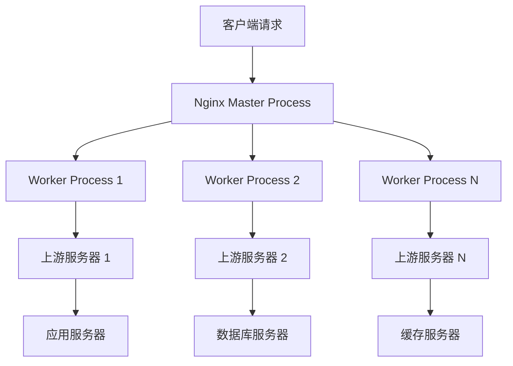
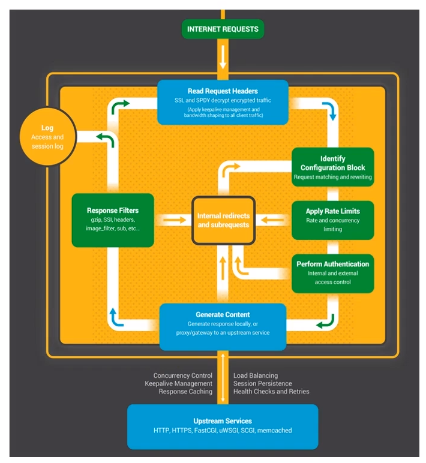
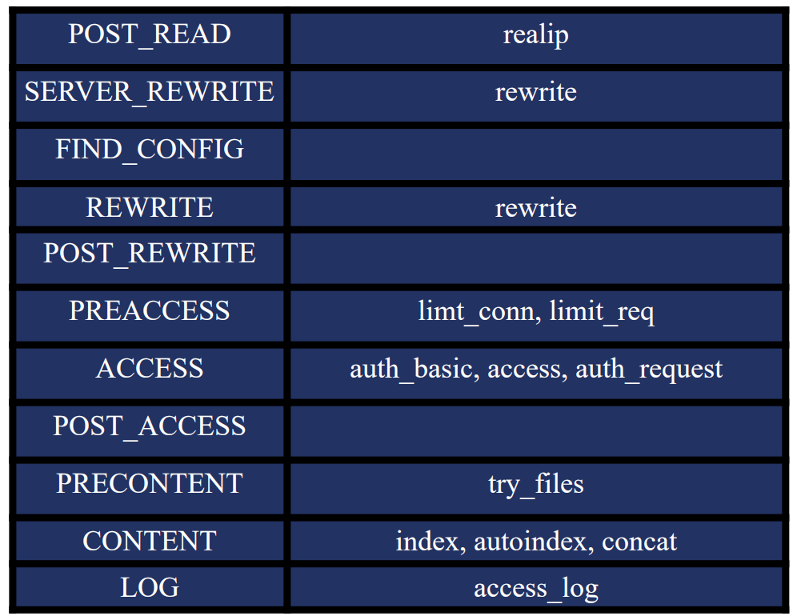
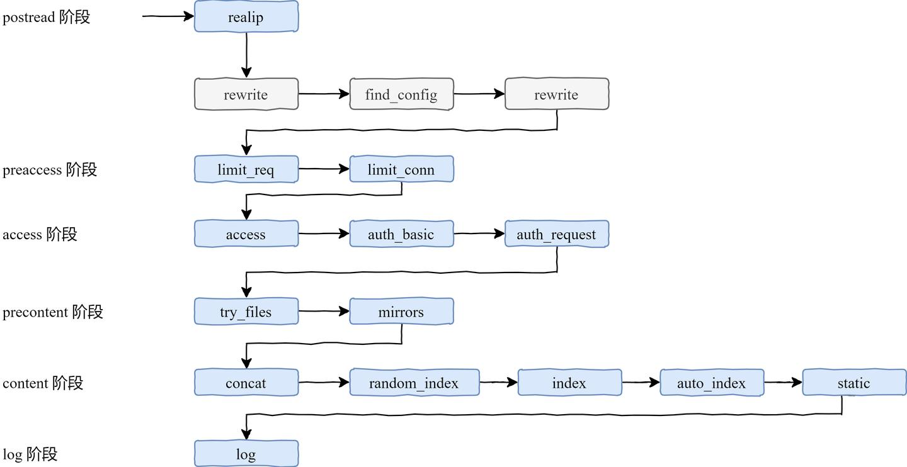

# 🔧 Nginx 服务器完全指南

> Nginx 是一款高性能的 Web 服务器和反向代理服务器，以其卓越的性能、稳定性和丰富的功能模块而闻名。本指南将带你深入了解 Nginx 的核心概念和实战技巧。

## 🎯 Nginx 概述

### 📊 核心特性

| 特性 | 描述 | 优势 |
|------|------|------|
| **高性能** | 事件驱动架构 | ⚡ 低内存消耗，高并发处理 |
| **反向代理** | 负载均衡和缓存 | 🔄 提升应用性能 |
| **模块化架构** | 丰富的功能模块 | 🔧 高度可定制 |
| **SSL/TLS 支持** | 加密传输协议 | 🔐 数据安全传输 |
| **热部署** | 零宕机配置更新 | 🚀 高可用性 |

### 🏗️ Nginx 架构优势



### 🔄 Nginx vs 其他服务器

| 服务器 | 架构模式 | 内存使用 | 并发处理 | 适用场景 |
|--------|----------|----------|----------|----------|
| **Nginx** | 事件驱动 | 🟢 低 | 🟢 高 | 静态文件、反向代理 |
| **Apache** | 线程/进程 | 🟡 中等 | 🟡 中等 | 动态内容、模块丰富 |
| **Lighttpd** | 事件驱动 | 🟢 低 | 🟢 高 | 静态文件服务 |
| **IIS** | 线程池 | 🔴 高 | 🟡 中等 | Windows 环境 |

## 🚀 安装和配置

### 📦 安装方式

#### 🐧 Ubuntu/Debian 安装

```bash
# 更新软件包列表
sudo apt update

# 安装 Nginx
sudo apt install nginx

# 启动 Nginx 服务
sudo systemctl start nginx

# 设置开机自启动
sudo systemctl enable nginx

# 检查服务状态
sudo systemctl status nginx
```

#### 🎩 CentOS/RHEL 安装

```bash
# 安装 EPEL 仓库
sudo yum install epel-release

# 安装 Nginx
sudo yum install nginx

# 启动服务
sudo systemctl start nginx
sudo systemctl enable nginx

# 检查防火墙设置
sudo firewall-cmd --permanent --add-service=http
sudo firewall-cmd --permanent --add-service=https
sudo firewall-cmd --reload
```

#### 🔧 编译安装

```bash
# 下载 Nginx 源码
wget http://nginx.org/download/nginx-1.24.0.tar.gz
tar -xzf nginx-1.24.0.tar.gz
cd nginx-1.24.0

# 安装编译依赖
sudo apt install build-essential libpcre3-dev libssl-dev zlib1g-dev

# 配置编译选项
./configure \
    --prefix=/etc/nginx \
    --sbin-path=/usr/sbin/nginx \
    --conf-path=/etc/nginx/nginx.conf \
    --error-log-path=/var/log/nginx/error.log \
    --access-log-path=/var/log/nginx/access.log \
    --pid-path=/var/run/nginx.pid \
    --lock-path=/var/run/nginx.lock \
    --with-http_ssl_module \
    --with-http_v2_module \
    --with-http_realip_module \
    --with-http_gzip_static_module \
    --with-file-aio \
    --with-threads

# 编译并安装
make && sudo make install
```

### 📁 目录结构

```
/etc/nginx/
├── 📄 nginx.conf          # 主配置文件
├── 📁 conf.d/             # 配置文件目录
│   └── 📄 default.conf    # 默认虚拟主机配置
├── 📁 sites-available/    # 可用站点配置
├── 📁 sites-enabled/      # 已启用站点配置
├── 📁 modules-available/  # 可用模块
├── 📁 modules-enabled/    # 已启用模块
├── 📁 snippets/           # 配置代码片段
└── 📄 mime.types          # MIME 类型定义

/var/log/nginx/
├── 📄 access.log          # 访问日志
└── 📄 error.log           # 错误日志

/var/www/html/
└── 📄 index.html          # 默认网站根目录
```

## 🛠️ 请求处理机制

### 🔄 请求处理流程

<div align="center">
  
</div>

### 📋 处理步骤详解

| 步骤 | 名称 | 描述 | 关键模块 |
|------|------|------|----------|
| **1** | Read Request Headers | 📖 解析请求头 | ngx_http_core_module |
| **2** | Identify Configuration Block | 🎯 匹配 location 配置块 | ngx_http_core_module |
| **3** | Apply Rate Limits | 🚦 应用速率限制 | limit_req, limit_conn |
| **4** | Perform Authentication | 🔐 身份验证和权限控制 | auth_basic, auth_request |
| **5** | Generate Content | 📄 生成响应内容 | proxy_pass, fastcgi_pass |
| **6** | Response Filters | 🔧 响应过滤处理 | gzip, image_filter |
| **7** | Log | 📝 记录访问日志 | access_log |

### 🎯 11 个处理阶段

<div align="center">
  
</div>

#### 🔄 阶段详细说明


#### 📊 各阶段模块分布

<div align="center">
  
</div>

## 🌐 核心配置详解

### 🎯 主配置文件结构

```nginx
# nginx.conf 主配置文件
user nginx;
worker_processes auto;
error_log /var/log/nginx/error.log;
pid /run/nginx.pid;

# 加载动态模块
include /usr/share/nginx/modules/*.conf;

events {
    worker_connections 1024;
    use epoll;
    multi_accept on;
}

http {
    # 基础配置
    include /etc/nginx/mime.types;
    default_type application/octet-stream;
    
    # 日志格式
    log_format main '$remote_addr - $remote_user [$time_local] "$request" '
                    '$status $body_bytes_sent "$http_referer" '
                    '"$http_user_agent" "$http_x_forwarded_for"';
    
    access_log /var/log/nginx/access.log main;
    
    # 性能优化
    sendfile on;
    tcp_nopush on;
    tcp_nodelay on;
    keepalive_timeout 65;
    types_hash_max_size 2048;
    
    # 包含其他配置文件
    include /etc/nginx/conf.d/*.conf;
    include /etc/nginx/sites-enabled/*;
}
```

### 🔧 虚拟主机配置

```nginx
# 基础虚拟主机配置
server {
    listen 80;
    listen [::]:80;
    server_name example.com www.example.com;
    root /var/www/html;
    index index.html index.htm index.nginx-debian.html;
    
    # 访问日志
    access_log /var/log/nginx/example.access.log;
    error_log /var/log/nginx/example.error.log;
    
    # 基础 location 配置
    location / {
        try_files $uri $uri/ =404;
    }
    
    # 静态文件缓存
    location ~* \.(jpg|jpeg|png|gif|ico|css|js)$ {
        expires 1y;
        add_header Cache-Control "public, immutable";
    }
    
    # PHP 处理
    location ~ \.php$ {
        include snippets/fastcgi-php.conf;
        fastcgi_pass unix:/var/run/php/php7.4-fpm.sock;
    }
    
    # 拒绝访问隐藏文件
    location ~ /\. {
        deny all;
    }
}
```

### 🎯 Location 匹配规则

| 匹配符 | 优先级 | 描述 | 示例 |
|--------|--------|------|------|
| `=` | 1 | 🎯 精确匹配 | `location = /api/users` |
| `^~` | 2 | 🔍 前缀匹配（优先） | `location ^~ /static/` |
| `~` | 3 | 📝 正则匹配（区分大小写） | `location ~ \.(jpg|png)$` |
| `~*` | 3 | 📝 正则匹配（不区分大小写） | `location ~* \.(jpg|png)$` |
| `/` | 4 | 🌐 通用匹配 | `location /api/` |

### 🛠️ Location 配置示例

```nginx
server {
    listen 80;
    server_name example.com;
    root /var/www/html;
    
    # 精确匹配首页
    location = / {
        return 200 "Welcome to homepage!";
    }
    
    # 前缀匹配 API 路由
    location ^~ /api/ {
        proxy_pass http://backend_servers;
        proxy_set_header Host $host;
        proxy_set_header X-Real-IP $remote_addr;
        proxy_set_header X-Forwarded-For $proxy_add_x_forwarded_for;
        proxy_set_header X-Forwarded-Proto $scheme;
    }
    
    # 正则匹配图片文件
    location ~* \.(jpg|jpeg|png|gif|webp|svg)$ {
        expires 30d;
        add_header Cache-Control "public, no-transform";
        add_header Vary Accept-Encoding;
    }
    
    # 正则匹配 CSS 和 JS 文件
    location ~* \.(css|js)$ {
        expires 1y;
        add_header Cache-Control "public, immutable";
        gzip_static on;
    }
    
    # 通用匹配
    location / {
        try_files $uri $uri/ @fallback;
    }
    
    # 命名 location
    location @fallback {
        proxy_pass http://backend_servers;
    }
}
```

## 🔄 反向代理配置

### 🎯 基础反向代理

```nginx
# 上游服务器定义
upstream backend_servers {
    server 192.168.1.10:8000 weight=3;
    server 192.168.1.11:8000 weight=2;
    server 192.168.1.12:8000 weight=1 backup;
    
    # 健康检查
    keepalive 32;
}

server {
    listen 80;
    server_name api.example.com;
    
    location / {
        proxy_pass http://backend_servers;
        
        # 代理头部设置
        proxy_set_header Host $host;
        proxy_set_header X-Real-IP $remote_addr;
        proxy_set_header X-Forwarded-For $proxy_add_x_forwarded_for;
        proxy_set_header X-Forwarded-Proto $scheme;
        
        # 超时设置
        proxy_connect_timeout 30s;
        proxy_send_timeout 30s;
        proxy_read_timeout 30s;
        
        # 缓冲区设置
        proxy_buffering on;
        proxy_buffer_size 8k;
        proxy_buffers 32 8k;
        
        # 错误处理
        proxy_next_upstream error timeout http_500 http_502 http_503;
        proxy_next_upstream_tries 3;
        proxy_next_upstream_timeout 10s;
    }
}
```

### ⚖️ 负载均衡策略

| 策略 | 配置 | 特点 | 适用场景 |
|------|------|------|----------|
| **轮询** | 默认 | 🔄 顺序分发 | 服务器性能相近 |
| **加权轮询** | `weight=n` | ⚖️ 按权重分发 | 服务器性能不同 |
| **IP Hash** | `ip_hash` | 📍 相同 IP 固定服务器 | 需要会话保持 |
| **最少连接** | `least_conn` | 📊 连接数最少优先 | 请求处理时间差异大 |
| **哈希** | `hash $key` | 🔑 自定义键值哈希 | 缓存一致性 |

```nginx
# 不同负载均衡策略示例
upstream backend_round_robin {
    server 192.168.1.10:8000;
    server 192.168.1.11:8000;
    server 192.168.1.12:8000;
}

upstream backend_weighted {
    server 192.168.1.10:8000 weight=3;
    server 192.168.1.11:8000 weight=2;
    server 192.168.1.12:8000 weight=1;
}

upstream backend_ip_hash {
    ip_hash;
    server 192.168.1.10:8000;
    server 192.168.1.11:8000;
    server 192.168.1.12:8000;
}

upstream backend_least_conn {
    least_conn;
    server 192.168.1.10:8000;
    server 192.168.1.11:8000;
    server 192.168.1.12:8000;
}

upstream backend_hash {
    hash $request_uri consistent;
    server 192.168.1.10:8000;
    server 192.168.1.11:8000;
    server 192.168.1.12:8000;
}
```

## 🔐 SSL/TLS 配置

### 🎯 基础 HTTPS 配置

```nginx
server {
    listen 443 ssl http2;
    listen [::]:443 ssl http2;
    server_name example.com www.example.com;
    
    # SSL 证书配置
    ssl_certificate /etc/nginx/ssl/example.com.crt;
    ssl_certificate_key /etc/nginx/ssl/example.com.key;
    
    # SSL 协议和密码套件
    ssl_protocols TLSv1.2 TLSv1.3;
    ssl_ciphers ECDHE-RSA-AES128-GCM-SHA256:ECDHE-RSA-AES256-GCM-SHA384:ECDHE-RSA-CHACHA20-POLY1305;
    ssl_prefer_server_ciphers off;
    
    # SSL 性能优化
    ssl_session_cache shared:SSL:50m;
    ssl_session_timeout 1d;
    ssl_session_tickets off;
    
    # OCSP Stapling
    ssl_stapling on;
    ssl_stapling_verify on;
    ssl_trusted_certificate /etc/nginx/ssl/ca-bundle.crt;
    resolver 8.8.8.8 8.8.4.4 valid=300s;
    resolver_timeout 5s;
    
    # 安全头部
    add_header Strict-Transport-Security "max-age=31536000; includeSubDomains; preload" always;
    add_header X-Frame-Options DENY always;
    add_header X-Content-Type-Options nosniff always;
    add_header X-XSS-Protection "1; mode=block" always;
    add_header Referrer-Policy "strict-origin-when-cross-origin" always;
    
    root /var/www/html;
    index index.html index.htm;
    
    location / {
        try_files $uri $uri/ =404;
    }
}

# HTTP 重定向到 HTTPS
server {
    listen 80;
    listen [::]:80;
    server_name example.com www.example.com;
    return 301 https://$server_name$request_uri;
}
```

### 🔧 Let's Encrypt 自动证书

```bash
# 安装 Certbot
sudo apt install certbot python3-certbot-nginx

# 获取证书
sudo certbot --nginx -d example.com -d www.example.com

# 测试自动续期
sudo certbot renew --dry-run

# 添加定时任务自动续期
sudo crontab -e
# 添加以下行：
0 12 * * * /usr/bin/certbot renew --quiet
```

## 🌟 RealIP 模块

### 🎯 获取真实 IP 地址

<div align="center">
  
</div>

### 🔧 RealIP 模块配置

```nginx
# 编译时添加模块
--with-http_realip_module

# 配置指令
server {
    listen 80;
    server_name example.com;
    
    # 指定可信的代理服务器
    set_real_ip_from 192.168.1.0/24;
    set_real_ip_from 10.0.0.0/8;
    set_real_ip_from 172.16.0.0/12;
    set_real_ip_from 127.0.0.1;
    
    # 指定获取真实 IP 的头部字段
    real_ip_header X-Forwarded-For;
    # real_ip_header X-Real-IP;
    # real_ip_header proxy_protocol;
    
    # 是否启用递归处理
    real_ip_recursive on;
    
    location / {
        return 200 "Real IP: $remote_addr\nOriginal IP: $realip_remote_addr\n";
    }
}
```

### 📊 IP 头部字段说明

| 头部字段 | 描述 | 格式 | 示例 |
|----------|------|------|------|
| **X-Forwarded-For** | 📍 记录请求链路中的所有 IP | `client, proxy1, proxy2` | `203.0.113.1, 192.168.1.10` |
| **X-Real-IP** | 🎯 记录客户端真实 IP | `client_ip` | `203.0.113.1` |
| **X-Forwarded-Proto** | 🔒 记录原始协议 | `http` 或 `https` | `https` |
| **X-Forwarded-Host** | 🌐 记录原始主机名 | `hostname` | `example.com` |

## 🗜️ 性能优化配置

### 🚀 Gzip 压缩优化

```nginx
# Gzip 压缩配置
http {
    # 启用 Gzip 压缩
    gzip on;
    gzip_vary on;
    gzip_proxied any;
    gzip_comp_level 6;
    gzip_min_length 1000;
    gzip_buffers 16 8k;
    gzip_http_version 1.1;
    
    # 压缩的文件类型
    gzip_types
        application/atom+xml
        application/javascript
        application/json
        application/ld+json
        application/manifest+json
        application/rss+xml
        application/vnd.geo+json
        application/vnd.ms-fontobject
        application/x-font-ttf
        application/x-web-app-manifest+json
        application/xhtml+xml
        application/xml
        font/opentype
        image/bmp
        image/svg+xml
        image/x-icon
        text/cache-manifest
        text/css
        text/plain
        text/vcard
        text/vnd.rim.location.xloc
        text/vtt
        text/x-component
        text/x-cross-domain-policy;
    
    # 静态 Gzip 文件
    gzip_static on;
}
```

### 📈 缓存配置

```nginx
# 浏览器缓存配置
server {
    listen 80;
    server_name example.com;
    root /var/www/html;
    
    # 静态资源缓存
    location ~* \.(jpg|jpeg|png|gif|ico|svg)$ {
        expires 1y;
        add_header Cache-Control "public, immutable";
        add_header Vary Accept-Encoding;
    }
    
    location ~* \.(css|js)$ {
        expires 1y;
        add_header Cache-Control "public, immutable";
    }
    
    location ~* \.(woff|woff2|ttf|eot)$ {
        expires 1y;
        add_header Cache-Control "public, immutable";
        add_header Access-Control-Allow-Origin *;
    }
    
    # HTML 文件不缓存
    location ~* \.(html|htm)$ {
        expires -1;
        add_header Cache-Control "no-store, no-cache, must-revalidate";
    }
    
    # API 接口缓存
    location /api/ {
        proxy_pass http://backend_servers;
        proxy_cache api_cache;
        proxy_cache_valid 200 302 10m;
        proxy_cache_valid 404 1m;
        proxy_cache_use_stale error timeout updating;
        add_header X-Cache-Status $upstream_cache_status;
    }
}

# 代理缓存配置
http {
    proxy_cache_path /var/cache/nginx/api levels=1:2 keys_zone=api_cache:10m max_size=1g inactive=60m use_temp_path=off;
}
```

### ⚡ 性能调优参数

```nginx
# 主配置文件性能优化
user nginx;
worker_processes auto;
worker_cpu_affinity auto;
worker_priority -10;
worker_rlimit_nofile 65535;

events {
    worker_connections 4096;
    use epoll;
    multi_accept on;
    accept_mutex off;
}

http {
    # 基础性能配置
    sendfile on;
    tcp_nopush on;
    tcp_nodelay on;
    keepalive_timeout 65;
    keepalive_requests 1000;
    
    # 缓冲区配置
    client_body_buffer_size 128k;
    client_max_body_size 50m;
    client_header_buffer_size 4k;
    large_client_header_buffers 4 16k;
    
    # 超时配置
    client_body_timeout 12;
    client_header_timeout 12;
    send_timeout 10;
    
    # 文件描述符缓存
    open_file_cache max=100000 inactive=20s;
    open_file_cache_valid 30s;
    open_file_cache_min_uses 2;
    open_file_cache_errors on;
    
    # 隐藏 Nginx 版本号
    server_tokens off;
    
    # 限制连接数
    limit_conn_zone $binary_remote_addr zone=perip:10m;
    limit_conn_zone $server_name zone=perserver:10m;
    
    # 限制请求速率
    limit_req_zone $binary_remote_addr zone=api:10m rate=10r/s;
}
```

## 🔒 安全配置

### 🛡️ 基础安全措施

```nginx
# 安全配置示例
server {
    listen 443 ssl http2;
    server_name example.com;
    
    # 隐藏服务器信息
    server_tokens off;
    more_set_headers "Server: WebServer";
    
    # 安全头部
    add_header X-Frame-Options "SAMEORIGIN" always;
    add_header X-Content-Type-Options "nosniff" always;
    add_header X-XSS-Protection "1; mode=block" always;
    add_header Strict-Transport-Security "max-age=31536000; includeSubDomains; preload" always;
    add_header Content-Security-Policy "default-src 'self'; script-src 'self' 'unsafe-inline'; style-src 'self' 'unsafe-inline';" always;
    add_header Referrer-Policy "strict-origin-when-cross-origin" always;
    add_header Permissions-Policy "geolocation=(), microphone=(), camera=()" always;
    
    # 限制请求方法
    if ($request_method !~ ^(GET|HEAD|POST|PUT|DELETE|OPTIONS)$ ) {
        return 405;
    }
    
    # 防止访问隐藏文件
    location ~ /\. {
        deny all;
        access_log off;
        log_not_found off;
    }
    
    # 防止访问备份文件
    location ~* \.(bak|backup|old|tmp)$ {
        deny all;
        access_log off;
        log_not_found off;
    }
    
    # 限制上传文件大小
    client_max_body_size 10M;
    
    # 防止缓冲区溢出
    client_body_buffer_size 1K;
    client_header_buffer_size 1k;
    client_max_body_size 1k;
    large_client_header_buffers 2 1k;
    
    # 速率限制
    limit_req zone=api burst=20 nodelay;
    limit_conn perip 10;
    
    # 禁止某些 User-Agent
    if ($http_user_agent ~* (bot|spider|crawler|scanner)) {
        return 403;
    }
    
    # 地理位置访问控制
    # geoip_country /usr/share/GeoIP/GeoIP.dat;
    # if ($geoip_country_code ~ (CN|US|JP)) {
    #     set $allow_country yes;
    # }
    # if ($allow_country != yes) {
    #     return 403;
    # }
}
```

### 🔐 访问控制

```nginx
# IP 访问控制
server {
    listen 80;
    server_name admin.example.com;
    
    # 允许特定 IP 访问
    allow 192.168.1.0/24;
    allow 10.0.0.0/8;
    allow 127.0.0.1;
    deny all;
    
    # 基于 location 的访问控制
    location /admin/ {
        allow 192.168.1.100;
        deny all;
        
        # 基本认证
        auth_basic "Admin Area";
        auth_basic_user_file /etc/nginx/.htpasswd;
        
        proxy_pass http://admin_backend;
    }
    
    # 基于时间的访问控制
    location /api/ {
        # 工作时间访问限制
        if ($time_iso8601 ~ "^(\d{4})-(\d{2})-(\d{2})T([01]\d|2[0-3])") {
            set $hour $4;
        }
        if ($hour ~ "^(0[0-8]|1[8-9]|2[0-3])$") {
            return 403 "Access denied outside business hours";
        }
        
        proxy_pass http://api_backend;
    }
}
```

## 🔄 Rewrite 规则

### 🎯 URL 重写示例

```nginx
server {
    listen 80;
    server_name example.com;
    
    # 基础重写规则
    location /old-path/ {
        rewrite ^/old-path/(.*)$ /new-path/$1 permanent;
    }
    
    # 条件重写
    if ($args ~ "^id=(\d+)$") {
        set $item_id $1;
        rewrite ^/item$ /items/$item_id? permanent;
    }
    
    # 移动端重写
    if ($http_user_agent ~* "(android|iphone|ipad|mobile)") {
        rewrite ^/$ /mobile/ redirect;
    }
    
    # 域名重写
    if ($host != 'example.com') {
        rewrite ^/(.*)$ https://example.com/$1 permanent;
    }
    
    # 去除多余斜杠
    if ($request_uri ~ "^[^?]*?//") {
        rewrite "^(.*)$" $1 permanent;
    }
    
    # 强制小写 URL
    if ($request_uri ~ [A-Z]) {
        rewrite ^(.*)$ ${request_uri,,} permanent;
    }
    
    # 复杂重写规则
    location /product/ {
        rewrite ^/product/([^/]+)/([^/]+)/([^/]+)/?$ /product.php?category=$1&brand=$2&model=$3 last;
    }
    
    # 静态文件重写
    location /assets/ {
        rewrite ^/assets/(.*)$ /static/$1 last;
    }
}
```

## 📊 监控和日志

### 📈 日志配置

```nginx
# 自定义日志格式
http {
    log_format main '$remote_addr - $remote_user [$time_local] "$request" '
                    '$status $body_bytes_sent "$http_referer" '
                    '"$http_user_agent" "$http_x_forwarded_for"';
    
    log_format json_combined escape=json
        '{'
        '"time_local":"$time_local",'
        '"remote_addr":"$remote_addr",'
        '"remote_user":"$remote_user",'
        '"request":"$request",'
        '"status": "$status",'
        '"body_bytes_sent":"$body_bytes_sent",'
        '"request_time":"$request_time",'
        '"http_referrer":"$http_referer",'
        '"http_user_agent":"$http_user_agent",'
        '"http_x_forwarded_for":"$http_x_forwarded_for",'
        '"upstream_response_time":"$upstream_response_time",'
        '"upstream_addr":"$upstream_addr"'
        '}';
    
    # 访问日志
    access_log /var/log/nginx/access.log main;
    
    # 错误日志
    error_log /var/log/nginx/error.log warn;
    
    # 条件日志
    map $status $loggable {
        ~^[23]  0;
        default 1;
    }
    
    access_log /var/log/nginx/access.log main if=$loggable;
}

server {
    listen 80;
    server_name example.com;
    
    # 站点特定日志
    access_log /var/log/nginx/example.access.log json_combined;
    error_log /var/log/nginx/example.error.log;
    
    # 禁用特定请求的日志
    location /health {
        access_log off;
        return 200 "OK";
    }
    
    # API 请求日志
    location /api/ {
        access_log /var/log/nginx/api.access.log json_combined;
        proxy_pass http://backend_servers;
    }
}
```

### 📊 状态监控

```nginx
# 启用状态页面
server {
    listen 80;
    server_name status.example.com;
    
    # 限制访问来源
    allow 127.0.0.1;
    allow 192.168.1.0/24;
    deny all;
    
    # 基本状态
    location /nginx_status {
        stub_status on;
        access_log off;
    }
    
    # 详细状态（需要第三方模块）
    location /status {
        vhost_traffic_status_display;
        vhost_traffic_status_display_format html;
    }
    
    # 健康检查
    location /health {
        access_log off;
        return 200 "healthy\n";
        add_header Content-Type text/plain;
    }
}
```

## 🎯 实战配置示例

### 🌐 完整生产环境配置

```nginx
# /etc/nginx/sites-available/example.com
server {
    listen 80;
    server_name example.com www.example.com;
    return 301 https://$server_name$request_uri;
}

server {
    listen 443 ssl http2;
    listen [::]:443 ssl http2;
    server_name example.com www.example.com;
    
    root /var/www/html;
    index index.html index.htm;
    
    # SSL 配置
    ssl_certificate /etc/letsencrypt/live/example.com/fullchain.pem;
    ssl_certificate_key /etc/letsencrypt/live/example.com/privkey.pem;
    ssl_trusted_certificate /etc/letsencrypt/live/example.com/chain.pem;
    
    ssl_protocols TLSv1.2 TLSv1.3;
    ssl_ciphers ECDHE-RSA-AES128-GCM-SHA256:ECDHE-RSA-AES256-GCM-SHA384;
    ssl_prefer_server_ciphers off;
    ssl_session_cache shared:SSL:10m;
    ssl_session_timeout 1d;
    ssl_session_tickets off;
    ssl_stapling on;
    ssl_stapling_verify on;
    
    # 安全头部
    add_header Strict-Transport-Security "max-age=31536000; includeSubDomains; preload" always;
    add_header X-Frame-Options DENY always;
    add_header X-Content-Type-Options nosniff always;
    add_header X-XSS-Protection "1; mode=block" always;
    add_header Referrer-Policy "strict-origin-when-cross-origin" always;
    
    # 日志配置
    access_log /var/log/nginx/example.access.log main;
    error_log /var/log/nginx/example.error.log;
    
    # 速率限制
    limit_req zone=api burst=10 nodelay;
    limit_conn perip 10;
    
    # 根目录
    location / {
        try_files $uri $uri/ @fallback;
    }
    
    # API 反向代理
    location /api/ {
        proxy_pass http://backend_servers;
        proxy_set_header Host $host;
        proxy_set_header X-Real-IP $remote_addr;
        proxy_set_header X-Forwarded-For $proxy_add_x_forwarded_for;
        proxy_set_header X-Forwarded-Proto $scheme;
        
        proxy_connect_timeout 30s;
        proxy_send_timeout 30s;
        proxy_read_timeout 30s;
        
        proxy_cache api_cache;
        proxy_cache_valid 200 302 10m;
        proxy_cache_valid 404 1m;
        add_header X-Cache-Status $upstream_cache_status;
    }
    
    # 静态文件
    location ~* \.(jpg|jpeg|png|gif|ico|css|js|woff|woff2|ttf|eot|svg)$ {
        expires 1y;
        add_header Cache-Control "public, immutable";
        add_header Vary Accept-Encoding;
        gzip_static on;
    }
    
    # 安全配置
    location ~ /\. {
        deny all;
        access_log off;
        log_not_found off;
    }
    
    location ~* \.(bak|backup|old|tmp)$ {
        deny all;
        access_log off;
        log_not_found off;
    }
    
    # 后备处理
    location @fallback {
        proxy_pass http://backend_servers;
    }
    
    # 错误页面
    error_page 404 /404.html;
    error_page 500 502 503 504 /50x.html;
    
    location = /404.html {
        internal;
    }
    
    location = /50x.html {
        internal;
    }
}

# 上游服务器配置
upstream backend_servers {
    least_conn;
    server 192.168.1.10:8000 max_fails=3 fail_timeout=30s;
    server 192.168.1.11:8000 max_fails=3 fail_timeout=30s;
    server 192.168.1.12:8000 backup;
    keepalive 32;
}
```

## 🚀 性能测试

### 📊 压力测试工具

```bash
# 使用 wrk 进行压力测试
wrk -t12 -c400 -d30s http://example.com

# 使用 ab 进行测试
ab -n 10000 -c 100 http://example.com/

# 使用 siege 进行测试
siege -c 100 -t 60s http://example.com/
```

### 📈 性能监控命令

```bash
# 查看 Nginx 进程状态
ps aux | grep nginx

# 查看连接数
netstat -an | grep :80 | wc -l

# 查看文件描述符使用情况
lsof -p $(pgrep nginx) | wc -l

# 实时监控错误日志
tail -f /var/log/nginx/error.log

# 分析访问日志
awk '{print $1}' /var/log/nginx/access.log | sort | uniq -c | sort -nr | head -10
```

## 🎯 最佳实践

### 🏆 配置最佳实践

| 实践 | 描述 | 建议 |
|------|------|------|
| **模块化配置** | 分离不同功能的配置 | 📁 使用 include 指令 |
| **版本控制** | 配置文件版本管理 | 🔄 使用 Git 管理配置 |
| **安全更新** | 定期更新 Nginx 版本 | 🔒 关注安全公告 |
| **监控告警** | 设置监控和告警 | 📊 使用监控工具 |
| **备份恢复** | 配置文件备份 | 💾 定期备份配置 |

### 🔧 运维脚本

```bash
#!/bin/bash
# nginx-maintenance.sh

# 颜色定义
RED='\033[0;31m'
GREEN='\033[0;32m'
YELLOW='\033[1;33m'
NC='\033[0m' # No Color

# 检查配置文件语法
check_config() {
    echo -e "${YELLOW}检查 Nginx 配置文件语法...${NC}"
    if nginx -t; then
        echo -e "${GREEN}配置文件语法正确${NC}"
        return 0
    else
        echo -e "${RED}配置文件语法错误${NC}"
        return 1
    fi
}

# 重载配置
reload_config() {
    echo -e "${YELLOW}重载 Nginx 配置...${NC}"
    if systemctl reload nginx; then
        echo -e "${GREEN}配置重载成功${NC}"
    else
        echo -e "${RED}配置重载失败${NC}"
    fi
}

# 查看状态
show_status() {
    echo -e "${YELLOW}Nginx 服务状态:${NC}"
    systemctl status nginx
    
    echo -e "\n${YELLOW}Nginx 进程信息:${NC}"
    ps aux | grep nginx
    
    echo -e "\n${YELLOW}监听端口:${NC}"
    netstat -tlnp | grep nginx
}

# 日志分析
analyze_logs() {
    echo -e "${YELLOW}访问日志分析 (最近1000条):${NC}"
    echo "Top 10 IP 地址:"
    tail -1000 /var/log/nginx/access.log | awk '{print $1}' | sort | uniq -c | sort -nr | head -10
    
    echo -e "\nTop 10 请求 URL:"
    tail -1000 /var/log/nginx/access.log | awk '{print $7}' | sort | uniq -c | sort -nr | head -10
    
    echo -e "\n状态码分布:"
    tail -1000 /var/log/nginx/access.log | awk '{print $9}' | sort | uniq -c | sort -nr
}

# 主菜单
case "$1" in
    check)
        check_config
        ;;
    reload)
        if check_config; then
            reload_config
        fi
        ;;
    status)
        show_status
        ;;
    logs)
        analyze_logs
        ;;
    *)
        echo "Usage: $0 {check|reload|status|logs}"
        exit 1
        ;;
esac
```

## 📚 相关资源

### 🔗 官方文档
- [Nginx 官方文档](https://nginx.org/en/docs/)
- [Nginx 配置指南](https://nginx.org/en/docs/beginners_guide.html)
- [Nginx 模块文档](https://nginx.org/en/docs/http/ngx_http_core_module.html)

### 🛠️ 常用工具
- [nginx-config-formatter](https://github.com/1connect/nginx-config-formatter) - 配置格式化工具
- [nginx-config-parser](https://github.com/fatiherikli/nginxparser) - 配置解析器
- [nginx-amplify](https://amplify.nginx.com/) - 官方监控工具
- [nginx-prometheus-exporter](https://github.com/nginxinc/nginx-prometheus-exporter) - Prometheus 监控

### 📖 学习资源
- [Nginx 最佳实践](https://github.com/h5bp/server-configs-nginx)
- [Nginx 安全配置](https://github.com/trimstray/nginx-admins-handbook)
- [Nginx 性能优化](https://github.com/denji/nginx-tuning)

---

::: tip 💡 小贴士
Nginx 的强大之处在于其模块化架构和丰富的配置选项。通过合理的配置，可以实现高性能、高可用的 Web 服务。记住要定期更新版本，监控服务状态，并做好配置备份。
:::

::: warning ⚠️ 注意
在生产环境中修改 Nginx 配置时，务必先使用 `nginx -t` 检查语法，然后使用 `systemctl reload nginx` 平滑重载配置。避免使用 `systemctl restart nginx` 造成服务中断。
:::
