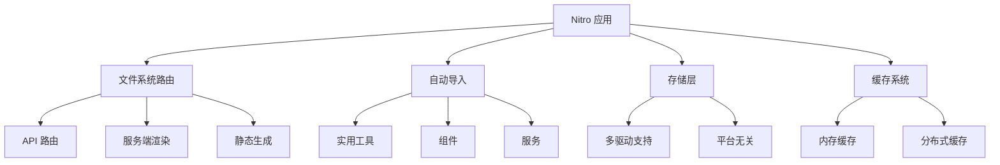

# ⚡ Nitro 全栈服务器框架

> Nitro 是 Nuxt 团队开发的全新部署工具，专为现代 Web 应用设计。它提供零配置的开发体验，支持多平台部署，是构建高性能全栈应用的理想选择。

## 🎯 Nitro 概述

### 📊 核心特性

| 特性 | 描述 | 优势 |
|------|------|------|
| **零配置** | 开箱即用的开发体验 | 🚀 快速上手 |
| **文件系统路由** | 自动注册 API 路由 | 📁 简化路由管理 |
| **TypeScript 支持** | 原生 TypeScript 支持 | 💪 类型安全 |
| **多平台部署** | 支持各种部署环境 | 🌐 部署灵活 |
| **极速冷启动** | 毫秒级启动时间 | ⚡ 高性能 |

### 🏗️ Nitro 架构



### 🌟 Nitro 特色功能

#### 💼 便携紧凑
- 📦 告别 `node_modules`，输出大小小于 1MB
- 🎒 单文件部署，无需复杂依赖管理
- 🔄 支持容器化部署

#### 🚀 极速性能
- ⚡ 毫秒级冷启动速度
- 🎯 代码拆分和异步加载
- 📈 优化的服务器渲染性能

#### 🔧 开发体验
- 🔥 热模块替换 (HMR)
- 🎨 自动导入实用工具
- 📝 TypeScript 开箱即用

## 🚀 快速开始

### 📦 安装 Nitro

```bash
# 使用 npm
npm create nitro@latest my-nitro-app
cd my-nitro-app
npm install

# 使用 pnpm
pnpm create nitro@latest my-nitro-app
cd my-nitro-app
pnpm install

# 使用 yarn
yarn create nitro my-nitro-app
cd my-nitro-app
yarn install
```

### 🔧 基础项目结构

```
my-nitro-app/
├── 📁 api/                    # API 路由
│   └── 📄 hello.ts
├── 📁 routes/                 # 页面路由
│   └── 📄 index.ts
├── 📁 public/                 # 静态文件
│   └── 📄 favicon.ico
├── 📁 utils/                  # 工具函数
│   └── 📄 helpers.ts
├── 📁 storage/                # 存储配置
├── 📁 plugins/                # 插件
├── 📄 nitro.config.ts         # Nitro 配置
├── 📄 package.json
└── 📄 tsconfig.json
```

### 🎯 开发命令

```bash
# 启动开发服务器
npm run dev

# 构建生产版本
npm run build

# 预览构建结果
npm run preview

# 类型检查
npm run typecheck
```

## ⚙️ 配置详解

### 🔧 基础配置

```typescript
// nitro.config.ts
import { defineNitroConfig } from 'nitropack/config'

export default defineNitroConfig({
  // 部署预设
  preset: 'node-server',
  
  // 输出目录配置
  output: {
    dir: '.output',
    serverDir: '.output/server',
    publicDir: '.output/public'
  },
  
  // 运行时配置
  runtimeConfig: {
    // 私有配置（仅服务端）
    apiSecret: process.env.API_SECRET,
    
    // 公开配置（客户端和服务端）
    public: {
      apiBase: process.env.API_BASE || '/api',
      siteUrl: process.env.SITE_URL || 'https://example.com'
    }
  },
  
  // 日志级别
  logLevel: process.env.NODE_ENV === 'development' ? 1 : 3,
  
  // 实验性功能
  experimental: {
    wasm: true,
    typedKV: true
  },
  
  // 时序信息
  timing: process.env.NODE_ENV === 'development',
  
  // 生产环境静态文件服务
  serveStatic: true,
  
  // 公共资源配置
  publicAssets: [
    {
      baseURL: '/images',
      dir: 'public/images',
      maxAge: 60 * 60 * 24 * 7 // 7 天
    }
  ]
})
```

### 🛣️ 路由规则配置

```typescript
// nitro.config.ts
export default defineNitroConfig({
  routeRules: {
    // 静态预渲染
    '/': { prerender: true },
    '/about': { prerender: true },
    
    // SWR 缓存
    '/blog/**': { 
      swr: 600, // 600秒缓存
      headers: { 'Cache-Control': 's-maxage=600' }
    },
    
    // 完全静态化
    '/docs/**': { 
      static: true,
      headers: { 'Cache-Control': 's-maxage=31536000' }
    },
    
    // 自定义缓存
    '/api/data/**': {
      cache: {
        maxAge: 60 * 10, // 10分钟
        name: 'api-cache',
        group: 'api'
      }
    },
    
    // 跨域配置
    '/api/public/**': {
      cors: true,
      headers: {
        'Access-Control-Allow-Methods': 'GET,POST,PUT,DELETE',
        'Access-Control-Allow-Origin': '*'
      }
    },
    
    // 重定向
    '/old-path': { redirect: '/new-path' },
    '/legacy/**': { redirect: '/modern/**' },
    
    // 代理
    '/proxy/api/**': { proxy: 'https://api.example.com/v1/**' }
  }
})
```

### 🗄️ 存储配置

```typescript
// nitro.config.ts
export default defineNitroConfig({
  storage: {
    // 内存存储
    memory: {
      driver: 'memory'
    },
    
    // 文件系统存储
    fs: {
      driver: 'fs',
      base: './storage/data'
    },
    
    // Redis 存储
    redis: {
      driver: 'redis',
      host: process.env.REDIS_HOST || 'localhost',
      port: process.env.REDIS_PORT || 6379,
      password: process.env.REDIS_PASSWORD
    },
    
    // 数据库存储
    database: {
      driver: 'mongodb',
      connectionString: process.env.MONGODB_URI
    },
    
    // 云存储
    s3: {
      driver: 's3',
      bucket: process.env.S3_BUCKET,
      accessKeyId: process.env.S3_ACCESS_KEY,
      secretAccessKey: process.env.S3_SECRET_KEY,
      region: process.env.S3_REGION
    }
  }
})
```

### 🔌 插件配置

```typescript
// nitro.config.ts
export default defineNitroConfig({
  plugins: [
    // 自定义插件
    './plugins/auth.ts',
    './plugins/database.ts',
    './plugins/cors.ts'
  ]
})
```

## 🛣️ 文件系统路由

### 📁 API 路由

```typescript
// api/hello.ts
export default defineEventHandler(async (event) => {
  return {
    message: 'Hello from Nitro API!',
    timestamp: new Date().toISOString()
  }
})

// api/users/[id].ts
export default defineEventHandler(async (event) => {
  const userId = getRouterParam(event, 'id')
  const query = getQuery(event)
  
  return {
    user: {
      id: userId,
      name: `User ${userId}`,
      ...query
    }
  }
})

// api/users/index.post.ts
export default defineEventHandler(async (event) => {
  const body = await readBody(event)
  
  // 验证请求体
  if (!body.name || !body.email) {
    throw createError({
      statusCode: 400,
      statusMessage: 'Name and email are required'
    })
  }
  
  // 创建用户逻辑
  const user = await createUser(body)
  
  return {
    success: true,
    user
  }
})
```

### 🎯 服务端渲染路由

```typescript
// routes/index.ts
export default defineEventHandler(async (event) => {
  const html = `
    <!DOCTYPE html>
    <html>
      <head>
        <title>Nitro App</title>
        <meta charset="utf-8">
        <meta name="viewport" content="width=device-width, initial-scale=1">
      </head>
      <body>
        <h1>Welcome to Nitro!</h1>
        <p>Current time: ${new Date().toLocaleString()}</p>
      </body>
    </html>
  `
  
  setHeader(event, 'Content-Type', 'text/html')
  return html
})

// routes/blog/[slug].ts
export default defineEventHandler(async (event) => {
  const slug = getRouterParam(event, 'slug')
  
  // 获取博客文章
  const post = await getBlogPost(slug)
  
  if (!post) {
    throw createError({
      statusCode: 404,
      statusMessage: 'Post not found'
    })
  }
  
  const html = `
    <!DOCTYPE html>
    <html>
      <head>
        <title>${post.title}</title>
        <meta name="description" content="${post.excerpt}">
      </head>
      <body>
        <article>
          <h1>${post.title}</h1>
          <div>${post.content}</div>
        </article>
      </body>
    </html>
  `
  
  setHeader(event, 'Content-Type', 'text/html')
  return html
})
```

## 💾 数据存储

### 🗃️ 内置存储系统

```typescript
// 使用存储 API
export default defineEventHandler(async (event) => {
  // 设置数据
  await useStorage('redis').setItem('user:123', {
    id: 123,
    name: 'John Doe',
    email: 'john@example.com'
  })
  
  // 获取数据
  const user = await useStorage('redis').getItem('user:123')
  
  // 删除数据
  await useStorage('redis').removeItem('user:123')
  
  // 列出所有键
  const keys = await useStorage('redis').getKeys()
  
  return { user, keys }
})

// 使用默认存储
export default defineEventHandler(async (event) => {
  const storage = useStorage()
  
  // 设置缓存
  await storage.setItem('cache:data', { 
    value: 'cached data',
    timestamp: Date.now()
  })
  
  // 获取缓存
  const cached = await storage.getItem('cache:data')
  
  return { cached }
})
```

### 🔄 缓存系统

```typescript
// utils/cache.ts
export const cache = {
  // 设置缓存
  async set(key: string, value: any, ttl: number = 3600) {
    const storage = useStorage('redis')
    await storage.setItem(key, {
      value,
      expires: Date.now() + ttl * 1000
    })
  },
  
  // 获取缓存
  async get(key: string) {
    const storage = useStorage('redis')
    const cached = await storage.getItem(key)
    
    if (!cached) return null
    
    if (cached.expires && Date.now() > cached.expires) {
      await storage.removeItem(key)
      return null
    }
    
    return cached.value
  },
  
  // 删除缓存
  async del(key: string) {
    const storage = useStorage('redis')
    await storage.removeItem(key)
  }
}

// 使用缓存
export default defineEventHandler(async (event) => {
  const cacheKey = 'expensive-operation'
  
  // 尝试从缓存获取
  let result = await cache.get(cacheKey)
  
  if (!result) {
    // 执行昂贵的操作
    result = await performExpensiveOperation()
    
    // 缓存结果
    await cache.set(cacheKey, result, 300) // 5分钟
  }
  
  return result
})
```

## 🔌 插件系统

### 🛠️ 创建插件

```typescript
// plugins/auth.ts
export default defineNitroPlugin(async (nitroApp) => {
  // 添加中间件
  nitroApp.hooks.hook('request', async (event) => {
    // 跳过公开路由
    if (event.node.req.url?.startsWith('/api/public')) {
      return
    }
    
    // 验证认证
    const token = getCookie(event, 'auth-token') || getHeader(event, 'authorization')
    
    if (!token) {
      throw createError({
        statusCode: 401,
        statusMessage: 'Authentication required'
      })
    }
    
    // 验证 token
    const user = await verifyToken(token)
    
    if (!user) {
      throw createError({
        statusCode: 401,
        statusMessage: 'Invalid token'
      })
    }
    
    // 设置用户上下文
    event.context.user = user
  })
})

// plugins/database.ts
export default defineNitroPlugin(async (nitroApp) => {
  // 初始化数据库连接
  const db = await connectDatabase()
  
  // 将数据库实例添加到上下文
  nitroApp.hooks.hook('request', async (event) => {
    event.context.db = db
  })
  
  // 应用关闭时断开连接
  nitroApp.hooks.hook('close', async () => {
    await db.disconnect()
  })
})
```

### 🌐 CORS 插件

```typescript
// plugins/cors.ts
export default defineNitroPlugin(async (nitroApp) => {
  nitroApp.hooks.hook('request', async (event) => {
    // 设置 CORS 头部
    setHeader(event, 'Access-Control-Allow-Origin', '*')
    setHeader(event, 'Access-Control-Allow-Methods', 'GET,POST,PUT,DELETE,OPTIONS')
    setHeader(event, 'Access-Control-Allow-Headers', 'Content-Type, Authorization')
    
    // 处理预检请求
    if (event.node.req.method === 'OPTIONS') {
      setResponseStatus(event, 200)
      return ''
    }
  })
})
```

## 🎯 实际应用示例

### 🏗️ 完整 API 服务

```typescript
// api/todos/index.get.ts
export default defineEventHandler(async (event) => {
  const query = getQuery(event)
  const page = parseInt(query.page as string) || 1
  const limit = parseInt(query.limit as string) || 10
  
  const todos = await getTodos({
    page,
    limit,
    completed: query.completed === 'true'
  })
  
  return {
    todos,
    pagination: {
      page,
      limit,
      total: todos.length
    }
  }
})

// api/todos/index.post.ts
export default defineEventHandler(async (event) => {
  const body = await readBody(event)
  
  // 验证数据
  if (!body.title) {
    throw createError({
      statusCode: 400,
      statusMessage: 'Title is required'
    })
  }
  
  const todo = await createTodo({
    title: body.title,
    completed: false,
    userId: event.context.user.id
  })
  
  return {
    success: true,
    todo
  }
})

// api/todos/[id].put.ts
export default defineEventHandler(async (event) => {
  const id = getRouterParam(event, 'id')
  const body = await readBody(event)
  
  const todo = await updateTodo(id, body)
  
  if (!todo) {
    throw createError({
      statusCode: 404,
      statusMessage: 'Todo not found'
    })
  }
  
  return {
    success: true,
    todo
  }
})
```

### 🔄 中间件系统

```typescript
// middleware/auth.ts
export default defineEventHandler(async (event) => {
  // 只对 API 路由进行认证
  if (!event.node.req.url?.startsWith('/api/')) {
    return
  }
  
  // 跳过公开端点
  if (event.node.req.url?.startsWith('/api/public/')) {
    return
  }
  
  const token = getHeader(event, 'authorization')?.replace('Bearer ', '')
  
  if (!token) {
    throw createError({
      statusCode: 401,
      statusMessage: 'Token required'
    })
  }
  
  try {
    const user = await verifyJWT(token)
    event.context.user = user
  } catch (error) {
    throw createError({
      statusCode: 401,
      statusMessage: 'Invalid token'
    })
  }
})

// middleware/ratelimit.ts
export default defineEventHandler(async (event) => {
  const ip = getClientIP(event)
  const key = `ratelimit:${ip}`
  
  const current = await useStorage().getItem(key) || 0
  
  if (current >= 100) { // 100 requests per hour
    throw createError({
      statusCode: 429,
      statusMessage: 'Rate limit exceeded'
    })
  }
  
  await useStorage().setItem(key, current + 1, { ttl: 3600 })
})
```

## 🚀 部署配置

### 📦 部署预设

```typescript
// nitro.config.ts
export default defineNitroConfig({
  // Node.js 服务器
  preset: 'node-server',
  
  // Vercel 部署
  // preset: 'vercel',
  
  // Netlify 部署
  // preset: 'netlify',
  
  // Cloudflare Workers
  // preset: 'cloudflare-workers',
  
  // AWS Lambda
  // preset: 'aws-lambda',
  
  // Docker 部署
  // preset: 'docker',
  
  // 静态托管
  // preset: 'static'
})
```

### 🐳 Docker 部署

```dockerfile
# Dockerfile
FROM node:18-alpine

WORKDIR /app

# 复制依赖文件
COPY package*.json ./
RUN npm ci --only=production

# 复制源代码
COPY . .

# 构建应用
RUN npm run build

# 暴露端口
EXPOSE 3000

# 启动应用
CMD ["node", ".output/server/index.mjs"]
```

```yaml
# docker-compose.yml
version: '3.8'

services:
  nitro-app:
    build: .
    ports:
      - "3000:3000"
    environment:
      - NODE_ENV=production
      - NITRO_PORT=3000
      - API_SECRET=your-secret-key
    depends_on:
      - redis
      - mongodb
  
  redis:
    image: redis:7-alpine
    ports:
      - "6379:6379"
  
  mongodb:
    image: mongo:6
    ports:
      - "27017:27017"
    environment:
      - MONGO_INITDB_ROOT_USERNAME=admin
      - MONGO_INITDB_ROOT_PASSWORD=password
```

## 🎯 最佳实践

### 🏆 开发规范

| 实践 | 描述 | 建议 |
|------|------|------|
| **类型安全** | 使用 TypeScript | 💪 定义接口和类型 |
| **错误处理** | 统一错误处理机制 | 🚨 使用 createError |
| **缓存策略** | 合理使用缓存 | 🗄️ 缓存昂贵操作 |
| **安全性** | 输入验证和认证 | 🔐 验证所有输入 |
| **监控日志** | 记录关键操作 | 📊 使用结构化日志 |

### 🔧 性能优化

```typescript
// 使用流式响应
export default defineEventHandler(async (event) => {
  const stream = new ReadableStream({
    start(controller) {
      // 分块发送数据
      const chunks = ['chunk1', 'chunk2', 'chunk3']
      
      chunks.forEach(chunk => {
        controller.enqueue(new TextEncoder().encode(chunk))
      })
      
      controller.close()
    }
  })
  
  return stream
})

// 使用 Server-Sent Events
export default defineEventHandler(async (event) => {
  setHeader(event, 'Content-Type', 'text/event-stream')
  setHeader(event, 'Cache-Control', 'no-cache')
  setHeader(event, 'Connection', 'keep-alive')
  
  const stream = new ReadableStream({
    start(controller) {
      const interval = setInterval(() => {
        const data = `data: ${JSON.stringify({ timestamp: Date.now() })}\n\n`
        controller.enqueue(new TextEncoder().encode(data))
      }, 1000)
      
      // 清理定时器
      setTimeout(() => {
        clearInterval(interval)
        controller.close()
      }, 30000)
    }
  })
  
  return stream
})
```

## 📚 相关资源

### 🔗 官方文档
- [Nitro 官方文档](https://nitro.unjs.io/)
- [Nuxt 3 文档](https://nuxt.com/)
- [UnJS 生态系统](https://unjs.io/)

### 🛠️ 相关工具
- [h3](https://github.com/unjs/h3) - HTTP 框架
- [ofetch](https://github.com/unjs/ofetch) - HTTP 客户端
- [unstorage](https://github.com/unjs/unstorage) - 存储抽象层
- [ufo](https://github.com/unjs/ufo) - URL 工具

### 📖 学习资源
- [Nitro 最佳实践](https://nitro.unjs.io/guide/best-practices)
- [全栈开发指南](https://nitro.unjs.io/guide/full-stack)
- [部署指南](https://nitro.unjs.io/deploy)

---

::: tip 💡 小贴士
Nitro 的设计理念是"零配置即可使用，需要时可深度定制"。它特别适合构建 API 服务、全栈应用和 JAMstack 项目。充分利用其文件系统路由和自动导入功能，可以大幅提升开发效率。
:::

::: warning ⚠️ 注意
在生产环境中，请确保正确配置环境变量、设置适当的缓存策略，并实施必要的安全措施。定期更新 Nitro 版本以获取最新的性能优化和安全修复。
:::
