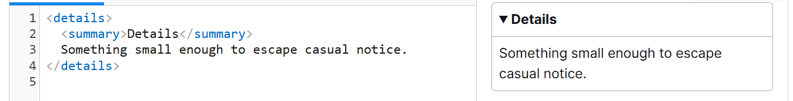

# 📝 HTML 基础与标签详解

HTML（HyperText Markup Language，超文本标记语言）是一种用来告知浏览器如何组织页面的标记语言。HTML 由一系列的元素组成，这些元素可以用来包围或标记不同部分的内容，使其以某种方式呈现或者工作。

---

## 1. meta 元素

::: info 元数据说明
元数据就是描述数据的数据。
:::

::: warning SEO 提示
许多 `<meta>` 特性已经不再使用。例如，`keywords` 元素已被主流搜索引擎忽略。
:::

```html
<!-- 声明文档使用的字符编码 -->
<meta charset="utf-8" />
<!-- 优先使用 IE 最新版本和 Chrome -->
<meta http-equiv="X-UA-Compatible" content="IE=edge,chrome=1" />
<!-- 页面描述 -->
<meta name="description" content="不超过150个字符" />
<!-- 页面关键词 -->
<meta name="keywords" content="" />
<!-- 网页作者 -->
<meta name="author" content="name, email@gmail.com" />
<!-- 搜索引擎抓取 -->
<meta name="robots" content="index,follow" />
<!-- 为移动设备添加 viewport -->
<meta name="viewport" content="width=device-width, initial-scale=1, maximum-scale=3, minimum-scale=1, user-scalable=no" />

<!-- iOS 设备相关 -->
<meta name="apple-mobile-web-app-title" content="标题" />
<meta name="apple-mobile-web-app-capable" content="yes" />
<meta name="apple-itunes-app" content="app-id=myAppStoreID, affiliate-data=myAffiliateData, app-argument=myURL" />
<meta name="apple-mobile-web-app-status-bar-style" content="black" />
<meta name="format-detection" content="telphone=no, email=no" />

<!-- 浏览器兼容性与优化 -->
<meta name="renderer" content="webkit" />
<meta http-equiv="X-UA-Compatible" content="IE=edge" />
<meta http-equiv="Cache-Control" content="no-siteapp" />
<meta name="HandheldFriendly" content="true" />
<meta name="MobileOptimized" content="320" />
<meta name="screen-orientation" content="portrait" />
<meta name="x5-orientation" content="portrait" />
<meta name="full-screen" content="yes" />
<meta name="x5-fullscreen" content="true" />
<meta name="browsermode" content="application" />
<meta name="x5-page-mode" content="app" />
<meta name="msapplication-tap-highlight" content="no" />

<!-- 页面缓存控制 -->
<meta http-equiv="pragma" content="no-cache" />
<meta http-equiv="cache-control" content="no-cache" />
<meta http-equiv="expires" content="0" />

<!-- Apple Touch Icons -->
<link rel="apple-touch-icon" sizes="167x167" href="/apple-touch-icon-167x167.png" />
<link rel="apple-touch-icon" sizes="180x180" href="/apple-touch-icon-180x180.png" />
<link rel="apple-touch-icon" sizes="152x152" href="/apple-touch-icon-152x152.png" />
<link rel="apple-touch-icon" href="/apple-touch-icon-120x120.png" />
<link rel="icon" href="/favicon.ico" />
```

---

## 2. 文档语言

HTML 设置文档的语言，有助于搜索引擎索引和无障碍访问。

```html
<!--为文档设置语言-->
<html lang="zh-CN">
  <!--文档分段设置不同的语言-->
  <p>Japanese example: <span lang="ja">ご飯が熱い。</span>.</p>
</html>
```

---

## 3. 常用 HTML 标签

| 标签 | 作用 | 说明 |
|------|------|------|
| blockquote | 块级引用 | 引用长文本 |
| q | 行内引用 | 短文本引用 |
| abbr | 缩略语 | 鼠标悬停显示全称 |
| address | 联系方式 | 通常用于页脚 |
| sup/sub | 上/下标 | 数学、化学公式 |
| code/pre | 代码 | `pre` 保留空白，`code` 标记代码 |
| var/kbd/samp | 变量/键盘/输出 | 语义化标记 |
| time | 时间 | `<time datetime="2016-01-20">2016 年 1 月 20 日</time>` |
| br/hr | 换行/分割线 | 结构辅助 |
| figure/figcaption | 图文组合 | 图像、代码片段等 |
| col/colgroup | 表格列 | 配合 `<table>` 使用 |
| data | 机器可读数据 | `<data value='12'>中国</data>` |
| datalist | 选项列表 | `<input list="datalist-id">` |
| details/summary | 折叠面板 | 交互式内容 |
| fieldset/legend | 表单分组 | 结构化表单 |
| hgroup | 标题组合 | 组合主副标题 |
| map/area | 图像映射 | 区域链接 |
| menu | 菜单 | 语义化列表 |
| meter | 进度/比例 | `<meter value="50">` |
| optgroup | 下拉分组 | `<select>` 选项分组 |
| output | 结果输出 | 计算结果 |
| progress | 进度条 | `<progress value="70">` |
| search | 搜索容器 | 语义化搜索 |
| slot | Web组件插槽 | 组件开发 |
| small | 小字 | 版权、法律文本 |
| template | 模板 | JS动态渲染 |
| track | 媒体字幕 | `<video>`/`<audio>` 字幕 |

::: details details/summary 折叠面板示例
{data-fancybox="gallery"}
:::

### hgroup 示例

```html
<hgroup>
  <h1>Frankenstein</h1>
  <p>Or: The Modern Prometheus</p>
</hgroup>
```

### meter 示例

```html
<meter id="fuel" min="0" max="100" low="33" high="66" optimum="80" value="50">
  at 50/100
</meter>
```

### progress 示例

```html
<progress id="file" max="100" value="70">70%</progress>
```

---

## 4. 媒体标签 audio 和 video

audio 和 video 元素的使用方式几乎完全一致。区别：audio 不支持 width/height/poster 属性，因为没有视觉部件。

```html
<video
  controls
  width="400"
  height="400"
  autoplay
  loop
  muted
  preload="auto"
  poster="poster.png">
  <source src="rabbit320.mp4" type="video/mp4" />
  <source src="rabbit320.webm" type="video/webm" />
  <track kind="subtitles" src="subtitles_es.vtt" srclang="es" label="Spanish" />
  <track default kind="captions" srclang="en" src="/media/examples/friday.vtt" />
  <p>你的浏览器不支持此视频。可点击<a href="rabbit320.mp4">此链接</a>观看</p>
</video>
```

::: tip 属性说明
- controls 是否显示视频控件
- autoplay 自动播放
- loop 循环播放
- muted 静音模式
- preload 缓存策略（none/auto/metadata）
- poster 视频封面
- width/height 视频尺寸
:::

::: info
source 标签可设置多个视频源，浏览器会按顺序选择支持的格式。
:::

::: details track 字幕说明
- srclang：字幕语言
- label：语言标签
- kind：字幕类型（subtitles/captions/chapters/metadata/description/timedtext）
- 一个 media 元素的任意两个 track 子元素不能有相同的 kind, srclang, 和 label 属性
:::

#### WebVTT 字幕文件示例

```txt
WEBVTT

1
00:00:22.230 --> 00:00:24.606
第一段字幕

2
00:00:30.739 --> 00:00:34.074
第二段字幕
```

---

## 5. iframe 嵌入网页

iframe 用于在页面中嵌入其他网页。

| 属性 | 说明 |
|------|------|
| border | 边框 |
| src | 嵌入文档URL |
| width/height | 尺寸 |
| allowfullscreen | 是否允许全屏 |
| allow | 权限策略 |
| sandbox | 沙箱限制 |

```html
<iframe src="https://example.com" allow="geolocation 'none'"></iframe>
```

::: tip sandbox 常用值
- allow-forms 允许表单提交
- allow-modals 允许模态窗口
- allow-orientation-lock 允许锁定屏幕方向
- allow-popups 允许弹窗
- allow-same-origin 视为同源
- allow-scripts 允许运行脚本
- allow-top-navigation 允许导航到顶级上下文
:::

> 最好在主内容完成加载后，再用 JS 设置 iframe 的 src 属性，以减少页面加载时间

---

## 6. embed 和 object 元素

用于嵌入 PDF、Flash、SVG 等外部资源。

```html
<object data="mypdf.pdf" type="application/pdf" width="800" height="1200">
  不支持 PDF
</object>

<embed src="mypdf.pdf" type="application/pdf" width="800" height="1200">
  不支持 PDF
</embed>
```

---

## 7. SVG 简介

SVG（Scalable Vector Graphics）是一种用于描述矢量图形的 XML 标记。

- 支持基本图形（如 `<circle>`、`<rect>`）、复杂路径（`<path>`、`<polygon>`）
- 支持滤镜、动画、蒙版等高级特性

```html
<svg
  version="1.1"
  baseProfile="full"
  width="300"
  height="200"
  xmlns="http://www.w3.org/2000/svg">
  <rect width="100%" height="100%" fill="black" />
  <circle cx="150" cy="100" r="90" fill="blue" />
</svg>
```

::: tip SVG 优势
- 文本可访问，利于 SEO
- 可用 CSS/JS 动态控制
- 响应式自适应
:::
