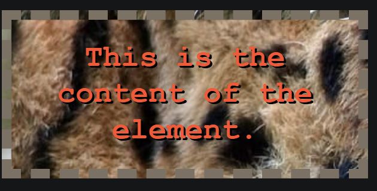
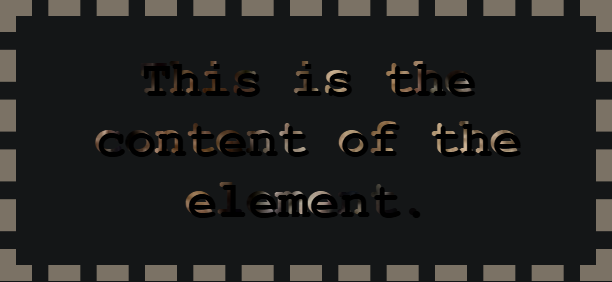
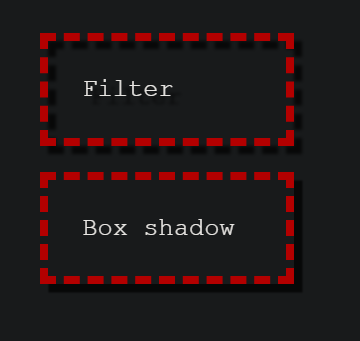

# 🎨 CSS 基础语法和核心特性

层叠样式表（**Cascading Style Sheets，CSS**）是一种样式表语言，用来描述 HTML 或 XML 文档的呈现方式。CSS 是开放 Web 的核心语言之一，并根据 W3C 规范在 Web 浏览器中进行了标准化。

::: tip 📚 本章内容
深入学习 CSS 的核心概念、语法特性和实用技巧，掌握现代 CSS 开发的最佳实践。
:::

## 🏆 CSS 样式优先级

CSS 样式优先级决定了哪个样式规则最终会被应用到元素上。理解优先级对于有效管理样式至关重要。

### ⚖️ 优先级规则

| 优先级 | 类型 | 权重值 | 示例 |
|--------|------|--------|------|
| **1** | `!important` | 最高 | `color: red !important;` |
| **2** | 内联样式 | 1000 | `<div style="color: blue;">` |
| **3** | ID 选择器 | 100 | `#header { color: green; }` |
| **4** | 类选择器 | 10 | `.nav { color: purple; }` |
| **5** | 标签选择器 | 1 | `div { color: black; }` |

::: warning ⚠️ 优先级计算
内联样式优先于所有普通样式，无论其优先级如何。同优先级的样式，书写顺序在后面的会覆盖前面的。
:::

### 📊 级联层（Cascade Layers）

```css
/* 定义级联层顺序 */
@layer layer1, layer2;

/* 不同级联层的优先级：匿名级联层 > layer2 > layer1 */
```

**优先级总结**：在统一级联层时：
```
!important > 内联样式 > ID > Class > 标签
```

不同级联层时：
```
匿名级联层 > layer2 > layer1
```

## 🔗 CSS 嵌套

CSS 嵌套类似于 Sass 预处理器，但它是被浏览器直接解析的现代 CSS 特性。

::: info 💡 嵌套特点
`&` 嵌套选择器的优先级类似于 `:is()` 函数，由关联选择器列表中优先级最高的选择器决定。
:::

### 🎯 嵌套语法示例

```css
.myClass {
  display: grid;
  
  /* 使用嵌套选择器 */
  &:hover {
    background: red;
  }

  /* 嵌套和组合关系选择器 */
  &.b {
    /* 等价于 .myClass.b */
  }

  /* 嵌套关系选择器 等价于 & + p */
  + p {
    color: white;
    background-color: black;
  }

  /* & 嵌套选择器添加到选择器后方，反转上下文 */
  .bar & {
    /* .bar .myClass 的样式 */
  }

  /* 元素拼接（会被解析为 element.myClass） */
  element& {
    /* 样式规则 */
  }

  /* ⚠️ 无效语法：%在选择器中无效，规则将被忽略 */
  & %invalid {
    /* 无效样式，全部被忽略 */
  }

  /* ⚠️ CSS 不支持 BEM 风格的拼接 */
  &__child-element {
    /* 不推荐使用 */
  }

  /* 可以嵌套媒体查询 */
  @media (orientation: landscape) {
    grid-auto-flow: column;
    
    @media (min-width: 1024px) {
      max-inline-size: 1024px;
    }
  }

  /* 可以嵌套级联层 */
  @layer base {
    /* 等价于 @layer base .myClass */
    block-size: 100%;
    
    @layer support {
      /* 等价于 @layer base.support .myClass .bar */
      & .bar {
        min-block-size: 100%;
      }
    }
  }
}
```

## 📐 CSS 坐标系

CSS 对象模型使用四种标准坐标系，理解这些坐标系对于处理定位和事件至关重要。


### 🌍 四种坐标系统

| 坐标系 | 原点位置 | 特点 | 相关属性 |
|--------|----------|------|----------|
| **屏幕坐标系** | 用户屏幕左上角 | 逻辑像素，整数递增 | `screenX`, `screenY` |
| **页面坐标系** | 整个文档左上角 | 相对于完整文档 | `pageX`, `pageY` |
| **视口坐标系** | 浏览器窗口左上角 | 可视区域坐标 | `clientX`, `clientY` |
| **偏移坐标系** | 目标元素左上角 | 相对于事件元素 | `offsetX`, `offsetY` |

#### 1. 🖥️ 屏幕坐标系（Screen）
- **原点**：用户屏幕空间的左上角
- **特点**：每个坐标都代表一个逻辑像素
- **用途**：Mouse 事件和 Touch 事件

#### 2. 📄 页面坐标系（Page）  
- **原点**：整个渲染文档的左上角
- **特点**：滚动后元素位置保持不变（除非布局改变）
- **用途**：绝对定位计算

#### 3. 🔲 视口坐标系（Window/Client）
- **原点**：浏览器窗口左上角 `(0, 0)`
- **特点**：随文档滚动而变化
- **用途**：可见区域内的定位

#### 4. 📍 偏移坐标系（Offset）
- **原点**：被检查元素或发生事件的元素左上角
- **特点**：相对于目标元素定位
- **用途**：元素内部的精确定位

## 🎨 Background 背景属性

背景属性是 CSS 中最常用的装饰性属性之一，提供了丰富的视觉效果。

### 📎 background-attachment 背景滚动方式

| 值 | 说明 | 效果 |
|----|----- |------|
| `fixed` | 背景固定到视口 | 始终保持在屏幕相同位置 |
| `scroll` | 背景固定到页面 | 跟随页面滚动，元素内容滚动时背景不动 |
| `local` | 背景固定到元素 | 滚动元素时，背景随之滚动 |

### ✂️ background-clip 背景裁剪

控制背景的绘制区域范围：

```css
/* 关键字值 */
background-clip: border-box;    /* 延伸至边框外沿 */
background-clip: padding-box;   /* 延伸至内边距外沿 */
background-clip: content-box;   /* 裁剪至内容区外沿 */
background-clip: text;          /* 裁剪成文字形状 */
```

#### 🖼️ 视觉效果对比

**设置为 `border-box` 时**：


**设置为 `text` 时**：


::: tip 💡 创意用法
`background-clip: text` 可以创建炫酷的文字渐变效果，常用于标题设计。
:::

### 📝 background 简写属性

```css
/* 语法顺序 */
background: [background-color] [background-image] [background-position]/[background-size] [background-repeat];

/* 示例 */
background: red center center / 400px 200px no-repeat;
```

## ✍️ Writing-mode 书写模式

书写模式定义了文本的排列方向，对于国际化和创意布局非常重要。

### 📊 书写模式配置

| 值 | 行内轴方向 | 块轴方向 | 说明 |
|----|-----------|---------|----- |
| `horizontal-tb` | 水平 | 从上至下 | 默认值，常规横向文本 |
| `vertical-rl` | 纵向 | 从右向左 | 竖直文本，从右到左排列 |
| `vertical-lr` | 纵向 | 从左向右 | 竖直文本，从左到右排列 |

### 🔄 逻辑属性映射

在纵向书写模式下，传统的 `width` 和 `height` 需要使用逻辑属性：

#### 📏 尺寸属性
| 传统属性 | 逻辑属性 | 说明 |
|----------|----------|------|
| `width` | `inline-size` | 内联维度尺寸 |
| `height` | `block-size` | 块级维度尺寸 |

#### 📦 间距属性  
| 传统属性 | 逻辑属性 |
|----------|----------|
| `margin-top` | `margin-block-start` |
| `padding-left` | `padding-inline-start` |
| `border-bottom` | `border-block-end` |

#### 🧭 方向值
| 传统值 | 逻辑值 |
|--------|--------|
| `top` | `block-start` |
| `right` | `inline-end` |
| `bottom` | `block-end` |
| `left` | `inline-start` |

## 🎭 Filter 滤镜效果

CSS 滤镜提供了强大的视觉效果处理能力，常用于调整图像、背景和边框的渲染效果。

### ✨ 滤镜 vs 阴影对比

滤镜的 `drop-shadow()` 函数与 `box-shadow` 效果相似，但更加精细：

```css
.element {
  /* 滤镜阴影 - 跟随元素的确切形状 */
  filter: drop-shadow(5px 5px 1px rgba(0, 0, 0, 0.7));
  
  /* 盒子阴影 - 仅跟随盒子的矩形边界 */
  box-shadow: 5px 5px 1px rgba(0, 0, 0, 0.7);
}
```



**关键区别**：
- `drop-shadow` 滤镜跟随文本和边框虚线的确切形状
- `box-shadow` 仅跟随盒子的四方形状

### 🎨 常用滤镜函数

```css
/* 滤镜组合使用 */
filter: blur(5px)           /* 模糊 */
        brightness(0.4)     /* 亮度 */
        contrast(200%)      /* 对比度 */
        drop-shadow(16px 16px 20px blue); /* 投影 */

/* URL 引入 SVG 滤镜 */
filter: url('#my-filter');
```

### 📋 滤镜函数列表

| 函数 | 作用 | 示例 |
|------|------|------|
| `blur()` | 高斯模糊 | `blur(5px)` |
| `brightness()` | 亮度调节 | `brightness(150%)` |
| `contrast()` | 对比度 | `contrast(200%)` |
| `drop-shadow()` | 投影 | `drop-shadow(2px 2px 4px #000)` |
| `grayscale()` | 灰度 | `grayscale(100%)` |
| `hue-rotate()` | 色相旋转 | `hue-rotate(90deg)` |
| `invert()` | 反色 | `invert(100%)` |
| `opacity()` | 透明度 | `opacity(50%)` |
| `saturate()` | 饱和度 | `saturate(200%)` |
| `sepia()` | 褐色滤镜 | `sepia(100%)` |

::: warning ⚠️ 注意事项
如果任何滤镜函数的参数无效，整个 `filter` 属性将返回 `none`。
:::

## 🎯 最佳实践

### ✅ 推荐做法

1. **优先级管理**
   - 避免过度使用 `!important`
   - 合理组织 CSS 选择器结构
   - 使用级联层管理大型项目

2. **嵌套使用**
   - 适度嵌套，避免过深层级
   - 善用 `&` 选择器简化代码
   - 媒体查询嵌套提高可维护性

3. **逻辑属性**
   - 在多语言项目中使用逻辑属性
   - 考虑不同书写模式的兼容性

4. **滤镜效果**
   - 注意性能影响，避免过度使用
   - 组合使用多个滤镜创建复合效果

### ❌ 避免的问题

- 选择器权重过高导致难以覆盖
- 过度依赖 `!important`
- 忽视不同坐标系的差异
- 滤镜参数错误导致整体失效

## 📚 相关资源

- [CSS 规范文档](https://www.w3.org/Style/CSS/)
- [MDN CSS 参考](https://developer.mozilla.org/zh-CN/docs/Web/CSS)
- [Can I Use - CSS 兼容性](https://caniuse.com/)
- [CSS-Tricks](https://css-tricks.com/)

---

::: tip 🚀 继续学习
掌握了 CSS 基础后，建议深入学习 CSS Grid、Flexbox、动画等高级特性。
:::
