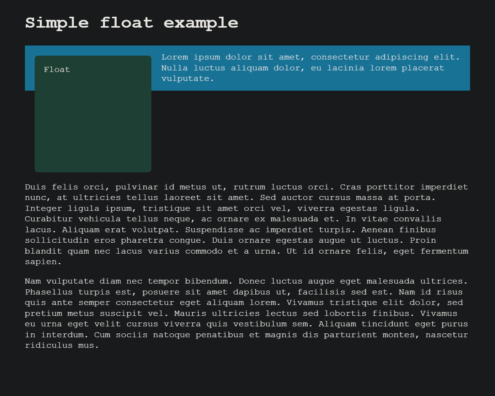
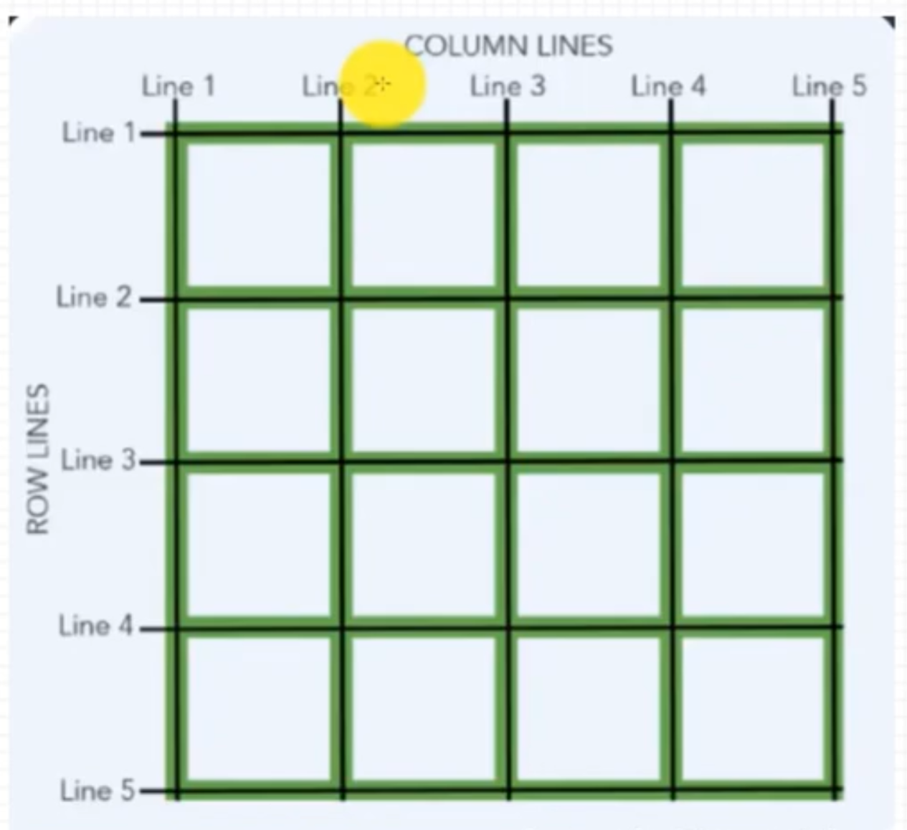

# 🎨 CSS 布局技术详解

CSS 布局是前端开发的核心技能之一，掌握各种布局技术能够帮助我们构建出灵活、响应式的网页界面。本文将详细介绍各种 CSS 布局方法及其应用场景。

## 📋 常用布局方式概览

现代 CSS 提供了多种布局技术，每种都有其特定的用途和优势：

| 布局方式 | 特点 | 适用场景 | 兼容性 |
|---------|------|----------|--------|
| 正常布局流 | 浏览器默认布局 | 简单文档流 | ✅ 完美 |
| 盒模型 | 元素空间计算 | 基础布局控制 | ✅ 完美 |
| Float 浮动 | 元素脱离文档流 | 文字环绕、传统布局 | ✅ 完美 |
| Position 定位 | 精确位置控制 | 层叠、固定定位 | ✅ 完美 |
| Flexbox 弹性盒 | 一维布局 | 组件内部布局 | ✅ 现代浏览器 |
| Grid 网格 | 二维布局 | 复杂页面布局 | ✅ 现代浏览器 |
| Multicol 多列 | 报纸式排版 | 文章内容展示 | ✅ 现代浏览器 |
| Table 表格 | 表格式布局 | 数据展示 | ✅ 完美 |

::: info 💡 布局选择原则
每种技术都有它们的用途，各有优缺点，相互辅助。通过理解各个布局方法的设计理念，你能够找到构建你想要的网页需要的布局方案。
:::

## 🎯 元素垂直居中

垂直居中是 CSS 布局中的经典问题，不同的场景需要采用不同的解决方案。

::: warning 📝 重要提示
- `text-align` 只对文本或 `display: inline/inline-block` 的子元素有效
- `vertical-align` 只能定义在 `display: inline/inline-block` 的元素上（`table-cell` 也算）
- 对于 `display: inline` 元素，设置上下 `padding` 和 `margin` 无效，左右有效，`border` 都有效
:::

### 🔍 居中方案分析

```html
<div class="nav">
  <div class="zhangjinxi2"><span>222222222222222</span></div>
</div>
```

#### 1️⃣ 容器 display 为 inline

这种情况一般用于文字的居中对齐：

- **水平居中**: `text-align: center`
- **垂直居中**: `vertical-align: middle` 或者 `line-height` 等于 `height`

#### 2️⃣ 容器和子元素都为 block 或 inline-block

根据宽高是否固定，有不同的解决方案：

##### 📏 父子宽高都固定
- 利用盒模型的 `margin` 和 `padding` 实现
- 利用 `position` 定位的 `left` 和 `top` 实现

##### 🔄 父子至少有一个不固定

**方案一：Flex 布局（推荐）**

```css
.nav {
  display: flex;
  justify-content: center;
  align-items: center;
}
```

**方案二：Grid 布局**

```css
.nav {
  display: grid;
  .zhangjinxi2 {
    justify-self: center;
    align-self: center;
  }
}
```

**方案三：Position + Transform**

```css
.nav {
  position: relative;
  .zhangjinxi2 {
    position: absolute;
    top: 50%;
    left: 50%;
    transform: translate(-50%, -50%);
  }
}
```

**方案四：Position + Margin Auto**

```css
.nav {
  position: relative;
  .zhangjinxi2 {
    position: absolute;
    top: 0;
    left: 0;
    right: 0;
    bottom: 0;
    margin: auto;
  }
}
```



## 🏗️ 三列布局

三列布局是网页设计中的经典布局模式，通常包含左侧边栏、主内容区和右侧边栏。

```html
<div class="nav">
  <div class="zhangjinxi">111</div>
  <div class="zhangjinxi2">222</div>
  <div class="zhangjinxi3">33333</div>
</div>
```

### 💡 实现方案对比

| 方案 | 优点 | 缺点 | 兼容性 |
|------|------|------|--------|
| 圣杯布局 | 兼容性好 | 代码复杂 | ✅ IE6+ |
| 双飞翼布局 | 结构清晰 | 需要额外标签 | ✅ IE6+ |
| Flex 布局 | 简单灵活 | 兼容性一般 | ✅ IE10+ |
| Grid 布局 | 最简洁 | 兼容性较差 | ✅ 现代浏览器 |

### 1️⃣ 圣杯布局（Float + Margin）

```css
.nav {
  .zhangjinxi {
    width: 100%;
    float: left;
    box-sizing: border-box;
    padding: 0 200px;
  }
  .zhangjinxi2 {
    width: 200px;
    float: left;
    margin-left: -100%;
  }
  .zhangjinxi3 {
    width: 200px;
    float: left;
    margin-left: -200px;
  }
}
```

### 2️⃣ 双飞翼布局（Position）

```css
.nav {
  position: relative;
  .zhangjinxi {
    width: 100%;
    box-sizing: border-box;
    padding: 0 200px;
  }
  .zhangjinxi2 {
    position: absolute;
    width: 200px;
    top: 0;
  }
  .zhangjinxi3 {
    position: absolute;
    width: 200px;
    top: 0;
    right: 0;
  }
}
```

### 3️⃣ Flex 布局（推荐）

两端设置 `flex-basis` 为固定宽度，中间元素设置 `flex-grow: 1` 占满剩余宽度。

```css
.nav {
  display: flex;
  .zhangjinxi,
  .zhangjinxi3 {
    flex-basis: 200px;
  }
  .zhangjinxi2 {
    flex-grow: 1;
  }
}
```

### 4️⃣ Grid 布局（最简洁）

`fr` 单位表示剩余空间占据的份数。

```css
.nav {
  display: grid;
  grid-template-columns: 200px 1fr 200px;
}
```



## 📱 响应式设计概念

**响应式网页设计**（Responsive Web Design，RWD）指的是允许 Web 页面适应不同屏幕宽度因素等，进行布局和外观的调整的一系列实践。

::: tip 🎯 现代布局优势
弹性盒、网格和多栏布局都可以建立可伸缩的响应式组件，使用更方便。
:::

### 📺 媒体查询

媒体查询（Media Queries）非常实用，尤其是当你想要根据设备的大致类型或特定特征来修改网站或应用程序时。

**断点（Breakpoints）**: 媒体查询以及样式改变时的点被称为断点。

#### 🚀 移动优先设计

使用媒体查询时的一种通用方式是，为窄屏设备（如移动设备）创建简单的单栏布局，然后检查是否是大屏幕，在有足够容纳的屏幕宽度时，开始采用多栏布局。

```css
/* 移动端优先的基础样式 */
.container {
  margin: 1em;
}

/* 在屏幕尺寸大于800px时，应用此样式。800px称为断点 */
@media screen and (min-width: 800px) {
  .container {
    margin: 1em 2em;
  }
}

/* @media也可以判断屏幕分辨率等其他条件 */
@media screen and (min-width: 1200px) and (orientation: landscape) {
  .container {
    max-width: 1200px;
    margin: 0 auto;
  }
}
```

### 🔧 灵活网格

**Flex Formatting Context**（灵活格式化上下文）：flex 弹性盒子、grid 容器、multicol 多列布局容器将其子元素布局为灵活项，子元素则为块级格式化上下文。

#### 📈 发展历程

1. **早期方案**: 使用 `float` + 百分比数字实现
2. **现代布局技术**:

##### 🗞️ Multicol 多列布局

```css
/* 三列布局，占满整个屏幕 */
.content {
  column-count: 3;
}

/* 列宽最小10em，尽可能占用更多的列，不足一列的，平均分配剩余空间 */
.content {
  column-width: 10em;
}
```

##### 🔄 Flex 弹性盒布局

- 初始行为：弹性的物件将参照容器里面的空间大小，缩小和分布物件之间的空间
- 通过 `flex-grow`、`flex-shrink` 指定如何分配剩余空间

##### 🎯 Grid 网格布局

`fr` 单位允许跨网格轨道可用空间的分布：

```css
.container {
  display: grid;
  grid-template-columns: 1fr 1fr 1fr;
}
```

### 🖼️ 响应式图像

::: warning ❓ 为什么不用 CSS 或 JavaScript 实现？

当浏览器开始加载页面时，它会在主解析器开始加载和解释页面的 CSS 和 JavaScript 之前，预先下载（预加载）所有图像。这种机制通常有助于减少页面加载时间，但对于响应式图像并不有用，因此需要实现类似 `srcset` 的解决方案。
:::

#### 🛠️ 实现方案

##### 1️⃣ 基础响应式

```css
img {
  /* 设置宽度最大为100%，不会超过父容器的大小 */
  max-width: 100%;
  height: auto;
}
```

##### 2️⃣ srcset 和 sizes 特性

手机和桌面屏幕大小不同，应用同样的图片，对移动端来说浪费带宽，尺寸也不匹配。

```html

```

**参数说明**:

- **srcset**: 图片集合以及每个图片的大小
  - 文件 URL
  - 一个空格
  - 图片的固有宽度（以 `w` 为单位，而非 `px`）
  
- **sizes**: 媒体条件并指明当某些媒体条件为真时的最佳图片尺寸
  - 一个媒体条件，例如：`(max-width: 600px)`
  - 一个空格
  - 当媒体条件为真时，图像将填充的插槽宽度（`480px`）

**浏览器处理流程**:

1. 查看屏幕尺寸、像素密度、缩放级别、屏幕方向和网络速度
2. 找出 `sizes` 列表中第一个为真的媒体条件
3. 查看该媒体条件对应的插槽大小
4. 加载 `srcset` 列表中与插槽大小相同的图片，如果没有，则加载第一个大于所选插槽大小的图片

##### 3️⃣ Picture 元素

就像 `<video>` 和 `<audio>` 一样，`<picture>` 元素是包含多个 `<source>` 元素的容器。

```html
<picture>
  <source media="(max-width: 799px)" srcset="elva-480w-close-portrait.jpg" />
  <source media="(min-width: 800px)" srcset="elva-800w.jpg" />
  
</picture>
```

::: tip 📝 注意事项
- 必须紧贴着 `</picture>` 前面提供一个 `` 元素以及它的 `src` 和 `alt` 属性
- 当媒体条件都不为真时显示默认图片
- 如果浏览器不支持 `<picture>` 元素，可以作为后备方案
:::

#### 🎨 图片适配分辨率

使用 `srcset` 结合 `x` 描述符，而不用 `sizes`，来让浏览器选择合适分辨率的图片。

```html


<picture>
  <source
    srcset="
      elva-fairy-320w.jpg,
      elva-fairy-480w.jpg 1.5x,
      elva-fairy-640w.jpg 2x
    " />
  
</picture>
```

### ✍️ 响应式排版

::: danger ⚠️ 避免单独使用 vw 单位
只用 viewport (`vw`) 单位设定文本，文本总是随着视口的大小改变大小，用户失去了放缩任何使用 `vw` 单位的文本的能力。
:::

**解决方法**: 使用 `calc()`，将 `vw` 单位加到使用固定大小（如 `em` 或 `rem`）的值组，文本仍然是可放缩的。

```css
h1 {
  font-size: calc(1.5rem + 3vw);
}
```

### 📱 视口元标签

```html
<meta name="viewport" content="width=device-width,initial-scale=1" />
```

#### 🔧 可用属性

| 属性 | 描述 | 可选值 |
|------|------|--------|
| `width` | 设定视口宽度 | `device-width` 或具体数值 |
| `height` | 设定视口高度 | `device-height` 或具体数值 |
| `initial-scale` | 页面初始缩放倍数 | 数值 |
| `minimum-scale` | 最小缩放级别 | 数值 |
| `maximum-scale` | 最大缩放级别 | 数值 |
| `user-scalable` | 是否可缩放 | `yes`/`no`/`0`/`1` |
| `interactive-widget` | 交互式UI组件影响 | `resizes-visual`/`resizes-content`/`overlays-content` |

::: warning 🚫 可访问性建议
应该避免使用 `minimum-scale`、`maximum-scale`，尤其是将 `user-scalable` 设为 `no`。用户应该有权力尽可能大或小地进行缩放，阻止这种做法会引起访问性问题。
:::

## 🌊 Float 浮动

浮动元素会被移出正常文档流，块级元素会移动位置，占据浮动元素的空间，即上下重叠。但行内元素不会有重叠现象，会避开浮动元素，这是**文字环绕**的原理。

::: tip 💡 清除浮动原理
给块级元素设置 `clear: both` 后，就不会占据浮动元素原来的空间与浮动元素上下重叠了，也就不会改变页面布局，即清除浮动。
:::


### ⚠️ Float 浮动带来的问题

1. **布局混乱**: 浮动后，其他块级元素会移动位置，来占据浮动元素原来的空间，导致布局改变
2. **高度塌陷**: 浮动后，不再占据空间，可能导致父容器高度塌陷

### 🛠️ 清除浮动的方式

#### 方案一：添加清除元素

```html
<div class="parent">
  <div class="float-item">浮动元素</div>
  <div style="clear: both;"></div>
</div>
```

#### 方案二：伪元素清除（推荐）

```css
.parent::after {
  display: block;
  content: ""; /* 必须要有content属性 */
  height: 0;
  clear: both;
}
```

#### 方案三：触发 BFC

通过触发父元素成为 BFC（块级格式化上下文）来清除浮动。

## 📍 Position 定位

Position 属性用于指定一个元素在文档中的定位方式。

### 🎯 定位类型

| 定位类型 | 值 | 特点 | 参考点 |
|---------|---|------|--------|
| 静态定位 | `static` | 默认值，正常文档流 | 无 |
| 相对定位 | `relative` | 相对原位置偏移 | 原始位置 |
| 绝对定位 | `absolute` | 脱离文档流 | 最近非static祖先 |
| 固定定位 | `fixed` | 相对视口固定 | 浏览器视口 |
| 粘性定位 | `sticky` | 相对+固定混合 | 滚动容器 |

### 📐 定位属性

设置 `position` 属性后，以下属性才会生效：

- `left` / `right` - 水平位置
- `top` / `bottom` - 垂直位置  
- `z-index` - 层叠顺序

```css
.positioned {
  position: absolute;
  top: 50px;
  left: 100px;
  z-index: 10;
}
```

### 🔄 Sticky 粘性定位

粘性定位可以被认为是相对定位和固定定位的混合：

```css
.sticky-header {
  position: sticky;
  top: 0;
  background: white;
  z-index: 100;
}
```

## 🏗️ BFC 块级格式化上下文

**Block Formatting Context**（BFC）是页面一个隔离的容器，是一块独立的渲染区域，与外界互不影响。

### 🎯 BFC 的作用

| 作用 | 描述 | 应用场景 |
|------|------|----------|
| 清除浮动 | 内部元素会参与高度计算 | 解决高度塌陷 |
| 防止覆盖 | 不会与浮动元素区域重叠 | 两栏布局 |
| 防止边距重叠 | 不同BFC不会发生margin重叠 | 解决margin塌陷 |

### ⚡ 触发 BFC 的条件

- `float` 不为 `none`
- `position` 为 `absolute` 或 `fixed`
- `overflow` 不为 `visible`
- `display` 属性为 `inline-block`、`table-*`、`flow-root`
- `contain` 属性为 `layout`、`content` 或 `strict`
- Flex items 或 Grid items
- `column-span` 属性为 `all`
- HTML 根元素

::: tip 💡 推荐使用 flow-root
`flow-root` 关键字的意义是，创建的内容本质上类似于一个新的根元素（如 `<html>` 所做），并确定这个新的上下文如何创建及其流布局如何实现。
:::

```css
.bfc-container {
  display: flow-root; /* 推荐方式 */
  /* 或者 */
  overflow: hidden;   /* 传统方式 */
}
```

## 📝 行内格式化上下文

**Inline Formatting Contexts**（IFC）存在于其他格式上下文中，可以将其视为段落的上下文。段落创建了一个内联格式上下文，其中在文本中使用诸如 `<strong>`、`<a>` 或 `<span>` 元素等内容。

::: warning 📏 盒模型限制
盒模型不完全适用于行内格式化上下文：
- ✅ 水平 `margin` 和 `padding` 适用
- ❌ 垂直 `margin` 和 `padding` 不适用
:::

## 🔄 Flex 布局

Flex 布局用于设置容器内子元素在主轴和交叉轴上如何排列。


::: info 🔧 Flex 布局影响
设置 `display: flex` 后，`float`、`clear`、`vertical-align` 属性将失效。
:::

### 📦 Flex 容器属性

#### 基础设置

```css
.flex-container {
  display: flex; /* 或 inline-flex */
}
```

#### 主轴和换行控制

| 属性 | 可选值 | 描述 |
|------|--------|------|
| `flex-direction` | `row` \| `row-reverse` \| `column` \| `column-reverse` | 主轴方向 |
| `flex-wrap` | `wrap` \| `nowrap` \| `wrap-reverse` | 换行方式 |
| `flex-flow` | `<flex-direction>` `<flex-wrap>` | 简写形式 |

#### 对齐方式

| 属性 | 可选值 | 描述 |
|------|--------|------|
| `justify-content` | `flex-start` \| `flex-end` \| `center` \| `space-between` \| `space-around` \| `space-evenly` | 主轴排列方式 |
| `align-items` | `flex-start` \| `flex-end` \| `center` \| `baseline` \| `stretch` | 交叉轴排列方式 |
| `align-content` | `flex-start` \| `flex-end` \| `center` \| `space-between` \| `space-around` \| `stretch` | 多行在交叉轴排列方式 |

### 🎯 Flex Item 属性

当某个 item 不按照默认规则显示时，需要单独对 item 配置：

| 属性 | 描述 | 默认值 |
|------|------|--------|
| `order` | 排序索引（整数） | `0` |
| `flex-basis` | 主轴空间大小 | `auto` |
| `flex-grow` | 占据剩余空间的份数 | `0` |
| `flex-shrink` | 缩放份数 | `1` |
| `flex` | 简写形式 | `0 1 auto` |
| `align-self` | 单独的交叉轴对齐 | `auto` |

#### 💡 常用 Flex 简写

```css
.flex-item {
  flex: 1;           /* flex: 1 1 0% */
  flex: auto;        /* flex: 1 1 auto */
  flex: none;        /* flex: 0 0 auto */
  flex: 0 1 200px;   /* grow shrink basis */
}
```

## 📰 多列布局

创建类似报纸的排版方式。创建的列无法单独设定样式，不存在让单独某一列比其他列更大的方法，同样无法为某一特定的列设置独特的背景色、文本颜色。

### 🏗️ 基础设置

通过给一个元素添加 `column-count` 或 `column-width`，该元素变成了多列容器（multicol 容器）。

```css
.multicol {
  /* 方式一：指定列数 */
  column-count: 3;
  
  /* 方式二：指定列宽 */
  column-width: 200px;
  
  /* 方式三：简写形式 */
  columns: 3 200px;
}
```

### 🎨 样式控制

| 属性 | 描述 | 示例 |
|------|------|------|
| `column-gap` | 列间间隙 | `column-gap: 20px` |
| `column-rule` | 列间分割线 | `column-rule: 4px dotted #ccc` |
| `column-span` | 跨列显示 | `column-span: all` |
| `column-fill` | 内容分布方式 | `column-fill: balance` |

#### 🎯 分割线详细设置

```css
.multicol {
  /* 分割线宽度 */
  column-rule-width: 4px;
  /* 分割线样式 */
  column-rule-style: dotted;
  /* 分割线颜色 */
  column-rule-color: rgb(79, 185, 227);
  
  /* 简写形式 */
  column-rule: 4px dotted rgb(79, 185, 227);
}
```

::: tip 💡 分割线特点
分割线本身并不占用宽度，它置于用 `column-gap` 创建的间隙内。如果需要更多空间，需要增加 `column-gap` 的值。
:::

### 🔧 内容控制

#### Column Fill 选项

| 值 | 描述 |
|---|------|
| `auto` | 按顺序填充列，内容只占用所需空间 |
| `balance` | 内容平均分配到各列（默认） |
| `balance-all` | 所有片段都平衡分配 |

#### Break 控制

控制内容拆分和折断：

```css
.avoid-break {
  break-inside: avoid;        /* 避免在元素内部断开 */
  break-before: avoid;        /* 避免在元素前断开 */
  break-after: avoid;         /* 避免在元素后断开 */
}

.force-break {
  break-before: column;       /* 强制在元素前新建列 */
  break-after: column;        /* 强制在元素后新建列 */
}
```

## 🎯 Grid 网格布局

网格是由一系列水平及垂直的线构成的一种布局模式。一个网格通常具有许多的**列**（column）与**行**（row），以及行与行、列与列之间的**间隙**，这个间隙一般被称为**沟槽**（gutter）。


::: info 🔧 Grid 布局影响
当设置了网格布局后，`column`、`float`、`clear`、`vertical-align` 将失效。
:::

### 🧮 Grid 核心概念

#### 📏 重要单位和函数

| 单位/函数 | 描述 | 示例 |
|-----------|------|------|
| `fr` | 片段单位，用于分配剩余空间 | `1fr 2fr` |
| `minmax()` | 创建范围尺寸 | `minmax(100px, 200px)` |
| `repeat()` | 创建重复的网格轨道 | `repeat(3, 100px)` |
| `auto-fill` | 自动填充 | `repeat(auto-fill, minmax(200px, 1fr))` |
| `auto` | 根据内容自动调整 | `grid-template-columns: 100px auto 100px` |

#### 🎯 内容尺寸关键字

| 关键字 | 描述 |
|--------|------|
| `min-content` | 内容的最小固有尺寸 |
| `max-content` | 内容的最大固有尺寸 |
| `fit-content` | 介于 min-content 和 max-content 之间 |

### 📦 Grid 容器属性

#### 基础设置

```css
.grid-container {
  display: grid;        /* 块级网格 */
  /* 或 */
  display: inline-grid; /* 行内网格 */
  /* 或 */
  display: subgrid;     /* 继承父元素的行和列 */
}
```

#### 网格轨道定义

```css
.grid-container {
  /* 列数和每列宽度 */
  grid-template-columns: 40px 50px 1fr;
  
  /* 行数和每行高度 */
  grid-template-rows: 45px 50px auto;
  
  /* 网格区域命名 */
  grid-template-areas: 
    "header header header"
    "sidebar content content"
    "footer footer footer";
}
```

#### 间距控制

```css
.grid-container {
  /* 行间距 */
  grid-row-gap: 20px;
  
  /* 列间距 */
  grid-column-gap: 30px;
  
  /* 简写形式 */
  grid-gap: 20px 30px;
  
  /* 现代写法 */
  gap: 20px;
}
```

#### 排列和对齐

```css
.grid-container {
  /* 排列方向 */
  grid-auto-flow: row;        /* 横向排列（默认） */
  grid-auto-flow: column;     /* 纵向排列 */
  grid-auto-flow: row dense;  /* 紧凑布局 */
  
  /* 网格在容器中的位置 */
  justify-content: center;    /* 水平对齐 */
  align-content: center;      /* 垂直对齐 */
  place-content: center;      /* 简写形式 */
  
  /* item在单元格内的对齐 */
  justify-items: center;      /* 水平对齐 */
  align-items: center;        /* 垂直对齐 */
  place-items: center;        /* 简写形式 */
}
```

#### 📝 Grid Template 简写

```css
.grid-container {
  /* 基础简写 */
  grid-template: 100px 1fr / 50px 1fr;
  
  /* 带网格线命名 */
  grid-template: [linename] 100px / [columnname1] 30% [columnname2] 70%;
  
  /* 带区域定义 */
  grid-template:
    "header header" 50px
    "sidebar content" 1fr
    "footer footer" 50px
    / 200px 1fr;
}
```

### 🎯 Grid Item 属性

Grid Item 属性主要用于控制元素在网格中的位置和大小。

::: warning 📝 重要提醒
下列数字都是指的**网格线**，并不是单元格！主要用于合并单元格。
:::

#### 基础定位

```css
.grid-item {
  /* 指定网格线位置 */
  grid-row-start: 2;
  grid-row-end: 4;        /* 或 span 2 */
  grid-column-start: 1;
  grid-column-end: 3;
  
  /* 简写形式 */
  grid-row: 1 / 3;        /* start / end */
  grid-column: 1 / 3;
  
  /* 超级简写 */
  grid-area: 2 / 2 / 3 / 4;  /* row-start / column-start / row-end / column-end */
  
  /* 或使用区域名称 */
  grid-area: header;
}
```

#### 排序控制

```css
.grid-item {
  order: 3;  /* 调整显示顺序 */
}
```

### 🔄 隐式网格

**显式网格**是我们用 `grid-template-columns` 或 `grid-template-rows` 属性创建的。**隐式网格**则是当有内容被放到网格外时才会生成的。

```css
.container {
  display: grid;
  /* 显式网格 */
  grid-template-columns: repeat(3, 1fr);
  
  /* 设置隐式网格的大小 */
  grid-auto-rows: minmax(100px, auto);
  grid-auto-columns: 300px 100px;
  
  gap: 20px;
}
```

### 🏷️ 命名网格线

通过网格线序号来定义区域不够直观，可以通过给网格线起名：

```css
.wrapper {
  display: grid;
  grid-template-columns: 
    [main-start] 1fr 
    [content-start] 1fr 
    [content-end] 1fr 
    [main-end];
  
  grid-template-rows: 
    [main-start] 100px 
    [content-start] 100px 
    [content-end] 100px 
    [main-end];
  
  /* 使用 repeat() 定义多个同名网格线 */
  grid-template-columns: repeat(12, [col-start] 1fr);
}

.thing {
  /* 通过网格线名称定义区域 */
  grid-area: content;
  grid-column: col-start / col-start 5;
  
  /* 使用 span 关键字 */
  grid-column: col-start 7 / span 3;
}
```

#### 🔄 Repeat 高级用法

```css
.grid {
  /* 重复轨道列表 */
  grid-template-columns: repeat(4, [col1-start] 1fr [col2-start] 3fr);
  
  /* 创建四条1fr的轨道，每条都有开始名和结束名 */
  grid-template-columns: repeat(4, [col-start] 1fr [col-end]);
}
```

---

## 📚 总结

CSS 布局技术发展至今，为我们提供了丰富的选择：

### 🎯 选择建议

| 场景 | 推荐方案 | 原因 |
|------|----------|------|
| **简单居中** | Flexbox | 语法简单，兼容性好 |
| **复杂布局** | Grid | 二维布局能力强 |
| **文字环绕** | Float | 经典方案，效果自然 |
| **固定定位** | Position | 精确控制位置 |
| **响应式** | Flexbox + Grid | 现代化解决方案 |
| **多列文本** | Multicol | 专门为此设计 |

### 🚀 发展趋势

- ✅ **Flexbox** 和 **Grid** 是现代布局的主流
- ✅ **响应式设计** 已成为标准要求
- ✅ **容器查询** 等新特性正在发展
- ✅ **逻辑属性** 支持多语言布局

::: tip 🎓 学习建议
1. **掌握基础**: 理解盒模型和文档流
2. **熟练现代**: 重点学习 Flexbox 和 Grid
3. **响应式思维**: 移动优先，渐进增强
4. **实践结合**: 多做项目，积累经验
:::
