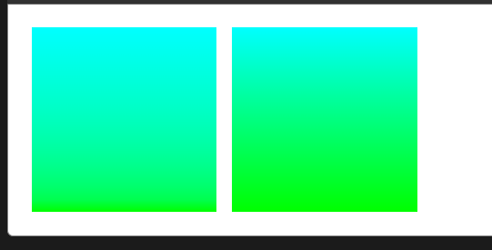

# 🎨 CSS 变形与渐变

<Badge type="info" text="CSS3" />
<Badge type="tip" text="视觉效果" />

CSS 提供的形变功能不仅可以平移元素，还能做很多其他的事情，比如旋转、缩放、翻转等，让页面的动画与交互看起来更加自然。

## 🏗️ 核心概念

### 📋 关键术语

::: info 🎯 元素分类
- **变形元素**: 进行 transform3D 变形的元素，主要设置 `transform`、`transform-origin`、`backface-visibility`
- **被透视元素**: 被观察者观察的元素，一般是变形元素的父级元素，主要设置 `perspective`、`perspective-origin`
:::

### 🔧 核心属性

| 属性名 | 作用 | 说明 |
|--------|------|------|
| `transform` | 变形配置 | 定义元素的变形效果 |
| `transform-origin` | 变形原点 | 默认中心点，可改变XYZ轴的中心点 |
| `transform-style` | 变形风格 | `flat`(2D) 或 `preserve-3d`(3D) |
| `perspective` | 透视距离 | 观察者到屏幕的距离，设置在父元素上 |
| `perspective-origin` | 透视原点 | 观察者的位置，默认 `50% 50%` |
| `backface-visibility` | 背面可见性 | `visible` 或 `hidden` |

::: warning ⚠️ 注意事项
当设置了 `overflow` 非 `visible` 或 `clip` 非 `auto` 时，`transform-style: preserve-3d` 会失效。
:::

---

## 🎲 2D 变形

### 📍 translate 平移

```css
/* 基本语法 */
transform: translate(x, y);

/* 单轴平移 */
transform: translateX(100px);
transform: translateY(50px);

/* 示例 */
.move-element {
  transform: translate(50px, 100px);
  transition: transform 0.3s ease;
}
```

::: tip 💡 实用技巧
`translate` 不会影响其他元素的布局，常用于实现居中效果：
```css
.center {
  position: absolute;
  top: 50%;
  left: 50%;
  transform: translate(-50%, -50%);
}
```
:::

### 📏 scale 缩放

```css
/* 等比缩放 */
transform: scale(1.5);

/* 不等比缩放 */
transform: scale(1.5, 0.8);

/* 单轴缩放 */
transform: scaleX(1.2);
transform: scaleY(0.8);

/* 负值缩放（翻转+缩放） */
transform: scale(-1, 1); /* 水平翻转 */
```

### 🔄 rotate 旋转

```css
/* 2D旋转 */
transform: rotate(45deg);

/* 等同于 rotateZ */
transform: rotateZ(45deg);

/* 旋转示例 */
.rotate-box {
  transform: rotate(45deg);
  transform-origin: top left; /* 改变旋转中心 */
}
```

### 📐 skew 倾斜

```css
/* 双轴倾斜 */
transform: skew(15deg, 10deg);

/* 单轴倾斜 */
transform: skewX(15deg);
transform: skewY(10deg);

/* 卡片倾斜效果 */
.skew-card {
  transform: skew(-5deg, 0);
  transition: transform 0.3s ease;
}

.skew-card:hover {
  transform: skew(0, 0);
}
```

### 🧮 matrix 变换矩阵

```css
/* 矩阵变换 */
transform: matrix(a, b, c, d, tx, ty);

/* 等价于多个变换的组合 */
transform: matrix(1, 0.5, -0.5, 1, 100, 50);
```

---

## 🌐 3D 变形

在2D平面基础上多出一个Z轴，构成三维立体空间。

### 🔄 3D 旋转

```css
/* 3D旋转 */
.cube {
  transform-style: preserve-3d;
  perspective: 1000px;
}

.face {
  transform: rotateX(90deg);
  transform: rotateY(45deg);
  transform: rotateZ(30deg);
}

/* 沿任意轴旋转 */
.custom-rotate {
  transform: rotate3d(1, 1, 0, 45deg);
}
```

### 📦 3D 平移和缩放

```css
/* 3D平移 */
transform: translate3d(50px, 100px, 75px);
transform: translateZ(100px); /* 仅Z轴 */

/* 3D缩放 */
transform: scale3d(1.5, 1.2, 2);
transform: scaleZ(1.5); /* 仅当元素有深度时有效 */
```

### 👁️ 透视效果

```css
/* 透视函数（应用于元素本身） */
.perspective-self {
  transform: perspective(500px) rotateY(45deg);
}

/* 透视属性（应用于父元素） */
.perspective-parent {
  perspective: 1000px;
  perspective-origin: 50% 50%;
}
```

::: details 💡 3D 立方体示例

```css
.cube-container {
  perspective: 1000px;
  width: 200px;
  height: 200px;
  margin: 100px auto;
}

.cube {
  position: relative;
  width: 200px;
  height: 200px;
  transform-style: preserve-3d;
  transform: rotateX(-30deg) rotateY(30deg);
  animation: rotate 10s infinite linear;
}

.cube-face {
  position: absolute;
  width: 200px;
  height: 200px;
  border: 2px solid #333;
  background: rgba(255, 255, 255, 0.8);
}

.front  { transform: translateZ(100px); }
.back   { transform: rotateY(180deg) translateZ(100px); }
.right  { transform: rotateY(90deg) translateZ(100px); }
.left   { transform: rotateY(-90deg) translateZ(100px); }
.top    { transform: rotateX(90deg) translateZ(100px); }
.bottom { transform: rotateX(-90deg) translateZ(100px); }

@keyframes rotate {
  to { transform: rotateX(-30deg) rotateY(390deg); }
}
```

:::

---

## 🌈 线性渐变

### 📐 基本语法

```css
background: linear-gradient(direction, color1 position1, color2 position2, ...);
```

### 🧭 渐变方向

**关键字方式**:
```css
/* 默认从上到下 */
background: linear-gradient(to bottom, red, blue);

/* 其他方向 */
background: linear-gradient(to top, #ff6b6b, #4ecdc4);
background: linear-gradient(to right, #667eea, #764ba2);
background: linear-gradient(to bottom right, #ff9a9e, #fecfef);
```

**角度方式**:
```css
/* 角度渐变 */
background: linear-gradient(45deg, red, blue);
background: linear-gradient(90deg, #ff6b6b, #4ecdc4);

/* 角度单位 */
background: linear-gradient(0.25turn, yellow, black, blue);
background: linear-gradient(180deg, #667eea, #764ba2);
```

### 🎨 颜色和位置

```css
/* 基础渐变 */
background: linear-gradient(to right, red, yellow, green);

/* 指定位置 */
background: linear-gradient(to right, 
  red 0%, 
  yellow 50%, 
  green 100%
);

/* 创建条纹效果 */
background: linear-gradient(90deg, 
  red 25%, 
  transparent 25%, 
  transparent 75%, 
  red 75%
);
```

::: tip 🎯 实用案例

**渐变按钮**:
```css
.gradient-btn {
  background: linear-gradient(45deg, #667eea, #764ba2);
  border: none;
  padding: 12px 24px;
  border-radius: 6px;
  color: white;
  transition: all 0.3s ease;
}

.gradient-btn:hover {
  background: linear-gradient(45deg, #764ba2, #667eea);
  transform: translateY(-2px);
  box-shadow: 0 10px 20px rgba(0,0,0,0.2);
}
```

:::

### 🔄 重复线性渐变

```css
/* 基本重复渐变 */
background: repeating-linear-gradient(
  45deg,
  transparent,
  transparent 10px,
  #4ecdc4 10px,
  #4ecdc4 20px
);

/* 斜纹效果 */
background: repeating-linear-gradient(
  -45deg,
  #ff6b6b,
  #ff6b6b 10px,
  #feca57 10px,
  #feca57 20px
);

/* 进度条样式 */
.progress-stripes {
  background: repeating-linear-gradient(
    45deg,
    #007bff,
    #007bff 10px,
    #0056b3 10px,
    #0056b3 20px
  );
}
```

---

## ⭕ 径向渐变

### 🎯 基本语法

```css
background: radial-gradient([shape size at position], color1, color2, ...);
```

### 🔵 形状和尺寸

```css
/* 圆形渐变 */
background: radial-gradient(circle, red, blue);

/* 椭圆渐变 */
background: radial-gradient(ellipse, #ff6b6b, #4ecdc4);

/* 指定尺寸 */
background: radial-gradient(circle 100px, red, transparent);
background: radial-gradient(ellipse 100px 50px, yellow, green);
```

### 📍 尺寸关键字

| 关键字 | 描述 |
|--------|------|
| `closest-side` | 半径从圆心到最近边 |
| `farthest-side` | 半径从圆心到最远边（默认） |
| `closest-corner` | 半径从圆心到最近角 |
| `farthest-corner` | 半径从圆心到最远角 |

```css
/* 尺寸关键字示例 */
background: radial-gradient(circle closest-side, red, blue);
background: radial-gradient(ellipse farthest-corner, yellow, green);
```

### 🎪 位置控制

```css
/* 位置关键字 */
background: radial-gradient(circle at top left, red, blue);
background: radial-gradient(ellipse at center, yellow, green);

/* 精确位置 */
background: radial-gradient(circle at 30% 70%, #ff6b6b, #4ecdc4);
background: radial-gradient(ellipse at 100px 50px, red, transparent);
```

::: details 🌟 径向渐变案例

**聚光灯效果**:
```css
.spotlight {
  background: radial-gradient(
    circle at 50% 30%,
    rgba(255, 255, 255, 0.8) 0%,
    rgba(255, 255, 255, 0.4) 30%,
    rgba(0, 0, 0, 0.8) 70%
  );
}
```

**按钮光晕效果**:
```css
.glow-button {
  background: radial-gradient(
    ellipse at center,
    #667eea 0%,
    #764ba2 100%
  );
  box-shadow: 0 0 20px rgba(102, 126, 234, 0.6);
}
```

:::

### 🔄 重复径向渐变

```css
/* 同心圆效果 */
background: repeating-radial-gradient(
  circle,
  red 0%,
  red 10%,
  transparent 10%,
  transparent 20%
);

/* 雷达扫描效果 */
.radar {
  background: repeating-radial-gradient(
    circle at center,
    transparent 0,
    transparent 20px,
    rgba(0, 255, 0, 0.3) 20px,
    rgba(0, 255, 0, 0.3) 22px
  );
}
```

---

## 🌪️ 锥形渐变

<Badge type="tip" text="CSS4" />

锥形渐变创建围绕中心点旋转的颜色渐变，类似饼图效果。

### 🎡 基本语法

```css
background: conic-gradient([from angle] [at position], color1, color2, ...);
```

### 🎨 基础应用

```css
/* 基本锥形渐变 */
background: conic-gradient(red, yellow, green, blue, red);

/* 指定起始角度 */
background: conic-gradient(from 45deg, red, blue);

/* 指定中心位置 */
background: conic-gradient(at 30% 70%, red, yellow, green);

/* 组合使用 */
background: conic-gradient(
  from 90deg at 50% 50%,
  #ff6b6b 0deg,
  #4ecdc4 120deg,
  #45b7d1 240deg,
  #ff6b6b 360deg
);
```

::: details 🍕 实用案例

**饼图效果**:
```css
.pie-chart {
  width: 200px;
  height: 200px;
  border-radius: 50%;
  background: conic-gradient(
    #ff6b6b 0deg 72deg,     /* 20% */
    #4ecdc4 72deg 144deg,   /* 20% */
    #45b7d1 144deg 216deg,  /* 20% */
    #feca57 216deg 288deg,  /* 20% */
    #ff9ff3 288deg 360deg   /* 20% */
  );
}
```

**色轮效果**:
```css
.color-wheel {
  width: 200px;
  height: 200px;
  border-radius: 50%;
  background: conic-gradient(
    hsl(0, 100%, 50%),
    hsl(60, 100%, 50%),
    hsl(120, 100%, 50%),
    hsl(180, 100%, 50%),
    hsl(240, 100%, 50%),
    hsl(300, 100%, 50%),
    hsl(360, 100%, 50%)
  );
}
```

:::

---

## 🎛️ 控制渐变过程

### 🎯 颜色提示

通过颜色提示可以控制两个色标之间的插值过程：

```css
/* 默认均匀过渡 */
background: linear-gradient(to right, lime, cyan);

/* 使用颜色提示控制过渡 */
background: linear-gradient(to right, lime 20%, cyan);
```

**对比效果**:



### 🔄 多重渐变

```css
/* 渐变叠加 */
background: 
  linear-gradient(45deg, transparent 30%, rgba(255,255,255,0.5) 30%),
  linear-gradient(to right, #ff6b6b, #4ecdc4);

/* 复杂图案 */
.complex-pattern {
  background:
    radial-gradient(circle at 25% 25%, transparent 20%, rgba(255,255,255,0.3) 21%),
    linear-gradient(45deg, #667eea, #764ba2);
}
```

---

## 🛠️ 实战技巧

### ⚡ 性能优化

::: warning 🚀 性能建议
1. **使用 `transform` 而非改变 `position`** - GPU加速
2. **避免频繁改变复杂渐变** - 考虑使用图片
3. **使用 `will-change` 提示浏览器优化**:
   ```css
   .animated-element {
     will-change: transform;
   }
   ```
:::

### 🔧 兼容性处理

```css
/* 渐变兼容性写法 */
.gradient-bg {
  background: #667eea; /* 降级方案 */
  background: -webkit-linear-gradient(45deg, #667eea, #764ba2);
  background: linear-gradient(45deg, #667eea, #764ba2);
}

/* 功能检测 */
@supports (background: conic-gradient(red, blue)) {
  .modern-gradient {
    background: conic-gradient(from 45deg, red, blue);
  }
}
```

### 🎨 设计模式

```css
/* 卡片悬浮效果 */
.hover-card {
  transition: all 0.3s cubic-bezier(0.25, 0.8, 0.25, 1);
  box-shadow: 0 2px 4px rgba(0,0,0,0.1);
}

.hover-card:hover {
  transform: translateY(-8px) scale(1.02);
  box-shadow: 0 8px 25px rgba(0,0,0,0.15);
}

/* 加载动画 */
@keyframes rotate {
  from { transform: rotate(0deg); }
  to { transform: rotate(360deg); }
}

.loading-spinner {
  width: 40px;
  height: 40px;
  border: 4px solid #f3f3f3;
  border-top: 4px solid #3498db;
  border-radius: 50%;
  animation: rotate 1s linear infinite;
}
```

---

## 📚 参考资源

- [MDN - 使用CSS渐变](https://developer.mozilla.org/zh-CN/docs/Web/CSS/CSS_images/Using_CSS_gradients)
- [CSS Transform属性详解](https://developer.mozilla.org/zh-CN/docs/Web/CSS/transform)
- [CSS3 3D变换详解](https://3dtransforms.desandro.com/)

::: tip 💡 学习建议
1. **循序渐进**: 先掌握2D变形，再学习3D效果
2. **实践为主**: 通过制作实际案例来理解概念
3. **性能意识**: 关注动画性能，合理使用GPU加速
4. **创意发挥**: 组合不同效果创造独特的视觉体验
:::
