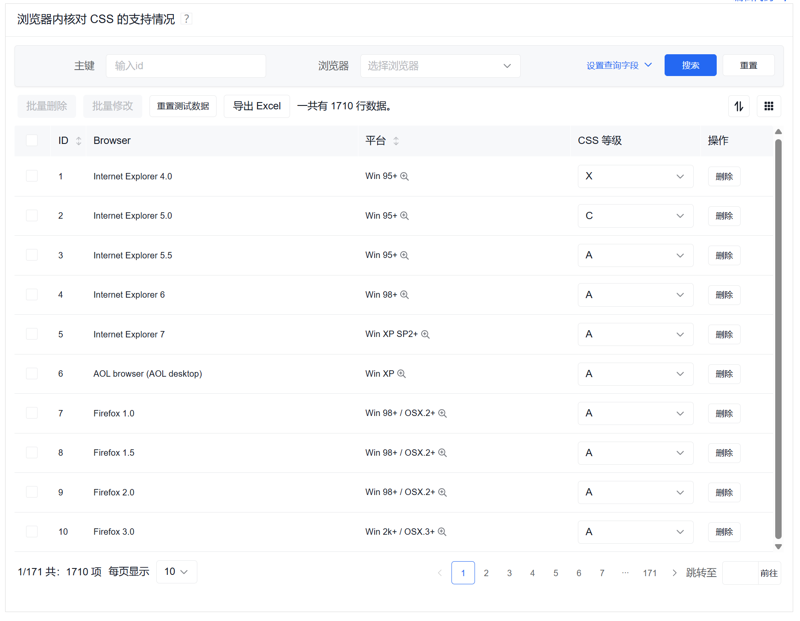

# 低代码开发平台

## 1. 概述

低代码是一种软件开发方法，它通过可视化建模、预构建组件和模板等方式，最大限度地减少手工编程，快速交付应用程序。低代码平台为开发者提供了图形化界面，让他们可以拖拽组件来创建应用，而不是编写大量代码。

### 1.1 低代码的优势

- **提高开发效率**: 通过可视化配置大幅减少编码时间
- **降低技术门槛**: 不需要深入的前端技术知识
- **快速原型**: 能够快速搭建原型进行需求验证
- **标准化**: 确保UI和交互的一致性
- **维护性**: 配置化的页面更容易维护和更新

### 1.2 适用场景

- **中后台管理系统**: 数据展示、表单处理、列表管理
- **数据可视化**: 图表展示、报表生成
- **内容管理**: CMS系统、配置管理
- **工作流**: 审批流程、业务流程管理

## 2. 百度 amis 框架

### 2.1 功能介绍

amis 是一个低代码前端框架，它使用 JSON 配置来生成页面，可以减少页面开发工作量，极大提升效率。

#### 参考资料
- 官方文档：https://aisuda.bce.baidu.com/amis/zh-CN/docs/concepts/linkage

### 2.2 基本特点

- **技术栈无关**: 不需要懂前端技术
- **配置驱动**: 基于 JSON 配置生成页面
- **组件丰富**: 内置大量业务组件
- **可视化编辑**: 支持可视化页面编辑器
- **完整方案**: 包含数据获取、表单提交及验证等功能

### 2.3 核心优势

#### 完整的界面解决方案
其它 UI 框架必须使用 JavaScript 来组装业务逻辑，而 amis 只需 JSON 配置就能完成完整功能开发，包括数据获取、表单提交及验证等功能，做出来的页面不需要经过二次开发就能直接上线。

#### 大量的内置组件
amis 内置了大量组件，包括：
- **基础组件**: 表单、表格、按钮、输入框等
- **业务组件**: 富文本编辑器、代码编辑器、条件组合等
- **高级组件**: 实时日志、diff 对比、数据可视化等

#### 支持扩展
除了低代码模式，还可以通过自定义组件来扩充功能，实现 90% 低代码，10% 代码开发的混合模式。

#### 容器支持无限嵌套
可以通过嵌套来满足各种布局及展现需求，提供强大的页面组织能力。

#### 经历长时间的实战考验
amis 在百度内部得到了广泛使用，在 6 年多的时间里创建了 5 万页面，从内容审核到机器管理，从数据分析到模型训练，满足了各种各样的页面需求。

### 2.4 使用限制

- **适合场景**: 主要适用于有大量常见 UI 组件的页面
- **不适合场景**: 面向普通客户（toC）的个性化页面
- **技术限制**: 无法处理需要依赖原生 DOM 的复杂前端功能

## 3. amis 基础语法

### 3.1 页面结构

一个基本的 amis 页面由以下部分组成：

```javascript
{
  "title": "页面标题",
  "remark": "页面说明",
  "type": "page",        // 组件类型：页面渲染器
  "body": {
    // 页面内容
  }
}
```

### 3.2 组件类型系统

amis 中的每个元素都有一个 `type` 字段，用于指定使用哪个渲染器：

- **page**: 页面渲染器
- **crud**: 增删改查渲染器  
- **form**: 表单渲染器
- **button**: 按钮渲染器
- **input-text**: 文本输入框
- **select**: 下拉选择器

### 3.3 数据绑定

amis 支持多种数据绑定方式：

```javascript
{
  "data": {                    // 静态数据
    "name": "张进喜",
    "age": 25
  },
  "api": "/api/user/profile",  // API 数据源
  "name": "${name}",           // 变量引用
  "description": "用户年龄: ${age}" // 模板语法
}
```

## 4. CRUD 增删改查组件

### 4.1 功能介绍

CRUD 组件是 amis 中最核心的组件之一，用于实现数据的增删改查功能。它集成了数据获取、表格展示、搜索过滤、批量操作等功能。

### 4.2 基本配置

```javascript
{
  "type": "crud",
  "api": "/api/data",                    // 数据源API
  "syncLocation": false,                 // 是否同步地址栏参数
  "draggable": true,                     // 是否可拖动排序
  "keepItemSelectionOnPageChange": true, // 分页时保留选择
  "autoGenerateFilter": true,            // 自动生成查询条件
  "columns": [
    // 列配置
  ]
}
```

### 4.3 完整示例

以下是一个完整的 CRUD 组件示例：



```javascript
{
  "title": "浏览器内核对 CSS 的支持情况",
  "remark": "嘿，不保证数据准确性",
  "type": "page",
  "body": {
    "type": "crud",
    "draggable": true,
    "syncLocation": false,
    "api": "/amis/api/mock2/sample",
    "keepItemSelectionOnPageChange": true,
    "autoGenerateFilter": true,
    
    // 批量操作配置
    "bulkActions": [
      {
        "type": "button",
        "label": "批量删除",
        "data": {
          "a": "1",
          "b": "2",
          "c": {
            "e": "3",
            "f": "4",
            "g": "5"
          }
        },
        "actionType": "ajax",
        "api": "delete:/amis/api/mock2/sample/${ids|raw}",
        "confirmText": "确定要批量删除?"
      },
      {
        "type": "button",
        "label": "批量修改",
        "actionType": "dialog",
        "dialog": {
          "title": "批量编辑",
          "name": "sample-bulk-edit",
          "body": {
            "type": "form",
            "api": "/amis/api/mock2/sample/bulkUpdate2",
            "body": [
              {
                "type": "hidden",
                "name": "ids"
              },
              {
                "type": "input-text",
                "name": "engine",
                "label": "Engine"
              }
            ]
          }
        }
      }
    ],
    
    // 快速编辑API
    "quickSaveApi": "/amis/api/mock2/sample/bulkUpdate",
    "quickSaveItemApi": "/amis/api/mock2/sample/$id",
    
    // 顶部工具栏
    "headerToolbar": [
      "bulkActions",
      {
        "type": "button",
        "label": "重置测试数据",
        "actionType": "ajax",
        "size": "sm",
        "api": "/amis/api/mock2/sample/reset"
      },
      "export-excel",
      {
        "type": "tpl",
        "tpl": "一共有 ${count} 行数据。",
        "className": "v-middle"
      },
      {
        "type": "columns-toggler",
        "align": "right",
        "draggable": true
      },
      {
        "type": "drag-toggler",
        "align": "right"
      }
    ],
    
    // 底部工具栏
    "footerToolbar": [
      "statistics",
      "switch-per-page",
      "pagination"
    ],
    
    // 列配置
    "columns": [
      {
        "name": "id",
        "label": "ID",
        "width": 20,
        "sortable": true,
        "type": "text",
        "searchable": {
          "type": "input-text",
          "name": "id",
          "label": "主键",
          "placeholder": "输入id"
        }
      },
      {
        "name": "browser",
        "label": "Browser",
        "searchable": {
          "type": "select",
          "name": "browser",
          "label": "浏览器",
          "placeholder": "选择浏览器",
          "options": [
            {
              "label": "Internet Explorer",
              "value": "ie"
            },
            {
              "label": "AOL browser",
              "value": "aol"
            },
            {
              "label": "Firefox",
              "value": "firefox"
            }
          ]
        }
      },
      {
        "name": "platform",
        "label": "平台",
        "popOver": {
          "trigger": "hover",
          "body": {
            "type": "tpl",
            "tpl": "就是为了演示有个叫 popOver 的功能"
          }
        },
        "sortable": true,
        "type": "text"
      },
      {
        "name": "grade",
        "label": "CSS 等级",
        "type": "select",
        "options": [
          "A", "B", "C", "D", "X"
        ]
      },
      {
        "type": "operation",
        "label": "操作",
        "width": 100,
        "buttons": [
          {
            "type": "button",
            "actionType": "ajax",
            "label": "删除",
            "confirmText": "您确认要删除?",
            "api": "delete:/amis/api/mock2/sample/$id"
          }
        ]
      }
    ]
  }
}
```

### 4.4 API 配置详解

#### 基础 API 配置

```javascript
// 字符串形式
"api": "/api/data"

// 对象形式
"api": {
  "url": "/api/form/save",
  "method": "post",
  "data": {
    "name": "${name}",
    "email": "${email}",
    "&": "${formData}",  // 展开对象
    "description": "可以获取其他字段的变量"
  }
}
```

#### HTTP 方法指定

```javascript
// RESTful API 风格
"api": "get:/api/data"        // GET 请求
"api": "post:/api/data"       // POST 请求  
"api": "put:/api/data"        // PUT 请求
"api": "delete:/api/data/${id}" // DELETE 请求
```

## 5. 表单组件

### 5.1 基础表单

```javascript
{
  "type": "form",
  "api": "/api/form/submit",
  "body": [
    {
      "type": "input-text",
      "name": "name",
      "label": "姓名",
      "required": true,
      "placeholder": "请输入姓名"
    },
    {
      "type": "input-email",
      "name": "email", 
      "label": "邮箱",
      "required": true
    },
    {
      "type": "select",
      "name": "city",
      "label": "城市",
      "options": [
        {"label": "北京", "value": "beijing"},
        {"label": "上海", "value": "shanghai"}
      ]
    }
  ]
}
```

### 5.2 表单验证

```javascript
{
  "type": "input-text",
  "name": "phone",
  "label": "手机号",
  "required": true,
  "validations": {
    "matchRegexp": "/^1[3-9]\\d{9}$/"
  },
  "validationErrors": {
    "matchRegexp": "请输入正确的手机号格式"
  }
}
```

## 6. 事件与动作

### 6.1 动作类型

- **ajax**: 发送 AJAX 请求
- **dialog**: 打开弹窗
- **drawer**: 打开抽屉
- **redirect**: 页面跳转
- **reload**: 刷新页面/组件

### 6.2 事件绑定示例

```javascript
{
  "type": "button",
  "label": "提交",
  "actionType": "ajax",
  "api": {
    "url": "/api/submit",
    "method": "post"
  },
  "onEvent": {
    "click": {
      "actions": [
        {
          "actionType": "toast",
          "args": {
            "msg": "提交成功"
          }
        }
      ]
    }
  }
}
```

## 7. 数据联动

### 7.1 表单联动

```javascript
{
  "type": "form",
  "body": [
    {
      "type": "select",
      "name": "province",
      "label": "省份",
      "options": [
        {"label": "北京", "value": "beijing"},
        {"label": "广东", "value": "guangdong"}
      ]
    },
    {
      "type": "select", 
      "name": "city",
      "label": "城市",
      "source": "/api/cities?province=${province}",
      "visibleOn": "data.province"
    }
  ]
}
```

### 7.2 条件显示

```javascript
{
  "type": "input-text",
  "name": "other",
  "label": "其他",
  "visibleOn": "data.type === 'other'",
  "requiredOn": "data.type === 'other'"
}
```

## 8. 自定义组件

### 8.1 自定义渲染器

当内置组件无法满足需求时，可以开发自定义渲染器：

```javascript
import {Renderer} from 'amis';

@Renderer({
  type: 'my-custom-component'
})
class MyCustomComponent extends React.Component {
  render() {
    const {value, onChange} = this.props;
    
    return (
      <div>
        <h3>自定义组件</h3>
        <input 
          value={value || ''} 
          onChange={e => onChange(e.target.value)}
        />
      </div>
    );
  }
}
```

### 8.2 使用自定义组件

```javascript
{
  "type": "my-custom-component",
  "name": "customField",
  "label": "自定义字段"
}
```

## 9. 主题定制

### 9.1 CSS 变量定制

```css
:root {
  --primary-color: #007bff;
  --success-color: #28a745;
  --warning-color: #ffc107;
  --danger-color: #dc3545;
}
```

### 9.2 SCSS 变量定制

```scss
$primary: #007bff;
$success: #28a745;
$warning: #ffc107;
$danger: #dc3545;

// 导入 amis 样式
@import '~amis/lib/themes/default.scss';
```

## 10. 最佳实践

### 10.1 配置组织

- **模块化**: 将复杂配置拆分成多个模块
- **复用性**: 提取公共配置作为模板
- **可维护性**: 使用有意义的字段名和注释

### 10.2 性能优化

- **按需加载**: 使用懒加载减少初始包大小
- **缓存策略**: 合理设置API缓存
- **分页处理**: 大数据量使用分页加载

### 10.3 开发建议

- **渐进式**: 从简单页面开始，逐步增加复杂度
- **测试驱动**: 充分测试配置的正确性
- **文档化**: 为复杂配置编写文档说明

## 11. 常见问题

### 11.1 数据格式问题

**问题**: API 返回的数据格式不符合 amis 要求

**解决方案**: 
- 后端调整数据格式
- 使用 `responseData` 进行数据转换
- 通过适配器处理数据

### 11.2 样式冲突

**问题**: amis 样式与项目现有样式冲突

**解决方案**:
- 使用命名空间隔离样式
- 自定义主题变量
- 通过 CSS 优先级解决

### 11.3 组件功能限制

**问题**: 内置组件无法满足特殊需求

**解决方案**:
- 开发自定义渲染器
- 使用混合开发模式
- 通过配置组合实现复杂功能

## 12. 参考资料

- [amis 官方文档](https://aisuda.bce.baidu.com/amis/zh-CN/docs/index)
- [amis GitHub 仓库](https://github.com/baidu/amis)
- [amis 可视化编辑器](https://aisuda.bce.baidu.com/amis/zh-CN/docs/start/visual-editor)
- [amis 示例中心](https://aisuda.bce.baidu.com/amis/zh-CN/examples/index)
- [amis 论坛](https://github.com/baidu/amis/discussions)

## 13. 总结

amis 作为一个成熟的低代码前端框架，为开发者提供了强大的页面构建能力：

### 核心优势
- **配置驱动**: 通过 JSON 配置快速构建页面
- **组件丰富**: 内置大量业务组件，覆盖常见场景
- **开箱即用**: 无需复杂配置即可开始开发
- **扩展性强**: 支持自定义组件和混合开发

### 适用场景
- **中后台系统**: 管理界面、数据展示
- **表单应用**: 复杂表单、工作流
- **数据可视化**: 报表、图表展示
- **快速原型**: 需求验证、演示页面

### 发展前景
随着低代码概念的普及，amis 在企业内部系统开发中将发挥越来越重要的作用，帮助开发团队提高效率，降低开发成本。
