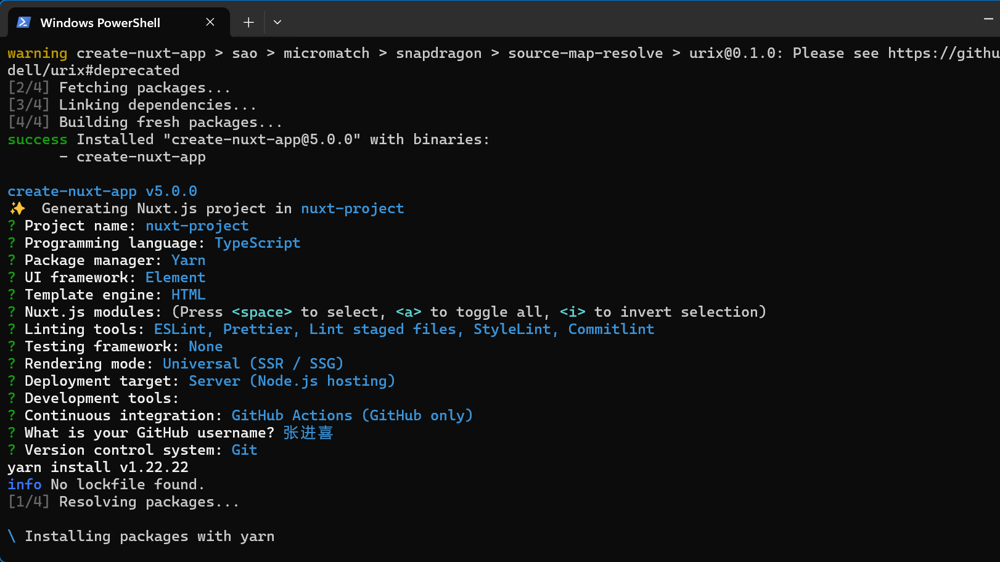

# Nuxt.js 全栈框架

## 1. 概述

Nuxt.js 是一个基于 Vue.js 的通用应用框架，专注于提供现代化的全栈开发体验。它预设了利用 Vue.js 开发服务端渲染(SSR)、静态站点生成(SSG)和单页应用(SPA)所需要的各种配置。

### 1.1 核心特性

- **基于 Vue.js**: 使用 Vue 3 生态系统
- **自动代码分层**: 智能代码分割优化
- **服务端渲染**: 开箱即用的 SSR 支持
- **强大的路由功能**: 支持异步数据加载
- **静态文件服务**: 内置静态资源处理
- **ES2015+ 语法支持**: 现代 JavaScript 特性
- **打包和压缩**: 自动 JS 和 CSS 优化
- **HTML 头部标签管理**: SEO 友好的 meta 标签
- **本地开发支持热加载**: 开发时实时更新
- **集成 ESLint**: 代码质量保证
- **样式预处理器支持**: SASS、LESS、Stylus 等
- **HTTP/2 推送**: 性能优化

### 1.2 主要优势

#### 自动化和预置
Nuxt 使用约定的和预置的目录结构来自动执行重复性任务，允许开发人员专注于功能开发。

#### 开发效率
- **基于文件的路由**: 根据 `pages/` 目录结构自动定义路由
- **代码拆分**: 自动将代码拆分为更小的块
- **开箱即用的 SSR**: 无需单独设置服务器
- **自动导入**: 组件和可组合项自动导入
- **数据获取实用程序**: 兼容 SSR 的数据获取方案
- **零配置 TypeScript**: 完整的类型安全支持

#### 性能优化
- **默认使用 Vite**: 快速的开发服务器
- **Tree-shaking**: 自动移除未使用的代码
- **预渲染**: 静态生成提高首屏加载速度
- **智能预加载**: 自动预加载关键资源

## 2. 安装与设置

### 2.1 创建新项目

```bash
# 使用 nuxi 创建项目
npx nuxi@latest init my-nuxt-app
cd my-nuxt-app

# 安装依赖
npm install

# 启动开发服务器
npm run dev
```

### 2.2 初始化项目结构

创建项目后，Nuxt 会生成以下初始结构：



```
my-nuxt-app/
├── .nuxt/              # 开发目录
├── .output/            # 构建输出目录
├── pages/              # 页面目录
├── components/         # 组件目录
├── assets/             # 资源目录
├── public/             # 静态资源目录
├── server/             # 服务端目录
├── nuxt.config.ts      # Nuxt 配置文件
├── package.json        # 项目依赖
└── README.md          # 项目说明
```

### 2.3 开发环境配置

```typescript
// nuxt.config.ts
export default defineNuxtConfig({
  devtools: { enabled: true },
  css: ['~/assets/css/main.css'],
  modules: [
    '@nuxtjs/tailwindcss',
    '@pinia/nuxt',
    '@nuxt/content'
  ]
})
```

## 3. 目录结构详解

### 3.1 核心目录

#### .nuxt 目录
开发目录，生成的 Vue 应用程序目录。包含：
- 自动生成的路由配置
- 组件注册信息
- 类型定义文件
- 中间件和插件配置

#### .output 目录
构建输出目录，生产应用程序构建后创建：
- 静态资源文件
- 服务端渲染文件
- 预渲染的 HTML 页面
- 部署所需的配置文件

#### assets 目录
资源目录，存放需要编译处理的资源：
- 样式文件 (CSS, SASS, LESS)
- 图片文件
- 字体文件
- JavaScript 文件

```
assets/
├── css/
│   ├── main.css
│   └── variables.scss
├── images/
│   ├── logo.png
│   └── banner.jpg
└── fonts/
    └── custom.woff2
```

#### public 目录
静态资源目录，文件会直接复制到服务器根目录：
- 网站图标 (favicon.ico)
- 静态图片
- 静态文档
- 静态 JSON 文件

### 3.2 应用目录

#### components 目录
组件目录，Vue 组件自动导入：

```
components/
├── Base/
│   ├── Button.vue
│   └── Input.vue
├── Layout/
│   ├── Header.vue
│   └── Footer.vue
└── Content/
    ├── Card.vue
    └── List.vue
```

组件使用示例：

```vue
<template>
  <div>
    <!-- 自动导入，无需手动引入 -->
    <BaseButton>点击我</BaseButton>
    <LayoutHeader />
    <ContentCard title="文章标题" />
  </div>
</template>
```

#### composables 目录
自动导入 Vue 可组合项：

```typescript
// composables/useAuth.ts
export const useAuth = () => {
  const user = ref(null)
  
  const login = async (credentials) => {
    // 登录逻辑
    user.value = await $fetch('/api/login', {
      method: 'POST',
      body: credentials
    })
  }
  
  const logout = () => {
    user.value = null
  }
  
  return {
    user: readonly(user),
    login,
    logout
  }
}
```

#### content 目录
内容模块目录，用于基于文件的 CMS：

```
content/
├── blog/
│   ├── 2023/
│   │   ├── article-1.md
│   │   └── article-2.md
│   └── index.md
├── docs/
│   ├── guide/
│   │   ├── getting-started.md
│   │   └── advanced.md
│   └── api.yml
└── _dir.yml
```

### 3.3 路由与布局

#### pages 目录
页面目录，基于文件的路由系统：

```
pages/
├── index.vue           # / 路由
├── about.vue          # /about 路由
├── blog/
│   ├── index.vue      # /blog 路由
│   ├── [slug].vue     # /blog/[slug] 动态路由
│   └── [...tags].vue  # /blog/[...tags] 捕获所有路由
├── user/
│   ├── index.vue      # /user 路由
│   ├── [id].vue       # /user/[id] 动态路由
│   └── settings.vue   # /user/settings 路由
└── admin/
    ├── index.vue
    └── users.vue
```

#### layouts 目录
布局目录，通用 UI 或代码模式：

```vue
<!-- layouts/default.vue -->
<template>
  <div class="layout">
    <Header />
    <main>
      <slot />
    </main>
    <Footer />
  </div>
</template>

<script setup>
// 布局逻辑
</script>

<style scoped>
.layout {
  min-height: 100vh;
  display: flex;
  flex-direction: column;
}
</style>
```

布局使用方式：

```vue
<!-- pages/index.vue -->
<template>
  <div>
    <h1>首页内容</h1>
  </div>
</template>

<script setup>
// 指定布局
definePageMeta({
  layout: 'default'
})
</script>
```

#### middleware 目录
中间件目录，路由变化前运行的代码：

```typescript
// middleware/auth.ts
export default defineNuxtRouteMiddleware((to, from) => {
  const { user } = useAuth()
  
  if (!user.value) {
    return navigateTo('/login')
  }
})
```

```typescript
// middleware/auth.global.ts (全局中间件)
export default defineNuxtRouteMiddleware((to, from) => {
  // 每次路由变化都会执行
  console.log('路由变化:', to.path)
})
```

### 3.4 服务端与数据

#### server 目录
服务器端目录，API 路由和服务器功能：

```
server/
├── api/
│   ├── auth/
│   │   ├── login.post.ts
│   │   └── logout.post.ts
│   ├── users/
│   │   ├── index.get.ts
│   │   └── [id].get.ts
│   └── hello.get.ts
├── middleware/
│   └── log.ts
└── utils/
    └── db.ts
```

API 路由示例：

```typescript
// server/api/users/index.get.ts
export default defineEventHandler(async (event) => {
  const query = getQuery(event)
  const users = await getUsersFromDB(query)
  
  return {
    users,
    total: users.length
  }
})
```

```typescript
// server/api/users/[id].get.ts
export default defineEventHandler(async (event) => {
  const id = getRouterParam(event, 'id')
  const user = await getUserById(id)
  
  if (!user) {
    throw createError({
      statusCode: 404,
      statusMessage: 'User not found'
    })
  }
  
  return user
})
```

#### plugins 目录
插件目录，Vue 应用程序创建时加载：

```typescript
// plugins/pinia.client.ts
import { createPinia } from 'pinia'

export default defineNuxtPlugin((nuxtApp) => {
  const pinia = createPinia()
  nuxtApp.vueApp.use(pinia)
})
```

#### utils 目录
工具目录，自动导入辅助函数：

```typescript
// utils/format.ts
export const formatDate = (date: Date) => {
  return date.toLocaleDateString('zh-CN')
}

export const formatCurrency = (amount: number) => {
  return new Intl.NumberFormat('zh-CN', {
    style: 'currency',
    currency: 'CNY'
  }).format(amount)
}
```

## 4. 配置文件详解

### 4.1 nuxt.config.ts 基础配置

```typescript
export default defineNuxtConfig({
  // 关闭服务端渲染
  ssr: false,
  
  // 扩展配置
  extends: [
    '../base',                    // 从本地层扩展
    '@my-themes/awesome',         // 从 npm 包扩展
    'github:my-themes/awesome#v1' // 从 git 仓库扩展
  ],
  
  // 全局应用配置
  app: {
    head: {
      charset: 'utf-8',
      viewport: 'width=device-width, initial-scale=1',
      title: 'My Nuxt App',
      meta: [
        { name: 'description', content: 'My amazing Nuxt application' }
      ],
      link: [
        { rel: 'icon', type: 'image/x-icon', href: '/favicon.ico' }
      ]
    },
    // 页面过渡效果
    pageTransition: {
      name: 'page',
      mode: 'out-in',
      onBeforeEnter: (el) => {
        console.log('Before enter...')
      },
      onEnter: (el, done) => {
        // 动画逻辑
        done()
      },
      onAfterEnter: (el) => {
        console.log('After enter...')
      }
    },
    // 布局过渡效果
    layoutTransition: { 
      name: 'layout', 
      mode: 'out-in' 
    }
  },
  
  // 启用实验性功能
  experimental: {
    // View Transitions API
    viewTransition: true,
    // 组件懒加载
    componentIslands: true
  }
})
```

### 4.2 运行时配置

```typescript
export default defineNuxtConfig({
  // 运行时配置
  runtimeConfig: {
    // 仅在服务器端可用的私钥
    apiSecret: process.env.API_SECRET,
    // 公共配置，客户端也可访问
    public: {
      apiBase: process.env.API_BASE || '/api',
      siteName: 'My Nuxt App',
      siteDescription: 'A wonderful Nuxt application'
    }
  },
  
  // 环境变量
  $production: {
    // 生产环境配置
    routeRules: {
      '/**': { isr: true },
      '/admin/**': { ssr: false },
      '/api/**': { cors: true }
    }
  },
  
  $development: {
    // 开发环境配置
    devtools: { enabled: true }
  }
})
```

### 4.3 路由规则配置

```typescript
export default defineNuxtConfig({
  routeRules: {
    // 静态页面，构建时生成
    '/': { prerender: true },
    
    // 增量静态生成
    '/blog/**': { isr: true },
    
    // SPA 模式
    '/admin/**': { ssr: false },
    
    // 重定向
    '/old-page': { redirect: '/new-page' },
    
    // 自定义头部
    '/api/**': { 
      headers: { 'cache-control': 's-maxage=60' },
      cors: true 
    },
    
    // 混合渲染
    '/hybrid/**': { 
      ssr: true,
      prerender: false,
      index: false
    }
  }
})
```

### 4.4 Nitro 服务器配置

```typescript
export default defineNuxtConfig({
  nitro: {
    // 预渲染路由
    prerender: {
      routes: ['/sitemap.xml', '/robots.txt']
    },
    
    // 部署预设
    preset: 'node-server',
    
    // 服务器钩子
    hooks: {
      'compiled': () => {
        console.log('Server compiled!')
      }
    },
    
    // 存储配置
    storage: {
      'cache': {
        driver: 'redis',
        connection: {
          host: 'localhost',
          port: 6379
        }
      }
    }
  }
})
```

## 5. 数据获取

### 5.1 数据获取方法

#### useFetch
通用数据获取：

```vue
<script setup>
// 基础用法
const { data, pending, error, refresh } = await useFetch('/api/users')

// 带参数
const { data: user } = await useFetch(`/api/users/${id}`, {
  key: `user-${id}`,
  default: () => ({ name: '', email: '' }),
  transform: (data) => data.user,
  pick: ['name', 'email'],
  watch: [id]
})

// 响应式参数
const query = ref('')
const { data: searchResults } = await useFetch('/api/search', {
  query: { q: query }
})
</script>

<template>
  <div>
    <input v-model="query" placeholder="搜索..." />
    <div v-if="pending">加载中...</div>
    <div v-else-if="error">错误: {{ error.message }}</div>
    <div v-else>
      <ul>
        <li v-for="result in searchResults" :key="result.id">
          {{ result.title }}
        </li>
      </ul>
    </div>
  </div>
</template>
```

#### useLazyFetch
延迟加载数据：

```vue
<script setup>
// 不会阻塞页面渲染
const { data, pending, error } = await useLazyFetch('/api/posts', {
  server: false // 仅在客户端获取
})
</script>
```

#### $fetch
手动数据获取：

```vue
<script setup>
const login = async (credentials) => {
  try {
    const user = await $fetch('/api/auth/login', {
      method: 'POST',
      body: credentials
    })
    
    // 处理登录成功
    await navigateTo('/dashboard')
  } catch (error) {
    // 处理错误
    console.error('Login failed:', error)
  }
}
</script>
```

### 5.2 数据获取选项

```typescript
interface FetchOptions {
  key?: string              // 缓存键
  method?: string           // HTTP 方法
  query?: object            // 查询参数
  body?: object             // 请求体
  headers?: object          // 请求头
  baseURL?: string          // 基础 URL
  server?: boolean          // 是否在服务端执行
  lazy?: boolean            // 是否延迟加载
  default?: () => any       // 默认值
  transform?: (data) => any // 数据转换
  pick?: string[]           // 选择字段
  watch?: any[]             // 监听变化
  retry?: number            // 重试次数
  retryDelay?: number       // 重试延迟
  timeout?: number          // 超时时间
}
```

### 5.3 错误处理

```vue
<script setup>
const { data, error, refresh } = await useFetch('/api/data', {
  onRequest({ request, options }) {
    // 请求前钩子
    console.log('Request:', request)
  },
  onRequestError({ request, options, error }) {
    // 请求错误钩子
    console.error('Request error:', error)
  },
  onResponse({ request, response, options }) {
    // 响应钩子
    console.log('Response:', response.status)
  },
  onResponseError({ request, response, options }) {
    // 响应错误钩子
    console.error('Response error:', response.status)
  }
})

// 错误处理
if (error.value) {
  throw createError({
    statusCode: error.value.statusCode,
    statusMessage: error.value.statusMessage
  })
}
</script>
```

## 6. 状态管理

### 6.1 useState
Nuxt 内置状态管理：

```typescript
// composables/useCounter.ts
export const useCounter = () => {
  const count = useState('counter', () => 0)
  
  const increment = () => count.value++
  const decrement = () => count.value--
  const reset = () => count.value = 0
  
  return {
    count,
    increment,
    decrement,
    reset
  }
}
```

```vue
<!-- pages/index.vue -->
<script setup>
const { count, increment, decrement, reset } = useCounter()
</script>

<template>
  <div>
    <h1>计数器: {{ count }}</h1>
    <button @click="increment">+</button>
    <button @click="decrement">-</button>
    <button @click="reset">重置</button>
  </div>
</template>
```

### 6.2 Pinia 集成

```typescript
// stores/user.ts
import { defineStore } from 'pinia'

export const useUserStore = defineStore('user', () => {
  const user = ref(null)
  const isLoggedIn = computed(() => !!user.value)
  
  const login = async (credentials) => {
    try {
      const response = await $fetch('/api/auth/login', {
        method: 'POST',
        body: credentials
      })
      user.value = response.user
    } catch (error) {
      throw error
    }
  }
  
  const logout = async () => {
    await $fetch('/api/auth/logout', { method: 'POST' })
    user.value = null
  }
  
  return {
    user,
    isLoggedIn,
    login,
    logout
  }
})
```

```vue
<!-- components/UserProfile.vue -->
<script setup>
const userStore = useUserStore()
const { user, isLoggedIn } = storeToRefs(userStore)
</script>

<template>
  <div>
    <div v-if="isLoggedIn">
      <h2>欢迎, {{ user.name }}!</h2>
      <button @click="userStore.logout">退出登录</button>
    </div>
    <div v-else>
      <button @click="navigateTo('/login')">登录</button>
    </div>
  </div>
</template>
```

## 7. 样式处理

### 7.1 全局样式

```typescript
// nuxt.config.ts
export default defineNuxtConfig({
  css: [
    '~/assets/css/main.css',
    '~/assets/scss/global.scss'
  ]
})
```

### 7.2 CSS 预处理器

```scss
// assets/scss/variables.scss
$primary-color: #3498db;
$secondary-color: #2ecc71;
$font-size-base: 16px;

// assets/scss/mixins.scss
@mixin button-style($bg-color, $text-color: white) {
  background-color: $bg-color;
  color: $text-color;
  padding: 10px 20px;
  border: none;
  border-radius: 4px;
  cursor: pointer;
  
  &:hover {
    opacity: 0.8;
  }
}
```

```typescript
// nuxt.config.ts
export default defineNuxtConfig({
  css: ['~/assets/scss/main.scss'],
  vite: {
    css: {
      preprocessorOptions: {
        scss: {
          additionalData: `
            @import "~/assets/scss/variables.scss";
            @import "~/assets/scss/mixins.scss";
          `
        }
      }
    }
  }
})
```

### 7.3 CSS 框架集成

#### Tailwind CSS

```bash
npm install --save-dev @nuxtjs/tailwindcss
```

```typescript
// nuxt.config.ts
export default defineNuxtConfig({
  modules: ['@nuxtjs/tailwindcss'],
  tailwindcss: {
    cssPath: '~/assets/css/tailwind.css',
    configPath: 'tailwind.config.js',
    viewer: true
  }
})
```

#### UnoCSS

```bash
npm install --save-dev @unocss/nuxt
```

```typescript
// nuxt.config.ts
export default defineNuxtConfig({
  modules: ['@unocss/nuxt'],
  css: ['@unocss/reset/tailwind.css']
})
```

## 8. 部署与优化

### 8.1 构建选项

```typescript
// nuxt.config.ts
export default defineNuxtConfig({
  // 构建配置
  build: {
    analyze: process.env.NODE_ENV === 'production'
  },
  
  // 优化配置
  optimization: {
    splitChunks: {
      chunks: 'all'
    }
  },
  
  // 压缩配置
  compression: {
    gzip: true,
    brotli: true
  }
})
```

### 8.2 部署预设

```typescript
// nuxt.config.ts
export default defineNuxtConfig({
  nitro: {
    preset: 'node-server'      // Node.js 服务器
    // preset: 'netlify'       // Netlify
    // preset: 'vercel'        // Vercel
    // preset: 'cloudflare'    // Cloudflare Workers
    // preset: 'aws-lambda'    // AWS Lambda
  }
})
```

### 8.3 静态生成

```bash
# 生成静态站点
npm run generate
```

```typescript
// nuxt.config.ts
export default defineNuxtConfig({
  nitro: {
    prerender: {
      routes: ['/sitemap.xml', '/robots.txt']
    }
  }
})
```

## 9. 最佳实践

### 9.1 性能优化

- **图片优化**: 使用 `@nuxt/image` 模块
- **代码分割**: 利用动态导入和懒加载
- **缓存策略**: 合理设置缓存头
- **预渲染**: 静态页面预渲染
- **压缩**: 启用 gzip 和 brotli 压缩

### 9.2 SEO 优化

```vue
<script setup>
// 页面级 SEO
useSeoMeta({
  title: '页面标题',
  description: '页面描述',
  ogTitle: '社交媒体标题',
  ogDescription: '社交媒体描述',
  ogImage: 'https://example.com/image.jpg',
  twitterCard: 'summary_large_image'
})

// 结构化数据
useJsonld({
  '@context': 'https://schema.org',
  '@type': 'Article',
  headline: '文章标题',
  author: {
    '@type': 'Person',
    name: '作者姓名'
  }
})
</script>
```

### 9.3 安全性

```typescript
// nuxt.config.ts
export default defineNuxtConfig({
  security: {
    headers: {
      contentSecurityPolicy: {
        'default-src': ["'self'"],
        'script-src': ["'self'", "'unsafe-inline'"],
        'style-src': ["'self'", "'unsafe-inline'"]
      }
    }
  }
})
```

## 10. 常见问题

### 10.1 Hydration 不匹配

**问题**: 服务端和客户端渲染不一致

**解决方案**:
- 使用 `<ClientOnly>` 组件
- 检查条件渲染逻辑
- 确保服务端和客户端环境一致

### 10.2 异步数据加载

**问题**: 数据获取时机不当

**解决方案**:
- 使用正确的数据获取方法
- 合理设置 `server` 选项
- 处理加载状态

### 10.3 路由参数获取

**问题**: 无法获取路由参数

**解决方案**:
- 使用 `useRoute()` 获取路由信息
- 检查文件命名约定
- 确保参数名称正确

## 11. 总结

Nuxt.js 作为现代全栈框架，提供了：

### 核心价值
- **开发效率**: 约定优于配置，减少重复工作
- **性能优化**: 自动代码分割、预渲染、缓存优化
- **SEO 友好**: 服务端渲染、静态生成、meta 管理
- **开发体验**: 热重载、TypeScript、自动导入

### 适用场景
- **企业级应用**: 中大型项目开发
- **电商网站**: 需要 SEO 优化的商务站点
- **内容管理**: 博客、文档、新闻网站
- **全栈应用**: 前后端一体化项目

### 发展趋势
随着 Vue 3 生态的成熟和 Nitro 服务器引擎的完善，Nuxt.js 将在现代 Web 开发中扮演更重要的角色，为开发者提供更强大的全栈开发能力。
