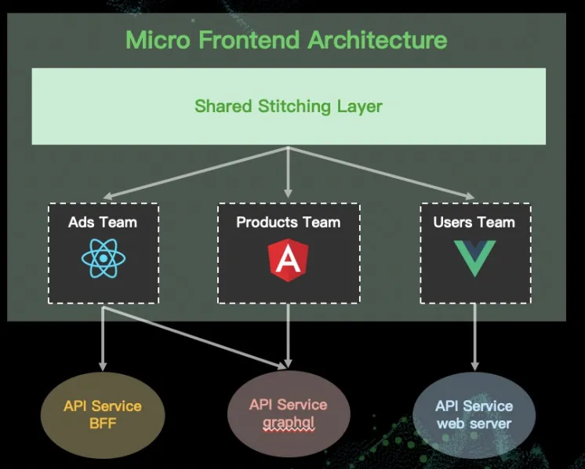

# 微前端 qiankun 框架

## 1. 概述

### 1.1 什么是微前端

微前端是一种类似于微服务的架构，它将微服务的理念应用于浏览器端，即将 Web 应用由单一的单体应用转变为多个小型前端应用聚合为一的应用。各个前端应用还可以独立运行、独立开发、独立部署。



### 1.2 微前端优势

#### 技术栈无关
主框架不限制接入应用的技术栈，微应用具备完全自主权。可以使用 React、Vue、Angular 等不同技术栈。

#### 独立开发、独立部署
- **独立开发**: 各个微应用可以独立开发，不受其他应用影响
- **独立部署**: 微应用可以独立部署，主框架自动完成同步更新
- **团队独立**: 不同团队可以独立维护各自的微应用

#### 增量升级
在面对各种复杂场景时，很难对一个已经存在的系统做全量的技术栈升级或重构，而微前端是一种非常好的实施渐进式重构的手段和策略。

#### 独立运行时
每个微应用之间状态隔离，运行时状态不共享，避免全局状态污染。

### 1.3 微前端挑战

#### 性能问题
- **重复依赖**: 不同微应用可能加载相同的库
- **包体积**: 多个应用同时加载可能导致总体积增大
- **网络请求**: 增加了额外的网络开销

#### 一致性问题
- **用户体验**: 保持不同微应用间的一致性
- **设计系统**: 统一的 UI 组件和设计规范
- **交互行为**: 确保一致的用户交互体验

#### 状态共享复杂性
- **数据同步**: 微应用间的数据同步机制
- **状态管理**: 全局状态和局部状态的管理
- **事件通信**: 跨应用的事件传递

#### 开发复杂性
- **调试困难**: 多个应用同时运行时的调试
- **版本管理**: 多个微应用的版本协调
- **构建部署**: 复杂的构建和部署流程

#### 安全性问题
- **跨域问题**: 不同域名下的应用交互
- **数据安全**: 敏感数据的隔离和保护
- **权限控制**: 统一的权限管理机制

## 2. qiankun 框架介绍

### 2.1 功能介绍

qiankun 是一个基于 single-spa 的微前端实现库，孵化自蚂蚁金融科技，能更简单、无痛的构建一个生产可用微前端架构系统。

### 2.2 核心特性

#### 📦 基于 single-spa 封装
提供了更加开箱即用的 API，简化了微前端的接入和使用。

#### 📱 技术栈无关
任意技术栈的应用均可使用/接入，不论是 React/Vue/Angular/jQuery 还是其他框架。

#### 💪 HTML Entry 接入方式
让你接入微应用像使用 iframe 一样简单，无需复杂的配置。

#### 🛡️ 样式隔离
- **sandbox**: 启用沙箱模式
- **strictStyleIsolation**: 通过 shadow dom 开启严格样式隔离
- **experimentalStyleIsolation**: 通过命名空间添加样式隔离

#### 🧳 JS 沙箱
通过 Proxy 对象创建了一个 JavaScript 沙箱，用于隔离子应用的全局变量，防止子应用之间的全局变量污染。

#### ⚡️ 资源预加载
在浏览器空闲时间预加载未打开的微应用资源，加速微应用打开速度。

#### 🔌 umi 插件
提供了 @umijs/plugin-qiankun 供 umi 应用一键切换成微前端架构系统。

### 2.3 架构原理

qiankun 的实现原理基于以下几个核心概念：

#### HTML Entry
- 通过 `import-html-entry` 加载子应用
- 解析 HTML 文件，提取 JS 和 CSS 资源
- 动态创建 script 和 link 标签加载资源

#### 沙箱机制
- **快照沙箱**: 记录和恢复全局状态
- **代理沙箱**: 通过 Proxy 拦截全局变量访问
- **多例沙箱**: 支持多个子应用同时运行

#### 样式隔离
- **Shadow DOM**: 严格的样式隔离
- **CSS 命名空间**: 为样式添加前缀
- **CSS-in-JS**: 运行时样式隔离

## 3. 为何不用 iframe

### 3.1 iframe 的优势

iframe 最大的特性就是提供了浏览器原生的硬隔离方案，不论是样式隔离、JS 隔离这类问题统统都能被完美解决。

### 3.2 iframe 的问题

#### URL 不同步
- 浏览器刷新 iframe url 状态丢失
- 后退前进按钮无法使用
- 无法保持路由状态

#### UI 不同步
- DOM 结构不共享
- 弹框无法居中显示
- 无法实现全屏遮罩效果

#### 全局上下文完全隔离
- 内存变量不共享
- 数据同步困难
- 无法共享全局状态

#### 性能问题
- 每次子应用进入都是浏览器上下文重建
- 资源重新加载
- 启动速度慢

## 4. JS entry 和 HTML entry 区别

### 4.1 JS Entry

#### 工作原理
子应用将资源打成一个 entry script，所有资源打包到一个 js bundle 里。

#### 优势
- 配置简单
- 资源集中管理
- 加载逻辑清晰

#### 劣势
- 包体积庞大
- 无法利用资源并行加载
- 难以实现样式隔离

### 4.2 HTML Entry

#### 工作原理
将子应用打出来的 HTML 作为入口，主框架通过 fetch HTML 的方式获取子应用的静态资源。

#### 实现机制
1. **加载 HTML 入口文件**: 通过 `import-html-entry` 加载子应用 HTML
2. **解析 HTML 内容**: 提取 JavaScript 和 CSS 资源的 URL
3. **动态加载资源**: 按正确顺序加载 JS 和 CSS 资源
4. **创建沙箱环境**: 通过 Proxy 创建沙箱，隔离全局变量
5. **返回入口模块**: 返回可以加载子应用的模块

#### 优势
- 减少主应用接入成本
- 天然的样式隔离
- 支持资源并行加载
- 接近原生的开发体验

## 5. qiankun 应用间通信

### 5.1 通信方式概述

qiankun 提供了多种应用间通信方式，可以根据不同场景选择合适的方案。

### 5.2 localStorage 和 sessionStorage

#### 使用场景
- 简单的数据存储
- 跨应用数据共享
- 持久化存储需求

#### 代码示例

```javascript
// 主应用中设置数据
localStorage.setItem('user', JSON.stringify({
  id: 1,
  name: '张进喜',
  role: 'admin'
}))

// 子应用中获取数据
const user = JSON.parse(localStorage.getItem('user') || '{}')
console.log('当前用户:', user)
```

### 5.3 路由参数通信

#### 使用场景
- 页面间参数传递
- 状态持久化
- 页面刷新后状态保持

#### 代码示例

```javascript
// 主应用中设置路由参数
const params = new URLSearchParams(window.location.search)
params.set('userId', '123')
params.set('theme', 'dark')
window.history.pushState({}, '', `${window.location.pathname}?${params}`)

// 子应用中获取路由参数
const urlParams = new URLSearchParams(window.location.search)
const userId = urlParams.get('userId')
const theme = urlParams.get('theme')
```

### 5.4 Actions 通信

#### 工作原理
qiankun 内部提供了 `initGlobalState` 方法用于注册 MicroAppStateActions 实例进行通信。

#### 核心方法
- **setGlobalState**: 设置 globalState
- **onGlobalStateChange**: 注册观察者函数
- **offGlobalStateChange**: 取消观察者函数

#### 主应用实现

```javascript
import { initGlobalState } from 'qiankun'

// 初始化全局状态
const actions = initGlobalState({
  user: {
    id: 1,
    name: '张进喜',
    role: 'admin'
  },
  theme: 'light',
  language: 'zh-CN'
})

// 监听状态变化
actions.onGlobalStateChange((state, prev) => {
  console.log('主应用状态变化:', state, prev)
})

// 设置状态
actions.setGlobalState({
  user: {
    id: 2,
    name: '李四',
    role: 'user'
  }
})

// 注册微应用时传递 actions
registerMicroApps([
  {
    name: 'sub-app',
    entry: '//localhost:8080',
    container: '#subapp-container',
    activeRule: '/subapp',
    props: {
      actions // 传递给子应用
    }
  }
])
```

#### 子应用实现

```javascript
// 子应用生命周期函数
export async function mount(props) {
  const { actions } = props
  
  if (actions) {
    // 监听全局状态变化
    actions.onGlobalStateChange((state, prev) => {
      console.log('子应用接收到状态变化:', state, prev)
      // 更新子应用状态
      updateLocalState(state)
    })
    
    // 向主应用发送状态
    actions.setGlobalState({
      subAppReady: true,
      subAppData: { message: '子应用已准备就绪' }
    })
  }
}

export async function unmount() {
  // 清理监听器
  if (actions) {
    actions.offGlobalStateChange()
  }
}
```

### 5.5 状态管理库通信

#### 工作原理
通过 shared 实例暴露方法给子应用使用，子应用维护独立的状态管理实例。

#### 主应用 Vuex 实现

```javascript
// store/index.js
import { createStore } from 'vuex'

const store = createStore({
  state: {
    user: null,
    theme: 'light',
    sharedData: {}
  },
  mutations: {
    SET_USER(state, user) {
      state.user = user
    },
    SET_THEME(state, theme) {
      state.theme = theme
    },
    SET_SHARED_DATA(state, data) {
      state.sharedData = { ...state.sharedData, ...data }
    }
  },
  actions: {
    updateUser({ commit }, user) {
      commit('SET_USER', user)
    },
    updateTheme({ commit }, theme) {
      commit('SET_THEME', theme)
    },
    updateSharedData({ commit }, data) {
      commit('SET_SHARED_DATA', data)
    }
  }
})

// 暴露给子应用的方法
window.sharedStore = {
  getState: () => store.state,
  dispatch: store.dispatch,
  commit: store.commit,
  subscribe: store.subscribe
}

export default store
```

#### 子应用状态管理

```javascript
// 子应用中使用共享状态
const sharedStore = window.sharedStore

if (sharedStore) {
  // 获取主应用状态
  const mainAppState = sharedStore.getState()
  
  // 监听主应用状态变化
  sharedStore.subscribe((mutation, state) => {
    console.log('主应用状态变化:', mutation, state)
    // 同步到子应用
    syncToSubApp(state)
  })
  
  // 向主应用发送数据
  sharedStore.dispatch('updateSharedData', {
    subAppId: 'sub-app-1',
    data: { message: '来自子应用的数据' }
  })
}
```

### 5.6 自定义事件通信

#### 实现原理
基于浏览器原生事件系统实现跨应用通信。

#### 代码示例

```javascript
// 主应用中监听事件
window.addEventListener('subAppMessage', (event) => {
  console.log('接收到子应用消息:', event.detail)
  // 处理子应用消息
  handleSubAppMessage(event.detail)
})

// 子应用中发送事件
const sendMessageToMain = (data) => {
  const event = new CustomEvent('subAppMessage', {
    detail: {
      type: 'USER_ACTION',
      payload: data,
      timestamp: Date.now()
    }
  })
  window.dispatchEvent(event)
}

// 使用示例
sendMessageToMain({
  action: 'userLogin',
  userId: 123,
  userName: '张进喜'
})
```

## 6. qiankun 使用指南

### 6.1 主应用配置

#### 安装依赖

```bash
npm install qiankun
# 或
yarn add qiankun
```

#### 注册微应用

```javascript
import {
  registerMicroApps,
  start,
  loadMicroApp,
  prefetchApps,
  setDefaultMountApp,
  runAfterFirstMounted,
  addGlobalUncaughtErrorHandler,
  removeGlobalUncaughtErrorHandler,
  initGlobalState
} from 'qiankun'

// 全局错误处理
addGlobalUncaughtErrorHandler((event) => {
  console.error('微应用错误:', event)
})

// 初始化全局状态
const actions = initGlobalState({
  user: null,
  theme: 'light'
})

// 注册微应用
registerMicroApps([
  {
    name: 'react-app',
    entry: '//localhost:7100',
    container: '#react-container',
    activeRule: '/react',
    props: {
      actions,
      data: { appName: 'react-app' }
    }
  },
  {
    name: 'vue-app',
    entry: '//localhost:7200',
    container: '#vue-container',
    activeRule: '/vue',
    props: {
      actions,
      data: { appName: 'vue-app' }
    }
  }
], {
  // 生命周期钩子
  beforeLoad: (app) => {
    console.log('准备加载应用:', app.name)
  },
  beforeMount: (app) => {
    console.log('准备挂载应用:', app.name)
  },
  afterMount: (app) => {
    console.log('应用挂载完成:', app.name)
  },
  beforeUnmount: (app) => {
    console.log('准备卸载应用:', app.name)
  },
  afterUnmount: (app) => {
    console.log('应用卸载完成:', app.name)
  }
})

// 启动 qiankun
start({
  // 预加载策略
  prefetch: 'all',
  // 沙箱配置
  sandbox: {
    strictStyleIsolation: true,
    experimentalStyleIsolation: true
  },
  // 单实例模式
  singular: false,
  // 自定义 fetch
  fetch: window.fetch
})

// 设置默认应用
setDefaultMountApp('/react')

// 预加载应用
prefetchApps([
  { name: 'react-app', entry: '//localhost:7100' },
  { name: 'vue-app', entry: '//localhost:7200' }
])

// 第一个应用挂载后的回调
runAfterFirstMounted(() => {
  console.log('第一个应用已挂载')
})
```

#### 手动加载微应用

```javascript
// 手动加载微应用
const microApp = loadMicroApp({
  name: 'manual-app',
  entry: '//localhost:7300',
  container: '#manual-container',
  props: {
    data: { mode: 'manual' }
  }
})

// 卸载微应用
microApp.unmount()
```

### 6.2 子应用配置

#### 导出生命周期函数

```javascript
// public-path.js
if (window.__POWERED_BY_QIANKUN__) {
  __webpack_public_path__ = window.__INJECTED_PUBLIC_PATH_BY_QIANKUN__
}

// main.js
import './public-path'
import { createApp } from 'vue'
import App from './App.vue'
import router from './router'
import store from './store'

let app = null

function render(props = {}) {
  const { container } = props
  
  app = createApp(App)
  app.use(store)
  app.use(router)
  app.mount(container ? container.querySelector('#app') : '#app')
}

// 独立运行时
if (!window.__POWERED_BY_QIANKUN__) {
  render()
}

// 导出 qiankun 生命周期函数
export async function bootstrap() {
  console.log('子应用 bootstrap')
}

export async function mount(props) {
  console.log('子应用 mount', props)
  render(props)
}

export async function unmount() {
  console.log('子应用 unmount')
  app?.unmount()
  app = null
}
```

#### Webpack 配置

```javascript
// webpack.config.js
module.exports = {
  output: {
    library: 'subApp',
    libraryTarget: 'umd',
    jsonpFunction: `webpackJsonp_subApp`
  },
  devServer: {
    headers: {
      'Access-Control-Allow-Origin': '*'
    }
  }
}
```

#### Vue CLI 配置

```javascript
// vue.config.js
module.exports = {
  outputDir: 'dist',
  assetsDir: 'static',
  filenameHashing: true,
  publicPath: process.env.NODE_ENV === 'production' ? '/subapp/' : '/',
  devServer: {
    port: 8080,
    headers: {
      'Access-Control-Allow-Origin': '*'
    }
  },
  configureWebpack: {
    output: {
      library: 'subApp',
      libraryTarget: 'umd',
      jsonpFunction: `webpackJsonp_subApp`
    }
  }
}
```

## 7. 样式隔离方案

### 7.1 CSS 命名空间

#### 原理
为每个子应用的样式添加唯一的命名空间前缀。

#### 配置方法

```javascript
// 主应用配置
start({
  sandbox: {
    experimentalStyleIsolation: true
  }
})
```

#### 效果展示

```css
/* 原始样式 */
.header {
  background-color: #fff;
}

/* 添加命名空间后 */
.qiankun-subapp .header {
  background-color: #fff;
}
```

### 7.2 Shadow DOM 隔离

#### 原理
使用 Shadow DOM 创建完全隔离的样式环境。

#### 配置方法

```javascript
// 主应用配置
start({
  sandbox: {
    strictStyleIsolation: true
  }
})
```

#### 注意事项
- 可能影响一些第三方库的样式
- 弹框等组件可能需要特殊处理
- 调试时需要特别注意 Shadow DOM 结构

### 7.3 CSS-in-JS 方案

#### 使用 styled-components

```javascript
// 子应用中使用
import styled from 'styled-components'

const StyledHeader = styled.header`
  background-color: #fff;
  padding: 20px;
  border-bottom: 1px solid #eee;
`

const Header = () => {
  return (
    <StyledHeader>
      <h1>应用标题</h1>
    </StyledHeader>
  )
}
```

## 8. 最佳实践

### 8.1 应用拆分原则

#### 按业务域拆分
- 用户管理模块
- 订单管理模块
- 商品管理模块
- 数据分析模块

#### 按团队拆分
- 前端团队负责主应用
- 各业务团队负责各自的微应用
- 公共组件团队负责基础组件库

### 8.2 技术选型建议

#### 主应用技术栈
- 选择团队最熟悉的技术栈
- 考虑长期维护性
- 注重性能和稳定性

#### 微应用技术栈
- 可以选择不同的技术栈
- 优先考虑业务需求
- 注意与主应用的兼容性

### 8.3 开发流程

#### 本地开发
1. 主应用和微应用同时启动
2. 使用代理配置简化开发
3. 统一的构建和部署流程

#### 测试策略
1. 单元测试：各应用独立测试
2. 集成测试：应用间交互测试
3. 端到端测试：完整用户流程测试

#### 部署策略
1. 独立部署：各应用独立部署
2. 版本管理：统一的版本发布策略
3. 灰度发布：逐步替换旧版本

## 9. 常见问题与解决方案

### 9.1 资源加载问题

#### 问题描述
子应用的静态资源加载失败。

#### 解决方案
```javascript
// 子应用配置 public-path
if (window.__POWERED_BY_QIANKUN__) {
  __webpack_public_path__ = window.__INJECTED_PUBLIC_PATH_BY_QIANKUN__
}
```

### 9.2 路由冲突问题

#### 问题描述
主应用和子应用路由冲突。

#### 解决方案
```javascript
// 子应用路由配置
const router = new VueRouter({
  mode: 'history',
  base: window.__POWERED_BY_QIANKUN__ ? '/subapp/' : '/',
  routes
})
```

### 9.3 全局状态污染

#### 问题描述
子应用污染全局状态。

#### 解决方案
```javascript
// 使用沙箱模式
start({
  sandbox: {
    strictStyleIsolation: true,
    experimentalStyleIsolation: true
  }
})
```

## 10. 性能优化

### 10.1 资源预加载

```javascript
// 预加载策略
start({
  prefetch: 'all' // 预加载所有微应用
})

// 自定义预加载
prefetchApps([
  { name: 'app1', entry: '//localhost:7001' },
  { name: 'app2', entry: '//localhost:7002' }
])
```

### 10.2 代码分割

```javascript
// 子应用代码分割
const LazyComponent = lazy(() => import('./components/LazyComponent'))

// 路由级别的代码分割
const routes = [
  {
    path: '/lazy',
    component: lazy(() => import('./pages/LazyPage'))
  }
]
```

### 10.3 缓存策略

```javascript
// 主应用缓存配置
start({
  fetch: (url, options) => {
    // 添加缓存逻辑
    return fetch(url, {
      ...options,
      headers: {
        ...options.headers,
        'Cache-Control': 'max-age=3600'
      }
    })
  }
})
```

## 11. 总结

### 11.1 核心价值

qiankun 作为成熟的微前端解决方案，提供了：

- **技术栈无关**: 支持多种前端框架
- **开发体验**: 简化微前端开发流程
- **生产就绪**: 经过大规模生产验证
- **生态完善**: 丰富的插件和工具支持

### 11.2 适用场景

- **大型企业应用**: 多团队协作开发
- **遗留系统改造**: 渐进式技术升级
- **多产品集成**: 统一的用户体验
- **快速迭代**: 独立部署和发布

### 11.3 发展前景

随着微前端概念的普及和 qiankun 的不断完善，它将在大型前端应用开发中发挥更重要的作用，帮助企业构建更加灵活、可维护的前端架构。
