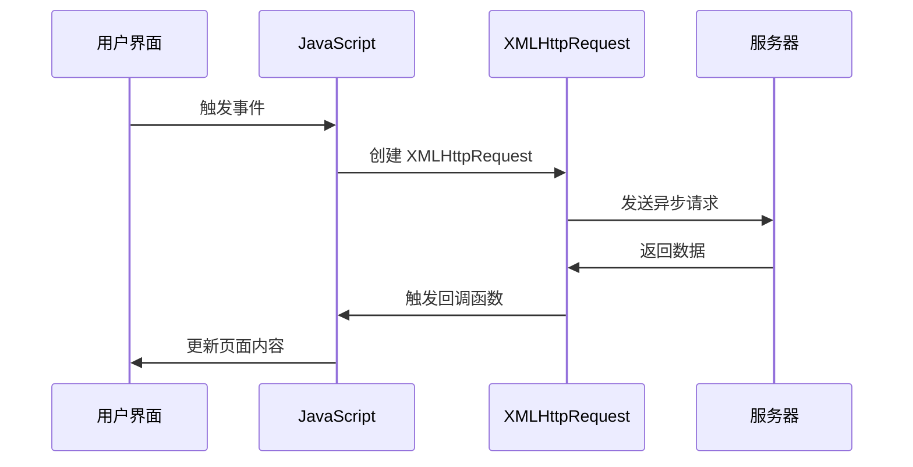

# 🚀 AJAX 异步通信技术

> AJAX（Asynchronous JavaScript And XML）是一种创建交互式网页应用的技术。通过在后台与服务器进行少量数据交换，AJAX 可以使网页实现异步更新，提供更流畅的用户体验。

## 🎯 AJAX 概述

### 📊 核心特性

| 特性 | 描述 | 优势 |
|------|------|------|
| **异步通信** | 在后台与服务器交换数据 | 🔄 不阻塞用户界面 |
| **局部更新** | 只更新页面部分内容 | ⚡ 提高响应速度 |
| **无刷新** | 无需重新加载整个页面 | 🎯 更好的用户体验 |
| **多格式支持** | 支持多种数据格式 | 🔧 灵活的数据交换 |

### 🏗️ AJAX 工作原理



## 🛠️ XMLHttpRequest 对象

### 🔧 基本使用方法

```javascript
// 1. 创建 XMLHttpRequest 对象
const xhr = new XMLHttpRequest();

// 2. 配置请求
xhr.open('GET', '/api/data', true);

// 3. 设置请求头（可选）
xhr.setRequestHeader('Content-Type', 'application/json');
xhr.setRequestHeader('Accept', 'application/json');

// 4. 设置响应处理
xhr.onreadystatechange = function() {
    if (xhr.readyState === 4) {
        if (xhr.status === 200) {
            console.log('请求成功:', xhr.responseText);
        } else {
            console.error('请求失败:', xhr.status);
        }
    }
};

// 5. 发送请求
xhr.send();
```

### 📋 对象属性详解

| 属性 | 类型 | 描述 | 可能值 |
|------|------|------|--------|
| **readyState** | number | 请求状态 | 0-4 |
| **status** | number | HTTP 状态码 | 200, 404, 500 等 |
| **statusText** | string | 状态文本 | 'OK', 'Not Found' 等 |
| **responseText** | string | 响应文本 | 服务器返回的文本 |
| **responseXML** | Document | 响应 XML | XML 文档对象 |
| **responseType** | string | 响应类型 | 'text', 'json', 'blob' 等 |
| **timeout** | number | 超时时间 | 毫秒数 |
| **withCredentials** | boolean | 跨域凭证 | true/false |

### 🔄 readyState 状态详解

```javascript
// readyState 状态码说明
const readyStateMap = {
  0: 'UNSENT',         // 未初始化，XMLHttpRequest 对象已创建
  1: 'OPENED',         // 已打开，open() 方法已被调用
  2: 'HEADERS_RECEIVED', // 已获取响应头，send() 方法已被调用
  3: 'LOADING',        // 正在下载响应体
  4: 'DONE'            // 请求完成，响应已准备好
};

// 实际应用示例
xhr.onreadystatechange = function() {
    console.log(`当前状态: ${readyStateMap[xhr.readyState]}`);
    
    switch(xhr.readyState) {
        case 0:
            console.log('📝 XMLHttpRequest 对象已创建');
            break;
        case 1:
            console.log('🔗 连接已建立');
            break;
        case 2:
            console.log('📥 请求已发送，正在接收');
            break;
        case 3:
            console.log('⏳ 正在处理数据');
            break;
        case 4:
            console.log('✅ 请求完成');
            handleResponse();
            break;
    }
};
```

## 🎨 AJAX 事件处理

### 📅 事件类型

| 事件 | 描述 | 触发时机 |
|------|------|----------|
| **onreadystatechange** | 状态变化 | readyState 改变时 |
| **onloadstart** | 开始加载 | 开始获取数据时 |
| **onprogress** | 进度更新 | 数据传输过程中 |
| **onload** | 加载完成 | 成功获取数据时 |
| **onloadend** | 加载结束 | 不论成功失败都触发 |
| **onerror** | 错误发生 | 网络错误时 |
| **ontimeout** | 超时 | 请求超时时 |
| **onabort** | 请求中止 | 请求被取消时 |

### 🔧 事件处理示例

```javascript
class AjaxRequest {
    constructor() {
        this.xhr = new XMLHttpRequest();
        this.setupEventHandlers();
    }
    
    setupEventHandlers() {
        // 加载开始
        this.xhr.onloadstart = () => {
            console.log('🚀 开始加载数据');
            this.showLoading();
        };
        
        // 进度更新
        this.xhr.onprogress = (event) => {
            if (event.lengthComputable) {
                const percentComplete = (event.loaded / event.total) * 100;
                console.log(`📊 加载进度: ${percentComplete.toFixed(2)}%`);
                this.updateProgress(percentComplete);
            }
        };
        
        // 加载完成
        this.xhr.onload = () => {
            console.log('✅ 数据加载完成');
            this.hideLoading();
            this.handleSuccess();
        };
        
        // 错误处理
        this.xhr.onerror = () => {
            console.error('❌ 网络错误');
            this.hideLoading();
            this.handleError('网络连接失败');
        };
        
        // 超时处理
        this.xhr.ontimeout = () => {
            console.error('⏰ 请求超时');
            this.hideLoading();
            this.handleError('请求超时');
        };
        
        // 请求中止
        this.xhr.onabort = () => {
            console.log('⏹️ 请求已中止');
            this.hideLoading();
        };
        
        // 加载结束（无论成功失败）
        this.xhr.onloadend = () => {
            console.log('🏁 请求结束');
        };
    }
    
    showLoading() {
        document.getElementById('loading').style.display = 'block';
    }
    
    hideLoading() {
        document.getElementById('loading').style.display = 'none';
    }
    
    updateProgress(percent) {
        const progressBar = document.getElementById('progress');
        progressBar.style.width = percent + '%';
    }
    
    handleSuccess() {
        if (this.xhr.status === 200) {
            try {
                const data = JSON.parse(this.xhr.responseText);
                this.onSuccess(data);
            } catch (e) {
                this.handleError('响应数据格式错误');
            }
        } else {
            this.handleError(`HTTP ${this.xhr.status}: ${this.xhr.statusText}`);
        }
    }
    
    handleError(message) {
        console.error('处理错误:', message);
        this.onError(message);
    }
    
    // 可重写的回调方法
    onSuccess(data) {
        console.log('成功回调:', data);
    }
    
    onError(message) {
        console.error('错误回调:', message);
    }
}
```

## 🌐 HTTP 请求方法

### 📊 GET 请求

```javascript
// GET 请求示例
function getData(url, params = {}) {
    return new Promise((resolve, reject) => {
        const xhr = new XMLHttpRequest();
        
        // 构建查询参数
        const queryString = Object.keys(params)
            .map(key => `${encodeURIComponent(key)}=${encodeURIComponent(params[key])}`)
            .join('&');
        
        const fullUrl = queryString ? `${url}?${queryString}` : url;
        
        xhr.open('GET', fullUrl, true);
        xhr.setRequestHeader('Accept', 'application/json');
        
        xhr.onload = function() {
            if (xhr.status === 200) {
                try {
                    const data = JSON.parse(xhr.responseText);
                    resolve(data);
                } catch (e) {
                    reject(new Error('解析 JSON 失败'));
                }
            } else {
                reject(new Error(`HTTP ${xhr.status}: ${xhr.statusText}`));
            }
        };
        
        xhr.onerror = () => reject(new Error('网络错误'));
        xhr.ontimeout = () => reject(new Error('请求超时'));
        
        xhr.timeout = 10000; // 10 秒超时
        xhr.send();
    });
}

// 使用示例
getData('/api/users', { page: 1, limit: 20 })
    .then(data => {
        console.log('获取用户数据:', data);
        renderUserList(data.users);
    })
    .catch(error => {
        console.error('获取数据失败:', error);
        showErrorMessage(error.message);
    });
```

### 📝 POST 请求

```javascript
// POST 请求示例
function postData(url, data, contentType = 'application/json') {
    return new Promise((resolve, reject) => {
        const xhr = new XMLHttpRequest();
        
        xhr.open('POST', url, true);
        xhr.setRequestHeader('Content-Type', contentType);
        xhr.setRequestHeader('Accept', 'application/json');
        
        xhr.onload = function() {
            if (xhr.status >= 200 && xhr.status < 300) {
                try {
                    const response = JSON.parse(xhr.responseText);
                    resolve(response);
                } catch (e) {
                    resolve(xhr.responseText);
                }
            } else {
                reject(new Error(`HTTP ${xhr.status}: ${xhr.statusText}`));
            }
        };
        
        xhr.onerror = () => reject(new Error('网络错误'));
        xhr.ontimeout = () => reject(new Error('请求超时'));
        
        xhr.timeout = 15000; // 15 秒超时
        
        // 根据内容类型处理数据
        let payload;
        if (contentType === 'application/json') {
            payload = JSON.stringify(data);
        } else if (contentType === 'application/x-www-form-urlencoded') {
            payload = Object.keys(data)
                .map(key => `${encodeURIComponent(key)}=${encodeURIComponent(data[key])}`)
                .join('&');
        } else {
            payload = data; // FormData 或其他格式
        }
        
        xhr.send(payload);
    });
}

// 使用示例
const userData = {
    name: 'John Doe',
    email: 'john@example.com',
    age: 25
};

postData('/api/users', userData)
    .then(response => {
        console.log('创建用户成功:', response);
        showSuccessMessage('用户创建成功');
    })
    .catch(error => {
        console.error('创建用户失败:', error);
        showErrorMessage(error.message);
    });
```

### 📤 文件上传

```javascript
// 文件上传示例
function uploadFile(url, file, onProgress) {
    return new Promise((resolve, reject) => {
        const formData = new FormData();
        formData.append('file', file);
        
        const xhr = new XMLHttpRequest();
        
        xhr.open('POST', url, true);
        
        // 上传进度
        xhr.upload.onprogress = function(event) {
            if (event.lengthComputable) {
                const percentComplete = (event.loaded / event.total) * 100;
                onProgress && onProgress(percentComplete);
            }
        };
        
        xhr.onload = function() {
            if (xhr.status === 200) {
                try {
                    const response = JSON.parse(xhr.responseText);
                    resolve(response);
                } catch (e) {
                    resolve(xhr.responseText);
                }
            } else {
                reject(new Error(`上传失败: ${xhr.status}`));
            }
        };
        
        xhr.onerror = () => reject(new Error('上传失败'));
        xhr.ontimeout = () => reject(new Error('上传超时'));
        
        xhr.timeout = 30000; // 30 秒超时
        xhr.send(formData);
    });
}

// 使用示例
const fileInput = document.getElementById('fileInput');
const progressBar = document.getElementById('progressBar');

fileInput.addEventListener('change', function(event) {
    const file = event.target.files[0];
    if (file) {
        uploadFile('/api/upload', file, (percent) => {
            progressBar.style.width = percent + '%';
            progressBar.textContent = Math.round(percent) + '%';
        })
        .then(response => {
            console.log('上传成功:', response);
            showSuccessMessage('文件上传成功');
        })
        .catch(error => {
            console.error('上传失败:', error);
            showErrorMessage(error.message);
        });
    }
});
```

## 🔒 跨域请求处理

### 🌐 CORS 配置

```javascript
// 配置跨域请求
function makeCorsRequest(url, method = 'GET', data = null) {
    return new Promise((resolve, reject) => {
        const xhr = new XMLHttpRequest();
        
        // 设置跨域凭证
        xhr.withCredentials = true;
        
        xhr.open(method, url, true);
        
        // 设置必要的头部
        xhr.setRequestHeader('Content-Type', 'application/json');
        xhr.setRequestHeader('Accept', 'application/json');
        
        // 处理预检请求
        if (method === 'OPTIONS') {
            xhr.setRequestHeader('Access-Control-Request-Method', 'POST');
            xhr.setRequestHeader('Access-Control-Request-Headers', 'Content-Type');
        }
        
        xhr.onload = function() {
            if (xhr.status >= 200 && xhr.status < 300) {
                try {
                    const response = JSON.parse(xhr.responseText);
                    resolve(response);
                } catch (e) {
                    resolve(xhr.responseText);
                }
            } else {
                reject(new Error(`请求失败: ${xhr.status}`));
            }
        };
        
        xhr.onerror = () => reject(new Error('跨域请求失败'));
        
        xhr.send(data ? JSON.stringify(data) : null);
    });
}

// JSONP 替代方案
function jsonpRequest(url, callbackName = 'callback') {
    return new Promise((resolve, reject) => {
        const script = document.createElement('script');
        const callbackFunctionName = `jsonp_${Date.now()}_${Math.random().toString(36).substr(2)}`;
        
        // 设置全局回调函数
        window[callbackFunctionName] = function(data) {
            resolve(data);
            document.head.removeChild(script);
            delete window[callbackFunctionName];
        };
        
        // 设置错误处理
        script.onerror = function() {
            reject(new Error('JSONP 请求失败'));
            document.head.removeChild(script);
            delete window[callbackFunctionName];
        };
        
        // 构建 URL
        const separator = url.includes('?') ? '&' : '?';
        script.src = `${url}${separator}${callbackName}=${callbackFunctionName}`;
        
        document.head.appendChild(script);
    });
}
```

## 🛡️ 安全性考虑

### 🔐 安全实践

```javascript
// 安全的 AJAX 请求封装
class SecureAjax {
    constructor() {
        this.baseURL = '';
        this.token = null;
        this.csrfToken = null;
    }
    
    // 设置认证令牌
    setToken(token) {
        this.token = token;
    }
    
    // 设置 CSRF 令牌
    setCsrfToken(token) {
        this.csrfToken = token;
    }
    
    // 安全请求
    secureRequest(url, method = 'GET', data = null) {
        return new Promise((resolve, reject) => {
            const xhr = new XMLHttpRequest();
            
            xhr.open(method, this.baseURL + url, true);
            
            // 设置安全头部
            xhr.setRequestHeader('Content-Type', 'application/json');
            xhr.setRequestHeader('Accept', 'application/json');
            
            // 添加认证令牌
            if (this.token) {
                xhr.setRequestHeader('Authorization', `Bearer ${this.token}`);
            }
            
            // 添加 CSRF 令牌
            if (this.csrfToken) {
                xhr.setRequestHeader('X-CSRF-Token', this.csrfToken);
            }
            
            // 添加自定义安全头部
            xhr.setRequestHeader('X-Requested-With', 'XMLHttpRequest');
            
            xhr.onload = function() {
                if (xhr.status >= 200 && xhr.status < 300) {
                    try {
                        const response = JSON.parse(xhr.responseText);
                        resolve(response);
                    } catch (e) {
                        reject(new Error('响应格式错误'));
                    }
                } else if (xhr.status === 401) {
                    reject(new Error('认证失败'));
                } else if (xhr.status === 403) {
                    reject(new Error('权限不足'));
                } else {
                    reject(new Error(`请求失败: ${xhr.status}`));
                }
            };
            
            xhr.onerror = () => reject(new Error('网络错误'));
            xhr.ontimeout = () => reject(new Error('请求超时'));
            
            xhr.timeout = 10000;
            xhr.send(data ? JSON.stringify(data) : null);
        });
    }
    
    // 输入验证
    validateInput(data) {
        const errors = [];
        
        if (typeof data === 'string') {
            // 检查是否包含恶意脚本
            if (/<script\b[^<]*(?:(?!<\/script>)<[^<]*)*<\/script>/gi.test(data)) {
                errors.push('输入包含恶意脚本');
            }
        }
        
        if (typeof data === 'object' && data !== null) {
            for (const key in data) {
                if (typeof data[key] === 'string') {
                    if (/<script\b[^<]*(?:(?!<\/script>)<[^<]*)*<\/script>/gi.test(data[key])) {
                        errors.push(`字段 ${key} 包含恶意脚本`);
                    }
                }
            }
        }
        
        return errors;
    }
}

// 使用示例
const secureAjax = new SecureAjax();
secureAjax.setToken('your-jwt-token');
secureAjax.setCsrfToken('csrf-token-value');

secureAjax.secureRequest('/api/protected-data')
    .then(data => {
        console.log('安全请求成功:', data);
    })
    .catch(error => {
        console.error('安全请求失败:', error);
    });
```

## 🎯 实战案例

### 📋 用户管理系统

```javascript
// 用户管理 AJAX 封装
class UserManager {
    constructor(baseURL = '/api/users') {
        this.baseURL = baseURL;
        this.cache = new Map();
    }
    
    // 获取用户列表
    async getUsers(params = {}) {
        const cacheKey = JSON.stringify(params);
        if (this.cache.has(cacheKey)) {
            return this.cache.get(cacheKey);
        }
        
        try {
            const data = await this.request('GET', '', params);
            this.cache.set(cacheKey, data);
            return data;
        } catch (error) {
            throw new Error(`获取用户列表失败: ${error.message}`);
        }
    }
    
    // 创建用户
    async createUser(userData) {
        try {
            const response = await this.request('POST', '', userData);
            this.clearCache();
            return response;
        } catch (error) {
            throw new Error(`创建用户失败: ${error.message}`);
        }
    }
    
    // 更新用户
    async updateUser(userId, userData) {
        try {
            const response = await this.request('PUT', `/${userId}`, userData);
            this.clearCache();
            return response;
        } catch (error) {
            throw new Error(`更新用户失败: ${error.message}`);
        }
    }
    
    // 删除用户
    async deleteUser(userId) {
        try {
            const response = await this.request('DELETE', `/${userId}`);
            this.clearCache();
            return response;
        } catch (error) {
            throw new Error(`删除用户失败: ${error.message}`);
        }
    }
    
    // 通用请求方法
    request(method, endpoint, data = null) {
        return new Promise((resolve, reject) => {
            const xhr = new XMLHttpRequest();
            const url = this.baseURL + endpoint;
            
            xhr.open(method, url, true);
            xhr.setRequestHeader('Content-Type', 'application/json');
            xhr.setRequestHeader('Accept', 'application/json');
            
            xhr.onload = function() {
                if (xhr.status >= 200 && xhr.status < 300) {
                    try {
                        const response = JSON.parse(xhr.responseText);
                        resolve(response);
                    } catch (e) {
                        resolve(xhr.responseText);
                    }
                } else {
                    reject(new Error(`HTTP ${xhr.status}: ${xhr.statusText}`));
                }
            };
            
            xhr.onerror = () => reject(new Error('网络错误'));
            xhr.ontimeout = () => reject(new Error('请求超时'));
            
            xhr.timeout = 10000;
            
            if (method === 'GET' && data) {
                const queryString = new URLSearchParams(data).toString();
                xhr.open(method, `${url}?${queryString}`, true);
                xhr.send();
            } else {
                xhr.send(data ? JSON.stringify(data) : null);
            }
        });
    }
    
    // 清除缓存
    clearCache() {
        this.cache.clear();
    }
}

// 使用示例
const userManager = new UserManager();

// 获取用户列表
userManager.getUsers({ page: 1, limit: 10 })
    .then(users => {
        console.log('用户列表:', users);
        renderUserTable(users);
    })
    .catch(error => {
        console.error('获取用户失败:', error);
        showErrorMessage(error.message);
    });

// 创建新用户
userManager.createUser({
    name: 'Jane Doe',
    email: 'jane@example.com',
    role: 'user'
})
.then(user => {
    console.log('创建用户成功:', user);
    showSuccessMessage('用户创建成功');
    refreshUserList();
})
.catch(error => {
    console.error('创建用户失败:', error);
    showErrorMessage(error.message);
});
```

## 🎯 最佳实践

### 🏆 性能优化

| 优化方法 | 描述 | 实现 |
|----------|------|------|
| **请求合并** | 减少请求次数 | 🔄 批量处理多个请求 |
| **缓存策略** | 避免重复请求 | 🗄️ 本地缓存响应数据 |
| **超时设置** | 避免长时间等待 | ⏰ 合理设置超时时间 |
| **错误重试** | 提高请求成功率 | 🔄 失败后自动重试 |

### 🔧 错误处理

```javascript
// 完善的错误处理机制
class RobustAjax {
    constructor() {
        this.retryCount = 3;
        this.retryDelay = 1000;
    }
    
    async request(url, options = {}) {
        const { retry = true } = options;
        let lastError;
        
        for (let i = 0; i <= this.retryCount; i++) {
            try {
                return await this.makeRequest(url, options);
            } catch (error) {
                lastError = error;
                
                if (!retry || i === this.retryCount) {
                    break;
                }
                
                // 指数退避
                const delay = this.retryDelay * Math.pow(2, i);
                await this.sleep(delay);
                
                console.log(`重试请求 ${i + 1}/${this.retryCount}: ${url}`);
            }
        }
        
        throw lastError;
    }
    
    makeRequest(url, options) {
        return new Promise((resolve, reject) => {
            const xhr = new XMLHttpRequest();
            const { method = 'GET', data = null, headers = {} } = options;
            
            xhr.open(method, url, true);
            
            // 设置请求头
            Object.keys(headers).forEach(key => {
                xhr.setRequestHeader(key, headers[key]);
            });
            
            xhr.onload = function() {
                if (xhr.status >= 200 && xhr.status < 300) {
                    try {
                        const response = JSON.parse(xhr.responseText);
                        resolve(response);
                    } catch (e) {
                        resolve(xhr.responseText);
                    }
                } else {
                    reject(new Error(`HTTP ${xhr.status}: ${xhr.statusText}`));
                }
            };
            
            xhr.onerror = () => reject(new Error('网络错误'));
            xhr.ontimeout = () => reject(new Error('请求超时'));
            
            xhr.timeout = options.timeout || 10000;
            xhr.send(data ? JSON.stringify(data) : null);
        });
    }
    
    sleep(ms) {
        return new Promise(resolve => setTimeout(resolve, ms));
    }
}
```

## 📚 相关资源

### 🔗 官方文档
- [MDN XMLHttpRequest](https://developer.mozilla.org/en-US/docs/Web/API/XMLHttpRequest)
- [W3C XMLHttpRequest 规范](https://www.w3.org/TR/XMLHttpRequest/)
- [HTTP 状态码参考](https://developer.mozilla.org/en-US/docs/Web/HTTP/Status)

### 🛠️ 相关技术
- [Fetch API](https://developer.mozilla.org/en-US/docs/Web/API/Fetch_API) - 现代替代方案
- [Axios](https://axios-http.com/) - 流行的 HTTP 客户端
- [jQuery AJAX](https://api.jquery.com/category/ajax/) - jQuery 的 AJAX 方法

### 📖 学习资源
- [AJAX 最佳实践](https://developer.mozilla.org/en-US/docs/Web/Guide/AJAX)
- [异步编程指南](https://developer.mozilla.org/en-US/docs/Learn/JavaScript/Asynchronous)
- [HTTP 协议详解](https://developer.mozilla.org/en-US/docs/Web/HTTP)

---

::: tip 💡 小贴士
虽然 AJAX 是一项成熟的技术，但在现代开发中，建议优先使用 Fetch API 或 Axios 等更现代的 HTTP 客户端。XMLHttpRequest 主要用于理解异步通信的基本原理和处理兼容性问题。
:::

::: warning ⚠️ 注意
进行跨域请求时，需要服务器正确配置 CORS 头部。同时要注意安全性，避免 XSS 攻击，对用户输入进行适当的验证和转义。
:::
