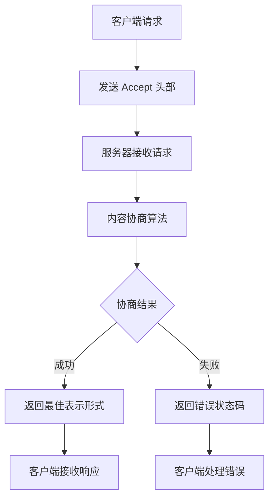
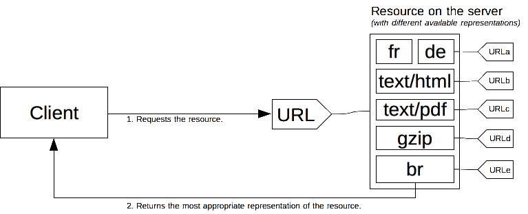
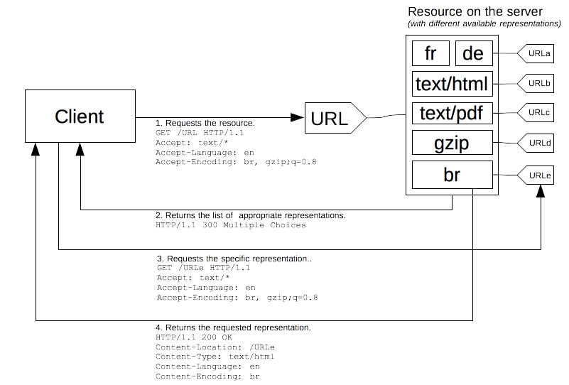

# 🤝 HTTP 内容协商完全指南

> 在 HTTP 协议中，内容协商是一种机制，用于为同一 URI 提供资源不同的表示形式，以帮助用户代理指定最适合用户的表示形式。这是现代 Web 应用提供优化用户体验的重要技术。

## 🎯 学习目标

::: tip 📚 核心知识点
- 理解 HTTP 内容协商的工作原理和机制
- 掌握各种 Accept 头部的使用方法
- 学习服务端和客户端驱动的协商策略
- 了解 Vary 头部的作用和配置
- 掌握内容协商的实际应用场景
:::

## 🔍 内容协商概述

### 📖 核心概念

一份特定的文件被称为一项**资源**。当客户端获取资源的时候，会使用其对应的 URL 发送请求。服务器通过这个 URL 来选择它指向的资源的某一可用的变体——每一个变体称为一种**表示形式**——然后将这个选定的表示形式返回给客户端。

### 🔄 协商流程



### 🎨 协商机制类型

| 协商类型 | 描述 | 优势 | 劣势 |
|----------|------|------|------|
| **服务端驱动** | 服务器根据请求头选择 | 🚀 实现简单，响应快 | 🔴 灵活性有限 |
| **客户端驱动** | 客户端从选项中选择 | 🎯 选择精确，灵活 | 🔴 增加网络开销 |
| **透明协商** | 代理服务器进行协商 | 🔄 减少延迟 | 🔴 实现复杂 |



## 🔧 服务端驱动型内容协商

### 📊 协商机制

在服务端驱动型内容协商中，浏览器会随同 URL 发送一系列的 HTTP 标头。这些标头描述了用户倾向的选择。服务器则以此为线索，通过内部算法来选择最佳方案提供给客户端。


### 🔧 核心头部字段

| 头部字段 | 描述 | 示例 | 作用 |
|----------|------|------|------|
| **Accept** | 媒体类型偏好 | `text/html,application/xml;q=0.9` | 🎯 指定接受的内容类型 |
| **Accept-Charset** | 字符集偏好 | `utf-8,iso-8859-1;q=0.5` | 🔤 指定字符编码 |
| **Accept-Encoding** | 编码偏好 | `gzip,deflate,br` | 📦 指定压缩算法 |
| **Accept-Language** | 语言偏好 | `zh-CN,zh;q=0.9,en;q=0.8` | 🌐 指定语言偏好 |
| **User-Agent** | 用户代理 | `Mozilla/5.0 (Windows NT 10.0)` | 🖥️ 设备和浏览器信息 |

### 🎯 实现示例

```javascript
// 服务端内容协商实现
const contentNegotiation = {
  // 媒体类型协商
  negotiateMediaType: (acceptHeader, availableTypes) => {
    const acceptedTypes = parseAcceptHeader(acceptHeader);
    const sortedTypes = acceptedTypes.sort((a, b) => b.quality - a.quality);
    
    for (const acceptedType of sortedTypes) {
      for (const availableType of availableTypes) {
        if (isMediaTypeMatch(acceptedType.type, availableType)) {
          return availableType;
        }
      }
    }
    
    return null; // 没有匹配的类型
  },

  // 语言协商
  negotiateLanguage: (acceptLanguageHeader, availableLanguages) => {
    const acceptedLanguages = parseAcceptLanguageHeader(acceptLanguageHeader);
    const sortedLanguages = acceptedLanguages.sort((a, b) => b.quality - a.quality);
    
    for (const acceptedLang of sortedLanguages) {
      for (const availableLang of availableLanguages) {
        if (isLanguageMatch(acceptedLang.language, availableLang)) {
          return availableLang;
        }
      }
    }
    
    return availableLanguages[0]; // 默认语言
  },

  // 编码协商
  negotiateEncoding: (acceptEncodingHeader, availableEncodings) => {
    const acceptedEncodings = parseAcceptEncodingHeader(acceptEncodingHeader);
    const sortedEncodings = acceptedEncodings.sort((a, b) => b.quality - a.quality);
    
    for (const acceptedEncoding of sortedEncodings) {
      if (availableEncodings.includes(acceptedEncoding.encoding)) {
        return acceptedEncoding.encoding;
      }
    }
    
    return 'identity'; // 默认不压缩
  }
};

// 解析 Accept 头部
function parseAcceptHeader(acceptHeader) {
  return acceptHeader.split(',').map(part => {
    const [type, ...params] = part.trim().split(';');
    let quality = 1.0;
    
    for (const param of params) {
      const [key, value] = param.trim().split('=');
      if (key === 'q') {
        quality = parseFloat(value);
      }
    }
    
    return { type: type.trim(), quality };
  });
}

// Express.js 中间件实现
const contentNegotiationMiddleware = (req, res, next) => {
  // 媒体类型协商
  const acceptHeader = req.headers.accept || '*/*';
  const availableTypes = ['text/html', 'application/json', 'application/xml'];
  const negotiatedType = contentNegotiation.negotiateMediaType(acceptHeader, availableTypes);
  
  if (!negotiatedType) {
    return res.status(406).json({ error: 'Not Acceptable' });
  }
  
  // 语言协商
  const acceptLanguageHeader = req.headers['accept-language'] || 'en';
  const availableLanguages = ['zh-CN', 'en-US', 'ja-JP'];
  const negotiatedLanguage = contentNegotiation.negotiateLanguage(acceptLanguageHeader, availableLanguages);
  
  // 编码协商
  const acceptEncodingHeader = req.headers['accept-encoding'] || 'identity';
  const availableEncodings = ['gzip', 'deflate', 'br', 'identity'];
  const negotiatedEncoding = contentNegotiation.negotiateEncoding(acceptEncodingHeader, availableEncodings);
  
  // 将协商结果附加到请求对象
  req.negotiated = {
    mediaType: negotiatedType,
    language: negotiatedLanguage,
    encoding: negotiatedEncoding
  };
  
  next();
};

// 使用中间件
app.use(contentNegotiationMiddleware);

// 根据协商结果响应
app.get('/api/data', (req, res) => {
  const data = { message: 'Hello, World!', timestamp: Date.now() };
  
  // 根据协商的媒体类型返回不同格式
  switch (req.negotiated.mediaType) {
    case 'application/json':
      res.json(data);
      break;
    case 'application/xml':
      res.type('application/xml');
      res.send(convertToXML(data));
      break;
    case 'text/html':
      res.type('text/html');
      res.send(convertToHTML(data));
      break;
    default:
      res.status(406).json({ error: 'Not Acceptable' });
  }
});
```

### ⚠️ 服务端协商的限制

::: warning 🚨 潜在问题
- **信息不完整**: 服务器对浏览器并非全知全能
- **隐私风险**: 客户端信息可能被用于指纹识别
- **缓存效率**: 共享缓存的效率会降低
- **实现复杂**: 服务器端实现会越来越复杂
:::

## 📝 Accept 头部详解

### 🎯 Accept 头部

Accept 头部列举了用户代理希望接收的媒体资源的 MIME 类型。不同的 MIME 类型之间用逗号分隔，同时每一种 MIME 类型会配有一个品质因数（quality factor）。

#### 📊 常见 MIME 类型

| 类型 | 描述 | 使用场景 | 示例 |
|------|------|----------|------|
| **text/html** | HTML 文档 | 网页浏览 | `text/html,application/xhtml+xml` |
| **application/json** | JSON 数据 | API 响应 | `application/json,text/plain` |
| **application/xml** | XML 数据 | 数据交换 | `application/xml,text/xml` |
| **image/\*** | 图像文件 | 图片请求 | `image/webp,image/png,image/*` |
| **video/\*** | 视频文件 | 视频请求 | `video/mp4,video/webm,video/*` |

#### 🔧 Accept 头部配置

```javascript
// 不同场景的 Accept 头部配置
const acceptHeaders = {
  // 网页浏览
  htmlPage: 'text/html,application/xhtml+xml,application/xml;q=0.9,image/webp,*/*;q=0.8',
  
  // API 请求
  apiRequest: 'application/json,text/plain;q=0.9,*/*;q=0.8',
  
  // 图片请求
  imageRequest: 'image/webp,image/apng,image/svg+xml,image/*,*/*;q=0.8',
  
  // 视频请求
  videoRequest: 'video/mp4,video/webm,video/ogg,video/*;q=0.9,*/*;q=0.8'
};

// 动态设置 Accept 头部
const createAcceptHeader = (preferences) => {
  return preferences
    .map(pref => pref.quality ? `${pref.type};q=${pref.quality}` : pref.type)
    .join(',');
};

// 示例：创建自定义 Accept 头部
const customAccept = createAcceptHeader([
  { type: 'application/json' },
  { type: 'application/xml', quality: 0.8 },
  { type: 'text/plain', quality: 0.5 }
]);
// 结果: "application/json,application/xml;q=0.8,text/plain;q=0.5"
```

### 🗜️ Accept-Encoding 头部

Accept-Encoding 头部明确说明了可以接受的内容编码形式（所支持的压缩算法）。

#### 📊 编码类型对比

| 编码 | 描述 | 压缩率 | 速度 | 支持度 |
|------|------|--------|------|--------|
| **gzip** | GNU zip 压缩 | 🟡 中等 | 🟢 快 | 🟢 广泛支持 |
| **deflate** | deflate 压缩 | 🟡 中等 | 🟢 快 | 🟢 广泛支持 |
| **br** | Brotli 压缩 | 🟢 高 | 🟡 中等 | 🟡 现代浏览器 |
| **identity** | 不压缩 | 🔴 无 | 🟢 最快 | 🟢 全支持 |

#### 🔧 压缩实现

```javascript
// 内容压缩中间件
const compressionMiddleware = (req, res, next) => {
  const acceptEncoding = req.headers['accept-encoding'] || '';
  const supportedEncodings = ['br', 'gzip', 'deflate'];
  
  // 选择最佳压缩算法
  let selectedEncoding = 'identity';
  
  for (const encoding of supportedEncodings) {
    if (acceptEncoding.includes(encoding)) {
      selectedEncoding = encoding;
      break;
    }
  }
  
  // 压缩响应
  const originalSend = res.send;
  res.send = function(body) {
    if (selectedEncoding !== 'identity' && typeof body === 'string') {
      const compressed = compressContent(body, selectedEncoding);
      res.setHeader('Content-Encoding', selectedEncoding);
      res.setHeader('Content-Length', compressed.length);
      return originalSend.call(this, compressed);
    }
    return originalSend.call(this, body);
  };
  
  next();
};

// 压缩函数
function compressContent(content, encoding) {
  const zlib = require('zlib');
  
  switch (encoding) {
    case 'gzip':
      return zlib.gzipSync(content);
    case 'deflate':
      return zlib.deflateSync(content);
    case 'br':
      return zlib.brotliCompressSync(content);
    default:
      return content;
  }
}

// 压缩性能监控
const compressionStats = {
  originalSize: 0,
  compressedSize: 0,
  compressionRatio: 0,
  
  updateStats: function(original, compressed) {
    this.originalSize += original;
    this.compressedSize += compressed;
    this.compressionRatio = (1 - this.compressedSize / this.originalSize) * 100;
  },
  
  getReport: function() {
    return {
      originalSize: this.formatBytes(this.originalSize),
      compressedSize: this.formatBytes(this.compressedSize),
      compressionRatio: `${this.compressionRatio.toFixed(2)}%`,
      savings: this.formatBytes(this.originalSize - this.compressedSize)
    };
  },
  
  formatBytes: function(bytes) {
    const sizes = ['Bytes', 'KB', 'MB', 'GB'];
    if (bytes === 0) return '0 Bytes';
    const i = Math.floor(Math.log(bytes) / Math.log(1024));
    return Math.round(bytes / Math.pow(1024, i) * 100) / 100 + ' ' + sizes[i];
  }
};
```

### 🌍 Accept-Language 头部

Accept-Language 头部用来提示用户期望获得的自然语言的优先顺序。

#### 📊 语言代码示例

| 语言代码 | 描述 | 地区变体 | 使用场景 |
|----------|------|----------|----------|
| **zh-CN** | 简体中文 | 中国大陆 | 🇨🇳 中文网站 |
| **zh-TW** | 繁体中文 | 中国台湾 | 🇹🇼 台湾网站 |
| **en-US** | 美式英语 | 美国 | 🇺🇸 美国网站 |
| **en-GB** | 英式英语 | 英国 | 🇬🇧 英国网站 |
| **ja-JP** | 日语 | 日本 | 🇯🇵 日本网站 |

#### 🔧 语言协商实现

```javascript
// 多语言支持中间件
const i18nMiddleware = (req, res, next) => {
  const acceptLanguage = req.headers['accept-language'] || 'en-US';
  const supportedLanguages = ['zh-CN', 'en-US', 'ja-JP', 'de-DE', 'fr-FR'];
  
  // 解析 Accept-Language 头部
  const preferredLanguages = parseAcceptLanguage(acceptLanguage);
  
  // 选择最佳语言
  let selectedLanguage = 'en-US'; // 默认语言
  
  for (const prefLang of preferredLanguages) {
    // 精确匹配
    if (supportedLanguages.includes(prefLang.language)) {
      selectedLanguage = prefLang.language;
      break;
    }
    
    // 语言主标签匹配
    const primaryTag = prefLang.language.split('-')[0];
    const match = supportedLanguages.find(lang => lang.startsWith(primaryTag));
    if (match) {
      selectedLanguage = match;
      break;
    }
  }
  
  // 设置语言环境
  req.locale = selectedLanguage;
  res.locals.locale = selectedLanguage;
  
  next();
};

// 解析 Accept-Language 头部
function parseAcceptLanguage(acceptLanguage) {
  return acceptLanguage
    .split(',')
    .map(lang => {
      const [language, qValue] = lang.trim().split(';q=');
      return {
        language: language.trim(),
        quality: qValue ? parseFloat(qValue) : 1.0
      };
    })
    .sort((a, b) => b.quality - a.quality);
}

// 多语言内容管理
class I18nManager {
  constructor() {
    this.translations = new Map();
    this.defaultLanguage = 'en-US';
  }
  
  // 加载翻译文件
  loadTranslations(language, translations) {
    this.translations.set(language, translations);
  }
  
  // 获取翻译
  translate(key, language = this.defaultLanguage, params = {}) {
    const translations = this.translations.get(language) || 
                        this.translations.get(this.defaultLanguage) || {};
    
    let translation = translations[key] || key;
    
    // 参数替换
    Object.keys(params).forEach(param => {
      translation = translation.replace(`{${param}}`, params[param]);
    });
    
    return translation;
  }
  
  // 获取支持的语言列表
  getSupportedLanguages() {
    return Array.from(this.translations.keys());
  }
}

// 使用示例
const i18n = new I18nManager();

// 加载翻译
i18n.loadTranslations('zh-CN', {
  'welcome': '欢迎',
  'hello_user': '你好，{name}！'
});

i18n.loadTranslations('en-US', {
  'welcome': 'Welcome',
  'hello_user': 'Hello, {name}!'
});

// 在路由中使用
app.get('/welcome', i18nMiddleware, (req, res) => {
  const welcome = i18n.translate('welcome', req.locale);
  const greeting = i18n.translate('hello_user', req.locale, { name: 'User' });
  
  res.json({
    locale: req.locale,
    welcome,
    greeting
  });
});
```

### 🔍 User-Agent 头部

User-Agent 头部可以用来识别发送请求的浏览器。该字符串中包含有用空格间隔的产品标记符及注释的清单。

#### 📊 常见 User-Agent 模式

| 浏览器 | User-Agent 特征 | 检测方式 |
|--------|-----------------|----------|
| **Chrome** | `Chrome/` | 检查是否包含 Chrome 字符串 |
| **Firefox** | `Firefox/` | 检查是否包含 Firefox 字符串 |
| **Safari** | `Safari/` 且不包含 `Chrome` | 排除 Chrome 后检查 Safari |
| **Edge** | `Edg/` | 检查是否包含 Edg 字符串 |
| **移动设备** | `Mobile` | 检查是否包含 Mobile 字符串 |

#### 🔧 User-Agent 检测

```javascript
// User-Agent 分析器
class UserAgentAnalyzer {
  constructor() {
    this.patterns = {
      browsers: {
        chrome: /Chrome\/(\d+)/,
        firefox: /Firefox\/(\d+)/,
        safari: /Version\/(\d+).*Safari/,
        edge: /Edg\/(\d+)/,
        ie: /MSIE (\d+)|Trident.*rv:(\d+)/
      },
      devices: {
        mobile: /Mobile|Android|iPhone|iPad/,
        tablet: /iPad|Android(?!.*Mobile)/,
        desktop: /Windows|Macintosh|Linux(?!.*Android)/
      },
      os: {
        windows: /Windows NT ([\d.]+)/,
        macos: /Mac OS X ([\d_]+)/,
        linux: /Linux/,
        android: /Android ([\d.]+)/,
        ios: /OS ([\d_]+)/
      }
    };
  }
  
  analyze(userAgent) {
    return {
      browser: this.detectBrowser(userAgent),
      device: this.detectDevice(userAgent),
      os: this.detectOS(userAgent),
      isBot: this.isBot(userAgent)
    };
  }
  
  detectBrowser(userAgent) {
    for (const [name, pattern] of Object.entries(this.patterns.browsers)) {
      const match = userAgent.match(pattern);
      if (match) {
        return {
          name,
          version: match[1] || match[2] || 'unknown'
        };
      }
    }
    return { name: 'unknown', version: 'unknown' };
  }
  
  detectDevice(userAgent) {
    for (const [type, pattern] of Object.entries(this.patterns.devices)) {
      if (pattern.test(userAgent)) {
        return type;
      }
    }
    return 'unknown';
  }
  
  detectOS(userAgent) {
    for (const [name, pattern] of Object.entries(this.patterns.os)) {
      const match = userAgent.match(pattern);
      if (match) {
        return {
          name,
          version: match[1] ? match[1].replace(/_/g, '.') : 'unknown'
        };
      }
    }
    return { name: 'unknown', version: 'unknown' };
  }
  
  isBot(userAgent) {
    const botPatterns = [
      /googlebot/i,
      /bingbot/i,
      /baiduspider/i,
      /crawler/i,
      /bot/i,
      /spider/i
    ];
    
    return botPatterns.some(pattern => pattern.test(userAgent));
  }
}

// 使用 User-Agent 分析
const analyzer = new UserAgentAnalyzer();

app.use((req, res, next) => {
  const userAgent = req.headers['user-agent'] || '';
  const analysis = analyzer.analyze(userAgent);
  
  // 将分析结果添加到请求对象
  req.userAgent = analysis;
  
  // 设置设备特定的响应头
  if (analysis.device === 'mobile') {
    res.setHeader('X-UA-Device', 'mobile');
  }
  
  next();
});

// 根据设备类型提供不同内容
app.get('/content', (req, res) => {
  const { device } = req.userAgent;
  
  let content;
  switch (device) {
    case 'mobile':
      content = { layout: 'mobile', features: ['touch', 'swipe'] };
      break;
    case 'tablet':
      content = { layout: 'tablet', features: ['touch', 'landscape'] };
      break;
    case 'desktop':
      content = { layout: 'desktop', features: ['mouse', 'keyboard'] };
      break;
    default:
      content = { layout: 'responsive', features: ['universal'] };
  }
  
  res.json(content);
});
```

## 📊 客户端提示 (Client Hints)

### 🌟 Accept-CH 头部

客户端提示是一组 HTTP 请求标头字段，服务器可以主动地用它来获取关于设备、网络、用户以及用户代理指定的首选项的信息。

#### 📋 客户端提示类型

| 类型 | 描述 | 头部字段 | 使用场景 |
|------|------|----------|----------|
| **设备信息** | 设备硬件信息 | `Device-Memory`, `DPR` | 🖥️ 响应式设计 |
| **网络信息** | 网络状态信息 | `Downlink`, `ECT`, `RTT` | 🌐 性能优化 |
| **用户偏好** | 用户设置偏好 | `Sec-CH-Prefers-Color-Scheme` | 🎨 个性化体验 |
| **用户代理** | 浏览器信息 | `Sec-CH-UA`, `Sec-CH-UA-Mobile` | 🔍 兼容性检测 |

#### 🔧 客户端提示实现

```javascript
// 客户端提示配置
app.use((req, res, next) => {
  // 设置 Accept-CH 头部
  res.setHeader('Accept-CH', [
    'Device-Memory',
    'DPR',
    'Viewport-Width',
    'Width',
    'Downlink',
    'ECT',
    'RTT',
    'Sec-CH-UA',
    'Sec-CH-UA-Mobile',
    'Sec-CH-UA-Platform',
    'Sec-CH-Prefers-Color-Scheme',
    'Sec-CH-Prefers-Reduced-Motion'
  ].join(', '));
  
  // 设置 Critical-CH 头部（关键提示）
  res.setHeader('Critical-CH', 'Device-Memory, DPR, Viewport-Width');
  
  next();
});

// 客户端提示处理中间件
const clientHintsMiddleware = (req, res, next) => {
  const hints = {
    device: {
      memory: req.headers['device-memory'] || 'unknown',
      dpr: req.headers['dpr'] || '1',
      viewportWidth: req.headers['viewport-width'] || 'unknown',
      width: req.headers['width'] || 'unknown'
    },
    network: {
      downlink: req.headers['downlink'] || 'unknown',
      ect: req.headers['ect'] || 'unknown',
      rtt: req.headers['rtt'] || 'unknown'
    },
    userAgent: {
      ua: req.headers['sec-ch-ua'] || 'unknown',
      mobile: req.headers['sec-ch-ua-mobile'] === '?1',
      platform: req.headers['sec-ch-ua-platform'] || 'unknown'
    },
    preferences: {
      colorScheme: req.headers['sec-ch-prefers-color-scheme'] || 'light',
      reducedMotion: req.headers['sec-ch-prefers-reduced-motion'] === 'reduce'
    }
  };
  
  req.clientHints = hints;
  next();
};

// 使用客户端提示优化内容
app.get('/optimized-content', clientHintsMiddleware, (req, res) => {
  const { device, network, preferences } = req.clientHints;
  
  // 根据设备内存调整内容
  const memoryLevel = parseFloat(device.memory);
  let contentComplexity = 'high';
  
  if (memoryLevel < 1) {
    contentComplexity = 'low';
  } else if (memoryLevel < 4) {
    contentComplexity = 'medium';
  }
  
  // 根据网络状况调整资源
  const networkSpeed = network.ect;
  let imageQuality = 'high';
  
  if (networkSpeed === 'slow-2g' || networkSpeed === '2g') {
    imageQuality = 'low';
  } else if (networkSpeed === '3g') {
    imageQuality = 'medium';
  }
  
  // 根据用户偏好调整主题
  const theme = preferences.colorScheme === 'dark' ? 'dark' : 'light';
  const animations = preferences.reducedMotion ? 'reduced' : 'normal';
  
  res.json({
    contentComplexity,
    imageQuality,
    theme,
    animations,
    deviceInfo: device,
    networkInfo: network
  });
});
```

## 🔄 代理驱动型内容协商

### 📖 协商机制

在代理驱动型内容协商中，当面临不明确的请求时，服务器会返回一个页面，其中包含了可供选择的资源的链接。



### 🔧 实现示例

```javascript
// 代理驱动协商实现
const agentDrivenNegotiation = (req, res, next) => {
  const acceptHeader = req.headers.accept || '*/*';
  const availableFormats = ['application/json', 'application/xml', 'text/html'];
  
  // 检查是否有明确的格式偏好
  const preferredFormat = negotiateFormat(acceptHeader, availableFormats);
  
  if (preferredFormat) {
    req.preferredFormat = preferredFormat;
    return next();
  }
  
  // 没有明确偏好，返回选择页面
  res.status(300).json({
    message: 'Multiple Choices',
    alternatives: [
      {
        type: 'application/json',
        url: req.originalUrl + '?format=json',
        description: 'JSON format'
      },
      {
        type: 'application/xml',
        url: req.originalUrl + '?format=xml',
        description: 'XML format'
      },
      {
        type: 'text/html',
        url: req.originalUrl + '?format=html',
        description: 'HTML format'
      }
    ]
  });
};

// 格式协商函数
function negotiateFormat(acceptHeader, availableFormats) {
  const acceptedTypes = parseAcceptHeader(acceptHeader);
  
  for (const acceptedType of acceptedTypes) {
    for (const format of availableFormats) {
      if (acceptedType.type === format || acceptedType.type === '*/*') {
        return format;
      }
    }
  }
  
  return null;
}

// 处理具体格式的路由
app.get('/api/data', agentDrivenNegotiation, (req, res) => {
  const data = { message: 'Hello, World!', timestamp: Date.now() };
  
  // 检查查询参数中的格式指定
  const format = req.query.format || req.preferredFormat;
  
  switch (format) {
    case 'application/json':
      res.json(data);
      break;
    case 'application/xml':
      res.type('application/xml');
      res.send(convertToXML(data));
      break;
    case 'text/html':
      res.type('text/html');
      res.send(convertToHTML(data));
      break;
    default:
      res.status(415).json({ error: 'Unsupported Media Type' });
  }
});
```

## 🎯 Vary 响应头部

### 📊 Vary 头部作用

Vary 头部告诉客户端这些头部字段都是变量：服务器对不同的头部值将返回不同的内容。它指示了服务器在服务端驱动型内容协商阶段所使用的标头清单。

#### 🔧 Vary 头部配置

```javascript
// Vary 头部管理
const varyHeaderManager = {
  // 基础 Vary 头部
  basic: ['Accept', 'Accept-Encoding', 'Accept-Language'],
  
  // 扩展 Vary 头部
  extended: ['Accept', 'Accept-Encoding', 'Accept-Language', 'User-Agent'],
  
  // 完整 Vary 头部
  complete: ['Accept', 'Accept-Encoding', 'Accept-Language', 'User-Agent', 'Accept-CH'],
  
  // 设置 Vary 头部
  setVary: (res, headers) => {
    res.setHeader('Vary', headers.join(', '));
  },
  
  // 添加 Vary 头部
  addVary: (res, header) => {
    const existing = res.getHeader('Vary') || '';
    const headers = existing ? existing.split(', ') : [];
    
    if (!headers.includes(header)) {
      headers.push(header);
      res.setHeader('Vary', headers.join(', '));
    }
  }
};

// Vary 头部中间件
const varyMiddleware = (varyHeaders = ['Accept', 'Accept-Encoding']) => {
  return (req, res, next) => {
    varyHeaderManager.setVary(res, varyHeaders);
    next();
  };
};

// 使用示例
app.get('/api/resource', varyMiddleware(['Accept', 'Accept-Language', 'User-Agent']), (req, res) => {
  // 根据不同的头部返回不同的内容
  const accept = req.headers.accept || '';
  const language = req.headers['accept-language'] || 'en';
  const userAgent = req.headers['user-agent'] || '';
  
  const response = {
    content: 'Resource content',
    format: accept.includes('application/json') ? 'json' : 'html',
    language: language.split(',')[0].split(';')[0],
    optimizedFor: userAgent.includes('Mobile') ? 'mobile' : 'desktop'
  };
  
  res.json(response);
});
```

#### 📊 Vary 头部示例

| 场景 | Vary 头部 | 说明 |
|------|-----------|------|
| **基础内容协商** | `Accept, Accept-Encoding` | 根据内容类型和编码变化 |
| **多语言支持** | `Accept-Language` | 根据语言偏好变化 |
| **设备适配** | `User-Agent` | 根据设备类型变化 |
| **完整协商** | `Accept, Accept-Encoding, Accept-Language, User-Agent` | 全面的内容协商 |
| **通配符** | `*` | 基于未知因素变化 |

### ⚠️ Vary 头部注意事项

::: warning 🚨 缓存影响
使用 `Vary: *` 会阻碍缓存机制发挥作用，因为缓存并不知道该通配符究竟指代哪些元素。应该谨慎使用，仅在必要时才使用通配符。
:::

## 🛠️ 实际应用示例

### 🔧 完整的内容协商系统

```javascript
// 完整的内容协商系统
class ContentNegotiationSystem {
  constructor() {
    this.negotiators = {
      mediaType: new MediaTypeNegotiator(),
      language: new LanguageNegotiator(),
      encoding: new EncodingNegotiator(),
      charset: new CharsetNegotiator()
    };
    
    this.cache = new Map();
    this.stats = {
      totalRequests: 0,
      negotiationSuccess: 0,
      cacheHits: 0
    };
  }
  
  negotiate(req) {
    this.stats.totalRequests++;
    
    // 检查缓存
    const cacheKey = this.generateCacheKey(req);
    if (this.cache.has(cacheKey)) {
      this.stats.cacheHits++;
      return this.cache.get(cacheKey);
    }
    
    // 执行协商
    const result = {
      mediaType: this.negotiators.mediaType.negotiate(req.headers.accept),
      language: this.negotiators.language.negotiate(req.headers['accept-language']),
      encoding: this.negotiators.encoding.negotiate(req.headers['accept-encoding']),
      charset: this.negotiators.charset.negotiate(req.headers['accept-charset'])
    };
    
    // 验证协商结果
    if (this.validateNegotiation(result)) {
      this.stats.negotiationSuccess++;
      this.cache.set(cacheKey, result);
      return result;
    }
    
    throw new Error('Content negotiation failed');
  }
  
  generateCacheKey(req) {
    return [
      req.headers.accept,
      req.headers['accept-language'],
      req.headers['accept-encoding'],
      req.headers['accept-charset']
    ].join('|');
  }
  
  validateNegotiation(result) {
    return result.mediaType && result.language && result.encoding;
  }
  
  getStats() {
    return {
      ...this.stats,
      successRate: (this.stats.negotiationSuccess / this.stats.totalRequests * 100).toFixed(2) + '%',
      cacheHitRate: (this.stats.cacheHits / this.stats.totalRequests * 100).toFixed(2) + '%'
    };
  }
}

// 媒体类型协商器
class MediaTypeNegotiator {
  constructor() {
    this.supportedTypes = [
      'application/json',
      'application/xml',
      'text/html',
      'text/plain'
    ];
  }
  
  negotiate(acceptHeader) {
    if (!acceptHeader) return this.supportedTypes[0];
    
    const accepted = this.parseAcceptHeader(acceptHeader);
    
    for (const type of accepted) {
      if (this.supportedTypes.includes(type.type)) {
        return type.type;
      }
      
      // 通配符匹配
      if (type.type.includes('*')) {
        const match = this.matchWildcard(type.type);
        if (match) return match;
      }
    }
    
    return null;
  }
  
  parseAcceptHeader(header) {
    return header.split(',').map(item => {
      const [type, ...params] = item.trim().split(';');
      let quality = 1.0;
      
      for (const param of params) {
        const [key, value] = param.trim().split('=');
        if (key === 'q') {
          quality = parseFloat(value);
        }
      }
      
      return { type: type.trim(), quality };
    }).sort((a, b) => b.quality - a.quality);
  }
  
  matchWildcard(pattern) {
    const [main, sub] = pattern.split('/');
    
    if (sub === '*') {
      return this.supportedTypes.find(type => type.startsWith(main + '/'));
    }
    
    if (main === '*') {
      return this.supportedTypes[0];
    }
    
    return null;
  }
}

// 使用完整的协商系统
const negotiationSystem = new ContentNegotiationSystem();

app.use('/api', (req, res, next) => {
  try {
    const negotiation = negotiationSystem.negotiate(req);
    req.negotiation = negotiation;
    
    // 设置 Vary 头部
    res.setHeader('Vary', 'Accept, Accept-Language, Accept-Encoding, Accept-Charset');
    
    next();
  } catch (error) {
    res.status(406).json({ error: error.message });
  }
});

// 使用协商结果
app.get('/api/content', (req, res) => {
  const { mediaType, language, encoding, charset } = req.negotiation;
  
  const data = {
    message: 'Hello, World!',
    timestamp: Date.now(),
    negotiation: req.negotiation
  };
  
  // 设置响应头部
  res.type(mediaType);
  if (encoding !== 'identity') {
    res.setHeader('Content-Encoding', encoding);
  }
  if (charset) {
    res.charset = charset;
  }
  res.setHeader('Content-Language', language);
  
  // 根据协商结果返回内容
  switch (mediaType) {
    case 'application/json':
      res.json(data);
      break;
    case 'application/xml':
      res.send(convertToXML(data));
      break;
    case 'text/html':
      res.send(convertToHTML(data));
      break;
    case 'text/plain':
      res.send(JSON.stringify(data, null, 2));
      break;
    default:
      res.status(415).json({ error: 'Unsupported Media Type' });
  }
});

// 统计信息端点
app.get('/api/stats', (req, res) => {
  res.json(negotiationSystem.getStats());
});
```

## 📚 最佳实践

### ✅ 推荐做法

#### 🎯 内容协商策略

| 策略 | 适用场景 | 优势 | 注意事项 |
|------|----------|------|----------|
| **服务端驱动** | API 接口 | 🚀 响应快速 | 需要完善的协商逻辑 |
| **客户端驱动** | 复杂选择 | 🎯 选择精确 | 增加网络开销 |
| **混合策略** | 大型应用 | 🔄 灵活性强 | 实现复杂 |

#### 🛡️ 安全考虑

```javascript
// 安全的内容协商
const secureNegotiation = (req, res, next) => {
  // 限制支持的媒体类型
  const allowedTypes = [
    'application/json',
    'application/xml',
    'text/html',
    'text/plain'
  ];
  
  // 验证 Accept 头部
  const acceptHeader = req.headers.accept || '';
  const requestedTypes = parseAcceptHeader(acceptHeader);
  
  // 检查是否包含恶意类型
  const hasValidTypes = requestedTypes.some(type => 
    allowedTypes.includes(type.type) || type.type.includes('*')
  );
  
  if (!hasValidTypes && acceptHeader !== '') {
    return res.status(406).json({ error: 'Not Acceptable' });
  }
  
  // 防止信息泄露
  const userAgent = req.headers['user-agent'] || '';
  const isBot = /bot|crawler|spider/i.test(userAgent);
  
  if (isBot) {
    // 对爬虫返回简化内容
    req.isBot = true;
  }
  
  next();
};
```

### ❌ 常见陷阱

#### 🚨 避免的错误

```javascript
// ❌ 错误：忽略 Vary 头部
app.get('/api/data', (req, res) => {
  const accept = req.headers.accept;
  // 没有设置 Vary 头部，会导致缓存问题
  res.json({ data: 'content' });
});

// ✅ 正确：正确设置 Vary 头部
app.get('/api/data', (req, res) => {
  const accept = req.headers.accept;
  res.setHeader('Vary', 'Accept');
  res.json({ data: 'content' });
});

// ❌ 错误：过度依赖 User-Agent
app.get('/mobile-content', (req, res) => {
  const userAgent = req.headers['user-agent'];
  // User-Agent 可能被伪造，不可完全信任
  const isMobile = /Mobile/.test(userAgent);
  // ...
});

// ✅ 正确：结合多种检测方法
app.get('/mobile-content', (req, res) => {
  const userAgent = req.headers['user-agent'];
  const viewport = req.headers['viewport-width'];
  const isMobile = /Mobile/.test(userAgent) || parseInt(viewport) < 768;
  // ...
});
```

## 🔍 性能优化

### 📊 缓存策略

```javascript
// 智能缓存策略
class ContentCache {
  constructor() {
    this.cache = new Map();
    this.stats = {
      hits: 0,
      misses: 0,
      evictions: 0
    };
    this.maxSize = 1000;
  }
  
  generateKey(req) {
    const relevant = [
      req.headers.accept,
      req.headers['accept-language'],
      req.headers['accept-encoding']
    ];
    
    return Buffer.from(relevant.join('|')).toString('base64');
  }
  
  get(key) {
    if (this.cache.has(key)) {
      this.stats.hits++;
      const item = this.cache.get(key);
      item.lastAccessed = Date.now();
      return item.content;
    }
    
    this.stats.misses++;
    return null;
  }
  
  set(key, content, ttl = 300000) { // 5分钟 TTL
    if (this.cache.size >= this.maxSize) {
      this.evictOldest();
    }
    
    this.cache.set(key, {
      content,
      created: Date.now(),
      lastAccessed: Date.now(),
      ttl
    });
  }
  
  evictOldest() {
    let oldest = null;
    let oldestTime = Date.now();
    
    for (const [key, item] of this.cache) {
      if (item.lastAccessed < oldestTime) {
        oldest = key;
        oldestTime = item.lastAccessed;
      }
    }
    
    if (oldest) {
      this.cache.delete(oldest);
      this.stats.evictions++;
    }
  }
  
  cleanup() {
    const now = Date.now();
    for (const [key, item] of this.cache) {
      if (now - item.created > item.ttl) {
        this.cache.delete(key);
      }
    }
  }
}

// 使用缓存
const contentCache = new ContentCache();

// 定期清理过期缓存
setInterval(() => {
  contentCache.cleanup();
}, 60000); // 每分钟清理一次
```

## 📚 参考资源

### 📖 官方文档
- [HTTP 内容协商规范](https://tools.ietf.org/html/rfc7231#section-3.4)
- [客户端提示规范](https://tools.ietf.org/html/draft-ietf-httpbis-client-hints)
- [Accept 头部规范](https://tools.ietf.org/html/rfc7231#section-5.3.2)

### 🛠️ 实用工具
- [Content-Type 测试](https://httpwg.org/specs/rfc7231.html#media.type)
- [Accept 头部分析器](https://developer.mozilla.org/en-US/docs/Web/HTTP/Content_negotiation)
- [Vary 头部验证](https://redbot.org/)

### 📊 性能工具
- [WebPageTest](https://www.webpagetest.org/)
- [Lighthouse](https://developers.google.com/web/tools/lighthouse)
- [GTmetrix](https://gtmetrix.com/)

::: tip 💡 实施建议
HTTP 内容协商是提升用户体验的重要技术。建议从基础的媒体类型协商开始，逐步添加语言、编码等高级特性。同时要注意缓存策略和性能优化，确保协商过程不会影响应用性能。
:::
