# 🔗 HTTP 连接管理完全指南

> HTTP 连接管理是现代 Web 性能优化的关键技术，从 HTTP/1.0 的短连接到 HTTP/2 的多路复用，再到 HTTP/3 的 QUIC 协议，连接管理技术不断演进。

## 🎯 学习目标

::: tip 📚 核心知识点
- 理解 HTTP 连接建立和管理机制
- 掌握短连接与长连接的区别和应用
- 学习 HTTP 流水线和多路复用技术
- 了解 HTTP 协议升级和认证机制
- 掌握现代 HTTP 版本的连接优化
:::

## 🌐 建立连接

### 🔧 TCP 连接基础

HTTP 要传送一条报文时，会以流的形式将报文数据的内容通过一条打开的 TCP 连接按序传输。TCP 收到数据流之后，会将数据流分成小数据块，通过因特网进行传输。

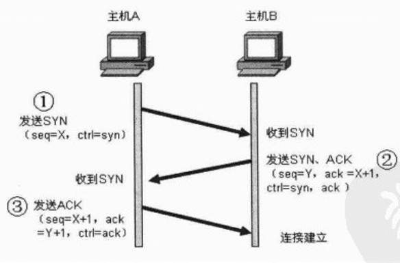

#### 📊 连接管理流程

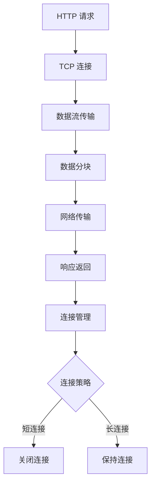

### 🏗️ 端口管理

在任意时刻计算机都可以有几条 TCP 连接处于打开状态。TCP 是通过端口号来保持所有这些连接的正确运行。

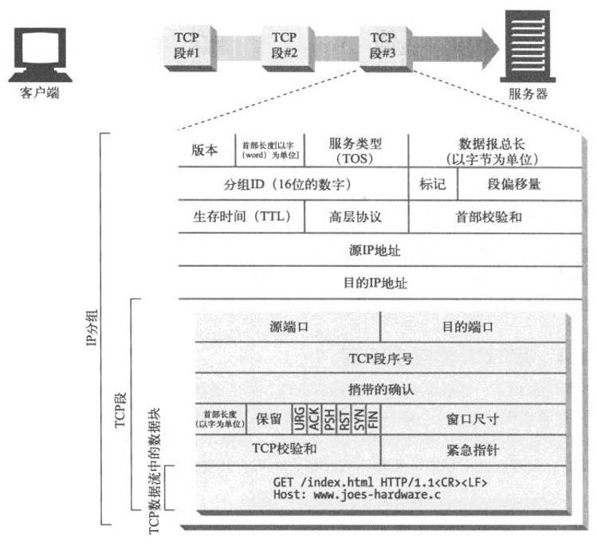

#### 📋 端口分配表

| 端口类型 | 端口范围 | 用途 | 示例 |
|---------|----------|------|------|
| **知名端口** | 0-1023 | 系统服务 | 80(HTTP), 443(HTTPS) |
| **注册端口** | 1024-49151 | 用户程序 | 3000(开发服务器) |
| **动态端口** | 49152-65535 | 客户端连接 | 临时分配 |

## 🔄 HTTP 短连接

### 📖 短连接概述

HTTP 最早期的模型和 HTTP/1.0 的默认模型，是短连接。每一个 HTTP 请求都由它自己独立的连接完成；这意味着发起每一个 HTTP 请求之前都会有一次 TCP 握手，而且是连续不断的。

### ⚡ 短连接特点

| 特点 | 描述 | 影响 |
|------|------|------|
| **独立连接** | 每个请求使用独立连接 | 🔄 确保请求隔离 |
| **TCP 握手** | 每次都需要三次握手 | ⏱️ 增加延迟开销 |
| **连接关闭** | 请求完成后立即关闭 | 💾 减少资源占用 |
| **性能影响** | 频繁建立/断开连接 | 📉 降低整体性能 |

### 🔧 短连接配置

```javascript
// 客户端配置短连接
const fetchWithShortConnection = async (url) => {
  try {
    const response = await fetch(url, {
      headers: {
        'Connection': 'close'  // 强制短连接
      }
    });
    return await response.json();
  } catch (error) {
    console.error('短连接请求失败:', error);
  }
};

// 服务器端处理短连接
app.use((req, res, next) => {
  // 设置短连接响应头
  res.setHeader('Connection', 'close');
  next();
});
```

::: warning ⚠️ 性能警告
TCP 协议握手本身就是耗费时间的，所以 TCP 可以保持更多的热连接来适应负载。短连接破坏了 TCP 具备的能力，并且新的冷连接降低了其性能。
:::

## 🔗 HTTP 长连接

### 🚀 长连接优势

短连接有两个比较大的问题：创建新连接耗费的时间尤为明显，另外 TCP 连接的性能只有在该连接被使用一段时间后（热连接）才能得到改善。为了缓解这些问题，长连接的概念便被设计出来了。

### 📊 长连接特性对比

| 特性 | 短连接 | 长连接 |
|------|--------|--------|
| **连接复用** | ❌ 无法复用 | ✅ 可以复用 |
| **握手开销** | 🔴 每次都需要 | 🟢 只需一次 |
| **资源占用** | 🟢 占用较少 | 🔴 持续占用 |
| **性能表现** | 📉 较差 | 📈 较好 |
| **适用场景** | 简单请求 | 频繁请求 |

### 🔧 长连接配置

```javascript
// HTTP/1.1 长连接配置
const httpAgent = new http.Agent({
  keepAlive: true,
  keepAliveMsecs: 1000,
  maxSockets: 50,
  maxFreeSockets: 10,
  timeout: 60000,
  freeSocketTimeout: 30000
});

// 使用长连接的请求
const makeKeepAliveRequest = async (url) => {
  const response = await fetch(url, {
    headers: {
      'Connection': 'keep-alive',
      'Keep-Alive': 'timeout=5, max=1000'
    }
  });
  return response;
};

// 服务器端长连接配置
app.use((req, res, next) => {
  // 设置长连接
  res.setHeader('Connection', 'keep-alive');
  res.setHeader('Keep-Alive', 'timeout=5, max=1000');
  next();
});
```

### ⚠️ 长连接注意事项

::: danger 🚨 潜在风险
长连接也还是有缺点的；就算是在空闲状态，它还是会消耗服务器资源，而且在重负载时，还有可能遭受 DoS 攻击。这种场景下，可以使用非长连接，即尽快关闭那些空闲的连接，也能对性能有所提升。
:::

### 📈 版本对比

| HTTP 版本 | 默认连接类型 | 配置方式 |
|-----------|-------------|----------|
| **HTTP/1.0** | 短连接 | `Connection: keep-alive` 启用长连接 |
| **HTTP/1.1** | 长连接 | `Connection: close` 启用短连接 |
| **HTTP/2** | 多路复用 | 默认支持，无需配置 |

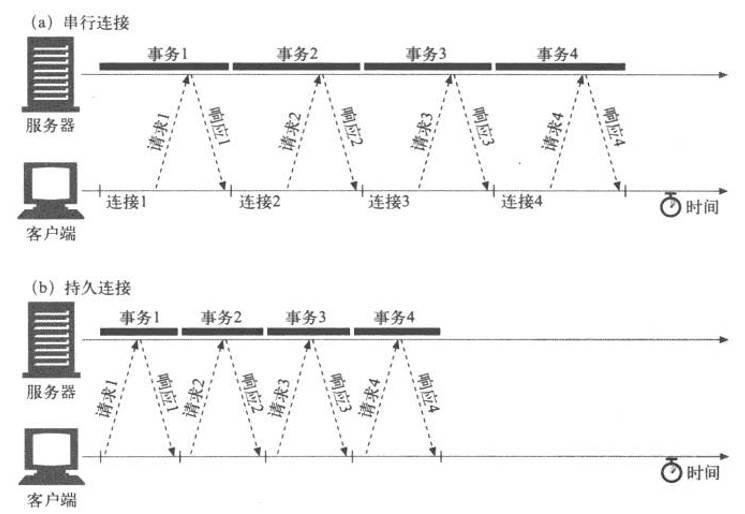

## 🚀 HTTP 流水线

### 📖 流水线概述

默认情况下，HTTP 请求是按顺序发出的。下一个请求只有在当前请求收到响应过后才会被发出。由于会受到网络延迟和带宽的限制，在下一个请求被发送到服务器之前，可能需要等待很长时间。

### ⚡ 流水线优势

流水线是在同一条长连接上发出连续的请求，而不用等待应答返回。这样可以避免连接延迟。理论上讲，性能还会因为两个 HTTP 请求有可能被打包到一个 TCP 消息包中而得到提升。

### 🔍 流水线特性

| 特性 | 描述 | 优势 |
|------|------|------|
| **并发请求** | 同时发送多个请求 | 🚀 减少等待时间 |
| **连接复用** | 使用同一个连接 | 💾 节省资源 |
| **数据打包** | 请求可能被打包传输 | 📈 提升传输效率 |
| **方法限制** | 仅支持幂等方法 | 🔒 保证安全性 |

### 🛡️ 流水线限制

::: info 📋 支持的方法
并不是所有类型的 HTTP 请求都能用到流水线：只有幂等方式，比如 GET、HEAD、PUT 和 DELETE 能够被安全地重试。如果有故障发生时，流水线的内容要能被轻易的重试。
:::

### 📊 连接方式对比

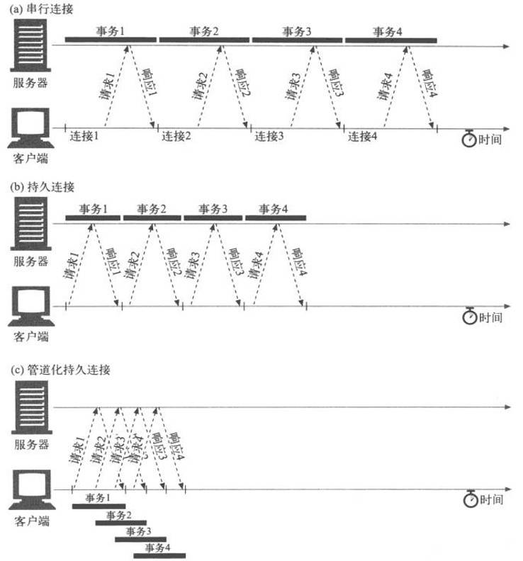


### 🔧 流水线实现

```javascript
// 模拟流水线请求
class HTTPPipeline {
  constructor(baseURL) {
    this.baseURL = baseURL;
    this.requestQueue = [];
    this.processing = false;
  }

  // 添加请求到管道
  addRequest(path, options = {}) {
    return new Promise((resolve, reject) => {
      this.requestQueue.push({
        path,
        options,
        resolve,
        reject,
        timestamp: Date.now()
      });
      
      if (!this.processing) {
        this.processQueue();
      }
    });
  }

  // 处理请求队列
  async processQueue() {
    if (this.requestQueue.length === 0) {
      this.processing = false;
      return;
    }

    this.processing = true;
    const batch = this.requestQueue.splice(0, 3); // 批量处理3个请求

    try {
      // 并发发送请求
      const promises = batch.map(request => 
        fetch(`${this.baseURL}${request.path}`, request.options)
      );

      const responses = await Promise.all(promises);
      
      // 处理响应
      batch.forEach((request, index) => {
        request.resolve(responses[index]);
      });

    } catch (error) {
      // 处理错误
      batch.forEach(request => {
        request.reject(error);
      });
    }

    // 继续处理剩余请求
    setTimeout(() => this.processQueue(), 0);
  }
}

// 使用示例
const pipeline = new HTTPPipeline('https://api.example.com');

// 添加多个请求
pipeline.addRequest('/user/1');
pipeline.addRequest('/user/2');
pipeline.addRequest('/user/3');
```

## 🔄 HTTP/1.1 协议升级机制

### 📖 升级概述

客户端使用 Upgrade 标头字段请求服务器，以降序优先的顺序切换到其中列出的一个协议。

### 🔧 升级流程

因为 Upgrade 是一个逐跳（Hop-by-hop）标头，它还需要在 Connection 标头字段中列出。

```http
GET /index.html HTTP/1.1
Host: www.example.com
Connection: upgrade
Upgrade: example/1, foo/2
```

### 🚀 WebSocket 升级示例

```javascript
// 客户端 WebSocket 升级
const upgradeToWebSocket = (url) => {
  return new Promise((resolve, reject) => {
    const ws = new WebSocket(url);
    
    ws.onopen = () => {
      console.log('WebSocket 连接已建立');
      resolve(ws);
    };
    
    ws.onerror = (error) => {
      console.error('WebSocket 升级失败:', error);
      reject(error);
    };
  });
};

// 服务器端升级处理
app.get('/websocket', (req, res) => {
  const isUpgrade = req.headers.upgrade === 'websocket';
  const isConnection = req.headers.connection.includes('upgrade');
  
  if (isUpgrade && isConnection) {
    // 返回 101 切换协议
    res.writeHead(101, {
      'Upgrade': 'websocket',
      'Connection': 'Upgrade',
      'Sec-WebSocket-Accept': generateWebSocketKey(req.headers['sec-websocket-key'])
    });
    // 升级到 WebSocket 协议
    handleWebSocketUpgrade(req, res);
  } else {
    // 正常 HTTP 响应
    res.status(200).json({ message: 'HTTP endpoint' });
  }
});
```

### 📊 升级状态码

| 状态码 | 描述 | 使用场景 |
|--------|------|----------|
| **101** | Switching Protocols | ✅ 成功升级 |
| **200** | OK | 🔄 拒绝升级，正常响应 |
| **426** | Upgrade Required | 📋 要求升级 |

::: tip 💡 升级特性
如果服务器决定升级这次连接，就会返回一个 101 Switching Protocols 响应状态码，和一个要切换到的协议的标头字段 Upgrade。在发送 101 状态码之后，服务器可以使用新协议，并根据需要执行任何额外的特定于协议的握手。
:::

## 🌟 HTTP/1.1 标准化协议

### 📈 改进特性

HTTP/1.1 消除了大量歧义内容并引入了多项改进：

#### ✨ 主要改进

| 改进特性 | 描述 | 优势 |
|----------|------|------|
| **连接复用** | 连接可以复用 | ⏱️ 节省连接时间 |
| **管线化技术** | 并发发送请求 | 🚀 降低通信延迟 |
| **响应分块** | 支持 chunked 编码 | 📊 流式传输 |
| **缓存控制** | 增强缓存机制 | 💾 提升性能 |
| **内容协商** | 协商最佳内容 | 🎯 优化用户体验 |
| **Host 标头** | 支持虚拟主机 | 🏠 资源共享 |

### 🔧 HTTP/1.1 示例

```http
GET /zh-CN/docs/Glossary/CORS-safelisted_request_header HTTP/1.1
Host: developer.mozilla.org
User-Agent: Mozilla/5.0 (Macintosh; Intel Mac OS X 10.9; rv:50.0) Gecko/20100101 Firefox/50.0
Accept: text/html,application/xhtml+xml,application/xml;q=0.9,*/*;q=0.8
Accept-Language: zh-CN,zh;q=0.9
Accept-Encoding: gzip, deflate, br
Referer: https://developer.mozilla.org/zh-CN/docs/Glossary/CORS-safelisted_request_header

200 OK
Connection: Keep-Alive
Content-Encoding: gzip
Content-Type: text/html; charset=utf-8
Date: Wed, 20 Jul 2016 10:55:30 GMT
Etag: "547fa7e369ef56031dd3bff2ace9fc0832eb251a"
Keep-Alive: timeout=5, max=1000
Last-Modified: Tue, 19 Jul 2016 00:59:33 GMT
Server: Apache
Transfer-Encoding: chunked
Vary: Cookie, Accept-Encoding

(content)
```

## 🚀 HTTP/2 - 更优异的表现

### 📊 发展背景

这些年来，网页愈渐变得复杂，甚至演变成了独有的应用。HTTP/1.1 链接需要请求以正确的顺序发送，理论上可以用一些并行的链接，但带来的成本和复杂性堪忧。

### 🔧 HTTP/2 核心改进

| 改进特性 | HTTP/1.1 | HTTP/2 |
|----------|----------|--------|
| **协议格式** | 文本协议 | 二进制协议 |
| **连接方式** | 串行/管线化 | 多路复用 |
| **头部处理** | 重复传输 | 头部压缩 |
| **服务器推送** | 不支持 | 支持推送 |

### 🎯 HTTP/2 技术优势

#### 🔥 多路复用
- **并行处理**: 同一连接处理多个请求
- **消除阻塞**: 移除了 HTTP/1.x 中顺序和阻塞的约束
- **资源复用**: 更高效的连接利用

#### 📦 头部压缩
- **HPACK 算法**: 专门的头部压缩算法
- **重复消除**: 移除了重复和传输重复数据的成本
- **性能提升**: 显著减少头部开销

#### 🚀 服务器推送
- **主动推送**: 服务器主动推送资源
- **缓存预填**: 在客户端缓存中填充数据
- **性能优化**: 提前获取所需资源

### 🔧 HTTP/2 实现示例

```javascript
// Node.js HTTP/2 服务器
const http2 = require('http2');
const fs = require('fs');

const server = http2.createSecureServer({
  key: fs.readFileSync('server-key.pem'),
  cert: fs.readFileSync('server-cert.pem')
});

server.on('stream', (stream, headers) => {
  const path = headers[':path'];
  
  // 服务器推送示例
  if (path === '/') {
    // 推送 CSS 文件
    stream.pushStream({
      ':path': '/styles.css',
      ':method': 'GET'
    }, (err, pushStream) => {
      if (!err) {
        pushStream.respond({
          ':status': 200,
          'content-type': 'text/css'
        });
        pushStream.end(fs.readFileSync('styles.css'));
      }
    });
    
    // 推送 JavaScript 文件
    stream.pushStream({
      ':path': '/script.js',
      ':method': 'GET'
    }, (err, pushStream) => {
      if (!err) {
        pushStream.respond({
          ':status': 200,
          'content-type': 'application/javascript'
        });
        pushStream.end(fs.readFileSync('script.js'));
      }
    });
  }
  
  // 响应主要内容
  stream.respond({
    ':status': 200,
    'content-type': 'text/html'
  });
  stream.end('<html><body><h1>HTTP/2 Server</h1></body></html>');
});

server.listen(443, () => {
  console.log('HTTP/2 服务器运行在 https://localhost:443');
});
```

## 🌐 HTTP/3 - 基于 QUIC 的 HTTP

### 🚀 QUIC 协议优势

HTTP/3 有着与 HTTP 早期版本的相同语义，但在传输层部分使用 QUIC 而不是 TCP。

### 📊 HTTP/3 特性

| 特性 | HTTP/2 | HTTP/3 |
|------|--------|--------|
| **传输协议** | TCP | QUIC/UDP |
| **连接延迟** | 较高 | 更低 |
| **多路复用** | 单 TCP 连接 | 多个独立流 |
| **数据恢复** | 全局阻塞 | 流级别恢复 |

### 🔧 HTTP/3 优势

::: tip 🎯 性能提升
QUIC 旨在为 HTTP 连接设计更低的延迟。类似于 HTTP/2，它是一个多路复用协议，但是 HTTP/2 通过单个 TCP 连接运行，所以在 TCP 层处理的数据包丢失检测和重传可以阻止所有流。QUIC 通过 UDP 运行多个流，并为每个流独立实现数据包丢失检测和重传。
:::

## 🔐 HTTP 认证

### 🔒 基本认证（Basic Authentication）

在基本认证中，Web 服务器可以拒绝一个事务，质询客户端，请用户提供有效的用户名和密码。

#### 🔧 基本认证流程


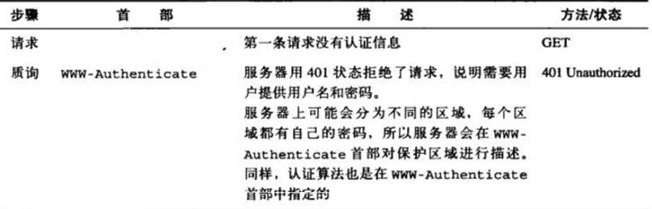

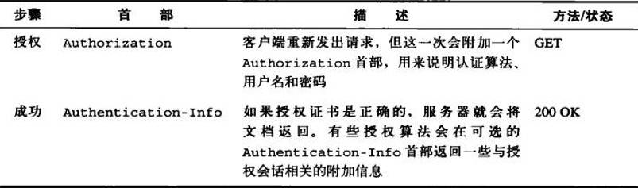

#### 🔧 基本认证实现

```javascript
// 客户端基本认证
const basicAuth = (username, password) => {
  const credentials = btoa(`${username}:${password}`);
  return `Basic ${credentials}`;
};

// 发送认证请求
const authenticatedRequest = async (url, username, password) => {
  const response = await fetch(url, {
    headers: {
      'Authorization': basicAuth(username, password)
    }
  });
  
  if (response.status === 401) {
    throw new Error('认证失败');
  }
  
  return response.json();
};

// 服务器端基本认证
app.use((req, res, next) => {
  const auth = req.headers.authorization;
  
  if (!auth || !auth.startsWith('Basic ')) {
    res.setHeader('WWW-Authenticate', 'Basic realm="Secure Area"');
    return res.status(401).json({ error: '需要认证' });
  }
  
  const credentials = Buffer.from(auth.slice(6), 'base64').toString();
  const [username, password] = credentials.split(':');
  
  if (validateCredentials(username, password)) {
    next();
  } else {
    res.status(401).json({ error: '认证失败' });
  }
});
```

#### 📊 认证过程

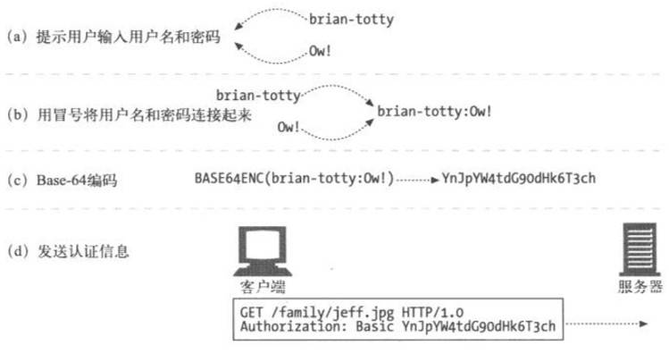

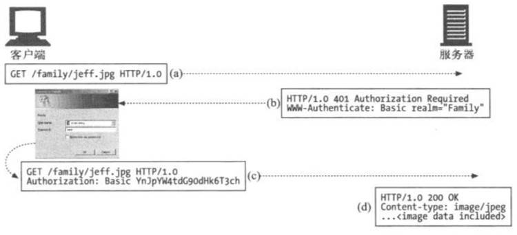

### 🔐 摘要认证（Digest Authentication）

基本认证中，用户名和密码都是以明文形式传送的，也没有采取任何措施防止对报文的篡改。安全使用基本认证的唯一方式就是将其与 SSL 配合使用。

#### ✨ 摘要认证优势

| 安全特性 | 基本认证 | 摘要认证 |
|----------|----------|----------|
| **密码传输** | 明文传输 | 摘要传输 |
| **重放攻击** | 易受攻击 | 有效防护 |
| **报文完整性** | 无保护 | 可选保护 |
| **安全等级** | 较低 | 较高 |

#### 🔧 摘要认证实现

```javascript
// 摘要认证实现
const crypto = require('crypto');

class DigestAuth {
  constructor() {
    this.realm = 'Secure Area';
    this.users = new Map([
      ['admin', 'password123'],
      ['user', 'userpass']
    ]);
  }

  generateNonce() {
    return crypto.randomBytes(16).toString('hex');
  }

  generateDigest(username, password, nonce, method, uri) {
    const ha1 = crypto.createHash('md5')
      .update(`${username}:${this.realm}:${password}`)
      .digest('hex');
    
    const ha2 = crypto.createHash('md5')
      .update(`${method}:${uri}`)
      .digest('hex');
    
    return crypto.createHash('md5')
      .update(`${ha1}:${nonce}:${ha2}`)
      .digest('hex');
  }

  challengeResponse(req, res) {
    const nonce = this.generateNonce();
    const challenge = `Digest realm="${this.realm}", nonce="${nonce}", qop="auth"`;
    
    res.setHeader('WWW-Authenticate', challenge);
    res.status(401).json({ error: '需要摘要认证' });
  }

  validateDigest(authHeader, method, uri) {
    const authData = this.parseAuthHeader(authHeader);
    const { username, nonce, response } = authData;
    
    const password = this.users.get(username);
    if (!password) return false;
    
    const expectedDigest = this.generateDigest(username, password, nonce, method, uri);
    return expectedDigest === response;
  }

  parseAuthHeader(authHeader) {
    const parts = {};
    const regex = /(\w+)="([^"]+)"/g;
    let match;
    
    while ((match = regex.exec(authHeader)) !== null) {
      parts[match[1]] = match[2];
    }
    
    return parts;
  }
}

// 使用摘要认证中间件
const digestAuth = new DigestAuth();

app.use('/secure', (req, res, next) => {
  const authHeader = req.headers.authorization;
  
  if (!authHeader || !authHeader.startsWith('Digest ')) {
    return digestAuth.challengeResponse(req, res);
  }
  
  if (digestAuth.validateDigest(authHeader, req.method, req.url)) {
    next();
  } else {
    res.status(401).json({ error: '摘要认证失败' });
  }
});
```

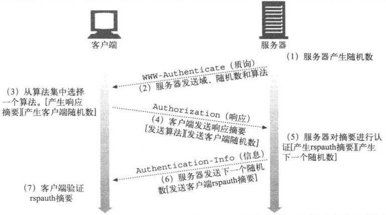

### 🔍 认证方式对比

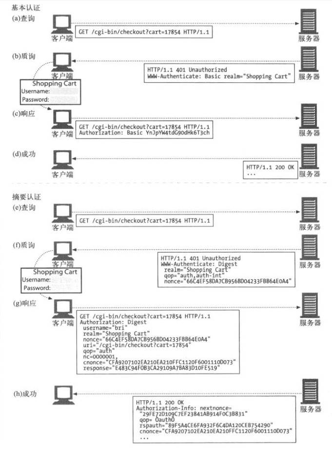

## 🛠️ 连接优化最佳实践

### 📈 性能优化策略

#### 🔧 连接池管理

```javascript
// 连接池配置
const connectionPool = {
  maxConnections: 50,
  maxIdleTime: 30000,
  keepAlive: true,
  timeout: 60000
};

// HTTP 代理配置
const httpAgent = new http.Agent({
  keepAlive: true,
  keepAliveMsecs: 1000,
  maxSockets: connectionPool.maxConnections,
  maxFreeSockets: 10,
  timeout: connectionPool.timeout,
  freeSocketTimeout: connectionPool.maxIdleTime
});

// HTTPS 代理配置
const httpsAgent = new https.Agent({
  keepAlive: true,
  keepAliveMsecs: 1000,
  maxSockets: connectionPool.maxConnections,
  maxFreeSockets: 10,
  timeout: connectionPool.timeout,
  freeSocketTimeout: connectionPool.maxIdleTime
});
```

#### 📊 连接监控

```javascript
// 连接状态监控
class ConnectionMonitor {
  constructor() {
    this.connections = new Map();
    this.stats = {
      active: 0,
      idle: 0,
      total: 0,
      errors: 0
    };
  }

  trackConnection(connectionId) {
    this.connections.set(connectionId, {
      startTime: Date.now(),
      status: 'active',
      requests: 0
    });
    this.stats.active++;
    this.stats.total++;
  }

  updateConnectionStatus(connectionId, status) {
    const connection = this.connections.get(connectionId);
    if (connection) {
      if (connection.status === 'active' && status === 'idle') {
        this.stats.active--;
        this.stats.idle++;
      } else if (connection.status === 'idle' && status === 'active') {
        this.stats.idle--;
        this.stats.active++;
      }
      connection.status = status;
    }
  }

  getConnectionStats() {
    return {
      ...this.stats,
      avgDuration: this.calculateAverageConnectionDuration()
    };
  }

  calculateAverageConnectionDuration() {
    const now = Date.now();
    let totalDuration = 0;
    let count = 0;

    this.connections.forEach(connection => {
      totalDuration += now - connection.startTime;
      count++;
    });

    return count > 0 ? totalDuration / count : 0;
  }
}
```

### 🎯 性能优化建议

| 优化策略 | 适用场景 | 实施建议 |
|----------|----------|----------|
| **连接复用** | 频繁请求 | 🔄 启用 Keep-Alive |
| **连接池** | 高并发 | 🏊 合理配置池大小 |
| **超时设置** | 所有场景 | ⏰ 设置合适超时 |
| **错误重试** | 不稳定网络 | 🔄 指数退避重试 |
| **监控告警** | 生产环境 | 📊 实时监控连接状态 |

## 🔍 故障排除

### 🛠️ 常见连接问题

#### ❌ 连接超时

```javascript
// 连接超时处理
const requestWithTimeout = async (url, timeoutMs = 5000) => {
  const controller = new AbortController();
  const timeoutId = setTimeout(() => controller.abort(), timeoutMs);
  
  try {
    const response = await fetch(url, {
      signal: controller.signal,
      headers: {
        'Connection': 'keep-alive'
      }
    });
    
    clearTimeout(timeoutId);
    return response;
  } catch (error) {
    clearTimeout(timeoutId);
    
    if (error.name === 'AbortError') {
      throw new Error(`请求超时：${timeoutMs}ms`);
    }
    throw error;
  }
};
```

#### 🔄 连接重试机制

```javascript
// 指数退避重试
class RetryManager {
  constructor(options = {}) {
    this.maxRetries = options.maxRetries || 3;
    this.baseDelay = options.baseDelay || 1000;
    this.maxDelay = options.maxDelay || 10000;
  }

  async retry(fn, ...args) {
    let lastError;
    
    for (let attempt = 0; attempt <= this.maxRetries; attempt++) {
      try {
        return await fn(...args);
      } catch (error) {
        lastError = error;
        
        if (attempt === this.maxRetries) {
          break;
        }
        
        const delay = Math.min(
          this.baseDelay * Math.pow(2, attempt),
          this.maxDelay
        );
        
        console.log(`请求失败，${delay}ms 后重试 (${attempt + 1}/${this.maxRetries})`);
        await new Promise(resolve => setTimeout(resolve, delay));
      }
    }
    
    throw lastError;
  }
}

// 使用重试管理器
const retryManager = new RetryManager({
  maxRetries: 3,
  baseDelay: 1000,
  maxDelay: 5000
});

const reliableRequest = async (url) => {
  return retryManager.retry(async () => {
    const response = await fetch(url);
    if (!response.ok) {
      throw new Error(`HTTP ${response.status}: ${response.statusText}`);
    }
    return response;
  });
};
```

## 📚 参考资源

### 📖 官方文档
- [HTTP/1.1 RFC 7230](https://tools.ietf.org/html/rfc7230)
- [HTTP/2 RFC 7540](https://tools.ietf.org/html/rfc7540)
- [HTTP/3 RFC 9114](https://tools.ietf.org/html/rfc9114)

### 🛠️ 实用工具
- [curl](https://curl.se/) - 命令行 HTTP 客户端
- [httpie](https://httpie.io/) - 现代 HTTP 客户端
- [Wireshark](https://www.wireshark.org/) - 网络协议分析器

### 📊 性能测试
- [Apache Bench](https://httpd.apache.org/docs/2.4/programs/ab.html)
- [wrk](https://github.com/wg/wrk)
- [Artillery](https://artillery.io/)

::: tip 💡 学习建议
深入理解 HTTP 连接管理对于构建高性能 Web 应用至关重要。建议结合实际项目需求，选择合适的连接策略和优化方案。
:::
