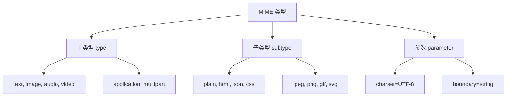

# 📄 MIME 类型完全指南

> MIME（Multipurpose Internet Mail Extensions）类型是一种标准化的方式来表示文档、文件或字节流的性质和格式。它在 Web 技术中扮演着关键角色，帮助浏览器正确识别和处理各种类型的内容。

## 🎯 MIME 类型概述

### 📊 核心作用

| 作用 | 描述 | 重要性 |
|------|------|--------|
| **内容识别** | 告诉浏览器内容的类型 | 🎯 正确解析和渲染 |
| **处理方式** | 决定如何处理内容 | 🔧 选择适当的处理程序 |
| **安全保护** | 防止内容类型混淆攻击 | 🛡️ 提高网站安全性 |
| **性能优化** | 启用适当的缓存策略 | ⚡ 提升加载速度 |

### 🏗️ MIME 类型结构

```
type/subtype;parameter=value
```

#### 📋 结构组成



### 🔧 示例解析

| MIME 类型 | 主类型 | 子类型 | 参数 | 用途 |
|-----------|--------|--------|------|------|
| `text/html` | text | html | - | HTML 文档 |
| `text/plain; charset=UTF-8` | text | plain | charset=UTF-8 | UTF-8 编码的纯文本 |
| `image/jpeg` | image | jpeg | - | JPEG 图像 |
| `application/json` | application | json | - | JSON 数据 |
| `multipart/form-data; boundary=---` | multipart | form-data | boundary=--- | 表单数据 |

::: tip 💡 重要提醒
浏览器通常使用 MIME 类型而不是文件扩展名来决定如何处理内容。因此，Web 服务器必须在 `Content-Type` 响应头中正确设置 MIME 类型。
:::

## 🗂️ 主类型分类

### 📄 独立类型

#### 📝 text - 文本类型

| 子类型 | 描述 | 用途 | 示例 |
|--------|------|------|------|
| **plain** | 纯文本 | 📋 文本文档 | `text/plain` |
| **html** | HTML 文档 | 🌐 网页内容 | `text/html` |
| **css** | 样式表 | 🎨 网页样式 | `text/css` |
| **javascript** | JavaScript 代码 | ⚡ 脚本文件 | `text/javascript` |
| **csv** | 逗号分隔值 | 📊 数据表格 | `text/csv` |
| **xml** | XML 文档 | 📋 结构化数据 | `text/xml` |

```javascript
// 常见 text 类型处理
const textTypes = {
  'text/plain': (content) => {
    // 处理纯文本
    return content.replace(/\n/g, '<br>');
  },
  
  'text/html': (content) => {
    // 处理 HTML 内容
    return content; // 直接插入 DOM
  },
  
  'text/css': (content) => {
    // 处理 CSS 样式
    const style = document.createElement('style');
    style.textContent = content;
    document.head.appendChild(style);
  },
  
  'text/javascript': (content) => {
    // 处理 JavaScript 代码
    const script = document.createElement('script');
    script.textContent = content;
    document.head.appendChild(script);
  }
};
```

#### 🖼️ image - 图像类型

| 子类型 | 描述 | 特点 | 支持度 |
|--------|------|------|--------|
| **jpeg** | JPEG 图像 | 📸 有损压缩，适合照片 | 🟢 完全支持 |
| **png** | PNG 图像 | 🎨 无损压缩，支持透明 | 🟢 完全支持 |
| **gif** | GIF 图像 | 🎞️ 支持动画 | 🟢 完全支持 |
| **webp** | WebP 图像 | 🚀 现代格式，高压缩比 | 🟡 现代浏览器 |
| **svg+xml** | SVG 矢量图 | 📐 可缩放矢量图形 | 🟢 完全支持 |
| **avif** | AVIF 图像 | 🎯 次世代格式 | 🟡 部分支持 |

```javascript
// 图像类型检测和处理
class ImageHandler {
  static supportedTypes = [
    'image/jpeg',
    'image/png',
    'image/gif',
    'image/webp',
    'image/svg+xml',
    'image/avif'
  ];
  
  static checkSupport(mimeType) {
    return this.supportedTypes.includes(mimeType);
  }
  
  static async loadImage(url, mimeType) {
    if (!this.checkSupport(mimeType)) {
      throw new Error(`不支持的图像类型: ${mimeType}`);
    }
    
    return new Promise((resolve, reject) => {
      const img = new Image();
      img.onload = () => resolve(img);
      img.onerror = () => reject(new Error('图像加载失败'));
      img.src = url;
    });
  }
  
  static getOptimalFormat(originalType, hasTransparency = false) {
    // 根据特性选择最优格式
    if (hasTransparency) {
      return 'image/png';
    }
    
    // 现代浏览器优先使用 WebP
    if (this.supportsWebP()) {
      return 'image/webp';
    }
    
    return originalType === 'image/png' ? 'image/png' : 'image/jpeg';
  }
  
  static supportsWebP() {
    const canvas = document.createElement('canvas');
    return canvas.toDataURL('image/webp').indexOf('data:image/webp') === 0;
  }
}
```

#### 🎵 audio - 音频类型

| 子类型 | 描述 | 特点 | 兼容性 |
|--------|------|------|--------|
| **mpeg** | MP3 音频 | 🎵 广泛支持 | 🟢 完全支持 |
| **wav** | WAV 音频 | 🎶 无损格式 | 🟢 完全支持 |
| **ogg** | OGG 音频 | 🎼 开源格式 | 🟡 部分支持 |
| **mp4** | MP4 音频 | 🎧 现代格式 | 🟢 完全支持 |
| **webm** | WebM 音频 | 🔊 Web 优化 | 🟡 现代浏览器 |

#### 🎬 video - 视频类型

| 子类型 | 描述 | 特点 | 兼容性 |
|--------|------|------|--------|
| **mp4** | MP4 视频 | 🎬 H.264 编码 | 🟢 完全支持 |
| **webm** | WebM 视频 | 🎥 VP8/VP9 编码 | 🟡 现代浏览器 |
| **ogg** | OGG 视频 | 📹 开源格式 | 🟡 部分支持 |
| **avi** | AVI 视频 | 🎞️ 传统格式 | 🔴 有限支持 |

#### 🔧 application - 应用类型

| 子类型 | 描述 | 用途 | 处理方式 |
|--------|------|------|----------|
| **json** | JSON 数据 | 📊 API 数据交换 | 解析为对象 |
| **xml** | XML 数据 | 📋 结构化数据 | DOM 解析 |
| **pdf** | PDF 文档 | 📄 文档显示 | 插件或下载 |
| **zip** | ZIP 压缩包 | 📦 文件压缩 | 下载 |
| **octet-stream** | 二进制数据 | 💾 未知格式 | 下载 |

```javascript
// Application 类型处理
class ApplicationHandler {
  static handlers = {
    'application/json': (data) => {
      try {
        return JSON.parse(data);
      } catch (e) {
        throw new Error('JSON 解析失败');
      }
    },
    
    'application/xml': (data) => {
      try {
        const parser = new DOMParser();
        return parser.parseFromString(data, 'text/xml');
      } catch (e) {
        throw new Error('XML 解析失败');
      }
    },
    
    'application/pdf': (data) => {
      // 创建 PDF 预览或下载链接
      const blob = new Blob([data], { type: 'application/pdf' });
      const url = URL.createObjectURL(blob);
      
      const iframe = document.createElement('iframe');
      iframe.src = url;
      iframe.width = '100%';
      iframe.height = '600px';
      return iframe;
    },
    
    'application/octet-stream': (data, filename) => {
      // 创建下载链接
      const blob = new Blob([data], { type: 'application/octet-stream' });
      const url = URL.createObjectURL(blob);
      
      const a = document.createElement('a');
      a.href = url;
      a.download = filename || 'unknown-file';
      a.click();
      
      URL.revokeObjectURL(url);
    }
  };
  
  static process(mimeType, data, filename) {
    const handler = this.handlers[mimeType];
    if (handler) {
      return handler(data, filename);
    } else {
      console.warn(`未知的应用类型: ${mimeType}`);
      return this.handlers['application/octet-stream'](data, filename);
    }
  }
}
```

### 📦 多部分类型

#### 📝 multipart - 多部分内容

| 子类型 | 描述 | 用途 | 结构 |
|--------|------|------|------|
| **form-data** | 表单数据 | 📋 文件上传 | 边界分隔 |
| **byteranges** | 字节范围 | 🔄 部分内容 | 范围标识 |
| **mixed** | 混合内容 | 📧 邮件附件 | 多种类型 |

```javascript
// 多部分表单数据处理
class MultipartHandler {
  static parseFormData(content, boundary) {
    const parts = content.split(`--${boundary}`);
    const result = {};
    
    parts.forEach(part => {
      if (part.trim() === '' || part.includes('--')) return;
      
      const [headers, body] = part.split('\r\n\r\n');
      const nameMatch = headers.match(/name="([^"]+)"/);
      const filenameMatch = headers.match(/filename="([^"]+)"/);
      
      if (nameMatch) {
        const name = nameMatch[1];
        result[name] = {
          value: body.trim(),
          filename: filenameMatch ? filenameMatch[1] : null,
          headers: headers
        };
      }
    });
    
    return result;
  }
  
  static createFormData(data) {
    const boundary = `----formdata-${Date.now()}`;
    let content = '';
    
    Object.entries(data).forEach(([key, value]) => {
      content += `--${boundary}\r\n`;
      content += `Content-Disposition: form-data; name="${key}"`;
      
      if (value.filename) {
        content += `; filename="${value.filename}"\r\n`;
        content += `Content-Type: ${value.type || 'application/octet-stream'}\r\n`;
      }
      
      content += '\r\n';
      content += value.data || value;
      content += '\r\n';
    });
    
    content += `--${boundary}--`;
    
    return {
      content,
      contentType: `multipart/form-data; boundary=${boundary}`
    };
  }
}

// 使用示例
const formData = {
  username: 'john_doe',
  avatar: {
    filename: 'avatar.jpg',
    type: 'image/jpeg',
    data: '...' // 文件二进制数据
  }
};

const { content, contentType } = MultipartHandler.createFormData(formData);
```

## 🌐 Web 相关重要类型

### 📄 核心 Web 类型

```javascript
// Web 核心 MIME 类型定义
const WEB_CORE_TYPES = {
  // 文档类型
  'text/html': {
    description: 'HTML 文档',
    extensions: ['.html', '.htm'],
    processing: 'parse-as-html',
    cacheable: true
  },
  
  'text/css': {
    description: 'CSS 样式表',
    extensions: ['.css'],
    processing: 'parse-as-css',
    cacheable: true,
    critical: true // 关键资源
  },
  
  'text/javascript': {
    description: 'JavaScript 代码',
    extensions: ['.js', '.mjs'],
    processing: 'execute-as-script',
    cacheable: true,
    critical: true
  },
  
  // 数据类型
  'application/json': {
    description: 'JSON 数据',
    extensions: ['.json'],
    processing: 'parse-as-json',
    cacheable: false
  },
  
  'application/xml': {
    description: 'XML 数据',
    extensions: ['.xml'],
    processing: 'parse-as-xml',
    cacheable: false
  },
  
  // 二进制类型
  'application/octet-stream': {
    description: '二进制数据',
    extensions: [],
    processing: 'download',
    cacheable: false
  }
};

// Web 类型验证器
class WebTypeValidator {
  static validate(mimeType, content) {
    const typeInfo = WEB_CORE_TYPES[mimeType];
    if (!typeInfo) {
      console.warn(`未知的 MIME 类型: ${mimeType}`);
      return false;
    }
    
    switch (typeInfo.processing) {
      case 'parse-as-html':
        return this.validateHTML(content);
      case 'parse-as-css':
        return this.validateCSS(content);
      case 'parse-as-json':
        return this.validateJSON(content);
      case 'parse-as-xml':
        return this.validateXML(content);
      default:
        return true;
    }
  }
  
  static validateHTML(content) {
    // 基本 HTML 验证
    return typeof content === 'string' && 
           (content.includes('<') || content.includes('&'));
  }
  
  static validateCSS(content) {
    // 基本 CSS 验证
    return typeof content === 'string' && 
           (content.includes('{') || content.includes(':'));
  }
  
  static validateJSON(content) {
    try {
      JSON.parse(content);
      return true;
    } catch (e) {
      return false;
    }
  }
  
  static validateXML(content) {
    try {
      const parser = new DOMParser();
      const doc = parser.parseFromString(content, 'text/xml');
      return !doc.querySelector('parsererror');
    } catch (e) {
      return false;
    }
  }
}
```

### 🔧 实际应用场景

#### 📤 文件上传处理

```javascript
// 文件上传 MIME 类型处理
class FileUploadHandler {
  constructor() {
    this.allowedTypes = new Set([
      'image/jpeg',
      'image/png',
      'image/gif',
      'image/webp',
      'application/pdf',
      'text/plain',
      'application/zip'
    ]);
    
    this.maxSizes = {
      'image/jpeg': 5 * 1024 * 1024,  // 5MB
      'image/png': 10 * 1024 * 1024,  // 10MB
      'application/pdf': 20 * 1024 * 1024, // 20MB
      'default': 2 * 1024 * 1024       // 2MB
    };
  }
  
  validateFile(file) {
    const errors = [];
    
    // 检查 MIME 类型
    if (!this.allowedTypes.has(file.type)) {
      errors.push(`不支持的文件类型: ${file.type}`);
    }
    
    // 检查文件大小
    const maxSize = this.maxSizes[file.type] || this.maxSizes.default;
    if (file.size > maxSize) {
      errors.push(`文件大小超过限制: ${file.size} > ${maxSize}`);
    }
    
    // 检查文件扩展名与 MIME 类型是否匹配
    if (!this.validateExtension(file.name, file.type)) {
      errors.push('文件扩展名与类型不匹配');
    }
    
    return {
      valid: errors.length === 0,
      errors
    };
  }
  
  validateExtension(filename, mimeType) {
    const ext = filename.toLowerCase().split('.').pop();
    const typeExtensions = {
      'image/jpeg': ['jpg', 'jpeg'],
      'image/png': ['png'],
      'image/gif': ['gif'],
      'image/webp': ['webp'],
      'application/pdf': ['pdf'],
      'text/plain': ['txt'],
      'application/zip': ['zip']
    };
    
    const validExtensions = typeExtensions[mimeType] || [];
    return validExtensions.includes(ext);
  }
  
  async processFile(file) {
    const validation = this.validateFile(file);
    if (!validation.valid) {
      throw new Error(validation.errors.join(', '));
    }
    
    const result = {
      name: file.name,
      type: file.type,
      size: file.size,
      lastModified: file.lastModified
    };
    
    // 根据类型进行特殊处理
    if (file.type.startsWith('image/')) {
      result.preview = await this.generateImagePreview(file);
      result.dimensions = await this.getImageDimensions(file);
    }
    
    return result;
  }
  
  async generateImagePreview(file) {
    return new Promise((resolve, reject) => {
      const reader = new FileReader();
      reader.onload = (e) => resolve(e.target.result);
      reader.onerror = reject;
      reader.readAsDataURL(file);
    });
  }
  
  async getImageDimensions(file) {
    return new Promise((resolve, reject) => {
      const img = new Image();
      img.onload = () => {
        resolve({ width: img.width, height: img.height });
      };
      img.onerror = reject;
      img.src = URL.createObjectURL(file);
    });
  }
}

// 使用示例
const uploader = new FileUploadHandler();
const fileInput = document.getElementById('fileInput');

fileInput.addEventListener('change', async (event) => {
  const files = Array.from(event.target.files);
  
  for (const file of files) {
    try {
      const result = await uploader.processFile(file);
      console.log('文件处理成功:', result);
    } catch (error) {
      console.error('文件处理失败:', error.message);
    }
  }
});
```

#### 🌐 HTTP 响应处理

```javascript
// HTTP 响应 MIME 类型处理
class ResponseHandler {
  static async handleResponse(response) {
    const contentType = response.headers.get('Content-Type');
    if (!contentType) {
      throw new Error('响应缺少 Content-Type 头部');
    }
    
    // 解析 MIME 类型
    const [mimeType, ...params] = contentType.split(';');
    const parsedParams = this.parseParameters(params);
    
    // 根据 MIME 类型处理响应
    switch (mimeType.trim().toLowerCase()) {
      case 'application/json':
        return await this.handleJSON(response, parsedParams);
      case 'text/html':
        return await this.handleHTML(response, parsedParams);
      case 'text/plain':
        return await this.handleText(response, parsedParams);
      case 'application/octet-stream':
        return await this.handleBinary(response, parsedParams);
      default:
        return await this.handleDefault(response, mimeType);
    }
  }
  
  static parseParameters(params) {
    const result = {};
    params.forEach(param => {
      const [key, value] = param.split('=');
      if (key && value) {
        result[key.trim()] = value.trim().replace(/["']/g, '');
      }
    });
    return result;
  }
  
  static async handleJSON(response, params) {
    const text = await response.text();
    
    try {
      return JSON.parse(text);
    } catch (error) {
      throw new Error(`JSON 解析失败: ${error.message}`);
    }
  }
  
  static async handleHTML(response, params) {
    const html = await response.text();
    const charset = params.charset || 'utf-8';
    
    // 创建 DOM 解析器
    const parser = new DOMParser();
    const doc = parser.parseFromString(html, 'text/html');
    
    return {
      html,
      document: doc,
      charset
    };
  }
  
  static async handleText(response, params) {
    const text = await response.text();
    const charset = params.charset || 'utf-8';
    
    return {
      text,
      charset,
      lines: text.split('\n')
    };
  }
  
  static async handleBinary(response, params) {
    const arrayBuffer = await response.arrayBuffer();
    
    return {
      data: arrayBuffer,
      size: arrayBuffer.byteLength,
      type: 'binary'
    };
  }
  
  static async handleDefault(response, mimeType) {
    console.warn(`未知的 MIME 类型: ${mimeType}`);
    
    // 尝试以文本形式处理
    try {
      const text = await response.text();
      return { text, type: 'unknown' };
    } catch (error) {
      // 如果文本处理失败，以二进制形式处理
      const arrayBuffer = await response.arrayBuffer();
      return { data: arrayBuffer, type: 'binary' };
    }
  }
}

// 使用示例
fetch('/api/data')
  .then(response => ResponseHandler.handleResponse(response))
  .then(result => {
    console.log('响应处理结果:', result);
  })
  .catch(error => {
    console.error('响应处理失败:', error);
  });
```

## 🕵️ MIME 嗅探

### 🔍 嗅探机制

```javascript
// MIME 嗅探实现
class MimeSniffing {
  static magicNumbers = [
    {
      type: 'image/jpeg',
      patterns: [
        [0xFF, 0xD8, 0xFF],  // JPEG 文件头
      ]
    },
    {
      type: 'image/png',
      patterns: [
        [0x89, 0x50, 0x4E, 0x47, 0x0D, 0x0A, 0x1A, 0x0A]  // PNG 文件头
      ]
    },
    {
      type: 'image/gif',
      patterns: [
        [0x47, 0x49, 0x46, 0x38, 0x37, 0x61],  // GIF87a
        [0x47, 0x49, 0x46, 0x38, 0x39, 0x61]   // GIF89a
      ]
    },
    {
      type: 'application/pdf',
      patterns: [
        [0x25, 0x50, 0x44, 0x46]  // %PDF
      ]
    },
    {
      type: 'application/zip',
      patterns: [
        [0x50, 0x4B, 0x03, 0x04],  // PK..
        [0x50, 0x4B, 0x05, 0x06]   // PK..
      ]
    }
  ];
  
  static sniffFromBytes(bytes) {
    const uint8Array = new Uint8Array(bytes);
    
    for (const magic of this.magicNumbers) {
      for (const pattern of magic.patterns) {
        if (this.matchPattern(uint8Array, pattern)) {
          return magic.type;
        }
      }
    }
    
    return null;
  }
  
  static matchPattern(bytes, pattern) {
    if (bytes.length < pattern.length) {
      return false;
    }
    
    for (let i = 0; i < pattern.length; i++) {
      if (bytes[i] !== pattern[i]) {
        return false;
      }
    }
    
    return true;
  }
  
  static async sniffFromFile(file) {
    return new Promise((resolve, reject) => {
      const reader = new FileReader();
      reader.onload = (e) => {
        const detected = this.sniffFromBytes(e.target.result);
        resolve(detected);
      };
      reader.onerror = reject;
      
      // 只读取前 1024 字节进行嗅探
      const blob = file.slice(0, 1024);
      reader.readAsArrayBuffer(blob);
    });
  }
  
  static sniffFromExtension(filename) {
    const ext = filename.toLowerCase().split('.').pop();
    const extensionMap = {
      'jpg': 'image/jpeg',
      'jpeg': 'image/jpeg',
      'png': 'image/png',
      'gif': 'image/gif',
      'webp': 'image/webp',
      'pdf': 'application/pdf',
      'zip': 'application/zip',
      'txt': 'text/plain',
      'html': 'text/html',
      'css': 'text/css',
      'js': 'text/javascript',
      'json': 'application/json',
      'xml': 'application/xml'
    };
    
    return extensionMap[ext] || null;
  }
  
  static async detectMimeType(file) {
    const results = {
      declared: file.type,
      extension: this.sniffFromExtension(file.name),
      magic: await this.sniffFromFile(file)
    };
    
    // 优先级：魔数 > 扩展名 > 声明类型
    const detected = results.magic || results.extension || results.declared;
    
    return {
      detected,
      results,
      consistent: results.declared === detected
    };
  }
}

// 使用示例
const fileInput = document.getElementById('fileInput');
fileInput.addEventListener('change', async (event) => {
  const file = event.target.files[0];
  if (file) {
    const detection = await MimeSniffing.detectMimeType(file);
    console.log('MIME 类型检测结果:', detection);
    
    if (!detection.consistent) {
      console.warn('⚠️ 文件类型不一致，可能存在安全风险');
    }
  }
});
```

### 🛡️ 安全考虑

```javascript
// MIME 嗅探安全检查
class MimeSecurityChecker {
  static dangerousTypes = new Set([
    'application/javascript',
    'text/javascript',
    'application/x-shockwave-flash',
    'application/x-msdownload',
    'application/octet-stream'
  ]);
  
  static safeTypes = new Set([
    'image/jpeg',
    'image/png',
    'image/gif',
    'image/webp',
    'text/plain',
    'application/pdf'
  ]);
  
  static checkFile(file, detectedType) {
    const risks = [];
    
    // 检查类型不一致
    if (file.type !== detectedType) {
      risks.push({
        level: 'warning',
        message: `声明类型 (${file.type}) 与检测类型 (${detectedType}) 不一致`
      });
    }
    
    // 检查危险类型
    if (this.dangerousTypes.has(detectedType)) {
      risks.push({
        level: 'danger',
        message: `检测到危险文件类型: ${detectedType}`
      });
    }
    
    // 检查文件扩展名欺骗
    const expectedExt = this.getExpectedExtension(detectedType);
    const actualExt = file.name.toLowerCase().split('.').pop();
    
    if (expectedExt && actualExt !== expectedExt) {
      risks.push({
        level: 'warning',
        message: `文件扩展名 (.${actualExt}) 与类型 (${detectedType}) 不匹配`
      });
    }
    
    return {
      safe: risks.every(risk => risk.level !== 'danger'),
      risks
    };
  }
  
  static getExpectedExtension(mimeType) {
    const typeExtensions = {
      'image/jpeg': 'jpg',
      'image/png': 'png',
      'image/gif': 'gif',
      'image/webp': 'webp',
      'application/pdf': 'pdf',
      'text/plain': 'txt',
      'text/html': 'html',
      'text/css': 'css',
      'text/javascript': 'js',
      'application/json': 'json'
    };
    
    return typeExtensions[mimeType];
  }
  
  static sanitizeFilename(filename) {
    // 移除危险字符
    return filename
      .replace(/[<>:"/\\|?*]/g, '_')  // 替换特殊字符
      .replace(/\.\./g, '_')          // 防止路径遍历
      .replace(/^\./, '_')            // 防止隐藏文件
      .substring(0, 255);             // 限制长度
  }
}

// 安全的文件处理
async function secureFileHandler(file) {
  try {
    // 1. 检测真实 MIME 类型
    const detection = await MimeSniffing.detectMimeType(file);
    
    // 2. 安全检查
    const security = MimeSecurityChecker.checkFile(file, detection.detected);
    
    // 3. 处理风险
    if (!security.safe) {
      throw new Error('文件存在安全风险，拒绝处理');
    }
    
    if (security.risks.length > 0) {
      console.warn('文件存在潜在风险:', security.risks);
    }
    
    // 4. 净化文件名
    const safeName = MimeSecurityChecker.sanitizeFilename(file.name);
    
    // 5. 创建安全的文件对象
    return {
      originalName: file.name,
      safeName,
      type: detection.detected,
      size: file.size,
      lastModified: file.lastModified,
      security: security
    };
    
  } catch (error) {
    console.error('文件处理失败:', error);
    throw error;
  }
}
```

## 📊 性能优化

### 🚀 类型优化策略

```javascript
// MIME 类型性能优化
class MimePerformanceOptimizer {
  static typeStats = new Map();
  
  static recordTypeUsage(mimeType, processingTime) {
    if (!this.typeStats.has(mimeType)) {
      this.typeStats.set(mimeType, {
        count: 0,
        totalTime: 0,
        avgTime: 0
      });
    }
    
    const stats = this.typeStats.get(mimeType);
    stats.count++;
    stats.totalTime += processingTime;
    stats.avgTime = stats.totalTime / stats.count;
  }
  
  static getOptimizationRecommendations() {
    const recommendations = [];
    
    this.typeStats.forEach((stats, mimeType) => {
      if (stats.count > 100 && stats.avgTime > 100) {
        recommendations.push({
          type: mimeType,
          issue: 'high-processing-time',
          suggestion: '考虑启用缓存或压缩'
        });
      }
      
      if (mimeType.startsWith('image/') && stats.count > 50) {
        recommendations.push({
          type: mimeType,
          issue: 'frequent-image-processing',
          suggestion: '考虑使用 WebP 格式或图片 CDN'
        });
      }
    });
    
    return recommendations;
  }
  
  static optimizeImageType(mimeType, quality = 0.8) {
    const optimizations = {
      'image/jpeg': {
        optimal: 'image/webp',
        fallback: 'image/jpeg',
        compression: quality
      },
      'image/png': {
        optimal: 'image/webp',
        fallback: 'image/png',
        compression: quality
      },
      'image/gif': {
        optimal: 'image/webp',
        fallback: 'image/gif',
        compression: quality
      }
    };
    
    return optimizations[mimeType] || { optimal: mimeType };
  }
  
  static async compressImage(imageData, mimeType, quality = 0.8) {
    return new Promise((resolve, reject) => {
      const canvas = document.createElement('canvas');
      const ctx = canvas.getContext('2d');
      const img = new Image();
      
      img.onload = () => {
        canvas.width = img.width;
        canvas.height = img.height;
        ctx.drawImage(img, 0, 0);
        
        // 转换为优化格式
        const optimization = this.optimizeImageType(mimeType, quality);
        
        canvas.toBlob((blob) => {
          if (blob) {
            resolve({
              blob,
              type: optimization.optimal,
              originalSize: imageData.size,
              compressedSize: blob.size,
              compressionRatio: blob.size / imageData.size
            });
          } else {
            reject(new Error('图片压缩失败'));
          }
        }, optimization.optimal, quality);
      };
      
      img.onerror = reject;
      img.src = URL.createObjectURL(imageData);
    });
  }
}
```

## 🎯 最佳实践

### 🏆 开发建议

| 实践 | 描述 | 重要性 |
|------|------|--------|
| **正确设置 Content-Type** | 服务器返回准确的 MIME 类型 | 🔴 关键 |
| **验证文件类型** | 不仅检查扩展名，还要验证内容 | 🔴 关键 |
| **使用 X-Content-Type-Options** | 禁用 MIME 嗅探 | 🟡 重要 |
| **优化图片格式** | 使用现代格式如 WebP | 🟡 重要 |
| **启用压缩** | 压缩可压缩的内容类型 | 🟡 重要 |

### 🔧 配置示例

```javascript
// 完整的 MIME 类型处理系统
class CompleteMimeSystem {
  constructor() {
    this.handlers = new Map();
    this.validators = new Map();
    this.optimizers = new Map();
    
    this.setupDefaultHandlers();
  }
  
  setupDefaultHandlers() {
    // 图片处理器
    this.handlers.set('image/*', async (file, options) => {
      const result = await MimePerformanceOptimizer.compressImage(
        file, 
        file.type, 
        options.quality || 0.8
      );
      return result;
    });
    
    // 文本处理器
    this.handlers.set('text/*', async (file, options) => {
      const text = await file.text();
      return {
        content: text,
        encoding: options.encoding || 'utf-8',
        lines: text.split('\n').length
      };
    });
    
    // JSON 处理器
    this.handlers.set('application/json', async (file, options) => {
      const text = await file.text();
      try {
        const data = JSON.parse(text);
        return {
          data,
          valid: true,
          size: Object.keys(data).length
        };
      } catch (error) {
        return {
          error: error.message,
          valid: false
        };
      }
    });
  }
  
  async processFile(file, options = {}) {
    const startTime = Date.now();
    
    try {
      // 1. 安全检查
      const safeFile = await secureFileHandler(file);
      
      // 2. 找到合适的处理器
      const handler = this.findHandler(safeFile.type);
      
      // 3. 处理文件
      const result = await handler(file, options);
      
      // 4. 记录性能
      const processingTime = Date.now() - startTime;
      MimePerformanceOptimizer.recordTypeUsage(safeFile.type, processingTime);
      
      return {
        success: true,
        file: safeFile,
        result,
        processingTime
      };
      
    } catch (error) {
      return {
        success: false,
        error: error.message,
        processingTime: Date.now() - startTime
      };
    }
  }
  
  findHandler(mimeType) {
    // 精确匹配
    if (this.handlers.has(mimeType)) {
      return this.handlers.get(mimeType);
    }
    
    // 通配符匹配
    const mainType = mimeType.split('/')[0];
    const wildcardType = `${mainType}/*`;
    
    if (this.handlers.has(wildcardType)) {
      return this.handlers.get(wildcardType);
    }
    
    // 默认处理器
    return async (file) => {
      return {
        type: 'unknown',
        size: file.size,
        name: file.name
      };
    };
  }
}

// 使用示例
const mimeSystem = new CompleteMimeSystem();
const fileInput = document.getElementById('fileInput');

fileInput.addEventListener('change', async (event) => {
  const files = Array.from(event.target.files);
  
  for (const file of files) {
    const result = await mimeSystem.processFile(file, {
      quality: 0.8,
      encoding: 'utf-8'
    });
    
    if (result.success) {
      console.log('文件处理成功:', result);
    } else {
      console.error('文件处理失败:', result.error);
    }
  }
});
```

## 📚 相关资源

### 🔗 官方文档
- [MDN MIME Types](https://developer.mozilla.org/en-US/docs/Web/HTTP/Basics_of_HTTP/MIME_types)
- [RFC 2046 - MIME Part Two](https://tools.ietf.org/html/rfc2046)
- [IANA Media Types](https://www.iana.org/assignments/media-types/media-types.xhtml)

### 🛠️ 工具和库
- [mime-types](https://github.com/jshttp/mime-types) - Node.js MIME 类型库
- [file-type](https://github.com/sindresorhus/file-type) - 文件类型检测
- [multer](https://github.com/expressjs/multer) - Node.js 文件上传中间件

### 📖 扩展阅读
- [Web 安全最佳实践](https://developer.mozilla.org/en-US/docs/Web/Security)
- [文件上传安全指南](https://owasp.org/www-community/vulnerabilities/Unrestricted_File_Upload)
- [现代图像格式对比](https://developer.mozilla.org/en-US/docs/Web/Media/Formats/Image_types)

---

::: tip 💡 小贴士
正确处理 MIME 类型不仅关系到功能实现，更关系到网站安全。建议在生产环境中始终验证上传文件的真实类型，不要仅依赖文件扩展名或客户端声明的类型。
:::

::: warning ⚠️ 注意
启用 MIME 嗅探可能带来安全风险，建议使用 `X-Content-Type-Options: nosniff` 头部禁用浏览器的 MIME 嗅探行为，并在服务器端进行严格的类型验证。
:::
