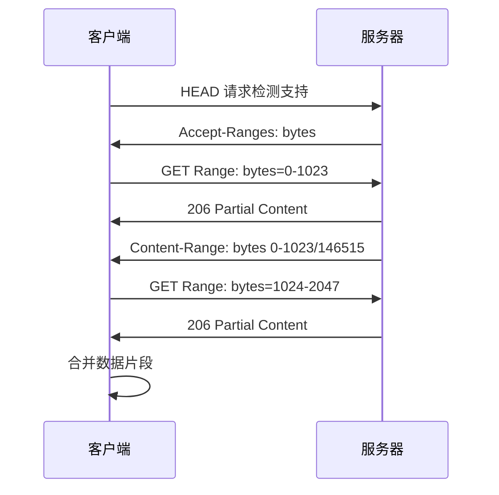

# 📄 HTTP Range 请求详解

> HTTP Range 请求允许客户端请求资源的特定部分，而不是完整的资源。这项技术广泛应用于断点续传、媒体流播放、大文件下载等场景，能够显著提升用户体验和网络效率。

## 🎯 Range 请求概述

### 📊 核心概念

| 概念 | 描述 | 作用 |
|------|------|------|
| **Range 请求** | 请求资源的特定部分 | 🎯 按需获取数据 |
| **Accept-Ranges** | 服务器支持范围请求 | 📋 声明支持能力 |
| **Content-Range** | 响应的范围信息 | 📊 描述返回的数据范围 |
| **部分内容** | 206 状态码响应 | ✅ 成功返回部分数据 |

### 🔄 Range 请求流程



## 🔍 Range 请求检测

### 📋 特性检测

```bash
# 使用 cURL 检测服务器是否支持 Range 请求
curl -I http://example.com/large-file.zip
```

**响应示例：**
```http
HTTP/1.1 200 OK
Accept-Ranges: bytes
Content-Length: 146515
Content-Type: application/zip
Last-Modified: Wed, 21 Oct 2023 07:28:00 GMT
ETag: "23c-5f4d6b4e3a7c0"
```

### 🔧 JavaScript 检测

```javascript
// 检测服务器是否支持 Range 请求
async function checkRangeSupport(url) {
    try {
        const response = await fetch(url, { method: 'HEAD' });
        const acceptRanges = response.headers.get('Accept-Ranges');
        const contentLength = response.headers.get('Content-Length');
        
        return {
            supported: acceptRanges && acceptRanges !== 'none',
            rangeUnit: acceptRanges || null,
            contentLength: contentLength ? parseInt(contentLength) : null,
            lastModified: response.headers.get('Last-Modified'),
            etag: response.headers.get('ETag')
        };
    } catch (error) {
        console.error('检测 Range 支持失败:', error);
        return { supported: false, error: error.message };
    }
}

// 使用示例
checkRangeSupport('https://example.com/large-file.zip')
    .then(result => {
        if (result.supported) {
            console.log('✅ 服务器支持 Range 请求');
            console.log('文件大小:', result.contentLength, '字节');
            console.log('范围单位:', result.rangeUnit);
        } else {
            console.log('❌ 服务器不支持 Range 请求');
        }
    });
```

## 📊 单一范围请求

### 🎯 基本语法

```http
Range: bytes=start-end
```

### 📋 范围格式

| 格式 | 描述 | 示例 |
|------|------|------|
| `bytes=0-1023` | 请求前 1024 字节 | 0 到 1023 字节 |
| `bytes=1024-` | 从 1024 字节到文件末尾 | 1024 字节到结尾 |
| `bytes=-1024` | 请求最后 1024 字节 | 文件尾部 1024 字节 |
| `bytes=1024-2047` | 请求特定范围 | 1024 到 2047 字节 |

### 🔧 实现示例

```javascript
// 单一范围请求实现
class RangeRequest {
    constructor(url) {
        this.url = url;
        this.fileSize = null;
        this.chunkSize = 1024 * 1024; // 1MB 块大小
    }
    
    async getFileInfo() {
        const response = await fetch(this.url, { method: 'HEAD' });
        if (!response.ok) {
            throw new Error(`获取文件信息失败: ${response.status}`);
        }
        
        this.fileSize = parseInt(response.headers.get('Content-Length'));
        this.lastModified = response.headers.get('Last-Modified');
        this.etag = response.headers.get('ETag');
        
        const acceptRanges = response.headers.get('Accept-Ranges');
        if (!acceptRanges || acceptRanges === 'none') {
            throw new Error('服务器不支持 Range 请求');
        }
        
        return {
            size: this.fileSize,
            lastModified: this.lastModified,
            etag: this.etag,
            rangeSupported: true
        };
    }
    
    async getRange(start, end) {
        if (!this.fileSize) {
            await this.getFileInfo();
        }
        
        // 确保范围有效
        if (start < 0) start = 0;
        if (end >= this.fileSize) end = this.fileSize - 1;
        if (start > end) {
            throw new Error('无效的范围: start > end');
        }
        
        const headers = new Headers();
        headers.set('Range', `bytes=${start}-${end}`);
        
        const response = await fetch(this.url, { headers });
        
        if (response.status === 206) {
            // 成功的部分内容响应
            const contentRange = response.headers.get('Content-Range');
            console.log(`✅ 获取范围 ${start}-${end}, 服务器响应: ${contentRange}`);
            
            return {
                status: 206,
                data: await response.arrayBuffer(),
                contentRange: contentRange,
                start: start,
                end: end
            };
        } else if (response.status === 200) {
            // 服务器返回完整内容
            console.log('⚠️ 服务器返回完整内容而非部分内容');
            return {
                status: 200,
                data: await response.arrayBuffer(),
                start: 0,
                end: this.fileSize - 1
            };
        } else {
            throw new Error(`Range 请求失败: ${response.status}`);
        }
    }
    
    async downloadChunk(chunkIndex) {
        const start = chunkIndex * this.chunkSize;
        const end = Math.min(start + this.chunkSize - 1, this.fileSize - 1);
        
        return await this.getRange(start, end);
    }
}

// 使用示例
const rangeRequest = new RangeRequest('https://example.com/large-file.zip');

// 获取文件信息
rangeRequest.getFileInfo()
    .then(info => {
        console.log('文件信息:', info);
        
        // 下载第一个 1MB 块
        return rangeRequest.downloadChunk(0);
    })
    .then(chunk => {
        console.log('下载的数据块:', chunk);
        console.log('数据大小:', chunk.data.byteLength, '字节');
    })
    .catch(error => {
        console.error('下载失败:', error);
    });
```

## 📊 多重范围请求

### 🎯 语法格式

```http
Range: bytes=0-50, 100-150, 200-250
```

### 🔧 实现示例

```javascript
// 多重范围请求实现
class MultiRangeRequest {
    constructor(url) {
        this.url = url;
        this.boundary = null;
    }
    
    async getMultipleRanges(ranges) {
        // 构建 Range 头部
        const rangeHeader = ranges
            .map(range => `${range.start}-${range.end}`)
            .join(', ');
        
        const headers = new Headers();
        headers.set('Range', `bytes=${rangeHeader}`);
        
        const response = await fetch(this.url, { headers });
        
        if (response.status === 206) {
            const contentType = response.headers.get('Content-Type');
            
            if (contentType && contentType.startsWith('multipart/byteranges')) {
                return await this.parseMultipartResponse(response);
            } else {
                // 单个范围响应
                return [{
                    range: ranges[0],
                    data: await response.arrayBuffer(),
                    contentType: contentType
                }];
            }
        } else {
            throw new Error(`多重范围请求失败: ${response.status}`);
        }
    }
    
    async parseMultipartResponse(response) {
        const contentType = response.headers.get('Content-Type');
        const boundaryMatch = contentType.match(/boundary=([^;]+)/);
        
        if (!boundaryMatch) {
            throw new Error('无法解析 multipart 边界');
        }
        
        this.boundary = boundaryMatch[1];
        const responseText = await response.text();
        
        return this.parseMultipartData(responseText);
    }
    
    parseMultipartData(data) {
        const parts = data.split(`--${this.boundary}`);
        const results = [];
        
        for (let i = 1; i < parts.length - 1; i++) {
            const part = parts[i].trim();
            if (!part) continue;
            
            const [headers, body] = part.split('\r\n\r\n');
            const contentRange = this.extractHeader(headers, 'Content-Range');
            const contentType = this.extractHeader(headers, 'Content-Type');
            
            if (contentRange) {
                const rangeMatch = contentRange.match(/bytes (\d+)-(\d+)\/(\d+)/);
                if (rangeMatch) {
                    results.push({
                        range: {
                            start: parseInt(rangeMatch[1]),
                            end: parseInt(rangeMatch[2]),
                            total: parseInt(rangeMatch[3])
                        },
                        data: body,
                        contentType: contentType
                    });
                }
            }
        }
        
        return results;
    }
    
    extractHeader(headers, headerName) {
        const regex = new RegExp(`^${headerName}:\\s*(.+)$`, 'm');
        const match = headers.match(regex);
        return match ? match[1] : null;
    }
}

// 使用示例
const multiRangeRequest = new MultiRangeRequest('https://example.com/document.pdf');

// 请求多个范围
const ranges = [
    { start: 0, end: 1023 },      // 前 1024 字节
    { start: 1024, end: 2047 },   // 第二个 1024 字节
    { start: 4096, end: 5119 }    // 第三个 1024 字节
];

multiRangeRequest.getMultipleRanges(ranges)
    .then(results => {
        console.log('多重范围请求结果:', results);
        results.forEach((result, index) => {
            console.log(`范围 ${index + 1}:`, result.range);
            console.log(`数据大小: ${result.data.length} 字节`);
        });
    })
    .catch(error => {
        console.error('多重范围请求失败:', error);
    });
```

## 🔄 条件范围请求

### 🎯 条件头部

| 头部 | 描述 | 用途 |
|------|------|------|
| `If-Range` | 条件范围请求 | 🔄 确保资源未被修改 |
| `If-Modified-Since` | 修改时间条件 | 📅 基于修改时间的缓存 |
| `If-None-Match` | ETag 条件 | 🏷️ 基于 ETag 的缓存 |

### 🔧 实现示例

```javascript
// 条件范围请求实现
class ConditionalRangeRequest {
    constructor(url) {
        this.url = url;
        this.lastModified = null;
        this.etag = null;
    }
    
    async getInitialInfo() {
        const response = await fetch(this.url, { method: 'HEAD' });
        if (!response.ok) {
            throw new Error(`获取文件信息失败: ${response.status}`);
        }
        
        this.lastModified = response.headers.get('Last-Modified');
        this.etag = response.headers.get('ETag');
        this.contentLength = parseInt(response.headers.get('Content-Length'));
        
        return {
            lastModified: this.lastModified,
            etag: this.etag,
            contentLength: this.contentLength
        };
    }
    
    async getConditionalRange(start, end, validator) {
        const headers = new Headers();
        headers.set('Range', `bytes=${start}-${end}`);
        
        // 添加条件头部
        if (validator && validator.type === 'etag' && validator.value) {
            headers.set('If-Range', validator.value);
        } else if (validator && validator.type === 'lastModified' && validator.value) {
            headers.set('If-Range', validator.value);
        }
        
        const response = await fetch(this.url, { headers });
        
        if (response.status === 206) {
            // 条件满足，返回部分内容
            return {
                status: 206,
                data: await response.arrayBuffer(),
                contentRange: response.headers.get('Content-Range'),
                conditional: true
            };
        } else if (response.status === 200) {
            // 条件不满足，返回完整内容
            return {
                status: 200,
                data: await response.arrayBuffer(),
                conditional: false,
                message: '资源已被修改，返回完整内容'
            };
        } else {
            throw new Error(`条件范围请求失败: ${response.status}`);
        }
    }
    
    async resumeDownload(progress) {
        // 断点续传
        const validator = {
            type: 'etag',
            value: this.etag
        };
        
        const start = progress.downloadedBytes;
        const end = this.contentLength - 1;
        
        console.log(`🔄 断点续传: 从 ${start} 字节开始`);
        
        try {
            const result = await this.getConditionalRange(start, end, validator);
            
            if (result.conditional) {
                console.log('✅ 断点续传成功');
                return {
                    success: true,
                    data: result.data,
                    resumePosition: start
                };
            } else {
                console.log('⚠️ 文件已变更，重新开始下载');
                return {
                    success: false,
                    data: result.data,
                    resumePosition: 0,
                    message: '文件已变更，需要重新下载'
                };
            }
        } catch (error) {
            console.error('断点续传失败:', error);
            throw error;
        }
    }
}

// 使用示例
const conditionalRequest = new ConditionalRangeRequest('https://example.com/large-file.zip');

// 模拟断点续传
const downloadProgress = {
    downloadedBytes: 1024000, // 已下载 1MB
    totalBytes: 5242880       // 总共 5MB
};

conditionalRequest.getInitialInfo()
    .then(info => {
        console.log('文件信息:', info);
        return conditionalRequest.resumeDownload(downloadProgress);
    })
    .then(result => {
        if (result.success) {
            console.log('断点续传成功');
            console.log('续传位置:', result.resumePosition);
            console.log('数据大小:', result.data.byteLength);
        } else {
            console.log('需要重新下载:', result.message);
        }
    })
    .catch(error => {
        console.error('操作失败:', error);
    });
```

## 📱 实际应用场景

### 🎥 视频流播放器

```javascript
// 视频流播放器实现
class VideoStreamPlayer {
    constructor(videoUrl, videoElement) {
        this.videoUrl = videoUrl;
        this.videoElement = videoElement;
        this.chunkSize = 1024 * 1024; // 1MB 块大小
        this.buffer = [];
        this.isBuffering = false;
    }
    
    async initializePlayer() {
        // 获取视频文件信息
        const response = await fetch(this.videoUrl, { method: 'HEAD' });
        this.fileSize = parseInt(response.headers.get('Content-Length'));
        
        // 检查是否支持范围请求
        const acceptRanges = response.headers.get('Accept-Ranges');
        if (!acceptRanges || acceptRanges === 'none') {
            throw new Error('视频服务器不支持范围请求');
        }
        
        // 预加载视频头部信息
        await this.loadVideoHeader();
        
        // 设置播放器事件
        this.setupPlayerEvents();
        
        console.log('✅ 视频播放器初始化完成');
    }
    
    async loadVideoHeader() {
        // 加载视频文件的前 64KB（通常包含元数据）
        const headerSize = 64 * 1024;
        const headerChunk = await this.loadChunk(0, headerSize - 1);
        
        // 创建 Blob URL
        const blob = new Blob([headerChunk.data], { type: 'video/mp4' });
        const url = URL.createObjectURL(blob);
        
        // 设置视频源
        this.videoElement.src = url;
        
        console.log('📹 视频头部加载完成');
    }
    
    async loadChunk(start, end) {
        const headers = new Headers();
        headers.set('Range', `bytes=${start}-${end}`);
        
        const response = await fetch(this.videoUrl, { headers });
        
        if (response.status === 206) {
            return {
                start: start,
                end: end,
                data: await response.arrayBuffer()
            };
        } else {
            throw new Error(`视频块加载失败: ${response.status}`);
        }
    }
    
    setupPlayerEvents() {
        this.videoElement.addEventListener('timeupdate', () => {
            this.checkBuffering();
        });
        
        this.videoElement.addEventListener('seeking', () => {
            this.handleSeek();
        });
        
        this.videoElement.addEventListener('progress', () => {
            this.updateBufferIndicator();
        });
    }
    
    checkBuffering() {
        const currentTime = this.videoElement.currentTime;
        const buffered = this.videoElement.buffered;
        
        // 检查是否需要预加载更多数据
        if (buffered.length > 0) {
            const bufferedEnd = buffered.end(buffered.length - 1);
            const remainingBuffer = bufferedEnd - currentTime;
            
            if (remainingBuffer < 30) { // 剩余缓冲少于 30 秒
                this.preloadNext();
            }
        }
    }
    
    async preloadNext() {
        if (this.isBuffering) return;
        
        this.isBuffering = true;
        
        try {
            // 计算下一个需要加载的块
            const currentPosition = this.getCurrentBytePosition();
            const nextStart = currentPosition + this.chunkSize;
            const nextEnd = Math.min(nextStart + this.chunkSize - 1, this.fileSize - 1);
            
            if (nextStart < this.fileSize) {
                const chunk = await this.loadChunk(nextStart, nextEnd);
                this.appendToBuffer(chunk);
                console.log(`📡 预加载块: ${nextStart}-${nextEnd}`);
            }
        } catch (error) {
            console.error('预加载失败:', error);
        } finally {
            this.isBuffering = false;
        }
    }
    
    getCurrentBytePosition() {
        const duration = this.videoElement.duration;
        const currentTime = this.videoElement.currentTime;
        
        if (duration && currentTime) {
            return Math.floor((currentTime / duration) * this.fileSize);
        }
        
        return 0;
    }
    
    appendToBuffer(chunk) {
        // 将数据块添加到缓冲区
        this.buffer.push(chunk);
        
        // 触发自定义事件
        this.videoElement.dispatchEvent(new CustomEvent('bufferUpdate', {
            detail: { chunk: chunk }
        }));
    }
    
    async handleSeek() {
        const seekTime = this.videoElement.currentTime;
        const bytePosition = this.getCurrentBytePosition();
        
        console.log(`🎯 跳转到: ${seekTime}s, 字节位置: ${bytePosition}`);
        
        // 加载跳转位置的数据
        const chunkStart = Math.floor(bytePosition / this.chunkSize) * this.chunkSize;
        const chunkEnd = Math.min(chunkStart + this.chunkSize - 1, this.fileSize - 1);
        
        try {
            const chunk = await this.loadChunk(chunkStart, chunkEnd);
            this.appendToBuffer(chunk);
        } catch (error) {
            console.error('跳转加载失败:', error);
        }
    }
}

// 使用示例
const video = document.getElementById('myVideo');
const player = new VideoStreamPlayer('https://example.com/video.mp4', video);

player.initializePlayer()
    .then(() => {
        console.log('视频播放器就绪');
        
        // 添加播放器控件事件
        document.getElementById('playBtn').addEventListener('click', () => {
            video.play();
        });
        
        document.getElementById('pauseBtn').addEventListener('click', () => {
            video.pause();
        });
    })
    .catch(error => {
        console.error('播放器初始化失败:', error);
    });
```

### 📥 断点续传下载器

```javascript
// 断点续传下载器
class ResumableDownloader {
    constructor(url, options = {}) {
        this.url = url;
        this.chunkSize = options.chunkSize || 1024 * 1024; // 1MB
        this.maxConcurrency = options.maxConcurrency || 3;
        this.retryCount = options.retryCount || 3;
        
        this.fileSize = null;
        this.downloadedChunks = new Map();
        this.downloadProgress = {
            total: 0,
            downloaded: 0,
            percentage: 0
        };
        
        this.eventHandlers = {
            progress: [],
            complete: [],
            error: [],
            pause: [],
            resume: []
        };
    }
    
    // 事件处理
    on(event, handler) {
        if (this.eventHandlers[event]) {
            this.eventHandlers[event].push(handler);
        }
    }
    
    emit(event, data) {
        if (this.eventHandlers[event]) {
            this.eventHandlers[event].forEach(handler => handler(data));
        }
    }
    
    async start() {
        try {
            // 获取文件信息
            await this.getFileInfo();
            
            // 恢复之前的下载进度
            await this.loadProgress();
            
            // 开始下载
            await this.startDownload();
            
        } catch (error) {
            this.emit('error', error);
        }
    }
    
    async getFileInfo() {
        const response = await fetch(this.url, { method: 'HEAD' });
        if (!response.ok) {
            throw new Error(`获取文件信息失败: ${response.status}`);
        }
        
        this.fileSize = parseInt(response.headers.get('Content-Length'));
        this.lastModified = response.headers.get('Last-Modified');
        this.etag = response.headers.get('ETag');
        
        const acceptRanges = response.headers.get('Accept-Ranges');
        if (!acceptRanges || acceptRanges === 'none') {
            throw new Error('服务器不支持断点续传');
        }
        
        this.downloadProgress.total = this.fileSize;
        console.log(`📁 文件大小: ${this.fileSize} 字节`);
    }
    
    async loadProgress() {
        // 从本地存储加载下载进度
        const progressKey = `download_progress_${this.getUrlHash()}`;
        const savedProgress = localStorage.getItem(progressKey);
        
        if (savedProgress) {
            const progress = JSON.parse(savedProgress);
            
            // 验证文件是否已更改
            if (progress.etag === this.etag && progress.lastModified === this.lastModified) {
                this.downloadedChunks = new Map(progress.chunks);
                this.downloadProgress.downloaded = progress.downloaded;
                this.downloadProgress.percentage = (progress.downloaded / this.fileSize) * 100;
                
                console.log(`📂 恢复下载进度: ${this.downloadProgress.percentage.toFixed(2)}%`);
            } else {
                console.log('📄 文件已更改，重新开始下载');
                this.clearProgress();
            }
        }
    }
    
    async startDownload() {
        const totalChunks = Math.ceil(this.fileSize / this.chunkSize);
        const pendingChunks = [];
        
        // 识别需要下载的块
        for (let i = 0; i < totalChunks; i++) {
            if (!this.downloadedChunks.has(i)) {
                pendingChunks.push(i);
            }
        }
        
        if (pendingChunks.length === 0) {
            console.log('✅ 文件已完全下载');
            this.emit('complete', { data: this.assembleFile() });
            return;
        }
        
        console.log(`🚀 开始下载 ${pendingChunks.length} 个块`);
        
        // 并发下载
        const downloadPromises = [];
        for (let i = 0; i < this.maxConcurrency; i++) {
            downloadPromises.push(this.downloadWorker(pendingChunks));
        }
        
        await Promise.all(downloadPromises);
        
        console.log('✅ 下载完成');
        this.emit('complete', { data: this.assembleFile() });
    }
    
    async downloadWorker(chunkQueue) {
        while (chunkQueue.length > 0) {
            const chunkIndex = chunkQueue.shift();
            if (chunkIndex === undefined) break;
            
            let retryCount = 0;
            let success = false;
            
            while (retryCount < this.retryCount && !success) {
                try {
                    await this.downloadChunk(chunkIndex);
                    success = true;
                } catch (error) {
                    retryCount++;
                    console.warn(`块 ${chunkIndex} 下载失败，重试 ${retryCount}/${this.retryCount}`);
                    
                    if (retryCount >= this.retryCount) {
                        throw error;
                    }
                    
                    // 等待一段时间后重试
                    await this.sleep(1000 * retryCount);
                }
            }
        }
    }
    
    async downloadChunk(chunkIndex) {
        const start = chunkIndex * this.chunkSize;
        const end = Math.min(start + this.chunkSize - 1, this.fileSize - 1);
        
        const headers = new Headers();
        headers.set('Range', `bytes=${start}-${end}`);
        
        const response = await fetch(this.url, { headers });
        
        if (response.status === 206) {
            const data = await response.arrayBuffer();
            this.downloadedChunks.set(chunkIndex, data);
            
            // 更新进度
            this.downloadProgress.downloaded += data.byteLength;
            this.downloadProgress.percentage = (this.downloadProgress.downloaded / this.fileSize) * 100;
            
            // 保存进度
            this.saveProgress();
            
            // 触发进度事件
            this.emit('progress', {
                chunk: chunkIndex,
                downloaded: this.downloadProgress.downloaded,
                total: this.downloadProgress.total,
                percentage: this.downloadProgress.percentage
            });
            
            console.log(`📦 块 ${chunkIndex} 下载完成 (${this.downloadProgress.percentage.toFixed(2)}%)`);
            
        } else {
            throw new Error(`块 ${chunkIndex} 下载失败: ${response.status}`);
        }
    }
    
    saveProgress() {
        const progressKey = `download_progress_${this.getUrlHash()}`;
        const progress = {
            chunks: Array.from(this.downloadedChunks.entries()),
            downloaded: this.downloadProgress.downloaded,
            etag: this.etag,
            lastModified: this.lastModified,
            timestamp: Date.now()
        };
        
        localStorage.setItem(progressKey, JSON.stringify(progress));
    }
    
    assembleFile() {
        const totalChunks = Math.ceil(this.fileSize / this.chunkSize);
        const chunks = [];
        
        for (let i = 0; i < totalChunks; i++) {
            const chunk = this.downloadedChunks.get(i);
            if (chunk) {
                chunks.push(chunk);
            } else {
                throw new Error(`缺少块 ${i}`);
            }
        }
        
        return new Blob(chunks);
    }
    
    getUrlHash() {
        // 简单的 URL 哈希函数
        let hash = 0;
        for (let i = 0; i < this.url.length; i++) {
            const char = this.url.charCodeAt(i);
            hash = ((hash << 5) - hash) + char;
            hash = hash & hash; // 转换为 32 位整数
        }
        return hash.toString(36);
    }
    
    clearProgress() {
        const progressKey = `download_progress_${this.getUrlHash()}`;
        localStorage.removeItem(progressKey);
        this.downloadedChunks.clear();
        this.downloadProgress.downloaded = 0;
        this.downloadProgress.percentage = 0;
    }
    
    sleep(ms) {
        return new Promise(resolve => setTimeout(resolve, ms));
    }
}

// 使用示例
const downloader = new ResumableDownloader('https://example.com/large-file.zip', {
    chunkSize: 1024 * 1024, // 1MB 块大小
    maxConcurrency: 3,      // 最大并发数
    retryCount: 3           // 重试次数
});

// 监听事件
downloader.on('progress', (progress) => {
    console.log(`下载进度: ${progress.percentage.toFixed(2)}%`);
    
    // 更新进度条
    const progressBar = document.getElementById('progressBar');
    if (progressBar) {
        progressBar.style.width = progress.percentage + '%';
        progressBar.textContent = `${progress.percentage.toFixed(2)}%`;
    }
});

downloader.on('complete', (result) => {
    console.log('✅ 文件下载完成');
    
    // 创建下载链接
    const url = URL.createObjectURL(result.data);
    const a = document.createElement('a');
    a.href = url;
    a.download = 'downloaded-file.zip';
    a.click();
    
    URL.revokeObjectURL(url);
});

downloader.on('error', (error) => {
    console.error('❌ 下载失败:', error);
});

// 开始下载
downloader.start();
```

## 🔄 与 Transfer-Encoding 的对比

### 📊 技术对比

| 特性 | Range 请求 | Transfer-Encoding: chunked |
|------|------------|--------------------------|
| **用途** | 请求部分内容 | 流式传输 |
| **控制方** | 客户端控制 | 服务器控制 |
| **预知大小** | 需要知道总大小 | 不需要预知大小 |
| **缓存性** | 支持缓存 | 不易缓存 |
| **断点续传** | 支持 | 不支持 |

### 🔧 组合使用示例

```javascript
// 结合使用 Range 请求和 Transfer-Encoding
class HybridDownloader {
    constructor(url) {
        this.url = url;
        this.supportsRange = false;
        this.supportsChunked = false;
    }
    
    async checkCapabilities() {
        const response = await fetch(this.url, { method: 'HEAD' });
        
        // 检查 Range 支持
        const acceptRanges = response.headers.get('Accept-Ranges');
        this.supportsRange = acceptRanges && acceptRanges !== 'none';
        
        // 检查是否支持 chunked 传输
        const transferEncoding = response.headers.get('Transfer-Encoding');
        this.supportsChunked = transferEncoding && transferEncoding.includes('chunked');
        
        console.log('Range 支持:', this.supportsRange);
        console.log('Chunked 支持:', this.supportsChunked);
        
        return {
            range: this.supportsRange,
            chunked: this.supportsChunked
        };
    }
    
    async download() {
        await this.checkCapabilities();
        
        if (this.supportsRange) {
            console.log('📄 使用 Range 请求下载');
            return await this.downloadWithRange();
        } else if (this.supportsChunked) {
            console.log('🌊 使用 chunked 传输下载');
            return await this.downloadWithChunked();
        } else {
            console.log('📦 使用标准下载');
            return await this.downloadStandard();
        }
    }
    
    async downloadWithRange() {
        // 使用 Range 请求实现
        const rangeRequest = new RangeRequest(this.url);
        await rangeRequest.getFileInfo();
        
        const totalChunks = Math.ceil(rangeRequest.fileSize / rangeRequest.chunkSize);
        const chunks = [];
        
        for (let i = 0; i < totalChunks; i++) {
            const chunk = await rangeRequest.downloadChunk(i);
            chunks.push(chunk.data);
        }
        
        return new Blob(chunks);
    }
    
    async downloadWithChunked() {
        // 使用 chunked 传输实现
        const response = await fetch(this.url);
        const reader = response.body.getReader();
        const chunks = [];
        
        while (true) {
            const { done, value } = await reader.read();
            if (done) break;
            
            chunks.push(value);
            console.log(`📦 接收到块: ${value.length} 字节`);
        }
        
        return new Blob(chunks);
    }
    
    async downloadStandard() {
        // 标准下载实现
        const response = await fetch(this.url);
        return await response.blob();
    }
}

// 使用示例
const hybridDownloader = new HybridDownloader('https://example.com/file.zip');

hybridDownloader.download()
    .then(blob => {
        console.log('✅ 下载完成');
        console.log('文件大小:', blob.size, '字节');
        
        // 创建下载链接
        const url = URL.createObjectURL(blob);
        const a = document.createElement('a');
        a.href = url;
        a.download = 'downloaded-file.zip';
        a.click();
        
        URL.revokeObjectURL(url);
    })
    .catch(error => {
        console.error('下载失败:', error);
    });
```

## 📚 相关资源

### 🔗 官方文档
- [RFC 7233 - HTTP/1.1 Range Requests](https://tools.ietf.org/html/rfc7233)
- [MDN Range requests](https://developer.mozilla.org/en-US/docs/Web/HTTP/Range_requests)
- [HTTP Range 头部规范](https://developer.mozilla.org/en-US/docs/Web/HTTP/Headers/Range)

### 🛠️ 相关工具
- [curl](https://curl.se/) - 命令行 HTTP 客户端
- [aria2](https://aria2.github.io/) - 多协议下载工具
- [wget](https://www.gnu.org/software/wget/) - 网络下载工具

### 📖 扩展阅读
- [HTTP 协议详解](https://developer.mozilla.org/en-US/docs/Web/HTTP)
- [Web 性能优化](https://developer.mozilla.org/en-US/docs/Web/Performance)
- [媒体流技术](https://developer.mozilla.org/en-US/docs/Web/Guide/Audio_and_video_delivery)

---

::: tip 💡 小贴士
Range 请求特别适合大文件下载、媒体播放和移动应用场景。合理使用可以显著提升用户体验，特别是在网络条件不稳定的情况下。
:::

::: warning ⚠️ 注意
实现断点续传时，务必验证文件的完整性（如使用 ETag 或 Last-Modified）。某些 CDN 或代理服务器可能不完全支持 Range 请求，需要进行兼容性测试。
:::