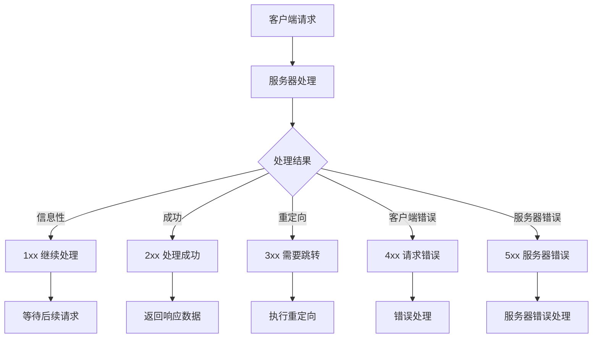
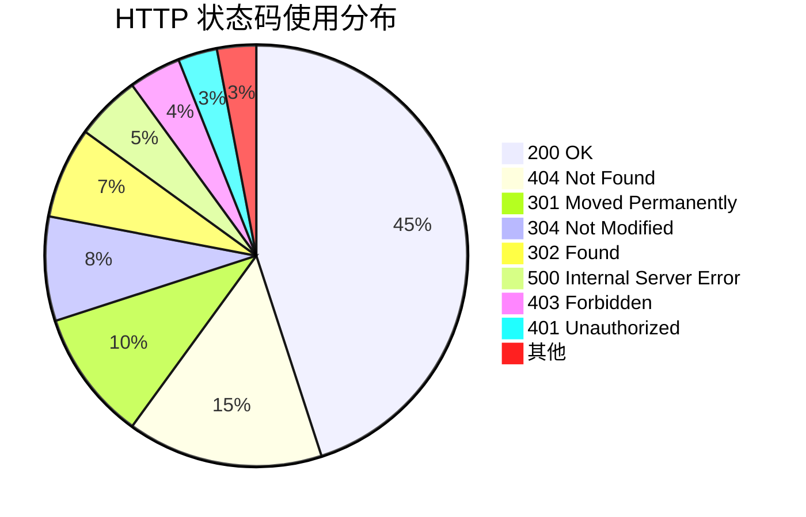

# 📊 HTTP 状态码完全指南

> HTTP 状态码是服务器对客户端请求的响应标识，它告诉客户端请求的处理结果。理解状态码对于 Web 开发、API 设计和问题调试至关重要。

## 🎯 状态码概述

### 📊 分类体系

| 类别 | 范围 | 含义 | 特点 |
|------|------|------|------|
| **1xx** | 100-199 | 📝 信息性状态码 | 请求已接收，继续处理 |
| **2xx** | 200-299 | ✅ 成功状态码 | 请求成功接收、理解、处理 |
| **3xx** | 300-399 | 🔄 重定向状态码 | 需要进一步操作完成请求 |
| **4xx** | 400-499 | ❌ 客户端错误状态码 | 请求有语法错误或无法执行 |
| **5xx** | 500-599 | 💥 服务器错误状态码 | 服务器无法执行有效请求 |

### 🔄 状态码处理流程



## 1️⃣ 1xx 信息性状态码

### 📝 常用状态码

| 状态码 | 名称 | 描述 | 使用场景 |
|--------|------|------|----------|
| **100** | Continue | 继续 | 客户端应继续发送请求 |
| **101** | Switching Protocols | 切换协议 | 服务器切换协议（如 WebSocket） |
| **102** | Processing | 处理中 | 请求正在处理中 |

### 🔧 实际应用

```javascript
// 处理 100 Continue 状态码
function handleContinue(xhr) {
    xhr.onreadystatechange = function() {
        if (xhr.readyState === 2 && xhr.status === 100) {
            console.log('📝 服务器响应 100 Continue，继续发送请求体');
            // 继续发送大文件或数据
        }
    };
}

// WebSocket 协议升级 (101)
const socket = new WebSocket('ws://localhost:8080');
socket.onopen = function() {
    console.log('🔄 协议已升级到 WebSocket (101)');
};
```

## 2️⃣ 2xx 成功状态码

### ✅ 核心状态码

| 状态码 | 名称 | 描述 | 使用场景 |
|--------|------|------|----------|
| **200** | OK | 请求成功 | 标准成功响应 |
| **201** | Created | 资源已创建 | POST 请求成功创建资源 |
| **202** | Accepted | 请求已接受 | 异步处理请求 |
| **204** | No Content | 无内容 | 成功但无响应体 |
| **206** | Partial Content | 部分内容 | 范围请求成功 |

### 🎯 使用示例

```javascript
// 根据不同状态码处理响应
function handleSuccessResponse(xhr) {
    switch(xhr.status) {
        case 200:
            console.log('✅ 请求成功');
            return JSON.parse(xhr.responseText);
            
        case 201:
            console.log('🎉 资源创建成功');
            const location = xhr.getResponseHeader('Location');
            return {
                created: true,
                location: location,
                data: JSON.parse(xhr.responseText)
            };
            
        case 202:
            console.log('⏳ 请求已接受，正在处理');
            return {
                accepted: true,
                message: '请求正在异步处理中'
            };
            
        case 204:
            console.log('🔄 操作成功，无响应内容');
            return { success: true };
            
        case 206:
            console.log('📄 部分内容响应');
            const contentRange = xhr.getResponseHeader('Content-Range');
            return {
                partial: true,
                range: contentRange,
                data: xhr.responseText
            };
            
        default:
            console.log(`✅ 成功响应: ${xhr.status}`);
            return xhr.responseText;
    }
}

// API 响应示例
const apiResponse = {
    // GET 请求 - 200 OK
    getUser: async (id) => {
        const response = await fetch(`/api/users/${id}`);
        if (response.status === 200) {
            return await response.json();
        }
    },
    
    // POST 请求 - 201 Created
    createUser: async (userData) => {
        const response = await fetch('/api/users', {
            method: 'POST',
            headers: { 'Content-Type': 'application/json' },
            body: JSON.stringify(userData)
        });
        if (response.status === 201) {
            const location = response.headers.get('Location');
            return { location, data: await response.json() };
        }
    },
    
    // PUT 请求 - 204 No Content
    updateUser: async (id, userData) => {
        const response = await fetch(`/api/users/${id}`, {
            method: 'PUT',
            headers: { 'Content-Type': 'application/json' },
            body: JSON.stringify(userData)
        });
        return response.status === 204;
    },
    
    // DELETE 请求 - 204 No Content
    deleteUser: async (id) => {
        const response = await fetch(`/api/users/${id}`, {
            method: 'DELETE'
        });
        return response.status === 204;
    }
};
```

## 3️⃣ 3xx 重定向状态码

### 🔄 重定向类型

| 状态码 | 名称 | 描述 | 缓存行为 | 方法保持 |
|--------|------|------|----------|----------|
| **300** | Multiple Choices | 多种选择 | 可缓存 | 是 |
| **301** | Moved Permanently | 永久重定向 | 可缓存 | 否 |
| **302** | Found | 临时重定向 | 不缓存 | 否 |
| **304** | Not Modified | 未修改 | 缓存控制 | - |
| **307** | Temporary Redirect | 临时重定向 | 不缓存 | 是 |
| **308** | Permanent Redirect | 永久重定向 | 可缓存 | 是 |

### 🎯 重定向处理

```javascript
// 重定向处理器
class RedirectHandler {
    constructor() {
        this.maxRedirects = 5;
        this.redirectCount = 0;
    }
    
    async handleRedirect(response) {
        if (this.redirectCount >= this.maxRedirects) {
            throw new Error('重定向次数过多');
        }
        
        const location = response.headers.get('Location');
        if (!location) {
            throw new Error('重定向响应缺少 Location 头部');
        }
        
        this.redirectCount++;
        
        switch(response.status) {
            case 301:
                console.log('🔄 永久重定向到:', location);
                // 更新书签或缓存
                this.updatePermanentRedirect(location);
                break;
                
            case 302:
                console.log('↩️ 临时重定向到:', location);
                // 不更新缓存
                break;
                
            case 304:
                console.log('💾 资源未修改，使用缓存');
                return this.getCachedResponse();
                
            case 307:
                console.log('🔄 临时重定向（保持方法）到:', location);
                // 保持原请求方法
                break;
                
            case 308:
                console.log('🔄 永久重定向（保持方法）到:', location);
                // 保持原请求方法，更新缓存
                this.updatePermanentRedirect(location);
                break;
        }
        
        return this.followRedirect(location);
    }
    
    updatePermanentRedirect(newUrl) {
        // 更新本地缓存或书签
        localStorage.setItem('redirectCache', JSON.stringify({
            url: newUrl,
            timestamp: Date.now()
        }));
    }
    
    getCachedResponse() {
        // 返回缓存的响应
        const cached = localStorage.getItem('responseCache');
        return cached ? JSON.parse(cached) : null;
    }
    
    async followRedirect(location) {
        // 跟随重定向
        return await fetch(location);
    }
}

// 条件请求处理 (304)
function makeConditionalRequest(url, lastModified, etag) {
    const headers = new Headers();
    
    if (lastModified) {
        headers.set('If-Modified-Since', lastModified);
    }
    
    if (etag) {
        headers.set('If-None-Match', etag);
    }
    
    return fetch(url, { headers })
        .then(response => {
            if (response.status === 304) {
                console.log('💾 资源未修改，使用缓存版本');
                return getCachedResource(url);
            }
            return response;
        });
}
```

## 4️⃣ 4xx 客户端错误状态码

### ❌ 常见错误

| 状态码 | 名称 | 描述 | 解决方案 |
|--------|------|------|----------|
| **400** | Bad Request | 请求语法错误 | 检查请求格式 |
| **401** | Unauthorized | 未授权 | 提供认证信息 |
| **403** | Forbidden | 禁止访问 | 检查权限 |
| **404** | Not Found | 资源不存在 | 检查 URL 路径 |
| **405** | Method Not Allowed | 方法不允许 | 使用正确的 HTTP 方法 |
| **429** | Too Many Requests | 请求过多 | 实施限流控制 |

### 🔧 错误处理

```javascript
// 客户端错误处理器
class ClientErrorHandler {
    constructor() {
        this.errorHandlers = {
            400: this.handleBadRequest,
            401: this.handleUnauthorized,
            403: this.handleForbidden,
            404: this.handleNotFound,
            405: this.handleMethodNotAllowed,
            429: this.handleTooManyRequests
        };
    }
    
    async handleError(response) {
        const handler = this.errorHandlers[response.status];
        if (handler) {
            return await handler.call(this, response);
        }
        
        throw new Error(`未处理的客户端错误: ${response.status}`);
    }
    
    async handleBadRequest(response) {
        console.error('❌ 400 Bad Request - 请求语法错误');
        const errorData = await response.json();
        
        // 显示详细的验证错误
        if (errorData.validation_errors) {
            errorData.validation_errors.forEach(error => {
                console.error(`字段 ${error.field}: ${error.message}`);
            });
        }
        
        return { error: 'bad_request', details: errorData };
    }
    
    async handleUnauthorized(response) {
        console.error('🔒 401 Unauthorized - 需要认证');
        
        // 清除过期的认证信息
        localStorage.removeItem('authToken');
        sessionStorage.removeItem('authToken');
        
        // 重定向到登录页面
        if (typeof window !== 'undefined') {
            window.location.href = '/login';
        }
        
        return { error: 'unauthorized', action: 'redirect_to_login' };
    }
    
    async handleForbidden(response) {
        console.error('🚫 403 Forbidden - 权限不足');
        
        return { 
            error: 'forbidden', 
            message: '您没有访问此资源的权限' 
        };
    }
    
    async handleNotFound(response) {
        console.error('❓ 404 Not Found - 资源不存在');
        
        return { 
            error: 'not_found', 
            message: '请求的资源不存在' 
        };
    }
    
    async handleMethodNotAllowed(response) {
        console.error('🚫 405 Method Not Allowed - 方法不允许');
        
        const allowedMethods = response.headers.get('Allow');
        return { 
            error: 'method_not_allowed', 
            allowed_methods: allowedMethods?.split(', ') || []
        };
    }
    
    async handleTooManyRequests(response) {
        console.error('🚦 429 Too Many Requests - 请求过多');
        
        const retryAfter = response.headers.get('Retry-After');
        const resetTime = response.headers.get('X-RateLimit-Reset');
        
        return { 
            error: 'rate_limited', 
            retry_after: retryAfter,
            reset_time: resetTime
        };
    }
}

// 使用示例
const errorHandler = new ClientErrorHandler();

async function makeRequest(url, options = {}) {
    try {
        const response = await fetch(url, options);
        
        if (response.status >= 400 && response.status < 500) {
            const errorResult = await errorHandler.handleError(response);
            console.log('错误处理结果:', errorResult);
            return errorResult;
        }
        
        return await response.json();
    } catch (error) {
        console.error('网络错误:', error);
        throw error;
    }
}
```

## 5️⃣ 5xx 服务器错误状态码

### 💥 服务器错误

| 状态码 | 名称 | 描述 | 常见原因 |
|--------|------|------|----------|
| **500** | Internal Server Error | 服务器内部错误 | 代码异常、数据库错误 |
| **501** | Not Implemented | 功能未实现 | 服务器不支持请求方法 |
| **502** | Bad Gateway | 网关错误 | 代理服务器错误 |
| **503** | Service Unavailable | 服务不可用 | 服务器过载或维护 |
| **504** | Gateway Timeout | 网关超时 | 上游服务器超时 |

### 🔧 服务器错误处理

```javascript
// 服务器错误处理器
class ServerErrorHandler {
    constructor() {
        this.retryConfig = {
            maxRetries: 3,
            baseDelay: 1000,
            maxDelay: 10000
        };
    }
    
    async handleServerError(response, requestOptions) {
        switch(response.status) {
            case 500:
                return await this.handleInternalServerError(response, requestOptions);
            case 502:
                return await this.handleBadGateway(response, requestOptions);
            case 503:
                return await this.handleServiceUnavailable(response, requestOptions);
            case 504:
                return await this.handleGatewayTimeout(response, requestOptions);
            default:
                throw new Error(`未处理的服务器错误: ${response.status}`);
        }
    }
    
    async handleInternalServerError(response, requestOptions) {
        console.error('💥 500 Internal Server Error - 服务器内部错误');
        
        // 记录错误详情
        const errorId = response.headers.get('X-Error-ID');
        if (errorId) {
            console.error('错误ID:', errorId);
        }
        
        // 对于 GET 请求，可以尝试重试
        if (requestOptions.method === 'GET') {
            return await this.retryRequest(requestOptions);
        }
        
        return { error: 'internal_server_error', error_id: errorId };
    }
    
    async handleBadGateway(response, requestOptions) {
        console.error('🔗 502 Bad Gateway - 网关错误');
        
        // 网关错误通常是临时的，可以重试
        return await this.retryRequest(requestOptions);
    }
    
    async handleServiceUnavailable(response, requestOptions) {
        console.error('🚫 503 Service Unavailable - 服务不可用');
        
        const retryAfter = response.headers.get('Retry-After');
        if (retryAfter) {
            console.log(`服务将在 ${retryAfter} 秒后恢复`);
            
            // 等待指定时间后重试
            await this.sleep(parseInt(retryAfter) * 1000);
            return await this.retryRequest(requestOptions);
        }
        
        return { error: 'service_unavailable', retry_after: retryAfter };
    }
    
    async handleGatewayTimeout(response, requestOptions) {
        console.error('⏰ 504 Gateway Timeout - 网关超时');
        
        // 对于幂等请求，可以重试
        if (['GET', 'HEAD', 'PUT', 'DELETE'].includes(requestOptions.method)) {
            return await this.retryRequest(requestOptions);
        }
        
        return { error: 'gateway_timeout' };
    }
    
    async retryRequest(requestOptions, retryCount = 0) {
        if (retryCount >= this.retryConfig.maxRetries) {
            throw new Error('重试次数已达上限');
        }
        
        // 计算延迟时间（指数退避）
        const delay = Math.min(
            this.retryConfig.baseDelay * Math.pow(2, retryCount),
            this.retryConfig.maxDelay
        );
        
        console.log(`🔄 ${delay}ms 后进行第 ${retryCount + 1} 次重试`);
        await this.sleep(delay);
        
        try {
            const response = await fetch(requestOptions.url, requestOptions);
            
            if (response.status >= 500) {
                return await this.retryRequest(requestOptions, retryCount + 1);
            }
            
            return await response.json();
        } catch (error) {
            return await this.retryRequest(requestOptions, retryCount + 1);
        }
    }
    
    sleep(ms) {
        return new Promise(resolve => setTimeout(resolve, ms));
    }
}

// 带重试的请求函数
async function robustRequest(url, options = {}) {
    const errorHandler = new ServerErrorHandler();
    
    try {
        const response = await fetch(url, options);
        
        if (response.status >= 500) {
            return await errorHandler.handleServerError(response, { url, ...options });
        }
        
        return await response.json();
    } catch (error) {
        console.error('请求失败:', error);
        throw error;
    }
}
```

## 📊 状态码使用统计

### 📈 常见状态码分布



### 📋 完整状态码列表

```javascript
// HTTP 状态码完整映射
const HTTP_STATUS_CODES = {
    // 1xx Informational
    100: 'Continue',
    101: 'Switching Protocols',
    102: 'Processing',
    
    // 2xx Success
    200: 'OK',
    201: 'Created',
    202: 'Accepted',
    203: 'Non-Authoritative Information',
    204: 'No Content',
    205: 'Reset Content',
    206: 'Partial Content',
    207: 'Multi-Status',
    208: 'Already Reported',
    226: 'IM Used',
    
    // 3xx Redirection
    300: 'Multiple Choices',
    301: 'Moved Permanently',
    302: 'Found',
    303: 'See Other',
    304: 'Not Modified',
    305: 'Use Proxy',
    307: 'Temporary Redirect',
    308: 'Permanent Redirect',
    
    // 4xx Client Error
    400: 'Bad Request',
    401: 'Unauthorized',
    402: 'Payment Required',
    403: 'Forbidden',
    404: 'Not Found',
    405: 'Method Not Allowed',
    406: 'Not Acceptable',
    407: 'Proxy Authentication Required',
    408: 'Request Timeout',
    409: 'Conflict',
    410: 'Gone',
    411: 'Length Required',
    412: 'Precondition Failed',
    413: 'Payload Too Large',
    414: 'URI Too Long',
    415: 'Unsupported Media Type',
    416: 'Range Not Satisfiable',
    417: 'Expectation Failed',
    418: "I'm a Teapot",
    422: 'Unprocessable Entity',
    423: 'Locked',
    424: 'Failed Dependency',
    426: 'Upgrade Required',
    428: 'Precondition Required',
    429: 'Too Many Requests',
    431: 'Request Header Fields Too Large',
    
    // 5xx Server Error
    500: 'Internal Server Error',
    501: 'Not Implemented',
    502: 'Bad Gateway',
    503: 'Service Unavailable',
    504: 'Gateway Timeout',
    505: 'HTTP Version Not Supported',
    506: 'Variant Also Negotiates',
    507: 'Insufficient Storage',
    508: 'Loop Detected',
    510: 'Not Extended',
    511: 'Network Authentication Required'
};

// 状态码工具函数
const StatusCodeUtils = {
    // 获取状态码描述
    getStatusText(code) {
        return HTTP_STATUS_CODES[code] || 'Unknown Status';
    },
    
    // 判断状态码类型
    isInformational(code) {
        return code >= 100 && code < 200;
    },
    
    isSuccess(code) {
        return code >= 200 && code < 300;
    },
    
    isRedirection(code) {
        return code >= 300 && code < 400;
    },
    
    isClientError(code) {
        return code >= 400 && code < 500;
    },
    
    isServerError(code) {
        return code >= 500 && code < 600;
    },
    
    // 获取状态码颜色（用于 UI 显示）
    getStatusColor(code) {
        if (this.isSuccess(code)) return 'green';
        if (this.isRedirection(code)) return 'blue';
        if (this.isClientError(code)) return 'orange';
        if (this.isServerError(code)) return 'red';
        return 'gray';
    }
};
```

## 🎯 最佳实践

### 🏆 API 设计原则

| 原则 | 说明 | 示例 |
|------|------|------|
| **语义化** | 使用合适的状态码 | 创建资源用 201，删除用 204 |
| **一致性** | 相同情况使用相同状态码 | 验证失败统一用 400 |
| **可预测性** | 状态码含义清晰 | 401 表示认证失败 |
| **错误信息** | 提供详细的错误信息 | 包含错误代码和描述 |

### 🔧 监控和调试

```javascript
// 状态码监控器
class StatusCodeMonitor {
    constructor() {
        this.stats = new Map();
        this.errorThreshold = 0.05; // 5% 错误率阈值
    }
    
    record(statusCode, url, duration) {
        const key = `${statusCode}-${url}`;
        const existing = this.stats.get(key) || { count: 0, totalDuration: 0 };
        
        this.stats.set(key, {
            count: existing.count + 1,
            totalDuration: existing.totalDuration + duration,
            averageDuration: (existing.totalDuration + duration) / (existing.count + 1),
            statusCode,
            url
        });
        
        this.checkErrorRate();
    }
    
    checkErrorRate() {
        const totalRequests = Array.from(this.stats.values())
            .reduce((sum, stat) => sum + stat.count, 0);
        
        const errorRequests = Array.from(this.stats.values())
            .filter(stat => stat.statusCode >= 400)
            .reduce((sum, stat) => sum + stat.count, 0);
        
        const errorRate = errorRequests / totalRequests;
        
        if (errorRate > this.errorThreshold) {
            console.warn(`⚠️ 错误率过高: ${(errorRate * 100).toFixed(2)}%`);
            this.alertHighErrorRate(errorRate);
        }
    }
    
    alertHighErrorRate(errorRate) {
        // 发送报警通知
        const message = `HTTP 错误率过高: ${(errorRate * 100).toFixed(2)}%`;
        console.error(message);
        
        // 可以集成到监控系统
        // sendAlert(message);
    }
    
    getReport() {
        return Array.from(this.stats.values())
            .sort((a, b) => b.count - a.count)
            .map(stat => ({
                url: stat.url,
                statusCode: stat.statusCode,
                count: stat.count,
                averageDuration: Math.round(stat.averageDuration),
                statusText: StatusCodeUtils.getStatusText(stat.statusCode)
            }));
    }
}

// 使用监控器
const monitor = new StatusCodeMonitor();

// 拦截 fetch 请求进行监控
const originalFetch = window.fetch;
window.fetch = async function(url, options) {
    const startTime = Date.now();
    
    try {
        const response = await originalFetch(url, options);
        const duration = Date.now() - startTime;
        
        monitor.record(response.status, url, duration);
        return response;
    } catch (error) {
        const duration = Date.now() - startTime;
        monitor.record(0, url, duration); // 网络错误
        throw error;
    }
};
```

## 📚 相关资源

### 🔗 官方文档
- [RFC 7231 - HTTP/1.1 状态码](https://tools.ietf.org/html/rfc7231#section-6)
- [MDN HTTP 状态码](https://developer.mozilla.org/en-US/docs/Web/HTTP/Status)
- [IANA HTTP 状态码注册表](https://www.iana.org/assignments/http-status-codes/http-status-codes.xhtml)

### 🛠️ 工具和资源
- [HTTP Status Dogs](https://httpstatusdogs.com/) - 有趣的状态码图片
- [HTTP Status Codes](https://httpstatuses.com/) - 状态码参考
- [Postman](https://www.postman.com/) - API 测试工具

### 📖 深入学习
- [HTTP 权威指南](https://book.douban.com/subject/10746113/)
- [RESTful Web API 设计](https://restfulapi.net/)
- [API 设计最佳实践](https://docs.microsoft.com/en-us/azure/architecture/best-practices/api-design)

---

::: tip 💡 小贴士
正确使用 HTTP 状态码不仅有助于客户端正确处理响应，还能改善 API 的可用性和开发体验。建议为每个状态码提供清晰的文档说明。
:::

::: warning ⚠️ 注意
在生产环境中，避免向客户端暴露过多的服务器内部错误信息。对于 5xx 错误，应该记录详细日志但只返回通用的错误消息。
:::
