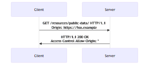
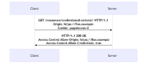

# 🌐 CORS 跨域资源共享

> CORS（Cross-Origin Resource Sharing）是一种基于 HTTP 头部的机制，允许服务器标示除了它自己以外的其他源（域、协议或端口），使得浏览器允许这些源访问加载自己的资源。

## 🎯 CORS 概述

### 📊 同源策略与跨域

| 概念 | 描述 | 作用 |
|------|------|------|
| **同源策略** | 浏览器安全基础策略 | 🛡️ 防止恶意脚本访问敏感数据 |
| **跨域请求** | 不同源之间的资源访问 | 🌐 实现资源共享和集成 |
| **CORS** | 安全的跨域解决方案 | ✅ 在安全前提下允许跨域访问 |

### 🔍 源的定义

```javascript
// 源（Origin）的组成
const origin = {
  protocol: 'https',
  domain: 'example.com',
  port: '443'
};

// 同源判断
function isSameOrigin(url1, url2) {
  const parse = (url) => {
    const a = document.createElement('a');
    a.href = url;
    return {
      protocol: a.protocol,
      hostname: a.hostname,
      port: a.port || (a.protocol === 'https:' ? '443' : '80')
    };
  };
  
  const origin1 = parse(url1);
  const origin2 = parse(url2);
  
  return origin1.protocol === origin2.protocol &&
         origin1.hostname === origin2.hostname &&
         origin1.port === origin2.port;
}

// 示例
console.log(isSameOrigin(
  'https://example.com:443/api',
  'https://example.com/data'
)); // true

console.log(isSameOrigin(
  'https://example.com',
  'http://example.com'
)); // false (协议不同)
```

## 📝 简单请求

### 🎯 简单请求条件

简单请求必须满足以下所有条件：

#### 🔧 允许的方法
- `GET`
- `HEAD` 
- `POST`

#### 📋 允许的头部字段
- `Accept`
- `Accept-Language`
- `Content-Language`
- `Content-Type`（有限制）
- `Range`（简单范围值）

#### 📄 Content-Type 限制
- `text/plain`
- `application/x-www-form-urlencoded`
- `multipart/form-data`

### 🔧 简单请求实现

```javascript
// 简单请求示例
class SimpleRequest {
  static async makeRequest(url, options = {}) {
    const defaultOptions = {
      method: 'GET',
      headers: {
        'Accept': 'application/json',
        'Content-Type': 'text/plain'
      }
    };
    
    const mergedOptions = { ...defaultOptions, ...options };
    
    try {
      const response = await fetch(url, mergedOptions);
      
      // 检查 CORS 头部
      const corsHeaders = this.extractCorsHeaders(response);
      console.log('🌐 CORS 头部:', corsHeaders);
      
      if (!response.ok) {
        throw new Error(`HTTP ${response.status}: ${response.statusText}`);
      }
      
      return {
        success: true,
        data: await response.json(),
        cors: corsHeaders
      };
    } catch (error) {
      return {
        success: false,
        error: error.message
      };
    }
  }
  
  static extractCorsHeaders(response) {
    return {
      'Access-Control-Allow-Origin': response.headers.get('Access-Control-Allow-Origin'),
      'Access-Control-Allow-Credentials': response.headers.get('Access-Control-Allow-Credentials'),
      'Access-Control-Expose-Headers': response.headers.get('Access-Control-Expose-Headers')
    };
  }
}

// 使用示例
SimpleRequest.makeRequest('https://api.example.com/data')
  .then(result => {
    if (result.success) {
      console.log('✅ 简单请求成功:', result.data);
    } else {
      console.error('❌ 请求失败:', result.error);
    }
  });
```

<div align="center">
  
</div>

## 🔍 预检请求

### 📋 预检触发条件

当请求不满足简单请求条件时，浏览器会发起预检请求：

#### 🚀 使用的方法
- `PUT`
- `DELETE`
- `CONNECT`
- `OPTIONS`
- `TRACE`
- `PATCH`

#### 📄 自定义头部
- 任何不在简单请求头部列表中的头部

#### 🔧 特殊 Content-Type
- `application/json`
- `application/xml`
- `text/xml`

### 🛠️ 预检请求处理

```javascript
// 预检请求处理器
class PreflightHandler {
  constructor(allowedOrigins = ['*']) {
    this.allowedOrigins = allowedOrigins;
    this.allowedMethods = ['GET', 'POST', 'PUT', 'DELETE', 'OPTIONS'];
    this.allowedHeaders = ['Content-Type', 'Authorization', 'X-Custom-Header'];
    this.maxAge = 86400; // 24 小时
  }
  
  handlePreflight(req, res) {
    const origin = req.headers.origin;
    const requestMethod = req.headers['access-control-request-method'];
    const requestHeaders = req.headers['access-control-request-headers'];
    
    console.log('🔍 预检请求详情:');
    console.log('Origin:', origin);
    console.log('Method:', requestMethod);
    console.log('Headers:', requestHeaders);
    
    // 验证源
    if (!this.isOriginAllowed(origin)) {
      return res.status(403).json({ error: '源不被允许' });
    }
    
    // 验证方法
    if (!this.allowedMethods.includes(requestMethod)) {
      return res.status(403).json({ error: '方法不被允许' });
    }
    
    // 验证头部
    const requestedHeaders = requestHeaders ? requestHeaders.split(',').map(h => h.trim()) : [];
    const unauthorizedHeaders = requestedHeaders.filter(header => 
      !this.allowedHeaders.includes(header)
    );
    
    if (unauthorizedHeaders.length > 0) {
      return res.status(403).json({ error: `头部不被允许: ${unauthorizedHeaders.join(', ')}` });
    }
    
    // 设置 CORS 头部
    this.setCorsHeaders(res, origin);
    
    res.status(204).send(); // No Content
  }
  
  setCorsHeaders(res, origin) {
    res.header('Access-Control-Allow-Origin', origin);
    res.header('Access-Control-Allow-Methods', this.allowedMethods.join(', '));
    res.header('Access-Control-Allow-Headers', this.allowedHeaders.join(', '));
    res.header('Access-Control-Max-Age', this.maxAge.toString());
    res.header('Access-Control-Allow-Credentials', 'true');
  }
  
  isOriginAllowed(origin) {
    if (this.allowedOrigins.includes('*')) {
      return true;
    }
    
    return this.allowedOrigins.includes(origin);
  }
  
  // Express 中间件
  middleware() {
    return (req, res, next) => {
      if (req.method === 'OPTIONS') {
        this.handlePreflight(req, res);
      } else {
        // 为实际请求设置 CORS 头部
        const origin = req.headers.origin;
        if (this.isOriginAllowed(origin)) {
          this.setCorsHeaders(res, origin);
        }
        next();
      }
    };
  }
}

// Express 应用中使用
const express = require('express');
const app = express();

const corsHandler = new PreflightHandler([
  'https://trusted-site.com',
  'https://another-site.com'
]);

app.use(corsHandler.middleware());

app.get('/api/data', (req, res) => {
  res.json({ message: '这是跨域数据' });
});
```

## 🍪 凭证请求

### 🔐 凭证包含

```javascript
// 携带凭证的请求
class CredentialRequest {
  static async makeRequestWithCredentials(url, options = {}) {
    const credentialOptions = {
      ...options,
      credentials: 'include', // 包含 cookies 和认证信息
      headers: {
        'Authorization': 'Bearer token123',
        'Content-Type': 'application/json',
        ...options.headers
      }
    };
    
    try {
      const response = await fetch(url, credentialOptions);
      
      // 检查服务器是否允许凭证
      const allowCredentials = response.headers.get('Access-Control-Allow-Credentials');
      if (!allowCredentials || allowCredentials !== 'true') {
        console.warn('⚠️ 服务器不允许凭证');
      }
      
      return response;
    } catch (error) {
      console.error('❌ 凭证请求失败:', error);
      throw error;
    }
  }
  
  static async makeRequestWithCookies(url, cookies) {
    const options = {
      method: 'GET',
      credentials: 'include',
      headers: {
        'Cookie': cookies
      }
    };
    
    return this.makeRequestWithCredentials(url, options);
  }
}

// 服务器端凭证处理
class CredentialCorsHandler {
  constructor(trustedOrigins) {
    this.trustedOrigins = trustedOrigins;
  }
  
  handleCredentialRequest(req, res, next) {
    const origin = req.headers.origin;
    
    // 凭证请求不能使用通配符
    if (this.trustedOrigins.includes(origin)) {
      res.header('Access-Control-Allow-Origin', origin);
      res.header('Access-Control-Allow-Credentials', 'true');
    } else {
      return res.status(403).json({ error: '源不被信任' });
    }
    
    next();
  }
}
```

<div align="center">
  
</div>

## 📊 CORS 头部详解

### 📤 请求头部

```javascript
// CORS 请求头部处理
class CorsRequestHeaders {
  static createCorsRequest(url, options = {}) {
    const corsHeaders = {
      // 标识请求的源
      'Origin': window.location.origin,
      
      // 预检请求：将要使用的方法
      'Access-Control-Request-Method': options.method || 'GET',
      
      // 预检请求：将要发送的头部
      'Access-Control-Request-Headers': options.customHeaders ? 
        Object.keys(options.customHeaders).join(', ') : null
    };
    
    // 移除空值
    Object.keys(corsHeaders).forEach(key => {
      if (corsHeaders[key] === null) {
        delete corsHeaders[key];
      }
    });
    
    return {
      ...options,
      headers: {
        ...corsHeaders,
        ...options.headers
      }
    };
  }
}
```

### 📥 响应头部

```javascript
// CORS 响应头部管理
class CorsResponseHeaders {
  constructor() {
    this.responseHeaders = {
      'Access-Control-Allow-Origin': null,
      'Access-Control-Allow-Methods': null,
      'Access-Control-Allow-Headers': null,
      'Access-Control-Allow-Credentials': null,
      'Access-Control-Expose-Headers': null,
      'Access-Control-Max-Age': null
    };
  }
  
  setAllowOrigin(origin) {
    this.responseHeaders['Access-Control-Allow-Origin'] = origin;
    return this;
  }
  
  setAllowMethods(methods) {
    this.responseHeaders['Access-Control-Allow-Methods'] = 
      Array.isArray(methods) ? methods.join(', ') : methods;
    return this;
  }
  
  setAllowHeaders(headers) {
    this.responseHeaders['Access-Control-Allow-Headers'] = 
      Array.isArray(headers) ? headers.join(', ') : headers;
    return this;
  }
  
  setAllowCredentials(allow = true) {
    this.responseHeaders['Access-Control-Allow-Credentials'] = allow.toString();
    return this;
  }
  
  setExposeHeaders(headers) {
    this.responseHeaders['Access-Control-Expose-Headers'] = 
      Array.isArray(headers) ? headers.join(', ') : headers;
    return this;
  }
  
  setMaxAge(seconds) {
    this.responseHeaders['Access-Control-Max-Age'] = seconds.toString();
    return this;
  }
  
  applyToResponse(res) {
    Object.entries(this.responseHeaders).forEach(([key, value]) => {
      if (value !== null) {
        res.setHeader(key, value);
      }
    });
  }
  
  getHeaders() {
    const headers = {};
    Object.entries(this.responseHeaders).forEach(([key, value]) => {
      if (value !== null) {
        headers[key] = value;
      }
    });
    return headers;
  }
}

// 使用示例
const corsHeaders = new CorsResponseHeaders()
  .setAllowOrigin('https://trusted-site.com')
  .setAllowMethods(['GET', 'POST', 'PUT', 'DELETE'])
  .setAllowHeaders(['Content-Type', 'Authorization'])
  .setAllowCredentials(true)
  .setExposeHeaders(['X-Total-Count'])
  .setMaxAge(3600);

console.log('🌐 CORS 响应头部:', corsHeaders.getHeaders());
```

## 🔧 实际应用场景

### 🎮 游戏 API 集成

```javascript
// 游戏数据 API 的 CORS 配置
class GameApiCors {
  constructor() {
    this.gameOrigins = [
      'https://game.example.com',
      'https://beta.game.example.com',
      'https://dev.game.example.com'
    ];
  }
  
  setupCors(app) {
    app.use((req, res, next) => {
      const origin = req.headers.origin;
      
      if (this.gameOrigins.includes(origin)) {
        res.header('Access-Control-Allow-Origin', origin);
        res.header('Access-Control-Allow-Methods', 'GET, POST, PUT, DELETE');
        res.header('Access-Control-Allow-Headers', 'Content-Type, Authorization, X-Game-Token');
        res.header('Access-Control-Allow-Credentials', 'true');
        res.header('Access-Control-Expose-Headers', 'X-Player-Score, X-Game-Level');
        res.header('Access-Control-Max-Age', '7200'); // 2 小时
      }
      
      if (req.method === 'OPTIONS') {
        res.sendStatus(204);
      } else {
        next();
      }
    });
    
    // 游戏数据接口
    app.get('/api/player/:id', (req, res) => {
      res.json({
        id: req.params.id,
        score: 12500,
        level: 15,
        achievements: ['first_win', 'speed_demon']
      });
    });
    
    app.post('/api/player/:id/score', (req, res) => {
      const { score } = req.body;
      res.header('X-Player-Score', score.toString());
      res.json({ success: true, newScore: score });
    });
  }
}
```

### 📊 数据分析服务

```javascript
// 数据分析服务的 CORS 处理
class AnalyticsCors {
  constructor() {
    this.dashboardOrigins = [
      'https://dashboard.analytics.com',
      'https://reports.company.com'
    ];
  }
  
  async handleAnalyticsRequest(req, res) {
    const origin = req.headers.origin;
    
    // 验证请求源
    if (!this.dashboardOrigins.includes(origin)) {
      return res.status(403).json({ error: '未授权的源' });
    }
    
    // 设置 CORS 头部
    res.header('Access-Control-Allow-Origin', origin);
    res.header('Access-Control-Allow-Credentials', 'true');
    res.header('Access-Control-Expose-Headers', 'X-Data-Source, X-Query-Time');
    
    // 处理分析数据
    const queryTime = Date.now();
    const analyticsData = await this.fetchAnalyticsData(req.query);
    const responseTime = Date.now() - queryTime;
    
    res.header('X-Data-Source', 'analytics-engine-v2');
    res.header('X-Query-Time', responseTime.toString());
    
    res.json(analyticsData);
  }
  
  async fetchAnalyticsData(query) {
    // 模拟数据获取
    return {
      period: query.period || '7d',
      metrics: {
        pageViews: 125000,
        users: 8500,
        sessions: 12000
      },
      timestamp: new Date().toISOString()
    };
  }
}
```

### 🛒 电商 API 集成

```javascript
// 电商平台的 CORS 配置
class EcommerceCors {
  constructor() {
    this.partnerOrigins = new Map([
      ['https://partner1.com', { products: true, orders: false }],
      ['https://partner2.com', { products: true, orders: true }],
      ['https://mobile.partner.com', { products: true, orders: true, payments: false }]
    ]);
  }
  
  checkPermission(origin, resource) {
    const permissions = this.partnerOrigins.get(origin);
    return permissions && permissions[resource] === true;
  }
  
  corsMiddleware() {
    return (req, res, next) => {
      const origin = req.headers.origin;
      
      if (!this.partnerOrigins.has(origin)) {
        return res.status(403).json({ error: '未授权的合作伙伴' });
      }
      
      // 基础 CORS 头部
      res.header('Access-Control-Allow-Origin', origin);
      res.header('Access-Control-Allow-Credentials', 'true');
      res.header('Access-Control-Allow-Methods', 'GET, POST, PUT, DELETE');
      res.header('Access-Control-Allow-Headers', 'Content-Type, Authorization, X-Partner-ID');
      
      // 根据资源类型设置不同的暴露头部
      const resource = this.getResourceFromPath(req.path);
      const exposeHeaders = this.getExposeHeaders(resource);
      res.header('Access-Control-Expose-Headers', exposeHeaders.join(', '));
      
      if (req.method === 'OPTIONS') {
        res.sendStatus(204);
      } else {
        next();
      }
    };
  }
  
  getResourceFromPath(path) {
    if (path.includes('/products')) return 'products';
    if (path.includes('/orders')) return 'orders';
    if (path.includes('/payments')) return 'payments';
    return 'general';
  }
  
  getExposeHeaders(resource) {
    const baseHeaders = ['X-Rate-Limit-Remaining', 'X-Request-ID'];
    
    switch (resource) {
      case 'products':
        return [...baseHeaders, 'X-Total-Products', 'X-Category-Count'];
      case 'orders':
        return [...baseHeaders, 'X-Order-Status', 'X-Tracking-Number'];
      case 'payments':
        return [...baseHeaders, 'X-Transaction-ID', 'X-Payment-Status'];
      default:
        return baseHeaders;
    }
  }
  
  resourcePermissionCheck() {
    return (req, res, next) => {
      const origin = req.headers.origin;
      const resource = this.getResourceFromPath(req.path);
      
      if (!this.checkPermission(origin, resource)) {
        return res.status(403).json({ 
          error: `合作伙伴无权访问 ${resource} 资源` 
        });
      }
      
      next();
    };
  }
}
```

## 🛡️ 安全策略

### 🔒 COEP 跨域嵌入策略

```javascript
// 跨域嵌入策略实现
class CoepPolicy {
  constructor(policy = 'require-corp') {
    this.policy = policy; // 'unsafe-none' | 'require-corp' | 'credentialless'
  }
  
  middleware() {
    return (req, res, next) => {
      res.header('Cross-Origin-Embedder-Policy', this.policy);
      
      // 如果使用 require-corp，检查资源是否有适当的 CORP 头部
      if (this.policy === 'require-corp') {
        this.checkResourcePolicy(req, res);
      }
      
      next();
    };
  }
  
  checkResourcePolicy(req, res) {
    // 为不同资源类型设置适当的 CORP 头部
    const resourceType = this.getResourceType(req.path);
    
    switch (resourceType) {
      case 'image':
        res.header('Cross-Origin-Resource-Policy', 'cross-origin');
        break;
      case 'script':
        res.header('Cross-Origin-Resource-Policy', 'same-site');
        break;
      case 'api':
        res.header('Cross-Origin-Resource-Policy', 'same-origin');
        break;
      default:
        res.header('Cross-Origin-Resource-Policy', 'same-origin');
    }
  }
  
  getResourceType(path) {
    if (path.match(/\.(jpg|jpeg|png|gif|webp|svg)$/)) return 'image';
    if (path.match(/\.(js|mjs)$/)) return 'script';
    if (path.startsWith('/api/')) return 'api';
    return 'other';
  }
}
```

### 🔐 CORP 跨域资源策略

```javascript
// 跨域资源策略管理
class CorpPolicy {
  constructor() {
    this.policies = {
      'same-origin': 'same-origin',
      'same-site': 'same-site', 
      'cross-origin': 'cross-origin'
    };
  }
  
  setResourcePolicy(resourceType, policy) {
    if (!this.policies[policy]) {
      throw new Error(`无效的 CORP 策略: ${policy}`);
    }
    
    return (req, res, next) => {
      const currentType = this.getResourceType(req);
      
      if (currentType === resourceType || resourceType === '*') {
        res.header('Cross-Origin-Resource-Policy', policy);
      }
      
      next();
    };
  }
  
  getResourceType(req) {
    const contentType = req.headers['content-type'];
    const path = req.path;
    
    if (path.match(/\.(jpg|jpeg|png|gif|webp|svg)$/)) return 'image';
    if (path.match(/\.(js|mjs)$/)) return 'script';
    if (path.match(/\.(css)$/)) return 'style';
    if (path.startsWith('/api/')) return 'api';
    if (contentType && contentType.includes('application/json')) return 'json';
    
    return 'other';
  }
  
  createPolicyMiddleware(config) {
    return (req, res, next) => {
      const resourceType = this.getResourceType(req);
      const policy = config[resourceType] || config.default || 'same-origin';
      
      res.header('Cross-Origin-Resource-Policy', policy);
      next();
    };
  }
}

// 使用示例
const corpPolicy = new CorpPolicy();

const policyConfig = {
  'image': 'cross-origin',    // 图片允许跨域
  'script': 'same-site',      // 脚本限制为同站点
  'api': 'same-origin',       // API 限制为同源
  'default': 'same-origin'    // 默认策略
};

const policyMiddleware = corpPolicy.createPolicyMiddleware(policyConfig);
```

### 🚪 COOP 跨域打开策略

```javascript
// 跨域打开策略实现
class CoopPolicy {
  constructor(policy = 'same-origin') {
    this.validPolicies = [
      'unsafe-none',
      'same-origin',
      'same-origin-allow-popups'
    ];
    
    if (!this.validPolicies.includes(policy)) {
      throw new Error(`无效的 COOP 策略: ${policy}`);
    }
    
    this.policy = policy;
  }
  
  middleware() {
    return (req, res, next) => {
      res.header('Cross-Origin-Opener-Policy', this.policy);
      
      // 根据策略设置额外的安全头部
      if (this.policy === 'same-origin') {
        this.enableSecurityFeatures(res);
      }
      
      next();
    };
  }
  
  enableSecurityFeatures(res) {
    // 启用需要隔离的高级功能
    res.header('Cross-Origin-Embedder-Policy', 'require-corp');
    
    // 设置额外的安全头部
    res.header('X-Frame-Options', 'SAMEORIGIN');
    res.header('X-Content-Type-Options', 'nosniff');
  }
  
  checkIsolationRequirements(req, res, next) {
    // 检查是否需要进程隔离
    const needsIsolation = this.detectHighValueOperation(req);
    
    if (needsIsolation && this.policy === 'unsafe-none') {
      return res.status(400).json({
        error: '此操作需要启用 COOP same-origin 策略'
      });
    }
    
    next();
  }
  
  detectHighValueOperation(req) {
    // 检测需要高安全性的操作
    return req.path.includes('/secure/') || 
           req.path.includes('/admin/') ||
           req.headers['x-requires-isolation'] === 'true';
  }
}
```

## 🎯 最佳实践

### 🏆 安全配置建议

```javascript
// CORS 安全配置最佳实践
class SecureCorsConfiguration {
  constructor() {
    this.securityConfig = {
      // 严格的源验证
      originValidation: 'strict',
      
      // 禁用通配符（生产环境）
      allowWildcard: false,
      
      // 凭证处理
      credentialsPolicy: 'explicit-only',
      
      // 预检缓存时间
      maxAge: 7200, // 2 小时
      
      // 错误处理
      errorResponse: 'minimal'
    };
  }
  
  createSecureCorsMiddleware(config) {
    return (req, res, next) => {
      const origin = req.headers.origin;
      
      // 1. 严格的源验证
      if (!this.isOriginTrusted(origin, config.trustedOrigins)) {
        return this.handleUntrustedOrigin(req, res);
      }
      
      // 2. 方法验证
      if (req.method === 'OPTIONS') {
        return this.handlePreflightRequest(req, res, config);
      }
      
      // 3. 设置安全的 CORS 头部
      this.setSecureCorsHeaders(res, origin, config);
      
      // 4. 记录 CORS 请求（用于监控）
      this.logCorsRequest(req, origin);
      
      next();
    };
  }
  
  isOriginTrusted(origin, trustedOrigins) {
    if (!origin) return false; // 拒绝无 Origin 的请求
    
    // 精确匹配
    if (trustedOrigins.includes(origin)) return true;
    
    // 子域名匹配（如果配置允许）
    return trustedOrigins.some(trusted => {
      if (trusted.startsWith('*.')) {
        const domain = trusted.substring(2);
        return origin.endsWith('.' + domain) || origin === domain;
      }
      return false;
    });
  }
  
  handlePreflightRequest(req, res, config) {
    const origin = req.headers.origin;
    const method = req.headers['access-control-request-method'];
    const headers = req.headers['access-control-request-headers'];
    
    // 验证请求的方法
    if (!config.allowedMethods.includes(method)) {
      return res.status(405).json({ error: 'Method not allowed' });
    }
    
    // 验证请求的头部
    if (headers) {
      const requestedHeaders = headers.split(',').map(h => h.trim().toLowerCase());
      const unauthorizedHeaders = requestedHeaders.filter(header => 
        !config.allowedHeaders.map(h => h.toLowerCase()).includes(header)
      );
      
      if (unauthorizedHeaders.length > 0) {
        return res.status(400).json({ error: 'Headers not allowed' });
      }
    }
    
    // 设置预检响应头部
    res.header('Access-Control-Allow-Origin', origin);
    res.header('Access-Control-Allow-Methods', config.allowedMethods.join(', '));
    res.header('Access-Control-Allow-Headers', config.allowedHeaders.join(', '));
    res.header('Access-Control-Max-Age', this.securityConfig.maxAge.toString());
    
    if (config.allowCredentials) {
      res.header('Access-Control-Allow-Credentials', 'true');
    }
    
    res.status(204).send();
  }
  
  setSecureCorsHeaders(res, origin, config) {
    res.header('Access-Control-Allow-Origin', origin);
    
    if (config.exposeHeaders) {
      res.header('Access-Control-Expose-Headers', config.exposeHeaders.join(', '));
    }
    
    if (config.allowCredentials) {
      res.header('Access-Control-Allow-Credentials', 'true');
    }
    
    // 添加安全头部
    res.header('Vary', 'Origin');
    res.header('X-Content-Type-Options', 'nosniff');
  }
  
  handleUntrustedOrigin(req, res) {
    // 记录可疑请求
    console.warn(`🚨 CORS: 不受信任的源尝试访问: ${req.headers.origin}`);
    
    // 返回最小错误信息
    res.status(403).json({ error: 'Forbidden' });
  }
  
  logCorsRequest(req, origin) {
    console.log(`🌐 CORS 请求: ${req.method} ${req.path} from ${origin}`);
  }
}

// 生产环境配置示例
const secureCors = new SecureCorsConfiguration();

const productionConfig = {
  trustedOrigins: [
    'https://myapp.com',
    'https://admin.myapp.com',
    '*.myapp.com' // 允许子域名
  ],
  allowedMethods: ['GET', 'POST', 'PUT', 'DELETE'],
  allowedHeaders: ['Content-Type', 'Authorization'],
  exposeHeaders: ['X-Total-Count'],
  allowCredentials: true
};

const corsMiddleware = secureCors.createSecureCorsMiddleware(productionConfig);
```

### 📊 CORS 监控

```javascript
// CORS 请求监控
class CorsMonitor {
  constructor() {
    this.metrics = {
      totalRequests: 0,
      preflightRequests: 0,
      blockedRequests: 0,
      allowedOrigins: new Set(),
      blockedOrigins: new Set()
    };
  }
  
  createMonitoringMiddleware() {
    return (req, res, next) => {
      this.metrics.totalRequests++;
      
      if (req.method === 'OPTIONS') {
        this.metrics.preflightRequests++;
      }
      
      const origin = req.headers.origin;
      if (origin) {
        this.metrics.allowedOrigins.add(origin);
      }
      
      // 监听响应状态
      const originalSend = res.send;
      res.send = function(body) {
        if (res.statusCode === 403) {
          this.metrics.blockedRequests++;
          if (origin) {
            this.metrics.blockedOrigins.add(origin);
          }
        }
        originalSend.call(this, body);
      }.bind(this);
      
      next();
    };
  }
  
  getMetrics() {
    return {
      ...this.metrics,
      allowedOrigins: Array.from(this.metrics.allowedOrigins),
      blockedOrigins: Array.from(this.metrics.blockedOrigins),
      blockRate: this.metrics.blockedRequests / this.metrics.totalRequests
    };
  }
  
  generateReport() {
    const metrics = this.getMetrics();
    
    console.log('📊 CORS 监控报告:');
    console.log(`总请求数: ${metrics.totalRequests}`);
    console.log(`预检请求数: ${metrics.preflightRequests}`);
    console.log(`被阻止请求数: ${metrics.blockedRequests}`);
    console.log(`阻止率: ${(metrics.blockRate * 100).toFixed(2)}%`);
    console.log(`允许的源: ${metrics.allowedOrigins.length} 个`);
    console.log(`被阻止的源: ${metrics.blockedOrigins.length} 个`);
    
    return metrics;
  }
}
```

## 📚 相关资源

### 🔗 官方文档
- [MDN CORS](https://developer.mozilla.org/en-US/docs/Web/HTTP/CORS)
- [W3C CORS Specification](https://www.w3.org/TR/cors/)
- [Fetch Living Standard](https://fetch.spec.whatwg.org/)

### 🛠️ 工具和库
- [cors](https://github.com/expressjs/cors) - Express CORS 中间件
- [CORS Tester](https://cors-test.codehappy.dev/) - CORS 配置测试工具
- [Postman](https://www.postman.com/) - API 测试工具

### 📖 深入学习
- [CORS 安全最佳实践](https://developer.mozilla.org/en-US/docs/Web/Security)
- [跨域请求安全指南](https://owasp.org/www-community/vulnerabilities/CORS_OriginHeaderScrutiny)
- [浏览器安全策略](https://web.dev/security/)

---

::: tip 💡 小贴士
在生产环境中，避免使用通配符 `*` 作为 `Access-Control-Allow-Origin` 的值，特别是在允许凭证的情况下。始终明确指定受信任的源。
:::

::: warning ⚠️ 注意
CORS 是浏览器的安全机制，不能防护服务器端的攻击。确保在服务器端也进行适当的验证和授权检查。
:::
