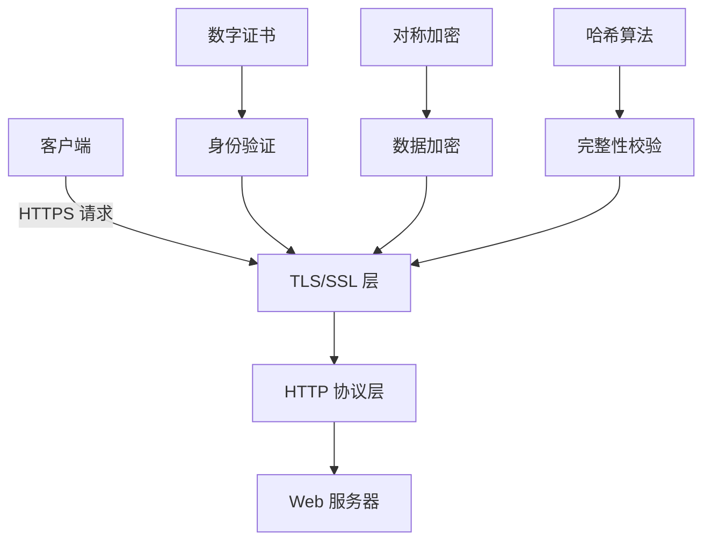
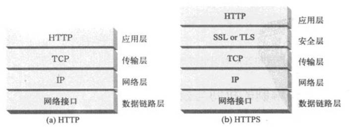
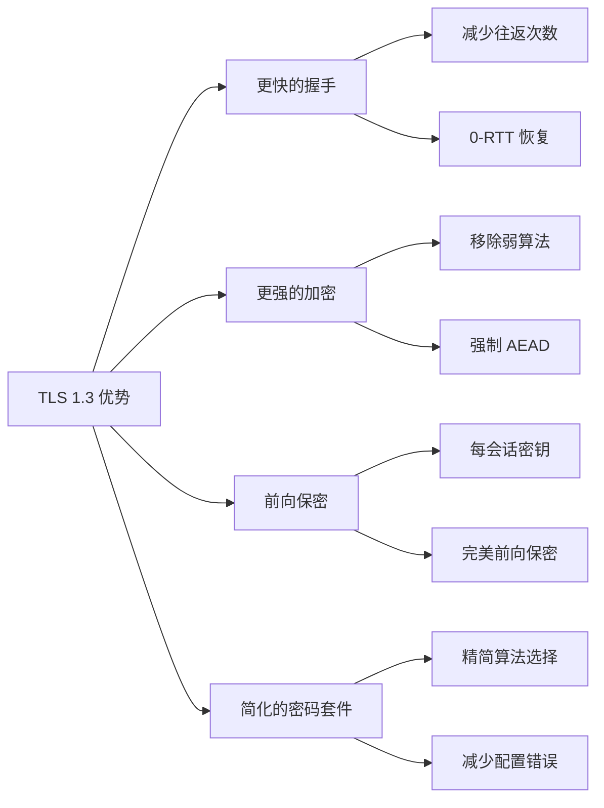
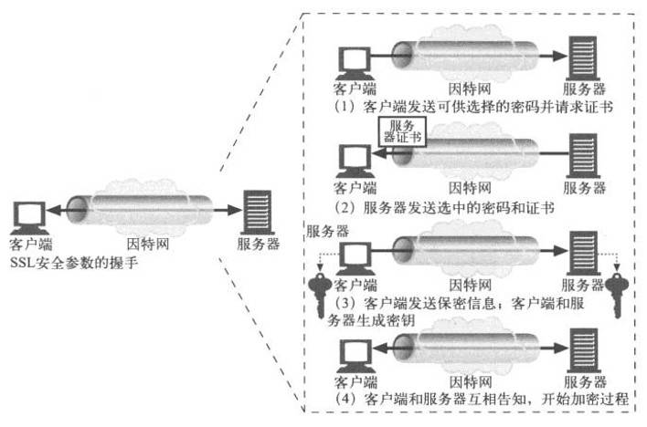
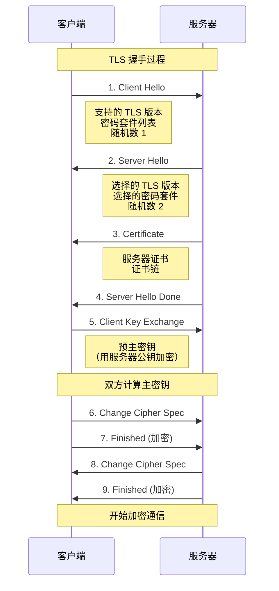

# 🔐 HTTPS 安全传输协议

> HTTPS（Hyper Text Transfer Protocol Secure）是 HTTP 协议的安全版本，通过 TLS/SSL 加密层为 Web 通信提供身份验证、数据完整性和机密性保护。在现代 Web 开发中，HTTPS 已成为标准配置。

## 🎯 HTTPS 概述

### 📊 核心特性

| 特性 | 描述 | 作用 |
|------|------|------|
| **身份验证** | 验证服务器身份 | 🛡️ 防止中间人攻击 |
| **数据加密** | 传输数据加密保护 | 🔐 保护数据隐私 |
| **完整性校验** | 检测数据篡改 | ✅ 确保数据完整 |
| **前向保密** | 密钥泄露不影响历史会话 | 🔒 增强长期安全性 |

### 🏗️ HTTPS 架构



### 🔄 HTTP vs HTTPS

| 对比项 | HTTP | HTTPS |
|--------|------|-------|
| **端口** | 80 | 443 |
| **安全性** | 明文传输 | 加密传输 |
| **身份验证** | 无 | 数字证书 |
| **数据完整性** | 无保护 | 哈希校验 |
| **SEO 影响** | 标准 | 搜索引擎优先 |
| **性能开销** | 最小 | 略高（可接受） |

<div align="center">
  
</div>

## 🔒 TLS 传输层安全

### 📊 TLS 版本比较

| 版本 | 发布年份 | 安全性 | 支持状态 | 特点 |
|------|----------|--------|----------|------|
| **TLS 1.0** | 1999 | 🔴 低 | 已废弃 | 存在安全漏洞 |
| **TLS 1.1** | 2006 | 🟡 中 | 已废弃 | 改进了安全性 |
| **TLS 1.2** | 2008 | 🟢 高 | 广泛支持 | 稳定可靠 |
| **TLS 1.3** | 2018 | 🟢 最高 | 现代标准 | 性能和安全性最佳 |

### 🚀 TLS 1.3 优势



### 🔧 TLS 配置示例

```javascript
// Node.js HTTPS 服务器配置
const https = require('https');
const fs = require('fs');

const tlsOptions = {
  // 证书配置
  key: fs.readFileSync('private-key.pem'),
  cert: fs.readFileSync('certificate.pem'),
  ca: fs.readFileSync('ca-certificate.pem'), // 可选的 CA 证书
  
  // TLS 版本配置
  secureProtocol: 'TLSv1_2_method', // 或 'TLSv1_3_method'
  minVersion: 'TLSv1.2',
  maxVersion: 'TLSv1.3',
  
  // 密码套件配置
  ciphers: [
    'ECDHE-RSA-AES128-GCM-SHA256',
    'ECDHE-RSA-AES256-GCM-SHA384',
    'ECDHE-RSA-CHACHA20-POLY1305',
    'ECDHE-ECDSA-AES128-GCM-SHA256',
    'ECDHE-ECDSA-AES256-GCM-SHA384',
    'ECDHE-ECDSA-CHACHA20-POLY1305'
  ].join(':'),
  
  // 安全选项
  honorCipherOrder: true,          // 优先使用服务器密码套件顺序
  secureOptions: require('constants').SSL_OP_NO_TLSv1 | 
                 require('constants').SSL_OP_NO_TLSv1_1, // 禁用旧版本
  
  // OCSP 装订
  requestOCSP: true
};

// 创建 HTTPS 服务器
const server = https.createServer(tlsOptions, (req, res) => {
  res.writeHead(200, { 'Content-Type': 'text/plain' });
  res.end('Hello Secure World!\n');
});

server.listen(443, () => {
  console.log('🔐 HTTPS 服务器运行在端口 443');
});

// TLS 连接事件监听
server.on('secureConnection', (tlsSocket) => {
  console.log('🔒 安全连接建立');
  console.log('协议版本:', tlsSocket.getProtocol());
  console.log('密码套件:', tlsSocket.getCipher());
  console.log('证书指纹:', tlsSocket.getPeerCertificate().fingerprint);
});
```

## 🔐 加密算法详解

### 🎯 对称加密

```javascript
// 对称加密示例（AES）
const crypto = require('crypto');

class SymmetricEncryption {
  constructor(algorithm = 'aes-256-gcm') {
    this.algorithm = algorithm;
  }
  
  generateKey() {
    return crypto.randomBytes(32); // 256 位密钥
  }
  
  encrypt(text, key) {
    const iv = crypto.randomBytes(16); // 初始化向量
    const cipher = crypto.createCipher(this.algorithm, key);
    
    cipher.setAAD(Buffer.from('additional-data')); // 附加认证数据
    
    let encrypted = cipher.update(text, 'utf8', 'hex');
    encrypted += cipher.final('hex');
    
    const authTag = cipher.getAuthTag(); // 获取认证标签
    
    return {
      encrypted,
      iv: iv.toString('hex'),
      authTag: authTag.toString('hex')
    };
  }
  
  decrypt(encryptedData, key) {
    const decipher = crypto.createDecipher(this.algorithm, key);
    
    decipher.setAAD(Buffer.from('additional-data'));
    decipher.setAuthTag(Buffer.from(encryptedData.authTag, 'hex'));
    
    let decrypted = decipher.update(encryptedData.encrypted, 'hex', 'utf8');
    decrypted += decipher.final('utf8');
    
    return decrypted;
  }
}

// 使用示例
const symEncryption = new SymmetricEncryption();
const key = symEncryption.generateKey();
const plaintext = '这是需要加密的敏感信息';

const encrypted = symEncryption.encrypt(plaintext, key);
console.log('🔐 加密结果:', encrypted);

const decrypted = symEncryption.decrypt(encrypted, key);
console.log('🔓 解密结果:', decrypted);
```

### 🔑 非对称加密

```javascript
// 非对称加密示例（RSA）
class AsymmetricEncryption {
  constructor() {
    this.keyPair = this.generateKeyPair();
  }
  
  generateKeyPair() {
    return crypto.generateKeyPairSync('rsa', {
      modulusLength: 2048,
      publicKeyEncoding: {
        type: 'spki',
        format: 'pem'
      },
      privateKeyEncoding: {
        type: 'pkcs8',
        format: 'pem'
      }
    });
  }
  
  encrypt(text) {
    const buffer = Buffer.from(text, 'utf8');
    const encrypted = crypto.publicEncrypt(this.keyPair.publicKey, buffer);
    return encrypted.toString('base64');
  }
  
  decrypt(encryptedText) {
    const buffer = Buffer.from(encryptedText, 'base64');
    const decrypted = crypto.privateDecrypt(this.keyPair.privateKey, buffer);
    return decrypted.toString('utf8');
  }
  
  sign(text) {
    const sign = crypto.createSign('SHA256');
    sign.update(text);
    sign.end();
    
    const signature = sign.sign(this.keyPair.privateKey);
    return signature.toString('base64');
  }
  
  verify(text, signature) {
    const verify = crypto.createVerify('SHA256');
    verify.update(text);
    verify.end();
    
    return verify.verify(this.keyPair.publicKey, signature, 'base64');
  }
}

// 使用示例
const asymEncryption = new AsymmetricEncryption();
const message = '需要签名和加密的消息';

// 数字签名
const signature = asymEncryption.sign(message);
const isValid = asymEncryption.verify(message, signature);
console.log('🖊️ 签名验证:', isValid);

// 加密解密（注意：RSA 有长度限制）
const shortMessage = 'Hello';
const encrypted = asymEncryption.encrypt(shortMessage);
const decrypted = asymEncryption.decrypt(encrypted);
console.log('🔐 加密解密:', shortMessage === decrypted);
```

### 🔍 哈希算法

```javascript
// 哈希算法实现
class HashAlgorithms {
  static supportedAlgorithms = ['md5', 'sha1', 'sha256', 'sha384', 'sha512'];
  
  static hash(data, algorithm = 'sha256') {
    if (!this.supportedAlgorithms.includes(algorithm)) {
      throw new Error(`不支持的哈希算法: ${algorithm}`);
    }
    
    const hash = crypto.createHash(algorithm);
    hash.update(data);
    return hash.digest('hex');
  }
  
  static hmac(data, key, algorithm = 'sha256') {
    const hmac = crypto.createHmac(algorithm, key);
    hmac.update(data);
    return hmac.digest('hex');
  }
  
  static verifyIntegrity(data, expectedHash, algorithm = 'sha256') {
    const actualHash = this.hash(data, algorithm);
    return actualHash === expectedHash;
  }
  
  static generateSalt(length = 16) {
    return crypto.randomBytes(length).toString('hex');
  }
  
  static hashWithSalt(password, salt = null) {
    if (!salt) {
      salt = this.generateSalt();
    }
    
    const hash = this.hash(password + salt, 'sha256');
    return { hash, salt };
  }
  
  static verifyPassword(password, storedHash, salt) {
    const { hash } = this.hashWithSalt(password, salt);
    return hash === storedHash;
  }
}

// 使用示例
const data = 'Hello, World!';
const hash = HashAlgorithms.hash(data, 'sha256');
console.log('📊 SHA256 哈希:', hash);

// 密码哈希
const password = 'mySecurePassword123';
const { hash: passwordHash, salt } = HashAlgorithms.hashWithSalt(password);
console.log('🔐 密码哈希:', passwordHash);
console.log('🧂 盐值:', salt);

// 密码验证
const isPasswordValid = HashAlgorithms.verifyPassword(password, passwordHash, salt);
console.log('✅ 密码验证:', isPasswordValid);
```

## 📜 数字证书机制

### 🏗️ 证书结构

```javascript
// 数字证书信息解析
class CertificateParser {
  static parseCertificate(certPem) {
    const cert = new crypto.X509Certificate(certPem);
    
    return {
      // 基本信息
      subject: cert.subject,
      issuer: cert.issuer,
      serialNumber: cert.serialNumber,
      
      // 有效期
      validFrom: cert.validFrom,
      validTo: cert.validTo,
      
      // 公钥信息
      publicKey: {
        algorithm: cert.publicKey.asymmetricKeyType,
        size: cert.publicKey.asymmetricKeySize
      },
      
      // 扩展信息
      subjectAltName: cert.subjectAltName,
      keyUsage: cert.keyUsage,
      
      // 指纹
      fingerprint: cert.fingerprint,
      fingerprint256: cert.fingerprint256
    };
  }
  
  static validateCertificate(certPem, caPem = null) {
    try {
      const cert = new crypto.X509Certificate(certPem);
      const now = new Date();
      
      // 检查有效期
      const validFrom = new Date(cert.validFrom);
      const validTo = new Date(cert.validTo);
      
      if (now < validFrom) {
        return { valid: false, reason: '证书尚未生效' };
      }
      
      if (now > validTo) {
        return { valid: false, reason: '证书已过期' };
      }
      
      // 如果提供了 CA 证书，验证签名
      if (caPem) {
        const isValidSignature = cert.verify(new crypto.X509Certificate(caPem).publicKey);
        if (!isValidSignature) {
          return { valid: false, reason: '证书签名无效' };
        }
      }
      
      return { valid: true, reason: '证书有效' };
    } catch (error) {
      return { valid: false, reason: `证书解析失败: ${error.message}` };
    }
  }
  
  static extractDomainNames(certPem) {
    const cert = new crypto.X509Certificate(certPem);
    const domains = [];
    
    // 从 Subject 中提取 CN
    const subjectMatch = cert.subject.match(/CN=([^,]+)/);
    if (subjectMatch) {
      domains.push(subjectMatch[1]);
    }
    
    // 从 SAN 中提取域名
    if (cert.subjectAltName) {
      const sanDomains = cert.subjectAltName
        .split(', ')
        .filter(san => san.startsWith('DNS:'))
        .map(san => san.substring(4));
      
      domains.push(...sanDomains);
    }
    
    return [...new Set(domains)]; // 去重
  }
}

// 证书验证示例
async function validateWebsiteCertificate(hostname, port = 443) {
  return new Promise((resolve, reject) => {
    const options = {
      host: hostname,
      port: port,
      rejectUnauthorized: false // 仅用于获取证书信息
    };
    
    const socket = require('tls').connect(options, () => {
      const cert = socket.getPeerCertificate();
      const certPem = cert.raw.toString('base64');
      
      const info = CertificateParser.parseCertificate(
        `-----BEGIN CERTIFICATE-----\n${certPem}\n-----END CERTIFICATE-----`
      );
      
      const validation = CertificateParser.validateCertificate(
        `-----BEGIN CERTIFICATE-----\n${certPem}\n-----END CERTIFICATE-----`
      );
      
      socket.end();
      
      resolve({
        hostname,
        certificate: info,
        validation,
        tlsVersion: socket.getProtocol(),
        cipher: socket.getCipher()
      });
    });
    
    socket.on('error', reject);
  });
}
```

### 🔗 证书链验证

```javascript
// 证书链验证
class CertificateChain {
  constructor() {
    this.trustedRoots = new Set(); // 受信任的根证书
  }
  
  addTrustedRoot(rootCertPem) {
    this.trustedRoots.add(rootCertPem);
  }
  
  buildChain(leafCert, intermediateCerts = []) {
    const chain = [leafCert];
    let currentCert = leafCert;
    
    // 构建证书链
    while (true) {
      const issuerCert = this.findIssuer(currentCert, intermediateCerts);
      
      if (!issuerCert) {
        break; // 找不到颁发者证书
      }
      
      if (this.isSelfSigned(issuerCert)) {
        chain.push(issuerCert);
        break; // 到达根证书
      }
      
      chain.push(issuerCert);
      currentCert = issuerCert;
    }
    
    return chain;
  }
  
  validateChain(chain) {
    const results = [];
    
    for (let i = 0; i < chain.length - 1; i++) {
      const cert = new crypto.X509Certificate(chain[i]);
      const issuerCert = new crypto.X509Certificate(chain[i + 1]);
      
      const isValid = cert.verify(issuerCert.publicKey);
      results.push({
        index: i,
        subject: cert.subject,
        issuer: cert.issuer,
        valid: isValid
      });
    }
    
    // 验证根证书是否受信任
    const rootCert = chain[chain.length - 1];
    const isTrusted = this.trustedRoots.has(rootCert);
    
    return {
      chainValid: results.every(r => r.valid),
      rootTrusted: isTrusted,
      details: results
    };
  }
  
  findIssuer(certPem, candidates) {
    const cert = new crypto.X509Certificate(certPem);
    
    for (const candidatePem of candidates) {
      const candidate = new crypto.X509Certificate(candidatePem);
      
      if (cert.issuer === candidate.subject) {
        return candidatePem;
      }
    }
    
    return null;
  }
  
  isSelfSigned(certPem) {
    const cert = new crypto.X509Certificate(certPem);
    return cert.subject === cert.issuer;
  }
}
```

## 🤝 TLS 握手过程

### 📋 握手步骤详解

<div align="center">
  
</div>



### 🔧 握手实现模拟

```javascript
// TLS 握手模拟器
class TLSHandshakeSimulator {
  constructor() {
    this.supportedVersions = ['TLSv1.2', 'TLSv1.3'];
    this.supportedCipherSuites = [
      'TLS_ECDHE_RSA_WITH_AES_128_GCM_SHA256',
      'TLS_ECDHE_RSA_WITH_AES_256_GCM_SHA384',
      'TLS_ECDHE_RSA_WITH_CHACHA20_POLY1305_SHA256'
    ];
  }
  
  simulateHandshake(clientOptions, serverOptions) {
    const handshake = {
      steps: [],
      messages: [],
      selectedVersion: null,
      selectedCipherSuite: null,
      sessionKeys: null
    };
    
    // Step 1: Client Hello
    const clientHello = this.createClientHello(clientOptions);
    handshake.steps.push('Client Hello');
    handshake.messages.push(clientHello);
    
    // Step 2: Server Hello
    const serverHello = this.createServerHello(clientHello, serverOptions);
    handshake.steps.push('Server Hello');
    handshake.messages.push(serverHello);
    handshake.selectedVersion = serverHello.selectedVersion;
    handshake.selectedCipherSuite = serverHello.selectedCipherSuite;
    
    // Step 3: Certificate
    const certificate = this.createCertificateMessage(serverOptions);
    handshake.steps.push('Certificate');
    handshake.messages.push(certificate);
    
    // Step 4: Server Hello Done
    handshake.steps.push('Server Hello Done');
    handshake.messages.push({ type: 'ServerHelloDone' });
    
    // Step 5: Client Key Exchange
    const keyExchange = this.createKeyExchange(certificate);
    handshake.steps.push('Client Key Exchange');
    handshake.messages.push(keyExchange);
    
    // 计算会话密钥
    handshake.sessionKeys = this.computeSessionKeys(
      clientHello.random,
      serverHello.random,
      keyExchange.preMasterSecret
    );
    
    // Step 6-9: Change Cipher Spec & Finished
    handshake.steps.push('Change Cipher Spec (Client)');
    handshake.steps.push('Finished (Client)');
    handshake.steps.push('Change Cipher Spec (Server)');
    handshake.steps.push('Finished (Server)');
    
    return handshake;
  }
  
  createClientHello(options) {
    return {
      type: 'ClientHello',
      version: 'TLSv1.3',
      random: crypto.randomBytes(32).toString('hex'),
      sessionId: crypto.randomBytes(16).toString('hex'),
      cipherSuites: options.cipherSuites || this.supportedCipherSuites,
      compressionMethods: ['null'],
      extensions: {
        serverName: options.serverName || 'example.com',
        supportedVersions: this.supportedVersions,
        signatureAlgorithms: ['rsa_pss_rsae_sha256', 'ecdsa_secp256r1_sha256'],
        supportedGroups: ['secp256r1', 'x25519'],
        keyShare: 'generated_key_share'
      }
    };
  }
  
  createServerHello(clientHello, serverOptions) {
    // 选择最高支持的 TLS 版本
    const commonVersions = this.supportedVersions.filter(v => 
      clientHello.extensions.supportedVersions.includes(v)
    );
    const selectedVersion = commonVersions[commonVersions.length - 1];
    
    // 选择密码套件
    const commonCipherSuites = this.supportedCipherSuites.filter(cs =>
      clientHello.cipherSuites.includes(cs)
    );
    const selectedCipherSuite = commonCipherSuites[0];
    
    return {
      type: 'ServerHello',
      selectedVersion,
      selectedCipherSuite,
      random: crypto.randomBytes(32).toString('hex'),
      sessionId: clientHello.sessionId,
      extensions: {
        keyShare: 'server_key_share'
      }
    };
  }
  
  createCertificateMessage(serverOptions) {
    return {
      type: 'Certificate',
      certificateChain: serverOptions.certificateChain || [
        '-----BEGIN CERTIFICATE-----\n...\n-----END CERTIFICATE-----'
      ]
    };
  }
  
  createKeyExchange(certificate) {
    // 模拟生成预主密钥
    const preMasterSecret = crypto.randomBytes(48);
    
    return {
      type: 'ClientKeyExchange',
      preMasterSecret: preMasterSecret.toString('hex'),
      encryptedPreMasterSecret: 'encrypted_with_server_public_key'
    };
  }
  
  computeSessionKeys(clientRandom, serverRandom, preMasterSecret) {
    // 简化的密钥推导过程
    const masterSecret = crypto.createHash('sha256')
      .update(preMasterSecret + clientRandom + serverRandom)
      .digest();
    
    const keyMaterial = crypto.createHash('sha256')
      .update(masterSecret.toString('hex') + 'key expansion')
      .digest();
    
    return {
      masterSecret: masterSecret.toString('hex'),
      clientWriteKey: keyMaterial.slice(0, 16).toString('hex'),
      serverWriteKey: keyMaterial.slice(16, 32).toString('hex'),
      clientWriteIV: keyMaterial.slice(32, 36).toString('hex'),
      serverWriteIV: keyMaterial.slice(36, 40).toString('hex')
    };
  }
}

// 使用示例
const simulator = new TLSHandshakeSimulator();
const handshake = simulator.simulateHandshake(
  { serverName: 'secure.example.com' },
  { certificateChain: ['mock-certificate'] }
);

console.log('🤝 TLS 握手模拟结果:');
console.log('步骤:', handshake.steps);
console.log('选择的版本:', handshake.selectedVersion);
console.log('选择的密码套件:', handshake.selectedCipherSuite);
```

## 🔄 会话管理

### 💾 会话恢复机制

```javascript
// TLS 会话管理
class TLSSessionManager {
  constructor() {
    this.sessions = new Map();
    this.ticketKeys = new Map();
    this.sessionTimeout = 24 * 60 * 60 * 1000; // 24 小时
  }
  
  createSession(sessionId, sessionData) {
    const session = {
      id: sessionId,
      data: sessionData,
      created: Date.now(),
      lastAccessed: Date.now(),
      resumptionCount: 0
    };
    
    this.sessions.set(sessionId, session);
    return session;
  }
  
  getSession(sessionId) {
    const session = this.sessions.get(sessionId);
    
    if (!session) {
      return null;
    }
    
    // 检查会话是否过期
    if (Date.now() - session.created > this.sessionTimeout) {
      this.sessions.delete(sessionId);
      return null;
    }
    
    session.lastAccessed = Date.now();
    return session;
  }
  
  resumeSession(sessionId) {
    const session = this.getSession(sessionId);
    
    if (!session) {
      return { success: false, reason: '会话不存在或已过期' };
    }
    
    session.resumptionCount++;
    
    return {
      success: true,
      session: session,
      resumptionData: {
        masterSecret: session.data.masterSecret,
        cipherSuite: session.data.cipherSuite,
        tlsVersion: session.data.tlsVersion
      }
    };
  }
  
  // TLS 1.3 会话票据机制
  generateSessionTicket(sessionData) {
    const ticketId = crypto.randomUUID();
    const ticketKey = crypto.randomBytes(32);
    
    // 加密会话数据
    const cipher = crypto.createCipher('aes-256-gcm', ticketKey);
    let encryptedData = cipher.update(JSON.stringify(sessionData), 'utf8', 'hex');
    encryptedData += cipher.final('hex');
    
    const authTag = cipher.getAuthTag();
    
    const ticket = {
      id: ticketId,
      encryptedData,
      authTag: authTag.toString('hex'),
      created: Date.now()
    };
    
    this.ticketKeys.set(ticketId, ticketKey);
    
    return ticket;
  }
  
  validateSessionTicket(ticket) {
    const ticketKey = this.ticketKeys.get(ticket.id);
    
    if (!ticketKey) {
      return { valid: false, reason: '票据密钥不存在' };
    }
    
    // 检查票据是否过期（TLS 1.3 建议 7 天）
    const ticketLifetime = 7 * 24 * 60 * 60 * 1000;
    if (Date.now() - ticket.created > ticketLifetime) {
      this.ticketKeys.delete(ticket.id);
      return { valid: false, reason: '票据已过期' };
    }
    
    try {
      // 解密会话数据
      const decipher = crypto.createDecipher('aes-256-gcm', ticketKey);
      decipher.setAuthTag(Buffer.from(ticket.authTag, 'hex'));
      
      let decryptedData = decipher.update(ticket.encryptedData, 'hex', 'utf8');
      decryptedData += decipher.final('utf8');
      
      const sessionData = JSON.parse(decryptedData);
      
      return {
        valid: true,
        sessionData
      };
    } catch (error) {
      return { valid: false, reason: '票据解密失败' };
    }
  }
  
  cleanupExpiredSessions() {
    const now = Date.now();
    
    // 清理过期会话
    for (const [sessionId, session] of this.sessions) {
      if (now - session.created > this.sessionTimeout) {
        this.sessions.delete(sessionId);
      }
    }
    
    // 清理过期票据
    const ticketLifetime = 7 * 24 * 60 * 60 * 1000;
    for (const [ticketId, ticket] of this.ticketKeys) {
      if (now - ticket.created > ticketLifetime) {
        this.ticketKeys.delete(ticketId);
      }
    }
  }
}

// 使用示例
const sessionManager = new TLSSessionManager();

// 创建新会话
const sessionData = {
  masterSecret: 'abc123...',
  cipherSuite: 'TLS_ECDHE_RSA_WITH_AES_128_GCM_SHA256',
  tlsVersion: 'TLSv1.3'
};

const sessionId = crypto.randomUUID();
const session = sessionManager.createSession(sessionId, sessionData);

// 生成会话票据
const ticket = sessionManager.generateSessionTicket(sessionData);
console.log('🎫 生成的会话票据:', ticket.id);

// 恢复会话
const resumption = sessionManager.resumeSession(sessionId);
if (resumption.success) {
  console.log('✅ 会话恢复成功');
} else {
  console.log('❌ 会话恢复失败:', resumption.reason);
}
```

## 🔒 HSTS 严格传输安全

### 📋 HSTS 配置

```javascript
// HSTS 中间件实现
class HSTSMiddleware {
  constructor(options = {}) {
    this.maxAge = options.maxAge || 31536000; // 1 年
    this.includeSubDomains = options.includeSubDomains !== false;
    this.preload = options.preload || false;
  }
  
  middleware() {
    return (req, res, next) => {
      // 只在 HTTPS 连接上设置 HSTS
      if (req.secure || req.headers['x-forwarded-proto'] === 'https') {
        let hstsValue = `max-age=${this.maxAge}`;
        
        if (this.includeSubDomains) {
          hstsValue += '; includeSubDomains';
        }
        
        if (this.preload) {
          hstsValue += '; preload';
        }
        
        res.setHeader('Strict-Transport-Security', hstsValue);
      }
      
      next();
    };
  }
  
  redirectToHTTPS() {
    return (req, res, next) => {
      if (!req.secure && req.headers['x-forwarded-proto'] !== 'https') {
        const httpsUrl = `https://${req.headers.host}${req.url}`;
        return res.redirect(301, httpsUrl);
      }
      next();
    };
  }
}

// Express 应用中使用 HSTS
const express = require('express');
const app = express();

const hsts = new HSTSMiddleware({
  maxAge: 63072000,        // 2 年
  includeSubDomains: true,
  preload: true
});

// 强制 HTTPS 重定向
app.use(hsts.redirectToHTTPS());

// 设置 HSTS 头部
app.use(hsts.middleware());

app.get('/', (req, res) => {
  res.send('🔒 安全的 HTTPS 连接');
});
```

### 🌐 HSTS 预加载

```javascript
// HSTS 预加载列表检查
class HSTSPreloadChecker {
  static async checkPreloadStatus(domain) {
    try {
      // 这里应该连接到 Chrome 的 HSTS 预加载列表 API
      // 实际实现中需要调用相应的 API
      const response = await fetch(`https://hstspreload.org/api/v2/status?domain=${domain}`);
      const data = await response.json();
      
      return {
        domain,
        preloaded: data.preloaded || false,
        includeSubDomains: data.include_subdomains || false,
        status: data.status || 'unknown'
      };
    } catch (error) {
      return {
        domain,
        error: error.message,
        preloaded: false
      };
    }
  }
  
  static validatePreloadRequirements(domain, hstsHeader) {
    const requirements = {
      validCertificate: null,      // 需要外部验证
      hstsHeader: false,
      maxAge: false,
      includeSubDomains: false,
      preloadDirective: false,
      httpsRedirect: null          // 需要外部验证
    };
    
    if (hstsHeader) {
      requirements.hstsHeader = true;
      
      // 检查 max-age（至少 1 年）
      const maxAgeMatch = hstsHeader.match(/max-age=(\d+)/);
      if (maxAgeMatch && parseInt(maxAgeMatch[1]) >= 31536000) {
        requirements.maxAge = true;
      }
      
      // 检查 includeSubDomains
      if (hstsHeader.includes('includeSubDomains')) {
        requirements.includeSubDomains = true;
      }
      
      // 检查 preload 指令
      if (hstsHeader.includes('preload')) {
        requirements.preloadDirective = true;
      }
    }
    
    return requirements;
  }
}

// 使用示例
async function checkDomainHSTS(domain) {
  console.log(`🔍 检查域名 ${domain} 的 HSTS 状态...`);
  
  const preloadStatus = await HSTSPreloadChecker.checkPreloadStatus(domain);
  console.log('预加载状态:', preloadStatus);
  
  // 模拟 HSTS 头部检查
  const hstsHeader = 'max-age=31536000; includeSubDomains; preload';
  const requirements = HSTSPreloadChecker.validatePreloadRequirements(domain, hstsHeader);
  console.log('预加载要求检查:', requirements);
}
```

## 🎯 最佳实践

### 🏆 安全配置建议

```javascript
// HTTPS 安全配置最佳实践
class HTTPSBestPractices {
  static getSecureServerConfig() {
    return {
      // TLS 版本
      tlsVersions: {
        minimum: 'TLSv1.2',
        preferred: 'TLSv1.3',
        disabled: ['SSLv2', 'SSLv3', 'TLSv1.0', 'TLSv1.1']
      },
      
      // 密码套件（按优先级排序）
      cipherSuites: [
        // TLS 1.3 密码套件
        'TLS_AES_256_GCM_SHA384',
        'TLS_CHACHA20_POLY1305_SHA256',
        'TLS_AES_128_GCM_SHA256',
        
        // TLS 1.2 密码套件
        'ECDHE-ECDSA-AES256-GCM-SHA384',
        'ECDHE-RSA-AES256-GCM-SHA384',
        'ECDHE-ECDSA-CHACHA20-POLY1305',
        'ECDHE-RSA-CHACHA20-POLY1305',
        'ECDHE-ECDSA-AES128-GCM-SHA256',
        'ECDHE-RSA-AES128-GCM-SHA256'
      ],
      
      // 安全头部
      securityHeaders: {
        'Strict-Transport-Security': 'max-age=63072000; includeSubDomains; preload',
        'X-Content-Type-Options': 'nosniff',
        'X-Frame-Options': 'DENY',
        'X-XSS-Protection': '1; mode=block',
        'Referrer-Policy': 'strict-origin-when-cross-origin',
        'Content-Security-Policy': "default-src 'self'"
      },
      
      // 证书配置
      certificate: {
        algorithm: 'RSA',
        keySize: 2048,          // 最小值，推荐 3072 或 4096
        signatureAlgorithm: 'SHA256withRSA',
        validity: 90,           // 天数，建议短期证书
        extensions: {
          subjectAltNames: true,
          keyUsage: ['digitalSignature', 'keyEncipherment'],
          extendedKeyUsage: ['serverAuth']
        }
      },
      
      // OCSP 装订
      ocspStapling: {
        enabled: true,
        responderURL: 'http://ocsp.ca.example.com',
        cacheTime: 3600
      }
    };
  }
  
  static validateConfiguration(config) {
    const issues = [];
    
    // 检查 TLS 版本
    if (config.tlsVersions.minimum < 'TLSv1.2') {
      issues.push('⚠️ TLS 最低版本应为 1.2 或更高');
    }
    
    // 检查密码套件
    const weakCiphers = config.cipherSuites.filter(cipher => 
      cipher.includes('RC4') || 
      cipher.includes('DES') || 
      cipher.includes('MD5')
    );
    
    if (weakCiphers.length > 0) {
      issues.push(`🔴 发现弱密码套件: ${weakCiphers.join(', ')}`);
    }
    
    // 检查 HSTS
    if (!config.securityHeaders['Strict-Transport-Security']) {
      issues.push('⚠️ 缺少 HSTS 头部');
    }
    
    // 检查证书配置
    if (config.certificate.keySize < 2048) {
      issues.push('🔴 证书密钥长度过短');
    }
    
    return {
      valid: issues.length === 0,
      issues
    };
  }
  
  static generateCSP(options = {}) {
    const directives = {
      'default-src': ["'self'"],
      'script-src': ["'self'"],
      'style-src': ["'self'", "'unsafe-inline'"],
      'img-src': ["'self'", 'data:', 'https:'],
      'font-src': ["'self'"],
      'connect-src': ["'self'"],
      'frame-src': ["'none'"],
      'object-src': ["'none'"],
      'base-uri': ["'self'"],
      'form-action': ["'self'"],
      'upgrade-insecure-requests': []
    };
    
    // 合并用户选项
    Object.keys(options).forEach(directive => {
      if (directives[directive]) {
        directives[directive] = [...directives[directive], ...options[directive]];
      }
    });
    
    // 生成 CSP 字符串
    return Object.entries(directives)
      .map(([directive, sources]) => 
        sources.length > 0 ? `${directive} ${sources.join(' ')}` : directive
      )
      .join('; ');
  }
}

// 使用示例
const secureConfig = HTTPSBestPractices.getSecureServerConfig();
const validation = HTTPSBestPractices.validateConfiguration(secureConfig);

if (validation.valid) {
  console.log('✅ HTTPS 配置符合最佳实践');
} else {
  console.log('⚠️ HTTPS 配置存在问题:');
  validation.issues.forEach(issue => console.log(issue));
}

// 生成 CSP
const csp = HTTPSBestPractices.generateCSP({
  'script-src': ["'unsafe-eval'"], // 仅用于开发环境
  'img-src': ['*.example.com']
});
console.log('🛡️ 内容安全策略:', csp);
```

## 📚 相关资源

### 🔗 官方文档
- [RFC 8446 - TLS 1.3](https://tools.ietf.org/html/rfc8446)
- [RFC 6797 - HSTS](https://tools.ietf.org/html/rfc6797)
- [Mozilla SSL Configuration Generator](https://ssl-config.mozilla.org/)

### 🛠️ 工具和测试
- [SSL Labs Server Test](https://www.ssllabs.com/ssltest/) - SSL/TLS 配置测试
- [HSTS Preload List](https://hstspreload.org/) - HSTS 预加载提交
- [Certificate Transparency Monitor](https://crt.sh/) - 证书透明度监控

### 🎓 学习资源
- [HTTPS Everywhere](https://www.eff.org/https-everywhere) - HTTPS 推广项目
- [Let's Encrypt](https://letsencrypt.org/) - 免费 SSL 证书
- [OWASP Transport Layer Protection](https://owasp.org/www-project-cheat-sheets/cheatsheets/Transport_Layer_Protection_Cheat_Sheet.html)

---

::: tip 💡 小贴士
在生产环境中部署 HTTPS 时，务必使用强密码套件，禁用旧版本的 TLS，并定期更新证书。建议使用自动化工具如 Certbot 来管理证书的更新。
:::

::: warning ⚠️ 注意
虽然 HTTPS 提供了传输层安全，但仍需要注意应用层的安全问题。HTTPS 无法防护 XSS、SQL 注入等应用层攻击，需要配合其他安全措施使用。
:::
