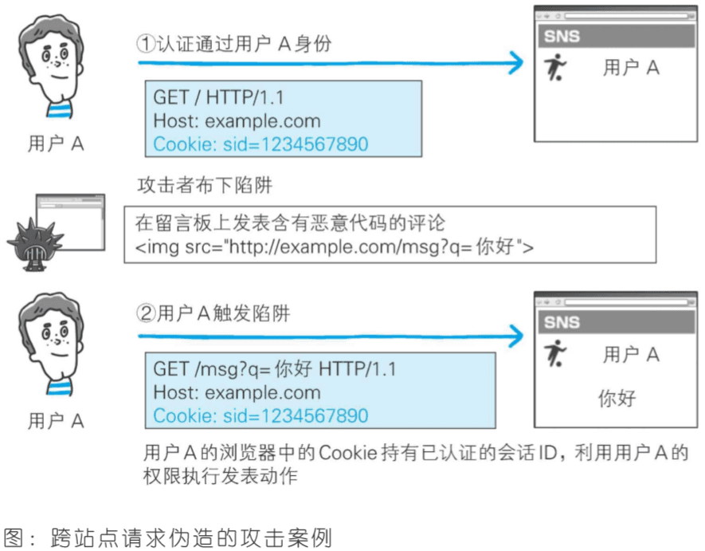
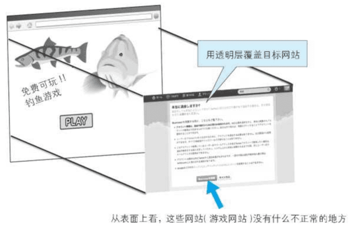

# 🛡️ Web 安全攻击与防护完全指南

> Web 安全是现代应用开发中不可忽视的重要环节。本指南将深入探讨各种常见安全威胁的原理、攻击方式和防护策略，帮助开发者构建更安全的 Web 应用。

## 🎯 学习目标

::: tip 📚 核心知识点
- 理解常见 Web 安全威胁的原理和攻击方式
- 掌握 XSS、CSRF、点击劫持等攻击的防护方法
- 学习安全编码实践和防护策略
- 了解现代 Web 安全防护技术和工具
- 建立完整的安全防护体系
:::

## 🚨 XSS 跨站脚本攻击

### 🔍 攻击原理

XSS（Cross Site Scripting）跨站脚本攻击，是一种代码注入攻击。攻击者通过利用网页开发时留下的漏洞，通过巧妙的方法注入恶意指令代码到网页，使用户加载并执行攻击者恶意制造的网页程序。

### 📊 XSS 攻击类型

#### 🎭 攻击类型对比

| 类型 | 描述 | 攻击方式 | 危害等级 | 持久性 |
|------|------|----------|----------|--------|
| **反射型 XSS** | 恶意代码直接在响应中反射 | 🔗 恶意链接 | 🟡 中等 | ❌ 临时 |
| **存储型 XSS** | 恶意代码存储在服务器 | 💾 数据存储 | 🔴 高 | ✅ 持久 |
| **DOM 型 XSS** | 在客户端修改 DOM | 🌐 客户端脚本 | 🟡 中等 | ❌ 临时 |

#### 🔥 反射型 XSS

```javascript
// 反射型 XSS 示例
// 易受攻击的代码
app.get('/search', (req, res) => {
  const query = req.query.q;
  // 危险：直接将用户输入插入到 HTML 中
  res.send(`<h1>搜索结果: ${query}</h1>`);
});

// 恶意 URL 示例
// http://example.com/search?q=<script>alert('XSS')</script>
```

#### 💾 存储型 XSS

```javascript
// 存储型 XSS 示例
// 易受攻击的代码
app.post('/comment', (req, res) => {
  const { content } = req.body;
  
  // 危险：直接存储用户输入的内容
  comments.push({
    id: Date.now(),
    content: content,
    timestamp: new Date()
  });
  
  res.redirect('/comments');
});

// 显示评论
app.get('/comments', (req, res) => {
  let html = '<h1>评论列表</h1>';
  
  comments.forEach(comment => {
    // 危险：直接输出存储的内容
    html += `<div>${comment.content}</div>`;
  });
  
  res.send(html);
});
```

#### 🌐 DOM 型 XSS

```javascript
// DOM 型 XSS 示例
// 前端 JavaScript 代码
function showUserInput() {
  const input = document.getElementById('userInput').value;
  
  // 危险：直接将用户输入插入到 DOM 中
  document.getElementById('output').innerHTML = input;
}

// 恶意输入示例
// 
```

### 🛡️ XSS 防护策略

#### 1️⃣ 内容安全策略 (CSP)

```javascript
// CSP 配置
const cspMiddleware = (req, res, next) => {
  res.setHeader('Content-Security-Policy', [
    "default-src 'self'",
    "script-src 'self' 'unsafe-inline'",
    "style-src 'self' 'unsafe-inline'",
    "img-src 'self' data: https:",
    "object-src 'none'",
    "base-uri 'self'",
    "form-action 'self'",
    "frame-ancestors 'none'"
  ].join('; '));
  
  next();
};

// 使用 CSP
app.use(cspMiddleware);
```

#### 2️⃣ 输入验证和过滤

```javascript
// 输入验证和过滤
const validator = require('validator');
const xss = require('xss');

// 输入验证中间件
const validateInput = (req, res, next) => {
  const { content } = req.body;
  
  // 基础验证
  if (!content || typeof content !== 'string') {
    return res.status(400).json({ error: '内容不能为空' });
  }
  
  // 长度验证
  if (content.length > 1000) {
    return res.status(400).json({ error: '内容过长' });
  }
  
  // XSS 过滤
  req.body.content = xss(content, {
    whiteList: {
      p: ['class', 'style'],
      strong: ['class', 'style'],
      em: ['class', 'style'],
      br: [],
      span: ['class', 'style']
    },
    stripIgnoreTag: true,
    stripIgnoreTagBody: ['script']
  });
  
  next();
};

// 安全的评论处理
app.post('/comment', validateInput, (req, res) => {
  const { content } = req.body;
  
  // 额外的 HTML 实体编码
  const safeContent = he.encode(content);
  
  comments.push({
    id: Date.now(),
    content: safeContent,
    timestamp: new Date()
  });
  
  res.json({ success: true });
});
```

#### 3️⃣ 输出编码

```javascript
// 输出编码工具
const htmlEncode = (str) => {
  return str
    .replace(/&/g, '&amp;')
    .replace(/</g, '&lt;')
    .replace(/>/g, '&gt;')
    .replace(/"/g, '&quot;')
    .replace(/'/g, '&#39;')
    .replace(/\//g, '&#x2F;');
};

// 安全的模板渲染
app.get('/profile', (req, res) => {
  const userProfile = {
    name: req.user.name,
    bio: req.user.bio,
    website: req.user.website
  };
  
  // 对所有用户输入进行编码
  const safeProfile = {
    name: htmlEncode(userProfile.name),
    bio: htmlEncode(userProfile.bio),
    website: htmlEncode(userProfile.website)
  };
  
  res.render('profile', { profile: safeProfile });
});
```

#### 4️⃣ HttpOnly Cookie

```javascript
// HttpOnly Cookie 配置
app.use(session({
  secret: process.env.SESSION_SECRET,
  httpOnly: true,     // 防止客户端脚本访问 Cookie
  secure: true,       // 仅在 HTTPS 下传输
  sameSite: 'strict', // 防止 CSRF 攻击
  maxAge: 24 * 60 * 60 * 1000 // 24小时
}));

// 手动设置 HttpOnly Cookie
app.post('/login', (req, res) => {
  // 验证用户身份
  const user = authenticateUser(req.body);
  
  if (user) {
    // 设置安全的 Cookie
    res.cookie('token', user.token, {
      httpOnly: true,
      secure: true,
      sameSite: 'strict',
      maxAge: 24 * 60 * 60 * 1000
    });
    
    res.json({ success: true });
  } else {
    res.status(401).json({ error: '认证失败' });
  }
});
```

## 🔐 CSRF 跨站请求伪造

### 🔍 攻击原理

CSRF（Cross-Site Request Forgery）跨站请求伪造，是一种挟制用户在当前已登录的 Web 应用程序上执行非本意的操作的攻击方法。



### 📊 CSRF 攻击特点

| 特点 | 描述 | 影响 |
|------|------|------|
| **第三方发起** | 攻击一般发起在第三方网站 | 🔴 难以追踪 |
| **利用登录状态** | 冒用用户的登录凭证 | 🔴 权限滥用 |
| **无需获取凭证** | 仅仅是"冒用"而非窃取 | 🟡 隐蔽性强 |
| **多种攻击方式** | 图片URL、表单提交等 | 🔴 防护困难 |

### 🎯 CSRF 攻击示例

```html
<!-- 恶意网站中的 CSRF 攻击代码 -->
<!-- 图片标签攻击 -->


<!-- 表单自动提交攻击 -->
<form action="https://bank.example.com/transfer" method="POST" style="display:none;">
  <input type="hidden" name="to" value="attacker">
  <input type="hidden" name="amount" value="1000">
  <input type="submit" value="Transfer">
</form>
<script>
  document.forms[0].submit();
</script>

<!-- AJAX 攻击 -->
<script>
  fetch('https://bank.example.com/transfer', {
    method: 'POST',
    credentials: 'include',
    headers: {
      'Content-Type': 'application/json'
    },
    body: JSON.stringify({
      to: 'attacker',
      amount: 1000
    })
  });
</script>
```

### 🛡️ CSRF 防护策略

#### 1️⃣ CSRF Token 验证

```javascript
// CSRF Token 生成和验证
const crypto = require('crypto');

// CSRF Token 管理
class CSRFTokenManager {
  constructor() {
    this.tokens = new Map();
    this.secretKey = process.env.CSRF_SECRET || 'default-secret';
  }
  
  // 生成 CSRF Token
  generateToken(sessionId) {
    const timestamp = Date.now();
    const randomBytes = crypto.randomBytes(32).toString('hex');
    const payload = `${sessionId}:${timestamp}:${randomBytes}`;
    
    const token = crypto
      .createHmac('sha256', this.secretKey)
      .update(payload)
      .digest('hex');
    
    // 存储 Token（设置过期时间）
    this.tokens.set(token, {
      sessionId,
      timestamp,
      expires: timestamp + 3600000 // 1小时
    });
    
    return token;
  }
  
  // 验证 CSRF Token
  validateToken(token, sessionId) {
    const tokenData = this.tokens.get(token);
    
    if (!tokenData) {
      return false;
    }
    
    // 检查过期时间
    if (Date.now() > tokenData.expires) {
      this.tokens.delete(token);
      return false;
    }
    
    // 检查会话匹配
    if (tokenData.sessionId !== sessionId) {
      return false;
    }
    
    return true;
  }
  
  // 删除使用过的 Token
  consumeToken(token) {
    this.tokens.delete(token);
  }
  
  // 清理过期 Token
  cleanupExpiredTokens() {
    const now = Date.now();
    for (const [token, data] of this.tokens) {
      if (now > data.expires) {
        this.tokens.delete(token);
      }
    }
  }
}

const csrfManager = new CSRFTokenManager();

// 生成 CSRF Token 的中间件
const generateCSRFToken = (req, res, next) => {
  if (req.session && req.session.id) {
    const token = csrfManager.generateToken(req.session.id);
    res.locals.csrfToken = token;
    req.csrfToken = token;
  }
  next();
};

// 验证 CSRF Token 的中间件
const validateCSRFToken = (req, res, next) => {
  // 跳过 GET 请求
  if (req.method === 'GET') {
    return next();
  }
  
  const token = req.body._csrf || req.headers['x-csrf-token'];
  
  if (!token) {
    return res.status(403).json({ error: '缺少 CSRF Token' });
  }
  
  if (!csrfManager.validateToken(token, req.session.id)) {
    return res.status(403).json({ error: 'CSRF Token 无效' });
  }
  
  // 消费 Token（可选，增加安全性）
  csrfManager.consumeToken(token);
  
  next();
};

// 使用 CSRF 保护
app.use(generateCSRFToken);
app.use(validateCSRFToken);

// 定期清理过期 Token
setInterval(() => {
  csrfManager.cleanupExpiredTokens();
}, 300000); // 5分钟清理一次
```

#### 2️⃣ 同源检测

```javascript
// 同源检测中间件
const sameOriginCheck = (req, res, next) => {
  // 跳过 GET 请求
  if (req.method === 'GET') {
    return next();
  }
  
  const origin = req.headers.origin;
  const referer = req.headers.referer;
  const host = req.headers.host;
  
  // 检查 Origin 头部
  if (origin) {
    const originHost = new URL(origin).host;
    if (originHost !== host) {
      return res.status(403).json({ error: '跨域请求被拒绝' });
    }
  }
  
  // 检查 Referer 头部
  if (referer) {
    const refererHost = new URL(referer).host;
    if (refererHost !== host) {
      return res.status(403).json({ error: '引用源不匹配' });
    }
  }
  
  // 如果没有 Origin 和 Referer 头部，可能是直接访问
  if (!origin && !referer) {
    return res.status(403).json({ error: '缺少源信息' });
  }
  
  next();
};

// 使用同源检测
app.use('/api', sameOriginCheck);
```

#### 3️⃣ SameSite Cookie

```javascript
// SameSite Cookie 配置
app.use(session({
  secret: process.env.SESSION_SECRET,
  cookie: {
    httpOnly: true,
    secure: true,
    sameSite: 'strict', // 严格同站点策略
    maxAge: 24 * 60 * 60 * 1000
  }
}));

// 不同 SameSite 策略的对比
const cookieStrategies = {
  // 严格策略：完全阻止跨站点请求
  strict: {
    sameSite: 'strict',
    description: '完全阻止跨站点请求携带 Cookie'
  },
  
  // 宽松策略：部分允许跨站点请求
  lax: {
    sameSite: 'lax',
    description: '允许导航请求携带 Cookie，阻止其他跨站点请求'
  },
  
  // 无策略：允许所有跨站点请求
  none: {
    sameSite: 'none',
    secure: true, // 必须配合 Secure 使用
    description: '允许所有跨站点请求携带 Cookie'
  }
};
```

#### 4️⃣ 双重 Cookie 验证

```javascript
// 双重 Cookie 验证
const doubleCookieCheck = (req, res, next) => {
  // 跳过 GET 请求
  if (req.method === 'GET') {
    return next();
  }
  
  const cookieToken = req.cookies.csrfToken;
  const headerToken = req.headers['x-csrf-token'] || req.body._csrf;
  
  if (!cookieToken || !headerToken) {
    return res.status(403).json({ error: '缺少 CSRF Token' });
  }
  
  if (cookieToken !== headerToken) {
    return res.status(403).json({ error: 'CSRF Token 不匹配' });
  }
  
  next();
};

// 设置双重 Cookie
app.use((req, res, next) => {
  if (req.session && !req.cookies.csrfToken) {
    const token = crypto.randomBytes(32).toString('hex');
    res.cookie('csrfToken', token, {
      httpOnly: false, // 必须允许 JavaScript 访问
      secure: true,
      sameSite: 'strict'
    });
  }
  next();
});
```

## 🎭 点击劫持攻击

### 🔍 攻击原理

点击劫持是一种通过在 Web 页面中透明覆盖一个可点击的按钮或链接，以欺骗用户点击，从而进行一些恶意操作的攻击。



### 🎯 攻击示例

```html
<!-- 点击劫持攻击页面 -->
<!DOCTYPE html>
<html>
<head>
  <title>免费获得 iPhone!</title>
  <style>
    .overlay {
      position: absolute;
      top: 100px;
      left: 100px;
      z-index: 1000;
      opacity: 0.01; /* 几乎透明 */
    }
    
    .bait {
      position: absolute;
      top: 100px;
      left: 100px;
      z-index: 999;
      font-size: 24px;
      color: red;
      cursor: pointer;
    }
  </style>
</head>
<body>
  <div class="bait">点击这里免费获得 iPhone!</div>
  <iframe class="overlay" src="https://bank.example.com/transfer" width="400" height="300"></iframe>
</body>
</html>
```

### 🛡️ 点击劫持防护

#### 1️⃣ X-Frame-Options 头部

```javascript
// X-Frame-Options 配置
const frameOptionsMiddleware = (req, res, next) => {
  // 完全禁止在 iframe 中加载
  res.setHeader('X-Frame-Options', 'DENY');
  
  // 或者只允许同源加载
  // res.setHeader('X-Frame-Options', 'SAMEORIGIN');
  
  // 或者允许特定来源
  // res.setHeader('X-Frame-Options', 'ALLOW-FROM https://trusted.example.com');
  
  next();
};

// 根据不同页面设置不同策略
const adaptiveFrameOptions = (req, res, next) => {
  const path = req.path;
  
  if (path.startsWith('/admin')) {
    // 管理页面完全禁止
    res.setHeader('X-Frame-Options', 'DENY');
  } else if (path.startsWith('/api')) {
    // API 接口禁止
    res.setHeader('X-Frame-Options', 'DENY');
  } else if (path.startsWith('/widget')) {
    // 小工具允许同源
    res.setHeader('X-Frame-Options', 'SAMEORIGIN');
  } else {
    // 默认策略
    res.setHeader('X-Frame-Options', 'SAMEORIGIN');
  }
  
  next();
};
```

#### 2️⃣ CSP frame-ancestors 指令

```javascript
// 使用 CSP frame-ancestors 替代 X-Frame-Options
const cspFrameProtection = (req, res, next) => {
  res.setHeader('Content-Security-Policy', 
    "frame-ancestors 'self' https://trusted.example.com"
  );
  next();
};

// 动态 CSP 配置
const dynamicCSPFrame = (req, res, next) => {
  const userAgent = req.headers['user-agent'] || '';
  const isModern = !userAgent.includes('MSIE');
  
  if (isModern) {
    // 现代浏览器使用 CSP
    res.setHeader('Content-Security-Policy', "frame-ancestors 'self'");
  } else {
    // 老式浏览器使用 X-Frame-Options
    res.setHeader('X-Frame-Options', 'SAMEORIGIN');
  }
  
  next();
};
```

#### 3️⃣ JavaScript 防护

```javascript
// 客户端点击劫持检测
const clickjackingDetection = `
  (function() {
    // 检测页面是否被嵌入
    if (top !== self) {
      // 页面被嵌入在 iframe 中
      
      // 方法1：跳转到顶层窗口
      top.location = self.location;
      
      // 方法2：显示警告信息
      // document.body.innerHTML = '<h1>此页面不能在框架中显示</h1>';
      
      // 方法3：隐藏页面内容
      // document.body.style.display = 'none';
    }
    
    // 检测点击劫持尝试
    let clickCount = 0;
    let suspiciousClicks = 0;
    
    document.addEventListener('click', function(e) {
      clickCount++;
      
      // 检测点击位置是否可疑
      const rect = e.target.getBoundingClientRect();
      const isVisible = rect.width > 0 && rect.height > 0;
      const isInViewport = rect.top >= 0 && rect.left >= 0;
      
      if (!isVisible || !isInViewport) {
        suspiciousClicks++;
        
        if (suspiciousClicks > 3) {
          // 可能的点击劫持攻击
          alert('检测到可疑点击活动！');
          e.preventDefault();
          e.stopPropagation();
        }
      }
    });
  })();
`;

// 在页面中注入防护脚本
app.get('/secure-page', (req, res) => {
  res.send(`
    <!DOCTYPE html>
    <html>
    <head>
      <title>安全页面</title>
    </head>
    <body>
      <h1>这是一个受保护的页面</h1>
      <script>${clickjackingDetection}</script>
    </body>
    </html>
  `);
});
```

## 🔧 HTTP 首部注入攻击

### 🔍 攻击原理

HTTP 首部注入攻击是一种利用 HTTP 请求头中包含恶意字符来绕过服务器验证的攻击。

### 🎯 攻击示例

```javascript
// 易受攻击的重定向代码
app.get('/redirect', (req, res) => {
  const url = req.query.url;
  
  // 危险：直接使用用户输入构建 Location 头部
  res.setHeader('Location', url);
  res.status(302).send();
});

// 恶意请求示例
// GET /redirect?url=http://example.com%0D%0ASet-Cookie:%20malicious=true
// 解析后的头部：
// Location: http://example.com
// Set-Cookie: malicious=true
```

### 🛡️ 防护策略

```javascript
// 安全的头部设置
const secureHeaderSet = (res, name, value) => {
  // 验证头部名称
  if (!/^[a-zA-Z0-9\-_]+$/.test(name)) {
    throw new Error('无效的头部名称');
  }
  
  // 过滤头部值中的危险字符
  const safeValue = value
    .replace(/[\r\n]/g, '') // 移除换行符
    .replace(/[\x00-\x1F\x7F]/g, ''); // 移除控制字符
  
  res.setHeader(name, safeValue);
};

// 安全的重定向
const secureRedirect = (req, res, next) => {
  const url = req.query.url;
  
  if (!url) {
    return res.status(400).json({ error: '缺少重定向 URL' });
  }
  
  try {
    // 验证 URL 格式
    const parsedUrl = new URL(url);
    
    // 白名单检查
    const allowedHosts = ['example.com', 'trusted.com'];
    if (!allowedHosts.includes(parsedUrl.hostname)) {
      return res.status(400).json({ error: '不允许的重定向目标' });
    }
    
    // 安全设置 Location 头部
    secureHeaderSet(res, 'Location', parsedUrl.href);
    res.status(302).send();
    
  } catch (error) {
    res.status(400).json({ error: '无效的 URL' });
  }
};

// 输入验证中间件
const validateHeaders = (req, res, next) => {
  const suspiciousPatterns = [
    /\r\n/,           // CRLF 注入
    /\x00/,           // 空字节
    /\x0a/,           // 换行符
    /\x0d/,           // 回车符
    /%0[ad]/i,        // URL 编码的换行符
    /\x1f/,           // 控制字符
  ];
  
  // 检查所有头部
  for (const [key, value] of Object.entries(req.headers)) {
    const headerValue = String(value);
    
    for (const pattern of suspiciousPatterns) {
      if (pattern.test(headerValue)) {
        return res.status(400).json({ 
          error: `检测到恶意头部: ${key}` 
        });
      }
    }
  }
  
  next();
};
```

## 💻 OS 命令注入

### 🔍 攻击原理

OS 命令注入攻击是通过 Web 应用程序执行系统命令时，注入恶意的操作系统命令。

### 🎯 攻击示例

```javascript
// 易受攻击的代码
const { exec } = require('child_process');

app.post('/ping', (req, res) => {
  const host = req.body.host;
  
  // 危险：直接拼接用户输入到命令中
  const command = `ping -c 4 ${host}`;
  
  exec(command, (error, stdout, stderr) => {
    if (error) {
      return res.status(500).json({ error: error.message });
    }
    res.json({ output: stdout });
  });
});

// 恶意输入示例
// host: "example.com; rm -rf /"
// 生成的命令: ping -c 4 example.com; rm -rf /
```

### 🛡️ 防护策略

```javascript
// 安全的命令执行
const { spawn } = require('child_process');

// 参数验证和清理
const validateInput = (input, type) => {
  const validators = {
    hostname: /^[a-zA-Z0-9\-\.]+$/,
    ip: /^(?:(?:25[0-5]|2[0-4][0-9]|[01]?[0-9][0-9]?)\.){3}(?:25[0-5]|2[0-4][0-9]|[01]?[0-9][0-9]?)$/,
    filename: /^[a-zA-Z0-9\-_\.]+$/
  };
  
  const pattern = validators[type];
  if (!pattern) {
    throw new Error(`未知的验证类型: ${type}`);
  }
  
  if (!pattern.test(input)) {
    throw new Error(`输入不符合${type}格式`);
  }
  
  return input;
};

// 安全的 ping 命令
app.post('/ping', (req, res) => {
  const host = req.body.host;
  
  try {
    // 验证输入
    const validHost = validateInput(host, 'hostname');
    
    // 使用 spawn 替代 exec，避免 shell 注入
    const ping = spawn('ping', ['-c', '4', validHost]);
    
    let output = '';
    let errorOutput = '';
    
    ping.stdout.on('data', (data) => {
      output += data.toString();
    });
    
    ping.stderr.on('data', (data) => {
      errorOutput += data.toString();
    });
    
    ping.on('close', (code) => {
      if (code === 0) {
        res.json({ output: output });
      } else {
        res.status(500).json({ error: errorOutput });
      }
    });
    
    // 设置超时
    setTimeout(() => {
      ping.kill();
      res.status(500).json({ error: '命令执行超时' });
    }, 10000);
    
  } catch (error) {
    res.status(400).json({ error: error.message });
  }
});

// 命令白名单
const allowedCommands = {
  ping: {
    command: 'ping',
    allowedArgs: ['-c', '-W', '-i'],
    validator: (args) => {
      // 验证参数
      return args.every(arg => {
        return /^[\-a-zA-Z0-9\.]+$/.test(arg);
      });
    }
  },
  ls: {
    command: 'ls',
    allowedArgs: ['-l', '-a', '-h'],
    validator: (args) => {
      return args.every(arg => {
        return /^[\-a-zA-Z0-9\/\.]+$/.test(arg);
      });
    }
  }
};

// 安全的命令执行器
const executeCommand = (commandName, args) => {
  return new Promise((resolve, reject) => {
    const cmdConfig = allowedCommands[commandName];
    
    if (!cmdConfig) {
      return reject(new Error('不允许的命令'));
    }
    
    // 验证参数
    if (!cmdConfig.validator(args)) {
      return reject(new Error('无效的命令参数'));
    }
    
    // 执行命令
    const child = spawn(cmdConfig.command, args);
    
    let output = '';
    let errorOutput = '';
    
    child.stdout.on('data', (data) => {
      output += data.toString();
    });
    
    child.stderr.on('data', (data) => {
      errorOutput += data.toString();
    });
    
    child.on('close', (code) => {
      if (code === 0) {
        resolve(output);
      } else {
        reject(new Error(errorOutput));
      }
    });
    
    // 设置超时
    setTimeout(() => {
      child.kill();
      reject(new Error('命令执行超时'));
    }, 10000);
  });
};
```

## 🛡️ 综合安全防护

### 🔧 安全中间件栈

```javascript
// 综合安全中间件
const securityMiddleware = (app) => {
  // 1. 基础安全头部
  app.use((req, res, next) => {
    // 防止点击劫持
    res.setHeader('X-Frame-Options', 'DENY');
    
    // 防止 MIME 类型嗅探
    res.setHeader('X-Content-Type-Options', 'nosniff');
    
    // 启用 XSS 过滤器
    res.setHeader('X-XSS-Protection', '1; mode=block');
    
    // 强制 HTTPS
    res.setHeader('Strict-Transport-Security', 'max-age=31536000; includeSubDomains');
    
    // 引用策略
    res.setHeader('Referrer-Policy', 'strict-origin-when-cross-origin');
    
    next();
  });
  
  // 2. CSP 策略
  app.use((req, res, next) => {
    res.setHeader('Content-Security-Policy', [
      "default-src 'self'",
      "script-src 'self' 'unsafe-inline'",
      "style-src 'self' 'unsafe-inline'",
      "img-src 'self' data: https:",
      "font-src 'self' https://fonts.gstatic.com",
      "connect-src 'self'",
      "object-src 'none'",
      "media-src 'self'",
      "frame-src 'none'",
      "base-uri 'self'",
      "form-action 'self'"
    ].join('; '));
    
    next();
  });
  
  // 3. 请求速率限制
  const rateLimit = require('express-rate-limit');
  
  app.use(rateLimit({
    windowMs: 15 * 60 * 1000, // 15分钟
    max: 100, // 限制每个IP 100个请求
    message: '请求过于频繁，请稍后再试',
    standardHeaders: true,
    legacyHeaders: false,
  }));
  
  // 4. 输入验证
  app.use(express.json({ limit: '10mb' }));
  app.use(express.urlencoded({ extended: true, limit: '10mb' }));
  
  // 5. 会话安全
  app.use(session({
    secret: process.env.SESSION_SECRET,
    resave: false,
    saveUninitialized: false,
    cookie: {
      secure: process.env.NODE_ENV === 'production',
      httpOnly: true,
      maxAge: 24 * 60 * 60 * 1000,
      sameSite: 'strict'
    }
  }));
  
  // 6. CSRF 保护
  app.use(generateCSRFToken);
  app.use(validateCSRFToken);
  
  // 7. 日志记录
  const winston = require('winston');
  const logger = winston.createLogger({
    level: 'info',
    format: winston.format.json(),
    transports: [
      new winston.transports.File({ filename: 'security.log' })
    ]
  });
  
  app.use((req, res, next) => {
    logger.info('Request', {
      method: req.method,
      url: req.url,
      ip: req.ip,
      userAgent: req.get('User-Agent'),
      timestamp: new Date().toISOString()
    });
    next();
  });
};

// 应用安全中间件
securityMiddleware(app);
```

### 📊 安全监控和告警

```javascript
// 安全事件监控
class SecurityMonitor {
  constructor() {
    this.events = [];
    this.thresholds = {
      failedLogins: 5,
      suspiciousRequests: 10,
      rateLimitHits: 20
    };
    this.alertHandlers = [];
  }
  
  // 记录安全事件
  logEvent(type, details) {
    const event = {
      type,
      details,
      timestamp: new Date().toISOString(),
      ip: details.ip || 'unknown'
    };
    
    this.events.push(event);
    this.checkThresholds(event);
    
    // 保持事件日志大小
    if (this.events.length > 1000) {
      this.events = this.events.slice(-500);
    }
  }
  
  // 检查告警阈值
  checkThresholds(event) {
    const recentEvents = this.getRecentEvents(15 * 60 * 1000); // 15分钟内
    const eventsByType = this.groupEventsByType(recentEvents);
    
    for (const [type, events] of Object.entries(eventsByType)) {
      const threshold = this.thresholds[type];
      if (threshold && events.length >= threshold) {
        this.triggerAlert(type, events);
      }
    }
  }
  
  // 获取最近事件
  getRecentEvents(timeWindow) {
    const now = Date.now();
    return this.events.filter(event => {
      const eventTime = new Date(event.timestamp).getTime();
      return now - eventTime <= timeWindow;
    });
  }
  
  // 按类型分组事件
  groupEventsByType(events) {
    return events.reduce((groups, event) => {
      if (!groups[event.type]) {
        groups[event.type] = [];
      }
      groups[event.type].push(event);
      return groups;
    }, {});
  }
  
  // 触发告警
  triggerAlert(type, events) {
    const alert = {
      type,
      count: events.length,
      affectedIPs: [...new Set(events.map(e => e.ip))],
      timestamp: new Date().toISOString()
    };
    
    this.alertHandlers.forEach(handler => {
      handler(alert);
    });
  }
  
  // 添加告警处理器
  addAlertHandler(handler) {
    this.alertHandlers.push(handler);
  }
  
  // 获取安全统计
  getSecurityStats() {
    const recentEvents = this.getRecentEvents(24 * 60 * 60 * 1000); // 24小时
    const eventsByType = this.groupEventsByType(recentEvents);
    
    return {
      totalEvents: recentEvents.length,
      eventsByType: Object.keys(eventsByType).map(type => ({
        type,
        count: eventsByType[type].length
      })),
      topIPs: this.getTopIPs(recentEvents, 10),
      timeline: this.getEventTimeline(recentEvents)
    };
  }
  
  // 获取最活跃IP
  getTopIPs(events, limit) {
    const ipCounts = events.reduce((counts, event) => {
      counts[event.ip] = (counts[event.ip] || 0) + 1;
      return counts;
    }, {});
    
    return Object.entries(ipCounts)
      .sort((a, b) => b[1] - a[1])
      .slice(0, limit)
      .map(([ip, count]) => ({ ip, count }));
  }
  
  // 获取事件时间线
  getEventTimeline(events) {
    const hourlyEvents = events.reduce((timeline, event) => {
      const hour = new Date(event.timestamp).getHours();
      timeline[hour] = (timeline[hour] || 0) + 1;
      return timeline;
    }, {});
    
    return Array.from({ length: 24 }, (_, hour) => ({
      hour,
      count: hourlyEvents[hour] || 0
    }));
  }
}

// 创建安全监控实例
const securityMonitor = new SecurityMonitor();

// 添加邮件告警
securityMonitor.addAlertHandler((alert) => {
  console.log('🚨 安全告警:', alert);
  // 发送邮件通知
  // sendSecurityAlert(alert);
});

// 集成到应用中
app.use((req, res, next) => {
  // 监控失败的登录尝试
  if (req.path === '/login' && req.method === 'POST') {
    res.on('finish', () => {
      if (res.statusCode === 401) {
        securityMonitor.logEvent('failedLogin', {
          ip: req.ip,
          userAgent: req.get('User-Agent'),
          username: req.body.username
        });
      }
    });
  }
  
  next();
});

// 安全统计端点
app.get('/admin/security-stats', (req, res) => {
  res.json(securityMonitor.getSecurityStats());
});
```

## 📚 最佳实践总结

### ✅ 安全编码原则

| 原则 | 描述 | 实施要点 |
|------|------|----------|
| **输入验证** | 验证所有用户输入 | 🔍 白名单验证，长度限制 |
| **输出编码** | 编码所有输出内容 | 🔒 HTML 实体编码，上下文相关 |
| **最小权限** | 给予最小必要权限 | 🛡️ 角色分离，权限控制 |
| **深度防御** | 多层安全防护 | 🏰 多个防护层，冗余保护 |
| **失败安全** | 失败时保持安全 | 🚨 默认拒绝，异常处理 |

### 🔧 安全检查清单

```javascript
// 安全检查清单
const securityChecklist = {
  // 输入验证
  inputValidation: [
    '✅ 验证所有用户输入',
    '✅ 使用白名单验证',
    '✅ 限制输入长度',
    '✅ 检查数据类型',
    '✅ 验证文件上传'
  ],
  
  // 输出编码
  outputEncoding: [
    '✅ HTML 实体编码',
    '✅ JavaScript 编码',
    '✅ CSS 编码',
    '✅ URL 编码',
    '✅ SQL 转义'
  ],
  
  // 身份认证
  authentication: [
    '✅ 强密码策略',
    '✅ 多因素认证',
    '✅ 会话管理',
    '✅ 登录保护',
    '✅ 密码存储'
  ],
  
  // 访问控制
  accessControl: [
    '✅ 角色权限控制',
    '✅ 资源访问限制',
    '✅ 垂直权限检查',
    '✅ 水平权限检查',
    '✅ 敏感操作确认'
  ],
  
  // 通信安全
  communication: [
    '✅ HTTPS 加密',
    '✅ 证书验证',
    '✅ 安全头部',
    '✅ Cookie 安全',
    '✅ HSTS 启用'
  ],
  
  // 数据保护
  dataProtection: [
    '✅ 敏感数据加密',
    '✅ 数据库安全',
    '✅ 备份加密',
    '✅ 数据脱敏',
    '✅ 隐私保护'
  ],
  
  // 错误处理
  errorHandling: [
    '✅ 通用错误信息',
    '✅ 错误日志记录',
    '✅ 异常处理',
    '✅ 调试信息隐藏',
    '✅ 错误页面安全'
  ],
  
  // 监控和日志
  monitoring: [
    '✅ 安全事件监控',
    '✅ 异常活动检测',
    '✅ 日志记录',
    '✅ 告警机制',
    '✅ 审计跟踪'
  ]
};

// 生成安全报告
const generateSecurityReport = () => {
  const report = {
    timestamp: new Date().toISOString(),
    checklist: securityChecklist,
    recommendations: [
      '定期更新依赖包',
      '进行安全代码审查',
      '实施渗透测试',
      '建立安全响应计划',
      '定期备份数据'
    ],
    resources: [
      'OWASP Top 10',
      'SANS Top 25',
      'CWE/SANS',
      'NIST Cybersecurity Framework',
      'ISO 27001'
    ]
  };
  
  return report;
};
```

## 📚 参考资源

### 📖 安全标准和指南
- [OWASP Top 10](https://owasp.org/www-project-top-ten/)
- [SANS Top 25](https://www.sans.org/top25-software-errors/)
- [CWE/SANS](https://cwe.mitre.org/top25/)
- [NIST Cybersecurity Framework](https://www.nist.gov/cyberframework)

### 🛠️ 安全工具
- [OWASP ZAP](https://owasp.org/www-project-zap/)
- [Burp Suite](https://portswigger.net/burp)
- [Nessus](https://www.tenable.com/products/nessus)
- [OpenVAS](https://www.openvas.org/)

### 📊 在线资源
- [HackerOne](https://hackerone.com/)
- [Bugcrowd](https://bugcrowd.com/)
- [CVE Database](https://cve.mitre.org/)
- [Security Headers](https://securityheaders.com/)

::: tip 💡 安全建议
Web 安全是一个持续的过程，需要在开发的每个阶段都考虑安全因素。建议定期进行安全审计和渗透测试，及时更新安全防护措施，建立完善的安全响应机制。
:::
