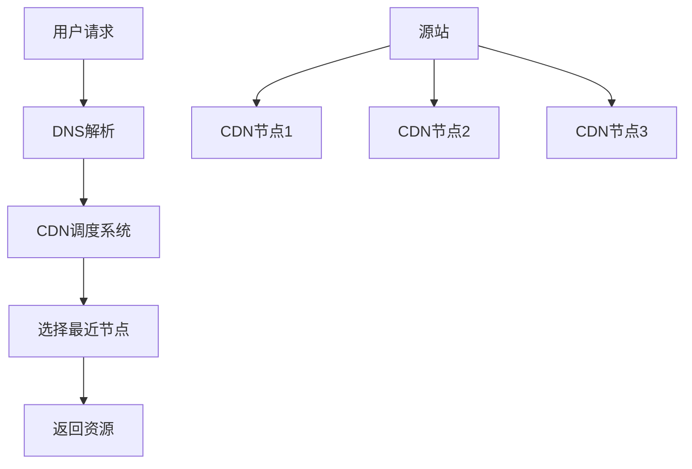

# ⚡ 前端性能优化完整指南

前端性能优化是提升用户体验的关键环节。本文介绍前端性能优化的七大核心手段，帮助开发者构建高性能的Web应用。

::: tip 📚 本章内容
系统学习前端性能优化策略，掌握网络、资源、渲染、构建等各个层面的优化技巧。
:::

## 1. 性能优化概览

### 1.1 七大优化手段

| 优化方向 | 核心目标 | 主要技术 | 性能提升 |
|----------|----------|----------|----------|
| **网络连接优化** | 减少连接时间 | CDN、DNS预解析、HTTP/2 | 20-40% |
| **请求数量减少** | 降低请求频次 | 合并请求、缓存策略 | 30-50% |
| **资源大小压缩** | 减小传输体积 | Gzip、图片压缩、代码压缩 | 40-70% |
| **资源加载优化** | 提升加载效率 | 懒加载、预加载、异步加载 | 25-45% |
| **渲染性能优化** | 减少重绘回流 | DOM优化、CSS优化 | 15-30% |
| **API性能优化** | 使用高效API | 现代浏览器API | 10-25% |
| **构建打包优化** | 优化产物结构 | Tree-shaking、代码分割 | 30-60% |

## 2. 网络连接优化

网络连接优化是性能优化的第一步，通过减少网络延迟和提高连接效率来改善用户体验。

### 2.1 CDN 内容分发网络

**CDN（Content Delivery Network）** 是内容分发网络，通过在全球部署边缘节点，让用户就近访问资源。

#### 2.1.1 CDN 工作原理



#### 2.1.2 CDN 优势

| 优势 | 说明 | 性能提升 |
|------|------|----------|
| **就近访问** | 用户从最近的节点获取资源 | 减少延迟 50-80% |
| **负载分散** | 分散源站压力 | 提高可用性 |
| **带宽优化** | 减少跨地域传输 | 节省带宽成本 |
| **缓存加速** | 边缘节点缓存热点资源 | 加快响应速度 |

### 2.2 DNS 预解析和预连接

DNS 解析是访问网站的第一步，优化 DNS 解析可以显著提升页面加载速度。

#### 2.2.1 DNS 解析流程

```
浏览器缓存 → 系统缓存 → 路由器缓存 → ISP DNS缓存 → 根域名服务器 → 顶级域名服务器 → 主域名服务器
```

#### 2.2.2 预解析技术

```html
<!-- DNS 预解析 - 提前解析域名 -->
<link rel="dns-prefetch" href="https://cdn.example.com">
<link rel="dns-prefetch" href="https://api.example.com">

<!-- 预连接 - 建立完整连接 -->
<link rel="preconnect" href="https://fonts.googleapis.com">
<link rel="preconnect" href="https://www.google-analytics.com">

<!-- 预加载 - 提前下载资源 -->
<link rel="preload" href="/critical.css" as="style">
<link rel="preload" href="/hero-image.jpg" as="image">

<!-- 预获取 - 空闲时下载 -->
<link rel="prefetch" href="/next-page.js">
```

#### 2.2.3 预连接策略对比

| 技术 | 作用 | 适用场景 | 性能影响 |
|------|------|----------|----------|
| `dns-prefetch` | 仅DNS解析 | 外部域名资源 | 低开销，高收益 |
| `preconnect` | DNS+TCP+TLS | 关键第三方资源 | 中等开销，显著收益 |
| `preload` | 下载资源 | 当前页面关键资源 | 高优先级 |
| `prefetch` | 预取资源 | 下个页面可能用到 | 低优先级 |

### 2.3 并行连接优化

#### 2.3.1 HTTP/1.1 连接限制

```javascript
// HTTP/1.1 各浏览器的域名并发限制
const browserLimits = {
  Chrome: 6,
  Firefox: 6,
  Safari: 6,
  Edge: 6,
  IE11: 8
}

// 使用多个子域名增加并发数
const domains = [
  'static1.example.com',
  'static2.example.com', 
  'static3.example.com',
  'static4.example.com'
]
```

#### 2.3.2 HTTP/2 多路复用

```html
<!-- HTTP/2 下单个连接即可处理多个请求 -->
<link rel="stylesheet" href="/css/main.css">
<link rel="stylesheet" href="/css/theme.css">
<script src="/js/vendor.js"></script>
<script src="/js/app.js"></script>
<!-- 以上请求在 HTTP/2 下可通过单个连接并行传输 -->
```

### 2.4 持久连接

#### 2.4.1 Keep-Alive 配置

```javascript
// 服务器端配置 Keep-Alive
app.use((req, res, next) => {
  res.setHeader('Connection', 'keep-alive')
  res.setHeader('Keep-Alive', 'timeout=5, max=1000')
  next()
})
```

#### 2.4.2 连接类型对比

| 连接类型 | 特点 | 适用场景 | 性能表现 |
|----------|------|----------|----------|
| **短连接** | 请求完成后立即关闭 | 简单请求 | 连接开销大 |
| **长连接** | 保持连接复用 | 频繁请求 | 减少握手开销 |
| **管道化** | 批量发送请求 | HTTP/2 环境 | 最优性能 |

### 2.5 实施建议

#### 2.5.1 最佳实践

1. **CDN 部署策略**
   ```javascript
   // 静态资源使用 CDN
   const cdnConfig = {
     images: 'https://img-cdn.example.com',
     scripts: 'https://js-cdn.example.com', 
     styles: 'https://css-cdn.example.com'
   }
   ```

2. **DNS 优化策略**
   ```html
   <!-- 在 <head> 中尽早添加预解析 -->
   <link rel="dns-prefetch" href="//cdn.example.com">
   <link rel="dns-prefetch" href="//api.example.com">
   ```

3. **连接数优化**
   ```javascript
   // 合理使用域名分片（HTTP/1.1）
   const getResourceUrl = (type, filename) => {
     const domainIndex = hash(filename) % 4
     return `https://static${domainIndex}.example.com/${type}/${filename}`
   }
   ```

#### 2.5.2 避免的问题

- 过度使用 `preconnect`（限制在 4-6 个关键域名）
- 在 HTTP/2 环境下仍使用域名分片
- 忽视 DNS 缓存策略的配置

## 3. 减少请求数量

### 3.1 请求合并策略

将多个请求合并成一个请求，可以减少请求数量和请求深度，但合并请求也会增加请求时间，需要权衡：

- 对于页面加载所必须的资源可以合并，如 CSS 和 JS 文件
- 对于非必须的资源，如图片，可以分批加载，如在页面加载完之后再加载图片

### 3.2 图片处理优化

将图片的内容以 Base64 格式内嵌到 HTML 中，可以减少 HTTP 请求数量。但需注意：
- Base64 编码会使文件体积增大约 33%
- 推荐使用字体图标来代替小图标

### 3.3 减少重定向

尽量避免使用重定向，重定向会延迟整个 HTML 文档的传输：
- 在 HTML 文档到达之前，页面不会呈现任何内容
- 使用 301 重定向代替 302 重定向，301 会被缓存

### 3.4 缓存策略优化

缓存可以减少请求数量，但需要合理配置：

- **强缓存**：使用 `Cache-Control` 或 `Expires` 头，缓存未过期时不发送请求
- **协商缓存**：使用 `Last-Modified` 或 `ETag`，服务器根据资源是否变化返回 304 或 200

### 3.5 避免空属性引用

- `<a>` 标签设置空的 `href` 会重定向到当前页面
- `<form>` 设置空的 `method` 会提交表单到当前页面

## 4. 减小资源大小

### 4.1 HTML 压缩

HTML 代码压缩是指压缩在文本文件中有意义但在 HTML 中不显示的字符，包括空格、制表符、换行符等。

### 4.2 CSS 压缩

CSS 压缩包括：
- 无效代码删除
- CSS 语义合并
- 选择器合并

### 4.3 JavaScript 压缩与混淆

JS 压缩与混淆包括：
- 无效字符及注释的删除
- 代码语义的缩减和优化
- 变量名简化
- 代码保护

### 4.4 图片压缩

- 针对真实图片情况，舍弃相对无关紧要的色彩信息
- 在安卓下使用 WebP 格式，体积比 JPG、PNG 少 25% 以上
- WebP 同时具备无损和有损压缩模式、Alpha 透明以及动画特性

### 4.5 Gzip 压缩

HTTP 协议上的 Gzip 编码可以显著改善 Web 应用性能：
- 服务器将网页内容压缩后传输到浏览器
- 对纯文本内容可压缩到原大小的 40%
- 适用于 HTML、CSS、JavaScript 等文本资源

## 5. 优化资源加载

### 5.1 资源加载位置

通过优化资源加载位置，更改资源加载时机，使页面内容尽快展示：

- CSS 文件放在 `<head>` 中，先外链，后本页
- JS 文件放在 `<body>` 底部，先外链，后本页
- 处理页面布局的关键 JS 文件（如 babel-polyfill.js、flexible.js）放在 `<head>` 中
- `<body>` 中间尽量不写 `<style>` 和 `<script>` 标签

### 5.2 资源加载时机

#### 5.2.1 预加载技术

- **预加载**：在页面加载时，将资源提前加载到浏览器缓存中
- **预获取**：在用户点击前，提前加载可能需要的资源
- **预渲染**：提前渲染可能需要的页面，直接从内存中读取

#### 5.2.2 懒加载策略

延迟加载不影响当前页面的资源，等进入视口或网络空闲时再加载，提升用户体验。

#### 5.2.3 脚本加载优化

- **defer**: 异步加载，在 HTML 解析完成后执行
- **async**: 异步加载，加载完成后立即执行
- **动态脚本**: 通过动态创建 `<script>` 标签加载资源

#### 5.2.4 模块按需加载

- 符合 ECMAScript 提案的 `import()` 语法
- webpack 特定的 `require.ensure`
- 使用 `<link>` 标签代替 CSS `@import`（后者会阻塞页面解析）

## 6. 减少回流和重绘

### 6.1 样式优化

1. 避免使用层级较深或复杂的选择器，提高 CSS 渲染效率
2. 避免使用 CSS 表达式（计算频率过高）
3. 元素适当定义高度或最小高度，避免动态内容加载时页面元素晃动
4. 给图片设置尺寸，避免首次加载时的页面回流
5. 不要使用 table 布局（小改动可能造成整个 table 重新布局）
6. 能用 CSS 实现的效果，尽量不用 JS 实现

### 6.2 渲染层优化

1. 将需要多次重绘的元素独立为渲染层（如设置 `position: absolute`）
2. 对进行动画的元素使用硬件加速（如 `transform: translateZ(0)`）

### 6.3 DOM 操作优化

#### 6.3.1 DOM 缓存与简化

```javascript
// 缓存 DOM 节点
const div = document.getElementById('div')

// 减少 DOM 深度及数量
// 保持 DOM 元素简洁和层级较少
```

#### 6.3.2 批量操作

```javascript
// 批量操作 DOM
let html = '';
for (let i = 0; i < 100; i++) {
  html += `<li>item ${i}</li>`;
}
document.getElementById('list').innerHTML = html;

// 批量操作 CSS 样式
element.classList.add('active', 'highlight', 'visible');
// 或者
element.style.cssText = 'color: red; background: blue; font-size: 16px;';
```

#### 6.3.3 内存操作与离线更新

```javascript
// 使用 DocumentFragment
const fragment = document.createDocumentFragment();
for (let i = 0; i < 100; i++) {
  const li = document.createElement('li');
  li.textContent = `item ${i}`;
  fragment.appendChild(li);
}
document.getElementById('list').appendChild(fragment);

// DOM 元素离线更新
const element = document.getElementById('container');
element.style.display = 'none'; // 元素"消失"
// 进行大量 DOM 操作
element.style.display = 'block'; // 恢复显示
```

#### 6.3.4 DOM 读写分离与事件优化

```javascript
// DOM 读写分离
// 批量读取
const width1 = element1.offsetWidth;
const width2 = element2.offsetWidth;
// 批量写入
element1.style.width = width1 * 2 + 'px';
element2.style.width = width2 * 2 + 'px';

// 事件代理
document.getElementById('list').addEventListener('click', function(e) {
  if (e.target.tagName === 'LI') {
    // 处理列表项点击
  }
});

// 防抖和节流
function debounce(fn, delay) {
  let timer = null;
  return function() {
    if (timer) clearTimeout(timer);
    timer = setTimeout(() => fn.apply(this, arguments), delay);
  };
}
```

#### 6.3.5 内存管理

及时清理环境：
- 消除对象引用
- 清除定时器
- 清除事件监听器
- 创建最小作用域变量

## 7. 性能更好的 API

### 7.1 选择器性能优化

选择器的性能排序（从高到低）：

```
1. ID 选择器（#myid）
2. 类选择器（.myclassname）
3. 标签选择器（div, h1, p）
4. 相邻选择器（h1+p）
5. 子选择器（ul > li）
6. 后代选择器（li a）
7. 通配符选择器（*）
8. 属性选择器（a[rel="external"]）
9. 伪类选择器（a:hover, li:nth-child）
```

### 7.2 动画性能优化

使用 `requestAnimationFrame` 替代 `setTimeout` 和 `setInterval`：
- 保证在每一帧开始时对页面进行更改
- 避免在帧中间或结束时调用，减少丢帧

### 7.3 可视化监测优化

使用 `IntersectionObserver` 实现图片懒加载：
- 避免使用 scroll 事件和 getBoundingClientRect 方法
- 减少页面回流
- 提高性能和用户体验

### 7.4 多线程处理

使用 Web Worker 处理复杂计算：
- 将大计算量的代码交给 Web Worker 运行
- 避免阻塞用户界面
- 适用于复杂计算和数据处理

## 8. 构建优化

### 8.1 代码分割

#### 8.1.1 打包公共代码

```javascript
// webpack 配置
module.exports = {
  // ...
  optimization: {
    splitChunks: {
      chunks: 'all',
      cacheGroups: {
        vendors: {
          test: /[\\/]node_modules[\\/]/,
          priority: -10
        },
        default: {
          minChunks: 2,
          priority: -20,
          reuseExistingChunk: true
        }
      }
    },
    runtimeChunk: true
  }
};
```

#### 8.1.2 异步加载与按需加载

```javascript
// 动态导入
const loadComponent = () => import('./Component');

// 按需加载路由
const routes = [
  {
    path: '/dashboard',
    component: () => import('./views/Dashboard.vue')
  }
];
```

### 8.2 代码优化

#### 8.2.1 Tree Shaking

移除 JavaScript 上下文中未引用的代码（dead-code）：
- 依赖 ES2015 模块系统的静态结构特性（import/export）
- JS 的 Tree Shaking 通过 uglifyjs 插件完成
- CSS 的 Tree Shaking 通过 PurifyCSS 实现

#### 8.2.2 长缓存优化

```javascript
// webpack 配置
module.exports = {
  output: {
    filename: '[name].[contenthash].js',
    chunkFilename: '[name].[contenthash].js'
  },
  plugins: [
    new webpack.HashedModuleIdsPlugin() // 推荐用于生产环境
  ]
};
```

#### 8.2.3 代码内联与压缩

```javascript
// webpack 配置
module.exports = {
  plugins: [
    new HtmlWebpackInlineChunkPlugin({
      inlineChunks: ['runtime']
    }),
    new CompressionPlugin({
      algorithm: 'gzip',
      test: /\.(js|css|html|svg)$/
    }),
    new TerserPlugin({
      terserOptions: {
        compress: {
          drop_console: true
        }
      }
    })
  ]
};
```

### 8.3 构建工具优化

- 使用 webpack-bundle-analyzer 分析包体积
- 使用 image-webpack-loader 压缩图片
- 使用 DLL 技术提取公共代码
- 使用 babel 插件移除调试代码和优化 React 组件

## 9. 性能优化检测与监控

### 9.1 性能指标

- **FCP (First Contentful Paint)**: 首次内容绘制
- **LCP (Largest Contentful Paint)**: 最大内容绘制
- **TTI (Time to Interactive)**: 可交互时间
- **TBT (Total Blocking Time)**: 总阻塞时间
- **CLS (Cumulative Layout Shift)**: 累积布局偏移

### 9.2 性能监测工具

- Chrome DevTools Performance 面板
- Lighthouse
- WebPageTest
- Google PageSpeed Insights
- Performance API

### 9.3 持续优化策略

- 建立性能预算
- 实施性能监控
- 定期性能审查
- A/B 测试性能改进

## 10. 参考资源

- [Web Vitals](https://web.dev/vitals/)
- [MDN Web 性能](https://developer.mozilla.org/zh-CN/docs/Web/Performance)
- [Chrome DevTools](https://developers.google.com/web/tools/chrome-devtools)
- [webpack 文档](https://webpack.js.org/guides/code-splitting/)
- [浏览器渲染原理](https://developers.google.com/web/fundamentals/performance/rendering)