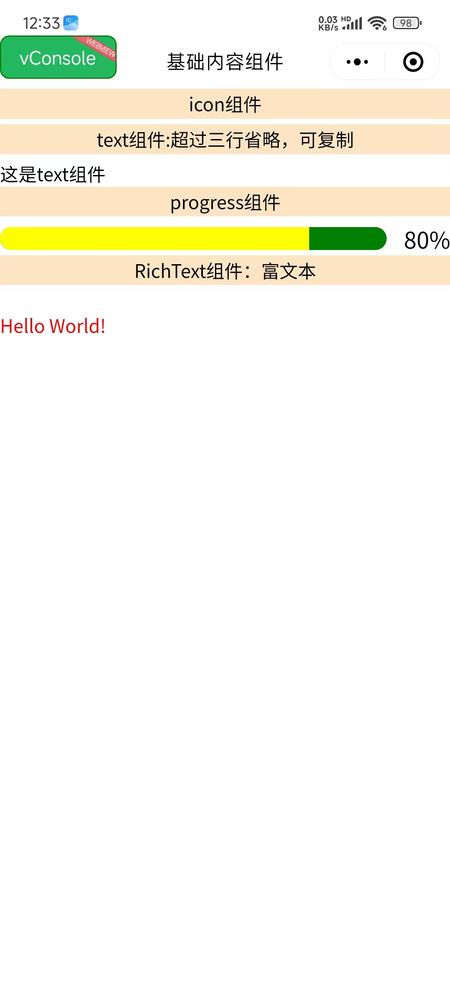

# 🧩 Taro 基础组件完全指南

> 全面掌握 Taro 框架提供的基础内容组件，从简单的图标、文本到复杂的富文本展示，构建美观实用的用户界面。

::: tip 📚 本章内容
详细介绍 Taro 的基础内容组件，包含属性说明、使用示例和最佳实践。
:::

## 📝 基础内容组件

### 🎨 Icon 图标组件

**图标组件，用于显示各种图标。组件属性的长度单位默认为 px。**

| 属性 | 类型 | 默认值 | 说明 |
|------|------|--------|------|
| **type** | String | - | 🎯 图标类型 |
| **size** | Number | 23 | 📏 图标大小（px） |
| **color** | String | - | 🎨 图标颜色 |

### 🔤 Text 文本组件

**文本组件，用于显示文本内容。**

| 属性 | 类型 | 默认值 | 说明 |
|------|------|--------|------|
| **selectable** | Boolean | false | 🎯 文本是否可选中 |
| **userSelect** | Boolean | false | 📱 是否支持用户选择 |
| **decode** | Boolean | false | 🔄 是否解码HTML实体 |
| **numberOfLines** | Number | - | 📏 显示行数限制 |
| **maxLines** | Number | - | 📏 最大行数 |

### 📊 Progress 进度条组件

**进度条组件，用于显示任务进度。组件属性的长度单位默认为 px。**

| 属性 | 类型 | 默认值 | 说明 |
|------|------|--------|------|
| **percent** | Number | 0 | 📊 百分比（0-100） |
| **stroke-width** | Number | 6 | 📏 进度条线宽 |
| **color** | String | #09BB07 | 🎨 进度条颜色 |
| **active-color** | String | #09BB07 | 🎨 已选择进度条颜色 |
| **background-color** | String | #EBEBEB | 🎨 未选择进度条颜色 |
| **active** | Boolean | false | 🎬 是否显示动画 |
| **active-mode** | String | backwards | 🎭 动画模式 |
| **duration** | Number | 30 | ⏱️ 进度增加1%所需毫秒数 |
| **border-radius** | Number | 0 | 🎨 圆角大小 |
| **font-size** | Number | 16 | 📏 百分比字体大小 |
| **show-info** | Boolean | false | 📝 是否显示百分比文字 |

**事件：**
- `@activeEnd` - 动画完成事件

### 📄 RichText 富文本组件

**富文本组件，可渲染文字样式、图片、超链接，支持部分 HTML 标签。**

| 属性 | 类型 | 默认值 | 说明 |
|------|------|--------|------|
| **nodes** | Array/String | - | 🎯 节点列表或HTML字符串 |
| **user-select** | Boolean | false | 📝 文本是否可选 |
| **image-menu-prevent** | Boolean | false | 🖼️ 是否阻止图片菜单 |
| **preview** | Boolean | false | 👁️ 是否支持图片预览 |

## 🎯 组件使用示例

### 📱 完整页面示例

```vue
<template>
  <view class="baseContent">
    <!-- 🎨 图标组件展示 -->
    <view class="item">
      <view class="title">Icon 组件</view>
      <view class="icon-container">
        <icon type="success" size="23" color="red"></icon>
        <icon type="info" size="23" color="blue"></icon>
        <icon type="warn" size="23" color="green"></icon>
        <icon type="waiting" size="23" color="black"></icon>
        <icon type="success_no_circle" size="23" color="pink"></icon>
        <icon type="download" size="23" color="yellow"></icon>
        <icon type="clear" size="23" color="#666666"></icon>
        <icon type="search" size="23" color="#222222"></icon>
        <icon type="circle" size="23" color="#555555"></icon>
        <icon type="info_circle" size="30" color="#999999"></icon>
      </view>
    </view>
    
    <!-- 🔤 文本组件展示 -->
    <view class="item">
      <view class="title">Text 组件：超过三行省略，可复制</view>
      <text 
        :selectable="true" 
        :userSelect="true" 
        :decode="true" 
        :numberOfLines="3" 
        :maxLines="3"
        class="demo-text">
        这是 Text 组件的示例文本。Text 组件用于显示文本内容，支持文本选择、HTML 解码、行数限制等功能。当文本超过指定行数时，会自动省略显示。这个组件在 Taro 应用中广泛使用，是构建文本界面的基础组件。
      </text>
    </view>
    
    <!-- 📊 进度条组件展示 -->
    <view class="item">
      <view class="title">Progress 组件</view>
      <progress 
        percent="80" 
        stroke-width="20" 
        color="blue" 
        active-color="yellow" 
        background-color="green" 
        :active="true" 
        active-mode="forwards" 
        :duration="100" 
        borderRadius="20" 
        font-size="20" 
        :show-info="true" 
        @activeEnd="activeEnd" />
    </view>
    
    <!-- 📄 富文本组件展示 -->
    <view class="item">
      <view class="title">RichText 组件：富文本</view>
      <rich-text 
        :nodes="nodes" 
        :user-select="false" 
        image-menu-prevent="true" 
        preview="true">
      </rich-text>
    </view>
  </view>
</template>

<script>
import { ref } from 'vue'
import './index.scss'

export default {
  setup() {
    const msg = ref('Hello world')
    
    // 🎯 富文本节点配置
    const nodes = [{
      name: 'div',
      attrs: {
        class: 'div_class',
        style: 'line-height: 60px; color: red; font-size: 18px; font-weight: bold;'
      },
      children: [{
        type: 'text',
        text: 'Hello World! 这是富文本组件的示例内容。'
      }]
    }]
    
    // 🎬 进度条动画完成事件
    const activeEnd = function(e) {
      console.log('进度条动画完成:', e)
    }
    
    return {
      msg,
      activeEnd,
      nodes
    }
  }
}
</script>

<style scoped>
.baseContent {
  padding: 20rpx;
  background-color: #f8f8f8;
}

.item {
  margin-bottom: 40rpx;
  padding: 30rpx;
  background-color: #ffffff;
  border-radius: 12rpx;
  box-shadow: 0 2rpx 8rpx rgba(0, 0, 0, 0.1);
}

.title {
  font-size: 32rpx;
  font-weight: bold;
  color: #333333;
  margin-bottom: 20rpx;
  padding-bottom: 10rpx;
  border-bottom: 2rpx solid #e0e0e0;
}

.icon-container {
  display: flex;
  flex-wrap: wrap;
  gap: 20rpx;
  align-items: center;
}

.demo-text {
  font-size: 28rpx;
  line-height: 1.6;
  color: #666666;
  background-color: #f9f9f9;
  padding: 20rpx;
  border-radius: 8rpx;
  border-left: 4rpx solid #007aff;
}
</style>
```

## 🎯 组件特性对比

### 📊 组件功能对比表

| 组件 | 主要功能 | 适用场景 | 特殊属性 |
|------|----------|----------|----------|
| **Icon** | 图标显示 | 🎨 状态提示、装饰 | type, size, color |
| **Text** | 文本显示 | 📝 内容展示、标题 | selectable, numberOfLines |
| **Progress** | 进度展示 | 📊 任务进度、加载状态 | percent, active, duration |
| **RichText** | 富文本渲染 | 📄 HTML内容、样式文本 | nodes, preview |

### 🎨 图标类型说明

| 图标类型 | 描述 | 使用场景 | 推荐颜色 |
|----------|------|----------|----------|
| **success** | 成功图标 | ✅ 操作成功 | #52c41a |
| **info** | 信息图标 | ℹ️ 提示信息 | #1890ff |
| **warn** | 警告图标 | ⚠️ 警告提示 | #faad14 |
| **waiting** | 等待图标 | ⏳ 加载状态 | #666666 |
| **success_no_circle** | 简洁成功 | ✅ 简单确认 | #52c41a |
| **download** | 下载图标 | 📥 下载功能 | #1890ff |
| **clear** | 清除图标 | 🧹 清空操作 | #ff4d4f |
| **search** | 搜索图标 | 🔍 搜索功能 | #666666 |

## 🎯 最佳实践

### ✅ 组件使用建议

::: tip 🎯 开发建议
- ✅ 根据设计规范选择合适的图标类型和颜色
- ✅ 文本组件注意行数限制，避免布局问题
- ✅ 进度条组件合理设置动画时长
- ✅ 富文本组件注意安全性，避免XSS攻击
- ✅ 统一组件样式，保持界面一致性
:::

### ⚠️ 注意事项

::: warning ⚠️ 使用限制
- ❌ 避免过度使用动画效果影响性能
- ❌ 富文本内容要做安全过滤
- ❌ 注意不同平台的样式差异
- ❌ 图标大小要适配不同屏幕密度
:::

### 🚀 性能优化

| 优化点 | 建议 | 实现方式 |
|--------|------|----------|
| **图标优化** | 使用合适的图标大小 | 🎨 避免过大图标影响性能 |
| **文本优化** | 合理设置行数限制 | 📝 防止长文本影响布局 |
| **动画优化** | 控制动画频率 | 🎬 避免过多动画同时执行 |
| **富文本优化** | 简化节点结构 | 📄 减少渲染复杂度 |

### 🎨 样式定制

```scss
// 🎨 自定义组件样式
.custom-icon {
  transition: all 0.3s ease;
  
  &:hover {
    transform: scale(1.1);
  }
}

.custom-text {
  font-family: -apple-system, BlinkMacSystemFont, 'Segoe UI', Roboto, sans-serif;
  letter-spacing: 0.5px;
  
  &.highlight {
    background: linear-gradient(90deg, #ff6b6b, #4ecdc4);
    -webkit-background-clip: text;
    -webkit-text-fill-color: transparent;
  }
}

.custom-progress {
  border-radius: 10px;
  overflow: hidden;
  
  &.success {
    --progress-color: #52c41a;
  }
  
  &.warning {
    --progress-color: #faad14;
  }
  
  &.error {
    --progress-color: #ff4d4f;
  }
}
```

## 📱 实际应用场景

### 🎯 状态展示页面

```vue
<template>
  <view class="status-page">
    <!-- ✅ 成功状态 -->
    <view class="status-item success">
      <icon type="success" size="40" color="#52c41a"></icon>
      <text class="status-text">操作成功</text>
      <progress percent="100" active-color="#52c41a" :show-info="true"></progress>
    </view>
    
    <!-- ⏳ 加载状态 -->
    <view class="status-item loading">
      <icon type="waiting" size="40" color="#1890ff"></icon>
      <text class="status-text">正在处理中...</text>
      <progress percent="60" :active="true" active-color="#1890ff"></progress>
    </view>
    
    <!-- ⚠️ 警告状态 -->
    <view class="status-item warning">
      <icon type="warn" size="40" color="#faad14"></icon>
      <text class="status-text">请注意</text>
      <rich-text :nodes="warningNodes"></rich-text>
    </view>
  </view>
</template>
```

### 📊 数据展示卡片

```vue
<template>
  <view class="data-card">
    <view class="card-header">
      <icon type="info" size="24" color="#1890ff"></icon>
      <text class="card-title">数据统计</text>
    </view>
    
    <view class="card-content">
      <view class="data-item">
        <text class="data-label">完成进度</text>
        <progress 
          percent="75" 
          :active="true" 
          active-color="#52c41a"
          :show-info="true">
        </progress>
      </view>
      
      <view class="data-item">
        <text class="data-label">用户满意度</text>
        <progress 
          percent="92" 
          :active="true" 
          active-color="#1890ff"
          :show-info="true">
        </progress>
      </view>
    </view>
  </view>
</template>
```

---

通过本指南，你已经全面掌握了 Taro 框架的基础内容组件。这些组件虽然简单，但是构建用户界面的重要基础。合理使用这些组件，配合适当的样式设计，可以创建出美观、实用的应用界面。记住要关注组件的性能优化、样式一致性和用户体验，以确保应用的质量。

