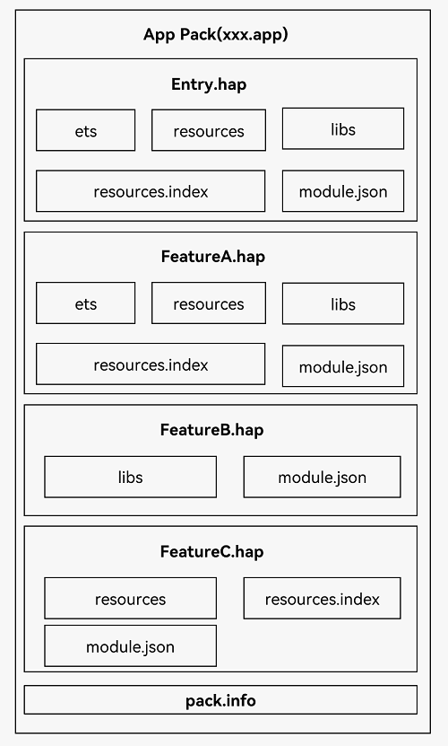

# ☁️ Taro 云开发完全指南

> 全面掌握 Taro 云开发技术栈，从 CloudBase 云服务到独立分包，从鸿蒙应用到跨端部署，让你的应用更加强大。

::: tip 📚 本章内容
详细介绍 Taro 云开发的完整解决方案，包括项目结构、配置方法和最佳实践。
:::

## ☁️ CloudBase 云开发概述

### 🎯 什么是云开发

**CloudBase 云开发**是基于 Serverless 架构构建的一站式后端云服务，为开发者提供完整的云端解决方案。

| 特性 | 说明 | 优势 |
|------|------|------|
| **Serverless 架构** | 无需管理服务器 | 🚀 专注业务逻辑开发 |
| **一站式服务** | 涵盖函数、数据库、存储 | 📦 完整的后端解决方案 |
| **免运维** | 自动扩缩容 | ⚡ 降低运维成本 |
| **多端支持** | 小程序、Web、APP | 🌐 跨平台统一 |

### 📊 核心服务

| 服务类型 | 功能 | 使用场景 |
|----------|------|----------|
| **云函数** | 服务端逻辑处理 | 🔧 API 接口、数据处理 |
| **云数据库** | NoSQL 文档数据库 | 💾 数据存储、查询 |
| **云存储** | 文件存储服务 | 📁 图片、视频、文档 |
| **CDN** | 内容分发网络 | 🚀 静态资源加速 |

::: info 💡 云开发优势
小程序·云开发是微信和腾讯云联合推出的云端一体化解决方案，基于云开发可以免鉴权调用微信所有开放能力，在微信开发者工具中即可开通使用。
:::

## 🏗️ 项目结构

### 📁 完整项目目录

```bash
├── client                                  # 小程序端目录
│   ├── config                              # 配置目录
│   │   ├── dev.js                          # 开发时配置
│   │   ├── index.js                        # 默认配置
│   │   └── prod.js                         # 打包时配置
│   ├── dist                                # 编译结果目录
│   ├── package.json                        # 客户端依赖配置
│   ├── src                                 # 源码目录
│   │   ├── app.scss                        # 项目总通用样式
│   │   ├── app.js                          # 项目入口文件
│   │   ├── components                      # 组件文件目录
│   │   │   └── login                       # login 组件目录
│   │   │       └── index.weapp.js          # login 组件逻辑
│   │   └── pages                           # 页面文件目录
│   │       └── index                       # index 页面目录
│   │           ├── index.scss              # index 页面样式
│   │           └── index.js                # index 页面逻辑
├── cloud                                   # 服务端目录
│   └── functions                           # 云函数目录
│       └── login                           # login 云函数
│           ├── index.js                    # login 函数逻辑
│           └── package.json                # 云函数依赖配置
└── project.config.json                     # 小程序项目配置
```

### 🎯 目录说明

| 目录/文件 | 说明 | 作用 |
|-----------|------|------|
| **client/** | 客户端代码 | 📱 小程序前端逻辑 |
| **cloud/** | 云端代码 | ☁️ 服务端函数和配置 |
| **config/** | 配置文件 | ⚙️ 环境配置管理 |
| **src/** | 源码目录 | 💻 业务逻辑代码 |
| **dist/** | 编译输出 | 📦 构建后的代码 |

## 🔧 使用要点

### 📋 开发流程

::: tip 🚀 开发步骤
1. **开发时**：进入 `client` 目录，运行相关编译预览或打包命令
2. **调试时**：使用微信开发者工具调试项目，将整个文件夹作为运行目录
3. **注意**：不是 `client` 中生成的 `dist` 文件夹，而是整个项目根目录
:::

### 💻 开发命令

```bash
# 进入客户端目录
cd client

# 开发环境启动
npm run dev:weapp

# 生产环境构建
npm run build:weapp

# 预览项目
npm run preview
```

### ⚙️ 配置示例

```javascript
// client/config/index.js
export default {
  projectName: 'taro-cloud-app',
  date: '2024-1-1',
  designWidth: 750,
  deviceRatio: {
    640: 2.34 / 2,
    750: 1,
    828: 1.81 / 2
  },
  sourceRoot: 'src',
  outputRoot: 'dist',
  
  // 云开发配置
  cloud: {
    // 云函数根目录
    cloudfunctionRoot: '../cloud/functions',
    // 环境 ID
    environment: 'your-env-id'
  },
  
  plugins: [
    '@tarojs/plugin-platform-weapp'
  ],
  
  defineConstants: {
    CLOUD_ENV_ID: JSON.stringify('your-env-id')
  },
  
  mini: {
    postcss: {
      pxtransform: {
        enable: true,
        config: {}
      },
      url: {
        enable: true,
        config: {
          limit: 1024 // 设定转换尺寸上限
        }
      },
      cssModules: {
        enable: false,
        config: {
          namingPattern: 'module',
          generateScopedName: '[name]__[local]___[hash:base64:5]'
        }
      }
    }
  }
}
```

## 📦 独立分包

### 🎯 分包概念

**独立分包**是微信小程序的高级功能，Taro 完全支持独立分包的配置和使用。

| 特性 | 说明 | 优势 |
|------|------|------|
| **独立运行** | 不依赖主包 | 🚀 启动速度更快 |
| **按需加载** | 用时才下载 | 📦 减少首屏加载 |
| **资源隔离** | 独立的资源空间 | 🔒 更好的模块化 |

### 🏗️ 分包项目结构

```bash
├── config
├── src
│   ├── pages                    # 主包页面
│   │   └── index
│   ├── moduleA                  # 普通分包
│   │   └── pages
│   │       ├── rabbit
│   │       └── squirrel
│   ├── moduleB                  # 独立分包
│   │   └── pages
│   │       ├── pear
│   │       └── pineapple
│   ├── app.css
│   ├── app.json                 # 应用配置
│   └── app.js
└── package.json
```

### ⚙️ 分包配置

在 `app.json` 中配置分包信息：

```json
{
  "pages": [
    "pages/index"
  ],
  "subpackages": [
    {
      "root": "moduleA",
      "name": "moduleA",
      "pages": [
        "pages/rabbit",
        "pages/squirrel"
      ]
    }, 
    {
      "root": "moduleB",
      "name": "moduleB", 
      "pages": [
        "pages/pear",
        "pages/pineapple"
      ],
      "independent": true    // 标记为独立分包
    }
  ]
}
```

### 📊 分包类型对比

| 分包类型 | 特点 | 使用场景 | 限制 |
|----------|------|----------|------|
| **普通分包** | 依赖主包 | 🔗 功能模块分离 | 需要主包先加载 |
| **独立分包** | 完全独立 | 🚀 独立功能模块 | 不能依赖主包资源 |

### 🎯 独立分包最佳实践

```javascript
// moduleB/pages/pear/index.js - 独立分包页面
import Taro from '@tarojs/taro'

export default {
  onLoad() {
    // ✅ 可以使用 Taro API
    Taro.showToast({
      title: '独立分包加载成功',
      icon: 'success'
    })
    
    // ✅ 可以访问云函数
    Taro.cloud.callFunction({
      name: 'getIndependentData',
      success: res => {
        console.log('独立分包云函数调用成功', res)
      }
    })
  },
  
  // ❌ 不能跳转到主包页面
  // navigateToMain() {
  //   Taro.navigateTo({
  //     url: '/pages/index/index'  // 这会失败
  //   })
  // },
  
  // ✅ 可以跳转到同分包页面
  navigateToSamePackage() {
    Taro.navigateTo({
      url: '/moduleB/pages/pineapple/index'
    })
  }
}
```

## 🦢 鸿蒙 & OpenHarmony

### 🎯 鸿蒙开发概述

随着鸿蒙系统的日渐完善，Taro 提供了完整的鸿蒙应用开发支持。

| 特性 | 说明 | 优势 |
|------|------|------|
| **快速移植** | 小程序转鸿蒙应用 | 🔄 降低开发成本 |
| **原生性能** | 接近原生应用体验 | ⚡ 优秀的性能表现 |
| **统一开发** | 一套代码多端运行 | 🌐 提高开发效率 |

### 🏗️ 鸿蒙应用结构（Stage 模型）



### 📊 鸿蒙应用包结构说明

| 组件 | 说明 | 作用 |
|------|------|------|
| **HAP** | HarmonyOS Ability Package | 📦 应用安装包 |
| **Ability** | 应用组件 | 🧩 功能模块单元 |
| **Module** | 模块 | 📁 代码和资源组织单元 |
| **Bundle** | 应用包 | 🎁 完整的应用程序 |

### 🔧 鸿蒙开发配置

```javascript
// config/index.js - 鸿蒙平台配置
export default {
  // ... 其他配置
  
  // 鸿蒙平台配置
  harmony: {
    // 应用信息
    appInfo: {
      bundleName: 'com.example.taroapp',
      version: '1.0.0',
      apiVersion: 9
    },
    
    // 编译配置
    compiler: {
      type: 'webpack5',
      prebundle: {
        enable: true
      }
    },
    
    // 组件配置
    components: {
      // 自定义组件映射
      customComponents: {
        'taro-view': 'View',
        'taro-text': 'Text',
        'taro-button': 'Button'
      }
    }
  }
}
```

### 🚀 鸿蒙开发命令

```bash
# 安装鸿蒙开发依赖
npm install @tarojs/plugin-platform-harmony

# 开发环境
npm run dev:harmony

# 构建生产版本
npm run build:harmony

# 预览应用
npm run preview:harmony
```

## 🛠️ 最佳实践

### 📋 云开发最佳实践

::: tip ✅ 推荐做法
- 合理规划云函数，避免单个函数过于复杂
- 使用云数据库的索引优化查询性能
- 合理使用云存储的 CDN 加速功能
- 定期监控云函数的执行情况和性能
- 使用环境变量管理不同环境的配置
:::

::: warning ⚠️ 注意事项
- 云函数有执行时间和内存限制
- 云数据库的读写有配额限制
- 云存储的文件大小有限制
- 注意数据安全和权限控制
:::

### 🔧 性能优化

| 优化项 | 说明 | 实现方式 |
|--------|------|----------|
| **分包加载** | 按需加载代码 | 📦 独立分包配置 |
| **云函数优化** | 减少冷启动时间 | ⚡ 函数预热 |
| **数据缓存** | 减少网络请求 | 💾 本地存储 |
| **资源压缩** | 减少包体积 | 🗜️ 代码压缩 |

### 📊 监控和调试

```javascript
// 云函数监控示例
// cloud/functions/monitor/index.js
const cloud = require('wx-server-sdk')

cloud.init({
  env: cloud.DYNAMIC_CURRENT_ENV
})

exports.main = async (event, context) => {
  const { action, data } = event
  
  try {
    // 记录函数调用
    console.log(`函数调用: ${action}`, {
      timestamp: new Date().toISOString(),
      data: data,
      context: context
    })
    
    // 性能监控
    const startTime = Date.now()
    
    // 业务逻辑处理
    let result
    switch (action) {
      case 'getData':
        result = await getData(data)
        break
      case 'saveData':
        result = await saveData(data)
        break
      default:
        throw new Error(`未知操作: ${action}`)
    }
    
    const endTime = Date.now()
    const duration = endTime - startTime
    
    // 记录执行时间
    console.log(`函数执行完成`, {
      action,
      duration: `${duration}ms`,
      success: true
    })
    
    return {
      success: true,
      data: result,
      duration
    }
    
  } catch (error) {
    // 错误监控
    console.error(`函数执行失败`, {
      action,
      error: error.message,
      stack: error.stack
    })
    
    return {
      success: false,
      error: error.message
    }
  }
}

async function getData(params) {
  // 数据获取逻辑
  const db = cloud.database()
  return await db.collection('data').get()
}

async function saveData(data) {
  // 数据保存逻辑
  const db = cloud.database()
  return await db.collection('data').add({ data })
}
```

## 📚 总结

通过本章学习，你已经掌握了 Taro 云开发的完整技术栈。从 CloudBase 云服务的基础概念到独立分包的高级特性，从鸿蒙应用开发到性能优化，这些知识将帮助你构建功能强大、性能优秀的跨端应用。

记住云开发的核心优势：**Serverless 架构降低运维成本**、**一站式服务提高开发效率**、**跨端统一减少重复工作**。合理利用这些特性，你的应用将更加现代化和专业化。