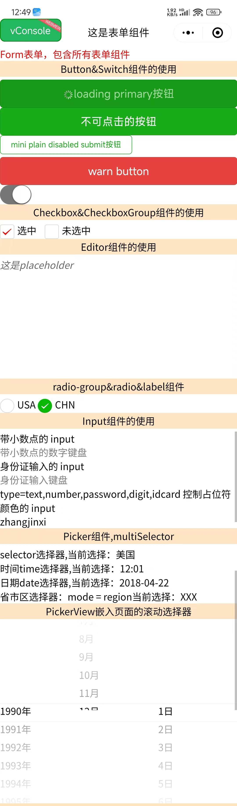

# 📝 Taro 表单组件完全指南

> 全面掌握 Taro 框架提供的表单组件，从基础的输入框按钮到高级的富文本编辑器，从简单的开关到复杂的选择器，让你的表单功能更加完善。

::: tip 📚 本章内容
详细介绍 Taro 表单组件的使用方法，包含组件属性、事件处理和最佳实践。
:::

## 🎯 表单组件概览

### 📊 组件分类

| 分类 | 组件 | 功能 | 使用场景 |
|------|------|------|----------|
| **基础输入** | Input, Textarea | 文本输入 | ✍️ 用户信息录入 |
| **选择控件** | Checkbox, Radio, Switch | 选项选择 | ☑️ 单选多选开关 |
| **选择器** | Picker, PickerView | 数据选择 | 📅 时间日期地区选择 |
| **按钮** | Button | 操作触发 | 🔘 表单提交操作 |
| **编辑器** | Editor | 富文本编辑 | 📝 富文本内容编辑 |
| **表单容器** | Form, Label | 表单组织 | 📋 表单结构管理 |
| **辅助工具** | KeyboardAccessory, Slider | 辅助输入 | 🛠️ 增强用户体验 |

## 📝 基础输入组件

### ✍️ Input 组件

**文本输入组件，支持多种输入类型。**

| 属性 | 类型 | 说明 | 默认值 |
|------|------|------|--------|
| **type** | String | 输入类型 | text |
| **value** | String | 输入框的值 | - |
| **placeholder** | String | 占位符文本 | - |
| **placeholder-style** | String | 占位符样式 | - |
| **disabled** | Boolean | 是否禁用 | false |
| **maxlength** | Number | 最大输入长度 | 140 |
| **focus** | Boolean | 获取焦点 | false |
| **confirmType** | String | 确认按钮文字 | done |
| **cursor** | Number | 光标位置 | - |
| **cursorSpacing** | Number | 光标与键盘距离 | 0 |

#### 🎯 输入类型

| 类型 | 说明 | 键盘类型 |
|------|------|----------|
| **text** | 文本输入 | 📝 标准键盘 |
| **number** | 数字输入 | 🔢 数字键盘 |
| **digit** | 带小数点数字 | 🔢 数字键盘（含小数点） |
| **idcard** | 身份证输入 | 🆔 身份证键盘 |
| **password** | 密码输入 | 🔒 密码键盘 |

#### 🎯 确认按钮类型

| 类型 | 说明 | 显示文字 |
|------|------|----------|
| **done** | 完成 | 完成 |
| **send** | 发送 | 发送 |
| **search** | 搜索 | 搜索 |
| **next** | 下一个 | 下一个 |
| **go** | 前往 | 前往 |

### 📄 Textarea 组件

**多行文本输入组件。**

| 属性 | 类型 | 说明 | 默认值 |
|------|------|------|--------|
| **value** | String | 输入框的值 | - |
| **placeholder** | String | 占位符文本 | - |
| **disabled** | Boolean | 是否禁用 | false |
| **maxlength** | Number | 最大输入长度 | 140 |
| **auto-height** | Boolean | 自动增高 | false |
| **show-count** | Boolean | 显示字数统计 | false |
| **cursor-spacing** | Number | 光标与键盘距离 | 0 |

## ☑️ 选择控件组件

### 🔘 Button 组件

**按钮组件，用于触发操作。**

| 属性 | 类型 | 说明 | 默认值 |
|------|------|------|--------|
| **size** | String | 按钮大小 | default |
| **type** | String | 按钮类型 | default |
| **plain** | Boolean | 是否镂空 | false |
| **disabled** | Boolean | 是否禁用 | false |
| **loading** | Boolean | 名称前是否带 loading 图标 | false |
| **formType** | String | 表单类型 | - |
| **hover-class** | String | 按下时的样式类 | button-hover |

#### 🎯 按钮大小

| 值 | 说明 | 样式 |
|-----|------|------|
| **default** | 默认大小 | 标准按钮 |
| **mini** | 小尺寸 | 迷你按钮 |

#### 🎯 按钮类型

| 值 | 说明 | 样式 |
|-----|------|------|
| **primary** | 主要按钮 | 🔵 蓝色按钮 |
| **default** | 默认按钮 | ⚪ 白色按钮 |
| **warn** | 警告按钮 | 🔴 红色按钮 |

#### 🎯 表单类型

| 值 | 说明 | 功能 |
|-----|------|------|
| **submit** | 提交按钮 | 触发表单提交 |
| **reset** | 重置按钮 | 触发表单重置 |

### ☑️ Checkbox 组件

**复选框组件，支持多选。**

| 属性 | 类型 | 说明 | 默认值 |
|------|------|------|--------|
| **value** | String | 复选框标识 | - |
| **checked** | Boolean | 是否选中 | false |
| **disabled** | Boolean | 是否禁用 | false |
| **color** | String | 选中时的颜色 | #09BB07 |

### 📋 CheckboxGroup 组件

**复选框组，用于管理多个复选框。**

| 属性 | 类型 | 说明 | 默认值 |
|------|------|------|--------|
| **name** | String | 表单字段名 | - |

#### 📱 事件回调

| 事件 | 说明 | 回调参数 |
|------|------|----------|
| **@change** | 选中项变化 | 选中的值数组 |

### 🔘 Radio 组件

**单选框组件，支持单选。**

| 属性 | 类型 | 说明 | 默认值 |
|------|------|------|--------|
| **value** | String | 单选框标识 | - |
| **checked** | Boolean | 是否选中 | false |
| **disabled** | Boolean | 是否禁用 | false |
| **color** | String | 选中时的颜色 | #09BB07 |

### 📋 RadioGroup 组件

**单选框组，用于管理多个单选框。**

| 属性 | 类型 | 说明 | 默认值 |
|------|------|------|--------|
| **name** | String | 表单字段名 | - |

#### 📱 事件回调

| 事件 | 说明 | 回调参数 |
|------|------|----------|
| **@change** | 选中项变化 | 选中的值 |

### 🔄 Switch 组件

**开关组件，用于布尔值选择。**

| 属性 | 类型 | 说明 | 默认值 |
|------|------|------|--------|
| **checked** | Boolean | 是否选中 | false |
| **disabled** | Boolean | 是否禁用 | false |
| **type** | String | 开关类型 | switch |
| **color** | String | 选中时的颜色 | #04BE02 |

#### 📱 事件回调

| 事件 | 说明 | 回调参数 |
|------|------|----------|
| **@change** | 状态变化 | 当前状态 |

## 📅 选择器组件

### 🎯 Picker 组件

**从底部弹起的滚动选择器。**

| 属性 | 类型 | 说明 | 默认值 |
|------|------|------|--------|
| **mode** | String | 选择器类型 | selector |
| **range** | Array | 选择器数据 | [] |
| **value** | Number/String | 当前选中值 | 0 |
| **disabled** | Boolean | 是否禁用 | false |

#### 🎯 选择器类型

| 模式 | 说明 | 使用场景 |
|------|------|----------|
| **selector** | 普通选择器 | 📋 单项选择 |
| **multiSelector** | 多列选择器 | 📊 多项选择 |
| **time** | 时间选择器 | ⏰ 时间选择 |
| **date** | 日期选择器 | 📅 日期选择 |
| **region** | 省市区选择器 | 📍 地区选择 |

#### 📱 时间选择器属性

| 属性 | 类型 | 说明 | 默认值 |
|------|------|------|--------|
| **start** | String | 开始时间 | - |
| **end** | String | 结束时间 | - |

#### 📱 日期选择器属性

| 属性 | 类型 | 说明 | 默认值 |
|------|------|------|--------|
| **start** | String | 开始日期 | - |
| **end** | String | 结束日期 | - |
| **fields** | String | 精度 | day |

#### 🎯 日期精度选项

| 值 | 说明 | 显示格式 |
|-----|------|----------|
| **year** | 年 | YYYY |
| **month** | 月 | YYYY-MM |
| **day** | 日 | YYYY-MM-DD |

### 📊 PickerView 组件

**嵌入页面的滚动选择器。**

| 属性 | 类型 | 说明 | 默认值 |
|------|------|------|--------|
| **value** | Array | 当前选中值 | [] |
| **indicator-style** | String | 指示器样式 | - |

::: info 💡 使用说明
其中只可放置 `picker-view-column` 组件，其它节点不会显示。
:::

### 📋 PickerViewColumn 组件

**滚动选择器子项。**

::: warning ⚠️ 使用限制
- 仅可放置于 `<PickerView />` 中
- 其孩子节点的高度会自动设置成与 picker-view 的选中框的高度一致
:::

## 📝 富文本编辑器

### ✏️ Editor 组件

**富文本编辑器，可以对图片、文字进行编辑。**

| 属性 | 类型 | 说明 | 默认值 |
|------|------|------|--------|
| **readOnly** | Boolean | 是否只读 | false |
| **placeholder** | String | 占位符 | - |
| **showImgSize** | Boolean | 显示图片尺寸控制 | false |
| **showImgToolbar** | Boolean | 显示图片工具栏 | false |
| **showImgResize** | Boolean | 显示图片尺寸调整 | false |

#### 📱 事件回调

| 事件 | 说明 | 回调参数 |
|------|------|----------|
| **@ready** | 编辑器初始化完成 | - |
| **@focus** | 编辑器聚焦 | - |
| **@blur** | 编辑器失焦 | - |
| **@input** | 编辑器内容改变 | 内容详情 |

## 🛠️ 辅助组件

### 🎚️ Slider 组件

**滑动选择器。**

| 属性 | 类型 | 说明 | 默认值 |
|------|------|------|--------|
| **min** | Number | 最小值 | 0 |
| **max** | Number | 最大值 | 100 |
| **step** | Number | 步长 | 1 |
| **value** | Number | 当前值 | 0 |
| **show-value** | Boolean | 显示当前值 | false |
| **disabled** | Boolean | 是否禁用 | false |
| **activeColor** | String | 已选择的颜色 | #1aad19 |
| **backgroundColor** | String | 背景条的颜色 | #e9e9e9 |
| **trackSize** | Number | 轨道线条高度 | 2 |

### ⌨️ KeyboardAccessory 组件

**键盘工具栏组件。**

::: warning ⚠️ 使用要求
需要配置 Taro 插件 `@tarojs/plugin-platform-weapp` 的 `enablekeyboardAccessory` 参数为 `true` 后才能使用。
:::

**设置 Input / Textarea 聚焦时键盘上方 CoverView / CoverImage 工具栏视图。**

### 🏷️ Label 组件

**标签组件，用来改进表单组件的可用性。**

| 属性 | 类型 | 说明 | 默认值 |
|------|------|------|--------|
| **for** | String | 绑定控件的 id | - |

### 📋 Form 组件

**表单容器组件，用于提交表单数据。**

#### 📱 事件回调

| 事件 | 说明 | 回调参数 |
|------|------|----------|
| **@submit** | 表单提交 | 表单数据 |
| **@reset** | 表单重置 | - |

## 💻 完整使用示例

```vue
<template>
  <view class="form">
    <view class="form-header">
      <text class="form-title">📝 Taro 表单组件完整示例</text>
    </view>
    
    <form @submit="formSubmit" @reset="formReset">
      <view class="item">
        <view class="title">Button&Switch组件的使用</view>
        <button
          size="default"
          type="primary"
          :loading="true"
          formType="submit"
          hover-class="buttonHover">
          loading primary按钮
        </button>
        <button
          size="default"
          type="primary"
          formType="submit"
          hover-class="buttonHover">
          不可点击的按钮
        </button>
        <button
          size="mini"
          :plain="true"
          type="primary"
          :disabled="false"
          :loading="false"
          formType="submit"
          hover-class="buttonHover">
          mini plain disabled submit按钮
        </button>
        <button type="warn">warn button</button>
        <switch
          name="switch"
          type="switch"
          color="#777777"
          :checked="true"
          :disabled="false"
          @change="e => console.log(e)"></switch>
      </view>
      <view class="item">
        <view class="title">Checkbox&CheckboxGroup组件的使用</view>
        <checkbox-group name="sex" @change="checkboxGroupChange">
          <checkbox value="选中" :checked="true" :disabled="false" color="red"
            >选中
          </checkbox>
          <checkbox style="margin-left: 20rpx" value="未选中">未选中</checkbox>
        </checkbox-group>
      </view>
      <view class="item">
        <view class="title">Editor组件的使用</view>
        <editor
          id="editor"
          name="editor"
          :readOnly="false"
          :showImgSize="true"
          :showImgToolbar="true"
          :showImgResize="true"
          placeholder="这是placeholder"
          @ready="editorReady"></editor>
      </view>
      <view class="item">
        <view class="title">radio-group&radio&label组件</view>
        <radio-group
          name="radioName"
          @change="e => console.log('radioName', e)">
          <label class="example-body__label" for="1" key="1">
            <radio
              id="1"
              value="USA"
              :checked="true"
              :disabled="false"
              color="#777777" />USA
          </label>
          <label class="example-body__label" for="2" key="2">
            <radio id="2" value="CHN" :checked="true" />CHN
          </label>
        </radio-group>
      </view>
      <view class="item">
        <view class="title">Input组件的使用</view>
        <text>带小数点的 input</text>
        <input name="digit" type="digit" placeholder="带小数点的数字键盘" />
        <text>身份证输入的 input</text>
        <input name="idcard" type="idcard" placeholder="身份证输入键盘" />
        <text
          >type=text,number,password,digit,idcard 控制占位符颜色的 input</text
        >
        <input
          name="text"
          type="text"
          placeholder="占位符字体是红色的"
          placeholder-style="color:red;"
          :disabled="false"
          :focus="true"
          :confirmHold="true"
          :maxlength="150"
          :cursorSpacing="10"
          :cursor="10"
          value="zhangjinxi"
          confirmType="zhangjinxi" />
      </view>
      <view class="item">
        <view class="title">Picker组件,multiSelector</view>
        <picker
          name="selector"
          mode="selector"
          :value="1"
          :disabled="false"
          :range="selector"
          @change="value => console.log(value, e)"
          @cancel="e => console.log(e)">
          <view class="picker">
            selector选择器,当前选择：{{ selectorChecked }}
          </view>
        </picker>
        <picker
          name="time"
          mode="time"
          :value="1"
          start="11:10"
          end="12:12"
          @change="e => console.log(e)">
          <view class="picker"> 时间time选择器,当前选择：{{ timeSel }} </view>
        </picker>
        <picker
          name="date"
          mode="date"
          fields="day"
          @change="e => console.log(e)">
          <view class="picker"> 日期date选择器,当前选择：{{ dateSel }} </view>
        </picker>
        <picker
          mode="region"
          level="region"
          @change="value => console.log(value, e)">
          <view class="picker"> 省市区选择器：mode = region当前选择：XXX </view>
        </picker>
      </view>
      <view class="item">
        <view class="title">PickerView嵌入页面的滚动选择器</view>
        <picker-view
          title="这是pickerView Title"
          indicator-style="height: 30px;"
          style="width: 100%; height: 300px"
          :value="value"
          @change="onChange">
          <picker-view-column>
            <view v-for="(item, index) in years" :key="index"
              >{{ item }}年</view
            >
          </picker-view-column>
          <picker-view-column>
            <view v-for="(item, index) in months" :key="index"
              >{{ item }}月</view
            >
          </picker-view-column>
          <picker-view-column>
            <view v-for="(item, index) in days" :key="index">{{ item }}日</view>
          </picker-view-column>
        </picker-view>
      </view>
      <view class="item">
        <view class="title">Slider滑动选择器</view>
        <slider
          step="1"
          value="100"
          :trackSize="10"
          :show-value="true"
          min="50"
          max="200"
          :disabled="false"
          backgroundColor="#888888"
          active-color="#666666" />
      </view>
      <view class="item">
        <view class="title">Textarea&KeyboardAccessory组件</view>
        <textarea
          name="textarea"
          :auto-height="true"
          value="这是默认内容"
          placeholder="placeholder"
          :disabled="false"
          :maxlength="150"
          :autofocus="true"
          :cursor-spaceing="20"
          :show-count="true"
          :auto-focusd="true">
            <!-- <keyboard-accessory class="container" style="height:50rpx">
                <cover-view style="height:20rpx;background-color: yellow;">coverView</cover-view>
            </keyboard-accessory> -->
            </textarea
        >
      </view>
      <button type="primary" form-type="submit">Submit</button>
      <button type="warn" form-type="reset">Reset</button>
    </form>
  </view>
</template>

<script>
import { ref, reactive } from "vue";
import "./index.scss";
import Taro from "@tarojs/taro";
export default {
  setup() {
    let editorCtx = reactive({});
    let selector = reactive(["美国", "中国", "巴西", "日本"]);
    let selectorChecked = ref("美国");
    let timeSel = ref("12:01");
    let dateSel = ref("2018-04-22");
    const checkboxChange = function (e) {
      console.log(e);
    };
    const checkboxGroupChange = function (e) {
      console.log("checkboxGroupChange", e);
    };
    const formSubmit = function (e) {
      console.log("formSubmit", e);
    };
    const formReset = function (e) {
      console.log("formReset", e);
    };
    const editorReady = function () {
      console.log("编辑器初始化完成时触发");
      Taro.createSelectorQuery()
        .select("#editor")
        .context(res => (editorCtx = res.context))
        .exec();
    };
    const date = new Date();
    const years = reactive([]);
    const months = reactive([]);
    const days = reactive([]);
    const value = reactive([3, 1, 1]);
    for (let i = 1990; i <= date.getFullYear(); i++) {
      years.push(i);
    }
    for (let i = 1; i <= 12; i++) {
      months.push(i);
    }
    for (let i = 1; i <= 31; i++) {
      days.push(i);
    }
    const onChange = function (e) {
      const val = e.detail.value;
      console.log(val);
    };
    return {
      checkboxChange,
      checkboxGroupChange,
      editorReady,
      formSubmit,
      formReset,
      selector,
      selectorChecked,
      timeSel,
      dateSel,
      onChange,
      years,
      months,
      days,
      value,
    };
  },
};
</script>
```

## 🎯 最佳实践

### ✅ 开发建议

::: tip 🎯 使用建议
- ✅ 合理使用不同类型的输入框提升用户体验
- ✅ 为表单字段添加必要的验证和错误提示
- ✅ 使用 Label 组件提升表单可访问性
- ✅ 选择器组件要提供合理的默认值
- ✅ 富文本编辑器要做好内容格式化处理
:::

### ⚠️ 注意事项

::: warning ⚠️ 重要提醒
- ❌ KeyboardAccessory 需要插件配置才能使用
- ❌ 不同平台的表单组件样式可能有差异
- ❌ 某些输入类型在不同平台支持度不同
- ❌ 表单验证要在客户端和服务端都进行
:::

### 🚀 性能优化

| 优化点 | 建议 | 实现方式 |
|--------|------|----------|
| **表单验证** | 实时验证和提交验证结合 | 🎯 减少不必要的验证请求 |
| **选择器数据** | 懒加载大数据集 | 💾 按需加载选择器数据 |
| **富文本编辑** | 限制内容大小 | 📝 避免性能问题 |
| **表单提交** | 防重复提交 | 🛡️ 提交后禁用按钮 |

### 🎨 样式定制

```scss
// 表单容器样式
.form {
  padding: 20rpx;
  background-color: #f8f8f8;
}

// 表单项样式
.form-item {
  margin-bottom: 40rpx;
  padding: 30rpx;
  background-color: #ffffff;
  border-radius: 12rpx;
  box-shadow: 0 2rpx 8rpx rgba(0, 0, 0, 0.1);
}

// 标题样式
.form-title {
  font-size: 32rpx;
  font-weight: bold;
  color: #333333;
  margin-bottom: 20rpx;
}

// 按钮样式
.form-button {
  margin: 20rpx 0;
  border-radius: 8rpx;
}

// 输入框样式
.form-input {
  padding: 20rpx;
  border: 1rpx solid #e0e0e0;
  border-radius: 8rpx;
  background-color: #ffffff;
}

// 选择器样式
.form-picker {
  padding: 20rpx;
  border: 1rpx solid #e0e0e0;
  border-radius: 8rpx;
  background-color: #ffffff;
  color: #333333;
}

// 开关样式
.form-switch {
  display: flex;
  align-items: center;
  justify-content: space-between;
  padding: 20rpx 0;
}

// 复选框和单选框样式
.form-checkbox-group,
.form-radio-group {
  display: flex;
  flex-wrap: wrap;
  gap: 20rpx;
}

.form-checkbox-item,
.form-radio-item {
  display: flex;
  align-items: center;
  padding: 10rpx 20rpx;
  background-color: #f9f9f9;
  border-radius: 8rpx;
}

// 滑块样式
.form-slider {
  margin: 30rpx 0;
}

// 编辑器样式
.form-editor {
  min-height: 200rpx;
  border: 1rpx solid #e0e0e0;
  border-radius: 8rpx;
  padding: 20rpx;
}

// 选择器视图样式
.form-picker-view {
  background-color: #ffffff;
  border-radius: 8rpx;
  border: 1rpx solid #e0e0e0;
}
```

---

通过本指南，你已经全面掌握了 Taro 框架中的表单组件。这些组件为你的应用提供了完整的表单解决方案，从基础的输入输出到高级的富文本编辑，从简单的开关选择到复杂的多级选择器，都能找到合适的实现方式。记住要关注用户体验、数据验证和平台兼容性，以确保表单功能的稳定性和易用性。

