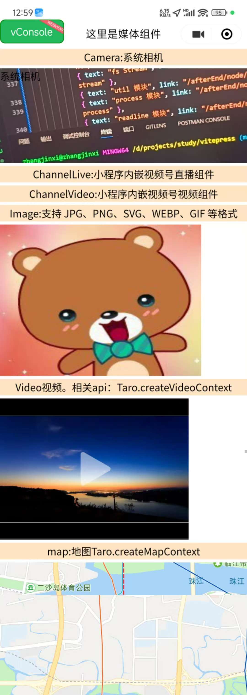
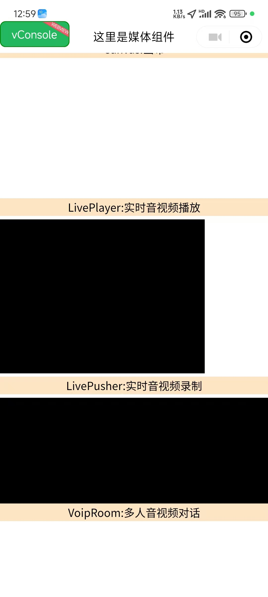

# 🎬 Taro 媒体组件完全指南

> 全面掌握 Taro 框架提供的媒体组件，从基础的图片视频到高级的直播音视频，从地图定位到画布绘制，让你的应用多媒体功能更加丰富。

::: tip 📚 本章内容
详细介绍 Taro 媒体组件的使用方法，包含组件属性、事件处理和最佳实践。
:::

## 🎯 媒体组件概览

### 📊 组件分类

| 分类 | 组件 | 功能 | 使用场景 |
|------|------|------|----------|
| **图像** | Image, Camera, ArCamera | 图片显示和拍摄 | 📸 图片展示、拍照 |
| **视频** | Video, AnimationVideo, ChannelVideo | 视频播放 | 🎥 视频内容播放 |
| **音频** | Audio, LivePlayer, LivePusher | 音频处理 | 🎵 音频播放、直播 |
| **动画** | AnimationView, Lottie | 动画效果 | ✨ 动效展示 |
| **直播** | ChannelLive, RtcRoom, VoipRoom | 直播通话 | 📺 实时音视频 |
| **地图** | Map | 地图服务 | 📍 位置服务 |
| **绘制** | Canvas | 图形绘制 | 🎨 自定义绘图 |

## 📸 图像组件

### 🖼️ Image 组件

**图片组件，支持多种图片格式和云文件ID。**

| 属性 | 类型 | 说明 | 默认值 |
|------|------|------|--------|
| **src** | String | 图片资源地址 | - |
| **mode** | String | 图片裁剪、缩放模式 | scaleToFill |
| **lazyLoad** | Boolean | 图片懒加载 | false |
| **showMenuByLongpress** | Boolean | 长按图片显示菜单 | false |
| **fadeIn** | Boolean | 图片载入时的渐显效果 | false |

#### 🎯 支持格式

::: tip 📄 支持的图片格式
- ✅ **JPG** - 标准图片格式
- ✅ **PNG** - 透明图片格式  
- ✅ **SVG** - 矢量图形格式
- ✅ **WEBP** - 高效图片格式
- ✅ **GIF** - 动图格式
- ✅ **云文件ID** - 云存储图片
:::

### 📷 Camera 组件

**系统相机组件，用于拍照和录像。**

| 属性 | 类型 | 说明 | 可选值 |
|------|------|------|--------|
| **mode** | String | 相机模式 | normal, scanCode |
| **resolution** | String | 分辨率 | low, medium, high |
| **devicePosition** | String | 摄像头方向 | front, back |
| **flash** | String | 闪光灯 | auto, on, off, torch |
| **frameSize** | String | 指定期望的相机帧数据尺寸 | small, medium, large |
| **outputDimension** | String | 拍照图片/录制视频的分辨率 | 720P, 1080P |

### 🥽 ArCamera 组件

**AR 相机组件，支持增强现实功能。**

::: warning ⚠️ 平台支持
AR 相机组件仅在支持 AR 功能的平台上可用，使用前请检查平台兼容性。
:::

## 🎥 视频组件

### 📺 Video 组件

**视频播放组件，支持多种视频格式。**

| 属性 | 类型 | 说明 | 默认值 |
|------|------|------|--------|
| **src** | String | 视频资源地址 | - |
| **poster** | String | 视频封面图片 | - |
| **controls** | Boolean | 显示播放控件 | true |
| **autoplay** | Boolean | 自动播放 | false |
| **loop** | Boolean | 循环播放 | false |
| **muted** | Boolean | 静音播放 | false |
| **initialTime** | Number | 指定视频初始播放位置 | 0 |

#### 📱 相关 API

```javascript
// 创建视频上下文
const videoContext = Taro.createVideoContext('videoId')

// 视频操作方法
videoContext.play()         // 播放
videoContext.pause()        // 暂停
videoContext.seek(position) // 跳转到指定位置
videoContext.sendDanmu()    // 发送弹幕
```

### 🎬 AnimationVideo 组件

**透明视频动画组件，支持透明背景视频播放。**

### 📱 ChannelVideo 组件

**小程序内嵌视频号视频组件。**

| 属性 | 类型 | 说明 | 默认值 |
|------|------|------|--------|
| **feedId** | String | 视频号 feedId | - |
| **finderUserName** | String | 视频号 id | - |
| **objectFit** | String | 视频填充模式 | contain |
| **loop** | Boolean | 循环播放 | false |
| **muted** | Boolean | 静音播放 | false |
| **autoplay** | Boolean | 自动播放 | false |

::: info 💡 使用说明
- 支持在小程序中播放视频号视频
- 无弹窗跳转至视频号
- 需要与小程序相同主体或关联主体
:::

### 📺 ChannelLive 组件

**小程序内嵌视频号直播组件。**

| 属性 | 类型 | 说明 | 默认值 |
|------|------|------|--------|
| **feedId** | String | 直播 feedId | - |
| **finderUserName** | String | 视频号 id | - |

::: info 📱 功能特点
- 展示视频号直播状态和封面
- 无弹窗跳转至视频号
- 需要与小程序的主体一致
:::

## 🎵 音频组件

### 🔊 Audio 组件

**音频播放组件。**

::: warning ⚠️ 版本说明
1.6.0版本开始，该组件不再维护。建议使用能力更强的 `Taro.createInnerAudioContext` 接口。
:::

```javascript
// 推荐使用 InnerAudioContext
const innerAudioContext = Taro.createInnerAudioContext()

innerAudioContext.src = 'audio-url'
innerAudioContext.play()

// 事件监听
innerAudioContext.onPlay(() => {
  console.log('开始播放')
})

innerAudioContext.onError((res) => {
  console.log('播放错误:', res)
})
```

### 📡 LivePlayer 组件

**实时音视频播放组件。**

| 属性 | 类型 | 说明 | 默认值 |
|------|------|------|--------|
| **src** | String | 音视频地址 | - |
| **mode** | String | 模式 | live |
| **autoplay** | Boolean | 自动播放 | false |

::: warning ⚠️ 权限要求
需要先通过类目审核，再在小程序管理后台，"设置"-"接口设置"中自助开通该组件权限。
:::

#### 📱 相关 API

```javascript
// 创建直播播放器上下文
const livePlayerContext = Taro.createLivePlayerContext('livePlayerId')

// 直播播放器操作
livePlayerContext.play()        // 播放
livePlayerContext.stop()        // 停止
livePlayerContext.mute()        // 静音
livePlayerContext.requestFullScreen() // 全屏
```

### 📹 LivePusher 组件

**实时音视频录制组件。**

| 属性 | 类型 | 说明 | 权限要求 |
|------|------|------|----------|
| **url** | String | 推流地址 | - |
| **mode** | String | 推流模式 | RTC |
| **autopush** | Boolean | 自动推流 | false |

::: warning ⚠️ 权限要求
- 需要用户授权 `scope.camera`（摄像头权限）
- 需要用户授权 `scope.record`（录音权限）
- 需要先通过类目审核，再在小程序管理后台，「开发」-「接口设置」中自助开通该组件权限
:::

## ✨ 动画组件

### 🎭 AnimationView 组件

**Lottie 动画组件，支持复杂动画效果。**

### 🌟 Lottie 组件

**Lottie 动画播放组件，支持 JSON 格式动画文件。**

| 属性 | 类型 | 说明 | 默认值 |
|------|------|------|--------|
| **path** | String | 动画文件路径 | - |
| **speed** | Number | 播放速度 | 1.0 |
| **repeatCount** | Number | 重复次数 | 0 |
| **autoplay** | Boolean | 自动播放 | true |

## 📺 直播通话组件

### 🏠 RtcRoom 组件

**实时音视频通话房间组件。**

### 👥 RtcRoomItem 组件

**实时音视频通话画面组件。**

### 💬 VoipRoom 组件

**多人音视频对话组件。**

| 属性 | 类型 | 说明 | 默认值 |
|------|------|------|--------|
| **openId** | String | 用户 openId | - |
| **devicePosition** | String | 摄像头方向 | front |
| **objectFit** | String | 画面填充模式 | fill |
| **mode** | String | 通话模式 | video |

| 权限要求 | 相关接口 | 说明 |
|----------|----------|------|
| scope.camera | Taro.joinVoIPChat | 摄像头权限 |
| scope.record | - | 录音权限 |

::: tip 💡 使用流程
1. 开通组件权限
2. 调用 `joinVoIPChat` 成功后获取房间成员 openid
3. 传递给 `voip-room` 组件显示成员画面
:::

## 📍 地图组件

### 🗺️ Map 组件

**地图组件，提供地图显示和定位功能。**

| 属性 | 类型 | 说明 | 默认值 |
|------|------|------|--------|
| **longitude** | Number | 中心经度 | - |
| **latitude** | Number | 中心纬度 | - |
| **scale** | Number | 缩放级别 | 16 |
| **markers** | Array | 标记点 | [] |
| **polyline** | Array | 路线 | [] |
| **show-location** | Boolean | 显示用户位置 | false |

#### 📱 相关 API

```javascript
// 创建地图上下文
const mapContext = Taro.createMapContext('mapId')

// 地图操作方法
mapContext.getCenterLocation() // 获取中心位置
mapContext.moveToLocation()    // 移动到用户位置
mapContext.translateMarker()   // 移动标记点
mapContext.includePoints()     // 缩放视野展示所有经纬度
```

## 🎨 画布组件

### 🖌️ Canvas 组件

**画布组件，用于图形绘制。**

| 属性 | 类型 | 说明 | 默认值 |
|------|------|------|--------|
| **canvas-id** | String | 画布标识符 | - |
| **type** | String | 画布类型 | 2d |
| **disable-scroll** | Boolean | 禁止滚动 | false |

::: warning ⚠️ 平台支持
Canvas 组件的 React Native 版本尚未实现。
:::

#### 🎯 支付宝小程序特殊要求

```vue
<!-- 支付宝小程序需要添加 id 属性，值和 canvasId 一致 -->
<canvas
  id="canvas-id"
  canvas-id="canvas-id"
  type="2d" />
```

## 💻 完整使用示例

```vue
<template>
  <view class="media">
    <!-- 📷 系统相机 -->
    <view class="item">
      <view class="title">Camera: 系统相机</view>
      <camera
        :resourceWidth="100"
        :resourceHeight="100"
        :loop="true"
        :autoplay="true"
        mode="normal"
        resolution="medium"
        frameSize="medium"
        devicePosition="back"
        flash="auto"
        outputDimension="720P"
        @ready="handleCameraReady">
        系统相机
      </camera>
    </view>
    
    <!-- 📺 视频号直播 -->
    <view class="item">
      <view class="title">ChannelLive: 小程序内嵌视频号直播组件</view>
      <channel-live 
        feedId="your-feed-id" 
        finderUserName="your-finder-username">
        ChannelLive
      </channel-live>
    </view>
    
    <!-- 📱 视频号视频 -->
    <view class="item">
      <view class="title">ChannelVideo: 小程序内嵌视频号视频组件</view>
      <channel-video
        feedId="your-feed-id"
        finderUserName="your-finder-username"
        objectFit="fill"
        :loop="true"
        :muted="true"
        :autoplay="true">
        ChannelVideo
      </channel-video>
    </view>
    
    <!-- 🖼️ 图片展示 -->
    <view class="item">
      <view class="title">Image: 支持 JPG、PNG、SVG、WEBP、GIF 等格式</view>
      <image
        src="@/assets/img/1.jpg"
        originalSrc="@/assets/img/1.jpg"
        mode="scaleToFill"
        :lazyLoad="true"
        :showMenuByLongpress="true"
        :fadeIn="true"
        preview="scaleToFill"
        @load="handleImageLoad"
        @error="handleImageError" />
    </view>
    
    <!-- 🎥 视频播放 -->
    <view class="item">
      <view class="title">Video: 视频播放组件</view>
      <video
        id="video"
        src="https://wxsnsdy.tc.qq.com/105/20210/snsdyvideodownload?filekey=30280201010421301f0201690402534804102ca905ce620b1241b726bc41dcff44e00204012882540400&bizid=1023&hy=SH&fileparam=302c020101042530230204136ffd93020457e3c4ff02024ef202031e8d7f02030f42400204045a320a0201000400"
        poster="https://img1.baidu.com/it/u=4049022245,514596079&fm=253&app=138&size=w931&n=0&f=JPEG&fmt=auto?sec=1702054800&t=f78ab44b6c79d50010356b808487b695"
        initial-time="0"
        :controls="true"
        :autoplay="false"
        :loop="false"
        :muted="false"
        @play="handleVideoPlay"
        @pause="handleVideoPause"
        @ended="handleVideoEnded" />
    </view>
    
    <!-- 🗺️ 地图组件 -->
    <view class="item">
      <view class="title">Map: 地图组件</view>
      <map
        id="map"
        style="width: 100%; height: 300px"
        longitude="113.324520"
        latitude="23.099994"
        scale="14"
        :markers="markers"
        :polyline="polyline"
        :show-location="true"
        @regionchange="handleRegionChange"
        @markertap="handleMarkerTap" />
    </view>
    
    <!-- 🎨 画布组件 -->
    <view class="item">
      <view class="title">Canvas: 画布</view>
      <canvas
        style="width: 300px; height: 200px"
        :disableScroll="false"
        id="canvas-id"
        type="2d"
        canvas-id="canvas"
        @touchstart="handleCanvasTouch" />
    </view>
    
    <!-- 📡 直播播放 -->
    <view class="item">
      <view class="title">LivePlayer: 实时音视频播放</view>
      <live-player 
        src="your-live-url" 
        mode="live" 
        :autoplay="true"
        @statechange="handleLivePlayerStateChange" />
    </view>
    
    <!-- 📹 直播推流 -->
    <view class="item">
      <view class="title">LivePusher: 实时音视频录制</view>
      <live-pusher 
        url="your-push-url" 
        mode="RTC" 
        :autopush="true"
        @statechange="handleLivePusherStateChange" />
    </view>
    
    <!-- 💬 多人通话 -->
    <view class="item">
      <view class="title">VoipRoom: 多人音视频对话</view>
      <voip-room
        openId="user-openid"
        devicePosition="back"
        objectFit="fill"
        mode="video"
        @error="handleVoipError">
      </voip-room>
    </view>
  </view>
</template>

<script>
import { reactive, ref } from "vue"
import Taro from "@tarojs/taro"
import "./index.scss"

export default {
  setup() {
    // 🗺️ 地图标记点
    const markers = reactive([
      {
        iconPath: "https://avatars2.githubusercontent.com/u/1782542?s=460&u=d20514a52100ed1f82282bcfca6f49052793c889&v=4",
        id: 0,
        latitude: 23.099994,
        longitude: 113.32452,
        width: 50,
        height: 50,
      },
    ])
    
    // 🗺️ 地图路线
    const polyline = reactive([
      {
        points: [
          {
            longitude: 113.3245211,
            latitude: 23.10229,
          },
          {
            longitude: 113.32452,
            latitude: 23.21229,
          },
        ],
        color: "#FF0000DD",
        width: 2,
        dottedLine: true,
      },
    ])
    
    // 🎯 事件处理方法
    const handleCameraReady = (e) => {
      console.log('相机准备就绪:', e)
    }
    
    const handleImageLoad = (e) => {
      console.log('图片加载成功:', e)
    }
    
    const handleImageError = (e) => {
      console.error('图片加载失败:', e)
    }
    
    const handleVideoPlay = (e) => {
      console.log('视频开始播放:', e)
    }
    
    const handleVideoPause = (e) => {
      console.log('视频暂停:', e)
    }
    
    const handleVideoEnded = (e) => {
      console.log('视频播放结束:', e)
    }
    
    const handleRegionChange = (e) => {
      console.log('地图区域变化:', e)
    }
    
    const handleMarkerTap = (e) => {
      console.log('标记点点击:', e.detail.markerId)
    }
    
    const handleCanvasTouch = (e) => {
      console.log('画布触摸:', e)
      // 可以在这里添加绘制逻辑
    }
    
    const handleLivePlayerStateChange = (e) => {
      console.log('直播播放器状态变化:', e)
    }
    
    const handleLivePusherStateChange = (e) => {
      console.log('直播推流器状态变化:', e)
    }
    
    const handleVoipError = (e) => {
      console.error('VoIP 错误:', e)
    }
    
    return {
      markers,
      polyline,
      handleCameraReady,
      handleImageLoad,
      handleImageError,
      handleVideoPlay,
      handleVideoPause,
      handleVideoEnded,
      handleRegionChange,
      handleMarkerTap,
      handleCanvasTouch,
      handleLivePlayerStateChange,
      handleLivePusherStateChange,
      handleVoipError
    }
  },
}
</script>

<style scoped>
.media {
  padding: 20rpx;
  background-color: #f8f8f8;
}

.item {
  margin-bottom: 40rpx;
  padding: 30rpx;
  background-color: #ffffff;
  border-radius: 12rpx;
  box-shadow: 0 2rpx 8rpx rgba(0, 0, 0, 0.1);
}

.title {
  font-size: 32rpx;
  font-weight: bold;
  color: #333333;
  margin-bottom: 20rpx;
  padding-bottom: 10rpx;
  border-bottom: 2rpx solid #e0e0e0;
}

image {
  width: 100%;
  height: 200rpx;
  border-radius: 8rpx;
}

video {
  width: 100%;
  height: 300rpx;
  border-radius: 8rpx;
}

camera {
  width: 100%;
  height: 300rpx;
  border-radius: 8rpx;
}

canvas {
  border: 1rpx solid #e0e0e0;
  border-radius: 8rpx;
}
</style>
```

## 🎯 最佳实践

### ✅ 开发建议

::: tip 🎯 使用建议
- ✅ 图片组件使用懒加载提升性能
- ✅ 视频组件合理设置封面图片
- ✅ 地图组件缓存位置信息减少请求
- ✅ 画布组件使用事件委托优化交互
- ✅ 直播组件做好错误处理和重连机制
:::

### ⚠️ 注意事项

::: warning ⚠️ 重要提醒
- ❌ 直播相关组件需要申请相应权限
- ❌ Canvas 组件在 RN 端暂未实现
- ❌ 部分媒体组件仅在特定平台支持
- ❌ 注意音视频资源的加载性能影响
:::

### 🚀 性能优化

| 优化点 | 建议 | 实现方式 |
|--------|------|----------|
| **图片加载** | 懒加载和预加载 | 🎯 合理使用 lazyLoad |
| **视频播放** | 预加载和缓存 | 💾 设置合适的 poster |
| **地图渲染** | 标记点优化 | 📍 减少不必要的标记点 |
| **画布绘制** | 避免频繁重绘 | 🎨 使用离屏画布 |

---

通过本指南，你已经全面掌握了 Taro 框架中的媒体组件。这些组件为你的应用提供了丰富的多媒体功能，从基础的图片视频展示到高级的直播音视频通话，都能找到合适的解决方案。记住要关注平台兼容性、权限申请和性能优化，以确保应用的稳定性和用户体验。



