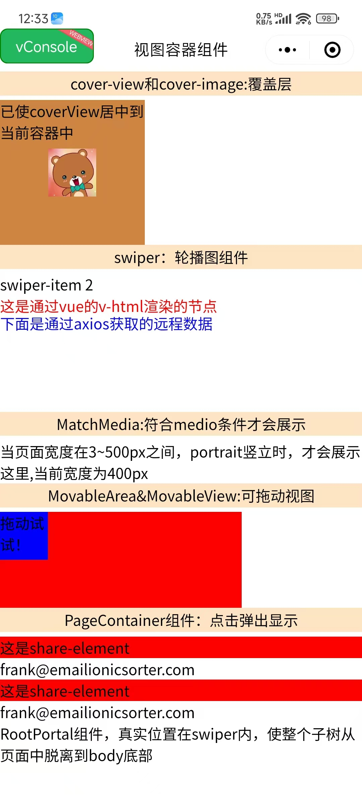

# 🧭 Taro 视图容器组件完全指南

> 全面掌握 Taro 框架提供的视图容器组件，从基础的 View 组件到高级的 PageContainer，让你的应用界面更加丰富和专业。

::: tip 📚 本章内容
详细介绍 Taro 视图容器组件的使用方法，包括组件属性、事件处理和最佳实践。
:::

## 🎯 视图容器组件概览

### 📊 组件分类

| 分类 | 组件 | 功能 | 使用场景 |
|------|------|------|----------|
| **覆盖层** | CoverView, CoverImage | 原生组件覆盖层 | 📱 视频、地图上的 UI |
| **滚动容器** | ScrollView | 可滚动区域 | 📜 长列表、内容滚动 |
| **轮播容器** | Swiper, SwiperItem | 轮播图组件 | 🖼️ 图片轮播、内容切换 |
| **移动容器** | MovableArea, MovableView | 可拖拽视图 | 👆 拖拽交互、位置调整 |
| **弹窗容器** | PageContainer | 页面容器 | 🔲 弹窗、半屏页面 |
| **基础容器** | View | 基础视图容器 | 📦 布局、内容包装 |

## 📱 覆盖层组件

### 🎯 CoverView 组件

**覆盖在原生组件之上的文本视图**，可覆盖的原生组件包括 map、video、canvas、camera、live-player、live-pusher。

| 属性 | 类型 | 说明 | 默认值 |
|------|------|------|--------|
| **scrollTop** | Number | 设置顶部滚动偏移量 | 0 |
| **scrollLeft** | Number | 设置左侧滚动偏移量 | 0 |
| **scrollY** | Boolean | 允许纵向滚动 | false |
| **scrollX** | Boolean | 允许横向滚动 | false |
| **scrollWithAnimation** | Boolean | 滚动时使用动画过渡 | false |
| **scrollAnimationDuration** | Number | 滚动动画时长 | 400 |

#### 📱 事件回调

| 事件 | 说明 | 回调参数 |
|------|------|----------|
| **@scroll** | 滚动时触发 | 滚动位置信息 |
| **@scrolltoupper** | 滚动到顶部时触发 | - |
| **@scrolltolower** | 滚动到底部时触发 | - |

### 🖼️ CoverImage 组件

**覆盖在原生组件之上的图片视图**，可覆盖的原生组件同 CoverView，支持嵌套在 CoverView 里。

| 属性 | 类型 | 说明 | 默认值 |
|------|------|------|--------|
| **src** | String | 图片资源地址 | - |
| **fixedTop** | String | 固定在顶部的距离 | - |
| **fixedLeft** | String | 固定在左侧的距离 | - |
| **fixedRight** | String | 固定在右侧的距离 | - |
| **fixedBottom** | String | 固定在底部的距离 | - |

::: warning ⚠️ 使用限制
- 只支持嵌套 CoverView、CoverImage
- 可在 CoverView 中使用 Button 组件
- 不支持 CSS 动画
- 事件模型与普通组件一致
:::

## 🔄 轮播组件

### 🎠 Swiper 组件

**滑块视图容器**，其中只可放置 SwiperItem 组件，否则会导致未定义的行为。

| 属性 | 类型 | 说明 | 默认值 |
|------|------|------|--------|
| **autoplay** | Boolean | 是否自动切换 | false |
| **interval** | Number | 自动切换时间间隔 | 5000 |
| **duration** | Number | 滑动动画时长 | 500 |
| **circular** | Boolean | 是否采用衔接滑动 | false |
| **vertical** | Boolean | 滑动方向是否为纵向 | false |
| **indicatorDots** | Boolean | 是否显示面板指示点 | false |
| **indicatorColor** | String | 指示点颜色 | rgba(0,0,0,.3) |
| **indicatorActiveColor** | String | 当前选中指示点颜色 | #000000 |
| **adjustHeight** | String | 自动调整高度 | none |

#### 🎯 adjustHeight 选项

| 值 | 说明 | 效果 |
|-----|------|------|
| **none** | 不调整 | 固定高度 |
| **first** | 以第一个 item 高度 | 动态调整 |
| **current** | 以当前 item 高度 | 实时调整 |
| **highest** | 以最高 item 高度 | 最大高度 |

#### 📱 事件回调

| 事件 | 说明 | 回调参数 |
|------|------|----------|
| **@change** | 当前 item 改变时触发 | current, source |
| **@transition** | 切换动画结束时触发 | - |
| **@animationfinish** | 动画结束时触发 | - |

### 🎯 SwiperItem 组件

**轮播子项组件**，仅可放置在 Swiper 组件中，宽高自动设置为 100%。

::: tip 💡 使用提示
- 宽高自动设置为 100%
- 只能作为 Swiper 的直接子组件
- 支持任意内容嵌套
:::

## 👆 可移动组件

### 🎯 MovableArea 组件

**MovableView 的可移动区域**，必须设置 width 和 height 属性，不设置默认为 10px。

| 属性 | 类型 | 说明 | 默认值 |
|------|------|------|--------|
| **scaleArea** | Boolean | 当里面的 MovableView 设置为支持双指缩放时，设置此值可将缩放手势生效区域修改为整个 MovableArea | false |

### 🎯 MovableView 组件

**可移动的视图容器**，在页面中可以拖拽滑动。MovableView 必须在 MovableArea 组件中，并且必须是直接子节点。

| 属性 | 类型 | 说明 | 默认值 |
|------|------|------|--------|
| **direction** | String | 移动方向 | none |
| **inertia** | Boolean | 是否带有惯性 | false |
| **outOfBounds** | Boolean | 超过可移动区域后是否还可以移动 | false |
| **x** | Number | 定义 x 轴方向的偏移 | - |
| **y** | Number | 定义 y 轴方向的偏移 | - |
| **damping** | Number | 阻尼系数 | 20 |
| **friction** | Number | 摩擦系数 | 2 |
| **disabled** | Boolean | 是否禁用 | false |
| **scale** | Boolean | 是否支持双指缩放 | false |
| **scaleMin** | Number | 定义缩放倍数最小值 | 0.5 |
| **scaleMax** | Number | 定义缩放倍数最大值 | 10 |
| **scaleValue** | Number | 定义缩放倍数 | 1 |
| **animation** | Boolean | 是否使用动画 | true |

#### 🎯 direction 选项

| 值 | 说明 | 移动方向 |
|-----|------|----------|
| **all** | 任意方向 | ↗️ 水平+垂直 |
| **vertical** | 垂直方向 | ↕️ 仅垂直 |
| **horizontal** | 水平方向 | ↔️ 仅水平 |
| **none** | 不可移动 | 🚫 禁止移动 |

#### 📱 事件回调

| 事件 | 说明 | 回调参数 |
|------|------|----------|
| **@change** | 拖动过程中触发 | x, y, source |
| **@scale** | 缩放过程中触发 | x, y, scale |

## 🔲 页面容器组件

### 🎯 PageContainer 组件

**页面容器组件**，效果类似于 popup 弹出层，页面内存在该容器时，当用户进行返回操作，关闭该容器不关闭页面。

| 属性 | 类型 | 说明 | 默认值 |
|------|------|------|--------|
| **show** | Boolean | 是否显示容器组件 | false |
| **duration** | Number | 动画时长 | 300 |
| **zIndex** | Number | z-index 层级 | 100 |
| **overlay** | Boolean | 是否显示遮罩层 | true |
| **position** | String | 弹出位置 | bottom |
| **round** | Boolean | 是否显示圆角 | false |
| **closeOnSlideDown** | Boolean | 是否在下滑时关闭 | false |
| **overlayStyle** | String | 自定义遮罩层样式 | - |
| **customStyle** | String | 自定义弹出层样式 | - |

#### 🎯 position 选项

| 值 | 说明 | 弹出位置 |
|-----|------|----------|
| **top** | 顶部弹出 | ⬆️ 从上方滑入 |
| **bottom** | 底部弹出 | ⬇️ 从下方滑入 |
| **right** | 右侧弹出 | ➡️ 从右侧滑入 |
| **left** | 左侧弹出 | ⬅️ 从左侧滑入 |
| **center** | 中心弹出 | 🎯 居中显示 |

#### 📱 事件回调

| 事件 | 说明 | 回调参数 |
|------|------|----------|
| **@beforeenter** | 进入前触发 | - |
| **@enter** | 进入中触发 | - |
| **@afterenter** | 进入后触发 | - |
| **@beforeleave** | 离开前触发 | - |
| **@leave** | 离开中触发 | - |
| **@afterleave** | 离开后触发 | - |
| **@clickoverlay** | 点击遮罩层时触发 | - |

## 🔧 其他容器组件

### 📦 CustomWrapper 组件

**自定义组件包裹器**，当数据更新层级较深时，可用此组件将需要更新的区域包裹起来，这样更新层级将大大减少。

::: tip 💡 性能优化
使用 CustomWrapper 可以有效减少数据更新时的渲染层级，提升页面性能。
:::

### 📱 MatchMedia 组件

**Media Query 匹配检测节点**，可以指定一组 media query 规则，满足时，这个节点才会被展示。

| 属性 | 类型 | 说明 | 默认值 |
|------|------|------|--------|
| **minWidth** | Number | 页面最小宽度 | - |
| **maxWidth** | Number | 页面最大宽度 | - |
| **width** | Number | 页面宽度 | - |
| **minHeight** | Number | 页面最小高度 | - |
| **maxHeight** | Number | 页面最大高度 | - |
| **height** | Number | 页面高度 | - |
| **orientation** | String | 屏幕方向 | - |

#### 🎯 orientation 选项

| 值 | 说明 | 屏幕方向 |
|-----|------|----------|
| **portrait** | 竖屏 | 📱 纵向显示 |
| **landscape** | 横屏 | 📱 横向显示 |

### 🔌 其他组件

| 组件 | 功能 | 使用场景 |
|------|------|----------|
| **RootPortal** | 子树脱离页面 | 🔝 弹窗、固定定位 |
| **NativeSlot** | 原生组件插槽 | 🔌 原生组件扩展 |
| **Slot** | 插槽组件 | 🎯 组件内容分发 |
| **View** | 基础视图容器 | 📦 基础布局 |

## 💻 完整使用示例

```vue
<template>
  <view class="viewContainer">
    
    <!-- 覆盖层组件示例 -->
    <view class="title">cover-view和cover-image:覆盖层</view>
    <cover-view
      :scrollY="true"
      :scrollWithAnimation="true"
      :scrollAnimationDuration="3000"
      @tap="play"
    >
      <cover-image
        fixedTop="0"
        fixedLeft="20"
        src="@/assets/img/1.jpg"
        @tap="onImageTap" 
      />
    </cover-view>
    
    <!-- 轮播图组件示例 -->
    <view class="title">swiper：轮播图组件</view>
    <swiper
      :autoplay="true"
      :interval="3000"
      indicator-color="red"
      indicatorActiveColor="blue"
      adjustHeight="highest"
      vertical
      circular
      indicatorDots
      @tap="handleTap"
    >
      <swiper-item>
        <view>下面是RootPortal组件:穿越到root底部</view>
        <root-portal :enable="true">
          RootPortal组件，真实位置在swiper内，使整个子树从页面中脱离到body底部
        </root-portal>
      </swiper-item>
      <swiper-item>
        <view v-html="html"></view>
        <view class="text" v-for="item in list.value" :key="item.bar">
          <text>通过axios获取的远程数据:星级：{{ item.bar }}星</text>
        </view>
      </swiper-item>
    </swiper>
    
    <!-- 媒体查询组件示例 -->
    <match-media
      orientation="portrait"
      style="width: 400px"
      min-width="3"
      max-width="500"
    >
      MatchMedia:符合media条件才会展示.当页面宽度在3~500px之间，portrait竖立时，才会展示这里,当前宽度为400px
    </match-media>
    
    <!-- 可移动视图组件示例 -->
    <view class="title">MovableArea&MovableView:可拖动视图</view>
    <movable-area
      :scale-area="true"
      style="height: 200rpx; width: 500rpx; background: red"
    >
      <movable-view
        direction="all"
        :scale="true"
        :animation="true"
        :inertia="true"
        :out-of-bounds="true"
        style="height: 100rpx; width: 100rpx; background: blue"
        @change="moveViewChange"
      >
        拖动试试！
      </movable-view>
    </movable-area>
    
    <!-- 页面容器组件示例 -->
    <view class="item">
      <view class="title" @tap="pageShowToggle">
        PageContainer组件：点击弹出显示
      </view>
      <view
        class="share"
        v-for="(item, index) in contacts"
        :key="item.id"
        @tap="e => tabShare(e, index)"
      >
        <share-element
          :duration="3000"
          :transform="currentIndex === index"
          mapkey="transform"
          style="background-color: red"
        >
          这是share-element
        </share-element>
        <view>{{ item.email }}</view>
      </view>
      
      <page-container
        :show="pageShow"
        :duration="3000"
        :z-index="10"
        :overlay="true"
        position="center"
        :round="true"
        :closeOnSlideDown="false"
        @clickOverlay="clickOverlay"
      >
        <share-element
          :duration="3000"
          transform
          mapkey="transform"
          style="background-color: red"
        >
          这是share-element
        </share-element>
        <view class="popup-content">
          <text>小程序如果在页面内进行复杂的界面设计（如在页面内弹出半屏的弹窗、在页面内加载一个全屏的子页面等），用户进行返回操作会直接离开当前页面，不符合用户预期，预期应为关闭当前弹出的组件。</text>
          <text>为此提供"假页"容器组件，效果类似于popup弹出层，页面内存在该容器时，当用户进行返回操作，关闭该容器不关闭页面。</text>
          <text>返回操作包括三种情形，右滑手势、安卓物理返回键和调用navigateBack 接口。</text>
        </view>
      </page-container>
    </view>
    
  </view>
</template>

<script>
import { ref, reactive } from "vue"
import "./index.scss"
import { getName } from "@/api/api"
import Taro, { useReady } from "@tarojs/taro"

export default {
  setup() {
    // 🎯 响应式数据
    const contacts = [
      {
        id: 1,
        name: "Frank",
        img: "frank.png",
        phone: "0101 123456",
        mobile: "0770 123456",
        email: "frank@emailionicsorter.com",
      },
      {
        id: 2,
        name: "Susan",
        img: "susan.png",
        phone: "0101 123456",
        mobile: "0770 123456",
        email: "susan@emailionicsorter.com",
      },
    ]
    
    const html = ref(`<h3 id="htmlId" style="color: red">这是通过vue的v-html渲染的节点</h3>`)
    const list = reactive({})
    const pageShow = ref(false)
    const currentIndex = ref(0)

    // 🔄 事件处理函数
    const play = function (e) {
      console.log("cover-view play", e)
      Taro.showToast({
        title: '点击了覆盖层',
        icon: 'success'
      })
    }
    
    const onImageTap = function (e) {
      console.log("cover-image tap", e)
      Taro.showToast({
        title: '点击了覆盖图片',
        icon: 'success'
      })
    }
    
    const moveViewChange = function (e) {
      console.log("movable-view change", e)
      const { x, y, source } = e.detail
      console.log(`移动到位置: x=${x}, y=${y}, 触发源: ${source}`)
    }
    
    const clickOverlay = function (e) {
      console.log("点击了遮罩层", e)
      pageShow.value = false
    }
    
    const handleTap = function (e) {
      console.log("swiper tap", e)
    }
    
    const pageShowToggle = function (e) {
      console.log("切换页面容器显示状态")
      pageShow.value = !pageShow.value
    }
    
    const tabShare = (e, index) => {
      console.log("点击分享项", index)
      currentIndex.value = index
      pageShow.value = true
    }

    // 🔄 生命周期
    useReady(() => {
      Taro.nextTick(() => {
        getName().then(value => {
          list.value = value.array
          console.log("获取远程数据成功", list.value)
        }).catch(error => {
          console.error("获取远程数据失败", error)
        })
      })
    })

    return {
      // 数据
      html,
      pageShow,
      list,
      currentIndex,
      contacts,
      
      // 方法
      play,
      onImageTap,
      moveViewChange,
      pageShowToggle,
      clickOverlay,
      tabShare,
      handleTap,
    }
  },
}
</script>

<style scoped>
.viewContainer {
  padding: 32px;
}

.title {
  font-size: 32px;
  font-weight: bold;
  margin: 32px 0 16px 0;
  color: #333;
}

.item {
  margin: 32px 0;
}

.share {
  padding: 24px;
  border: 2px solid #e0e0e0;
  border-radius: 8px;
  margin: 16px 0;
  background-color: #f9f9f9;
}

.text {
  padding: 16px;
  background-color: #f0f0f0;
  margin: 8px 0;
  border-radius: 4px;
}

.popup-content {
  padding: 48px 32px;
  background-color: white;
  border-radius: 16px;
  margin: 32px;
}

.popup-content text {
  display: block;
  margin-bottom: 24px;
  line-height: 1.6;
  color: #333;
}
</style>
```

## 🛠️ 最佳实践

### 📋 组件使用建议

::: tip ✅ 推荐做法
- 合理使用覆盖层组件，避免层级过深
- 轮播图组件设置合适的自动播放间隔
- 可移动组件设置边界限制，提升用户体验
- 页面容器组件合理设置动画时长
- 使用 MatchMedia 实现响应式布局
:::

::: warning ⚠️ 注意事项
- 覆盖层组件不支持 CSS 动画
- MovableView 必须在 MovableArea 中使用
- PageContainer 会影响页面返回行为
- 注意组件的嵌套层级和性能影响
:::

### 🚀 性能优化

| 优化项 | 说明 | 实现方式 |
|--------|------|----------|
| **减少嵌套** | 避免过深的组件嵌套 | 🏗️ 合理的组件结构 |
| **按需渲染** | 使用条件渲染 | 🔄 v-if 控制显示 |
| **事件优化** | 合理处理事件监听 | 📱 防抖和节流 |
| **动画优化** | 使用硬件加速 | ⚡ CSS transform |

### 🔧 调试技巧

```javascript
// 组件调试工具
const debugComponent = (componentName, eventData) => {
  if (process.env.NODE_ENV === 'development') {
    console.group(`🔍 ${componentName} 调试信息`)
    console.log('事件数据:', eventData)
    console.log('时间戳:', new Date().toISOString())
    console.groupEnd()
  }
}

// 使用示例
const handleComponentEvent = (e) => {
  debugComponent('MovableView', e.detail)
  // 业务逻辑处理
}
```

## 📚 总结

通过本章学习，你已经掌握了 Taro 视图容器组件的完整使用方法。从基础的 View 组件到高级的 PageContainer，从覆盖层到可移动视图，这些组件为你的应用提供了丰富的界面交互能力。

记住使用视图容器组件的关键点：**合理选择组件类型**、**注意组件使用限制**、**优化性能表现**、**提升用户体验**。通过合理组合这些组件，你可以构建出功能强大、交互丰富的跨端应用。

