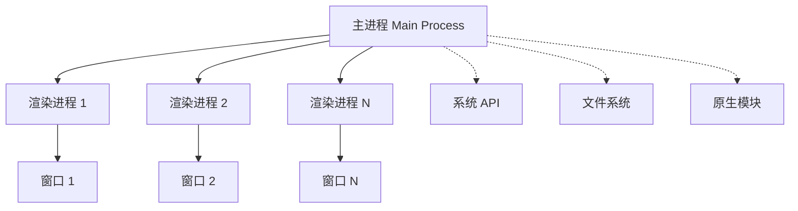

# 💻 Electron 桌面应用开发指南

Electron 是一个使用 JavaScript、HTML 和 CSS 构建桌面应用的强大框架。通过将 Chromium 和 Node.js 嵌入到应用中，Electron 让 Web 开发者能够创建跨平台的原生桌面应用。

::: tip 📚 本章内容
全面学习 Electron 应用架构、主进程管理、渲染进程通信和桌面应用开发最佳实践。
:::

## 1. Electron 架构概览

### 1.1 核心特性

| 特性 | 说明 | 优势 |
|------|------|------|
| **跨平台** | Windows、macOS、Linux | 一套代码多平台运行 |
| **Web 技术** | HTML、CSS、JavaScript | 降低学习成本 |
| **原生集成** | 系统 API 访问 | 完整的桌面应用体验 |
| **丰富生态** | npm 生态系统 | 海量第三方库支持 |

### 1.2 进程架构

Electron 应用采用多进程架构，分为主进程和渲染进程：



#### 1.2.1 主进程（Main Process）

**主进程**是 Electron 应用的入口点和控制中心：

- 🚀 **应用生命周期管理** - 控制应用启动、退出
- 🪟 **窗口管理** - 创建和管理 BrowserWindow 实例
- 🔐 **系统权限** - 访问 Node.js API 和系统资源
- 📡 **进程通信** - 与渲染进程进行 IPC 通信
- ⚙️ **原生功能** - 菜单、托盘、通知等原生特性

#### 1.2.2 渲染进程（Renderer Process）

**渲染进程**负责显示用户界面：

- 🌐 **Web 环境** - 运行在 Chromium 环境中
- 🎨 **UI 渲染** - 使用 HTML、CSS、JavaScript
- 🔒 **安全隔离** - 默认无法访问 Node.js API
- 📞 **通信机制** - 通过 IPC 与主进程通信

## 2. 主进程开发

主进程是 Electron 应用的核心，负责应用的整体控制和管理。

### 2.1 核心模块导入

```javascript
// 🔥 Electron 核心模块
import {
  app,                    // 应用程序控制
  BrowserWindow,          // 窗口管理
  ipcMain,                // 主进程 IPC 通信
  screen,                 // 屏幕信息
  dialog,                 // 系统对话框
  shell,                  // 系统 shell 操作
  nativeTheme,            // 系统主题
  session,                // 会话管理
  Menu,                   // 应用菜单
  Tray,                   // 系统托盘
  globalShortcut,         // 全局快捷键
  powerMonitor,           // 电源监控
  crashReporter,          // 崩溃报告
} from 'electron'

// 🟢 Node.js 模块（主进程可完整使用）
import path from 'node:path'
import fs from 'node:fs'
import os from 'node:os'
import { fileURLToPath } from 'node:url'

// 📁 获取当前文件目录
const __dirname = path.dirname(fileURLToPath(import.meta.url))
```

### 2.2 主进程 API 概览

| 模块 | 主要功能 | 常用方法 |
|------|----------|----------|
| **app** | 应用生命周期 | `whenReady()`, `quit()`, `focus()` |
| **BrowserWindow** | 窗口管理 | `new BrowserWindow()`, `loadURL()` |
| **ipcMain** | 进程通信 | `handle()`, `on()`, `once()` |
| **dialog** | 系统对话框 | `showMessageBox()`, `showOpenDialog()` |
| **shell** | 系统操作 | `openExternal()`, `showItemInFolder()` |
| **session** | 会话管理 | `defaultSession`, `loadExtension()` |

### 2.3 主进程核心功能实现

```javascript
function talkWithRender() {
  /** ipcMain用于和渲染进程进行通信
   * 监听渲染进程的talk事件，回调函数接受事件对象和传过来的数据
   * 通过on(eventName,callback)监听通过send派发的事件。同步事件
   * 通过handle(eventName,callback)监听通过invoke派发的事件，其
   * 返回值会发送给渲染进程。为异步事件
   */
  ipcMain.handle("talk", (event, value) => {
    event.sender.send("talk", "双向通信：通过sender拿到webContents,再次派发talk事件");
    return "渲染进程，你好";
  });
  ipcMain.handleOnce("onceEvent", (event, value) => {
    console.log("只会异步通信一次");
  });
  ipcMain.on("test", (event, data) => {
    event.returnValue = "把数据同步发给渲染进程";
  });
}

// 封装创建新窗口的工厂函数
function createWindow() {
  /**
   * 使用BrowserWindow() 窗口构造器新建一个窗口
   *  getAllWindows()获取所有窗口对象
   *  formId(windowId) 返回windowId对应的窗口对象
   *  getFocusedWindow() 获取聚焦的窗口
   * 窗口配置对象：每个窗口都属于一个渲染进程，
   * setPosition(x,y) 设置窗口位置
   * getBounds()  获取窗口边界信息
   * setBounds({x,y,width,height})
   * webContents  获取窗口web内容对象
   * id 窗口唯一标识id
   * isMinimized() 是否最小状态
   * restore()  恢复窗口
   * focus()  使窗口聚焦
   * removeAllListeners() 取消订阅所有与该窗口相关的事件
   * setProgressBar(number) 设置托盘图表进度
   * isDestroyed() 是否已经被销毁
   * isFocused() 是否聚焦
   * loadURL(remoteURL) 加载远程url页面
   * loadFile('index.html') 加载本地页面
   * getSize()  获取窗口大小
   * @return 窗口对象
   */
  const mainWindow = new BrowserWindow({
    title: "窗口标题",
    icon: "/hello.svg", // 托盘图表
    width: 800, // 窗口宽度
    height: 600, // 窗口高度
    show: true, // 是否显示窗口
    // web偏好配置
    webPreferences: {
      offscreen: false, // 是否显示UI页面
      // 渲染进程执行前需要执行的脚本，其属于特殊的渲染进程
      preload: path.resolve("./preload/preload.js"),
      // 是否集成node，集成后可部分使用node功能
      nodeIntegration: true,
      // 是否上下文隔离，隔离后不能使用contextBridge通信，只能使用进程间通讯
      contextIsolation: false,
    },
  });

  mainWindow.loadURL("http://localhost:5173/");
  mainWindow.on("closed", () => {
    console.log("窗口已经关闭了");
    childWindow.removeAllListeners();
    childWindow = null;
  });
  /** 窗口里的内容对象
   * send('eventName',data) 同步触发eventName事件
   * openDevTools() 打开开发者工具
   * setWindowOpenHandler(callback(content)=>({action:'deny'}))
   */
  const webContents = mainWindow.webContents;
  webContents.openDevTools();
  webContents.on("did-finish-load", () => {
    console.log("页面资源加载完毕执行：", mainWindow.getTitle(), 3);
  });
}

/** app应用已经完成初始化工作，准备创建窗口
 * disableHardwareAcceleration() 禁用GPU加速
 * getName() 获取应用名称
 * setAppUserModelId()
 * requestSingleInstanceLock() 单例锁，保证只有一个app运行
 * quit() 停止运行，退出应用
 * setAsDefaultProtocolClient(protocl,path,args) 注册应用唤醒的协议
 * isPackaged 是否被打包过
 * @return 初始化完成后兑现的promise
 */
app.whenReady().then(() => {
  createWindow(); // 初始化之后，开始创建窗口
  app.on("activate", function () {
    /**
     * 相比之下，macOS 应用通常即使没有打开任何窗口也会继续运行。
     * 在没有可用窗口时激活应用应该会打开一个新窗口。
     */
    if (BrowserWindow.getAllWindows().length === 0) createWindow();
  });
});

// 所有窗口关闭后退出应用（Windows 和 Linux）
app.on("window-all-closed", function () {
  if (process.platform !== "darwin") app.quit();
});
app.on("browser-window-created", function (v) {
  talkWithRender();
});
// 第二个实例唤醒
app.on("second-instance", function (event, args, workingDirectory) {
  talkWithRender();
});
```

## 3. 预加载脚本（Preload）

预加载脚本在渲染进程的网页加载之前运行，可以访问 DOM API 和部分 Node.js API，是主进程和渲染进程之间的桥梁。

```javascript
/**
 * preload脚本会在index.html加载前执行。有权限访问web API，可以访问electron的ipcRenderer模块，和部分node功能。
 */
const { contextBridge, ipcRenderer } = require("electron");

let talkWithMain = async value => {
  /**
   * 拿到渲染进程传来的value，通过ipcRenderer.invoke(eventName,value)
   * 派发主进程的handle(eventName,callback(event,value)=>{})事件监听器
   * @return 主进程handle的回调函数返回的数据
   */
  let result = await ipcRenderer.invoke("talk", value); // send invoke
  console.log("主进程返回的数据", result);
};

/** contextBridge为主进程和渲染进程的桥梁：向渲染进程暴露属性和方法
 * 当前窗口没有配置contextIsolation:true的话，可以使用
 * contextBridge.exposeInMainWorld(key,value)，向渲染进程暴露数据
 * 渲染进程可通过window.electronAPI拿到此数据
 */
contextBridge.exposeInMainWorld("electronAPI", {
  talkWithMain,
});

// preload可以使用web API，可以使用部分node功能process
window.addEventListener("DOMContentLoaded", () => {
  const replaceText = (selector, text) => {
    const element = document.getElementById(selector);
    if (element) element.innerText = text;
  };

  for (const type of ["chrome", "node", "electron"]) {
    replaceText(`${type}-version`, process.versions[type]);
  }
});
```

## 4. 渲染进程开发

渲染进程负责用户界面的显示和交互，通过 IPC 与主进程通信。

```javascript
// 通过contextBridge暴露的数据 和主进程通信
const talkHandler = () => {
  window.electronAPI.talkWithMain("主进程，你好啊");
};

// 直接使用进程间通信
import { ipcRenderer } from "electron";

// 监听主进程的send('langChange',value) 事件
ipcRenderer.on("langChange", (event, data) => {
  console.log("同步监听langChange事件");
});
// 派发主进程通过handle注册的talk事件
let result = await ipcRenderer.invoke("talk", value);
console.log("主进程返回的数据", result);
```

## 5. 进程间通信（IPC）

### 5.1 通信模式

| 通信方向 | 同步方式 | 异步方式 |
|---------|---------|---------|
| 渲染进程 → 主进程 | `ipcRenderer.sendSync()` | `ipcRenderer.send()`, `ipcRenderer.invoke()` |
| 主进程 → 渲染进程 | - | `webContents.send()` |

### 5.2 通信最佳实践

- 使用 `contextBridge` 安全地暴露 API
- 优先使用异步通信（`invoke/handle`）
- 避免频繁的 IPC 通信，减少性能开销
- 使用 `ipcRenderer.once()` 和 `ipcMain.handleOnce()` 处理一次性事件

## 6. 应用打包与分发

### 6.1 常用打包工具

- **electron-builder** - 功能全面的打包工具
- **electron-forge** - 集成了构建、打包、发布功能
- **electron-packager** - 简单的打包工具

### 6.2 打包配置示例

```javascript
// package.json
{
  "build": {
    "appId": "com.example.app",
    "productName": "My Electron App",
    "directories": {
      "output": "dist"
    },
    "mac": {
      "category": "public.app-category.developer-tools"
    },
    "win": {
      "target": ["nsis", "portable"]
    },
    "linux": {
      "target": ["AppImage", "deb"]
    }
  }
}
```

## 7. 安全最佳实践

- 始终启用上下文隔离（`contextIsolation: true`）
- 禁用 Node.js 集成（`nodeIntegration: false`）
- 使用内容安全策略（CSP）
- 验证所有来自渲染进程的输入
- 定期更新 Electron 版本以获取安全补丁

## 8. 参考资源

- [Electron 官方文档](https://www.electronjs.org/docs)
- [Electron Forge](https://www.electronforge.io/)
- [Electron Builder](https://www.electron.build/)
- [Electron 安全指南](https://www.electronjs.org/docs/tutorial/security)