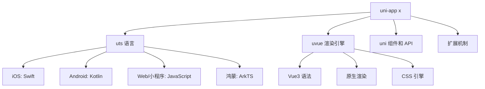

# 🦄 uni-app 跨平台开发框架完全指南

> uni-app 是一个使用 Vue.js 开发所有前端应用的框架，开发者编写一套代码，可发布到 iOS、Android、Web（响应式）、以及各种小程序（微信/支付宝/百度/头条/飞书/QQ/快手/钉钉/淘宝）、快应用等多个平台。

::: tip 📚 本章内容
全面学习 uni-app 跨平台开发，掌握 uni-app x、uts 语言、uvue 渲染引擎等下一代技术。
:::

## 🎯 uni-app 概述

### ✨ 核心特性

| 特性 | 描述 | 优势 |
|------|------|------|
| **一套代码多端运行** | Vue.js 语法开发 | 🚀 极大提升开发效率 |
| **丰富的平台支持** | 10+ 个平台发布 | 🌐 覆盖主流应用生态 |
| **原生性能** | 接近原生应用性能 | ⚡ 流畅的用户体验 |
| **完整生态** | 插件市场、UI 库 | 🛠️ 丰富的开发资源 |

### 🌍 支持平台

| 平台类型 | 支持平台 | 特点 |
|----------|----------|------|
| **移动端** | iOS、Android | 📱 原生应用性能 |
| **Web 端** | H5 响应式 | 🌐 跨浏览器兼容 |
| **小程序** | 微信、支付宝、百度、头条、飞书、QQ、快手、钉钉、淘宝 | 🎯 全平台小程序覆盖 |
| **快应用** | 华为、小米、OPPO、VIVO 等 | 🔥 免安装应用 |

## 🚀 uni-app x 简介

### 📊 技术架构

uni-app x 是下一代 uni-app，是一个跨平台应用开发引擎，包含以下核心技术：



### 🎯 技术特点

| 组件 | 功能 | 编译目标 | 性能 |
|------|------|----------|------|
| **uts 语言** | 类 TypeScript 语法 | 各平台原生语言 | 🚀 原生性能 |
| **uvue 渲染** | Vue3 兼容语法 | 原生 UI 组件 | ⚡ 接近原生 |
| **跨平台编译** | 一套代码 | 多平台原生应用 | 🎯 高效开发 |

::: info 💡 性能优势
在 Android 平台，uni-app x 的工程被整体编译为 kotlin 代码，本质上是换了 vue 写法的原生 kotlin 应用，在性能上与原生 kotlin 一致。
:::

## 🔧 uts 语言详解

### 📋 语言特性

**uts（uni type script）** 是一门跨平台的、高性能的、强类型的现代编程语言。

#### 🎯 编译目标

| 平台 | 编译语言 | 特点 |
|------|----------|------|
| **Web/小程序** | JavaScript | 🌐 兼容现有生态 |
| **Android** | Kotlin | 🤖 原生性能 |
| **iOS** | Swift | 🍎 原生体验 |
| **鸿蒙 next** | ArkTS | 🔥 新兴平台支持 |

#### ✅ 支持的特性

```typescript
// ✅ 基本数据类型
let isActive: boolean = true
let count: number = 42
let message: string = "Hello uni-app x"
let data: any = { id: 1, name: "test" }

// ✅ 对象和数组
let user: UTSJSONObject = { name: "张三", age: 25 }
let numbers: Array<number> = [1, 2, 3, 4, 5]
let users: Array<UTSJSONObject> = [
  { name: "张三", age: 25 },
  { name: "李四", age: 30 }
]

// ✅ 函数定义
function greet(name: string): string {
  return `Hello, ${name}!`
}

// ✅ 箭头函数
const add = (a: number, b: number): number => {
  return a + b
}

// ✅ 类型定义
type User = {
  name: string
  age: number
  email?: string
}

// ✅ 条件编译
// #ifdef APP-ANDROID
import Build from 'android.os.Build'
console.log(Build.MODEL)
// #endif

// #ifdef APP-IOS
// iOS 特有代码
// #endif
```

#### ❌ 不支持的特性

::: warning ⚠️ uts 限制
- ❌ 不支持 `undefined`，任何变量被定义后都需要赋值
- ❌ 函数声明方式不支持作为值传递
- ❌ 函数表达式方式不支持默认参数
- ❌ 不存在声明提升，需要先声明后使用
- ❌ 不能访问未声明的变量或函数
:::

### 📊 uts 类型系统

#### 🔢 基础类型

| 类型 | 描述 | typeof 返回 | 示例 |
|------|------|-------------|------|
| **boolean** | 布尔值 | "boolean" | `true`, `false` |
| **number** | 数字 | "number" | `42`, `3.14` |
| **string** | 字符串 | "string" | `"hello"`, \`template\` |
| **any** | 任意类型 | 运行时值类型 | 动态类型 |
| **null** | 空值 | "object" | `null` |

#### 🏗️ 对象类型

| 类型 | 描述 | typeof 返回 | 判断方式 |
|------|------|-------------|----------|
| **Date** | 日期对象 | "object" | `instanceof Date` |
| **Array** | 数组 | "object" | `instanceof Array` |
| **Map** | 映射 | "object" | `instanceof Map` |
| **Set** | 集合 | "object" | `instanceof Set` |
| **UTSJSONObject** | JSON 对象 | "object" | uts 特有类型 |

#### 🎯 特殊类型

```typescript
// 🔧 自定义类型
type UserInfo = {
  id: number
  name: string
  avatar?: string
}

// 🎭 函数类型
type EventHandler = (event: any) => void

// 🏗️ 类定义
class UserService {
  private users: Array<UserInfo> = []
  
  addUser(user: UserInfo): void {
    this.users.push(user)
  }
  
  getUserById(id: number): UserInfo | null {
    return this.users.find(user => user.id === id) || null
  }
}

// 🌐 平台专有类型
// #ifdef APP-ANDROID
let deviceModel: kotlin.String = Build.MODEL
// #endif

// #ifdef APP-IOS
let deviceName: NSString = UIDevice.current.name
// #endif
```

## 🎨 uvue 渲染引擎

### 🏗️ 架构概述

uvue 是一套基于 uts 的、兼容 Vue 语法的、跨平台的、原生渲染引擎。

#### ✨ 核心特性

| 特性 | 描述 | 优势 |
|------|------|------|
| **Vue3 语法** | 支持组合式 API 和选项式 API | 🎯 无缝迁移 |
| **原生渲染** | 编译为平台原生 UI | ⚡ 原生性能 |
| **CSS 引擎** | 完整的 CSS 支持 | 🎨 丰富样式 |
| **组件化** | Vue 单文件组件规范 | 🧩 模块化开发 |

#### 📋 版本支持

| 平台 | 版本 | 状态 |
|------|------|------|
| **Android** | 3.99+ | ✅ 已发布 |
| **Web** | 4.0+ | ✅ 已发布 |
| **iOS** | 4.11+ | ✅ 已发布 |

### 🎯 uvue 组件示例

#### 📱 基础页面组件

```vue
<template>
  <view class="container">
    <!-- 🎨 UI 组件 -->
    <view class="header">
      <text class="title">{{ pageTitle }}</text>
      <button class="refresh-btn" @click="refreshData">
        🔄 刷新
      </button>
    </view>
    
    <!-- 📊 数据展示 -->
    <scroll-view class="content" scroll-y="true">
      <view class="user-card" v-for="user in userList" :key="user.id">
        <image class="avatar" :src="user.avatar" mode="aspectFill" />
        <view class="user-info">
          <text class="name">{{ user.name }}</text>
          <text class="age">年龄: {{ user.age }}</text>
        </view>
        <button class="action-btn" @click="viewUserDetail(user.id)">
          查看详情
        </button>
      </view>
    </scroll-view>
    
    <!-- 🔄 加载状态 -->
    <view v-if="loading" class="loading">
      <text>加载中...</text>
    </view>
  </view>
</template>

<script setup>
// 🎯 组合式 API 写法
import { ref, onMounted, getCurrentPages, getApp } from 'vue'

// 📊 响应式数据
const pageTitle = ref("用户列表")
const loading = ref(false)
const userList = ref<Array<UserInfo>>([])

// 🎯 类型定义
type UserInfo = {
  id: number
  name: string
  age: number
  avatar: string
}

// 🔧 方法定义
const refreshData = async (): void => {
  loading.value = true
  try {
    // 模拟 API 调用
    const response = await uni.request({
      url: 'https://api.example.com/users',
      method: 'GET'
    })
    userList.value = response.data as Array<UserInfo>
  } catch (error) {
    console.error('获取用户数据失败:', error)
    uni.showToast({
      title: '加载失败',
      icon: 'error'
    })
  } finally {
    loading.value = false
  }
}

const viewUserDetail = (userId: number): void => {
  uni.navigateTo({
    url: `/pages/user/detail?id=${userId}`
  })
}

// 📱 获取页面实例
const currentPages = getCurrentPages()
const appInstance = getApp()

// 🎪 生命周期
onMounted(() => {
  console.log('页面组件挂载完成')
  refreshData()
})

onReady(() => {
  console.log('页面初次渲染完成')
})
</script>

<script>
// 🤖 平台特有代码
// #ifdef APP-ANDROID
import Build from 'android.os.Build'
// #endif

// 📊 选项式 API 写法（可与组合式 API 混用）
export default {
  data() {
    return {
      deviceInfo: '' as string,
      systemInfo: null as any
    }
  },
  
  methods: {
    // 📱 获取设备信息
    getDeviceInfo(): void {
      // #ifdef APP-ANDROID
      this.deviceInfo = Build.MODEL
      console.log('Android 设备型号:', Build.MODEL)
      // #endif
      
      // 🌐 跨平台 API
      this.systemInfo = uni.getSystemInfoSync()
      console.log('系统信息:', this.systemInfo.deviceModel)
    },
    
    // 🔔 显示通知
    showNotification(message: string): void {
      uni.showModal({
        showCancel: false,
        content: message
      })
    }
  },
  
  // 🎪 页面生命周期
  onLoad(options: OnLoadOptions) {
    const userId = options["user_id"] ?? ""
    console.log('页面加载，用户ID:', userId)
    this.getDeviceInfo()
  },
  
  onShow() {
    console.log('页面显示')
  },
  
  onHide() {
    console.log('页面隐藏')
  },
  
  onReachBottom() {
    console.log('页面触底，可加载更多数据')
  },
  
  onPageScroll(event: { scrollTop: number }) {
    console.log('页面滚动距离:', event.scrollTop)
  }
}
</script>

<style scoped>
.container {
  display: flex;
  flex-direction: column;
  height: 100vh;
  background-color: #f5f5f5;
}

.header {
  display: flex;
  justify-content: space-between;
  align-items: center;
  padding: 20rpx;
  background-color: #ffffff;
  border-bottom: 1px solid #e0e0e0;
}

.title {
  font-size: 36rpx;
  font-weight: bold;
  color: #333333;
}

.refresh-btn {
  padding: 10rpx 20rpx;
  background-color: #007aff;
  color: white;
  border-radius: 8rpx;
  font-size: 28rpx;
}

.content {
  flex: 1;
  padding: 20rpx;
}

.user-card {
  display: flex;
  align-items: center;
  padding: 20rpx;
  margin-bottom: 20rpx;
  background-color: #ffffff;
  border-radius: 12rpx;
  box-shadow: 0 2rpx 8rpx rgba(0, 0, 0, 0.1);
}

.avatar {
  width: 80rpx;
  height: 80rpx;
  border-radius: 40rpx;
  margin-right: 20rpx;
}

.user-info {
  flex: 1;
  display: flex;
  flex-direction: column;
}

.name {
  font-size: 32rpx;
  font-weight: bold;
  color: #333333;
  margin-bottom: 8rpx;
}

.age {
  font-size: 28rpx;
  color: #666666;
}

.action-btn {
  padding: 12rpx 24rpx;
  background-color: #28a745;
  color: white;
  border-radius: 6rpx;
  font-size: 26rpx;
}

.loading {
  position: absolute;
  top: 50%;
  left: 50%;
  transform: translate(-50%, -50%);
  padding: 40rpx;
  background-color: rgba(0, 0, 0, 0.7);
  color: white;
  border-radius: 12rpx;
  text-align: center;
}
</style>
```

### 🎯 数据类型推导

uvue 支持智能的类型推导，提升开发体验：

```typescript
export default {
  data() {
    return {
      // ✅ 自动推导类型
      isLoading: false,           // boolean
      userCount: 0,              // number  
      userName: "张三",           // string
      currentDate: new Date(),    // Date
      
      // 🎯 显式类型声明
      userId: 0 as number,
      score: null as number | null,
      
      // 📊 对象和数组
      userInfo: { id: 1, name: "用户" },           // UTSJSONObject
      numberList: [1, 2, 3],                      // Array<number>
      stringList: ['a', 'b', 'c'],               // Array<string>
      mixedList: [1, '2'],                        // Array<any|null>
      
      // 🎯 类型断言
      profile: { name: 'DCloud' } as UserProfile,
      users: [{ name: 'Test' }] as UserProfile[]
    }
  }
}
```

## 📱 应用生命周期

### 🎪 应用级生命周期

```typescript
export default {
  // 🚀 应用启动
  onLaunch() {
    console.log('App Launch')
    
    // 📊 性能监控
    const performance = uni.getPerformance()
    const observer: PerformanceObserver = performance.createObserver(
      (entryList: PerformanceObserverEntryList) => {
        console.log('性能数据:', JSON.stringify(entryList.getEntries()))
      }
    )
    observer.observe({
      entryTypes: ['render', 'navigation']
    } as PerformanceObserverOptions)
  },
  
  // 👁️ 应用显示
  onShow() {
    console.log('App Show')
  },
  
  // 👁️‍🗨️ 应用隐藏
  onHide() {
    console.log('App Hide')
  },
  
  // 🔙 最后一页返回
  onLastPageBackPress() {
    console.log('App LastPageBackPress')
    
    // 🎯 双击退出逻辑
    const now = Date.now()
    if (this.firstBackTime === 0) {
      uni.showToast({
        title: '再按一次退出应用',
        position: 'bottom'
      })
      this.firstBackTime = now
      setTimeout(() => {
        this.firstBackTime = 0
      }, 2000)
    } else if (now - this.firstBackTime < 2000) {
      uni.exit()
    }
  },
  
  // 🚪 应用退出
  onExit() {
    console.log('App Exit')
  }
}
```

### 📄 页面级生命周期

```typescript
export default {
  // 📱 页面加载
  onLoad(options: OnLoadOptions) {
    const postId = options["post_id"] ?? ""
    console.log('页面加载，参数:', postId)
  },
  
  // ✅ 页面初次渲染完成
  onReady() {
    console.log('页面初次渲染完成')
  },
  
  // 👁️ 页面显示
  onShow() {
    console.log('页面显示')
  },
  
  // 👁️‍🗨️ 页面隐藏
  onHide() {
    console.log('页面隐藏')
  },
  
  // 📜 页面滚动
  onPageScroll(event: { scrollTop: number }) {
    console.log('页面滚动距离:', event.scrollTop)
  },
  
  // 📍 页面触底
  onReachBottom() {
    console.log('页面触底，可加载更多数据')
    // 可在 pages.json 中配置 onReachBottomDistance
  },
  
  // 📐 页面尺寸变化
  onResize(event: { deviceOrientation: string, size: any }) {
    console.log('页面尺寸变化:', event)
  }
}
```

## 🔧 平台差异处理

### 📱 条件编译

```typescript
// 🤖 Android 平台
// #ifdef APP-ANDROID
import Build from 'android.os.Build'
console.log('Android 设备型号:', Build.MODEL)
// #endif

// 🍎 iOS 平台
// #ifdef APP-IOS
import { UIDevice } from 'UIKit'
console.log('iOS 设备名称:', UIDevice.current.name)
// #endif

// 🌐 Web 平台
// #ifdef H5
console.log('运行在 Web 平台')
// #endif

// 📱 小程序平台
// #ifdef MP-WEIXIN
console.log('运行在微信小程序')
// #endif

// 🎯 多平台条件
// #ifdef APP-ANDROID || APP-IOS
console.log('运行在移动端')
// #endif
```

### 🎯 API 调用示例

```typescript
// 📱 页面跳转
const navigateToDetail = (postId: string): void => {
  uni.navigateTo({
    url: `/pages/detail/detail?post_id=${postId}`
  })
}

// 🔔 消息提示
const showMessage = (content: string): void => {
  uni.showModal({
    showCancel: false,
    content: content
  })
}

// 📊 获取系统信息
const getSystemInfo = (): void => {
  const systemInfo = uni.getSystemInfoSync()
  console.log('设备型号:', systemInfo.deviceModel)
  console.log('系统版本:', systemInfo.system)
  console.log('平台:', systemInfo.platform)
}

// 🌐 网络请求
const fetchUserData = async (userId: string): Promise<any> => {
  try {
    const response = await uni.request({
      url: `https://api.example.com/users/${userId}`,
      method: 'GET',
      header: {
        'Content-Type': 'application/json'
      }
    })
    return response.data
  } catch (error) {
    console.error('请求失败:', error)
    throw error
  }
}
```

## 🎯 最佳实践

### ✅ 开发建议

::: tip 🎯 代码规范
- ✅ 使用 TypeScript 类型声明提升代码质量
- ✅ 合理使用条件编译处理平台差异
- ✅ 遵循 Vue3 组合式 API 最佳实践
- ✅ 注意 uts 语言的特殊限制
- ✅ 充分利用平台原生 API 提升性能
:::

### ⚠️ 注意事项

::: warning ⚠️ 开发限制
- ❌ 避免使用 undefined，所有变量必须初始化
- ❌ 注意函数声明和表达式的使用限制
- ❌ 不要依赖 JavaScript 的声明提升特性
- ❌ 小心处理不同平台的 API 差异
:::

### 🚀 性能优化

| 优化点 | 建议 | 实现方式 |
|--------|------|----------|
| **组件设计** | 合理拆分组件 | 🧩 提升复用性和维护性 |
| **数据管理** | 使用状态管理 | 📊 避免 prop drilling |
| **图片优化** | 压缩和懒加载 | 🖼️ 减少内存占用 |
| **网络请求** | 缓存和防抖 | 🌐 提升响应速度 |

## 📚 参考资源

### 🔗 官方文档

| 资源 | 链接 | 描述 |
|------|------|------|
| **官方文档** | [uni-app 官网](https://uniapp.dcloud.net.cn/) | 📖 完整的开发指南 |
| **uni-app x** | [uni-app x 文档](https://doc.dcloud.net.cn/uni-app-x/) | 🚀 下一代技术文档 |
| **插件市场** | [DCloud 插件市场](https://ext.dcloud.net.cn/) | 🛠️ 丰富的插件资源 |

### 🎯 学习资源

- 📺 [uni-app 视频教程](https://ke.qq.com/course/343370)
- 📝 [实战案例集合](https://github.com/dcloudio/uni-app)
- 🏢 [企业级应用案例](https://uniapp.dcloud.net.cn/case/)

---

通过本指南，你已经全面了解了 uni-app 跨平台开发框架的核心概念和实战技巧。uni-app x 代表了跨平台开发的未来趋势，结合 uts 语言和 uvue 渲染引擎，为开发者提供了接近原生性能的跨平台解决方案。记住要关注平台差异、性能优化和最佳实践，以确保应用的质量和用户体验。