# 🚀 Jenkins CI/CD 持续集成完全指南

> Jenkins 是目前最流行的开源自动化服务器，用于实现持续集成和持续交付（CI/CD），支持自动编译、测试和部署软件项目。

## 📚 目录导航

::: details 🔍 点击展开完整目录
- [🎯 Jenkins 介绍](#jenkins-介绍)
- [🏗️ CI/CD 核心概念](#ci-cd-核心概念)
- [⚙️ Jenkins 安装配置](#jenkins-安装配置)
- [🔧 基础配置步骤](#基础配置步骤)
- [📋 创建新任务](#创建新任务)
- [🔐 创建凭据](#创建凭据)
- [🔄 配置流水线](#配置流水线)
- [📝 Jenkinsfile 最佳实践](#jenkinsfile-最佳实践)
- [🎨 流水线可视化](#流水线可视化)
- [🚀 部署策略](#部署策略)
- [📊 监控与调试](#监控与调试)
- [🔧 常见问题解决](#常见问题解决)
- [📖 参考资源](#参考资源)
:::

## 🎯 Jenkins 介绍

随着互联网应用越来越多，系统规模也越来越大，DevOps、CI/CD 等概念也被重视起来，持续交付/持续集成/自动化部署等理念也被越来越多的团队接受。

### 🔄 CI/CD 核心概念

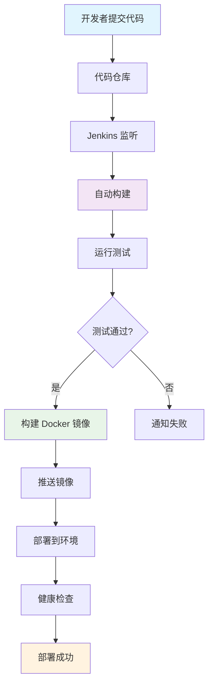

| 概念 | 描述 | 核心价值 |
|------|------|----------|
| **CI 持续集成** | 开发人员频繁将代码更改合并到主代码库中 | 🔄 早期发现问题，提高代码质量 |
| **CD 持续交付** | 自动化构建、测试、部署过程 | 🚀 软件随时可以安全发布到生产环境 |
| **自动化部署** | 无人工干预的部署流程 | ⚡ 减少人为错误，提高部署效率 |

## ⚙️ Jenkins 安装配置

### 🏗️ 安装方式对比

| 安装方式 | 优势 | 适用场景 |
|----------|------|----------|
| **Docker** | 🐳 环境隔离，易于管理 | 开发测试环境 |
| **包管理器** | 📦 系统集成度高 | 生产环境 |
| **War 包** | 🎯 灵活部署 | 自定义环境 |

::: code-group
```bash [Docker 安装]
# 拉取 Jenkins 镜像
docker pull jenkins/jenkins:lts

# 创建 Jenkins 容器
docker run -d \
  --name jenkins \
  -p 8080:8080 \
  -p 50000:50000 \
  -v jenkins_home:/var/jenkins_home \
  jenkins/jenkins:lts

# 查看初始密码
docker exec jenkins cat /var/jenkins_home/secrets/initialAdminPassword
```

```bash [Ubuntu/Debian]
# 添加 Jenkins 仓库
curl -fsSL https://pkg.jenkins.io/debian/jenkins.io-2023.key | sudo tee \
  /usr/share/keyrings/jenkins-keyring.asc > /dev/null

echo deb [signed-by=/usr/share/keyrings/jenkins-keyring.asc] \
  https://pkg.jenkins.io/debian binary/ | sudo tee \
  /etc/apt/sources.list.d/jenkins.list > /dev/null

# 安装 Jenkins
sudo apt-get update
sudo apt-get install jenkins
```

```bash [CentOS/RHEL]
# 添加 Jenkins 仓库
sudo wget -O /etc/yum.repos.d/jenkins.repo \
  https://pkg.jenkins.io/redhat-stable/jenkins.repo

sudo rpm --import https://pkg.jenkins.io/redhat-stable/jenkins.io-2023.key

# 安装 Jenkins
sudo yum install jenkins
```
:::

### 🔧 基础配置步骤

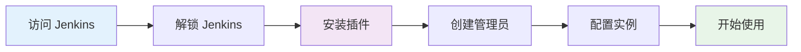

1. **访问 Jenkins**：浏览器打开 `http://localhost:8080`
2. **解锁 Jenkins**：输入初始管理员密码
3. **安装插件**：选择推荐插件或自定义安装
4. **创建管理员**：设置第一个管理员用户
5. **配置实例**：设置 Jenkins URL
6. **全局工具配置**：配置 JDK、Maven、Git 等

## 📋 创建新任务

### 🎯 任务类型选择

| 任务类型 | 适用场景 | 特点 |
|----------|----------|------|
| **Freestyle Project** | 简单构建任务 | 🎮 灵活配置，适合初学者 |
| **Pipeline** | 复杂流水线 | 🔄 代码化管理，功能强大 |
| **Maven Project** | Java 项目 | ☕ 原生 Maven 支持 |
| **Multibranch Pipeline** | 多分支项目 | 🌿 自动分支管理 |

### 📝 创建任务流程

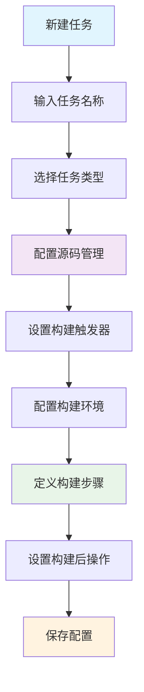

#### 1. 新建任务界面
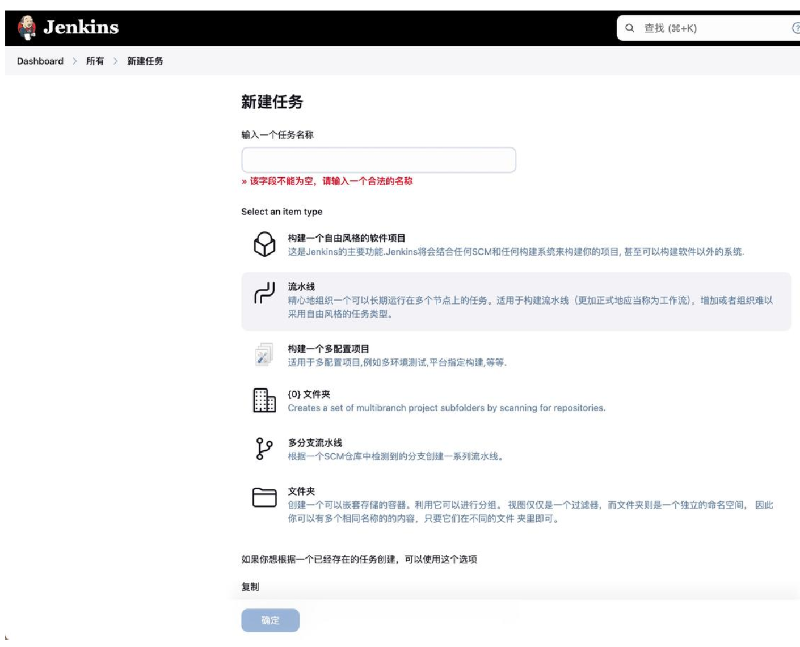

#### 2. 配置源码管理
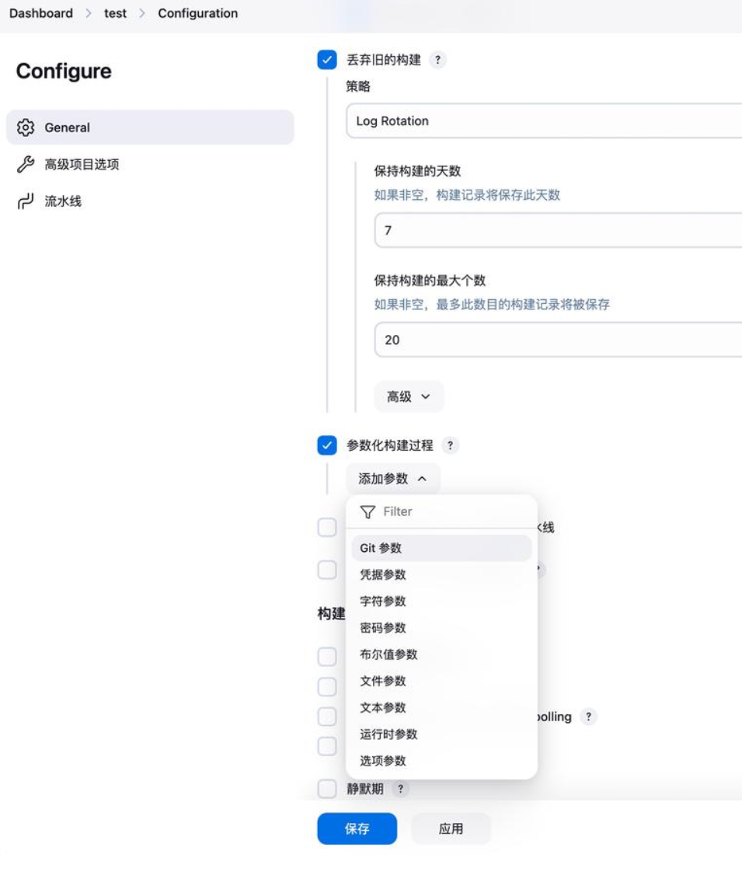

**Git 参数配置**：
- **Repository URL**：Git 仓库地址
- **Credentials**：访问凭据
- **Branch**：分支名称
- **Additional Behaviours**：其他行为配置

#### 3. 构建触发器配置
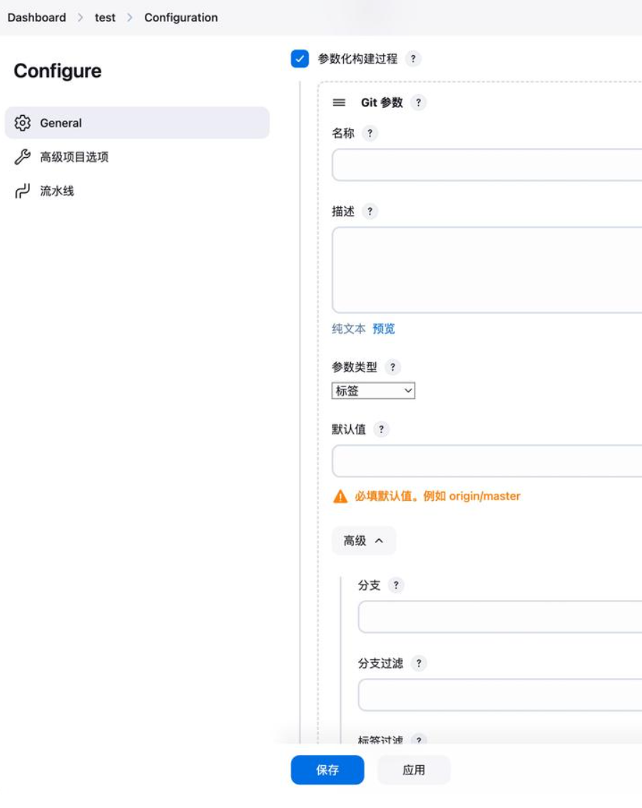

| 触发方式 | 说明 | 配置示例 |
|----------|------|----------|
| **定时构建** | 按时间表触发 | `H 2 * * *` (每天凌晨2点) |
| **轮询 SCM** | 检查代码变化 | `H/5 * * * *` (每5分钟检查) |
| **Webhook** | 代码推送触发 | GitHub/GitLab Webhook |
| **上游项目** | 依赖项目构建后触发 | 指定上游项目名称 |

## 🔐 创建凭据

### 🔧 凭据类型

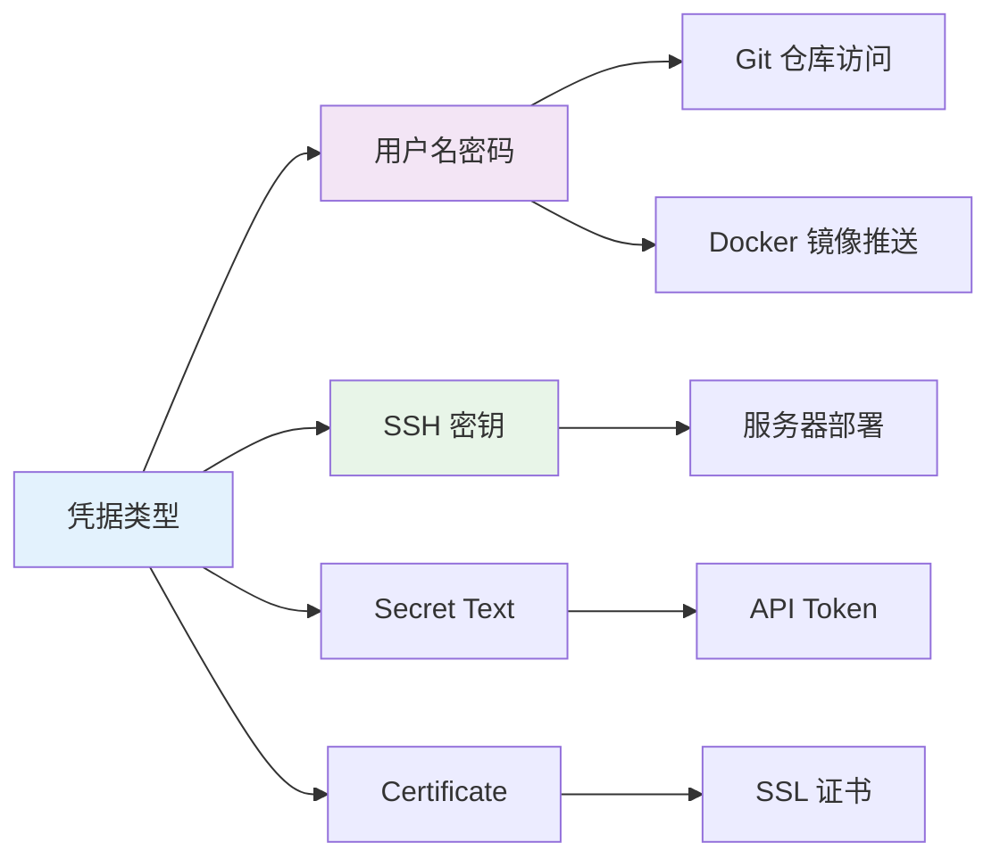

#### 1. 用户名密码凭据
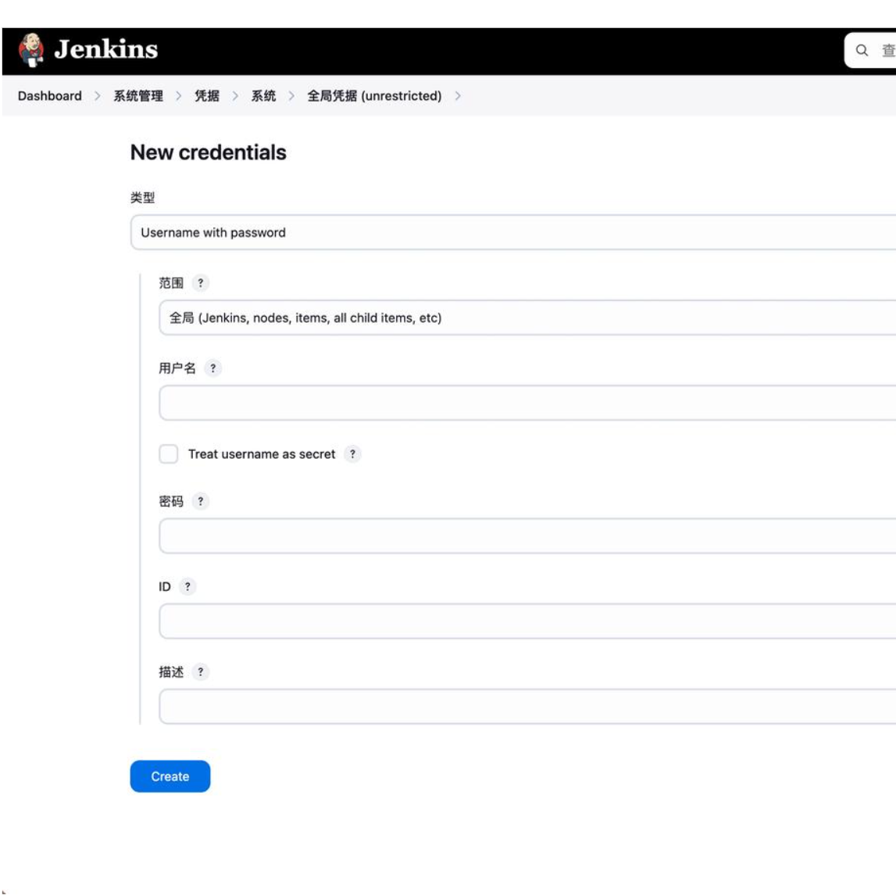

**使用场景**：
- 🔄 Git 仓库访问
- 🐳 Docker 镜像推送
- 📦 NPM 包发布

#### 2. SSH 密钥凭据
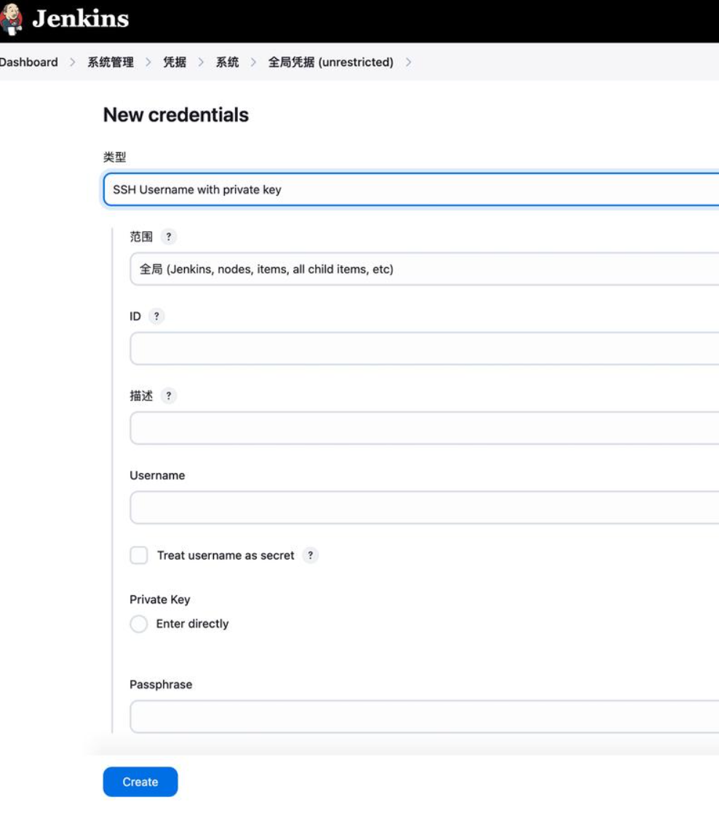

**使用场景**：
- 🚀 服务器部署
- 🔐 Git SSH 访问
- 📡 远程命令执行

## 🔄 配置流水线

### 📋 流水线概述

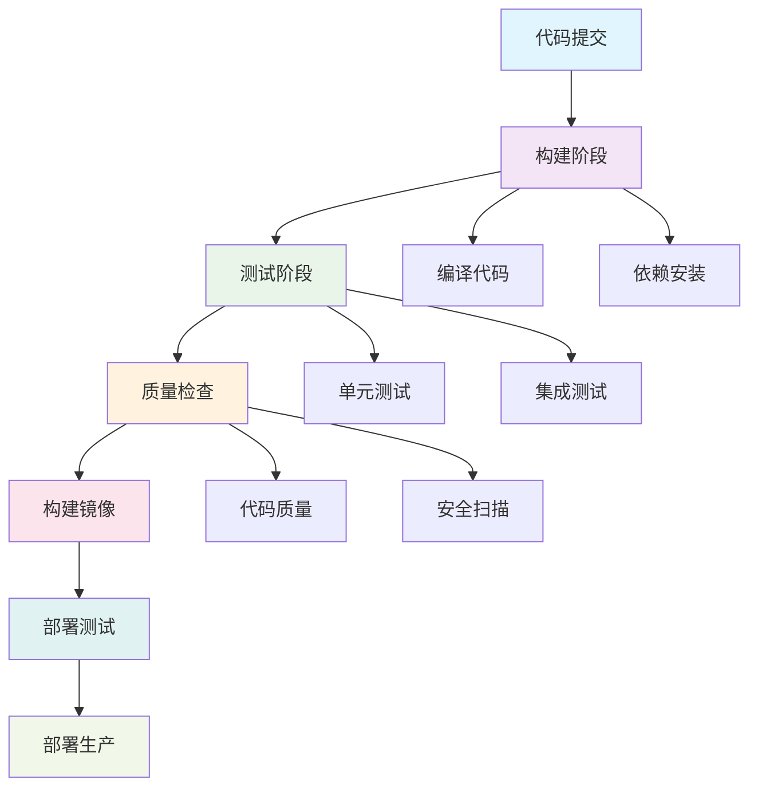

### 📝 Jenkinsfile 最佳实践

::: code-group
```groovy [基础流水线]
  pipeline {
    agent any
    
    environment {
        // 环境变量
        BUILD_URL = "${env.BUILD_URL}"
        JOB_NAME = "${env.JOB_NAME}"
        NODE_VERSION = "18"
    }
    
    parameters {
        gitParameter(
            name: 'BRANCH',
            type: 'PT_BRANCH',
            defaultValue: 'main',
            description: '选择构建分支'
        )
        choice(
            name: 'DEPLOY_ENV',
            choices: ['dev', 'staging', 'prod'],
            description: '部署环境'
        )
    }
    
    stages {
        stage('🔄 Checkout') {
            steps {
                echo "检出分支: ${params.BRANCH}"
                checkout scmGit(
                    branches: [[name: params.BRANCH]],
                    userRemoteConfigs: [[url: 'https://github.com/your-repo.git']]
                )
            }
        }
        
        stage('📦 Build') {
            steps {
                script {
                    echo "🔨 开始构建..."
                    sh 'npm ci'
                    sh 'npm run build'
                }
            }
        }
        
        stage('🧪 Test') {
            parallel {
                stage('Unit Tests') {
                    steps {
                        sh 'npm run test:unit'
                    }
                }
                stage('E2E Tests') {
                    steps {
                        sh 'npm run test:e2e'
                    }
                }
            }
        }
        
        stage('🐳 Docker Build') {
            steps {
                script {
                    def dockerImage = docker.build("myapp:${env.BUILD_NUMBER}")
                    dockerImage.push()
                }
            }
        }
        
        stage('🚀 Deploy') {
            steps {
                script {
                    if (params.DEPLOY_ENV == 'prod') {
                        input message: '确认部署到生产环境?', ok: '部署'
                    }
                    
                    sshagent(['ssh-credentials']) {
                        sh """
                        ssh -o StrictHostKeyChecking=no user@server \
                        'docker pull myapp:${env.BUILD_NUMBER} && \
                         docker stop myapp || true && \
                         docker run -d --name myapp -p 80:80 myapp:${env.BUILD_NUMBER}'
                        """
                    }
                }
            }
        }
    }
    
    post {
        always {
            echo '🧹 清理工作空间'
            cleanWs()
        }
        success {
            echo '✅ 构建成功!'
            // 发送成功通知
        }
        failure {
            echo '❌ 构建失败!'
            // 发送失败通知
        }
    }
}
```

```groovy [高级流水线]
pipeline {
    agent none
    
    environment {
        DOCKER_REGISTRY = 'registry.example.com'
        DOCKER_IMAGE = 'myapp'
        KUBECONFIG = credentials('k8s-config')
    }
    
    stages {
        stage('🔄 Checkout') {
            agent any
            steps {
                checkout scm
                script {
                    env.GIT_COMMIT = sh(
                        script: 'git rev-parse HEAD',
                        returnStdout: true
                    ).trim()
                    env.BUILD_TAG = "${env.BUILD_NUMBER}-${env.GIT_COMMIT[0..7]}"
                }
            }
        }
        
        stage('🔍 Code Quality') {
            parallel {
                stage('SonarQube') {
                    agent any
                    steps {
                        withSonarQubeEnv('SonarQube') {
                            sh 'sonar-scanner'
                        }
                    }
                }
                stage('Security Scan') {
                    agent any
                    steps {
                        sh 'npm audit --audit-level high'
                    }
                }
            }
        }
        
        stage('🏗️ Build & Test') {
            agent {
                docker {
                    image 'node:18'
                    args '-v /var/run/docker.sock:/var/run/docker.sock'
                }
            }
            steps {
                sh '''
                    npm ci
                    npm run build
                    npm run test:coverage
                '''
            }
            post {
                always {
                    publishHTML([
                        allowMissing: false,
                        alwaysLinkToLastBuild: true,
                        keepAll: true,
                        reportDir: 'coverage',
                        reportFiles: 'index.html',
                        reportName: 'Coverage Report'
                    ])
                }
            }
        }
        
        stage('🐳 Docker Build & Push') {
            agent any
            steps {
                script {
                    def image = docker.build("${DOCKER_REGISTRY}/${DOCKER_IMAGE}:${BUILD_TAG}")
                    
                    docker.withRegistry("https://${DOCKER_REGISTRY}", 'docker-registry-credentials') {
                        image.push()
                        image.push('latest')
                    }
                }
            }
        }
        
        stage('🚀 Deploy to Kubernetes') {
            agent any
            steps {
                script {
                    sh """
                    kubectl set image deployment/myapp \
                    myapp=${DOCKER_REGISTRY}/${DOCKER_IMAGE}:${BUILD_TAG}
                    
                    kubectl rollout status deployment/myapp
                    """
                }
            }
        }
    }
    
    post {
        always {
            node('master') {
                script {
                    // 清理 Docker 镜像
                    sh "docker rmi ${DOCKER_REGISTRY}/${DOCKER_IMAGE}:${BUILD_TAG} || true"
                }
            }
        }
        success {
            slackSend(
                channel: '#ci-cd',
                color: 'good',
                message: "✅ 部署成功: ${env.JOB_NAME} - ${env.BUILD_NUMBER}"
            )
        }
        failure {
            slackSend(
                channel: '#ci-cd',
                color: 'danger',
                message: "❌ 部署失败: ${env.JOB_NAME} - ${env.BUILD_NUMBER}"
            )
        }
    }
}
```
:::

### 🎨 流水线可视化

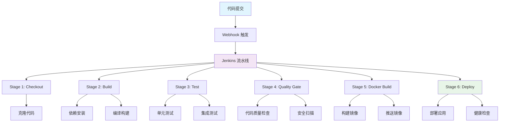

## 🚀 部署策略

### 📋 部署方式对比

| 策略 | 优点 | 缺点 | 适用场景 |
|------|------|------|----------|
| **蓝绿部署** | 🔄 零停机时间 | 💰 资源消耗大 | 生产环境 |
| **滚动部署** | 💡 资源利用率高 | ⏱️ 部署时间长 | 中型应用 |
| **金丝雀部署** | 🧪 风险控制 | 🔧 配置复杂 | 高风险更新 |

### 🔧 部署配置示例

::: code-group
```yaml [Kubernetes 部署]
apiVersion: apps/v1
kind: Deployment
metadata:
  name: myapp
  labels:
    app: myapp
spec:
  replicas: 3
  strategy:
    type: RollingUpdate
    rollingUpdate:
      maxSurge: 1
      maxUnavailable: 0
  selector:
    matchLabels:
      app: myapp
  template:
    metadata:
      labels:
        app: myapp
    spec:
      containers:
      - name: myapp
        image: myapp:latest
        ports:
        - containerPort: 80
        resources:
          requests:
            memory: "256Mi"
            cpu: "250m"
          limits:
            memory: "512Mi"
            cpu: "500m"
        livenessProbe:
          httpGet:
            path: /health
            port: 80
          initialDelaySeconds: 30
          periodSeconds: 10
        readinessProbe:
          httpGet:
            path: /ready
            port: 80
          initialDelaySeconds: 5
          periodSeconds: 5
```

```bash [Docker Compose 部署]
version: '3.8'
services:
  app:
    image: myapp:latest
    ports:
      - "80:80"
    environment:
      - NODE_ENV=production
      - DATABASE_URL=postgres://user:pass@db:5432/myapp
    depends_on:
      - db
    restart: unless-stopped
    healthcheck:
      test: ["CMD", "curl", "-f", "http://localhost/health"]
      interval: 30s
      timeout: 10s
      retries: 3
  
  db:
    image: postgres:14
    environment:
      - POSTGRES_DB=myapp
      - POSTGRES_USER=user
      - POSTGRES_PASSWORD=pass
    volumes:
      - postgres_data:/var/lib/postgresql/data
    restart: unless-stopped

volumes:
  postgres_data:
```
:::

## 📊 监控与调试

### 🔍 构建监控

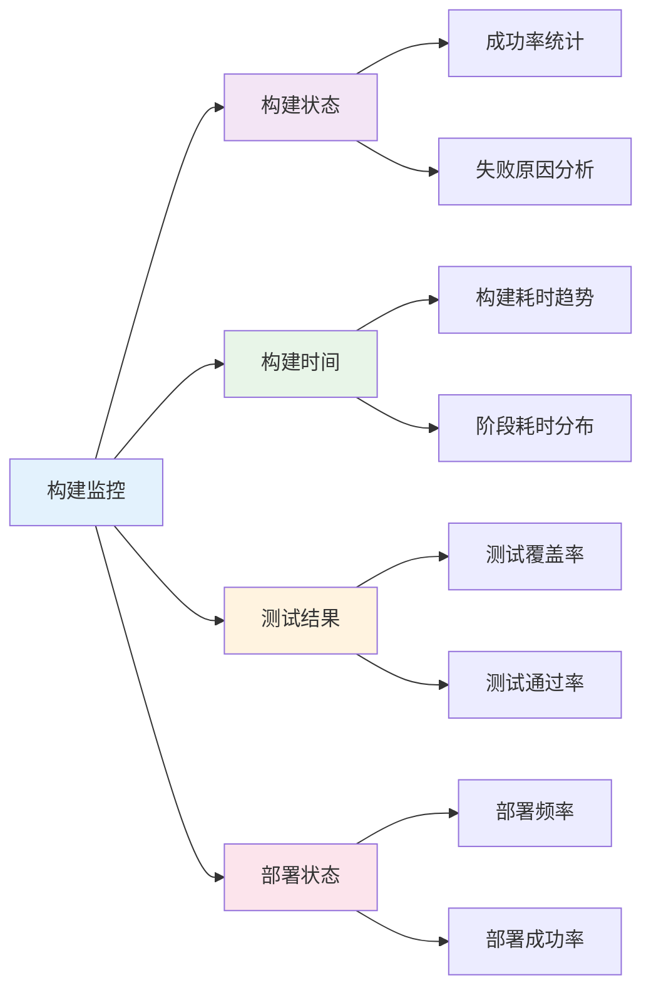

### 🔧 常见问题解决

::: tip 💡 构建失败排查步骤

1. **检查构建日志**
   ```bash
   # 查看完整构建日志
   curl -u username:password "http://jenkins-url/job/job-name/build-number/consoleText"
   ```

2. **检查环境变量**
   ```groovy
   // 在 Jenkinsfile 中打印环境变量
   script {
       sh 'printenv | sort'
   }
   ```

3. **检查工作空间**
   ```groovy
   // 查看工作空间文件
   script {
       sh 'ls -la'
       sh 'pwd'
   }
   ```

4. **检查资源使用**
   ```bash
   # 检查磁盘空间
   df -h
   
   # 检查内存使用
   free -h
   ```
:::

### 📈 性能优化

| 优化方向 | 具体措施 | 效果 |
|----------|----------|------|
| **构建缓存** | 使用 Docker 层缓存 | 🚀 减少 50% 构建时间 |
| **并行构建** | 并行执行测试阶段 | ⚡ 提高 30% 效率 |
| **资源优化** | 合理分配构建节点 | 📊 提升系统吞吐量 |
| **增量构建** | 只构建变更部分 | 💡 显著减少构建时间 |

## 📖 参考资源

### 🔗 官方文档
- [Jenkins 官方文档](https://www.jenkins.io/doc/)
- [Jenkins 流水线语法](https://www.jenkins.io/doc/book/pipeline/syntax/)
- [Jenkins 插件中心](https://plugins.jenkins.io/)

### 🛠️ 实用工具
- [Jenkins Configuration as Code](https://github.com/jenkinsci/configuration-as-code-plugin)
- [Blue Ocean 界面](https://www.jenkins.io/projects/blueocean/)
- [Jenkins CLI](https://www.jenkins.io/doc/book/managing/cli/)

### 📚 学习资源
- [Jenkins 最佳实践](https://www.jenkins.io/doc/book/using/best-practices/)
- [Pipeline 示例](https://github.com/jenkinsci/pipeline-examples)
- [Jenkins 社区](https://www.jenkins.io/participate/)

---

::: tip 🎯 小贴士
Jenkins 的强大之处在于其丰富的插件生态系统和灵活的流水线配置。建议从简单的 Freestyle 项目开始，逐步过渡到复杂的 Pipeline 流水线，并根据项目需求选择合适的部署策略。
:::