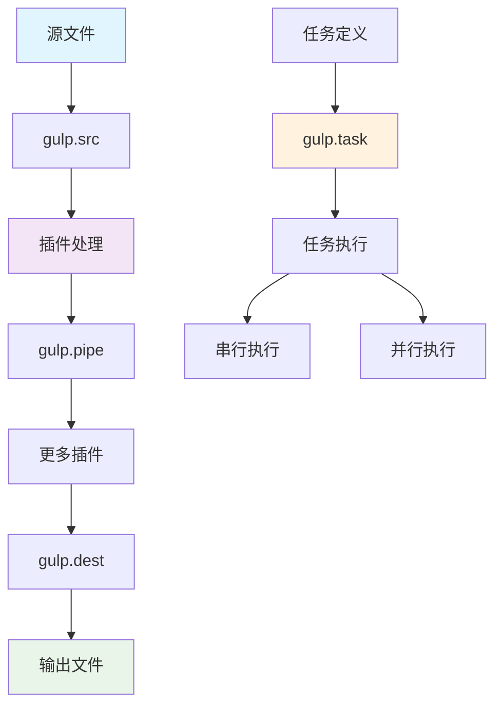
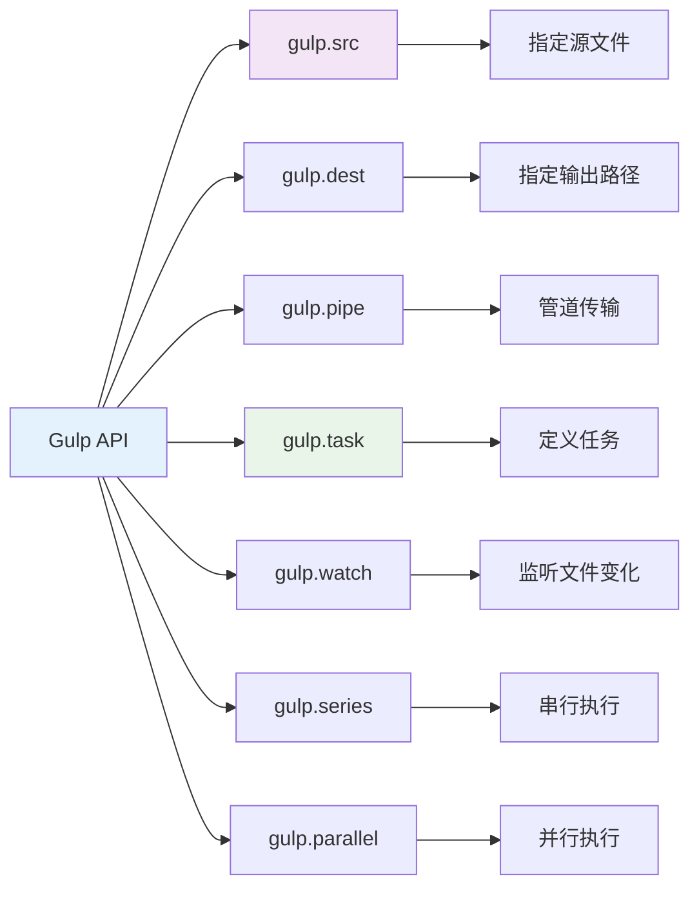
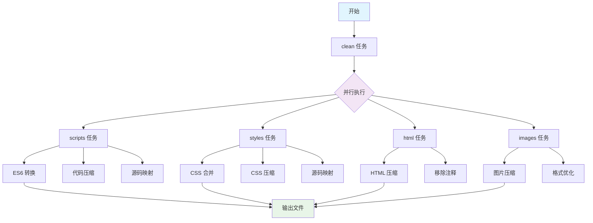

# 🌊 Gulp 自动化构建工具完全指南

> Gulp 是基于流/Node.js 的自动化构建工具，主要使用管道传输机制，提供简洁高效的构建体验。

## 📚 目录导航

::: details 🔍 点击展开完整目录
- [🎯 Gulp 简介](#gulp-简介)
- [🏗️ 核心概念](#核心概念)
- [📦 安装与配置](#安装与配置)
- [🔧 API 详解](#api-详解)
- [🎨 常用插件](#常用插件)
- [📋 配置示例](#配置示例)
- [🚀 高级特性](#高级特性)
- [📊 性能优化](#性能优化)
- [🔍 调试技巧](#调试技巧)
- [🛠️ 实际项目应用](#实际项目应用)
- [📖 参考资源](#参考资源)
:::

## 🎯 Gulp 简介

Gulp 是基于流/Node.js 的自动化构建工具，主要使用管道传输机制，提供简洁高效的构建体验。

### 🏗️ 核心概念



### ⚡ 核心优势

| 特性 | 描述 | 优势 |
|------|------|------|
| **基于流** | 使用 Node.js 流 | 🚀 高效处理，内存占用低 |
| **管道模式** | 链式操作 | 🔄 代码清晰，易于维护 |
| **插件丰富** | 庞大的插件生态 | 🎨 功能强大，扩展性好 |
| **配置简单** | 代码优于配置 | 💡 学习成本低，上手快 |

## 📦 安装与配置

### 🔧 安装步骤

::: code-group
```bash [全局安装]
# 全局安装 Gulp CLI
npm install --global gulp-cli

# 验证安装
gulp --version
```

```bash [项目安装]
# 项目中安装 Gulp
npm install --save-dev gulp

# 安装常用插件
npm install --save-dev gulp-babel gulp-uglify gulp-clean-css
```

```bash [快速开始]
# 创建项目目录
mkdir my-gulp-project
cd my-gulp-project

# 初始化项目
npm init -y

# 安装依赖
npm install --save-dev gulp
```
:::

### 📋 项目结构

```
my-gulp-project/
├── src/
│   ├── js/
│   │   └── app.js
│   ├── css/
│   │   └── style.css
│   └── index.html
├── dist/
├── gulpfile.js
└── package.json
```

## 🔧 API 详解

### 🌟 核心 API



#### 📝 API 功能详解

| API | 功能 | 示例 |
|-----|------|------|
| **gulp.src** | 指定需要处理的文件 | `gulp.src('src/**/*.js')` |
| **gulp.dest** | 指定输出路径 | `gulp.dest('dist/')` |
| **gulp.pipe** | 管道传输，连接处理步骤 | `.pipe(uglify())` |
| **gulp.task** | 注册任务 | `gulp.task('build', ...)` |
| **gulp.watch** | 监听文件变化 | `gulp.watch('src/**/*.js', task)` |
| **gulp.series** | 串行执行任务 | `gulp.series('clean', 'build')` |
| **gulp.parallel** | 并行执行任务 | `gulp.parallel('js', 'css')` |

### 🎨 常用插件

#### 🔧 开发插件

| 插件 | 功能 | 使用场景 |
|------|------|----------|
| **del** | 清空目录 | 🗑️ 构建前清理 |
| **gulp-babel** | ES6 转 ES5 | 🔄 代码转换 |
| **gulp-concat** | 合并文件 | 📦 文件合并 |
| **gulp-uglify** | 压缩 JavaScript | 🗜️ 代码压缩 |
| **gulp-clean-css** | 压缩 CSS | 🎨 样式压缩 |
| **gulp-htmlmin** | 压缩 HTML | 📄 标记压缩 |
| **gulp-imagemin** | 压缩图片 | 🖼️ 图片优化 |
| **gulp-rename** | 重命名文件 | 📝 文件重命名 |
| **gulp-if** | 条件处理 | 🔀 条件判断 |

#### 🚀 高级插件

| 插件 | 功能 | 使用场景 |
|------|------|----------|
| **gulp-connect** | 本地服务器 | 🌐 开发服务器 |
| **gulp-livereload** | 自动刷新 | 🔄 实时预览 |
| **gulp-sourcemaps** | 源码映射 | 🗺️ 调试支持 |
| **gulp-plumber** | 错误处理 | 🛠️ 错误防护 |
| **gulp-notify** | 桌面通知 | 📢 任务通知 |

## 📋 配置示例

### 🌟 基础配置

```javascript
const gulp = require('gulp');
const babel = require('gulp-babel');
const uglify = require('gulp-uglify');
const cleanCSS = require('gulp-clean-css');
const htmlmin = require('gulp-htmlmin');
const imagemin = require('gulp-imagemin');
const del = require('del');
const connect = require('gulp-connect');

// 路径配置
const paths = {
  scripts: {
    src: 'src/js/**/*.js',
    dest: 'dist/js/'
  },
  styles: {
    src: 'src/css/**/*.css',
    dest: 'dist/css/'
  },
  html: {
    src: 'src/**/*.html',
    dest: 'dist/'
  },
  images: {
    src: 'src/images/**/*',
    dest: 'dist/images/'
  }
};

// 清理任务
function clean() {
  return del(['dist']);
}

// JavaScript 处理
function scripts() {
  return gulp.src(paths.scripts.src)
    .pipe(babel({
      presets: ['@babel/preset-env']
    }))
    .pipe(uglify())
    .pipe(gulp.dest(paths.scripts.dest));
}

// CSS 处理
function styles() {
  return gulp.src(paths.styles.src)
    .pipe(cleanCSS())
    .pipe(gulp.dest(paths.styles.dest));
}

// HTML 处理
function html() {
  return gulp.src(paths.html.src)
    .pipe(htmlmin({
      collapseWhitespace: true,
      minifyJS: true,
      minifyCSS: true,
      removeComments: true
    }))
    .pipe(gulp.dest(paths.html.dest));
}

// 图片处理
function images() {
  return gulp.src(paths.images.src)
    .pipe(imagemin())
    .pipe(gulp.dest(paths.images.dest));
}

// 监听任务
function watchFiles() {
  gulp.watch(paths.scripts.src, scripts);
  gulp.watch(paths.styles.src, styles);
  gulp.watch(paths.html.src, html);
  gulp.watch(paths.images.src, images);
}

// 开发服务器
function serve() {
  connect.server({
    root: 'dist',
    port: 8080,
    livereload: true
  });
}

// 导出任务
exports.clean = clean;
exports.scripts = scripts;
exports.styles = styles;
exports.html = html;
exports.images = images;
exports.watch = watchFiles;
exports.serve = serve;

// 构建任务
exports.build = gulp.series(clean, gulp.parallel(scripts, styles, html, images));

// 开发任务
exports.dev = gulp.series(clean, gulp.parallel(scripts, styles, html, images), serve, watchFiles);

// 默认任务
exports.default = exports.build;
```

### 🚀 高级配置

```javascript
const gulp = require('gulp');
const babel = require('gulp-babel');
const uglify = require('gulp-uglify');
const cleanCSS = require('gulp-clean-css');
const htmlmin = require('gulp-htmlmin');
const imagemin = require('gulp-imagemin');
const concat = require('gulp-concat');
const rename = require('gulp-rename');
const sourcemaps = require('gulp-sourcemaps');
const plumber = require('gulp-plumber');
const notify = require('gulp-notify');
const gulpif = require('gulp-if');
const del = require('del');
const connect = require('gulp-connect');
const pump = require('pump');

// 环境变量
const isDev = process.env.NODE_ENV === 'development';
const isProd = process.env.NODE_ENV === 'production';

// 路径配置
const config = {
  src: {
    js: 'src/js/**/*.js',
    css: 'src/css/**/*.css',
    html: 'src/**/*.html',
    images: 'src/images/**/*'
  },
  dist: {
    js: 'dist/js/',
    css: 'dist/css/',
    html: 'dist/',
    images: 'dist/images/'
  }
};

// 错误处理
function handleError(err) {
  notify.onError({
    title: 'Gulp Error',
    message: '<%= error.message %>'
  })(err);
  this.emit('end');
}

// 清理任务
function clean() {
  return del(['dist/**/*']);
}

// JavaScript 处理
function processScripts() {
  return gulp.src(config.src.js)
    .pipe(plumber({ errorHandler: handleError }))
    .pipe(gulpif(isDev, sourcemaps.init()))
    .pipe(babel({
      presets: ['@babel/preset-env']
    }))
    .pipe(concat('app.js'))
    .pipe(gulpif(isProd, uglify()))
    .pipe(gulpif(isProd, rename({ suffix: '.min' })))
    .pipe(gulpif(isDev, sourcemaps.write('.')))
    .pipe(gulp.dest(config.dist.js))
    .pipe(notify({ message: 'Scripts task complete' }));
}

// CSS 处理
function processStyles() {
  return gulp.src(config.src.css)
    .pipe(plumber({ errorHandler: handleError }))
    .pipe(gulpif(isDev, sourcemaps.init()))
    .pipe(concat('style.css'))
    .pipe(gulpif(isProd, cleanCSS()))
    .pipe(gulpif(isProd, rename({ suffix: '.min' })))
    .pipe(gulpif(isDev, sourcemaps.write('.')))
    .pipe(gulp.dest(config.dist.css))
    .pipe(notify({ message: 'Styles task complete' }));
}

// HTML 处理
function processHtml() {
  return gulp.src(config.src.html)
    .pipe(plumber({ errorHandler: handleError }))
    .pipe(gulpif(isProd, htmlmin({
      collapseWhitespace: true,
      minifyJS: true,
      minifyCSS: true,
      removeComments: true,
      removeScriptTypeAttributes: true,
      removeStyleLinkTypeAttributes: true
    })))
    .pipe(gulp.dest(config.dist.html))
    .pipe(notify({ message: 'HTML task complete' }));
}

// 图片处理
function processImages() {
  return gulp.src(config.src.images)
    .pipe(plumber({ errorHandler: handleError }))
    .pipe(gulpif(isProd, imagemin({
      progressive: true,
      svgoPlugins: [{ removeViewBox: false }],
      interlaced: true
    })))
    .pipe(gulp.dest(config.dist.images))
    .pipe(notify({ message: 'Images task complete' }));
}

// 监听任务
function watchFiles() {
  gulp.watch(config.src.js, processScripts);
  gulp.watch(config.src.css, processStyles);
  gulp.watch(config.src.html, processHtml);
  gulp.watch(config.src.images, processImages);
}

// 开发服务器
function startServer() {
  connect.server({
    root: 'dist',
    port: 8080,
    livereload: true,
    open: true
  });
}

// 导出任务
exports.clean = clean;
exports.scripts = processScripts;
exports.styles = processStyles;
exports.html = processHtml;
exports.images = processImages;
exports.watch = watchFiles;
exports.serve = startServer;

// 构建任务
exports.build = gulp.series(
  clean,
  gulp.parallel(processScripts, processStyles, processHtml, processImages)
);

// 开发任务
exports.dev = gulp.series(
  clean,
  gulp.parallel(processScripts, processStyles, processHtml, processImages),
  gulp.parallel(startServer, watchFiles)
);

// 默认任务
exports.default = exports.build;
```

## 🚀 高级特性

### 📊 任务执行流程



### 🔄 条件处理

```javascript
// 环境相关处理
const gulpif = require('gulp-if');

function processAssets() {
  return gulp.src('src/**/*')
    .pipe(gulpif(isDev, sourcemaps.init()))
    .pipe(gulpif(isProd, uglify()))
    .pipe(gulpif(isDev, sourcemaps.write()))
    .pipe(gulp.dest('dist/'));
}

// 文件类型判断
function processFiles() {
  return gulp.src('src/**/*')
    .pipe(gulpif('*.js', babel()))
    .pipe(gulpif('*.css', cleanCSS()))
    .pipe(gulpif('*.html', htmlmin()))
    .pipe(gulp.dest('dist/'));
}
```

### 🛠️ 错误处理

```javascript
const plumber = require('gulp-plumber');
const notify = require('gulp-notify');

function handleError() {
  return plumber({
    errorHandler: notify.onError({
      title: 'Gulp Error',
      message: '<%= error.message %>',
      sound: 'Beep'
    })
  });
}

function processWithErrorHandling() {
  return gulp.src('src/**/*.js')
    .pipe(handleError())
    .pipe(babel())
    .pipe(uglify())
    .pipe(gulp.dest('dist/'));
}
```

## 📊 性能优化

### ⚡ 优化技巧

| 技巧 | 描述 | 效果 |
|------|------|------|
| **并行处理** | 使用 `gulp.parallel` | 🚀 提高构建速度 |
| **增量构建** | 只处理修改的文件 | 💡 减少处理时间 |
| **流式处理** | 避免临时文件 | 🔄 提高内存效率 |
| **缓存机制** | 使用 gulp-cache | 📦 避免重复处理 |

### 🔧 性能优化示例

```javascript
const cache = require('gulp-cache');
const changed = require('gulp-changed');

// 增量处理
function processIncrementalJS() {
  return gulp.src('src/**/*.js')
    .pipe(changed('dist/js/'))
    .pipe(babel())
    .pipe(uglify())
    .pipe(gulp.dest('dist/js/'));
}

// 缓存处理
function processWithCache() {
  return gulp.src('src/images/**/*')
    .pipe(cache(imagemin()))
    .pipe(gulp.dest('dist/images/'));
}

// 清理缓存
function clearCache() {
  return cache.clearAll();
}
```

## 🔍 调试技巧

### 🛠️ 调试工具

::: tip 💡 调试方法

1. **使用 `gulp-debug`**
   ```javascript
   const debug = require('gulp-debug');
   
   gulp.src('src/**/*.js')
     .pipe(debug({ title: 'JS Files:' }))
     .pipe(babel())
     .pipe(gulp.dest('dist/'));
   ```

2. **任务执行时间**
   ```javascript
   const time = require('gulp-time');
   
   gulp.task('build', time(function() {
     return gulp.src('src/**/*')
       .pipe(gulp.dest('dist/'));
   }));
   ```

3. **文件大小统计**
   ```javascript
   const size = require('gulp-size');
   
   gulp.src('src/**/*.js')
     .pipe(babel())
     .pipe(size({ title: 'Before:' }))
     .pipe(uglify())
     .pipe(size({ title: 'After:' }))
     .pipe(gulp.dest('dist/'));
   ```
:::

## 🛠️ 实际项目应用

### 🏗️ 多页面应用

```javascript
// 多页面构建配置
const pages = ['index', 'about', 'contact'];

function buildPages() {
  return pages.map(page => {
    return gulp.src(`src/${page}/**/*`)
      .pipe(processAssets())
      .pipe(gulp.dest(`dist/${page}/`));
  });
}

exports.pages = gulp.parallel(...buildPages());
```

### 📱 移动端适配

```javascript
// 移动端资源处理
function processMobileAssets() {
  return gulp.src('src/**/*.{jpg,png}')
    .pipe(imagemin())
    .pipe(rename({ suffix: '@2x' }))
    .pipe(gulp.dest('dist/images/'))
    .pipe(gulp.src('src/**/*.{jpg,png}'))
    .pipe(imagemin())
    .pipe(gulp.dest('dist/images/'));
}
```

### 🌐 多环境部署

```javascript
// 环境配置
const envConfig = {
  development: {
    publicPath: '/',
    apiUrl: 'http://localhost:3000'
  },
  production: {
    publicPath: '/app/',
    apiUrl: 'https://api.example.com'
  }
};

function buildForEnv(env) {
  return gulp.src('src/**/*')
    .pipe(replace('{{PUBLIC_PATH}}', envConfig[env].publicPath))
    .pipe(replace('{{API_URL}}', envConfig[env].apiUrl))
    .pipe(gulp.dest(`dist/${env}/`));
}
```

## 📖 参考资源

### 🔗 官方文档
- [Gulp 官方文档](https://gulpjs.com/docs/en/getting-started/quick-start)
- [Gulp 插件搜索](https://gulpjs.com/plugins/)
- [Gulp API 参考](https://gulpjs.com/docs/en/api/concepts)

### 🛠️ 实用工具
- [Gulp CLI](https://github.com/gulpjs/gulp-cli)
- [Gulp 插件开发](https://github.com/gulpjs/gulp/blob/master/docs/writing-a-plugin/README.md)
- [Gulp 配方](https://github.com/gulpjs/gulp/tree/master/docs/recipes)

### 📚 学习资源
- [Gulp 最佳实践](https://github.com/gulpjs/gulp/blob/master/docs/recipes/README.md)
- [Gulp 社区](https://github.com/gulpjs/gulp/discussions)
- [Gulp 问题排查](https://github.com/gulpjs/gulp/blob/master/docs/FAQ.md)

---

::: tip 🎯 小贴士
Gulp 的核心优势在于其基于流的处理方式和丰富的插件生态。建议从简单的任务开始，逐步构建复杂的构建流程。合理使用并行处理和缓存机制可以显著提高构建效率。
:::
