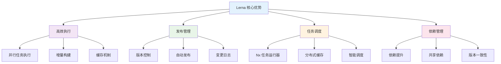
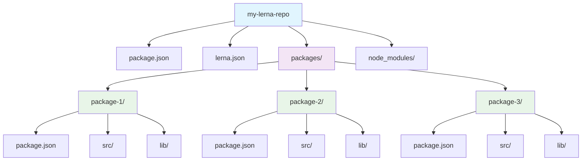
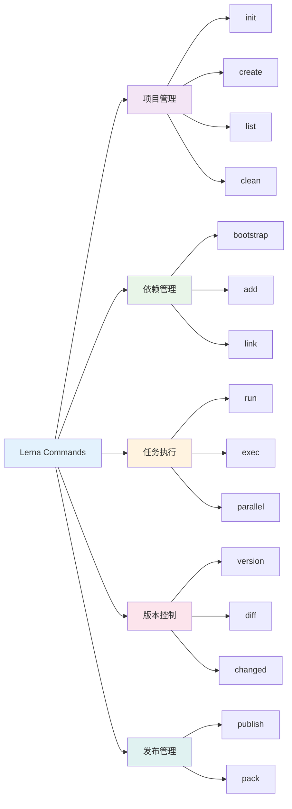
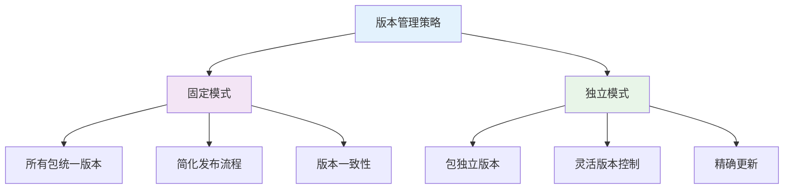
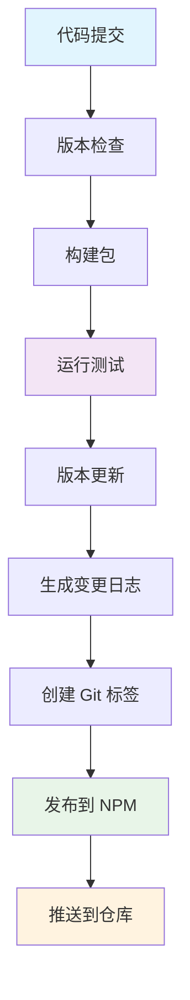
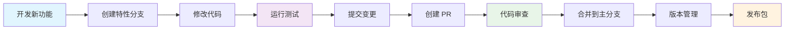
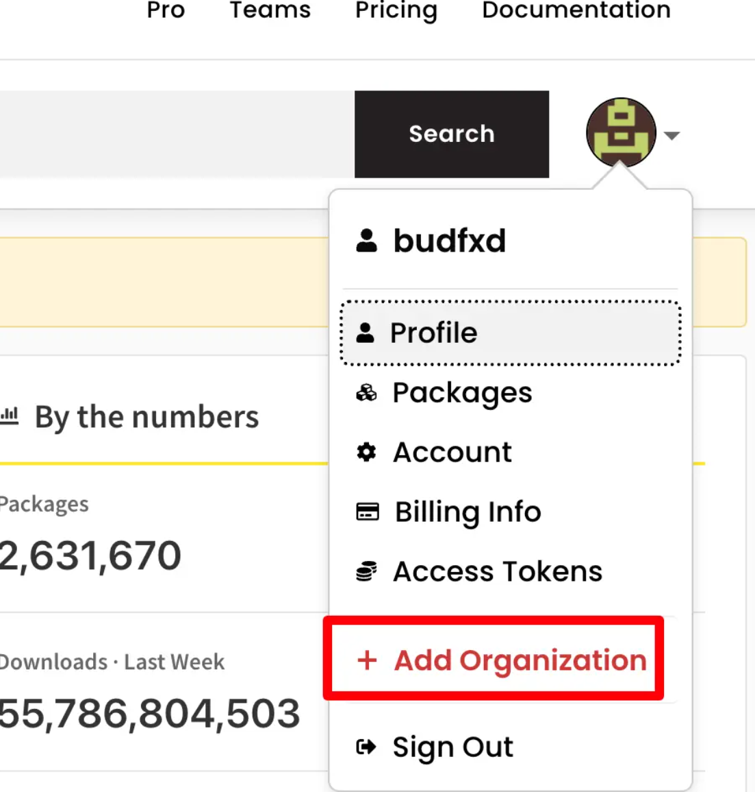

# 🏗️ Lerna Monorepo 管理工具完全指南

> Lerna 是一个快速、领先的构建系统，用于管理和发布来自同一源码仓库（Monorepos）的多个 JavaScript/TypeScript 软件包。

## 📚 目录导航

::: details 🔍 点击展开完整目录
- [🎯 Lerna 简介](#lerna-简介)
- [🏗️ 项目架构](#项目架构)
- [📦 安装与初始化](#安装与初始化)
- [🔧 核心命令](#核心命令)
- [📋 配置文件](#配置文件)
- [🚀 版本管理](#版本管理)
- [📤 发布流程](#发布流程)
- [🔄 工作流程](#工作流程)
- [🛠️ 最佳实践](#最佳实践)
- [🔍 故障排查](#故障排查)
- [📖 参考资源](#参考资源)
:::

## 🎯 Lerna 简介

Lerna 是一个快速、领先的构建系统，用于管理和发布来自同一源码仓库（Monorepos）的多个 JavaScript/TypeScript 软件包。

### ✨ 核心优势



| 功能 | 描述 | 优势 |
|------|------|------|
| **高效执行** | 针对任意数量的项目运行命令 | ⚡ 以最高效的方式、正确的顺序运行 |
| **发布管理** | 管理从版本控制到 NPM 发布的完整流程 | 🚀 支持多种工作流程 |
| **任务调度** | 基于 Nx 任务运行程序 | 🔄 免费获得缓存和分布式运行 |
| **依赖管理** | 智能处理包之间的依赖关系 | 🎯 避免依赖冲突，提升性能 |

::: info 📖 版本特性
从 v6+ 版本开始，Lerna 将任务调度工作委托给经过实战检验、业界领先的 Nx 任务运行程序，这意味着 `lerna run` 可以免费获得缓存和命令分布式运行所带来的好处！

**参考文档**: [Lerna 官方文档](https://www.lernajs.cn/docs/getting-started)
:::

## 🏗️ 项目架构

### 📁 项目结构

新版本的 Lerna 统一改为使用包管理器（如：npm/yarn/pnpm）来管理依赖。



**标准目录结构**：
```txt
my-lerna-repo/
├── package.json          # 根级别 package.json
├── lerna.json            # Lerna 配置文件
├── nx.json               # Nx 配置文件 (可选)
├── packages/             # 子项目存储目录
│   ├── package-1/
│   │   ├── package.json
│   │   ├── src/
│   │   └── lib/
│   ├── package-2/
│   │   ├── package.json
│   │   ├── src/
│   │   └── lib/
│   └── package-3/
│       ├── package.json
│       ├── src/
│       └── lib/
├── node_modules/         # 共享依赖
└── README.md
```

## 📦 安装与初始化

### 🔧 全局安装

::: code-group
```bash [npm]
# 全局安装 lerna
npm install -g lerna

# 验证安装
lerna --version
```

```bash [yarn]
# 全局安装 lerna
yarn global add lerna

# 验证安装
lerna --version
```

```bash [pnpm]
# 全局安装 lerna
pnpm install -g lerna

# 验证安装
lerna --version
```
:::

### 🏗️ 项目初始化

::: code-group
```bash [新项目初始化]
# 创建项目目录
mkdir my-lerna-repo
cd my-lerna-repo

# 初始化 lerna 项目
lerna init

# 或者使用 npx (推荐)
npx lerna init
```

```bash [现有项目初始化]
# 在现有项目中初始化 lerna
# 指定包管理模式
npx lerna init --packages="packages/*"

# 指定多个匹配模式
npx lerna init --packages="foo/*" --packages="bar/*"
```

```bash [预览模式]
# 使用 --dryRun 预览初始化更改
npx lerna init --dryRun
```
:::

### 📋 初始化配置

初始化后会生成以下文件：

::: code-group
```json [package.json]
{
  "name": "my-lerna-repo",
  "private": true,
  "workspaces": [
    "packages/*"
  ],
  "devDependencies": {
    "lerna": "^8.0.0"
  }
}
```

```json [lerna.json]
{
  "version": "0.0.0",
  "npmClient": "npm",
  "command": {
    "publish": {
      "conventionalCommits": true,
      "message": "chore(release): publish",
      "registry": "https://registry.npmjs.org"
    },
    "bootstrap": {
      "ignore": "component-*",
      "npmClientArgs": ["--no-package-lock"]
    }
  }
}
```
:::

## 🔧 核心命令

### 📋 命令概览



### 🎯 常用命令详解

#### 📦 创建包

```bash
# 在 packages 目录下创建新包
lerna create <package-name>

# 创建作用域包
lerna create @my-scope/my-package

# 指定包存储位置
lerna create my-package packages/utils
```

#### 📋 查看包信息

```bash
# 列出所有包
lerna list
lerna ls

# 显示详细信息
lerna ls --long
lerna ls -l

# 显示包的依赖图
lerna ls --graph

# 只显示包名
lerna ls --parseable
```

#### 📦 依赖管理

```bash
# 给所有包安装依赖
npm install lodash --workspaces

# 给特定包安装依赖
npm install lodash -w packages/utils

# 安装包之间的依赖
npm install @my-scope/utils -w packages/core

# 清理所有包的 node_modules
lerna clean

# 清理特定包
lerna clean --scope @my-scope/utils
```

#### 🔧 执行命令

```bash
# 在所有包中执行命令
lerna exec -- <command>

# 在特定包中执行命令
lerna exec --scope @my-scope/utils -- <command>

# 并行执行命令
lerna exec --parallel -- <command>

# 执行 npm scripts
lerna run <script>

# 在特定包中执行 script
lerna run build --scope @my-scope/utils

# 并行执行 script
lerna run test --parallel
```

## 📋 配置文件

### ⚙️ lerna.json 配置

```json
{
  "version": "1.0.0",
  "npmClient": "npm",
  "command": {
    "publish": {
      "conventionalCommits": true,
      "message": "chore(release): publish",
      "registry": "https://registry.npmjs.org",
      "allowBranch": ["main", "release/*"],
      "ignoreChanges": [
        "*.md",
        "**/*.test.js",
        "**/*.spec.js"
      ]
    },
    "bootstrap": {
      "ignore": "component-*",
      "npmClientArgs": ["--no-package-lock"],
      "scope": ["@my-scope/*"]
    },
    "run": {
      "npmClient": "npm",
      "stream": true
    },
    "version": {
      "allowBranch": ["main", "release/*"],
      "conventionalCommits": true,
      "message": "chore(release): publish %s",
      "tagVersionPrefix": "v"
    }
  }
}
```

### 🏗️ 工作空间配置

::: code-group
```json [package.json - npm workspaces]
{
  "name": "my-lerna-repo",
  "private": true,
  "workspaces": [
    "packages/*",
    "apps/*"
  ],
  "scripts": {
    "build": "lerna run build",
    "test": "lerna run test",
    "lint": "lerna run lint",
    "clean": "lerna clean"
  }
}
```

```json [nx.json - Nx 配置]
{
  "npmScope": "my-scope",
  "affected": {
    "defaultBase": "main"
  },
  "tasksRunnerOptions": {
    "default": {
      "runner": "nx/tasks-runners/default",
      "options": {
        "cacheableOperations": ["build", "test", "lint"]
      }
    }
  }
}
```
:::

## 🚀 版本管理

### 📊 版本管理策略



#### 🔧 版本控制命令

```bash
# 自动版本管理
lerna version

# 指定版本类型
lerna version patch      # 0.0.1 -> 0.0.2
lerna version minor      # 0.1.0 -> 0.2.0
lerna version major      # 1.0.0 -> 2.0.0
lerna version premajor   # 1.0.0 -> 2.0.0-alpha.0

# 指定具体版本
lerna version 1.2.3

# 预发布版本
lerna version prerelease --preid=beta

# 跳过 Git 操作
lerna version --no-git-tag-version
lerna version --no-push

# 查看版本差异
lerna diff
lerna diff --since=main

# 查看变更的包
lerna changed
lerna changed --since=main
```

### 📝 常规提交规范

```bash
# 启用常规提交
lerna version --conventional-commits

# 自定义提交消息
lerna version --message "chore(release): publish %s"

# 生成变更日志
lerna version --conventional-commits --create-release github
```

## 📤 发布流程

### 🚀 发布命令

```bash
# 发布所有包
lerna publish

# 发布特定版本
lerna publish 1.2.3

# 发布预发布版本
lerna publish --canary
lerna publish --preid=beta

# 发布到特定 registry
lerna publish --registry https://npm.pkg.github.com

# 跳过确认
lerna publish --yes

# 仅发布变更的包
lerna publish from-git
lerna publish from-package
```

### 📋 发布工作流



### 🔧 发布配置

```json
{
  "command": {
    "publish": {
      "conventionalCommits": true,
      "message": "chore(release): publish",
      "registry": "https://registry.npmjs.org",
      "allowBranch": ["main", "release/*"],
      "ignoreChanges": [
        "*.md",
        "**/*.test.js",
        "**/*.spec.js"
      ],
      "contents": "lib",
      "bump": "patch"
    }
  }
}
```

## 🔄 工作流程

### 📈 开发工作流



### 🔧 CI/CD 集成

```yaml
# .github/workflows/ci.yml
name: CI

on:
  push:
    branches: [main]
  pull_request:
    branches: [main]

jobs:
  test:
    runs-on: ubuntu-latest
    steps:
      - uses: actions/checkout@v3
      - uses: actions/setup-node@v3
        with:
          node-version: '18'
          cache: 'npm'
      
      - name: Install dependencies
        run: npm ci
      
      - name: Run tests
        run: lerna run test
      
      - name: Run linting
        run: lerna run lint
      
      - name: Build packages
        run: lerna run build

  release:
    needs: test
    runs-on: ubuntu-latest
    if: github.ref == 'refs/heads/main'
    steps:
      - uses: actions/checkout@v3
        with:
          fetch-depth: 0
      
      - uses: actions/setup-node@v3
        with:
          node-version: '18'
          cache: 'npm'
      
      - name: Install dependencies
        run: npm ci
      
      - name: Build packages
        run: lerna run build
      
      - name: Release
        run: lerna publish --conventional-commits --yes
        env:
          NPM_TOKEN: ${{ secrets.NPM_TOKEN }}
```

## 🛠️ 最佳实践

### 📋 项目结构最佳实践

```
my-lerna-repo/
├── packages/
│   ├── core/              # 核心包
│   ├── utils/             # 工具包
│   ├── components/        # 组件包
│   └── cli/               # CLI 工具
├── apps/
│   ├── web/               # Web 应用
│   └── mobile/            # 移动应用
├── tools/
│   ├── eslint-config/     # ESLint 配置
│   └── build-tools/       # 构建工具
└── docs/                  # 文档
```

### 🔧 依赖管理最佳实践

| 实践 | 说明 | 优势 |
|------|------|------|
| **依赖提升** | 将共同依赖提升到根目录 | 🚀 减少安装时间和磁盘空间 |
| **精确版本** | 使用精确版本号 | 🎯 避免版本冲突 |
| **peer 依赖** | 合理使用 peer 依赖 | 🔄 减少重复安装 |
| **开发依赖** | 区分开发和生产依赖 | 💡 优化包大小 |

### 📝 版本管理最佳实践

```bash
# 使用语义化版本
lerna version --conventional-commits

# 自动生成变更日志
lerna version --conventional-commits --create-release github

# 分步骤发布
lerna version --no-push    # 先更新版本
lerna publish from-git     # 再发布包
```

## 🔍 故障排查

### 🛠️ 常见问题

::: warning ⚠️ 常见问题解决方案

1. **依赖安装失败**
   ```bash
   # 清理缓存
   npm cache clean --force
   
   # 重新安装
   rm -rf node_modules package-lock.json
   npm install
   ```

2. **版本冲突**
   ```bash
   # 检查版本差异
   lerna diff
   
   # 强制更新版本
   lerna version --force-publish
   ```

3. **发布失败**
   ```bash
   # 检查 NPM 登录状态
   npm whoami
   
   # 检查包访问权限
   npm access list packages
   ```

4. **构建失败**
   ```bash
   # 清理构建缓存
   lerna clean
   
   # 重新构建
   lerna run build
   ```
:::

### 🔧 调试技巧

```bash
# 启用详细日志
lerna --loglevel=verbose <command>

# 启用调试模式
DEBUG=lerna:* lerna <command>

# 查看执行计划
lerna run build --dry-run

# 获取环境信息
lerna info
```

## 📖 参考资源

### 🔗 官方文档
- [Lerna 官方文档](https://lerna.js.org/)
- [Lerna 中文文档](https://www.lernajs.cn/)
- [Nx 官方文档](https://nx.dev/)

### 🛠️ 实用工具
- [Lerna Wizard](https://github.com/szarouski/lerna-wizard)
- [Lerna Changelog](https://github.com/lerna/lerna-changelog)
- [Conventional Commits](https://conventionalcommits.org/)

### 📚 最佳实践
- [Monorepo 最佳实践](https://monorepo.tools/)
- [Lerna 项目示例](https://github.com/lerna/lerna/tree/main/e2e)
- [社区配置案例](https://github.com/topics/lerna-monorepo)

### 🌟 社区项目

| 项目 | 描述 | 链接 |
|------|------|------|
| **Babel** | JavaScript 编译器 | [GitHub](https://github.com/babel/babel) |
| **Jest** | 测试框架 | [GitHub](https://github.com/facebook/jest) |
| **Storybook** | 组件开发工具 | [GitHub](https://github.com/storybookjs/storybook) |
| **Nx** | 企业级 Monorepo 工具 | [GitHub](https://github.com/nrwl/nx) |

---

::: tip 🎯 小贴士
Lerna 是管理 JavaScript Monorepo 的优秀工具，特别适合管理多个相关包的项目。建议从简单的包结构开始，逐步优化工作流程。合理使用版本管理和发布策略可以大大提高开发效率。
:::


