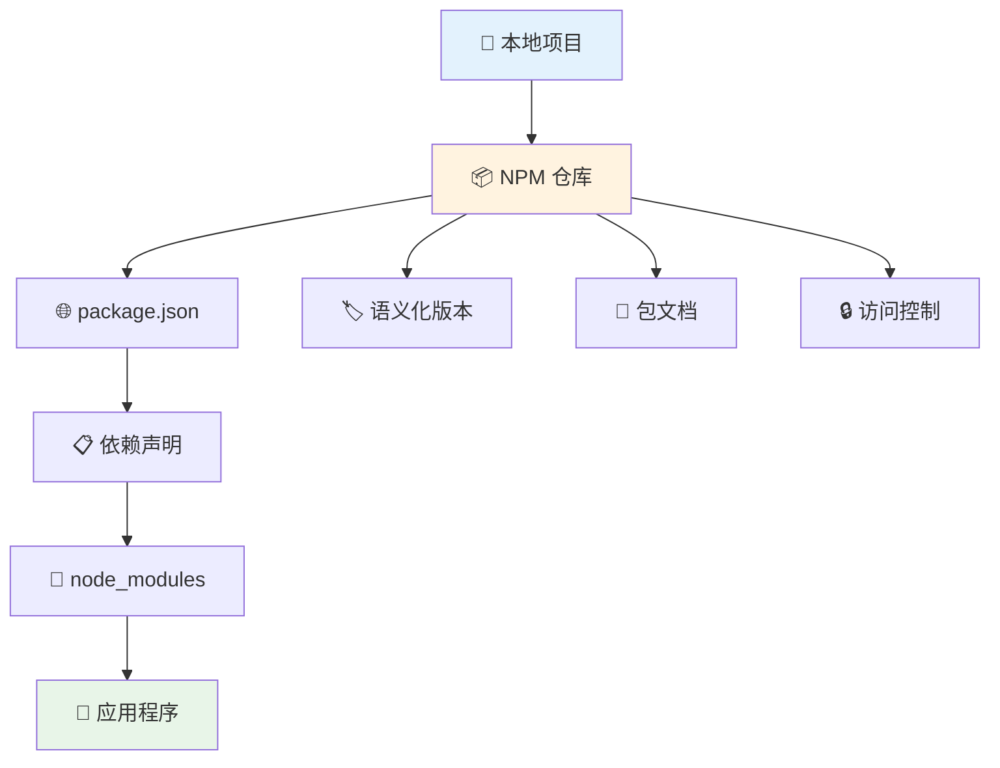

# 📦 NPM 包管理器完全指南

> 💡 **NPM**（Node Package Manager）是 Node.js 的默认包管理器，用于发布、安装和管理 JavaScript 包（modules），是现代前端开发不可或缺的工具。

## 📖 目录导航

- [🎯 NPM 简介](#🎯-npm-简介)
- [🔧 基础命令](#🔧-基础命令)
- [📤 发布和账号管理](#📤-发布和账号管理)
- [⚙️ 配置管理](#⚙️-配置管理)
- [🗂️ package.json 详解](#🗂️-packagejson-详解)
- [📚 依赖管理策略](#📚-依赖管理策略)
- [🚀 性能优化](#🚀-性能优化)
- [🔍 故障排除](#🔍-故障排除)
- [🌟 最佳实践](#🌟-最佳实践)

---

## 🎯 NPM 简介

NPM（Node Package Manager）是 Node.js 的默认包管理器，用于发布、安装和管理 JavaScript 包（modules）。其主要功能包括包管理和发布、依赖管理、版本控制以及脚本执行等。

### ✨ 核心功能

| 功能 | 描述 | 命令示例 | 使用场景 |
|------|------|----------|----------|
| **📦 包管理** | 安装、卸载、更新包 | `npm install` | 项目依赖管理 |
| **🔗 依赖管理** | 管理项目依赖关系 | `npm ls` | 查看依赖树 |
| **🔢 版本控制** | 管理包版本号 | `npm version` | 版本发布 |
| **⚡ 脚本执行** | 运行自定义脚本 | `npm run` | 自动化任务 |
| **📤 包发布** | 发布包到 NPM 仓库 | `npm publish` | 开源分享 |
| **🔍 包搜索** | 搜索 NPM 仓库 | `npm search` | 发现新包 |

### 🏗️ NPM 生态系统



---

## 🔧 基础命令

### 📋 项目管理

::: code-group

```bash [项目初始化]
# 初始化 Node.js 项目
npm init

# 快速初始化（使用默认配置）
npm init -y

# 使用特定模板初始化
npm init vue@latest my-project
npm init react-app my-app
```

```bash [版本管理]
# 查看和更改版本号 major.minor.patch V1.2.0
npm version [type]

# 具体版本操作
npm version patch    # 补丁版本 1.0.0 -> 1.0.1
npm version minor    # 次版本 1.0.0 -> 1.1.0
npm version major    # 主版本 1.0.0 -> 2.0.0

# 预发布版本
npm version prerelease    # 1.0.0 -> 1.0.1-0
npm version premajor      # 1.0.0 -> 2.0.0-0
```

:::

### 📦 包安装管理

::: code-group

```bash [基础安装]
# 安装依赖包（npm i 简写）
npm install [package-name]

# 安装选项说明
# -D：--save-dev（开发依赖）
# -S：--save（生产依赖，默认）
# -g：--global（全局安装）

# 示例
npm install vue                    # 安装生产依赖
npm install -D webpack            # 安装开发依赖
npm install -g @vue/cli           # 全局安装
```

```bash [指定版本]
# 安装指定版本
npm install vue@3.2.0             # 精确版本
npm install vue@latest            # 最新版本
npm install vue@next              # 预发布版本
npm install vue@beta              # Beta 版本

# 版本范围安装
npm install vue@">=3.0.0 <4.0.0"  # 范围版本
npm install vue@~3.2.0            # 补丁版本范围
npm install vue@^3.2.0            # 兼容版本范围
```

```bash [卸载管理]
# 卸载依赖包
npm uninstall [package-name]
npm uninstall -D webpack          # 卸载开发依赖
npm uninstall -g @vue/cli         # 卸载全局包

# 清理未使用的依赖
npm prune                          # 移除无关包
npm prune --production            # 只保留生产依赖
```

:::

### 🔍 查看和搜索

```bash
# 查看依赖包
npm ls                    # 当前项目依赖树
npm ls --depth=0         # 只显示顶级依赖
npm ls --global          # 全局安装的包
npm ls --global --depth=0 # 全局顶级包

# 查看过时的依赖包
npm outdated             # 检查过时包
npm outdated --global    # 检查全局过时包

# 搜索 NPM 仓库中的包
npm search [keyword]     # 搜索包
npm search --long vue    # 详细搜索结果

# 查看指定包的详细信息
npm view [package-name]           # 包的详细信息
npm view vue versions --json      # 查看所有版本
npm view vue version              # 查看最新版本
npm view vue dependencies         # 查看依赖
npm view vue repository.url       # 查看仓库地址

# 查看当前登录的 NPM 账号信息
npm whoami              # 当前用户
npm whoami --registry=http://localhost:4873 # 私有仓库用户
```

### 🔄 更新和维护

```bash
# 更新包
npm update [package-name]        # 更新指定包
npm update                       # 更新所有包
npm update --global              # 更新全局包

# 检查项目中过时的依赖包
npm outdated                     # 显示过时包
npm audit                        # 安全漏洞检查
npm audit fix                    # 自动修复漏洞

# 减少依赖项的冗余，优化项目的依赖树
npm dedupe                       # 去重依赖

# 重建所有的依赖包
npm rebuild                      # 重建所有包
npm rebuild [package-name]       # 重建指定包

# 检查并修复 NPM 环境
npm doctor                       # 环境诊断
npm cache clean --force          # 清理缓存
```

### 🚀 脚本执行

```bash
# 运行项目脚本
npm test [scriptName]           # 运行测试脚本
npm start [scriptName]          # 启动应用程序
npm stop [scriptName]           # 停止应用程序
npm restart [scriptName]        # 重启应用程序

# 运行自定义脚本
npm run [scriptName]            # 运行指定脚本
npm run                         # 查看所有可用脚本

# 脚本参数传递
npm run build -- --mode production
npm test -- --watch
```

::: tip 💡 脚本配置示例
```json
{
  "scripts": {
    "dev": "vite",
    "build": "vite build",
    "build:prod": "vite build --mode production",
    "preview": "vite preview",
    "lint": "eslint src --ext .js,.vue",
    "lint:fix": "eslint src --ext .js,.vue --fix",
    "test": "vitest",
    "test:ui": "vitest --ui",
    "clean": "rimraf dist node_modules",
    "reinstall": "npm run clean && npm install"
  }
}
```
:::

---

## 📤 发布和账号管理

### 🔑 账号操作

```bash
# 登录 NPM 账号
npm login                       # 登录到 npmjs.org
npm login --registry=http://localhost:4873  # 登录到私有仓库

# 登出 NPM
npm logout                      # 从 npmjs.org 登出
npm logout --registry=http://localhost:4873 # 从私有仓库登出

# 查看当前登录用户
npm whoami                      # 当前用户名
npm whoami --registry=http://localhost:4873 # 私有仓库用户
```

### 📦 包发布

```bash
# 发布前准备
npm pack                        # 打包：生成 .tgz 文件
npm publish --dry-run           # 模拟发布（不实际发布）

# 发布包到 NPM 仓库
npm publish                     # 发布到 npmjs.org
npm publish --access public     # 发布公开包
npm publish --access restricted # 发布私有包
npm publish --tag next          # 发布带标签的版本

# 发布到私有仓库
npm publish --registry=http://localhost:4873

# 撤销发布
npm unpublish <package-name>@<version>  # 删除特定版本
npm unpublish <package-name> --force    # 删除整个包（24小时内）
```

### 👥 权限管理

```bash
# 管理包的所有权
npm owner add <user> <package-name>      # 添加所有者
npm owner remove <user> <package-name>   # 移除所有者
npm owner list <package-name>            # 查看所有者

# 设置包的访问权限
npm access public <package-name>         # 设为公开
npm access restricted <package-name>     # 设为私有
npm access list <package-name>           # 列出访问权限

# 团队管理（需要付费账户）
npm team create <scope:team>             # 创建团队
npm team add <scope:team> <user>         # 添加团队成员
npm team rm <scope:team> <user>          # 移除团队成员
```

---

## ⚙️ 配置管理

### 🔧 配置命令

```bash
# 查看和设置配置项
npm config set [key] [value]           # 设置配置
npm config get [key]                    # 获取配置
npm config delete [key]                 # 删除配置
npm config list                         # 列出所有配置
npm config edit                         # 编辑配置文件

# 常用配置示例
npm config set registry https://registry.npmjs.org/    # 设置仓库源
npm config set proxy http://proxy.example.com:8080     # 设置代理
npm config set https-proxy http://proxy.example.com:8080
npm config set save-exact true                         # 精确版本保存
npm config set engine-strict true                      # 严格引擎检查
```

### 🌐 源管理

```bash
# 查看当前源
npm config get registry

# 设置常用源
npm config set registry https://registry.npmjs.org/          # 官方源
npm config set registry https://registry.npmmirror.com/      # 淘宝源
npm config set registry https://r.cnpmjs.org/               # cnpm源

# 临时使用不同源
npm install --registry https://registry.npmmirror.com/ vue

# 使用 nrm 管理源（推荐）
npm install -g nrm
nrm ls                    # 列出可用源
nrm use taobao           # 切换到淘宝源
nrm test                 # 测试源速度
```

### 📋 重要配置项

| 配置项 | 描述 | 默认值 | 示例 |
|--------|------|--------|------|
| **registry** | NPM 仓库地址 | `https://registry.npmjs.org/` | 官方/镜像源 |
| **save** | 自动保存到 dependencies | `true` | 安装时自动保存 |
| **save-dev** | 保存到 devDependencies | `false` | 开发依赖 |
| **save-exact** | 保存精确版本 | `false` | 不使用版本范围 |
| **engine-strict** | 严格引擎版本检查 | `false` | Node版本校验 |
| **fund** | 显示资助信息 | `true` | 包资助提示 |

---

## 🗂️ package.json 详解

### 📝 完整配置示例

```json
{
  "name": "my-awesome-package",
  "version": "1.0.0",
  "description": "一个很棒的 NPM 包",
  "main": "dist/index.js",
  "module": "dist/index.esm.js",
  "types": "dist/index.d.ts",
  "files": [
    "dist",
    "README.md",
    "LICENSE"
  ],
  "scripts": {
    "dev": "vite",
    "build": "vite build && npm run build:types",
    "build:types": "tsc --declaration --emitDeclarationOnly",
    "test": "vitest",
    "lint": "eslint src --ext .ts,.js",
    "prepublishOnly": "npm run build && npm run test"
  },
  "keywords": [
    "javascript",
    "typescript",
    "utility"
  ],
  "author": {
    "name": "Your Name",
    "email": "your.email@example.com",
    "url": "https://your-website.com"
  },
  "license": "MIT",
  "repository": {
    "type": "git",
    "url": "git+https://github.com/username/repo.git"
  },
  "bugs": {
    "url": "https://github.com/username/repo/issues"
  },
  "homepage": "https://github.com/username/repo#readme",
  "dependencies": {
    "lodash": "^4.17.21"
  },
  "devDependencies": {
    "@types/node": "^18.0.0",
    "typescript": "^4.9.0",
    "vite": "^4.0.0"
  },
  "peerDependencies": {
    "react": ">=16.8.0"
  },
  "engines": {
    "node": ">=14.0.0",
    "npm": ">=6.0.0"
  },
  "browserslist": [
    "> 1%",
    "last 2 versions",
    "not dead"
  ]
}
```

### 🔑 关键字段说明

| 字段 | 必需 | 描述 | 示例 |
|------|------|------|------|
| **name** | ✅ | 包名称 | `"my-package"` |
| **version** | ✅ | 版本号 | `"1.0.0"` |
| **description** | 📝 | 包描述 | `"一个工具包"` |
| **main** | 📝 | 入口文件 | `"dist/index.js"` |
| **module** | 📝 | ES模块入口 | `"dist/index.esm.js"` |
| **types** | 📝 | TypeScript声明文件 | `"dist/index.d.ts"` |
| **files** | 📝 | 发布文件 | `["dist", "README.md"]` |
| **scripts** | 📝 | 脚本命令 | `{"build": "..."}` |
| **dependencies** | 📝 | 生产依赖 | `{"lodash": "^4.17.21"}` |
| **devDependencies** | 📝 | 开发依赖 | `{"typescript": "^4.9.0"}` |

---

## 📚 依赖管理策略

### 🔢 版本号规范

NPM 使用语义化版本（SemVer）：`主版本.次版本.修订版本`

```bash
# 版本格式：MAJOR.MINOR.PATCH
1.2.3
│ │ │
│ │ └─ 修订版本：bug修复，向后兼容
│ └─── 次版本：新功能，向后兼容  
└───── 主版本：重大变更，可能不兼容

# 版本范围符号
^1.2.3  # 兼容版本范围：>=1.2.3 <2.0.0
~1.2.3  # 补丁版本范围：>=1.2.3 <1.3.0
1.2.3   # 精确版本：=1.2.3
>=1.2.3 # 大于等于：>=1.2.3
<2.0.0  # 小于：<2.0.0
```

### 📦 依赖类型

```json
{
  "dependencies": {
    "vue": "^3.0.0"          // 生产环境依赖
  },
  "devDependencies": {
    "typescript": "^4.9.0",   // 开发环境依赖
    "@types/node": "^18.0.0"
  },
  "peerDependencies": {
    "react": ">=16.8.0"       // 同伴依赖（宿主环境提供）
  },
  "optionalDependencies": {
    "fsevents": "^2.3.0"      // 可选依赖（安装失败不影响）
  },
  "bundledDependencies": [
    "renderized", "super-streams" // 打包依赖（与包一起分发）
  ]
}
```

### 🔒 版本锁定

```bash
# package-lock.json 的作用
- 锁定依赖的确切版本
- 确保团队使用相同版本
- 提高安装速度
- 记录依赖树结构

# 相关命令
npm ci                 # 基于 lock 文件的快速安装
npm install --frozen-lockfile  # 严格按照 lock 文件安装
npm shrinkwrap        # 发布时锁定版本
```

---

## 🚀 性能优化

### ⚡ 安装性能优化

```bash
# 使用 npm ci 替代 npm install（CI/CD环境）
npm ci                # 更快、更可靠、更严格

# 使用缓存
npm config set cache ~/.npm-cache
npm cache verify      # 验证缓存

# 并行安装
npm config set package-lock false  # 禁用 lock（不推荐）
npm install --prefer-offline       # 优先使用缓存

# 使用更快的包管理器
npm install -g yarn   # Yarn
npm install -g pnpm   # PNPM（推荐）
```

### 🗂️ node_modules 优化

```bash
# 分析包大小
npm ls --depth=0 --long              # 查看顶级依赖大小
npx bundle-analyzer node_modules     # 分析 node_modules

# 清理无用文件
npm prune                           # 移除无关包
npm dedupe                          # 去重依赖
npx npkill                          # 清理旧的 node_modules

# 使用 .npmignore
echo "tests/" >> .npmignore         # 排除测试文件
echo "*.test.js" >> .npmignore      # 排除测试文件
```

### 📊 bundle 分析

```bash
# 安装分析工具
npm install -g npm-check            # 检查过时依赖
npm install -g depcheck             # 检查未使用依赖
npm install -g bundlesize           # 检查包大小

# 使用工具
npm-check                           # 交互式检查
depcheck                           # 查找未使用依赖
bundlesize                         # 检查bundle大小
```

---

## 🔍 故障排除

### 🚨 常见问题

#### 1. 安装失败问题

```bash
# 网络问题
npm config set registry https://registry.npmmirror.com/
npm config set proxy http://proxy.example.com:8080

# 权限问题
sudo npm install -g package-name   # 使用 sudo（不推荐）
npm config set prefix ~/.npm       # 更改全局安装目录

# 缓存问题
npm cache clean --force            # 清理缓存
rm -rf node_modules package-lock.json
npm install                        # 重新安装
```

#### 2. 版本冲突

```bash
# 查看冲突
npm ls                             # 查看依赖树
npm outdated                       # 查看过时包

# 解决冲突
npm update                         # 更新包
npm install package@version       # 安装特定版本
npm dedupe                         # 去重依赖
```

#### 3. 发布问题

```bash
# 检查发布配置
npm config get registry            # 检查仓库地址
npm whoami                         # 检查登录状态
npm pack                          # 检查打包内容

# 发布调试
npm publish --dry-run             # 模拟发布
npm publish --verbose             # 详细输出
```

### 🔧 调试技巧

```bash
# 详细日志
npm install --verbose              # 详细安装日志
npm config set loglevel verbose    # 设置日志级别

# 环境诊断
npm doctor                         # 环境检查
npm config list                   # 查看所有配置
node -v && npm -v                 # 检查版本

# 网络调试
npm ping                          # 测试仓库连接
npm config get registry           # 检查仓库地址
```

---

## 🌟 最佳实践

### 📋 开发流程最佳实践

1. **🔒 版本管理**
   ```bash
   # 使用精确版本（重要依赖）
   npm install --save-exact react
   
   # 定期更新依赖
   npm outdated
   npm update
   
   # 锁定依赖版本
   npm shrinkwrap  # 发布前
   ```

2. **🛡️ 安全检查**
   ```bash
   # 定期安全审计
   npm audit
   npm audit fix
   
   # 使用安全工具
   npm install -g snyk
   snyk test
   ```

3. **⚡ 性能优化**
   ```bash
   # 使用更快的包管理器
   npm install -g pnpm
   pnpm install
   
   # 优化脚本
   npm run build:prod
   npm run analyze
   ```

### 🏗️ 项目结构建议

```
my-project/
├── 📁 src/                 # 源代码
├── 📁 dist/                # 构建输出
├── 📁 tests/               # 测试文件
├── 📁 docs/                # 文档
├── 📄 package.json         # 项目配置
├── 📄 package-lock.json    # 版本锁定
├── 📄 .npmrc              # NPM 配置
├── 📄 .npmignore          # 发布忽略
└── 📄 README.md           # 项目说明
```

### 📝 脚本命令规范

```json
{
  "scripts": {
    "dev": "启动开发服务器",
    "build": "构建生产版本",
    "build:dev": "构建开发版本",
    "test": "运行测试",
    "test:watch": "监听模式测试",
    "lint": "代码检查",
    "lint:fix": "自动修复代码",
    "clean": "清理构建文件",
    "docs": "生成文档",
    "release": "发布版本",
    "precommit": "提交前检查",
    "prepublishOnly": "发布前处理"
  }
}
```

### 🚀 发布流程规范

1. **📋 发布前检查**
   ```bash
   npm run test           # 运行测试
   npm run lint           # 代码检查
   npm run build          # 构建项目
   npm pack              # 检查打包内容
   ```

2. **🔢 版本管理**
   ```bash
   npm version patch      # 修复版本
   npm version minor      # 功能版本
   npm version major      # 重大版本
   ```

3. **📤 发布流程**
   ```bash
   npm publish --dry-run  # 模拟发布
   npm publish           # 正式发布
   git push --tags       # 推送标签
   ```

---

::: tip 🎯 总结

NPM 作为 Node.js 生态系统的核心工具，掌握其用法对前端开发至关重要：

### 🚀 核心优势
- **🌍 丰富生态**: 数百万个包的强大生态系统
- **📦 依赖管理**: 自动化的依赖解析和版本管理
- **⚡ 开发效率**: 丰富的脚本系统和工具链集成
- **🔒 版本控制**: 语义化版本和锁定机制
- **🤝 团队协作**: 统一的包管理和发布流程

### 💡 最佳实践要点
1. **合理使用版本范围**: 平衡兼容性和稳定性
2. **定期更新依赖**: 保持包的安全性和功能性
3. **使用安全审计**: 定期检查和修复安全漏洞
4. **优化包大小**: 减少不必要的依赖和文件
5. **规范发布流程**: 确保包的质量和可靠性

掌握 NPM 将大大提升你的开发效率和项目质量！🎉

:::

::: warning 📋 注意事项
- 生产环境使用 `npm ci` 而不是 `npm install`
- 定期更新依赖但要谨慎测试
- 注意依赖的安全漏洞和许可证问题
- 发布包时要遵循语义化版本规范
- 使用 `.npmignore` 控制发布内容
:::

---

> 🌟 **持续学习，持续进步** - NPM 生态系统在不断发展，保持关注最新特性和最佳实践！
