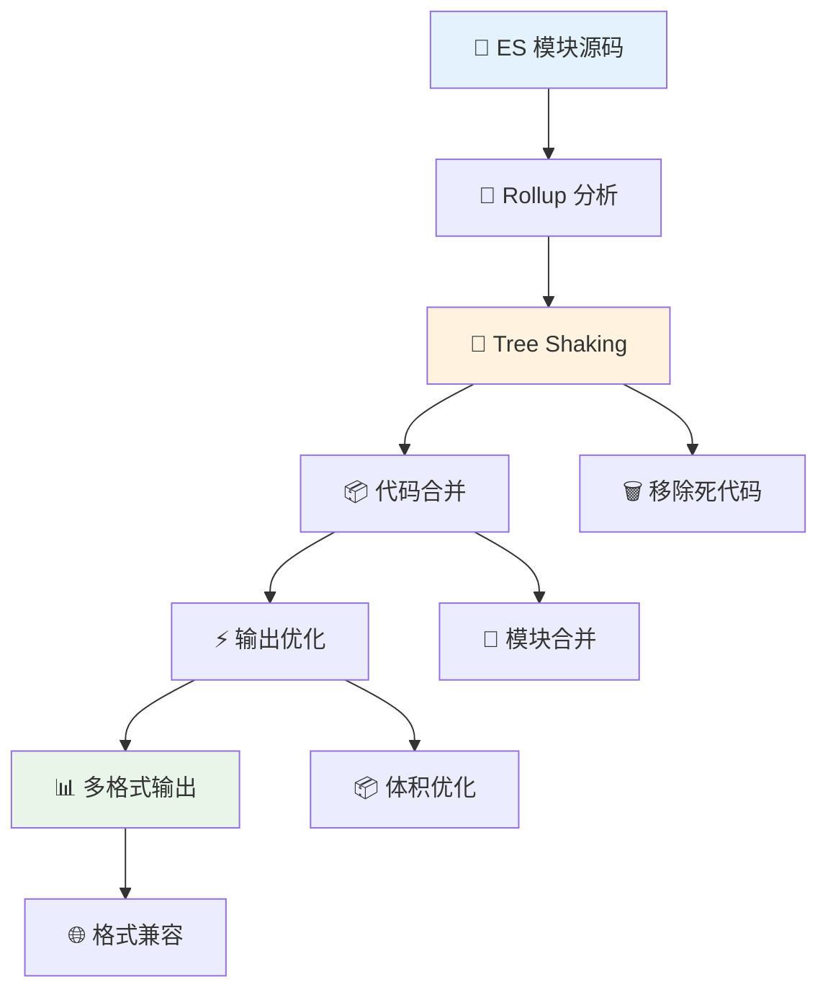
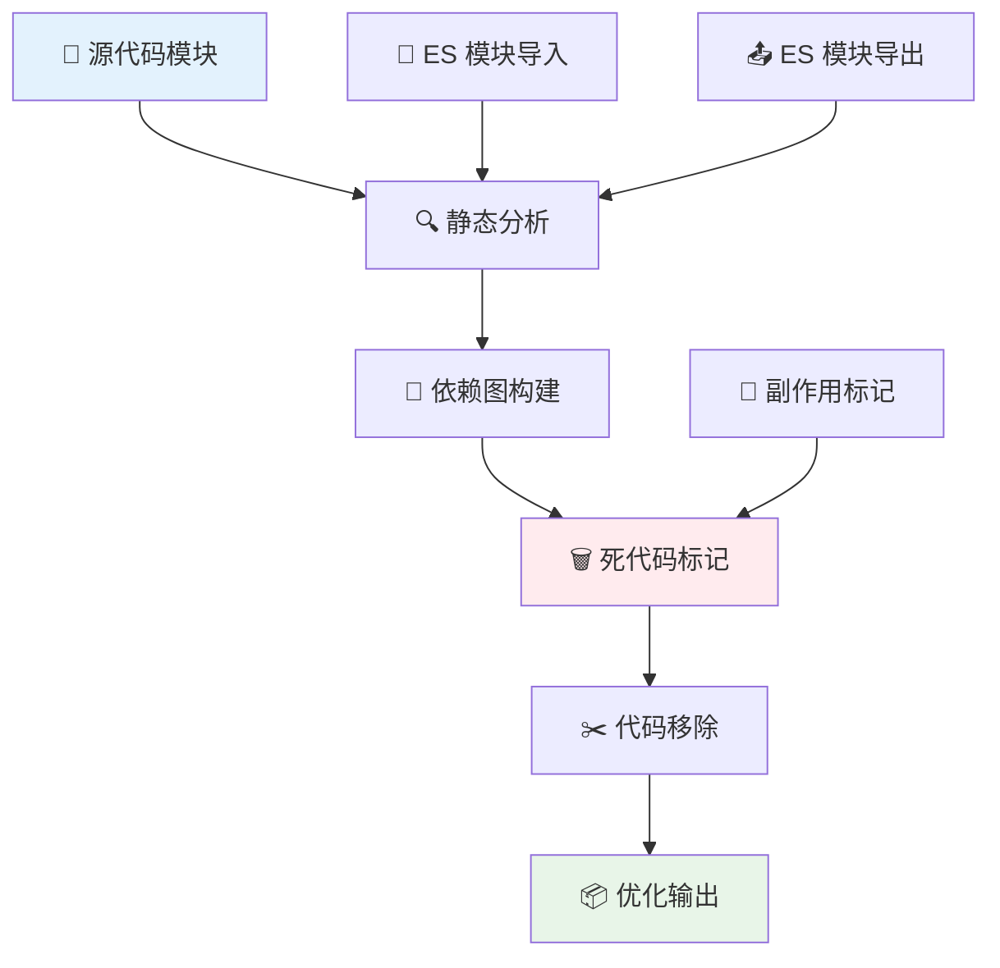

# 🎯 Rollup 模块打包工具完全指南

> 💡 **Rollup** 是一个用于 JavaScript 的模块打包工具，它将小的代码片段编译成更大、更复杂的代码，例如库或应用程序。它使用 JavaScript 的 ES6 版本中包含的新标准化代码模块格式，而不是以前的 CommonJS 和 AMD 等特殊解决方案。

## 📖 目录导航

- [📚 概述](#📚-概述)
- [🚀 快速开始](#🚀-快速开始)
- [⚙️ 配置文件详解](#⚙️-配置文件详解)
- [🔧 插件生态系统](#🔧-插件生态系统)
- [📦 输出格式](#📦-输出格式)
- [🌳 Tree Shaking 优化](#🌳-tree-shaking-优化)
- [🏗️ 构建策略](#🏗️-构建策略)
- [🔍 调试和优化](#🔍-调试和优化)
- [📈 性能对比](#📈-性能对比)
- [🌟 最佳实践](#🌟-最佳实践)

---

## 📚 概述

### ✨ 核心特性

| 特性 | 描述 | 优势 | 适用场景 |
|------|------|------|----------|
| **🌳 Tree Shaking** | 自动移除未使用的代码 | 更小的 bundle 体积 | 库开发、代码优化 |
| **📦 ES 模块优先** | 原生支持 ES 模块 | 更好的标准化支持 | 现代 JavaScript 项目 |
| **🎯 专注库构建** | 特别适合构建库 | 输出更干净的代码 | NPM 包、组件库 |
| **🔧 插件系统** | 丰富的插件生态 | 高度可扩展 | 复杂构建需求 |
| **📊 多格式输出** | 支持多种模块格式 | 兼容各种环境 | 跨平台发布 |
| **⚡ 高性能** | 快速的构建速度 | 提升开发效率 | 大型项目构建 |

### 🏗️ 技术优势



ES 模块允许你自由无缝地组合你最喜欢的库中最有用的个别函数。这在未来将在所有场景原生支持，但 Rollup 让你今天就可以开始这样做。

::: tip 💡 为什么选择 Rollup？
- **更好的 Tree Shaking**: 基于 ES 模块的静态分析
- **更小的输出**: 没有多余的运行时代码
- **标准化**: 遵循 ES 模块标准
- **库友好**: 特别适合构建可重用的库
:::

### 🔗 与其他工具的关系

Vite 目前打包生产环境代码，用的就是 Rollup。这证明了 Rollup 在现代前端工具链中的重要地位。

---

## 🚀 快速开始

### 📦 安装 Rollup

::: code-group

```bash [NPM]
# 全局安装
npm install --global rollup

# 项目内安装（推荐）
npm install --save-dev rollup
```

```bash [Yarn]
# 全局安装
yarn global add rollup

# 项目内安装（推荐）
yarn add -D rollup
```

```bash [PNPM]
# 全局安装
pnpm add -g rollup

# 项目内安装（推荐）
pnpm add -D rollup
```

:::

### 🛠️ 基础使用

安装完成后，通常会在 `package.json` 中添加一个单一的构建脚本，为所有贡献者提供方便的命令：

```json
{
  "scripts": {
    "build": "rollup --config rollup.config.js",
    "build:watch": "rollup --config rollup.config.js --watch",
    "build:prod": "rollup --config rollup.config.prod.js"
  }
}
```

### 🎯 命令行使用

```bash
# 基础打包
rollup src/main.js --output.file bundle.js --output.format cjs

# 使用配置文件
rollup --config

# 监听模式
rollup --config --watch

# 指定环境
rollup --config --environment NODE_ENV:production

# 多配置构建
rollup --config rollup.config.js --config rollup.config.prod.js
```

---

## ⚙️ 配置文件详解

### 📝 完整配置示例

创建 `rollup.config.js` 文件：

```javascript
// 对于 Node 18.20+，你可以使用导入断言
import pkg from './package.json' with { type: 'json' };
// ES Module 不能使用 __dirname。fileURLToPath 代替
import { fileURLToPath } from 'node:url';
import path from 'node:path';
import { globSync } from 'glob';
// 用于类型提示
import type { RollupOptions } from 'rollup';

// Rollup 不会自动从 node_modules 中寻找依赖项，需要这个插件的支持
import resolve from '@rollup/plugin-node-resolve';
// 支持 CommonJS 模块
import commonjs from '@rollup/plugin-commonjs';
// 使支持最新 js 语法
import babel from '@rollup/plugin-babel';
// 压缩 js 插件
import terser from '@rollup/plugin-terser';
// TypeScript 支持
import typescript from '@rollup/plugin-typescript';
// CSS 处理
import postcss from 'rollup-plugin-postcss';
// 复制文件
import copy from 'rollup-plugin-copy';
// 替换环境变量
import replace from '@rollup/plugin-replace';
// JSON 支持
import json from '@rollup/plugin-json';

export default (commandLineArgs) => {
	const inputBase = commandLineArgs.input || 'src/main.js';
	const isProduction = process.env.NODE_ENV === 'production';

	// 这会使 Rollup 忽略 CLI 参数
	delete commandLineArgs.input;
	
	return {
		// 🎯 核心输入选项
		
		// 指出哪些模块应该视为外部模块
		external: [
			// 文件路径
			fileURLToPath(new URL('src/some-file.js', import.meta.url)),
			// 包名
			'lodash',
			// 正则表达式
			/^lodash/,
			// 函数判断
			(id) => /^react/.test(id)
		],
		
		// 指定项目入口
		input: {
			// 单入口
			main: 'src/main.js',
			// 多入口：把每个匹配的文件作为入口
			...Object.fromEntries(
				globSync('src/modules/*.js').map(file => [
					// 这里将删除 `src/` 以及每个文件的扩展名
					// 因此，例如 src/modules/foo.js 会变成 modules/foo
					path.relative(
						'src',
						file.slice(0, file.length - path.extname(file).length)
					),
					// 这里可以将相对路径扩展为绝对路径
					fileURLToPath(new URL(file, import.meta.url))
				])
			)
		},
		
		// 🔧 引入插件
		plugins: [
			// JSON 支持
			json(),
			
			// 解析 node_modules 中的模块
			resolve({
				browser: true,
				preferBuiltins: false,
				extensions: ['.js', '.jsx', '.ts', '.tsx']
			}),
			
			// 支持 CommonJS
			commonjs({
				include: 'node_modules/**'
			}),
			
			// TypeScript 支持
			typescript({
				tsconfig: './tsconfig.json',
				declaration: true,
				declarationDir: 'dist/types'
			}),
			
			// Babel 转换
			babel({
				babelHelpers: 'bundled',
				exclude: 'node_modules/**',
				presets: [
					['@babel/preset-env', {
						targets: {
							browsers: ['last 2 versions', '> 1%']
						}
					}],
					'@babel/preset-react'
				],
				plugins: [
					'@babel/plugin-proposal-class-properties'
				]
			}),
			
			// CSS 处理
			postcss({
				extract: true,
				minimize: isProduction
			}),
			
			// 环境变量替换
			replace({
				preventAssignment: true,
				'process.env.NODE_ENV': JSON.stringify(process.env.NODE_ENV)
			}),
			
			// 复制文件
			copy({
				targets: [
					{ src: 'src/assets/**/*', dest: 'dist/assets' }
				]
			}),
			
			// 生产环境压缩
			isProduction && terser({
				format: {
					comments: false
				}
			})
		].filter(Boolean),
		
		// 📦 输出配置
		output: [
			// UMD 格式（浏览器和 Node.js）
			{
				file: pkg.browser,
				format: 'umd',
				name: 'MyLibrary',
				globals: {
					'react': 'React',
					'react-dom': 'ReactDOM'
				},
				sourcemap: !isProduction
			},
			// CommonJS 格式（Node.js）
			{
				file: pkg.main,
				format: 'cjs',
				exports: 'named',
				sourcemap: !isProduction
			},
			// ES 模块格式（现代环境）
			{
				file: pkg.module,
				format: 'esm',
				sourcemap: !isProduction
			}
		],
		
		// ⚠️ 警告处理
		onwarn(warning, warn) {
			// 跳过某些警告
			if (warning.code === 'THIS_IS_UNDEFINED') return;
			// 使用默认处理
			warn(warning);
		}
	};
};
```

### 🏭 多环境配置

::: code-group

```javascript [开发环境配置]
// rollup.config.dev.js
export default {
	input: 'src/main.js',
	output: {
		file: 'dist/bundle.dev.js',
		format: 'iife',
		sourcemap: true
	},
	plugins: [
		resolve(),
		commonjs(),
		// 开发环境不压缩
	],
	watch: {
		exclude: 'node_modules/**'
	}
};
```

```javascript [生产环境配置]
// rollup.config.prod.js
export default {
	input: 'src/main.js',
	output: {
		file: 'dist/bundle.min.js',
		format: 'iife',
		sourcemap: false
	},
	plugins: [
		resolve(),
		commonjs(),
		terser(), // 生产环境压缩
		bundleAnalyzer() // 分析包大小
	]
};
```

```javascript [库构建配置]
// rollup.config.lib.js
export default {
	input: 'src/index.js',
	external: ['react', 'react-dom'],
	output: [
		{
			file: 'dist/my-lib.cjs.js',
			format: 'cjs',
			exports: 'named'
		},
		{
			file: 'dist/my-lib.esm.js',
			format: 'esm'
		},
		{
			file: 'dist/my-lib.umd.js',
			format: 'umd',
			name: 'MyLib',
			globals: {
				react: 'React',
				'react-dom': 'ReactDOM'
			}
		}
	],
	plugins: [
		resolve(),
		commonjs(),
		typescript()
	]
};
```

:::

---

## 🔧 插件生态系统

### 📋 核心插件

| 插件 | 功能 | 使用场景 | 安装命令 |
|------|------|----------|----------|
| **@rollup/plugin-node-resolve** | 解析 Node.js 模块 | 基础必需 | `npm i -D @rollup/plugin-node-resolve` |
| **@rollup/plugin-commonjs** | CommonJS 支持 | 兼容旧模块 | `npm i -D @rollup/plugin-commonjs` |
| **@rollup/plugin-babel** | Babel 转换 | 现代语法支持 | `npm i -D @rollup/plugin-babel` |
| **@rollup/plugin-typescript** | TypeScript 支持 | TS 项目 | `npm i -D @rollup/plugin-typescript` |
| **@rollup/plugin-terser** | 代码压缩 | 生产构建 | `npm i -D @rollup/plugin-terser` |

### 🎨 样式处理插件

```javascript
// CSS 处理
import postcss from 'rollup-plugin-postcss';
import autoprefixer from 'autoprefixer';
import cssnano from 'cssnano';

export default {
	plugins: [
		postcss({
			// 提取 CSS 到单独文件
			extract: 'styles.css',
			// 压缩 CSS
			minimize: true,
			// PostCSS 插件
			plugins: [
				autoprefixer(),
				cssnano()
			],
			// CSS 模块支持
			modules: {
				generateScopedName: '[name]__[local]___[hash:base64:5]'
			}
		})
	]
};
```

### 🖼️ 资源处理插件

```javascript
// 图片和资源处理
import image from '@rollup/plugin-image';
import url from '@rollup/plugin-url';
import copy from 'rollup-plugin-copy';

export default {
	plugins: [
		// 图片内联或引用
		image(),
		
		// URL 资源处理
		url({
			limit: 10 * 1024, // 10KB 以下内联
			include: ['**/*.svg', '**/*.png', '**/*.jpg'],
			destDir: 'dist/assets'
		}),
		
		// 复制静态文件
		copy({
			targets: [
				{ src: 'src/assets/**/*', dest: 'dist/assets' },
				{ src: 'public/**/*', dest: 'dist' }
			]
		})
	]
};
```

### 🔧 实用工具插件

```javascript
// 实用工具插件
import replace from '@rollup/plugin-replace';
import alias from '@rollup/plugin-alias';
import { defineConfig } from 'rollup';

export default defineConfig({
	plugins: [
		// 路径别名
		alias({
			entries: [
				{ find: '@', replacement: path.resolve(__dirname, 'src') },
				{ find: '@components', replacement: path.resolve(__dirname, 'src/components') }
			]
		}),
		
		// 环境变量替换
		replace({
			preventAssignment: true,
			__buildDate__: () => JSON.stringify(new Date().toISOString()),
			__version__: JSON.stringify(process.env.npm_package_version)
		})
	]
});
```

---

## 📦 输出格式

### 🌐 支持的格式

| 格式 | 描述 | 使用场景 | 示例 |
|------|------|----------|------|
| **esm** | ES 模块格式 | 现代浏览器、Node.js | `import { fn } from 'lib'` |
| **cjs** | CommonJS 格式 | Node.js 环境 | `const { fn } = require('lib')` |
| **umd** | 通用模块定义 | 浏览器全局变量 | `<script src="lib.umd.js">` |
| **iife** | 立即执行函数 | 浏览器脚本 | `(function(){...})()` |
| **amd** | AMD 格式 | RequireJS | `define(['lib'], function(lib){})` |

### 📝 输出配置详解

```javascript
export default {
	input: 'src/index.js',
	output: [
		// ES 模块 - 用于现代打包器
		{
			file: 'dist/index.esm.js',
			format: 'esm',
			sourcemap: true
		},
		
		// CommonJS - 用于 Node.js
		{
			file: 'dist/index.cjs.js',
			format: 'cjs',
			exports: 'named', // 导出模式
			sourcemap: true
		},
		
		// UMD - 用于浏览器
		{
			file: 'dist/index.umd.js',
			format: 'umd',
			name: 'MyLibrary', // 全局变量名
			globals: {
				'react': 'React',
				'lodash': '_'
			},
			sourcemap: true
		},
		
		// IIFE - 用于直接在浏览器中使用
		{
			file: 'dist/index.browser.js',
			format: 'iife',
			name: 'MyLibrary'
		}
	]
};
```

### 🗂️ 动态输出

```javascript
const formats = ['esm', 'cjs', 'umd'];
const isProduction = process.env.NODE_ENV === 'production';

export default formats.map(format => ({
	input: 'src/index.js',
	output: {
		file: `dist/index.${format}.js`,
		format,
		...(format === 'umd' && { name: 'MyLibrary' }),
		sourcemap: !isProduction
	},
	plugins: [
		resolve(),
		commonjs(),
		isProduction && terser()
	].filter(Boolean)
}));
```

---

## 🌳 Tree Shaking 优化

### 🎯 Tree Shaking 原理



### 📝 Tree Shaking 最佳实践

```javascript
// ✅ 好的做法 - 支持 Tree Shaking
// utils.js
export function add(a, b) {
	return a + b;
}

export function subtract(a, b) {
	return a - b;
}

// main.js - 只会打包 add 函数
import { add } from './utils.js';

// ❌ 不好的做法 - 破坏 Tree Shaking
// utils.js
function add(a, b) {
	return a + b;
}

function subtract(a, b) {
	return a - b;
}

// 整个对象会被打包
export default { add, subtract };
```

### 🏷️ 副作用标记

在 `package.json` 中标记副作用：

```json
{
	"name": "my-library",
	"sideEffects": false, // 无副作用，可以安全地 Tree Shake
	// 或者指定有副作用的文件
	"sideEffects": [
		"./src/polyfills.js",
		"*.css"
	]
}
```

### 🔧 Rollup 配置优化

```javascript
export default {
	input: 'src/index.js',
	output: {
		file: 'dist/bundle.js',
		format: 'esm'
	},
	// 树摇配置
	treeshake: {
		// 更激进的树摇
		moduleSideEffects: false,
		// 保留函数参数
		propertyReadSideEffects: false,
		// 移除空的导入
		unknownGlobalSideEffects: false
	}
};
```

---

## 🏗️ 构建策略

### 📚 库构建策略

```javascript
// 库构建的完整配置
import { createRequire } from 'module';
const require = createRequire(import.meta.url);
const pkg = require('./package.json');

export default {
	input: 'src/index.js',
	
	// 外部依赖
	external: [
		...Object.keys(pkg.dependencies || {}),
		...Object.keys(pkg.peerDependencies || {})
	],
	
	output: [
		// CommonJS（适用于 Node.js）
		{
			file: pkg.main,
			format: 'cjs',
			exports: 'named'
		},
		// ES 模块（适用于打包器）
		{
			file: pkg.module,
			format: 'esm'
		},
		// UMD（适用于浏览器）
		{
			file: pkg.browser,
			format: 'umd',
			name: 'MyLibrary',
			globals: {
				react: 'React'
			}
		}
	],
	
	plugins: [
		resolve({
			browser: true
		}),
		commonjs(),
		typescript({
			declaration: true,
			declarationDir: 'dist/types'
		})
	]
};
```

### 🌐 应用构建策略

```javascript
// 应用构建策略
export default {
	input: 'src/main.js',
	
	output: {
		dir: 'dist',
		format: 'esm',
		// 代码分割
		manualChunks: {
			vendor: ['react', 'react-dom'],
			utils: ['lodash', 'date-fns']
		}
	},
	
	plugins: [
		resolve({
			browser: true
		}),
		commonjs(),
		// 代码分割插件
		dynamicImportVars(),
		// HTML 生成
		html({
			template: 'src/index.html'
		})
	]
};
```

### 🔄 监听模式配置

```javascript
export default {
	input: 'src/index.js',
	output: {
		file: 'dist/bundle.js',
		format: 'iife'
	},
	plugins: [
		resolve(),
		commonjs()
	],
	// 监听配置
	watch: {
		exclude: ['node_modules/**'],
		include: ['src/**'],
		clearScreen: false,
		// 监听选项
		chokidar: {
			usePolling: true
		}
	}
};
```

---

## 🔍 调试和优化

### 🐛 调试技巧

```javascript
export default {
	input: 'src/index.js',
	output: {
		file: 'dist/bundle.js',
		format: 'iife'
	},
	plugins: [
		resolve(),
		commonjs(),
		// 调试插件
		{
			name: 'debug-plugin',
			transform(code, id) {
				console.log(`处理文件: ${id}`);
				return null;
			}
		}
	],
	// 警告处理
	onwarn(warning, warn) {
		// 忽略特定警告
		if (warning.code === 'THIS_IS_UNDEFINED') return;
		
		// 自定义警告格式
		console.warn(`⚠️ ${warning.message}`);
		
		// 或使用默认处理
		warn(warning);
	}
};
```

### 📊 包大小分析

```javascript
import { rollupPluginBundleAnalyzer } from 'rollup-plugin-bundle-analyzer';
import visualizer from 'rollup-plugin-visualizer';

export default {
	input: 'src/index.js',
	output: {
		file: 'dist/bundle.js',
		format: 'iife'
	},
	plugins: [
		resolve(),
		commonjs(),
		// 包大小分析
		process.env.ANALYZE && rollupPluginBundleAnalyzer(),
		// 可视化分析
		visualizer({
			filename: 'dist/stats.html',
			open: true
		})
	].filter(Boolean)
};
```

---

## 📈 性能对比

### ⚡ Rollup vs Webpack vs Vite

| 指标 | Rollup | Webpack | Vite |
|------|--------|---------|------|
| **🏗️ 构建速度** | ⭐⭐⭐⭐ | ⭐⭐⭐ | ⭐⭐⭐⭐⭐ |
| **📦 Bundle 大小** | ⭐⭐⭐⭐⭐ | ⭐⭐⭐ | ⭐⭐⭐⭐ |
| **🌳 Tree Shaking** | ⭐⭐⭐⭐⭐ | ⭐⭐⭐⭐ | ⭐⭐⭐⭐⭐ |
| **📚 库构建** | ⭐⭐⭐⭐⭐ | ⭐⭐⭐ | ⭐⭐⭐⭐ |
| **🌐 应用构建** | ⭐⭐⭐ | ⭐⭐⭐⭐⭐ | ⭐⭐⭐⭐⭐ |
| **🔧 配置复杂度** | ⭐⭐⭐ | ⭐⭐ | ⭐⭐⭐⭐⭐ |

### 📊 性能基准测试

```bash
# 构建时间对比（示例项目）
Rollup:  2.3s  📦 125KB
Webpack: 4.1s  📦 156KB
Vite:    1.8s  📦 128KB (生产构建使用 Rollup)

# Tree Shaking 效果
原始大小: 450KB
Rollup:   125KB (72% 减少)
Webpack:  156KB (65% 减少)
```

---

## 🌟 最佳实践

### 📋 项目结构建议

```
my-library/
├── 📁 src/
│   ├── 📄 index.js          # 主入口
│   ├── 📁 components/       # 组件
│   ├── 📁 utils/           # 工具函数
│   └── 📁 types/           # TypeScript 类型
├── 📁 dist/                # 构建输出
├── 📁 examples/            # 使用示例
├── 📄 rollup.config.js     # Rollup 配置
├── 📄 package.json         # 包配置
└── 📄 tsconfig.json        # TypeScript 配置
```

### 🔧 配置最佳实践

1. **📦 多格式输出**
   ```javascript
   export default {
     input: 'src/index.js',
     output: [
       { file: 'dist/index.cjs.js', format: 'cjs' },
       { file: 'dist/index.esm.js', format: 'esm' },
       { file: 'dist/index.umd.js', format: 'umd', name: 'MyLib' }
     ]
   };
   ```

2. **🌳 优化 Tree Shaking**
   ```javascript
   // package.json
   {
     "sideEffects": false,
     "main": "dist/index.cjs.js",
     "module": "dist/index.esm.js",
     "browser": "dist/index.umd.js"
   }
   ```

3. **🔒 外部依赖处理**
   ```javascript
   const pkg = require('./package.json');
   
   export default {
     external: [
       ...Object.keys(pkg.dependencies || {}),
       ...Object.keys(pkg.peerDependencies || {})
     ]
   };
   ```

### 🚀 性能优化技巧

1. **⚡ 并行构建**
   ```javascript
   // 使用多个配置文件
   export default [
     // 开发版本
     createConfig({ format: 'esm', minify: false }),
     // 生产版本
     createConfig({ format: 'umd', minify: true })
   ];
   ```

2. **📊 代码分割**
   ```javascript
   export default {
     output: {
       dir: 'dist',
       format: 'esm',
       manualChunks: (id) => {
         if (id.includes('node_modules')) {
           return 'vendor';
         }
         if (id.includes('src/utils')) {
           return 'utils';
         }
       }
     }
   };
   ```

3. **🔧 插件优化**
   ```javascript
   const isProduction = process.env.NODE_ENV === 'production';
   
   export default {
     plugins: [
       resolve(),
       commonjs(),
       // 条件性插件
       isProduction && terser(),
       isProduction && bundleAnalyzer()
     ].filter(Boolean)
   };
   ```

### 📝 发布流程

1. **🔄 构建脚本**
   ```json
   {
     "scripts": {
       "build": "rollup -c",
       "build:watch": "rollup -c -w",
       "prepublishOnly": "npm run build",
       "release": "npm version patch && npm publish"
     }
   }
   ```

2. **📋 文件清单**
   ```json
   {
     "files": [
       "dist",
       "src",
       "README.md",
       "LICENSE"
     ]
   }
   ```

---

::: tip 🎯 总结

Rollup 作为现代 JavaScript 构建工具的佼佼者，在库开发领域具有独特优势：

### 🚀 核心优势
- **🌳 卓越的 Tree Shaking**: 基于 ES 模块的静态分析，输出最小化的代码
- **📦 多格式支持**: 一次构建，输出多种模块格式，兼容各种环境
- **⚡ 高性能**: 专注于打包优化，构建速度快，输出质量高
- **🎯 库友好**: 特别适合构建可重用的库和组件
- **🔧 简洁配置**: 相比 Webpack，配置更加直观和简洁

### 💡 选择建议
- **✅ 适合场景**: 库开发、组件库、工具包构建
- **⚠️ 考虑场景**: 复杂应用、需要强大生态的大型项目
- **🔄 混合使用**: 可以与 Vite 结合，开发用 Vite，构建用 Rollup

掌握 Rollup 将让你的库开发更加专业和高效！🎉

:::

::: warning 📋 注意事项
- Tree Shaking 需要 ES 模块语法支持
- 某些插件可能与最新版本不兼容
- 外部依赖配置需要谨慎处理
- 大型应用建议考虑 Webpack 或 Vite
:::

---

> 🌟 **专业构建，精致输出** - Rollup 让你的代码构建更加精确和高效！
