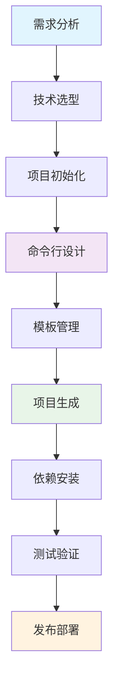
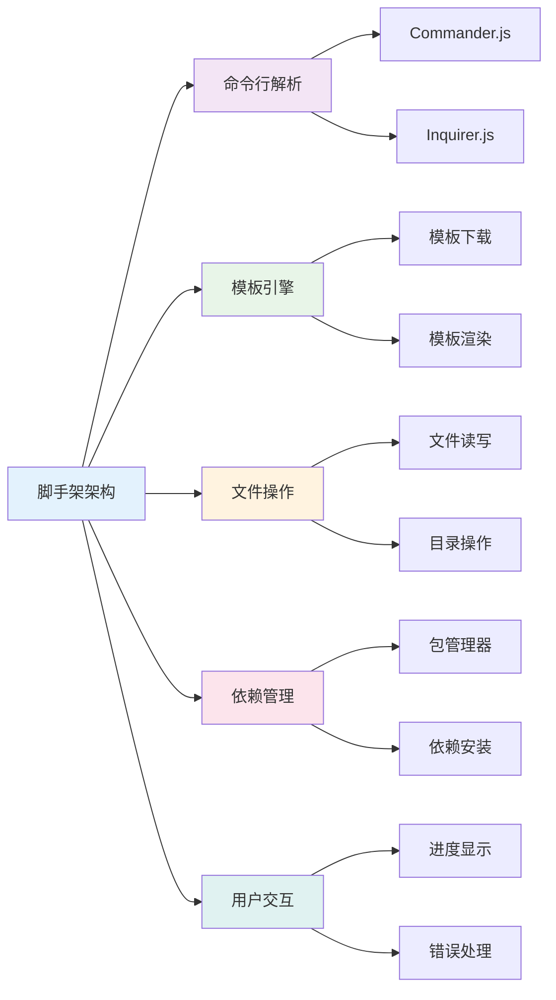

# 🏗️ 前端脚手架开发完全指南

> 脚手架是快速搭建项目的重要工具，通过系统化的开发流程，可以构建出功能完善、易于维护的前端脚手架工具。

## 📚 目录导航

::: details 🔍 点击展开完整目录
- [🎯 脚手架开发概述](#脚手架开发概述)
- [🏗️ 技术架构](#技术架构)  
- [📦 依赖安装](#依赖安装)
- [⚙️ 核心模块详解](#核心模块详解)
- [🔧 命令行设计](#命令行设计)
- [📋 模板管理](#模板管理)
- [🚀 项目生成](#项目生成)
- [🛠️ 高级功能](#高级功能)
- [📊 最佳实践](#最佳实践)
- [🔍 故障排查](#故障排查)
- [📖 参考资源](#参考资源)
:::

## 🎯 脚手架开发概述

### 📋 脚手架开发流程



### 🏗️ 技术架构



## 📦 依赖安装

### 🔧 核心依赖

脚手架开发需要以下核心模块：

| 模块 | 功能 | 用途 |
|------|------|------|
| **commander** | 注册命令 | 🎮 构建命令行界面 |
| **inquirer** | 交互式问答 | 💬 用户输入收集 |
| **download-git-repo** | 获取远程 git 仓库资源 | 📥 下载项目模板 |
| **child_process** | Node.js 子进程模块 | ⚙️ 执行 npm install 等命令 |
| **ora** | 控制台显示 loading | ⏳ 提供加载动画效果 |
| **chalk** | 美化控制台输入 | 🎨 显示不同颜色文本 |
| **semver** | 判断版本是否符合预期 | 📊 版本号管理 |
| **fs-extra** | 文件系统操作 | 📁 增强文件操作 |

### 🔧 安装命令

::: code-group
```bash [npm]
# 安装核心依赖
npm install --save \
  commander \
  inquirer \
  download-git-repo \
  ora \
  chalk \
  semver \
  fs-extra \
  mustache
```

```bash [yarn]
# 安装核心依赖
yarn add \
  commander \
  inquirer \
  download-git-repo \
  ora \
  chalk \
  semver \
  fs-extra \
  mustache
```

```bash [pnpm]
# 安装核心依赖
pnpm add \
  commander \
  inquirer \
  download-git-repo \
  ora \
  chalk \
  semver \
  fs-extra \
  mustache
```
:::

## ⚙️ 核心模块详解

### 🎮 Commander.js 命令行解析

```javascript
const { Command } = require('commander');
const program = new Command();

// 基础配置
program
  .name('my-cli')
  .description('我的前端脚手架工具')
  .version('1.0.0');

// 注册命令
program
  .command('create <project-name>')
  .description('创建新项目')
  .option('-t, --template <template>', '指定模板')
  .option('-f, --force', '强制覆盖现有目录')
  .action((projectName, options) => {
    require('./commands/create')(projectName, options);
  });

// 解析命令行参数
program.parse(process.argv);
```

### 💬 Inquirer.js 交互式问答

```javascript
const inquirer = require('inquirer');

async function getUserInput() {
  const answers = await inquirer.prompt([
    {
      type: 'input',
      name: 'projectName',
      message: '请输入项目名称:',
      validate: (input) => {
        if (!input.trim()) {
          return '项目名称不能为空';
        }
        return true;
      }
    },
    {
      type: 'list',
      name: 'template',
      message: '请选择项目模板:',
      choices: [
        { name: 'Vue 3 + TypeScript', value: 'vue3-ts' },
        { name: 'React + TypeScript', value: 'react-ts' },
        { name: 'Node.js API', value: 'node-api' }
      ]
    },
    {
      type: 'checkbox',
      name: 'features',
      message: '请选择需要的功能:',
      choices: [
        { name: 'ESLint', value: 'eslint' },
        { name: 'Prettier', value: 'prettier' },
        { name: 'Jest', value: 'jest' },
        { name: 'Husky', value: 'husky' }
      ]
    }
  ]);
  
  return answers;
}
```

### 📥 模板下载

```javascript
const download = require('download-git-repo');
const ora = require('ora');
const chalk = require('chalk');

async function downloadTemplate(template, destination) {
  const spinner = ora('正在下载模板...').start();
  
  try {
    await new Promise((resolve, reject) => {
      // GitHub 模板
      if (template.startsWith('github:')) {
        download(
          `direct:https://github.com/${template.replace('github:', '')}.git`,
          destination,
          { clone: true },
          (err) => {
            if (err) reject(err);
            else resolve();
          }
        );
      }
      // Gitee 模板
      else if (template.startsWith('gitee:')) {
        download(
          `direct:https://gitee.com/${template.replace('gitee:', '')}.git`,
          destination,
          { clone: true },
          (err) => {
            if (err) reject(err);
            else resolve();
          }
        );
      }
      else {
        reject(new Error('不支持的模板类型'));
      }
    });
    
    spinner.succeed(chalk.green('模板下载成功'));
  } catch (error) {
    spinner.fail(chalk.red('模板下载失败'));
    throw error;
  }
}
```

### ⚠️ download-git-repo 踩坑指南

::: warning 🚨 常见错误及解决方案

**1. Error: 'git clone' failed with status 128**

**解决方案**: 地址要保证使用的是 HTTPS 模式，地址加前缀：
```javascript
// 正确的写法
download(
  'direct:https://github.com/username/repo.git',
  destination,
  { clone: true },
  callback
);
```

**2. Error: 'git checkout' failed with status 1**

**解决方案**: 保证你拥有 master 分支（不指定分支的情况）。如果只有 main 分支，需要指定分支：
```javascript
// 指定分支
download(
  'direct:https://github.com/username/repo.git#main',
  destination,
  { clone: true },
  callback
);
```

**3. 国内码云访问问题**

- **码云**: 需要开启 `clone: true`，否则 403 错误
- **GitHub**: 需要 `clone: false`，否则 118 错误

```javascript
// 码云配置
download(
  'direct:https://gitee.com/username/repo.git#master',
  destination,
  { clone: true },
  callback
);

// GitHub 配置
download(
  'github:username/repo',
  destination,
  { clone: false },
  callback
);
```
:::

## 🔧 命令行设计

### 📋 注册一级命令

把注册命令的文件`/bin/index.js`，在 package.json 文件里应 bin 属性里注册：

```json
{
  "name": "my-cli",
  "version": "1.0.1",
  "description": "我的前端脚手架工具",
  "main": "./bin/index.js",
  "bin": {
    "my-cli": "./bin/index.js"
  },
  "scripts": {
    "test": "jest"
  },
  "keywords": ["cli", "scaffold", "generator"],
  "author": "Your Name",
  "license": "MIT"
}
```

### 🎮 注册二级命令

```javascript
#!/usr/bin/env node

const { Command } = require('commander');
const chalk = require('chalk');
const semver = require('semver');
const requiredVersion = require('../package.json').engines.node;

// 检查 Node.js 版本
function checkNodeVersion() {
  if (!semver.satisfies(process.version, requiredVersion)) {
    console.log(chalk.red(
      `您的 Node.js 版本是 ${process.version}, 但是此工具需要 ${requiredVersion}.\n` +
      '请升级您的 Node.js 版本.'
    ));
    process.exit(1);
  }
}

// 主程序
function main() {
  checkNodeVersion();
  
  const program = new Command();
  
  program
    .name('my-cli')
    .description('我的前端脚手架工具')
    .version(require('../package.json').version)
    .usage('<command> [options]');

  // 创建项目命令
  program
    .command('create <project-name>')
    .description('创建新项目')
    .option('-t, --template <template>', '指定模板', 'vue3-ts')
    .option('-f, --force', '强制覆盖现有目录')
    .option('--skip-install', '跳过依赖安装')
    .action(async (projectName, options) => {
      const createCommand = require('../commands/create');
      await createCommand(projectName, options);
    });

  // 初始化命令
  program
    .command('init')
    .description('在当前目录初始化项目')
    .option('-t, --template <template>', '指定模板', 'vue3-ts')
    .action(async (options) => {
      const initCommand = require('../commands/init');
      await initCommand(options);
    });

  // 列出模板命令
  program
    .command('list')
    .alias('ls')
    .description('列出所有可用模板')
    .action(() => {
      const listCommand = require('../commands/list');
      listCommand();
    });

  // 添加模板命令
  program
    .command('add <template>')
    .description('添加新模板')
    .option('-u, --url <url>', '模板仓库地址')
    .option('-b, --branch <branch>', '指定分支', 'main')
    .action(async (template, options) => {
      const addCommand = require('../commands/add');
      await addCommand(template, options);
    });

  // 删除模板命令
program
    .command('remove <template>')
    .alias('rm')
    .description('删除模板')
    .action(async (template) => {
      const removeCommand = require('../commands/remove');
      await removeCommand(template);
    });

  // 帮助信息
  program.on('--help', () => {
    console.log();
    console.log('Examples:');
    console.log('  $ my-cli create my-project');
    console.log('  $ my-cli create my-project --template vue3-ts');
    console.log('  $ my-cli init --template react-ts');
    console.log('  $ my-cli list');
    console.log('  $ my-cli add my-template --url https://github.com/user/repo.git');
  });

  // 解析命令行参数
  program.parse(process.argv);

  // 如果没有参数，显示帮助
  if (!process.argv.slice(2).length) {
    program.outputHelp();
  }
}

// 错误处理
process.on('unhandledRejection', (err) => {
  console.error(chalk.red('未处理的Promise拒绝:'));
  console.error(err);
  process.exit(1);
});

process.on('uncaughtException', (err) => {
  console.error(chalk.red('未捕获的异常:'));
  console.error(err);
  process.exit(1);
});

main();
```

## 📋 模板管理

### 🗂️ 模板配置

```javascript
// config/templates.js
module.exports = {
  'vue3-ts': {
    name: 'Vue 3 + TypeScript',
    description: 'Vue 3 + TypeScript + Vite 模板',
    url: 'github:my-templates/vue3-typescript-template',
    branch: 'main',
    offline: false
  },
  'react-ts': {
    name: 'React + TypeScript',
    description: 'React + TypeScript + Vite 模板',
    url: 'github:my-templates/react-typescript-template',
    branch: 'main',
    offline: false
  },
  'node-api': {
    name: 'Node.js API',
    description: 'Node.js + Express + TypeScript API 模板',
    url: 'github:my-templates/node-api-template',
    branch: 'main',
    offline: false
  }
};
```

### 📝 模板列表命令

```javascript
// commands/list.js
const chalk = require('chalk');
const templates = require('../config/templates');

function listTemplates() {
  console.log(chalk.bold.blue('\n📋 可用模板列表:\n'));
  
  Object.keys(templates).forEach(key => {
    const template = templates[key];
    console.log(`  ${chalk.bold.cyan(key)}`);
    console.log(`    ${chalk.gray('名称:')} ${template.name}`);
    console.log(`    ${chalk.gray('描述:')} ${template.description}`);
    console.log(`    ${chalk.gray('地址:')} ${template.url}`);
    console.log(`    ${chalk.gray('分支:')} ${template.branch}`);
    console.log('');
  });
}

module.exports = listTemplates;
```

## 🚀 项目生成

### 🔧 核心创建命令

```javascript
// commands/create.js
const path = require('path');
const fs = require('fs-extra');
const chalk = require('chalk');
const ora = require('ora');
const inquirer = require('inquirer');
const download = require('download-git-repo');
const { exec } = require('child_process');
const { promisify } = require('util');

const execAsync = promisify(exec);
const templates = require('../config/templates');

async function createProject(projectName, options) {
  const targetDir = path.resolve(process.cwd(), projectName);
  
  // 检查目录是否存在
  if (fs.existsSync(targetDir)) {
    if (options.force) {
      await fs.remove(targetDir);
    } else {
      const { overwrite } = await inquirer.prompt([
        {
          type: 'confirm',
          name: 'overwrite',
          message: `目录 ${projectName} 已存在，是否覆盖?`,
          default: false
        }
      ]);
      
      if (!overwrite) {
        console.log(chalk.yellow('取消创建'));
        return;
      }
      
      await fs.remove(targetDir);
    }
  }
  
  // 获取模板配置
  let template = options.template;
  if (!templates[template]) {
    const { selectedTemplate } = await inquirer.prompt([
      {
        type: 'list',
        name: 'selectedTemplate',
        message: '请选择项目模板:',
        choices: Object.keys(templates).map(key => ({
          name: `${templates[key].name} - ${templates[key].description}`,
          value: key
        }))
      }
    ]);
    template = selectedTemplate;
  }
  
  const templateConfig = templates[template];
  
  // 收集项目信息
  const projectInfo = await collectProjectInfo(projectName, templateConfig);
  
  // 下载模板
  await downloadTemplate(templateConfig, targetDir);
  
  // 渲染模板
  await renderTemplate(targetDir, projectInfo);
  
  // 安装依赖
  if (!options.skipInstall) {
    await installDependencies(targetDir);
  }
  
  // 初始化 Git
  await initGit(targetDir);
  
  console.log(chalk.green(`\n🎉 项目 ${projectName} 创建成功!\n`));
  console.log(chalk.cyan('下一步:'));
  console.log(chalk.cyan(`  cd ${projectName}`));
  if (options.skipInstall) {
    console.log(chalk.cyan(`  npm install`));
  }
  console.log(chalk.cyan(`  npm run dev`));
}

async function collectProjectInfo(projectName, templateConfig) {
  const questions = [
    {
      type: 'input',
      name: 'author',
      message: '作者:',
      default: 'Your Name'
    },
    {
      type: 'input',
      name: 'description',
      message: '项目描述:',
      default: `${templateConfig.name} project`
    },
    {
      type: 'input',
      name: 'version',
      message: '版本号:',
      default: '1.0.0'
    }
  ];
  
  // 根据模板动态添加问题
  if (templateConfig.name.includes('Vue')) {
    questions.push({
      type: 'confirm',
      name: 'useRouter',
      message: '是否使用 Vue Router?',
      default: true
    });
    
    questions.push({
      type: 'confirm',
      name: 'usePinia',
      message: '是否使用 Pinia 状态管理?',
      default: true
    });
  }
  
  const answers = await inquirer.prompt(questions);
  
  return {
    name: projectName,
    ...answers
  };
}

async function downloadTemplate(templateConfig, destination) {
  const spinner = ora('正在下载模板...').start();
  
  try {
    await new Promise((resolve, reject) => {
      const repo = templateConfig.url.replace('github:', '');
      const url = `direct:https://github.com/${repo}.git#${templateConfig.branch}`;
      
      download(url, destination, { clone: true }, (err) => {
      if (err) {
          reject(err);
        } else {
          resolve();
        }
      });
    });
    
    spinner.succeed(chalk.green('模板下载成功'));
  } catch (error) {
    spinner.fail(chalk.red('模板下载失败'));
    throw error;
  }
}

async function renderTemplate(targetDir, projectInfo) {
  const spinner = ora('正在渲染模板...').start();
  
  try {
    // 读取并更新 package.json
    const packageJsonPath = path.join(targetDir, 'package.json');
    if (fs.existsSync(packageJsonPath)) {
      const packageJson = await fs.readJson(packageJsonPath);
      
      packageJson.name = projectInfo.name;
      packageJson.version = projectInfo.version;
      packageJson.description = projectInfo.description;
      packageJson.author = projectInfo.author;
      
      await fs.writeJson(packageJsonPath, packageJson, { spaces: 2 });
    }
    
    // 处理模板变量
    const filesToProcess = [
      'README.md',
      'src/main.ts',
      'src/App.vue',
      'index.html'
    ];
    
    for (const file of filesToProcess) {
      const filePath = path.join(targetDir, file);
      if (fs.existsSync(filePath)) {
        let content = await fs.readFile(filePath, 'utf-8');
        
        // 替换模板变量
        content = content.replace(/\{\{name\}\}/g, projectInfo.name);
        content = content.replace(/\{\{description\}\}/g, projectInfo.description);
        content = content.replace(/\{\{author\}\}/g, projectInfo.author);
        
        await fs.writeFile(filePath, content);
      }
    }
    
    // 删除 .git 目录
    const gitDir = path.join(targetDir, '.git');
    if (fs.existsSync(gitDir)) {
      await fs.remove(gitDir);
    }
    
    spinner.succeed(chalk.green('模板渲染成功'));
  } catch (error) {
    spinner.fail(chalk.red('模板渲染失败'));
    throw error;
  }
}

async function installDependencies(targetDir) {
  const spinner = ora('正在安装依赖...').start();
  
  try {
    const { stdout } = await execAsync('npm install', {
      cwd: targetDir,
      stdio: 'pipe'
    });
    
    spinner.succeed(chalk.green('依赖安装成功'));
  } catch (error) {
    spinner.fail(chalk.red('依赖安装失败'));
    console.log(chalk.yellow('您可以手动运行 npm install 来安装依赖'));
  }
}

async function initGit(targetDir) {
  const spinner = ora('正在初始化 Git...').start();
  
  try {
    await execAsync('git init', { cwd: targetDir });
    await execAsync('git add .', { cwd: targetDir });
    await execAsync('git commit -m "feat: initial commit"', { cwd: targetDir });
    
    spinner.succeed(chalk.green('Git 初始化成功'));
  } catch (error) {
    spinner.fail(chalk.red('Git 初始化失败'));
    console.log(chalk.yellow('您可以手动初始化 Git 仓库'));
  }
}

module.exports = createProject;
```

## 🛠️ 高级功能

### 🔧 插件系统

```javascript
// lib/PluginManager.js
class PluginManager {
  constructor() {
    this.plugins = [];
  }
  
  addPlugin(plugin) {
    this.plugins.push(plugin);
  }
  
  async runHook(hookName, context) {
    for (const plugin of this.plugins) {
      if (plugin[hookName]) {
        await plugin[hookName](context);
      }
    }
  }
}

// 插件示例
class ESLintPlugin {
  async beforeCreate(context) {
    console.log('准备配置 ESLint...');
  }
  
  async afterCreate(context) {
    // 添加 ESLint 配置
    const eslintConfig = {
      extends: ['@vue/typescript/recommended'],
      rules: {
        'no-console': 'warn'
      }
    };
    
    await fs.writeJson(
      path.join(context.targetDir, '.eslintrc.json'),
      eslintConfig,
      { spaces: 2 }
    );
  }
}

module.exports = { PluginManager, ESLintPlugin };
```

### 📊 进度追踪

```javascript
// lib/ProgressTracker.js
const chalk = require('chalk');

class ProgressTracker {
  constructor(steps) {
    this.steps = steps;
    this.current = 0;
  }
  
  start() {
    console.log(chalk.blue(`\n🚀 开始执行 ${this.steps.length} 个步骤...\n`));
  }
  
  nextStep(message) {
    this.current++;
    console.log(chalk.cyan(`[${this.current}/${this.steps.length}] ${message}`));
  }
  
  complete() {
    console.log(chalk.green(`\n✅ 所有步骤完成！`));
  }
  
  error(message) {
    console.log(chalk.red(`\n❌ 错误: ${message}`));
  }
}

module.exports = ProgressTracker;
```

### 🔄 模板缓存

```javascript
// lib/TemplateCache.js
const path = require('path');
const fs = require('fs-extra');
const os = require('os');

class TemplateCache {
  constructor() {
    this.cacheDir = path.join(os.homedir(), '.my-cli', 'cache');
    this.ensureCacheDir();
  }
  
  ensureCacheDir() {
    if (!fs.existsSync(this.cacheDir)) {
      fs.mkdirpSync(this.cacheDir);
    }
  }
  
  getCachePath(template) {
    return path.join(this.cacheDir, template);
  }
  
  exists(template) {
    return fs.existsSync(this.getCachePath(template));
  }
  
  async get(template) {
    const cachePath = this.getCachePath(template);
    if (this.exists(template)) {
      return cachePath;
    }
    return null;
  }
  
  async set(template, sourcePath) {
    const cachePath = this.getCachePath(template);
    await fs.copy(sourcePath, cachePath);
    return cachePath;
  }
  
  async clear(template) {
    const cachePath = this.getCachePath(template);
    if (this.exists(template)) {
      await fs.remove(cachePath);
    }
  }
  
  async clearAll() {
    await fs.remove(this.cacheDir);
    this.ensureCacheDir();
  }
}

module.exports = TemplateCache;
```

## 📊 最佳实践

### 🏗️ 项目结构设计

```
my-cli/
├── bin/
│   └── index.js          # 入口文件
├── commands/
│   ├── create.js         # 创建命令
│   ├── init.js           # 初始化命令
│   ├── list.js           # 列表命令
│   └── add.js            # 添加模板命令
├── config/
│   ├── templates.js      # 模板配置
│   └── index.js          # 全局配置
├── lib/
│   ├── PluginManager.js  # 插件管理
│   ├── TemplateCache.js  # 模板缓存
│   └── utils.js          # 工具函数
├── templates/
│   ├── vue3-ts/          # Vue 3 TypeScript 模板
│   ├── react-ts/         # React TypeScript 模板
│   └── node-api/         # Node.js API 模板
├── tests/
│   └── *.test.js         # 测试文件
├── package.json
└── README.md
```

### 📋 错误处理

```javascript
// lib/ErrorHandler.js
const chalk = require('chalk');

class ErrorHandler {
  static handle(error) {
    console.error(chalk.red('\n❌ 发生错误:'));
    
    if (error.code === 'ENOENT') {
      console.error(chalk.red('文件或目录不存在'));
    } else if (error.code === 'EACCES') {
      console.error(chalk.red('权限不足'));
    } else if (error.code === 'EEXIST') {
      console.error(chalk.red('文件或目录已存在'));
    } else {
      console.error(chalk.red(error.message));
    }
    
    if (process.env.NODE_ENV === 'development') {
      console.error(chalk.gray('\n调试信息:'));
      console.error(error.stack);
    }
    
    process.exit(1);
  }
}

module.exports = ErrorHandler;
```

### 🔧 配置管理

```javascript
// config/index.js
const path = require('path');
const fs = require('fs-extra');
const os = require('os');

class Config {
  constructor() {
    this.configPath = path.join(os.homedir(), '.my-cli', 'config.json');
    this.load();
  }
  
  load() {
    if (fs.existsSync(this.configPath)) {
      this.data = fs.readJsonSync(this.configPath);
    } else {
      this.data = {
        templates: {},
        registry: 'https://registry.npmjs.org/',
        cache: true
      };
      this.save();
    }
  }
  
  save() {
    fs.ensureDirSync(path.dirname(this.configPath));
    fs.writeJsonSync(this.configPath, this.data, { spaces: 2 });
  }
  
  get(key) {
    return this.data[key];
  }
  
  set(key, value) {
    this.data[key] = value;
    this.save();
  }
}

module.exports = new Config();
```

## 🔍 故障排查

### 🛠️ 常见问题

::: warning ⚠️ 常见问题解决方案

1. **命令无法识别**
   ```bash
   # 重新链接
   npm link
   
   # 或者全局安装
   npm install -g .
   ```

2. **模板下载失败**
   ```javascript
   // 检查网络连接
   // 检查模板地址是否正确
   // 尝试使用不同的下载方式
   ```

3. **依赖安装失败**
   ```bash
   # 清理缓存
   npm cache clean --force
   
   # 切换镜像源
   npm config set registry https://registry.npmmirror.com/
   ```

4. **权限问题**
   ```bash
   # Linux/Mac
   sudo chown -R $(whoami) ~/.npm
   
   # Windows
   # 以管理员身份运行命令提示符
   ```
:::

### 📊 日志记录

```javascript
// lib/Logger.js
const fs = require('fs-extra');
const path = require('path');
const os = require('os');
const chalk = require('chalk');

class Logger {
  constructor() {
    this.logDir = path.join(os.homedir(), '.my-cli', 'logs');
    this.logFile = path.join(this.logDir, 'app.log');
    this.ensureLogDir();
  }
  
  ensureLogDir() {
    if (!fs.existsSync(this.logDir)) {
      fs.mkdirpSync(this.logDir);
    }
  }
  
  log(level, message) {
    const timestamp = new Date().toISOString();
    const logEntry = `${timestamp} [${level}] ${message}\n`;
    
    // 写入文件
    fs.appendFileSync(this.logFile, logEntry);
    
    // 控制台输出
    switch (level) {
      case 'ERROR':
        console.error(chalk.red(message));
        break;
      case 'WARN':
        console.warn(chalk.yellow(message));
        break;
      case 'INFO':
        console.info(chalk.blue(message));
        break;
      default:
        console.log(message);
    }
  }
  
  info(message) {
    this.log('INFO', message);
  }
  
  warn(message) {
    this.log('WARN', message);
  }
  
  error(message) {
    this.log('ERROR', message);
  }
}

module.exports = new Logger();
```

## 📖 参考资源

### 🔗 官方文档
- [Commander.js](https://github.com/tj/commander.js)
- [Inquirer.js](https://github.com/SBoudrias/Inquirer.js)
- [download-git-repo](https://github.com/flipxfx/download-git-repo)

### 🛠️ 实用工具
- [Ora](https://github.com/sindresorhus/ora) - 终端加载动画
- [Chalk](https://github.com/chalk/chalk) - 终端字符串样式
- [fs-extra](https://github.com/jprichardson/node-fs-extra) - 文件系统操作

### 📚 学习资源
- [Node.js CLI 开发最佳实践](https://github.com/lirantal/nodejs-cli-apps-best-practices)
- [Yeoman 脚手架框架](https://yeoman.io/)
- [Create React App 源码](https://github.com/facebook/create-react-app)

### 🌟 优秀案例

| 项目 | 描述 | 特点 |
|------|------|------|
| **Vue CLI** | Vue.js 官方脚手架 | 🎯 插件化架构，功能丰富 |
| **Create React App** | React 官方脚手架 | 🚀 零配置，开箱即用 |
| **Angular CLI** | Angular 官方脚手架 | 🏗️ 强大的代码生成能力 |
| **Vite** | 现代化构建工具 | ⚡ 极速冷启动，热更新 |

---

::: tip 🎯 小贴士
开发脚手架时，重点关注用户体验和开发效率。合理的错误处理、清晰的日志输出、友好的交互界面都是成功脚手架的重要特征。建议从简单功能开始，逐步完善高级特性。
:::
