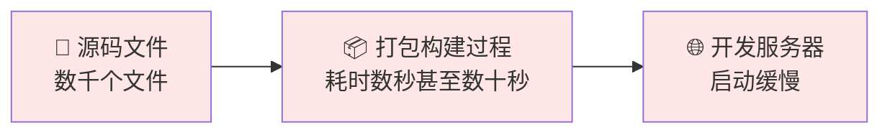
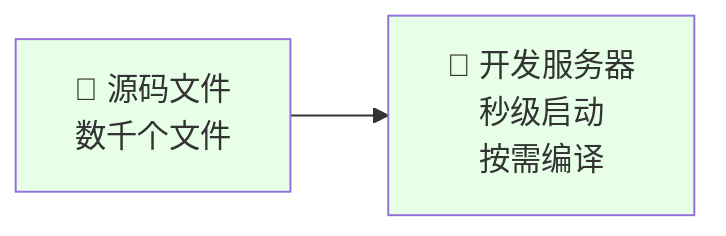
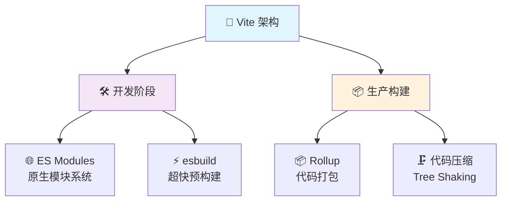

# ⚡ Vite 构建工具深度解析

> 💡 **Vite**（法语意为 "快速的"，发音 `/vit/`，发音同 "veet"）是一种新型前端构建工具，能够显著提升前端开发体验。

## 📖 目录导航

- [🔍 Vite 简介](#🔍-vite-简介)
- [🚀 快速开始](#🚀-快速开始)
- [⚙️ 核心配置](#⚙️-核心配置)
- [🔌 插件系统](#🔌-插件系统)
- [📱 开发体验优化](#📱-开发体验优化)
- [🏗️ 构建和部署](#🏗️-构建和部署)
- [🎭 高级特性](#🎭-高级特性)
- [⚡ 性能优化](#⚡-性能优化)
- [🔄 迁移指南](#🔄-迁移指南)
- [🌟 最佳实践](#🌟-最佳实践)
- [🔗 生态系统](#🔗-生态系统)

::: tip 🚀 为什么选择 Vite？
- **极速启动** - 无需打包，直接启动开发服务器
- **即时热更新** - 无论应用多大，热更新始终极快
- **真正按需编译** - 只编译当前屏幕上实际导入的代码
- **丰富功能** - 对 TypeScript、JSX、CSS 等支持开箱即用
- **生产级别** - 基于 Rollup 的优化构建
:::

---

## 🔍 Vite 简介

### 💡 核心理念

Vite 旨在解决传统构建工具在开发阶段的性能瓶颈：

#### ❌ 传统构建工具的问题



#### ✅ Vite 的解决方案



### 🏗️ 技术架构

Vite 基于两个核心概念：



### 📊 性能对比

| 特性 | Webpack | Vite | 提升幅度 |
|------|---------|------|----------|
| **冷启动时间** | 20-60s | 1-3s | 🚀 **10-20倍** |
| **热更新速度** | 1-5s | <100ms | ⚡ **10-50倍** |
| **构建速度** | 中等 | 快速 | 📦 **2-5倍** |
| **内存占用** | 高 | 低 | 💾 **50%减少** |

---

## 🚀 快速开始

### 📦 安装和创建项目

::: code-group

```bash [npm]
# 创建新项目
npm create vite@latest my-vue-app -- --template vue

# 进入项目目录
cd my-vue-app

# 安装依赖
npm install

# 启动开发服务器
npm run dev
```

```bash [yarn]
# 创建新项目
yarn create vite my-vue-app --template vue

# 进入项目目录
cd my-vue-app

# 安装依赖
yarn

# 启动开发服务器
yarn dev
```

```bash [pnpm]
# 创建新项目
pnpm create vite my-vue-app --template vue

# 进入项目目录
cd my-vue-app

# 安装依赖
pnpm install

# 启动开发服务器
pnpm dev
```

:::

### 🎯 支持的模板

| 模板 | 描述 | 命令 | 推荐场景 |
|------|------|------|----------|
| **vanilla** | 原生 JavaScript | `--template vanilla` | 🎯 学习和原型 |
| **vanilla-ts** | 原生 TypeScript | `--template vanilla-ts` | 🔒 类型安全原型 |
| **vue** | Vue 3 项目 | `--template vue` | 🎨 Vue 应用开发 |
| **vue-ts** | Vue 3 + TypeScript | `--template vue-ts` | 🛡️ 企业级 Vue 应用 |
| **react** | React 项目 | `--template react` | ⚛️ React 应用开发 |
| **react-ts** | React + TypeScript | `--template react-ts` | 🏢 企业级 React 应用 |
| **svelte** | Svelte 项目 | `--template svelte` | 🚀 轻量级应用 |
| **lit** | Lit Web Components | `--template lit` | 🧩 组件库开发 |

### 🏃‍♂️ 项目结构

```
my-vite-app/
├── 📁 public/           # 静态资源
│   └── 🖼️ favicon.ico
├── 📁 src/              # 源代码
│   ├── 📁 assets/       # 资源文件
│   ├── 📁 components/   # 组件
│   ├── 📄 App.vue       # 根组件
│   └── 📄 main.js       # 入口文件
├── 📄 index.html        # HTML 模板
├── 📄 package.json      # 依赖配置
└── ⚙️ vite.config.js    # Vite 配置
```

---

## ⚙️ 核心配置

### 📝 基础配置文件

创建 `vite.config.js` 文件：

```javascript
import { defineConfig } from 'vite'
import vue from '@vitejs/plugin-vue'
import { resolve } from 'path'

export default defineConfig({
  // 🔌 插件配置
  plugins: [vue()],
  
  // 🌐 开发服务器配置
  server: {
    port: 3000,              // 端口号
    open: true,              // 自动打开浏览器
    cors: true,              // 启用 CORS
    host: '0.0.0.0',         // 监听所有地址
    
    // 🔄 代理配置
    proxy: {
      '/api': {
        target: 'http://localhost:8080',
        changeOrigin: true,
        rewrite: (path) => path.replace(/^\/api/, '')
      },
      '/upload': {
        target: 'http://localhost:3001',
        changeOrigin: true
      }
    }
  },
  
  // 📦 构建配置
  build: {
    outDir: 'dist',          // 输出目录
    assetsDir: 'assets',     // 静态资源目录
    minify: 'terser',        // 压缩方式
    sourcemap: false,        // 生成源码映射
    
    // 🎯 Rollup 选项
    rollupOptions: {
      input: {
        main: resolve(__dirname, 'index.html'),
        admin: resolve(__dirname, 'admin/index.html')
      },
      output: {
        chunkFileNames: 'js/[name]-[hash].js',
        entryFileNames: 'js/[name]-[hash].js',
        assetFileNames: 'assets/[name]-[hash].[ext]'
      }
    }
  },
  
  // 🔗 路径解析
  resolve: {
    alias: {
      '@': resolve(__dirname, 'src'),
      'components': resolve(__dirname, 'src/components'),
      'utils': resolve(__dirname, 'src/utils'),
      'api': resolve(__dirname, 'src/api')
    }
  },
  
  // 🎨 CSS 配置
  css: {
    preprocessorOptions: {
      scss: {
        additionalData: `@import "@/styles/variables.scss";`
      },
      less: {
        additionalData: `@import "@/styles/variables.less";`
      }
    },
    postcss: {
      plugins: [
        require('autoprefixer'),
        require('tailwindcss')
      ]
    }
  }
})
```

### 🌍 环境变量配置

#### 创建环境文件

::: code-group

```bash [.env]
# 所有环境都会加载
VITE_APP_TITLE=My Awesome App
VITE_APP_VERSION=1.0.0
```

```bash [.env.local]
# 本地环境（不会被 git 跟踪）
VITE_API_SECRET=your-secret-key
VITE_DEBUG_MODE=true
```

```bash [.env.development]
# 开发环境
VITE_API_URL=http://localhost:8080/api
VITE_API_TIMEOUT=10000
VITE_ENABLE_MOCK=true
```

```bash [.env.production]
# 生产环境
VITE_API_URL=https://api.yourapp.com
VITE_API_TIMEOUT=5000
VITE_ENABLE_MOCK=false
```

:::

#### 在代码中使用环境变量

```javascript
// 基础使用
console.log(import.meta.env.VITE_APP_TITLE)
console.log(import.meta.env.VITE_API_URL)

// 创建 API 配置
const apiConfig = {
  baseURL: import.meta.env.VITE_API_URL,
  timeout: Number(import.meta.env.VITE_API_TIMEOUT),
  enableMock: import.meta.env.VITE_ENABLE_MOCK === 'true'
}

// 环境检测
const isDev = import.meta.env.DEV
const isProd = import.meta.env.PROD
const mode = import.meta.env.MODE

// 条件逻辑
if (import.meta.env.VITE_DEBUG_MODE === 'true') {
  console.log('调试模式已启用')
}
```

#### TypeScript 类型支持

```typescript
// src/vite-env.d.ts
/// <reference types="vite/client" />

interface ImportMetaEnv {
  readonly VITE_APP_TITLE: string
  readonly VITE_API_URL: string
  readonly VITE_API_TIMEOUT: string
  readonly VITE_ENABLE_MOCK: string
  readonly VITE_DEBUG_MODE: string
}

interface ImportMeta {
  readonly env: ImportMetaEnv
}
```

### 🔧 条件配置

```javascript
import { defineConfig, loadEnv } from 'vite'

export default defineConfig(({ command, mode }) => {
  // 📄 加载环境变量
  const env = loadEnv(mode, process.cwd(), '')
  
  // 🏗️ 基础配置
  const config = {
    plugins: [vue()],
    server: {
      port: 3000
    }
  }
  
  // 🛠️ 开发环境特定配置
  if (command === 'serve') {
    config.server.proxy = {
      '/api': env.VITE_API_URL
    }
  }
  
  // 📦 生产环境特定配置
  if (command === 'build') {
    config.build = {
      sourcemap: false,
      minify: 'terser'
    }
  }
  
  return config
})
```

---

## 🔌 插件系统

### 🎨 Vue 生态插件

```javascript
import { defineConfig } from 'vite'
import vue from '@vitejs/plugin-vue'
import vueJsx from '@vitejs/plugin-vue-jsx'

export default defineConfig({
  plugins: [
    // Vue SFC 支持
    vue({
      include: [/\.vue$/, /\.md$/],
      template: {
        compilerOptions: {
          // 自定义元素处理
          isCustomElement: (tag) => tag.startsWith('my-')
        }
      }
    }),
    
    // Vue JSX 支持
    vueJsx({
      // JSX 配置选项
    })
  ]
})
```

### ⚛️ React 生态插件

```javascript
import { defineConfig } from 'vite'
import react from '@vitejs/plugin-react'

export default defineConfig({
  plugins: [
    react({
      // 🔧 Babel 配置
      babel: {
        plugins: [
          ['@babel/plugin-proposal-decorators', { legacy: true }]
        ]
      },
      
      // ⚡ 快速刷新
      fastRefresh: true,
      
      // 📝 JSX 运行时
      jsxRuntime: 'automatic'
    })
  ]
})
```

### 🛠️ 常用社区插件

```javascript
import { defineConfig } from 'vite'
import vue from '@vitejs/plugin-vue'

// 📦 插件导入
import AutoImport from 'unplugin-auto-import/vite'
import Components from 'unplugin-vue-components/vite'
import { ElementPlusResolver } from 'unplugin-vue-components/resolvers'
import Icons from 'unplugin-icons/vite'
import IconsResolver from 'unplugin-icons/resolver'
import { createSvgIconsPlugin } from 'vite-plugin-svg-icons'
import { resolve } from 'path'

export default defineConfig({
  plugins: [
    vue(),
    
    // 🚀 自动导入
    AutoImport({
      imports: ['vue', 'vue-router', 'pinia'],
      resolvers: [
        ElementPlusResolver(),
        IconsResolver({
          prefix: 'Icon',
        }),
      ],
      dts: true, // 生成类型定义
    }),
    
    // 🧩 组件自动导入
    Components({
      resolvers: [
        ElementPlusResolver(),
        IconsResolver({
          enabledCollections: ['ep'],
        }),
      ],
      dts: true,
      directoryAsNamespace: true,
    }),
    
    // 🎨 图标插件
    Icons({
      autoInstall: true,
    }),
    
    // 🖼️ SVG 图标
    createSvgIconsPlugin({
      iconDirs: [resolve(process.cwd(), 'src/assets/icons')],
      symbolId: 'icon-[dir]-[name]',
    })
  ]
})
```

### 📊 实用插件推荐

| 插件名称 | 功能描述 | 特色 | 安装命令 |
|----------|----------|------|----------|
| **@vitejs/plugin-legacy** | 传统浏览器支持 | 🏺 ES5 兼容 | `npm i -D @vitejs/plugin-legacy` |
| **vite-plugin-eslint** | ESLint 集成 | 🔍 代码检查 | `npm i -D vite-plugin-eslint` |
| **vite-plugin-mock** | API 模拟 | 🎭 接口模拟 | `npm i -D vite-plugin-mock` |
| **unplugin-auto-import** | 自动导入 | 🚀 无需手动导入 | `npm i -D unplugin-auto-import` |
| **vite-plugin-windicss** | WindiCSS 支持 | 💨 原子CSS | `npm i -D vite-plugin-windicss` |
| **vite-plugin-pwa** | PWA 支持 | 📱 渐进式应用 | `npm i -D vite-plugin-pwa` |
| **vite-plugin-components** | 组件自动导入 | 🧩 按需加载 | `npm i -D unplugin-vue-components` |

### 🔌 自定义插件示例

```javascript
// plugins/dev-performance.js
export function devPerformancePlugin() {
  return {
    name: 'dev-performance',
    configureServer(server) {
      server.middlewares.use((req, res, next) => {
        const start = Date.now()
        
        res.on('finish', () => {
          const duration = Date.now() - start
          if (duration > 100) {
            console.log(`🐌 慢请求: ${req.method} ${req.url} - ${duration}ms`)
          }
        })
        
        next()
      })
    }
  }
}

// vite.config.js 中使用
import { devPerformancePlugin } from './plugins/dev-performance'

export default defineConfig({
  plugins: [
    vue(),
    devPerformancePlugin()
  ]
})
```

---

## 📱 开发体验优化

### 🔥 热模块替换 (HMR)

```javascript
// 🔧 手动处理 HMR
if (import.meta.hot) {
  // 🎯 接受模块更新
  import.meta.hot.accept('./component.vue', (newModule) => {
    console.log('🔄 组件已更新:', newModule)
    // 自定义热更新逻辑
  })
  
  // 🔄 接受依赖更新
  import.meta.hot.accept(['./utils.js', './config.js'], ([newUtils, newConfig]) => {
    console.log('📦 依赖已更新')
  })
  
  // 🧹 清理逻辑
  import.meta.hot.dispose(() => {
    console.log('🧹 清理旧模块')
    // 清理副作用
  })
  
  // 📤 发送自定义事件
  import.meta.hot.send('my-event', { data: 'hello' })
  
  // 📥 监听自定义事件
  import.meta.hot.on('my-event', (data) => {
    console.log('📨 收到事件:', data)
  })
}
```

### 🔍 TypeScript 支持

```typescript
// 📄 vite-env.d.ts
/// <reference types="vite/client" />

declare module '*.vue' {
  import type { DefineComponent } from 'vue'
  const component: DefineComponent<{}, {}, any>
  export default component
}

declare module '*.svg' {
  import type { DefineComponent } from 'vue'
  const component: DefineComponent
  export default component
}

declare module '*.png' {
  const src: string
  export default src
}
```

```json
{
  "compilerOptions": {
    "target": "ES2020",
    "useDefineForClassFields": true,
    "lib": ["ES2020", "DOM", "DOM.Iterable"],
    "module": "ESNext",
    "skipLibCheck": true,
    
    /* 打包选项 */
    "moduleResolution": "bundler",
    "allowImportingTsExtensions": true,
    "resolveJsonModule": true,
    "isolatedModules": true,
    "noEmit": true,
    "jsx": "preserve",
    
    /* 代码检查 */
    "strict": true,
    "noUnusedLocals": true,
    "noUnusedParameters": true,
    "noFallthroughCasesInSwitch": true,
    
    /* 路径映射 */
    "baseUrl": ".",
    "paths": {
      "@/*": ["src/*"],
      "components/*": ["src/components/*"],
      "utils/*": ["src/utils/*"]
    }
  },
  "include": [
    "src/**/*.ts",
    "src/**/*.d.ts", 
    "src/**/*.tsx",
    "src/**/*.vue"
  ],
  "references": [{ "path": "./tsconfig.node.json" }]
}
```

### 📦 依赖预构建

```javascript
// vite.config.js
export default defineConfig({
  optimizeDeps: {
    // 🎯 手动指定需要预构建的依赖
    include: [
      'lodash-es',
      'axios',
      'dayjs',
      'element-plus/lib/index',
      'element-plus/lib/locale/lang/zh-cn'
    ],
    
    // ❌ 排除预构建
    exclude: [
      'your-local-package',
      '@iconify/icons-ep'
    ],
    
    // 🔄 强制预构建链接的包
    force: true,
    
    // ⚙️ esbuild 选项
    esbuildOptions: {
      define: {
        global: 'globalThis'
      }
    }
  }
})
```

### 🎯 开发服务器优化

```javascript
export default defineConfig({
  server: {
    // 🌐 网络配置
    host: '0.0.0.0',
    port: 3000,
    strictPort: false,
    
    // 🔧 中间件
    middlewareMode: false,
    
    // 📂 静态文件服务
    fs: {
      strict: true,
      allow: ['..']
    },
    
    // 🎨 自定义中间件
    configureServer(server) {
      server.middlewares.use('/api', (req, res, next) => {
        // 自定义 API 处理
        next()
      })
    }
  }
})
```

---

## 🏗️ 构建和部署

### 📦 生产构建配置

```javascript
export default defineConfig({
  build: {
    // 📁 输出配置
    outDir: 'dist',
    assetsDir: 'assets',
    
    // 📏 文件大小限制
    assetsInlineLimit: 4096,
    
    // 🎨 CSS 配置
    cssCodeSplit: true,
    cssTarget: 'chrome80',
    
    // 🗺️ Source Map
    sourcemap: false,
    
    // 🗜️ 压缩配置
    minify: 'terser',
    terserOptions: {
      compress: {
        drop_console: true,
        drop_debugger: true
      },
      mangle: {
        safari10: true
      }
    },
    
    // 📊 构建报告
    reportCompressedSize: false,
    
    // 🎯 Rollup 配置
    rollupOptions: {
      input: {
        main: resolve(__dirname, 'index.html'),
        admin: resolve(__dirname, 'admin/index.html')
      },
      output: {
        // 📦 代码分割
        manualChunks: {
          vendor: ['vue', 'vue-router', 'pinia'],
          ui: ['element-plus'],
          utils: ['lodash-es', 'dayjs', 'axios']
        },
        
        // 📝 文件命名
        chunkFileNames: (chunkInfo) => {
          const facadeModuleId = chunkInfo.facadeModuleId
          if (facadeModuleId) {
            return 'js/[name]-[hash].js'
          }
          return 'js/chunk-[hash].js'
        },
        entryFileNames: 'js/[name]-[hash].js',
        assetFileNames: 'assets/[name]-[hash].[ext]'
      },
      
      // 🔗 外部依赖
      external: ['vue', 'vue-router'],
      
      // 🔌 插件
      plugins: [
        // 自定义 Rollup 插件
      ]
    }
  }
})
```

### 🚀 部署配置

#### 静态文件部署

```javascript
// GitHub Pages 配置
export default defineConfig({
  base: '/your-repo-name/', // 仓库名
  build: {
    outDir: 'docs'  // GitHub Pages 源目录
  }
})

// Nginx 配置示例
// nginx.conf
server {
  listen 80;
  server_name yourdomain.com;
  root /var/www/your-app/dist;
  index index.html;
  
  location / {
    try_files $uri $uri/ /index.html;
  }
  
  location /assets/ {
    expires 1y;
    add_header Cache-Control "public, immutable";
  }
}
```

#### Docker 部署

```dockerfile
# Dockerfile
FROM node:18-alpine as builder

WORKDIR /app
COPY package*.json ./
RUN npm ci --only=production

COPY . .
RUN npm run build

FROM nginx:alpine
COPY --from=builder /app/dist /usr/share/nginx/html
COPY nginx.conf /etc/nginx/nginx.conf

EXPOSE 80
CMD ["nginx", "-g", "daemon off;"]
```

### 📊 构建分析

```javascript
// 构建分析配置
import { defineConfig } from 'vite'
import { visualizer } from 'rollup-plugin-visualizer'

export default defineConfig({
  plugins: [
    // 📈 包大小分析
    visualizer({
      filename: 'dist/stats.html',
      open: true
    })
  ],
  
  build: {
    rollupOptions: {
      output: {
        manualChunks: (id) => {
          // 🎯 智能代码分割
          if (id.includes('node_modules')) {
            if (id.includes('vue')) {
              return 'vue'
            }
            if (id.includes('element-plus')) {
              return 'element-plus'
            }
            if (id.includes('lodash')) {
              return 'lodash'
            }
            return 'vendor'
          }
        }
      }
    }
  }
})
```

---

## 🎭 高级特性

### 🌍 多页面应用

```javascript
// vite.config.js
import { defineConfig } from 'vite'
import { resolve } from 'path'

export default defineConfig({
  build: {
    rollupOptions: {
      input: {
        // 🏠 主应用
        main: resolve(__dirname, 'index.html'),
        // 👑 管理后台
        admin: resolve(__dirname, 'admin/index.html'),
        // 📱 移动端
        mobile: resolve(__dirname, 'mobile/index.html')
      }
    }
  }
})
```

### 🔄 动态导入

```javascript
// 路由懒加载
const routes = [
  {
    path: '/',
    component: () => import('@/views/Home.vue')
  },
  {
    path: '/about',
    component: () => import('@/views/About.vue')
  }
]

// 条件导入
async function loadUtils() {
  if (process.env.NODE_ENV === 'development') {
    const devUtils = await import('@/utils/dev.js')
    return devUtils
  } else {
    const prodUtils = await import('@/utils/prod.js')
    return prodUtils
  }
}

// 动态组件
const DynamicComponent = defineAsyncComponent(() =>
  import('@/components/Dynamic.vue')
)
```

### 🎨 CSS 模块化

```vue
<template>
  <div :class="$style.container">
    <h1 :class="$style.title">标题</h1>
  </div>
</template>

<style module>
.container {
  padding: 20px;
}

.title {
  color: #333;
  font-size: 24px;
}
</style>
```

```javascript
// CSS 变量注入
export default defineConfig({
  css: {
    preprocessorOptions: {
      scss: {
        additionalData: `
          $primary-color: #007bff;
          $secondary-color: #6c757d;
          @import "@/styles/mixins.scss";
        `
      }
    }
  }
})
```

### 🔌 Worker 支持

```javascript
// main.js
import MyWorker from './worker.js?worker'

const worker = new MyWorker()
worker.postMessage({ type: 'START', data: [1, 2, 3] })
worker.onmessage = (e) => {
  console.log('Worker 返回:', e.data)
}

// 内联 Worker
import MyInlineWorker from './worker.js?worker&inline'

// 共享 Worker
import MySharedWorker from './worker.js?sharedworker'
```

---

## ⚡ 性能优化

### 🎯 构建性能优化

```javascript
export default defineConfig({
  // 🧵 并行处理
  esbuild: {
    target: 'es2020',
    drop: ['console', 'debugger']
  },
  
  build: {
    // 🔧 Terser 配置
    terserOptions: {
      compress: {
        passes: 2,
        unsafe: true
      },
      mangle: {
        properties: {
          regex: /^_/
        }
      }
    },
    
    // 📦 代码分割策略
    rollupOptions: {
      output: {
        manualChunks: (id) => {
          // 📚 第三方库
          if (id.includes('node_modules')) {
            // 🎨 UI 库单独打包
            if (id.includes('element-plus')) {
              return 'element-plus'
            }
            // 🛠️ 工具库
            if (id.includes('lodash') || id.includes('dayjs')) {
              return 'utils'
            }
            // 📊 图表库
            if (id.includes('echarts')) {
              return 'charts'
            }
            return 'vendor'
          }
          
          // 📄 页面级别分割
          if (id.includes('src/views/')) {
            return 'pages'
          }
        }
      }
    }
  }
})
```

### 🚀 运行时性能优化

```javascript
// 预加载关键资源
const criticalResources = [
  '@/components/Header.vue',
  '@/utils/request.js',
  '@/stores/user.js'
]

criticalResources.forEach(resource => {
  import(resource)
})

// 路由预取
const routes = [
  {
    path: '/dashboard',
    component: () => import(
      /* webpackChunkName: "dashboard" */
      /* webpackPrefetch: true */
      '@/views/Dashboard.vue'
    )
  }
]
```

### 📊 性能监控

```javascript
// 性能监控插件
function performancePlugin() {
  return {
    name: 'performance-monitor',
    generateBundle() {
      console.log('📊 构建性能统计:')
      console.log('- 构建时间:', process.hrtime())
      console.log('- 内存使用:', process.memoryUsage())
    }
  }
}

// 开发服务器性能监控
export default defineConfig({
  plugins: [
    {
      name: 'dev-performance',
      configureServer(server) {
        server.middlewares.use('/api', (req, res, next) => {
          const start = Date.now()
          
          res.on('finish', () => {
            const duration = Date.now() - start
            console.log(`⏱️ ${req.method} ${req.url} - ${duration}ms`)
          })
          
          next()
        })
      }
    }
  ]
})
```

---

## 🔄 迁移指南

### 📦 从 Vue CLI 迁移

```bash
# 1. 🔧 安装 Vite 依赖
npm install --save-dev vite @vitejs/plugin-vue

# 2. 📝 更新 package.json 脚本
{
  "scripts": {
    "dev": "vite",
    "build": "vite build", 
    "preview": "vite preview"
  }
}
```

```javascript
// 3. ⚙️ 创建 vite.config.js
import { defineConfig } from 'vite'
import vue from '@vitejs/plugin-vue'
import { resolve } from 'path'

export default defineConfig({
  plugins: [vue()],
  resolve: {
    alias: {
      '@': resolve(__dirname, 'src')
    }
  },
  server: {
    port: 8080
  }
})
```

#### 🔧 配置迁移对照表

| Vue CLI | Vite | 说明 |
|---------|------|------|
| `vue.config.js` | `vite.config.js` | 配置文件 |
| `publicPath` | `base` | 公共路径 |
| `outputDir` | `build.outDir` | 输出目录 |
| `devServer.proxy` | `server.proxy` | 代理配置 |
| `chainWebpack` | `build.rollupOptions` | 构建配置 |

### ⚛️ 从 Create React App 迁移

```bash
# 1. 📦 安装依赖
npm install --save-dev vite @vitejs/plugin-react

# 2. 📄 更新入口文件
# 将 src/index.js 重命名为 src/main.jsx
# 更新 index.html 中的脚本引用
```

```html
<!-- 3. 🔄 更新 index.html -->
<!DOCTYPE html>
<html lang="en">
<head>
  <meta charset="UTF-8" />
  <meta name="viewport" content="width=device-width, initial-scale=1.0" />
  <title>React App</title>
</head>
<body>
  <div id="root"></div>
  <script type="module" src="/src/main.jsx"></script>
</body>
</html>
```

```javascript
// 4. ⚙️ 配置文件
import { defineConfig } from 'vite'
import react from '@vitejs/plugin-react'

export default defineConfig({
  plugins: [react()],
  server: {
    port: 3000
  }
})
```

### 🚀 从 Webpack 迁移

```javascript
// Webpack 到 Vite 配置映射
const webpackToVite = {
  // 📂 别名配置
  resolve: {
    alias: {
      '@': path.resolve(__dirname, 'src')
    }
  },
  
  // 🔌 插件配置
  plugins: [
    vue(), // 替代 vue-loader
    // HTML 插件功能由 Vite 内置
  ],
  
  // 🌐 开发服务器
  server: {
    proxy: {
      '/api': 'http://localhost:8080'
    }
  },
  
  // 🎨 CSS 配置
  css: {
    preprocessorOptions: {
      scss: {
        additionalData: '@import "@/styles/vars.scss";'
      }
    }
  }
}
```

---

## 🌟 最佳实践

### 📂 推荐项目结构

```
my-vite-app/
├── 📁 public/                # 🌐 静态资源
│   ├── 🖼️ favicon.ico
│   ├── 🖼️ logo.png
│   └── 📄 robots.txt
├── 📁 src/                   # 📦 源代码
│   ├── 📁 api/               # 🌐 API 接口
│   │   ├── 📄 user.js
│   │   └── 📄 index.js
│   ├── 📁 assets/            # 🎨 资源文件
│   │   ├── 📁 images/
│   │   ├── 📁 icons/
│   │   └── 📁 fonts/
│   ├── 📁 components/        # 🧩 公共组件
│   │   ├── 📁 common/
│   │   └── 📁 business/
│   ├── 📁 composables/       # 🔧 组合式函数
│   │   ├── 📄 useAuth.js
│   │   └── 📄 useApi.js
│   ├── 📁 directives/        # 📋 自定义指令
│   ├── 📁 hooks/             # 🎣 React Hooks
│   ├── 📁 layouts/           # 📐 布局组件
│   ├── 📁 plugins/           # 🔌 插件配置
│   ├── 📁 router/            # 🧭 路由配置
│   ├── 📁 stores/            # 🗄️ 状态管理
│   │   ├── 📄 user.js
│   │   └── 📄 index.js
│   ├── 📁 styles/            # 🎨 样式文件
│   │   ├── 📄 variables.scss
│   │   ├── 📄 mixins.scss
│   │   └── 📄 global.scss
│   ├── 📁 utils/             # 🛠️ 工具函数
│   │   ├── 📄 request.js
│   │   ├── 📄 storage.js
│   │   └── 📄 common.js
│   ├── 📁 views/             # 📄 页面组件
│   │   ├── 📁 home/
│   │   ├── 📁 user/
│   │   └── 📁 admin/
│   ├── 📄 App.vue            # 🏠 根组件
│   └── 📄 main.js            # 🚀 应用入口
├── 📄 .env                   # 🌍 环境变量
├── 📄 .env.development       # 🛠️ 开发环境
├── 📄 .env.production        # 🏭 生产环境
├── 📄 .gitignore            # 🚫 Git 忽略
├── 📄 index.html            # 📄 HTML 模板
├── 📄 package.json          # 📦 项目配置
├── 📄 vite.config.js        # ⚙️ Vite 配置
└── 📄 README.md            # 📖 项目文档
```

### 🎯 配置最佳实践

```javascript
// vite.config.js - 完整的生产配置
import { defineConfig, loadEnv } from 'vite'
import vue from '@vitejs/plugin-vue'
import { resolve } from 'path'

export default defineConfig(({ command, mode }) => {
  // 🌍 加载环境变量
  const env = loadEnv(mode, process.cwd(), '')
  
  const isDev = command === 'serve'
  const isProd = command === 'build'
  
  return {
    // 🔌 插件配置
    plugins: [
      vue({
        reactivityTransform: true
      })
    ],
    
    // 🔗 路径解析
    resolve: {
      alias: {
        '@': resolve(__dirname, 'src'),
        'components': resolve(__dirname, 'src/components'),
        'utils': resolve(__dirname, 'src/utils'),
        'api': resolve(__dirname, 'src/api'),
        'assets': resolve(__dirname, 'src/assets')
      }
    },
    
    // 🌐 开发服务器
    server: {
      port: Number(env.VITE_PORT) || 3000,
      open: true,
      cors: true,
      proxy: {
        '/api': {
          target: env.VITE_API_BASE_URL,
          changeOrigin: true,
          rewrite: (path) => path.replace(/^\/api/, '')
        }
      }
    },
    
    // 📦 构建配置
    build: {
      outDir: 'dist',
      sourcemap: isDev,
      minify: isProd ? 'terser' : false,
      
      // 🗜️ 压缩配置
      terserOptions: isProd ? {
        compress: {
          drop_console: true,
          drop_debugger: true
        }
      } : {},
      
      // 🎯 Rollup 配置
      rollupOptions: {
        output: {
          // 📦 代码分割
          manualChunks: {
            'vue-vendor': ['vue', 'vue-router', 'pinia'],
            'ui-vendor': ['element-plus'],
            'utils-vendor': ['lodash-es', 'dayjs', 'axios']
          },
          
          // 📝 文件命名
          chunkFileNames: 'js/[name]-[hash].js',
          entryFileNames: 'js/[name]-[hash].js',
          assetFileNames: 'assets/[name]-[hash].[ext]'
        }
      }
    },
    
    // 🎨 CSS 配置
    css: {
      preprocessorOptions: {
        scss: {
          additionalData: '@import "@/styles/variables.scss";'
        }
      }
    },
    
    // 📦 依赖优化
    optimizeDeps: {
      include: [
        'vue',
        'vue-router',
        'pinia',
        'element-plus'
      ]
    }
  }
})
```

### 🚀 性能优化技巧

```javascript
// 1. 🎯 路由懒加载
const routes = [
  {
    path: '/dashboard',
    component: () => import('@/views/Dashboard.vue'),
    meta: { preload: true }
  }
]

// 2. 🧩 组件懒加载
const LazyComponent = defineAsyncComponent({
  loader: () => import('@/components/Heavy.vue'),
  loadingComponent: LoadingSpinner,
  errorComponent: ErrorComponent,
  delay: 200,
  timeout: 3000
})

// 3. 📦 资源预加载
const preloadCriticalResources = () => {
  const resources = [
    '@/utils/request.js',
    '@/stores/user.js'
  ]
  
  resources.forEach(resource => {
    import(resource)
  })
}

// 4. 🎨 CSS 代码分割
// 在组件中使用 CSS Modules
export default {
  style: {
    module: true
  }
}
```

---

## 🔗 生态系统

### 🛠️ 开发工具

| 工具 | 描述 | 链接 |
|------|------|------|
| **Vite DevTools** | 浏览器开发工具扩展 | [Chrome 扩展](https://chrome.google.com/webstore) |
| **Vite Bundle Analyzer** | 包大小分析 | [GitHub](https://github.com/btd/rollup-plugin-visualizer) |
| **Vite PWA** | PWA 支持 | [GitHub](https://github.com/antfu/vite-plugin-pwa) |

### 📚 学习资源

| 资源 | 类型 | 描述 | 链接 |
|------|------|------|------|
| **官方文档** | 📖 文档 | 详细的配置和 API 说明 | [Vite 官网](https://vitejs.dev/) |
| **中文文档** | 📖 文档 | 中文翻译版本 | [中文官网](https://cn.vitejs.dev/) |
| **Awesome Vite** | 📦 资源集合 | 社区资源和插件 | [GitHub](https://github.com/vitejs/awesome-vite) |
| **Vite 插件开发** | 📖 指南 | 插件开发文档 | [插件 API](https://vitejs.dev/guide/api-plugin.html) |

### 🤝 社区支持

| 平台 | 描述 | 链接 |
|------|------|------|
| **GitHub Issues** | 问题反馈和讨论 | [Issues](https://github.com/vitejs/vite/issues) |
| **Discord** | 实时聊天社区 | [加入 Discord](https://chat.vitejs.dev/) |
| **Twitter** | 最新动态 | [@vite_js](https://twitter.com/vite_js) |
| **Reddit** | 社区讨论 | [r/vitejs](https://www.reddit.com/r/vitejs/) |

### 🔌 推荐插件生态

```javascript
// 🎨 UI 框架插件
import ElementPlus from 'unplugin-element-plus/vite'
import { AntDesignVueResolver } from 'unplugin-vue-components/resolvers'

// 🛠️ 开发工具插件
import { defineConfig } from 'vite'
import inspect from 'vite-plugin-inspect'
import { visualizer } from 'rollup-plugin-visualizer'

export default defineConfig({
  plugins: [
    // 🔍 构建过程检查
    inspect(),
    
    // 📊 包大小分析
    visualizer({
      filename: 'dist/stats.html',
      open: true
    }),
    
    // 🎨 Element Plus 按需导入
    ElementPlus({
      useSource: true
    })
  ]
})
```

---

::: tip 🎯 总结

Vite 作为下一代前端构建工具，通过以下核心优势革命性地改变了前端开发体验：

### 🚀 核心优势
- **🟢 极速启动**: 基于 ES 模块的原生支持，无需预打包
- **⚡ 即时热更新**: 精确的模块热替换，速度与项目大小无关
- **🎯 按需编译**: 只编译当前页面需要的模块
- **📦 智能预构建**: 使用 esbuild 进行依赖预构建
- **🔧 零配置**: 开箱即用，同时支持深度定制

### 💡 最佳实践要点
1. **合理使用环境变量**: 区分开发和生产环境配置
2. **优化代码分割**: 使用 `manualChunks` 进行智能分包
3. **善用插件系统**: 利用丰富的社区插件提升开发效率
4. **性能监控**: 使用构建分析工具优化包大小
5. **渐进式迁移**: 从现有项目逐步迁移到 Vite

掌握 Vite 将大大提升你的前端开发效率和项目性能！🎉

:::

::: warning 📋 注意事项
- Vite 在开发环境使用 ES 模块，确保目标浏览器支持
- 某些 CommonJS 包可能需要额外配置
- 生产环境构建基于 Rollup，与开发环境略有差异
- 建议在正式项目使用前进行充分测试
:::

---

> 🌟 **持续优化，永无止境** - Vite 的生态系统在不断发展，保持关注最新动态，让开发体验更上一层楼！
