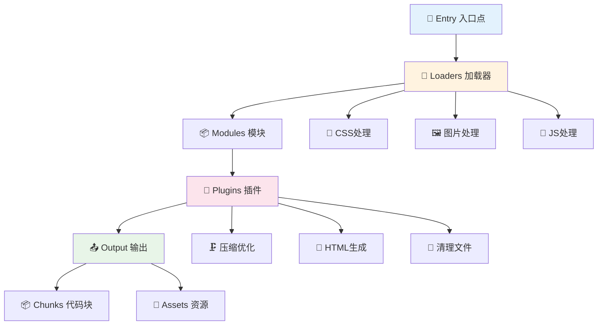
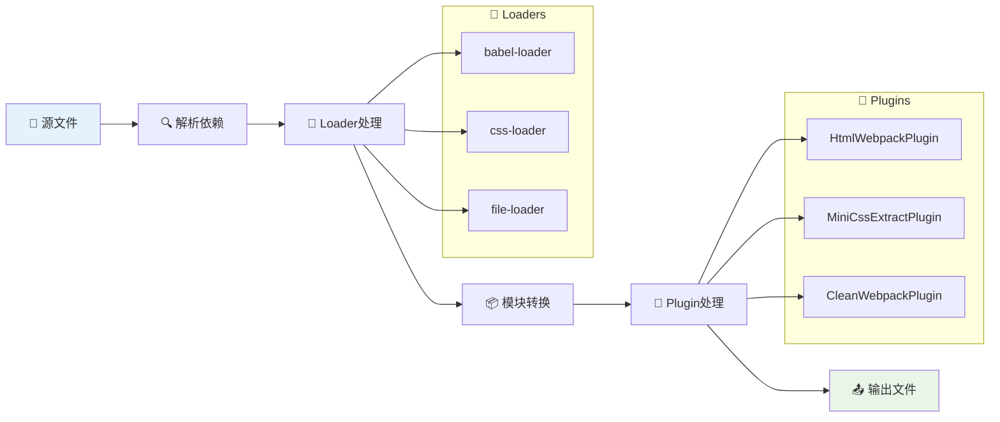

# 📦 Webpack 构建工具完全指南

> 💡 **Webpack** 是一个现代 JavaScript 应用程序的静态模块打包器。当 webpack 处理应用程序时，它会递归地构建一个依赖关系图，其中包含应用程序需要的每个模块，然后将所有这些模块打包成一个或多个 bundle。

## 📖 目录导航

- [📖 概述](#📖-概述)
- [🚀 快速开始](#🚀-快速开始)
- [⚙️ 配置详解](#⚙️-配置详解)
- [🔧 Loaders 加载器](#🔧-loaders-加载器)
- [🔌 Plugins 插件](#🔌-plugins-插件)
- [🎯 代码分割](#🎯-代码分割)
- [🌐 开发服务器](#🌐-开发服务器)
- [⚡ 性能优化](#⚡-性能优化)
- [🏗️ 生产构建](#🏗️-生产构建)
- [🔄 迁移指南](#🔄-迁移指南)
- [🌟 最佳实践](#🌟-最佳实践)

---

## 📖 概述

### ✨ 核心特性

| 特性 | 描述 | 优势 | 使用场景 |
|------|------|------|----------|
| **📦 模块打包** | 支持各种模块系统 | 统一的模块化方案 | 大型项目架构 |
| **🔄 代码分割** | 按需加载代码 | 优化加载性能 | SPA 应用优化 |
| **🔌 插件系统** | 丰富的插件生态 | 高度可扩展 | 自定义构建流程 |
| **🎯 资源处理** | 处理各种类型资源 | 一站式解决方案 | 多媒体项目 |
| **🚀 热更新** | 开发时热重载 | 提升开发效率 | 开发环境 |
| **🛠️ 优化能力** | 压缩、Tree Shaking | 优化生产代码 | 生产环境 |

### 🏗️ 核心概念



### 🔄 Webpack 工作流程



---

## 🚀 快速开始

### 📦 安装 Webpack

::: code-group

```bash [npm]
# 项目内安装（推荐）
npm install --save-dev webpack webpack-cli

# 全局安装
npm install -g webpack webpack-cli
```

```bash [yarn]
# 项目内安装
yarn add -D webpack webpack-cli

# 全局安装
yarn global add webpack webpack-cli
```

```bash [pnpm]
# 项目内安装
pnpm add -D webpack webpack-cli

# 全局安装
pnpm add -g webpack webpack-cli
```

:::

### 🎯 零配置使用

Webpack 开箱即用，可以无需使用任何配置文件。然而，webpack 会假定项目的入口起点为 `src/index.js`，然后会在 `dist/main.js` 输出结果，并且在生产环境开启压缩和优化。

```bash
# 开发模式打包
npx webpack --mode development

# 生产模式打包
npx webpack --mode production

# 指定入口和输出
npx webpack src/index.js --output-path dist --output-filename bundle.js

# 监听文件变化
npx webpack --watch
```

### 🛠️ 快速初始化配置

利用 `webpack-cli` 的 `init` 命令，它可以根据你的项目需求快速生成 webpack 配置文件：

```bash
npx webpack init

# 示例交互过程
[webpack-cli] For using this command you need to install: '@webpack-cli/generators' package.
[webpack-cli] Would you like to install '@webpack-cli/generators' package? (Y/n) Y

? Which of the following JS solutions do you want to use? ES6
? Do you want to use webpack-dev-server? Yes
? Do you want to simplify the creation of HTML files for your bundle? Yes
? Do you want to add PWA support? No
? Which of the following CSS solutions do you want to use? CSS only
? Will you be using PostCSS in your project? Yes
? Do you want to extract CSS for every file? Only for Production
? Do you like to install prettier to format generated configuration? Yes
? Pick a package manager: pnpm

[webpack-cli] ℹ INFO  Initialising project...
[webpack-cli] Project has been initialised with webpack!
```

### 📂 项目结构示例

```
my-webpack-project/
├── 📁 src/                    # 源代码
│   ├── 📁 components/         # 组件
│   ├── 📁 assets/            # 资源文件
│   │   ├── 📁 images/
│   │   ├── 📁 fonts/
│   │   └── 📁 styles/
│   ├── 📁 utils/             # 工具函数
│   ├── 📄 index.js           # 入口文件
│   └── 📄 index.html         # HTML模板
├── 📁 dist/                  # 构建输出
├── 📁 public/                # 静态资源
├── 📄 package.json           # 项目配置
├── 📄 webpack.config.js      # Webpack配置
└── 📄 README.md             # 项目说明
```

---

## ⚙️ 配置详解

通常你的项目还需要继续扩展此能力，为此你可以在项目根目录下创建一个 `webpack.config.js` 文件，然后 webpack 会自动使用它。

### 📝 基础配置示例

```javascript
const path = require('path');
const HtmlWebpackPlugin = require('html-webpack-plugin');
const MiniCssExtractPlugin = require('mini-css-extract-plugin');
const { CleanWebpackPlugin } = require('clean-webpack-plugin');

module.exports = {
  // 🚀 项目入口文件
  entry: {
    app: './src/index.js',
    vendor: ['react', 'react-dom']
  },
  
  // 📤 构建输出配置
  output: {
    filename: '[name].[contenthash:8].js',
    path: path.resolve(__dirname, 'dist'),
    clean: true, // 在生成文件之前清空 output 目录
    publicPath: '/',
    chunkFilename: '[name].[contenthash:8].chunk.js'
  },
  
  // 🎯 打包模式
  mode: 'development', // development | production
  
  // 🗺️ Source Map 配置
  devtool: 'cheap-module-source-map',
  
  // 💾 缓存配置
  cache: {
    type: 'filesystem',
    allowCollectingMemory: true,
  },
  
  // 🎯 目标环境
  target: 'browserslist',
  
  // 🔗 外部依赖
  externals: {
    jquery: 'jQuery',
    lodash: {
      commonjs: 'lodash',
      commonjs2: 'lodash',
      amd: 'lodash',
      root: '_'
    }
  },
  
  // 📊 统计信息
  stats: 'errors-only',
  
  // ⚡ 性能配置
  performance: {
    assetFilter: function (assetFilename) {
      return assetFilename.endsWith('.js');
    },
    hints: 'warning',
    maxAssetSize: 250000,
    maxEntrypointSize: 250000,
  },
  
  // 🔧 模块解析
  resolve: {
    extensions: ['.js', '.jsx', '.ts', '.tsx', '.json'],
    alias: {
      '@': path.resolve(__dirname, 'src'),
      'components': path.resolve(__dirname, 'src/components'),
      'utils': path.resolve(__dirname, 'src/utils')
    }
  },
  
  // 🔄 模块规则
  module: {
    rules: [
      // JavaScript/TypeScript 处理
      {
        test: /\.(js|jsx|ts|tsx)$/,
        exclude: /node_modules/,
        use: {
          loader: 'babel-loader',
          options: {
            presets: ['@babel/preset-env', '@babel/preset-react'],
            plugins: ['@babel/plugin-transform-runtime']
          }
        }
      },
      
      // CSS 处理
      {
        test: /\.css$/,
        use: [
          MiniCssExtractPlugin.loader,
          'css-loader',
          'postcss-loader'
        ]
      },
      
      // SCSS 处理
      {
        test: /\.scss$/,
        use: [
          MiniCssExtractPlugin.loader,
          'css-loader',
          'postcss-loader',
          'sass-loader'
        ]
      },
      
      // 图片处理
      {
        test: /\.(png|jpg|jpeg|gif|svg)$/,
        type: 'asset',
        parser: {
          dataUrlCondition: {
            maxSize: 10 * 1024, // 10KB
          }
        },
        generator: {
          filename: 'images/[name].[contenthash:8][ext]'
        }
      },
      
      // 字体处理
      {
        test: /\.(woff|woff2|eot|ttf|otf)$/,
        type: 'asset/resource',
        generator: {
          filename: 'fonts/[name].[contenthash:8][ext]'
        }
      }
    ]
  },
  
  // 🔌 插件配置
  plugins: [
    // 清理构建目录
    new CleanWebpackPlugin(),
    
    // HTML 生成
    new HtmlWebpackPlugin({
      template: './src/index.html',
      filename: 'index.html',
      chunks: ['app', 'vendor']
    }),
    
    // CSS 提取
    new MiniCssExtractPlugin({
      filename: 'styles/[name].[contenthash:8].css',
      chunkFilename: 'styles/[name].[contenthash:8].chunk.css'
    })
  ],
  
  // 🎯 代码分割
  optimization: {
    splitChunks: {
      chunks: 'all',
      cacheGroups: {
        vendor: {
          test: /[\\/]node_modules[\\/]/,
          name: 'vendors',
          chunks: 'all',
        },
        common: {
          name: 'common',
          minChunks: 2,
          priority: -10,
          reuseExistingChunk: true,
        }
      }
    },
    runtimeChunk: {
      name: 'runtime'
    }
  },
  
  // 🌐 开发服务器配置
  devServer: {
    static: {
      directory: path.join(__dirname, 'public'),
    },
    compress: true,
    port: 3000,
    open: true,
    hot: true,
    historyApiFallback: true,
    proxy: {
      '/api': {
        target: 'http://localhost:8080',
        pathRewrite: { '^/api': '' },
        changeOrigin: true,
        secure: false
      },
    },
    headers: {
      'Access-Control-Allow-Origin': '*',
      'Access-Control-Allow-Methods': 'GET, POST, PUT, DELETE, PATCH, OPTIONS',
      'Access-Control-Allow-Headers': 'X-Requested-With, content-type, Authorization'
    }
  }
};
```

### 🔧 配置模式区分

```javascript
// webpack.config.js
const path = require('path');

module.exports = (env, argv) => {
  const isProduction = argv.mode === 'production';
  const isDevelopment = argv.mode === 'development';
  
  return {
    mode: argv.mode,
    devtool: isProduction ? 'source-map' : 'eval-cheap-module-source-map',
    
    // 🎯 条件配置
    ...(isDevelopment && {
      devServer: {
        port: 3000,
        hot: true,
        open: true
      }
    }),
    
    // 🔧 环境特定插件
    plugins: [
      // 通用插件
      new HtmlWebpackPlugin({
        template: './src/index.html'
      }),
      
      // 生产环境插件
      ...(isProduction ? [
        new MiniCssExtractPlugin({
          filename: 'styles/[name].[contenthash:8].css'
        })
      ] : [])
    ],
    
    // 🎯 优化配置
    optimization: {
      minimize: isProduction,
      ...(isProduction && {
        minimizer: [
          new TerserPlugin({
            terserOptions: {
              compress: {
                drop_console: true,
                drop_debugger: true
              }
            }
          })
        ]
      })
    }
  };
};
```

::: tip 💡 配置提示
- 使用 `process.env.NODE_ENV` 来区分环境
- 开发环境优先考虑构建速度
- 生产环境优先考虑包大小和性能
- 合理使用缓存提升构建速度
:::

---
