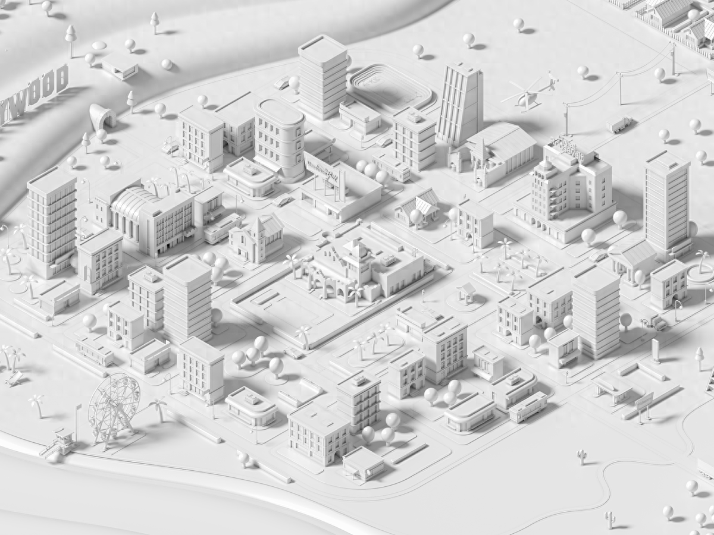
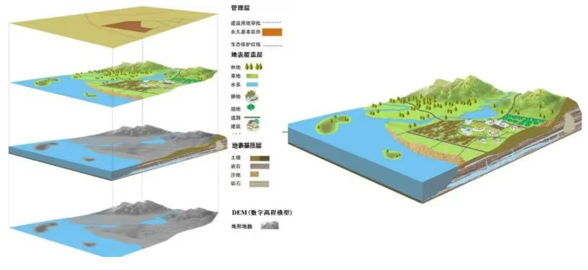
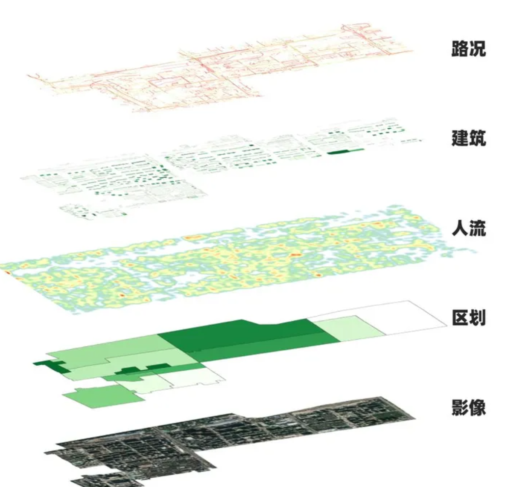
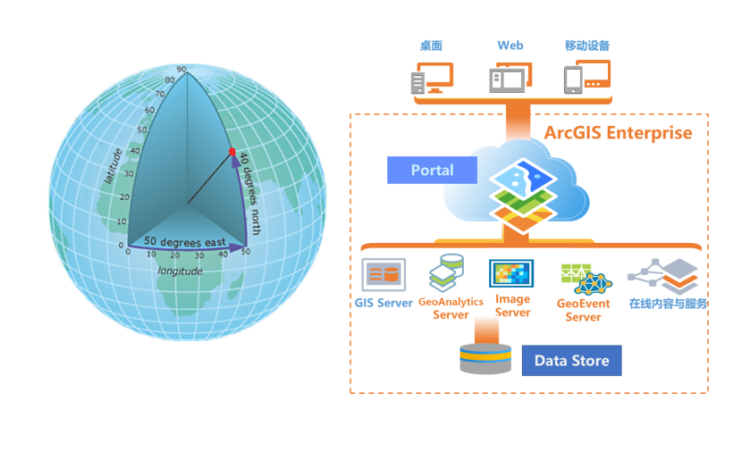
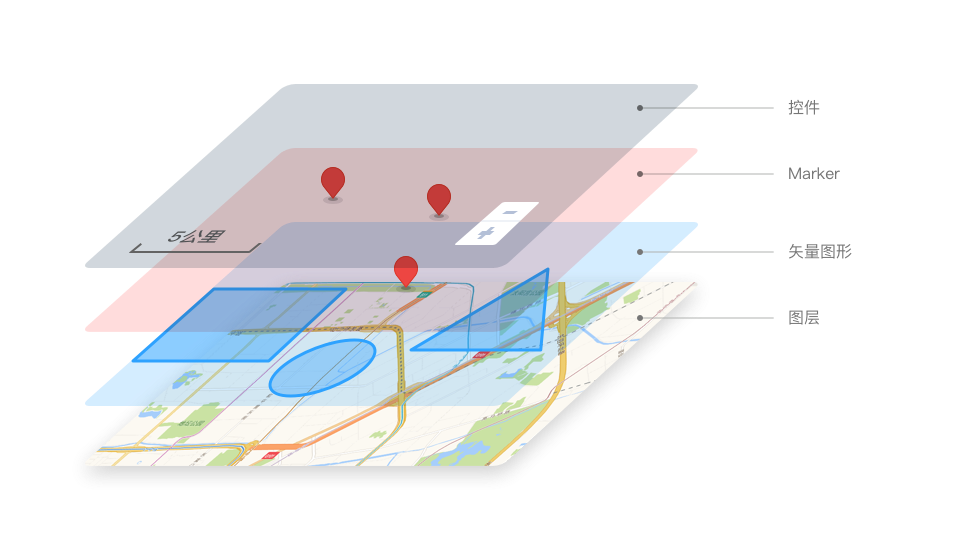
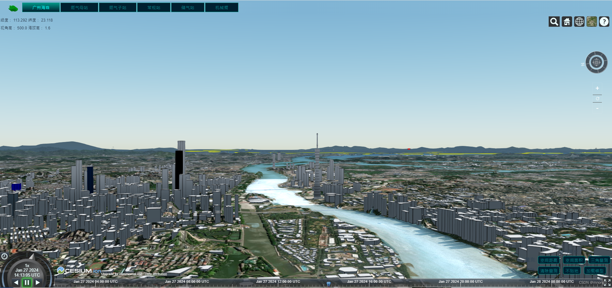

# 🌏 Cesium.js 三维地球可视化指南

> Cesium.js 是一个基于 JavaScript 开发的 WebGL 三维地球和地图可视化库，用于创建高性能的三维地球和地理可视化应用程序。

## 1. Cesium.js 简介

Cesium 利用现代 Web 技术（HTML5、WebGL 和 WebAssembly），提供跨平台和跨浏览器的三维地理空间数据可视化。它可以在现代的 Web 浏览器上实现实时的、交互式的地球和地理数据可视化。

### 1.1 核心特性

| 特性 | 描述 | 优势 |
|------|------|------|
| **高性能渲染** | 基于 WebGL 的 GPU 加速 | 🚀 实时渲染 |
| **多格式支持** | 支持多种地理数据格式 | 📊 数据兼容 |
| **可视化功能** | 丰富的地理可视化能力 | 🎨 效果丰富 |
| **跨平台兼容** | 支持多种操作系统和浏览器 | 🌐 广泛适用 |

### 1.2 技术优势

- **高性能**：利用 WebGL 绘制图形，使用 GPU 加速，实现高性能地球渲染和数据可视化
- **丰富的地理数据支持**：支持地形数据、矢量数据、影像数据等多种地理数据格式
- **强大的可视化功能**：提供地形渲染、矢量数据渲染、影像贴图、点线面符号化、动画效果等
- **交互和导航控制**：支持缩放、旋转、平移、倾斜等操作，让用户自由浏览地球模型
- **插件和扩展支持**：可通过扩展增加新功能，或利用现有插件快速实现特定需求
- **开源特性**：源代码完全公开，可自由使用并根据需要修改和扩展



## 2. 应用场景

Cesium.js 提供了丰富的功能和工具，适用于多种应用场景：

### 2.1 地理信息系统（GIS）应用

- 地图浏览与数据可视化
- 地理数据分析和查询
- 空间信息管理和编辑

### 2.2 地球科学研究

- 地质研究和分析
- 气候模拟和分析
- 地震数据可视化

### 2.3 航空航天应用

- 卫星轨道可视化
- 航线规划和模拟
- 飞行路径追踪

### 2.4 智慧城市建设

- 城市规划与设计
- 交通流量模拟与分析
- 城市监控与应急响应

### 2.5 军事模拟和训练

- 战场环境模拟
- 战术训练和演练
- 军事设施规划

### 2.6 特殊应用领域

- 虚拟现实（VR）和增强现实（AR）地理应用
- 地形仿真和分析
- 3D 建筑模型展示
- 实时位置追踪（船只、飞机、汽车等）
- 天文数据可视化（星图、卫星轨道、恒星位置等）

## 3. 地图构成原理

地图分层是地理信息系统的重要概念。麦克哈格提出的分层理论认为，地图应该按照时间先后排序：

- 最原始的环境组成部分（如岩石层）是第一层
- 然后往上叠加其他图层（如水、土壤、植被等）

<div style="display: flex; flex-wrap: wrap; gap: 10px; justify-content: center;">
  
  
</div>

<div style="display: flex; flex-wrap: wrap; gap: 10px; justify-content: center; margin-top: 10px;">
  
  
</div>



## 4. Cesium.js 使用指南

### 4.1 安装与配置

```bash
# 基础安装
npm install cesium

# Vite 项目安装专用插件
pnpm i cesium@1.99 vite-plugin-cesium

# 在 vite.config.js 中引入构建插件
import cesium from 'vite-plugin-cesium'

# 添加到 Vite 插件列表
{
  plugins: [
    vue(),
    cesium()
  ]
}
```

### 4.2 基础使用示例

```javascript
// 引入依赖
import Cesium from "cesium";

// HTML 中定义容器
// <div id="cesiumContainer"></div>

// 创建 Cesium Viewer 实例
const viewer = new Cesium.Viewer("cesiumContainer", {
  // 使用世界地形
  terrainProvider: Cesium.createWorldTerrain({ 
    requestWaterMask: true 
  }),
  
  // 配置选项
  baseLayerPicker: false,
  
  // 使用二维地图模式（如需要）
  sceneMode: Cesium.SceneMode.SCENE2D,
});

// 设置初始视图位置
viewer.camera.setView({
  destination: Cesium.Cartesian3.fromDegrees(
    116.391, // 经度
    39.904,  // 纬度
    20000    // 高度（米）
  )
});

// 加载 GeoJSON 数据
Cesium.GeoJsonDataSource.load("path/to/your/geojson/file.geojson")
  .then(function (dataSource) {
    // 将数据源添加到视图
    viewer.dataSources.add(dataSource);
    
    // 自动调整视图以聚焦数据
    viewer.zoomTo(dataSource);
  });

// 添加图层
const imageryLayer = new Cesium.ImageryLayer(
  new Cesium.UrlTemplateImageryProvider({
    url: "https://your-tile-server-url/{z}/{x}/{y}.png",
  })
);
viewer.imageryLayers.add(imageryLayer);

// 添加标记点
const entity = new Cesium.Entity({
  position: Cesium.Cartesian3.fromDegrees(116.391, 39.904),
  point: { 
    pixelSize: 10, 
    color: Cesium.Color.RED 
  },
  billboard: {
    image: "path/to/image.png", // 标记图片路径
    scale: 1.0,
  },
});
viewer.entities.add(entity);
```

### 4.3 高级功能示例

#### 4.3.1 添加多种实体

```javascript
// 添加点实体
const point = viewer.entities.add({
  position: Cesium.Cartesian3.fromDegrees(116.391, 39.904),
  point: {
    pixelSize: 10,
    color: Cesium.Color.RED,
    outlineColor: Cesium.Color.WHITE,
    outlineWidth: 2
  },
  label: {
    text: '标记点',
    font: '14pt monospace',
    style: Cesium.LabelStyle.FILL_AND_OUTLINE,
    outlineWidth: 2,
    verticalOrigin: Cesium.VerticalOrigin.BOTTOM,
    pixelOffset: new Cesium.Cartesian2(0, -9)
  }
});

// 添加线实体
const polyline = viewer.entities.add({
  polyline: {
    positions: Cesium.Cartesian3.fromDegreesArray([
      116.391, 39.904,
      116.401, 39.914
    ]),
    width: 2,
    material: new Cesium.PolylineGlowMaterialProperty({
      glowPower: 0.2,
      color: Cesium.Color.BLUE
    })
  }
});

// 添加多边形实体
const polygon = viewer.entities.add({
  polygon: {
    hierarchy: Cesium.Cartesian3.fromDegreesArray([
      116.391, 39.904,
      116.401, 39.904,
      116.401, 39.914,
      116.391, 39.914
    ]),
    material: Cesium.Color.GREEN.withAlpha(0.5),
    outline: true,
    outlineColor: Cesium.Color.BLACK
  }
});
```

#### 4.3.2 动画与时间控制

```javascript
// 设置时间轴范围
viewer.clock.startTime = Cesium.JulianDate.fromIso8601("2020-01-01");
viewer.clock.stopTime = Cesium.JulianDate.fromIso8601("2020-12-31");
viewer.clock.currentTime = Cesium.JulianDate.fromIso8601("2020-01-01");
viewer.clock.multiplier = 3600; // 时间流速
viewer.clock.clockRange = Cesium.ClockRange.LOOP_STOP;

// 添加动画实体
const position = computeCirclularFlight(viewer.clock.startTime);
const entity = viewer.entities.add({
  availability: new Cesium.TimeIntervalCollection([new Cesium.TimeInterval({
    start: viewer.clock.startTime,
    stop: viewer.clock.stopTime
  })]),
  position: position,
  model: {
    uri: 'path/to/model.glb',
    minimumPixelSize: 64
  },
  path: {
    resolution: 1,
    material: new Cesium.PolylineGlowMaterialProperty({
      glowPower: 0.1,
      color: Cesium.Color.YELLOW
    }),
    width: 10
  }
});
```

#### 4.3.3 交互事件处理

```javascript
// 鼠标点击事件
const handler = new Cesium.ScreenSpaceEventHandler(viewer.scene.canvas);

handler.setInputAction(function(click) {
  const pickedObject = viewer.scene.pick(click.position);
  if (Cesium.defined(pickedObject)) {
    const entity = pickedObject.id;
    if (entity) {
      console.log('点击了实体:', entity);
    }
  }
}, Cesium.ScreenSpaceEventType.LEFT_CLICK);

// 相机事件
viewer.camera.changed.addEventListener(function() {
  const cartographic = viewer.camera.positionCartographic;
  const height = cartographic.height;
  if (height < 1000) {
    // 相机高度小于 1000 米时的处理
    console.log('相机高度低于 1000 米');
  }
});
```

## 5. 性能优化

### 5.1 数据优化

```javascript
// 使用 3D Tiles 优化
const tileset = viewer.scene.primitives.add(
  new Cesium.Cesium3DTileset({
    url: 'path/to/tileset.json',
    maximumScreenSpaceError: 16, // 控制加载细节级别
    maximumMemoryUsage: 512      // 控制内存使用（MB）
  })
);

// 使用 Entity 聚合
const dataSource = new Cesium.CustomDataSource('clustering');
viewer.dataSources.add(dataSource);

const entities = dataSource.entities;
entities.clustering.enabled = true;
entities.clustering.pixelRange = 50;
entities.clustering.minimumClusterSize = 3;
```

### 5.2 渲染优化

```javascript
// 设置渲染参数
viewer.scene.globe.enableLighting = false;    // 禁用光照
viewer.scene.fog.enabled = false;             // 禁用雾效果
viewer.scene.globe.baseColor = Cesium.Color.BLACK; // 设置底色

// 限制相机视角
viewer.scene.screenSpaceCameraController.minimumZoomDistance = 1000;  // 最小缩放距离
viewer.scene.screenSpaceCameraController.maximumZoomDistance = 20000000;  // 最大缩放距离
```

## 参考资料

- [Cesium 官方文档](https://cesium.com/docs/)
- [Cesium GitHub 仓库](https://github.com/CesiumGS/cesium)
- [Cesium Sandcastle 示例](https://sandcastle.cesium.com/)
- [Cesium 中文网](https://www.cesium.com/docs/)