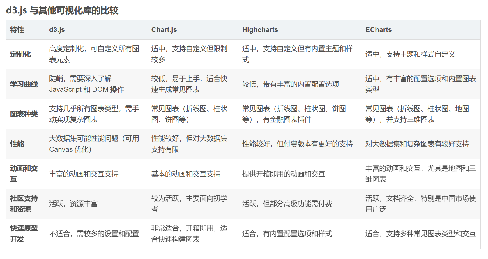

# 📊 D3.js 数据可视化指南

> D3.js（Data-Driven Documents）是一个强大的 JavaScript 数据可视化库，基于 Web 标准（HTML、SVG 和 CSS）实现数据驱动的文档操作。

## 1. D3.js 简介

D3.js 的核心是 SVG（可缩放矢量图形），它提供了将数据绑定到文档元素上，并通过这些元素进行数据可视化的能力。

### 1.1 核心特性

- **数据绑定**：将数据绑定到 DOM 元素，实现数据与视觉元素的同步
- **动态 DOM 更新**：根据数据变化动态更新 DOM 结构，无需重新加载页面
- **丰富的可视化元素**：支持条形图、散点图、饼图、树状图等多种图表类型
- **交互性**：支持缩放、拖动、点击等多种交互功能

## 2. 基础语法

D3.js 支持链式调用，类似 jQuery 的语法风格。

### 2.1 选择器

```javascript
// 选择匹配的第一个元素
d3.select(selector)

// 选择所有匹配元素
d3.selectAll(selector)
```

### 2.2 数据绑定

```javascript
// 为每个元素绑定相同的数据
.datum(value)

// 为每个元素分别绑定数组中的一项
.data([value])
```

### 2.3 比例尺

比例尺由三个要素组成：

```javascript
// 定义域
.domain([0, 10000])

// 值域
.range([0, 100])

// 对应法则（线性、对数等）
let scaleX = d3.scaleLinear()
  .domain([0, 10000])
  .range([0, 100])
```

### 2.4 坐标轴

坐标轴需要与比例尺配合使用：

```javascript
// X 轴，刻度在下方
d3.axisBottom(scale)

// Y 轴，刻度在右侧
d3.axisRight(scale)

// 其他方向
d3.axisTop(scale)
d3.axisLeft(scale)
```

### 2.5 过渡效果

```javascript
// 定义过渡
.transition()
  .duration(750)  // 持续时间
```

### 2.6 地图投影

```javascript
// 创建地图投影
d3.geo.mercator()
  .center([0, 30])     // 中心点
  .translate([w/2, h/2]) // 平移
  .scale(150)          // 缩放
```

## 3. 实战示例：创建柱形图

```html
<!DOCTYPE html>
<html>
<head>
    <script src="https://d3js.org/d3.v6.min.js"></script>
</head>
<body>
<script>
    // 数据准备
    const data = [120, 200, 150, 80, 70, 110, 130];
    
    // 图表尺寸设置
    const margin = { top: 20, right: 20, bottom: 30, left: 40 };
    const width = 600 - margin.left - margin.right;
    const height = 300 - margin.top - margin.bottom;
    
    // 创建 SVG 容器
    const svg = d3.select('body')
        .append('svg')
        .attr('width', width + margin.left + margin.right)
        .attr('height', height + margin.top + margin.bottom)
        .append('g')
        .attr('transform', `translate(${margin.left},${margin.top})`);
    
    // 比例尺设置
    const x = d3.scaleBand()
        .domain(d3.range(data.length))
        .rangeRound([0, width])
        .padding(0.1);
    
    const y = d3.scaleLinear()
        .domain([0, d3.max(data)])
        .rangeRound([height, 0]);
    
    // 绘制柱形
    svg.selectAll('.bar')
        .data(data)
        .enter()
        .append('rect')
        .attr('class', 'bar')
        .attr('x', (d, i) => x(i))
        .attr('y', d => y(d))
        .attr('width', x.bandwidth())
        .attr('height', d => height - y(d));
    
    // 添加坐标轴
    svg.append('g')
        .attr('class', 'axis')
        .attr('transform', `translate(0,${height})`)
        .call(d3.axisBottom(x));
    
    svg.append('g')
        .attr('class', 'axis')
        .call(d3.axisLeft(y).ticks(null, 's'))
        .append('text')
        .attr('x', -2)
        .attr('y', y(y.ticks().pop()) + 0.5)
        .attr('dy', '0.32em')
        .attr('fill', '#000')
        .attr('font-weight', 'bold')
        .attr('text-anchor', 'start')
        .text('Value');
</script>
</body>
</html>
```

## 4. 图表类型对比



### 4.1 复杂图表示例

Chord 图表布局示例：


## 参考资料

- [D3.js 官方文档](https://d3js.org/what-is-d3)
- [D3.js API 参考](https://github.com/d3/d3/blob/main/API.md)