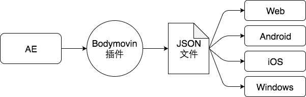

# 🎬 Lottie 动画库完全指南

## 1. Lottie 简介

Lottie 是一个适用于 Android、iOS、Web 和 Windows 的库，它使用 Bodymovin 解析导出为 JSON 的 Adobe After Effects 动画，并在移动设备和 Web 上本地呈现它们！



设计师用 AE 把动画效果做出来，再用 Bodymovin 导出相应的 JSON 文件给到前端，前端使用 Lottie 库就可以实现动画效果，无需费力地手动重新创建。功能简单且强大。

## 2. 为什么选择 Lottie

- **优于 GIF**：GIF 的大小是 Bodymovin JSON 的两倍多，并且以固定大小呈现，无法放大以匹配大型高密度屏幕。
- **优于 PNG 序列**：PNG 序列比 GIF 更糟糕，因为它们的文件大小通常是 Bodymovin JSON 大小的 30-50 倍，而且也无法放大。
- **动画矢量可绘制对象**（仅限 Android）：性能更高，因为它运行在 RenderThread 而不是主线程上。但仅支持 Lottie 功能的子集，无法手动设置进度，不支持文本或动态颜色，无法以编程方式或通过 Internet 加载。


## 3. 安装与配置

```bash
# 安装基础依赖
npm install lottie-web

# Vue版本依赖
npm install --save vue-lottie
```

## 4. 使用方法

### 4.1 基本用法

```html
<!-- 使用lottie容器 -->
<div id='lottie'></div>
```

```javascript
import lottie from 'lottie-web'

// 返回可以使用 play、pause、setSpeed 等控制的动画实例
var anim = lottie.loadAnimation({
  // 要渲染动画的 DOM 元素（必需）
  container: document.getElementById('lottie'),
  
  // 包含导出的动画数据的对象
  animationData: animationData,
  
  // 动画对象的相对路径（animationData 和 path 是互斥的）
  path: 'data.json',
  
  // 'svg' / 'canvas' / 'html' 来设置渲染器（必需）
  renderer: 'svg',
  
  // 渲染器设置
  rendererSettings: {
    // 使用现有的画布进行绘制
    context: canvasContext,
    scaleMode: 'noScale',
    clearCanvas: false,
    // svg可用：在需要时加载dom元素，加快大量元素的初始化速度
    progressiveLoad: false,
    // svg可用：当透明度为0时隐藏元素
    hideOnTransparent: true
  },
  
  // 是否循环播放
  loop: true,
  
  // 准备好后立即开始播放
  autoplay: true,
  
  // 动画名称以供将来参考
  name: "Hello World",
})
```

### 4.2 声明式用法

```html
<!-- 使用声明式：lottie.loadAnimation() 加载 .lottie 容器 -->
<div
  style="width:1067px;height:600px"
  class="lottie"
  data-animation-path="animation/"
  data-anim-loop="true"
  data-name="ninja">
</div>
```

### 4.3 在 Vue 中使用

```html
<!-- 使用vue-lottie组件 -->
<Lottie :options="{animationData}" :height="400" :width="400" v-on:animCreated="handleAnimation"/>
```

```javascript
import Lottie from 'vue-lottie';
import * as animationData from './assets/pinjump.json';

export default {
  components: {
    Lottie
  },
  data() {
    return {
      animationData: animationData.default
    }
  },
  methods: {
    handleAnimation(anim) {
      // 可以在这里控制动画
      anim.play();
      // anim.stop();
    }
  }
}
```

## 5. API 参考

### 5.1 实例属性

| 属性 | 类型 | 说明 |
|------|------|------|
| `isStopped` | boolean | 动画是否停止 |
| `isPaused` | boolean | 动画是否暂停 |
| `eventListeners` | readonly EventListener[] | 监听事件数组 |
| `speed` | number | 动画播放速度 |
| `direction` | number | 动画播放方向 |
| `style` | CSSProperties | CSS 样式属性 |
| `width` | number \| string | 动画宽度 |
| `height` | number \| string | 动画高度 |

### 5.2 实例方法

```javascript
// 基本控制方法
anim.play()       // 播放动画
anim.stop()       // 停止动画
anim.pause()      // 暂停动画
anim.destroy()    // 销毁动画实例

// 设置方法
anim.setLocationHref(locationHref)  // 在 url 没有符号的 safari 中遇到掩码问题时使用
anim.setSpeed(speed)                // 设置速度（1 为正常速度）
anim.setDirection(direction)        // 设置方向（1 是正常方向）
anim.setSubframe(flag)              // 如果为 false，遵循原始 AE fps；如果为 true，尽可能多地更新（默认为 true）

// 跳转和播放控制
anim.goToAndStop(value, isFrame)    // 跳转到指定时间或帧并停止
anim.goToAndPlay(value, isFrame)    // 跳转到指定时间或帧并播放
anim.playSegments(segments, forceFlag)  // 播放指定片段
```

### 5.3 事件监听

```javascript
// 事件监听
anim.addEventListener('complete', () => { /* 动画完成时 */ })
anim.addEventListener('loopComplete', () => { /* 当前循环完成时 */ })
anim.addEventListener('enterFrame', () => { /* 进入新帧时触发 */ })
anim.addEventListener('loaded_images', () => { /* 图片加载完毕时 */ })
anim.addEventListener('config_ready', () => { /* 初始配置完成后 */ })
anim.addEventListener('data_ready', () => { /* 当动画的所有部分都已加载时 */ })
anim.addEventListener('DOMLoaded', () => { /* 当元素已添加到 DOM 时 */ })
anim.addEventListener('segmentStart', () => { /* 动画片段开始时 */ })
anim.addEventListener('destroy', () => { /* 销毁时 */ })
```

### 5.4 静态方法

```javascript
// 全局控制方法
lottie.play([animationName])        // 播放指定名称的动画或所有动画
lottie.stop([animationName])        // 停止指定名称的动画或所有动画
lottie.setSpeed(speed)              // 设置所有动画的速度
lottie.setDirection(direction)      // 设置所有动画的方向
lottie.resize([animationName])      // 重新调整动画尺寸

// 初始化和管理方法
lottie.searchAnimations()           // 查找类为 "lottie" 的元素并初始化
lottie.loadAnimation()              // 返回要单独控制的 Animation 实例
lottie.destroy()                    // 销毁和释放资源，DOM 元素将被清空
lottie.registerAnimation()          // 注册动画（需要有 data-animation-path 属性）
lottie.setQuality()                 // 设置质量，默认为 'high'，可选 'high'、'medium'、'low'
```

## 6. 高级用法

### 6.1 动画片段控制

```javascript
// 播放特定片段
// 第一个参数是单个数组或多个数组，每个数组有两个值（fromFrame, toFrame）
// 第二个参数是布尔值，用于立即强制新段落
anim.playSegments([[0, 50], [60, 100]], true);

// 跳转到特定帧并播放
anim.goToAndPlay(25, true);  // 跳转到第25帧并播放

// 跳转到特定帧并停止
anim.goToAndStop(50, true);  // 跳转到第50帧并停止
```

### 6.2 动态修改属性

```javascript
// 修改播放速度
anim.setSpeed(0.5);  // 半速播放
anim.setSpeed(2);    // 两倍速播放

// 修改播放方向
anim.setDirection(-1);  // 反向播放
anim.setDirection(1);   // 正向播放
```

## 7. 性能优化

1. **选择合适的渲染器**：
   - 对于简单动画，使用 SVG 渲染器
   - 对于复杂动画，考虑使用 Canvas 渲染器提高性能

2. **合理设置渲染选项**：
   ```javascript
   rendererSettings: {
     progressiveLoad: true,  // 渐进式加载
     hideOnTransparent: true // 隐藏透明元素
   }
   ```

3. **避免过大的 JSON 文件**：
   - 简化 After Effects 中的动画
   - 减少不必要的关键帧
   - 避免使用过多的图层和效果

4. **按需加载动画**：
   - 使用 path 而不是 animationData 来延迟加载
   - 只在需要时初始化动画

## 8. 参考资源

- [Lottie 官方文档](https://airbnb.design/lottie/)
- [GitHub 仓库](https://github.com/airbnb/lottie-web)
- [Bodymovin After Effects 插件](https://exchange.adobe.com/creativecloud.details.12557.html)
- [Lottie 动画示例库](https://lottiefiles.com/)