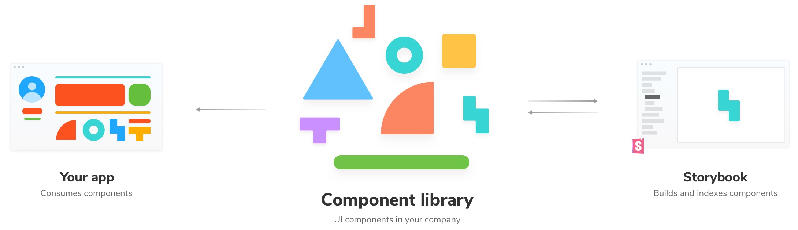
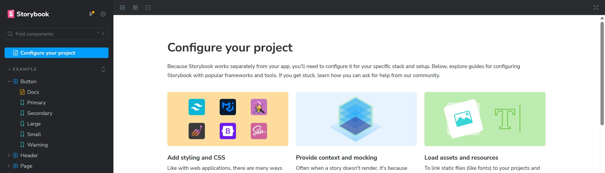

# 📚 Storybook 组件开发环境完全指南

> 使用 Storybook 进行可视化组件测试是非常简单和友好的，为组件开发提供完整的开发和测试环境。

::: info 🌟 核心特性
- **可视化测试** - 组件的实时可视化和交互
- **组件文档** - 自动生成详细的组件文档
- **实时交互** - 属性修改和事件监听
- **调试工具** - 完整的调试和测试支持
:::

## 🎯 Storybook 简介

Storybook 是一个强大的组件开发环境，它允许你在隔离的环境中构建、测试和文档化组件。

### ✨ 主要优势

| 特性 | 描述 | 优势 |
|------|------|------|
| **易于编写测试** | 采用与典型网络应用程序相同的方式渲染组件 | 🧪 简化测试编写过程 |
| **组件文档** | 组件的输入和输出属性都有详细的文档说明 | 📖 自动生成文档 |
| **实时交互** | 属性可以修改、组件可以渲染和交互 | ⚡ 即时反馈 |
| **调试功能** | 提供前后箭头，一步步进行测试 | 🔍 强大的调试能力 |
| **API 模拟** | 可以选择让 API 调用以正常方式执行或进行模拟 | 🎭 灵活的测试环境 |
| **无头执行** | 支持在 CI 管道中通过命令行运行测试 | 🤖 自动化测试 |
| **并行运行** | 开箱即支持并行化 | 🚀 提升测试效率 |
| **测试覆盖率** | 使用 --coverage 标志生成 lcov 报告 | 📊 代码覆盖率分析 |



## 📦 安装与配置

### 🚀 快速开始

```bash
# 安装基于 Vue3 + Vite 版本的 Storybook
npm install --save-dev @storybook/vue3-vite
npm install --save-dev @storybook/vue3

# 初始化 Storybook 项目
npx storybook@latest init

# 更新 Storybook 版本
npx storybook@latest upgrade

# 启动 Storybook 命令
npm run storybook
```

启动后会在浏览器中加载出一个页面：



## ⚙️ 配置文件

### 📋 主配置文件 `.storybook/main.js`

```typescript
import type { StorybookConfig } from "@storybook/vue3-vite";

const config: StorybookConfig = {
  framework: {
    name: "@storybook/vue3-vite",
    // framework 的 builder 配置项
    options: {
      docgen: {
        // 组件数据来源
        plugin: "vue-docgen-api" | "vue-component-meta",
        // 覆盖默认 ts 配置
        tsconfig: "tsconfig.app.json",
      },
    },
  },
  
  // Story 文件路径配置
  stories: ["../src/components/**/*.stories.js"],
  
  // 静态资源目录
  staticDirs: ["../public"],
  
  // 插件配置
  addons: [
    "@storybook/addon-links",
    "@storybook/addon-essentials",
    "@storybook/addon-interactions",
  ],
  
  // 构建器配置
  core: {
    builder: "@storybook/builder-webpack5",
  },
  
  // 功能配置
  features: {
    interactionsDebugger: true,
  },
};

export default config;
```

### 🎨 预览配置 `.storybook/preview.js|ts`

```javascript
import { setup } from "@storybook/vue3";
import "../src/index.css";

// 扩展 Vue 应用
setup(app => {
  app.use(MyPlugin);
  app.component("my-component", MyComponent);
  app.mixin({
    // My mixin
  });
});

// 控制 Storybook 功能和插件的行为：配置 actions（模拟回调）如何被处理
export const parameters = {
  actions: { 
    argTypesRegex: "^on[A-Z].*" 
  },
  controls: {
    matchers: {
      color: /(background|color)$/i,
      date: /Date$/,
    },
  },
};
```

## 🧩 创建组件

### 📝 示例组件 `src/components/Task.vue`

```vue
<template>
  <div :class="classes">
    <label
      :for="'checked' + task.id"
      :aria-label="'archiveTask-' + task.id"
      class="checkbox">
      <input
        type="checkbox"
        :checked="isChecked"
        disabled
        :name="'checked' + task.id"
        :id="'archiveTask-' + task.id" />
      <span class="checkbox-custom" @click="archiveTask" />
    </label>
    
    <label :for="'title-' + task.id" :aria-label="task.title" class="title">
      <input
        type="text"
        readonly
        :value="task.title"
        :id="'title-' + task.id"
        name="title"
        placeholder="Input title" />
    </label>
    
    <button
      v-if="!isChecked"
      class="pin-button"
      @click="pinTask"
      :id="'pinTask-' + task.id"
      :aria-label="'pinTask-' + task.id">
      <span class="icon-star" />
    </button>
  </div>
</template>

<script>
import { reactive, computed } from "vue";

export default {
  name: "Task",
  
  props: {
    task: {
      type: Object,
      required: true,
      default: () => ({ id: "", state: "", title: "" }),
      validator: task => ["id", "state", "title"].every(key => key in task),
    },
  },
  
  emits: ["archive-task", "pin-task"],

  setup(props, { emit }) {
    props = reactive(props);
    
    return {
      // 计算样式类
      classes: computed(() => ({
        "list-item TASK_INBOX": props.task.state === "TASK_INBOX",
        "list-item TASK_PINNED": props.task.state === "TASK_PINNED",
        "list-item TASK_ARCHIVED": props.task.state === "TASK_ARCHIVED",
      })),
      
      /**
       * 计算属性：检查任务状态
       */
      isChecked: computed(() => props.task.state === "TASK_ARCHIVED"),
      
      /**
       * 事件处理器：归档任务
       */
      archiveTask() {
        emit("archive-task", props.task.id);
      },
      
      /**
       * 事件处理器：置顶任务
       */
      pinTask() {
        emit("pin-task", props.task.id);
      },
    };
  },
};
</script>

<style scoped>
.list-item {
  display: flex;
  align-items: center;
  padding: 12px 16px;
  border-bottom: 1px solid #e0e0e0;
}

.checkbox {
  margin-right: 12px;
}

.title {
  flex: 1;
}

.pin-button {
  background: none;
  border: none;
  cursor: pointer;
}

.TASK_ARCHIVED {
  opacity: 0.6;
}

.TASK_PINNED {
  background-color: #f0f8ff;
}
</style>
```

## 📚 创建 Story

### 🎭 基础 Story `src/components/Task.stories.js`

```javascript
// 引入需要测试的组件
import Task from "./Task.vue";

// 默认导出：Story 的元数据
export default {
  title: "Example/Task",
  component: Task,
  parameters: {
    // 可选参数：在组件级别设置
    layout: "fullscreen",
  },
  // 定义 argTypes 来控制 controls 面板
  argTypes: {
    onPinTask: { action: "pin-task" },
    onArchiveTask: { action: "archive-task" },
  },
};

// 创建模板函数
const Template = (args) => ({
  components: { Task },
  setup() {
    return { args };
  },
  template: '<Task v-bind="args" @pin-task="onPinTask" @archive-task="onArchiveTask" />',
});

// 导出各种状态的 Story
export const Default = Template.bind({});
Default.args = {
  task: {
    id: "1",
    title: "Test Task",
    state: "TASK_INBOX",
    updatedAt: new Date(2021, 0, 1, 9, 0),
  },
};

export const Pinned = Template.bind({});
Pinned.args = {
  task: {
    ...Default.args.task,
    state: "TASK_PINNED",
  },
};

export const Archived = Template.bind({});
Archived.args = {
  task: {
    ...Default.args.task,
    state: "TASK_ARCHIVED",
  },
};

// 长标题的边界情况
export const LongTitle = Template.bind({});
LongTitle.args = {
  task: {
    ...Default.args.task,
    title: "This task's name is absurdly large. In fact, I think if I keep going I might end up with content overflow. What will happen? The star that represents a pinned task could have text overlapping. The text could cut-off abruptly when it reaches the star. I hope not!",
  },
};
```

### 🧪 交互测试 Story

```javascript
import { userEvent, within, expect } from "@storybook/test";

// 添加交互测试
export const InteractiveTask = Template.bind({});
InteractiveTask.args = Default.args;

// 定义交互测试
InteractiveTask.play = async ({ canvasElement }) => {
  const canvas = within(canvasElement);
  
  // 查找置顶按钮并点击
  const pinButton = canvas.getByRole("button", { name: /pinTask/ });
  await userEvent.click(pinButton);
  
  // 验证事件是否被触发
  await expect(pinButton).toBeInTheDocument();
};
```

## 🎨 高级功能

### 📖 自动文档生成

```javascript
// 在 Story 中添加文档
export default {
  title: "Example/Task",
  component: Task,
  parameters: {
    docs: {
      description: {
        component: "任务组件用于显示单个任务项，支持置顶和归档操作。",
      },
    },
  },
};

// 为特定 Story 添加描述
export const Default = Template.bind({});
Default.parameters = {
  docs: {
    description: {
      story: "这是任务的默认状态，显示在收件箱中。",
    },
  },
};
```

### 🎛️ Controls 配置

```javascript
export default {
  title: "Example/Task",
  component: Task,
  argTypes: {
    task: {
      description: "任务对象",
      control: { type: "object" },
    },
    onPinTask: {
      description: "置顶任务时触发的事件",
      action: "pin-task",
    },
    onArchiveTask: {
      description: "归档任务时触发的事件", 
      action: "archive-task",
    },
  },
};
```

### 🎭 装饰器 (Decorators)

```javascript
// 全局装饰器
export const decorators = [
  (story) => ({
    components: { story },
    template: '<div style="margin: 3em;"><story /></div>',
  }),
];

// Story 级别装饰器
export const WithMargin = Template.bind({});
WithMargin.decorators = [
  () => ({
    template: '<div style="margin: 50px;"><story /></div>',
  }),
];
```

## 🔧 测试配置

### 🧪 测试运行器

```bash
# 安装测试运行器
npm install --save-dev @storybook/test-runner

# 运行测试
npm run test-storybook

# 运行测试并生成覆盖率报告
npm run test-storybook -- --coverage
```

### 📊 覆盖率配置

```javascript
// .storybook/test-runner.js
module.exports = {
  async preRender(page) {
    // 在每个 story 渲染前执行
    await page.evaluateOnNewDocument(() => {
      window.console.log("Story 即将渲染");
    });
  },
  
  async postRender(page) {
    // 在每个 story 渲染后执行
    const elementHandler = await page.$("#root");
    const innerHTML = await elementHandler.innerHTML();
    expect(innerHTML).toMatchSnapshot();
  },
};
```

## 🚀 最佳实践

### 📝 Story 命名规范

```javascript
// 好的做法：语义化命名
export const Default = Template.bind({});
export const Loading = Template.bind({});
export const Error = Template.bind({});
export const Empty = Template.bind({});

// 避免：无意义命名
export const Story1 = Template.bind({});
export const Story2 = Template.bind({});
```

### 🎯 组件隔离

```javascript
// 确保每个 Story 都是独立的
export const Independent = Template.bind({});
Independent.args = {
  // 完整的 props 定义
  task: {
    id: "unique-id",
    title: "Independent Task",
    state: "TASK_INBOX",
  },
};
```

### 🔄 数据模拟

```javascript
// 使用 Mock Service Worker 模拟 API
import { rest } from "msw";

export const parameters = {
  msw: {
    handlers: [
      rest.get("/api/tasks", (req, res, ctx) => {
        return res(
          ctx.json([
            { id: "1", title: "Task 1", state: "TASK_INBOX" },
            { id: "2", title: "Task 2", state: "TASK_PINNED" },
          ])
        );
      }),
    ],
  },
};
```

::: tip 💡 开发建议
1. **组件优先** - 先开发组件，再编写 Story
2. **状态覆盖** - 为组件的所有状态创建 Story
3. **边界测试** - 测试极端情况和边界条件
4. **文档同步** - 保持 Story 和组件文档的同步
:::

::: warning ⚠️ 注意事项
- 确保 Story 中的数据是静态的，避免依赖外部状态
- 使用装饰器时注意样式隔离
- 定期更新 Storybook 版本以获得最新功能
:::

## 📚 扩展阅读

- [Storybook 官方文档](https://storybook.js.org/)
- [Vue Storybook 指南](https://storybook.js.org/docs/vue/get-started/introduction)
- [测试最佳实践](https://storybook.js.org/docs/vue/writing-tests/introduction)
- [部署 Storybook](https://storybook.js.org/docs/vue/sharing/publish-storybook)
