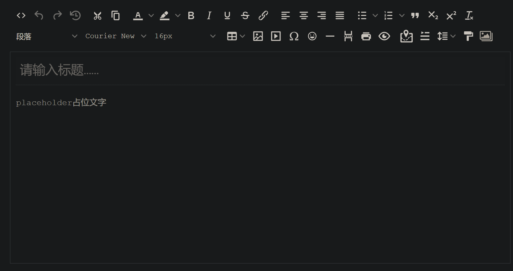
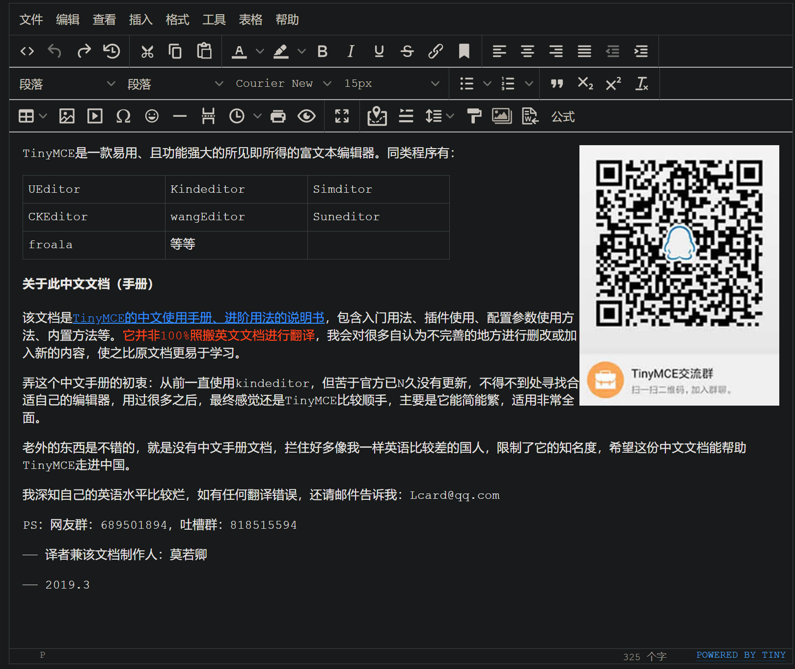
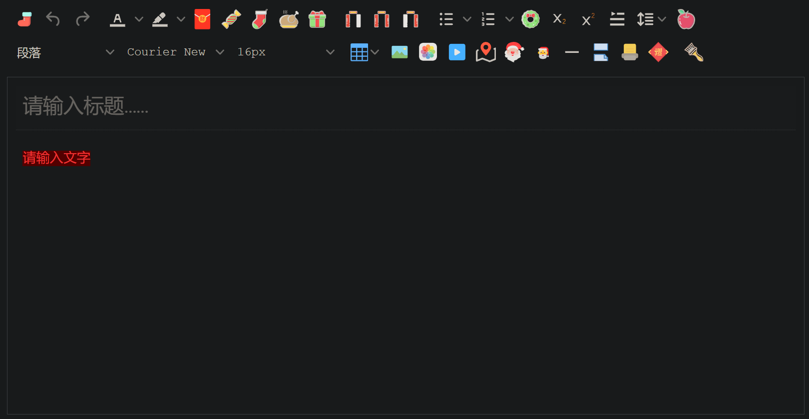

# 📝 TinyMCE 富文本编辑器完全指南

## 1. TinyMCE 简介

TinyMCE 是一款易用、且功能强大的所见即所得的富文本编辑器。同类程序有：UEditor、Kindeditor、Simditor、CKEditor、wangEditor、Suneditor、froala 等等。配置项非常多，详细参考：[TinyMCE 中文文档](http://tinymce.ax-z.cn/)。

### 1.1 主要优势

- **开源可商用**：基于 LGPL2.1 协议
- **插件丰富**：自带插件基本涵盖日常所需功能
- **接口丰富**：可扩展性强，有能力可以无限拓展功能
- **界面美观**：符合现代审美
- **多种模式**：提供经典、内联、沉浸无干扰三种模式
- **标准支持**：对 Web 标准支持优秀（自 v5 开始）
- **多语言支持**：官网可下载几十种语言包

## 2. 使用方法

### 2.1 基础使用

```html
<!-- 引入脚本 -->
<script src='tinymce.min.js'></script>

<!-- 定义 TinyMCE 容器节点 -->
<form method="post">
    <textarea id="mytextarea">
      当 form 提交时，TinyMCE 会将内容塞进 textarea，你可以通过正常的 post 方法获取到编辑器中的内容，行为与普通 textarea 完全一致。
    </textarea>
</form>

<!-- 将 TinyMCE 初始化为页面的一部分 -->
<script>
tinymce.init({
  selector: '#mytextarea'
});
</script>
```

## 3. 编辑器模式

### 3.1 内联模式

内联模式最大的好处，是内容完全继承自外层定义的样式，真正实现了"所见即所得"。但要注意，请小心使用杀伤力比较大的自定义 CSS，因为这样可能会覆盖 TinyMCE 控件的 CSS，导致编辑器显示异常。



```javascript
tinymce.init({
    selector: '#tinydemo', // 容器，可使用 CSS 选择器
    language: 'zh_CN',     // 调用放在 langs 文件夹内的语言包
    toolbar: false,        // 隐藏工具栏
    menubar: false,        // 隐藏菜单栏
    inline: true,          // 开启内联模式
    plugins: ['quickbars', 'link', 'table'], // 选择需加载的插件
    // 选中时出现的快捷工具，与插件有依赖关系
    quickbars_selection_toolbar: 'bold italic forecolor | link blockquote quickimage',
});
```

### 3.2 经典模式

下方是几乎开启全部功能的经典模式：



```javascript
tinymce.init({
    selector: '#tinydemo2',
    width: 600,
    height: 800,
    min_height: 400,
    // skin: 'oxide-dark', // 设置皮肤
    language: 'zh_CN',
    // 显示隐藏状态栏
    statusbar: false,
    // 指定哪些一级菜单显示，或调整菜单顺序
    menubar: 'file edit insert view format table tools help',
    // 指定菜单栏及下拉菜单上放置的项目
    menu: {
        file: {title: '文件', items: 'newdocument'},
        edit: {title: '编辑', items: 'undo redo | cut copy paste pastetext | selectall'},
        insert: {title: '插入', items: 'link media | template hr'},
        view: {title: '查看', items: 'visualaid'},
        format: {title: '格式', items: 'bold italic underline strikethrough superscript subscript | formats | removeformat'},
        table: {title: '表格', items: 'inserttable tableprops deletetable | cell row column'},
        tools: {title: '工具', items: 'spellchecker code'}
    },
    // 当 TinyMCE 检测到当前环境为移动设备时，该参数允许你配置在移动设备生效的配置参数
    mobile: {
        plugins: ['autosave', 'lists', 'autolink'],
        toolbar: ['undo', 'bold', 'italic', 'styleselect']
    },
    // 自定义图标 baseURL/icons/custom/icons.js
    icons_url: '/icons/custom/icons.js',
    icons: 'custom',
    // 插件配置
    plugins: 'print preview searchreplace autolink directionality visualblocks visualchars fullscreen image link media template code codesample table charmap hr pagebreak nonbreaking anchor insertdatetime advlist lists wordcount imagetools textpattern help emoticons autosave bdmap indent2em autoresize formatpainter axupimgs',
    // 工具栏配置
    toolbar: 'code undo redo restoredraft | cut copy paste pastetext | forecolor backcolor bold italic underline strikethrough link anchor | alignleft aligncenter alignright alignjustify outdent indent | \
    styleselect formatselect fontselect fontsizeselect | bullist numlist | blockquote subscript superscript removeformat | \
    table image media charmap emoticons hr pagebreak insertdatetime print preview | fullscreen | bdmap indent2em lineheight formatpainter axupimgs',
    /*content_css: [ // 可设置编辑区内容展示的 CSS，谨慎使用
        '/static/reset.css',
        '/static/ax.css',
        '/static/css.css',
    ],*/
    fontsize_formats: '12px 14px 16px 18px 24px 36px 48px 56px 72px',
    font_formats: '微软雅黑=Microsoft YaHei,Helvetica Neue,PingFang SC,sans-serif;苹果苹方=PingFang SC,Microsoft YaHei,sans-serif;宋体=simsun,serif;仿宋体=FangSong,serif;黑体=SimHei,sans-serif;Arial=arial,helvetica,sans-serif;Arial Black=arial black,avant garde;Book Antiqua=book antiqua,palatino;',
    link_list: [
        { title: '预置链接1', value: 'http://www.tinymce.com' },
        { title: '预置链接2', value: 'http://tinymce.ax-z.cn' }
    ],
    image_list: [
        { title: '预置图片1', value: 'https://www.tiny.cloud/images/glyph-tinymce@2x.png' },
        { title: '预置图片2', value: 'https://www.baidu.com/img/bd_logo1.png' }
    ],
    image_class_list: [
        { title: 'None', value: '' },
        { title: 'Some class', value: 'class-name' }
    ],
    importcss_append: true,
    // 自定义文件选择器的回调内容
    file_picker_callback: function(callback, value, meta) {
        if (meta.filetype === 'file') {
            callback('https://www.baidu.com/img/bd_logo1.png', { text: 'My text' });
        }
        if (meta.filetype === 'image') {
            callback('https://www.baidu.com/img/bd_logo1.png', { alt: 'My alt text' });
        }
        if (meta.filetype === 'media') {
            callback('movie.mp4', { source2: 'alt.ogg', poster: 'https://www.baidu.com/img/bd_logo1.png' });
        }
    },
    // 给相对路径指定它所相对的基本路径
    images_upload_base_path: '/demo',
    // 指定一个接受上传文件的后端处理程序地址
    images_upload_url: '/demo/upimg.php',
    // 自定义图片上传逻辑
    images_upload_handler: function(blobInfo, succFun, failFun) {
        var xhr, formData;
        var file = blobInfo.blob(); // 转化为易于理解的 file 对象
        xhr = new XMLHttpRequest();
        xhr.withCredentials = false;
        xhr.open('POST', '/demo/upimg.php');
        xhr.onload = function() {
            var json;
            if (xhr.status != 200) {
                failFun('HTTP Error: ' + xhr.status);
                return;
            }
            json = JSON.parse(xhr.responseText);
            if (!json || typeof json.location != 'string') {
                failFun('Invalid JSON: ' + xhr.responseText);
                return;
            }
            succFun(json.location);
        };
        formData = new FormData();
        formData.append('file', file, file.name); // 此处与源文档不一样
        xhr.send(formData);
    },
    toolbar_sticky: true,
    autosave_ask_before_unload: false,
});
```

### 3.3 自定义 UI

TinyMCE 支持高度自定义的用户界面，可以根据需求调整工具栏、菜单和其他 UI 元素。



## 4. 核心功能与配置

### 4.1 常用配置项

| 配置项 | 说明 | 示例值 |
|-------|------|--------|
| `selector` | 指定编辑器容器 | `'#editor'`, `'.editor'` |
| `height` | 编辑器高度 | `500` |
| `width` | 编辑器宽度 | `800` |
| `plugins` | 启用的插件列表 | `'autolink link image lists'` |
| `toolbar` | 工具栏配置 | `'bold italic | alignleft aligncenter'` |
| `menubar` | 菜单栏配置 | `'file edit view'` |
| `language` | 语言设置 | `'zh_CN'` |
| `inline` | 是否使用内联模式 | `true` 或 `false` |

### 4.2 插件系统

TinyMCE 提供了丰富的插件系统，可以根据需求启用不同的功能：

- **编辑增强**：`autoresize`, `autolink`, `autosave`
- **媒体处理**：`image`, `media`, `imagetools`
- **格式控制**：`lists`, `table`, `code`, `wordcount`
- **特殊功能**：`emoticons`, `template`, `preview`

### 4.3 自定义上传处理

TinyMCE 允许自定义文件上传处理逻辑，可以与后端系统无缝集成：

```javascript
// 自定义图片上传处理
images_upload_handler: function(blobInfo, success, failure) {
    var formData = new FormData();
    formData.append('file', blobInfo.blob(), blobInfo.filename());
    
    fetch('/upload/endpoint', {
        method: 'POST',
        body: formData
    })
    .then(response => response.json())
    .then(result => {
        if (result.location) {
            success(result.location);
        } else {
            failure('上传失败：' + result.message);
        }
    })
    .catch(error => {
        failure('上传出错：' + error.message);
    });
}
```

## 5. 高级功能

### 5.1 自定义插件开发

TinyMCE 支持开发自定义插件，扩展编辑器功能：

```javascript
// 注册自定义插件
tinymce.PluginManager.add('myplugin', function(editor, url) {
    // 添加按钮
    editor.ui.registry.addButton('mybutton', {
        text: '自定义按钮',
        onAction: function() {
            editor.insertContent('Hello World!');
        }
    });
    
    // 添加菜单项
    editor.ui.registry.addMenuItem('mymenuitem', {
        text: '自定义菜单项',
        onAction: function() {
            editor.insertContent('Hello from menu!');
        }
    });
    
    // 返回元数据
    return {
        getMetadata: function() {
            return {
                name: '自定义插件',
                url: 'https://example.com'
            };
        }
    };
});
```

### 5.2 Node.js 环境使用

TinyMCE 也可以在 Node.js 环境中使用，例如在服务端渲染应用中：

```javascript
const tinymce = require('tinymce');

// 配置 TinyMCE
tinymce.init({
    // 配置项
});
```

### 5.3 与框架集成

TinyMCE 可以与各种前端框架集成：

**React 集成示例**:

```jsx
import { Editor } from '@tinymce/tinymce-react';

function MyEditor() {
    return (
        <Editor
            apiKey="your-api-key"
            init={{
                plugins: 'link image code',
                toolbar: 'undo redo | bold italic | alignleft aligncenter alignright | code'
            }}
            initialValue="<p>初始内容</p>"
            onEditorChange={(content) => console.log(content)}
        />
    );
}
```

**Vue 集成示例**:

```vue
<template>
    <editor
        api-key="your-api-key"
        :init="{
            plugins: 'link image code',
            toolbar: 'undo redo | bold italic | alignleft aligncenter alignright | code'
        }"
        v-model="content"
    />
</template>

<script>
import Editor from '@tinymce/tinymce-vue';

export default {
    components: { Editor },
    data() {
        return {
            content: '<p>初始内容</p>'
        };
    }
};
</script>
```

## 6. 最佳实践

### 6.1 性能优化

- **按需加载插件**：只加载必要的插件，减少资源占用
- **合理设置高度**：避免过高的编辑器导致页面滚动问题
- **延迟初始化**：在需要时才初始化编辑器，提高页面加载速度

### 6.2 安全性考虑

- **内容过滤**：使用 `valid_elements` 和 `extended_valid_elements` 配置项过滤不安全的 HTML
- **XSS 防护**：启用 `convert_urls` 和 `relative_urls` 选项，避免跨站点脚本攻击
- **文件上传限制**：在服务端实现文件类型和大小限制，防止恶意文件上传

### 6.3 无障碍性

TinyMCE 支持无障碍功能，可以通过以下配置增强可访问性：

```javascript
tinymce.init({
    selector: '#editor',
    // 增强无障碍性的配置
    a11y_advanced_options: true,
    // 为图片添加 alt 文本提示
    image_advtab: true,
    // 添加键盘快捷键支持
    setup: function(editor) {
        editor.on('keydown', function(e) {
            // 自定义键盘操作
        });
    }
});
```

## 7. 参考资源

- [TinyMCE 官方网站](https://www.tiny.cloud/)
- [TinyMCE 中文文档](http://tinymce.ax-z.cn/)
- [TinyMCE GitHub 仓库](https://github.com/tinymce/tinymce)
- [TinyMCE 插件开发指南](https://www.tiny.cloud/docs/advanced/creating-a-plugin/)