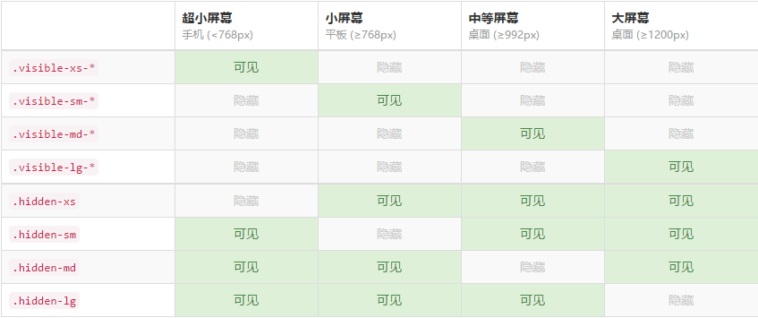
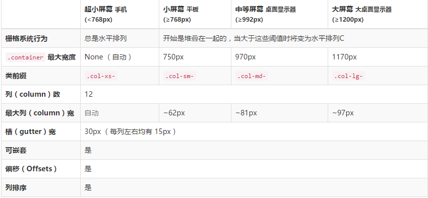

# 🎨 Bootstrap 前端框架完全指南

> Bootstrap 是简单、灵活的用于搭建 WEB 页面的 HTML、CSS、JavaScript 的工具集，是最受欢迎的响应式前端框架。

## 1. Bootstrap 简介

Bootstrap 基于 HTML5 和 CSS3，具有漂亮的设计、友好的学习曲线、卓越的兼容性，还有 12 列响应式栅格结构，丰富的组件等等。按照官网的宣传来说，Bootstrap 是最受欢迎的 HTML、CSS 和 JS 框架，用于开发响应式布局、移动设备优先的 WEB 项目。

### 1.1 核心特性

| 特性 | 描述 | 优势 |
|------|------|------|
| **响应式设计** | 移动设备优先的响应式栅格系统 | 📱 适配各种屏幕尺寸 |
| **丰富组件** | 预构建的 UI 组件和插件 | 🧩 快速构建界面 |
| **易于定制** | 可通过 LESS/Sass 变量定制 | 🎨 灵活的样式控制 |
| **跨浏览器兼容** | 支持现代浏览器和 IE8+ | 🌐 广泛的兼容性 |

## 2. 文件结构与基本模板

Bootstrap 源码包含了预先编译的 CSS、JavaScript 和图标字体文件，并且还有 LESS、JavaScript 和文档的源码。主要文件组织结构如下：

```bash
bootstrap/
├── less/      # css 源文件
├── js/        # js 源文件
├── fonts/     # 字体文件
├── dist/      # 预编译的资源文件
│   ├── css/   # 预编译的 css 文件
│   ├── js/    # 预编译的 js 文件
│   └── fonts/ # 预编译的字体文件
└── docs/      # 文档
    └── examples/  # 示例代码
```

### 2.1 基本模板

```html
<!DOCTYPE html>
<html lang="zh-CN">
  <head>
    <!-- utf-8编码-->
    <meta charset="utf-8" />
    <!-- 在IE运行最新的渲染模式-->
    <meta http-equiv="X-UA-Compatible" content="IE=edge" />
    <!--视口viewport设置-->
    <meta name="viewport" content="width=device-width, initial-scale=1" />
    <!-- 上述3个meta标签*必须*放在最前面，任何其他内容都*必须*跟随其后！ -->
    <title>Bootstrap 101 Template</title>
    <!-- 引入Bootstrap -->
    <link href="css/bootstrap.min.css" rel="stylesheet" />
    <!-- 在IE8-浏览器中，支持HTML5新标签和媒体查询@media-->
    <!--[if lt IE 9]>
      <script src="https://cdn.bootcss.com/html5shiv/3.7.3/html5shiv.min.js"></script>
      <script src="https://cdn.bootcss.com/respond.js/1.4.2/respond.min.js"></script>
    <![endif]-->
  </head>
  <body>
    <h1>你好，世界！</h1>
    <!-- 先引入jQuery，再引入bootstrap插件 -->
    <script src="js/jquery.min.js"></script>
    <script src="js/bootstrap.min.js"></script>
  </body>
</html>
```

## 3. 排版与样式

Bootstrap 对默认的 HTML 元素进行了 CSS 样式定义，使得各种基本结构套用出来的 HTML 页面更加美观。

### 3.1 文本样式

- `.h1` 到 `.h6` 类：给内联文本赋予标题样式
- `.lead`：突出显示文本
- `.small`：设置小号字体
- `.mark`：突出显示文本
- `.pre-scrollable`：带滚动条的预格式化文本
- `.text-left`、`.text-center`、`.text-right`、`.text-justify`、`.text-nowrap`：文本对齐方式
- `.text-muted`、`.text-primary`、`.text-success`、`.text-info`、`.text-warning`、`.text-danger`：文本颜色
- `.text-lowercase`、`.text-uppercase`、`.text-capitalize`：文本大小写
- `.initialism`：首字母缩略词
- `.blockquote`、`.blockquote-reverse`：引用和右对齐引用
- `.help-block`：帮助文本
- `.text-nowrap`、`.text-truncate`：文本溢出处理
- `.text-hide`：隐藏文本

### 3.2 列表样式

- `.list-group`：创建列表组
- `.list-group-item`：创建列表组项
- `.list-group-item-success`、`.list-group-item-info`、`.list-group-item-warning`、`.list-group-item-danger`：列表组项颜色
- `.list-group-item-heading`、`.list-group-item-text`：列表组项标题和内容
- `.list-unstyled`：移除列表默认样式
- `.list-inline`：将列表转换为行内项目

### 3.3 背景与状态

- `.bg-*`：设置背景颜色
- `.success`、`.info`、`.warning`、`.danger`：设置背景颜色
- `.active`、`.disabled`：激活和禁用状态样式

### 3.4 显示与隐藏

- `.invisible`、`.visible-*`：显示或隐藏元素
- `.show`、`.hidden`：显示或隐藏元素
- `.visible-*`、`.hidden-*`：根据视口宽度显示或隐藏元素
- `.visible-print-block`、`.hidden-print`：打印时显示或隐藏元素
- `.print-only`、`.screen-only`：打印/屏幕专用显示
- `.print-only-block`、`.screen-only-block`：打印/屏幕专用块级显示



## 4. 布局与栅格系统

### 4.1 基础布局类

- `.inline-block`：内联块级元素
- `.center-block`：水平居中
- `.pull-right`、`.pull-left`：浮动方向
- `.clearfix`：清除浮动
- `.container`、`.container-fluid`：固定宽度和全宽容器

### 4.2 栅格系统

- `.row` 和 `.col-*`：创建行和列
- `.row-eq-*`：等高栅格
- `.row-no-gutters`：无间隔栅格
- `.col-xs-*`、`.col-sm-*`、`.col-md-*`、`.col-lg-*`、`.col-xl-*`：响应式列宽
- `.col-*-offset-*`：列偏移
- `.col-*-pull-*`、`.col-*-push-*`：列排序



## 5. 组件

Bootstrap 提供了丰富的组件，使用这些组件需要先加载 jQuery 和 bootstrap.js。

### 5.1 警告框与进度条

- `.alert`、`.alert-*`：警告框及颜色变体
- `.alert-dismissible`：可关闭的警告框
- `.alert-link`：警告框中的高亮链接
- `.progress`：进度条容器
- `.progress-striped`：条纹进度条（添加 `.active` 可实现动态条纹）
- `.progress-bar`：进度条
- `.progress-bar-striped`：条纹进度条
- `.progress-bar-*`：进度条颜色变体

### 5.2 表格与分页

- `.table`：基础表格样式
- `.table-striped`、`.table-bordered`、`.table-hover`、`.table-condensed`：表格变体
- `.table-responsive`：响应式表格
- `.pagination`：分页容器
- `.pagination-lg`、`.pagination-sm`：大小分页

### 5.3 面板与媒体对象

- `.panel-group`：面板组
- `.panel`：面板容器
- `.panel-heading`、`.panel-body`、`.panel-footer`：面板结构
- `.panel-default`、`.panel-primary`、`.panel-success`、`.panel-info`、`.panel-warning`、`.panel-danger`：面板颜色变体
- `.media`：媒体对象容器
- `.media-left`、`.media-right`、`.media-body`：媒体对象结构
- `.media-heading`：媒体对象标题
- `.media-middle`、`.media-bottom`：媒体对象位置
- `.page-header`：页头
- `.jumbotron`：巨幕
- `.thumbnail`：缩略图

### 5.4 按钮与表单

- `.btn`：按钮基础类
- `.btn-group`、`.btn-group-vertical`：按钮组
- `.btn-group-justified`：两端对齐按钮组
- `.btn-group-lg`、`.btn-group-sm`：按钮组大小
- `.btn-default`、`.btn-primary`、`.btn-success`、`.btn-info`、`.btn-warning`、`.btn-danger`：按钮颜色
- `.form-horizontal`、`.form-inline`：表单布局
- `.form-group`：表单组
- `.form-control`：表单控件
- `.input-group`：输入框组
- `.has-success`、`.has-warning`、`.has-error`：表单状态

### 5.5 响应式图片与标签

- `.img-responsive`：响应式图片
- `.img-rounded`、`.img-circle`、`.img-thumbnail`：图片样式变体
- `.label`：标签
- `.badge`：徽章

## 6. 组件示例

必须调用 Bootstrap 框架提供的 bootstrap.js 文件。因为 Bootstrap 的组件交互效果都是依赖于 jQuery 库写的插件，所以在使用 bootstrap.js 之前一定要先加载 jquery.js 才会产生效果。

### 6.1 导航与下拉菜单

```html
<!-- 导航条 -->
<div class="navbar navbar-default" role="navigation">
  <div class="navbar-header">
    <a href="##" class="navbar-brand">部件 logo </a>
  </div>
  <!-- 导航：选项卡 胶囊 垂直方向 自适应 breadcrumb面包屑导航-->
  <ul class="nav nav-tabs nav-pills nav-stacked nav-justified">
    <li class="active"><a href="##">Home</a></li>
    <li><a href="##">CSS3</a></li>
    <li><a href="##">Sass</a></li>
    <li><a href="##">jQuery</a></li>
    <li class="disabled"><a href="##">Responsive</a></li>
  </ul>
  <!-- 导航搜索框 -->
  <form action="##" class="navbar-form navbar-left" role="search">
    <div class="form-group">
      <input type="text" class="form-control" placeholder="请输入关键词" />
    </div>
    <button type="submit" class="btn btn-default">搜索</button>
  </form>
</div>

<!-- 下拉菜单 -->
<div class="dropdown">
  <button
    class="btn btn-default dropdown-toggle"
    type="button"
    id="dropdownMenu1"
    data-toggle="dropdown"
    aria-haspopup="true"
    aria-expanded="true">
    Dropdown
    <span class="caret"></span>
  </button>
  <ul class="dropdown-menu" aria-labelledby="dropdownMenu1">
    <li role="presentation" class="dropdown-header">第一部分菜单头部</li>
    <li><a href="#">Action</a></li>
    <li><a href="#">Another action</a></li>
    <li role="separator" class="divider"></li>
    <li role="presentation" class="dropdown-header">第二部分菜单头部</li>
    <li><a href="#">Something else here</a></li>
  </ul>
</div>
```

### 6.2 模态框与选项卡

```html
<!-- 触发模态弹出窗的元素 -->
<button
  type="button"
  data-toggle="modal"
  data-target="#mymodal"
  class="btn btn-primary">
  点击
</button>
<!-- 模态框 -->
<div id="mymodal" class="modal fade">
  <div class="modal-dialog modal-lg">
    <div class="modal-content">
      <div class="modal-header">
        <button type="button" class="close" data-dismiss="modal">
          <span aria-hidden="true">&times;</span><span class="sr-only">Close</span>
        </button>
        <h4 class="modal-title">模态弹出窗标题</h4>
      </div>
      <div class="modal-body">
        <p>模态弹出窗主体内容</p>
      </div>
      <div class="modal-footer">
        <button type="button" class="btn btn-default" data-dismiss="modal">关闭</button>
        <button type="button" class="btn btn-primary">保存</button>
      </div>
    </div>
  </div>
</div>

<!-- 选项卡菜单-->
<ul id="myTab" class="nav nav-tabs" role="tablist">
  <li class="active">
    <a href="#bulletin" role="tab" data-toggle="tab">公告</a>
  </li>
  <li><a href="#rule" role="tab" data-toggle="tab">规则</a></li>
</ul>
<!-- 选项卡面板 -->
<div id="myTabContent" class="tab-content">
  <div class="tab-pane active" id="bulletin">公告内容面板</div>
  <div class="tab-pane" id="rule">规则内容面板</div>
  <div class="tab-pane" id="forum">论坛内容面板</div>
</div>
```

### 6.3 提示框与弹出框

```html
<!-- 提示框 -->
<button
  type="button"
  class="btn btn-default"
  data-toggle="tooltip"
  data-placement="top"
  data-original-title="hover触发"
  data-animation="false"
  data-delay="500"
  data-trigger="hover">
  hover触发 无动画 延迟500ms
</button>

<!-- 弹出框 -->
<button
  type="button"
  class="btn btn-default"
  data-toggle="popover"
  data-placement="bottom"
  data-animation="false"
  data-trigger="hover"
  data-delay="500"
  title="标题"
  data-content="下侧">
  下侧 无动画 hover触发 延迟500ms
</button>
```

### 6.4 JavaScript 初始化

```javascript
$(function () {
  // 触发选项卡菜单
  $("#myTab a").click(function (e) {
    e.preventDefault();
    $(this).tab("show");
  });

  // 滚动监听
  $("#scrollspy").scrollspy({ target: "#myNavbar" });

  // js触发模态框
  $("#myModal").modal({
    backdrop: "static",
    keyboard: false, //用户按ESC键关闭模态弹出窗
    show: false
  });
  
  // 触发提示框
  $('[data-toggle="tooltip"]').tooltip({
    container: "body",
    placement: "bottom",
    trigger: "hover",
    delay: { show: 500, hide: 100 },
    html: true
  });
  
  // 触发弹出框
  $('[data-toggle="popover"]').popover({
    title: "我是标题",
    content: "我是内容",
    html: true,
    placement: "bottom",
    trigger: "hover"
  });
});
```

## 7. 插件系统

Bootstrap 的 JavaScript 插件都依赖于 jQuery 库，使用前必须先导入 jQuery。

### 7.1 插件列表

Bootstrap 提供了以下 12 种 JavaScript 插件：

- 动画过渡（Transitions）：transition.js
- 模态弹窗（Modal）：modal.js
- 下拉菜单（Dropdown）：dropdown.js
- 滚动侦测（Scrollspy）：scrollspy.js
- 选项卡（Tab）：tab.js
- 提示框（Tooltips）：tooltop.js
- 弹出框（Popover）：popover.js
- 警告框（Alert）：alert.js
- 按钮（Buttons）：button.js
- 折叠/手风琴（Collapse）：collapse.js
- 图片轮播（Carousel）：carousel.js
- 自动定位浮标（Affix）：affix.js

### 7.2 使用方式

可以选择一次性导入所有插件，或者根据需要单独导入：

```html
<!-- 全部导入 -->
<script src="js/jquery.min.js"></script>
<script src="js/bootstrap.min.js"></script>

<!-- 或单独导入所需插件 -->
<script src="js/jquery.min.js"></script>
<script src="js/transition.js"></script>
<script src="js/modal.js"></script>
```

## 8. 参考资料

- [Bootstrap 官方文档](https://getbootstrap.com/docs/)
- [Bootstrap 中文网](https://www.bootcss.com/)
- [Bootstrap 主题市场](https://themes.getbootstrap.com/)
- [Bootstrap GitHub 仓库](https://github.com/twbs/bootstrap)