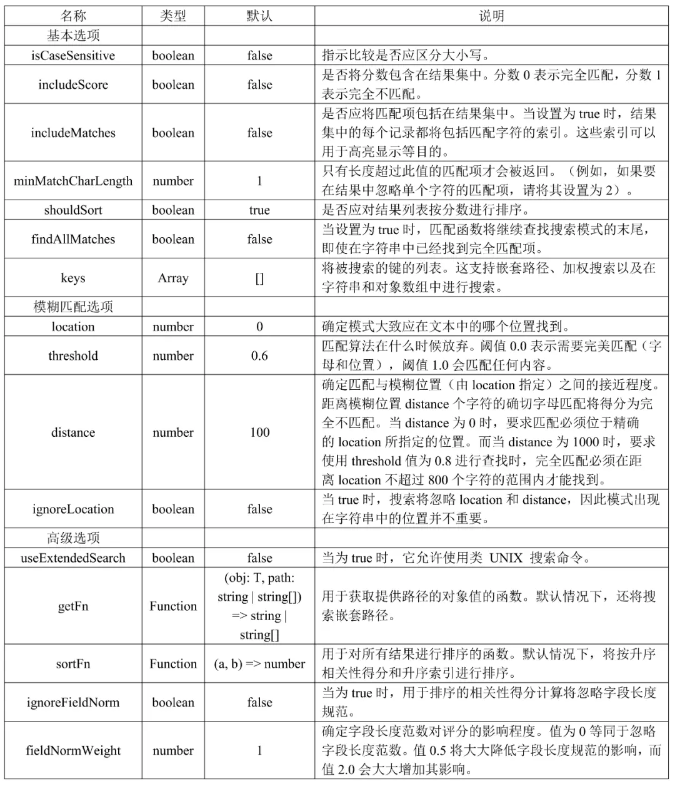
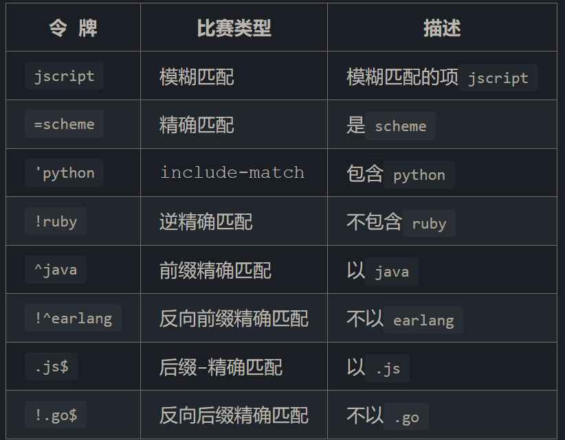

# 🔍 Fuse.js 模糊搜索库完全指南

> Fuse.js 是一款功能强大且轻量级的 JavaScript 模糊搜索库，支持 OpenAtom OpenHarmony（以下简称"OpenHarmony"）操作系统，它具备模糊搜索和排序等功能。该库高性能、易于使用、高度可配置，支持多种数据类型和多语言搜索，适用于各种场景，如搜索引擎、电子商务网站和数据可视化，可以帮助用户在包含大量数据的环境中快速地找到相关的搜索结果，并支持高度可定制化的搜索选项。

::: info 官方文档
详细文档请参考：[Fuse.js 官方网站](https://www.fusejs.io/)
:::

## 1. 基础使用

### 1.1 安装与引入

```bash
# NPM
npm install fuse.js

# Yarn
yarn add fuse.js

# PNPM
pnpm add fuse.js
```

```javascript
// ES Module 引入
import Fuse from 'fuse.js'

// CommonJS 引入
const Fuse = require('fuse.js')
```

### 1.2 基本示例

```javascript
// 创建一个包含书籍信息的列表数组，作为待搜索的数据
const list = [
  {
    "title": "Old Man's War",
    "author": "John Scalzi",
    "tags": ["fiction"]
  },
  {
    "title": "The Lock Artist",
    "author": "Steve",
    "tags": ["thriller"]
  }
]

// 配置搜索选项
const options = {
  // 是否将分数包含在结果集中
  includeScore: true,
  // 指定搜索的键
  keys: ['author', 'tags']
}

// 创建 Fuse 搜索实例
const fuse = new Fuse(list, options)

// 执行搜索，查找包含 'tion' 的结果
const result = fuse.search('tion')

// 搜索结果示例：
// [
//   {
//     "item": {
//       "title": "Old Man's War",
//       "author": "John Scalzi",
//       "tags": ["fiction"]
//     },
//     "refIndex": 0,
//     "score": 0.03
//   }
// ]
```

## 2. 配置选项详解

Fuse.js 提供了丰富的配置选项，可以根据需求进行自定义：

### 2.1 核心选项

| 选项 | 类型 | 默认值 | 描述 |
|------|------|--------|------|
| `keys` | `Array<String\|Object>` | - | 指定要搜索的属性路径 |
| `includeScore` | `Boolean` | `false` | 是否在结果中包含分数 |
| `includeMatches` | `Boolean` | `false` | 是否在结果中包含匹配项 |
| `minMatchCharLength` | `Number` | `1` | 只返回长度超过此值的匹配项 |
| `shouldSort` | `Boolean` | `true` | 是否按分数排序结果 |
| `findAllMatches` | `Boolean` | `false` | 找到匹配项后是否继续查找 |
| `limit` | `Number` | `100` | 返回的最大结果数量 |

### 2.2 模糊匹配选项

```javascript
const options = {
  // 匹配阈值：0.0 表示完全匹配，1.0 表示完全不匹配
  threshold: 0.6,
  
  // 模糊位置：确定模式大致应在文本中的位置
  location: 0,
  
  // 模糊距离：确定匹配与模糊位置之间的接近程度
  distance: 100,
  
  // 是否忽略位置和距离设置
  ignoreLocation: false,
  
  // 是否区分大小写
  isCaseSensitive: false
}
```

### 2.3 高级选项

```javascript
const options = {
  // 是否启用扩展搜索模式（支持 UNIX 搜索命令）
  useExtendedSearch: false,
  
  // 自定义获取对象值的函数
  getFn: (obj, path) => { /* 返回值 */ },
  
  // 自定义排序函数
  sortFn: (a, b) => a.score - b.score,
  
  // 是否忽略字段长度规范化
  ignoreFieldNorm: false,
  
  // 字段长度规范对评分的影响权重
  fieldNormWeight: 1
}
```

### 2.4 完整配置示例

```javascript
const options = {
  // 基本选项
  includeScore: true,
  isCaseSensitive: false,
  keys: ['author', 'tags'],
  includeMatches: false,
  minMatchCharLength: 1,
  shouldSort: true,
  findAllMatches: false,
  limit: 100,
  
  // 模糊匹配选项
  threshold: 0.6,
  location: 0,
  distance: 100,
  ignoreLocation: false,
  
  // 高级选项
  useExtendedSearch: false,
  getFn: (obj, path) => { /* 自定义获取值逻辑 */ },
  sortFn: (a, b) => a.score - b.score,
  ignoreFieldNorm: false,
  fieldNormWeight: 1
}
```



## 3. 全局配置

通过 `Fuse.config` 可以设置全局配置，会影响所有 Fuse 实例：

```javascript
// 自定义全局 getFn 函数
const options = {
  getFn: (obj, path) => {
    // 使用默认的 get 函数获取初始值
    const value = Fuse.config.getFn(obj, path)
    // 对值进行自定义处理
    return value
  }
}

// 其他全局配置项也可以类似设置
```

## 4. 静态方法

Fuse.js 提供了几个静态方法，用于优化大数据集的搜索性能：

### 4.1 索引创建与使用

```javascript
// 示例数据
const books = [
  {
    "title": "Old Man's War",
    "author": {
      "firstName": "John",
      "lastName": "Scalzi"
    }
  },
  {
    "title": "The Lock Artist",
    "author": {
      "firstName": "Steve",
      "lastName": "Hamilton"
    }
  }
  // 更多数据...
]

// 定义搜索选项
const options = { keys: ['title', 'author.firstName'] }

// 预先生成索引，提高大数据集的实例化速度
const myIndex = Fuse.createIndex(options.keys, books)

// 使用预生成的索引创建 Fuse 实例
const fuse = new Fuse(books, options, myIndex)
```

### 4.2 索引序列化与解析

```javascript
// 序列化索引并保存
fs.writeFile('fuse-index.json', JSON.stringify(myIndex.toJSON()))

// 加载序列化的索引
const fuseIndex = await require('fuse-index.json')

// 解析序列化的索引
const myIndex = Fuse.parseIndex(fuseIndex)

// 使用解析后的索引创建 Fuse 实例
const fuse = new Fuse(books, options, myIndex)
```

## 5. 实例方法

Fuse.js 实例提供了多种方法用于搜索和管理数据集：

### 5.1 搜索方法

```javascript
// 基础数据
let data = [
  {
    "title": "Old Man's War",
    "name": "Old Man's War",
    "author": {
      "first.name": "John",
      "last.name": "Scalzi",
      "age": "61",
      "tags": [
        {
          "value": "American"
        }
      ]
    }
  }
]

// 高级搜索配置
const options = {
  useExtendedSearch: true,
  includeScore: true,
  
  // 使用加权搜索
  keys: [
    { name: 'title', weight: 0.3, getFn: (book) => book.title },
    { name: 'authorName', weight: 0.7, getFn: (book) => book.author.name }
  ]
}

// 也可以使用多种路径表示法指定搜索键
const options2 = {
  keys: [
    'title', 'name',
    ['author', 'first.name'],
    ['author', 'last.name'],
    ['author.tags.value'],  // 使用点表示法
    ['author', 'tags', 'value'],  // 使用数组表示法
    'author.age'
  ]
}

// 创建 Fuse 实例
const fuse = new Fuse(data, options)
```

### 5.2 搜索语法示例

```javascript
// 基本字符串搜索
fuse.search('查询字符串')

// 正则表达式搜索
fuse.search(/[abc]/)

// 扩展搜索语法 (需要 useExtendedSearch: true)
// 包含 "Man" 和 "Old"，或者以 "Artist" 结尾
fuse.search("'Man 'Old | Artist$")

// 对象语法搜索
fuse.search({
  $and: [{ name: 'abc' }, { title: 'xyz' }],
  $or: [{ name: 'abc' }, { name: 'def' }]
})

// 处理包含点的键
fuse.search({
  $and: [
    { $path: ['author', 'first.name'], $val: 'jon' },
    { $path: ['author', 'last.name'], $val: 'scazi' },
    { $or: [{ title: '^lock' }, { title: '!arts' }] }
  ]
})
```

### 5.3 集合管理方法

```javascript
// 创建简单集合
const fruits = ['apple', 'orange']
const fuse = new Fuse(fruits)

// 设置/替换整个文档集合
fuse.setCollection(['banana', 'pear'])

// 添加元素到集合
fuse.add('grape')

// 移除符合条件的元素
const results = fuse.remove((doc) => {
  return doc === 'banana' || doc === 'pear'
})

// 移除指定位置的元素
fuse.removeAt(1)

// 获取索引信息
const index = fuse.getIndex()
console.log(index.size())
```

## 6. 搜索模式详解

Fuse.js 支持多种搜索模式，特别是在启用 `useExtendedSearch: true` 时：

### 6.1 基本搜索运算符

- **空格**：充当 AND 运算符
- **`|`**：充当 OR 运算符
- **双引号**：用于精确匹配，如 `="scheme language"`

### 6.2 扩展搜索运算符

| 运算符 | 描述 | 示例 |
|--------|------|------|
| `^` | 完全匹配 | `^hello` |
| `!` | 否定匹配 | `!hello` |
| `'` | 包含匹配 | `'hello` |
| `~` | 模糊匹配 | `~hello` |
| `*` | 前缀通配符 | `*ello` |
| `,` | 序列匹配 | `one, two` |



### 6.3 复杂查询示例

```javascript
// 以 "Man" 开头，包含 "War"，不包含 "Old"
fuse.search("^Man 'War !Old")

// "Apple" 或 "Orange"，且包含 "fruit"
fuse.search("(Apple | Orange) 'fruit")

// 模糊匹配 "banana"，且以 "yellow" 开头
fuse.search("~banana ^yellow")
```

## 7. 最佳实践

### 7.1 性能优化

- 对于大型数据集，预先创建并保存索引
- 合理设置 `threshold` 和 `distance` 参数
- 只搜索必要的字段，减少 `keys` 数量
- 考虑使用 `limit` 限制结果数量

### 7.2 搜索质量提升

- 调整 `threshold` 值：降低可获得更精确的结果，提高可获得更多结果
- 使用加权搜索，为重要字段赋予更高权重
- 对于特定场景，考虑自定义 `getFn` 和 `sortFn`

### 7.3 常见问题解决

- 搜索结果不准确：检查 `threshold` 和 `distance` 设置
- 搜索太慢：考虑预先创建索引或减少搜索字段
- 没有结果：检查 `threshold` 是否设置过低

## 8. 参考资源

- [Fuse.js 官方文档](https://www.fusejs.io/)
- [GitHub 仓库](https://github.com/krisk/Fuse)
- [NPM 包](https://www.npmjs.com/package/fuse.js)
- [相关教程与示例](https://fusejs.io/examples.html)