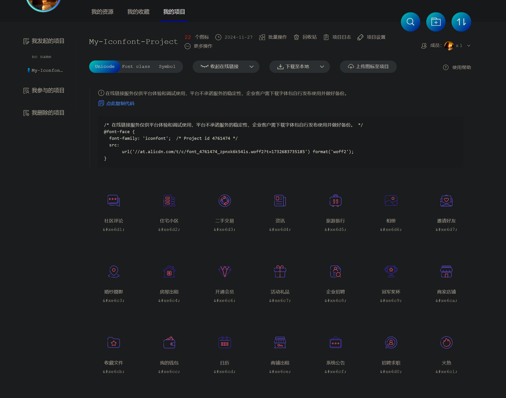

# 🎨 Iconfont 图标库使用指南

## 1. Iconfont 简介

Iconfont 是由阿里巴巴打造的矢量图标库，用户可以通过其平台管理和使用各种图标。使用 Iconfont 的主要步骤包括注册账号、创建项目、搜索并添加所需的图标到项目中，最后通过不同的方式将图标引入到项目中。

**官网**：[http://iconfont.cn/](http://iconfont.cn/)



## 2. 使用流程

1. 提前建好一个项目，会生成一个用来引入到项目代码的链接
2. 把喜欢的字体图标添加入库
3. 把入库的图标，添加进项目中
4. 三种方式引入字体图标到项目中：
   - Unicode
   - Font Class
   - Symbol

## 3. Unicode 引用方式

Unicode 是字体在网页端最原始的应用方式，特点是：

- **兼容性最好**：支持 IE6+，及所有现代浏览器
- **灵活调整**：支持按字体的方式去动态调整图标大小、颜色等
- **彩色支持**：新版 Iconfont 支持彩色字体图标，兼容所有现代浏览器

### 使用方式

```css
/**第一步：拷贝项目下面生成的 font-face */
@font-face {
    font-family: 'iconfont';
    src: url('iconfont.eot');
    src: url('iconfont.eot?#iefix') format('embedded-opentype'),
    url('iconfont.woff') format('woff'),
    url('iconfont.ttf') format('truetype'),
    url('iconfont.svg#iconfont') format('svg');
}

/**第二步：定义使用 iconfont 的样式 */
.iconfont {
    font-family: "iconfont" !important;
    font-size: 16px;
    font-style: normal;
    -webkit-font-smoothing: antialiased;
    -webkit-text-stroke-width: 0.2px;
    -moz-osx-font-smoothing: grayscale;
}

/**第三步：挑选相应图标并获取字体编码，应用于页面 */
<i class="iconfont">&#x33;</i>
```

## 4. Font-class 引用方式

Font-class 是 Unicode 使用方式的一种变种，主要是解决 Unicode 书写不直观，语意不明确的问题。

与 Unicode 使用方式相比，具有如下特点：

- **兼容性良好**：支持 IE8+，及所有现代浏览器
- **语义明确**：相比于 Unicode 语意更明确，书写更直观，可以很容易分辨这个 icon 是什么
- **易于替换**：因为使用 class 来定义图标，所以当要替换图标时，只需要修改 class 里面的 Unicode 引用
- **单色限制**：因为本质上还是使用的字体，所以多色图标还是不支持的

### 使用步骤

```html
<!-- 第一步：拷贝项目下面生成的 fontclass 代码： -->
<link rel="stylesheet" href="//at.alicdn.com/t/font_8d5l8fzk5b87iudi.css">

<!-- 第二步：挑选相应图标并获取类名，应用于页面： -->
<i class="iconfont icon-xxx"></i>
```

## 5. Symbol 引用方式

这是一种全新的使用方式，应该说这才是未来的主流，也是平台目前推荐的用法。这种用法其实是做了一个 SVG 的集合，与上面两种相比具有如下特点：

- **多色支持**：支持多色图标，不再受单色限制
- **灵活样式**：通过一些技巧，支持像字体那样，通过 `font-size`、`color` 来调整样式
- **兼容性限制**：兼容性较差，支持 IE9+，及现代浏览器
- **性能考量**：浏览器渲染 SVG 的性能一般，还不如 PNG

### 使用步骤

```html
<!-- 第一步：引入项目下面生成的 symbol 代码： -->
<script src="//at.alicdn.com/t/font_8d5l8fzk5b87iudi.js"></script>

<!-- 第二步：加入通用 CSS 代码（引入一次就行）： -->
<style type="text/css">
    .icon {
       width: 1em;
       height: 1em;
       vertical-align: -0.15em;
       fill: currentColor;
       overflow: hidden;
    }
</style>

<!-- 第三步：挑选相应图标并获取类名，应用于页面： -->
<svg class="icon" aria-hidden="true">
    <use xlink:href="#icon-xxx"></use>
</svg>
```

## 6. 使用方式对比

| 特性 | Unicode | Font-class | Symbol |
|------|---------|------------|--------|
| 兼容性 | 最好 (IE6+) | 良好 (IE8+) | 一般 (IE9+) |
| 多色图标 | 支持（新版） | 不支持 | 支持 |
| 语义化 | 差 | 好 | 好 |
| 使用便捷性 | 一般 | 好 | 好 |
| 性能 | 好 | 好 | 一般 |
| 推荐场景 | 追求兼容性 | 常规项目 | 现代浏览器/多色需求 |

## 7. 最佳实践

### 7.1 性能优化

- **按需引入**：只引入项目中需要的图标，减少不必要的资源加载
- **合理缓存**：设置适当的缓存策略，减少重复请求
- **选择合适的引用方式**：根据项目需求选择合适的引用方式

### 7.2 使用技巧

- **自定义图标**：可以上传自己设计的图标到 Iconfont 平台
- **项目协作**：团队成员可以共享同一个项目，方便协作
- **版本管理**：Iconfont 平台支持图标库的版本管理，方便回退

### 7.3 常见问题解决

- **图标不显示**：检查引用路径是否正确，字体文件是否加载成功
- **样式冲突**：注意避免类名冲突，可以使用命名空间
- **移动端适配**：注意在移动端的显示效果，可能需要调整大小

## 8. 参考资源

- [Iconfont 官方文档](http://iconfont.cn/help/detail?helptype=code)
- [阿里巴巴矢量图标库](http://www.iconfont.cn/)
- [SVG 图标与 Web 字体图标全面对比](https://www.zhangxinxu.com/wordpress/2018/08/svg-symbol-icon-vs-font-icon/)