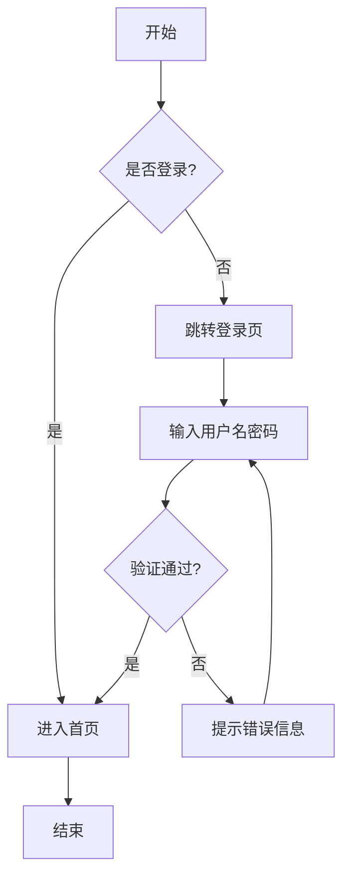
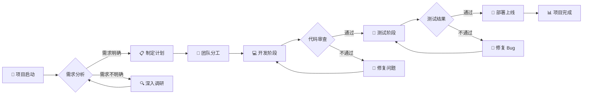
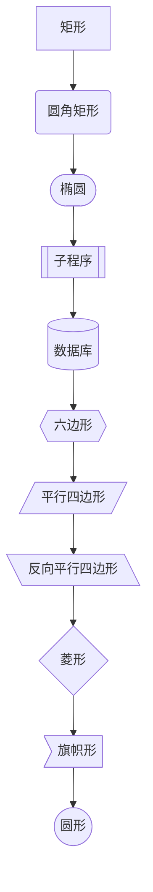
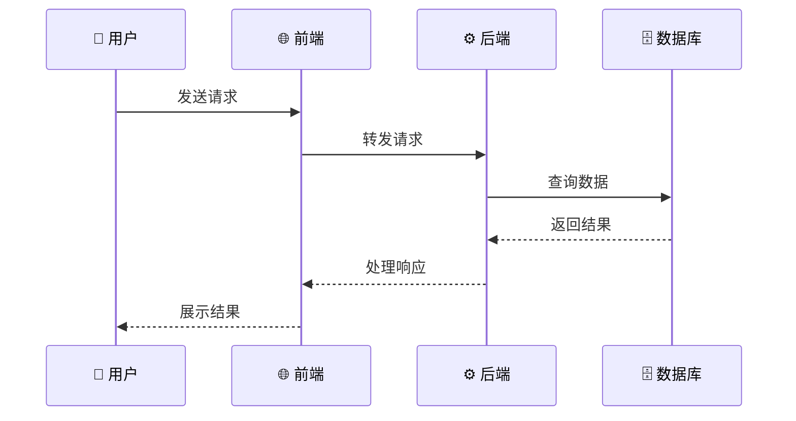
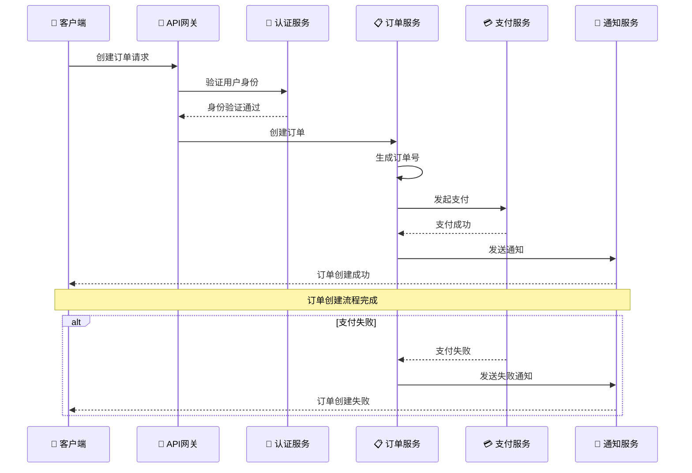
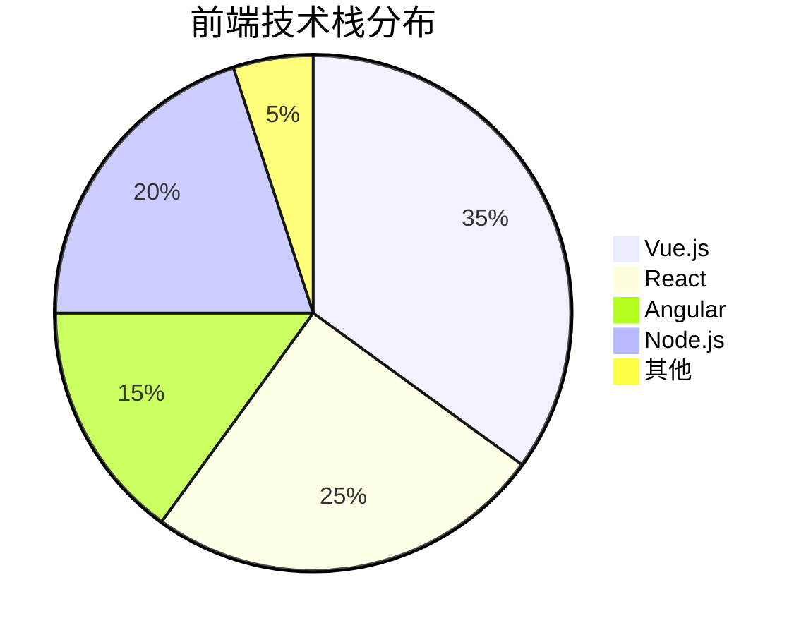
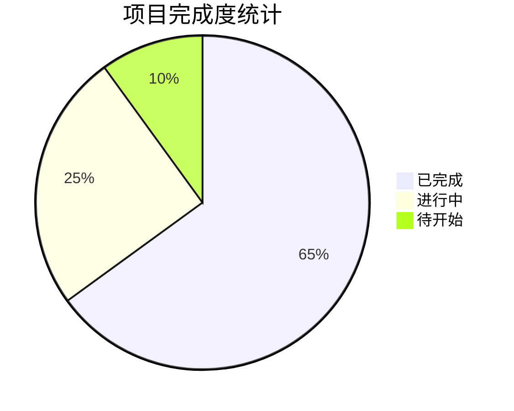
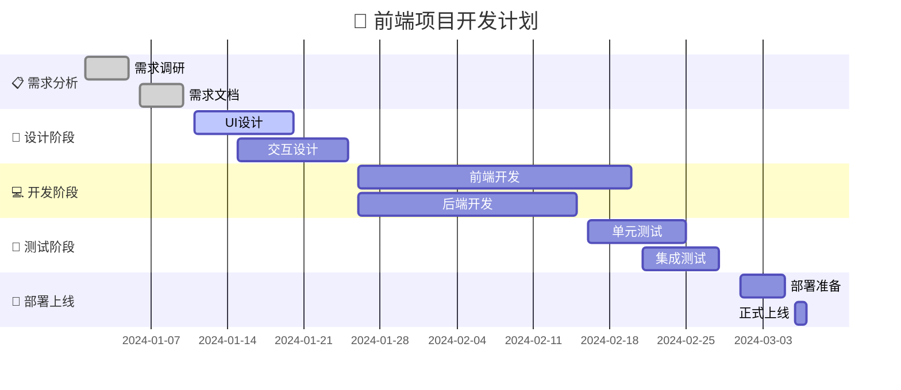
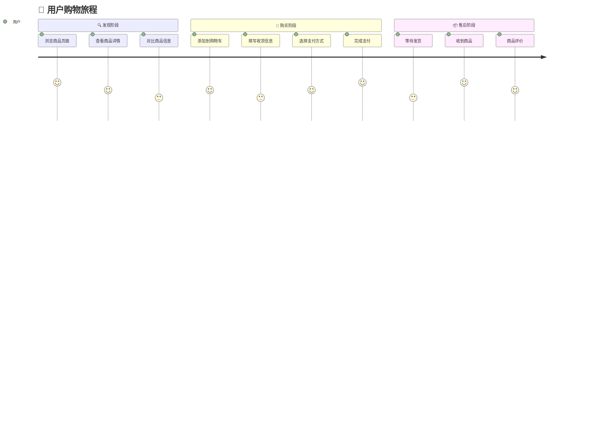

# 📊 Mermaid 使用手册

> 💡 **简介**: Mermaid 是一个基于 JavaScript 的图表和流程图生成库，可以用简单的文本语法创建复杂的图表。本手册提供所有图表类型的完整示例。

## 📋 目录

- [1. 流程图 (Flowchart)](#1-流程图-flowchart)
- [2. 序列图 (Sequence Diagram)](#2-序列图-sequence-diagram)  
- [3. 饼图 (Pie Chart)](#3-饼图-pie-chart)
- [4. 甘特图 (Gantt Chart)](#4-甘特图-gantt-chart)
- [5. 用户旅程图 (User Journey)](#5-用户旅程图-user-journey)
- [6. Git 图 (Git Graph)](#6-git-图-git-graph)
- [7. 实体关系图 (Entity Relationship Diagram)](#7-实体关系图-entity-relationship-diagram)
- [8. 状态图 (State Diagram)](#8-状态图-state-diagram)
- [9. 类图 (Class Diagram)](#9-类图-class-diagram)
- [10. 时间线图 (Timeline)](#10-时间线图-timeline)
- [11. 思维导图 (Mind Map)](#11-思维导图-mind-map)
- [12. 象限图 (Quadrant Chart)](#12-象限图-quadrant-chart)
- [13. 需求图 (Requirement Diagram)](#13-需求图-requirement-diagram)
- [14. C4 图 (C4 Diagram)](#14-c4-图-c4-diagram)

---

## 1. 流程图 (Flowchart)

### 1.1 基础流程图

**代码示例：**
````text

````

**渲染效果：**


### 1.2 复杂流程图

**代码示例：**
````text

````

**渲染效果：**


### 1.3 节点形状

**代码示例：**
````text

````

**渲染效果：**


---

## 2. 序列图 (Sequence Diagram)

### 2.1 基础序列图

**代码示例：**
````text

````

**渲染效果：**


### 2.2 复杂序列图

**代码示例：**
````text

````

**渲染效果：**


---

## 3. 饼图 (Pie Chart)

### 3.1 基础饼图

**代码示例：**
````text

````

**渲染效果：**


### 3.2 项目进度饼图

**代码示例：**
````text

````

**渲染效果：**


---

## 4. 甘特图 (Gantt Chart)

### 4.1 项目甘特图

**代码示例：**
````text

````

**渲染效果：**


---

## 5. 用户旅程图 (User Journey)

### 5.1 用户购物旅程

**代码示例：**
````text

````

**渲染效果：**


---

## 6. Git 图 (Git Graph)

### 6.1 Git 分支流程

**代码示例：**
````text
```mermaid
gitgraph
    commit id: "Initial commit"
    branch develop
    checkout develop
    commit id: "Add basic feature"
    commit id: "Improve UI"
    branch feature/login
    checkout feature/login
    commit id: "Implement login"
    commit id: "Add password validation"
    checkout develop
    merge feature/login
    commit id: "Fix login bug"
    checkout main
    merge develop
    commit id: "Release v1.0.0"
```
````

**渲染效果：**
```mermaid
gitgraph
    commit id: "Initial commit"
    branch develop
    checkout develop
    commit id: "Add basic feature"
    commit id: "Improve UI"
    branch feature/login
    checkout feature/login
    commit id: "Implement login"
    commit id: "Add password validation"
    checkout develop
    merge feature/login
    commit id: "Fix login bug"
    checkout main
    merge develop
    commit id: "Release v1.0.0"
```

---

## 7. 实体关系图 (Entity Relationship Diagram)

### 7.1 数据库ER图

**代码示例：**
````text
```mermaid
erDiagram
    CUSTOMER {
        int id PK
        string name
        string email
        string phone
        date created_at
    }
    ORDER {
        int id PK
        int customer_id FK
        decimal total_amount
        string status
        date order_date
    }
    PRODUCT {
        int id PK
        string name
        decimal price
        int stock_quantity
        string description
    }
    ORDER_ITEM {
        int id PK
        int order_id FK
        int product_id FK
        int quantity
        decimal unit_price
    }
    
    CUSTOMER ||--o{ ORDER : places
    ORDER ||--o{ ORDER_ITEM : contains
    PRODUCT ||--o{ ORDER_ITEM : includes
```
````

**渲染效果：**
```mermaid
erDiagram
    CUSTOMER {
        int id PK
        string name
        string email
        string phone
        date created_at
    }
    ORDER {
        int id PK
        int customer_id FK
        decimal total_amount
        string status
        date order_date
    }
    PRODUCT {
        int id PK
        string name
        decimal price
        int stock_quantity
        string description
    }
    ORDER_ITEM {
        int id PK
        int order_id FK
        int product_id FK
        int quantity
        decimal unit_price
    }
    
    CUSTOMER ||--o{ ORDER : places
    ORDER ||--o{ ORDER_ITEM : contains
    PRODUCT ||--o{ ORDER_ITEM : includes
```

---

## 8. 状态图 (State Diagram)

### 8.1 订单状态流转

**代码示例：**
````text
```mermaid
stateDiagram-v2
    [*] --> 待支付
    待支付 --> 已支付: 支付成功
    待支付 --> 已取消: 支付超时
    已支付 --> 待发货: 确认订单
    待发货 --> 已发货: 商品出库
    已发货 --> 已签收: 用户确认收货
    已签收 --> 已完成: 确认无问题
    已签收 --> 退款中: 申请退款
    退款中 --> 已退款: 退款完成
    退款中 --> 已签收: 退款失败
    已取消 --> [*]
    已完成 --> [*]
    已退款 --> [*]
```
````

**渲染效果：**
```mermaid
stateDiagram-v2
    [*] --> 待支付
    待支付 --> 已支付: 支付成功
    待支付 --> 已取消: 支付超时
    已支付 --> 待发货: 确认订单
    待发货 --> 已发货: 商品出库
    已发货 --> 已签收: 用户确认收货
    已签收 --> 已完成: 确认无问题
    已签收 --> 退款中: 申请退款
    退款中 --> 已退款: 退款完成
    退款中 --> 已签收: 退款失败
    已取消 --> [*]
    已完成 --> [*]
    已退款 --> [*]
```

---

## 9. 类图 (Class Diagram)

### 9.1 前端组件类图

**代码示例：**
````text
```mermaid
classDiagram
    class Component {
        +String name
        +Object props
        +Object state
        +render()
        +componentDidMount()
        +componentWillUnmount()
    }
    
    class Button {
        +String text
        +String type
        +Boolean disabled
        +onClick()
        +render()
    }
    
    class Input {
        +String value
        +String placeholder
        +String type
        +onChange()
        +onFocus()
        +onBlur()
        +render()
    }
    
    class Form {
        +Object data
        +Object rules
        +validate()
        +submit()
        +reset()
        +render()
    }
    
    Component <|-- Button
    Component <|-- Input
    Component <|-- Form
    Form *-- Button
    Form *-- Input
```
````

**渲染效果：**
```mermaid
classDiagram
    class Component {
        +String name
        +Object props
        +Object state
        +render()
        +componentDidMount()
        +componentWillUnmount()
    }
    
    class Button {
        +String text
        +String type
        +Boolean disabled
        +onClick()
        +render()
    }
    
    class Input {
        +String value
        +String placeholder
        +String type
        +onChange()
        +onFocus()
        +onBlur()
        +render()
    }
    
    class Form {
        +Object data
        +Object rules
        +validate()
        +submit()
        +reset()
        +render()
    }
    
    Component <|-- Button
    Component <|-- Input
    Component <|-- Form
    Form *-- Button
    Form *-- Input
```

---

## 10. 时间线图 (Timeline)

### 10.1 项目发展时间线

**代码示例：**
````text
```mermaid
timeline
    title 🚀 项目发展历程
    
    section 2023年
        Q1 : 项目启动
           : 需求分析
           : 技术选型
        Q2 : 原型开发
           : UI设计
           : 核心功能开发
        Q3 : 测试阶段
           : Bug修复
           : 性能优化
        Q4 : 上线发布
           : 用户反馈
           : 功能迭代
    
    section 2024年
        Q1 : 版本升级
           : 新功能开发
           : 用户增长
        Q2 : 平台扩展
           : 移动端适配
           : API优化
```
````

**渲染效果：**
```mermaid
timeline
    title 🚀 项目发展历程
    
    section 2023年
        Q1 : 项目启动
           : 需求分析
           : 技术选型
        Q2 : 原型开发
           : UI设计
           : 核心功能开发
        Q3 : 测试阶段
           : Bug修复
           : 性能优化
        Q4 : 上线发布
           : 用户反馈
           : 功能迭代
    
    section 2024年
        Q1 : 版本升级
           : 新功能开发
           : 用户增长
        Q2 : 平台扩展
           : 移动端适配
           : API优化
```

---

## 11. 思维导图 (Mind Map)

### 11.1 前端技术思维导图

**代码示例：**
````text
```mermaid
mindmap
  root((前端技术栈))
    HTML
      HTML5
      语义化
      表单
    CSS
      CSS3
      Flexbox
      Grid
      预处理器
        Sass
        Less
    JavaScript
      ES6+
      异步编程
      DOM操作
      事件处理
    框架
      Vue.js
        Vue Router
        Vuex
      React
        React Router
        Redux
      Angular
    工具
      Webpack
      Vite
      Git
      npm
```
````

**渲染效果：**
```mermaid
mindmap
  root((前端技术栈))
    HTML
      HTML5
      语义化
      表单
    CSS
      CSS3
      Flexbox
      Grid
      预处理器
        Sass
        Less
    JavaScript
      ES6+
      异步编程
      DOM操作
      事件处理
    框架
      Vue.js
        Vue Router
        Vuex
      React
        React Router
        Redux
      Angular
    工具
      Webpack
      Vite
      Git
      npm
```

---

## 12. 象限图 (Quadrant Chart)

### 12.1 技术学习优先级

**代码示例：**
````text
```mermaid
quadrantChart
    title 技术学习优先级矩阵
    x-axis 学习难度低 --> 学习难度高
    y-axis 重要性低 --> 重要性高
    quadrant-1 应该掌握
    quadrant-2 优先学习
    quadrant-3 可以了解
    quadrant-4 暂时忽略
    
    HTML/CSS: [0.2, 0.8]
    JavaScript: [0.3, 0.9]
    Vue.js: [0.4, 0.8]
    React: [0.5, 0.8]
    Node.js: [0.6, 0.7]
    TypeScript: [0.7, 0.6]
    Docker: [0.8, 0.5]
    Kubernetes: [0.9, 0.4]
```
````

**渲染效果：**
```mermaid
quadrantChart
    title 技术学习优先级矩阵
    x-axis 学习难度低 --> 学习难度高
    y-axis 重要性低 --> 重要性高
    quadrant-1 应该掌握
    quadrant-2 优先学习
    quadrant-3 可以了解
    quadrant-4 暂时忽略
    
    HTML/CSS: [0.2, 0.8]
    JavaScript: [0.3, 0.9]
    Vue.js: [0.4, 0.8]
    React: [0.5, 0.8]
    Node.js: [0.6, 0.7]
    TypeScript: [0.7, 0.6]
    Docker: [0.8, 0.5]
    Kubernetes: [0.9, 0.4]
```

---

## 13. 需求图 (Requirement Diagram)

### 13.1 系统需求图

**代码示例：**
````text
```mermaid
requirementDiagram
    
    requirement user_auth {
        id: 1
        text: 用户认证系统
        risk: high
        verifymethod: test
    }
    
    requirement data_storage {
        id: 2
        text: 数据存储
        risk: medium
        verifymethod: inspection
    }
    
    requirement api_gateway {
        id: 3
        text: API网关
        risk: low
        verifymethod: demonstration
    }
    
    functionalRequirement login {
        id: 1.1
        text: 用户登录功能
        risk: high
        verifymethod: test
    }
    
    functionalRequirement register {
        id: 1.2
        text: 用户注册功能
        risk: medium
        verifymethod: test
    }
    
    performanceRequirement response_time {
        id: 3.1
        text: 响应时间 < 2秒
        risk: medium
        verifymethod: test
    }
    
    user_auth - contains -> login
    user_auth - contains -> register
    api_gateway - contains -> response_time
    login - satisfies -> user_auth
    register - satisfies -> user_auth
    response_time - satisfies -> api_gateway
```
````

**渲染效果：**
```mermaid
requirementDiagram
    
    requirement user_auth {
        id: 1
        text: 用户认证系统
        risk: high
        verifymethod: test
    }
    
    requirement data_storage {
        id: 2
        text: 数据存储
        risk: medium
        verifymethod: inspection
    }
    
    requirement api_gateway {
        id: 3
        text: API网关
        risk: low
        verifymethod: demonstration
    }
    
    functionalRequirement login {
        id: 1.1
        text: 用户登录功能
        risk: high
        verifymethod: test
    }
    
    functionalRequirement register {
        id: 1.2
        text: 用户注册功能
        risk: medium
        verifymethod: test
    }
    
    performanceRequirement response_time {
        id: 3.1
        text: 响应时间 < 2秒
        risk: medium
        verifymethod: test
    }
    
    user_auth - contains -> login
    user_auth - contains -> register
    api_gateway - contains -> response_time
    login - satisfies -> user_auth
    register - satisfies -> user_auth
    response_time - satisfies -> api_gateway
```

---

## 14. C4 图 (C4 Diagram)

### 14.1 系统架构图

**代码示例：**
````text
```mermaid
C4Context
    title 电商系统架构图
    
    Person(user, "用户", "购买商品的用户")
    Person(admin, "管理员", "管理系统的管理员")
    
    System(ecommerce, "电商平台", "提供商品购买服务")
    System_Ext(payment, "支付系统", "处理支付业务")
    System_Ext(logistics, "物流系统", "处理物流配送")
    
    Rel(user, ecommerce, "浏览商品、下单购买")
    Rel(admin, ecommerce, "管理商品、查看订单")
    Rel(ecommerce, payment, "调用支付接口")
    Rel(ecommerce, logistics, "调用物流接口")
    
    UpdateRelStyle(user, ecommerce, $offsetY="60", $offsetX="90")
    UpdateRelStyle(admin, ecommerce, $offsetY="-40", $offsetX="-90")
    UpdateRelStyle(ecommerce, payment, $offsetY="-40")
    UpdateRelStyle(ecommerce, logistics, $offsetY="40")
```
````

**渲染效果：**
```mermaid
C4Context
    title 电商系统架构图
    
    Person(user, "用户", "购买商品的用户")
    Person(admin, "管理员", "管理系统的管理员")
    
    System(ecommerce, "电商平台", "提供商品购买服务")
    System_Ext(payment, "支付系统", "处理支付业务")
    System_Ext(logistics, "物流系统", "处理物流配送")
    
    Rel(user, ecommerce, "浏览商品、下单购买")
    Rel(admin, ecommerce, "管理商品、查看订单")
    Rel(ecommerce, payment, "调用支付接口")
    Rel(ecommerce, logistics, "调用物流接口")
    
    UpdateRelStyle(user, ecommerce, $offsetY="60", $offsetX="90")
    UpdateRelStyle(admin, ecommerce, $offsetY="-40", $offsetX="-90")
    UpdateRelStyle(ecommerce, payment, $offsetY="-40")
    UpdateRelStyle(ecommerce, logistics, $offsetY="40")
```

---

## 📝 语法速查表

### 基本语法

| 图表类型 | 语法关键字 | 说明 |
|----------|------------|------|
| 流程图 | `flowchart` | 描述业务流程 |
| 序列图 | `sequenceDiagram` | 描述时序交互 |
| 饼图 | `pie` | 显示数据占比 |
| 甘特图 | `gantt` | 项目进度管理 |
| 用户旅程图 | `journey` | 用户体验流程 |
| Git图 | `gitgraph` | 版本控制流程 |
| 实体关系图 | `erDiagram` | 数据库设计 |
| 状态图 | `stateDiagram` | 状态流转 |
| 类图 | `classDiagram` | 面向对象设计 |
| 时间线图 | `timeline` | 时间轴展示 |
| 思维导图 | `mindmap` | 知识结构 |
| 象限图 | `quadrantChart` | 四象限分析 |
| 需求图 | `requirementDiagram` | 需求分析 |
| C4图 | `C4Context` | 架构设计 |

### 方向控制

| 方向 | 说明 |
|------|------|
| `TD` / `TB` | 从上到下 |
| `BT` | 从下到上 |
| `LR` | 从左到右 |
| `RL` | 从右到左 |

### 连接线类型

| 连接线 | 说明 |
|--------|------|
| `-->` | 实线箭头 |
| `---` | 实线 |
| `-.->` | 虚线箭头 |
| `-.-` | 虚线 |
| `==>` | 粗实线箭头 |
| `===` | 粗实线 |

---

## 🔧 高级技巧

### 1. 子图 (Subgraph)

**代码示例：**
````text
```mermaid
flowchart TD
    subgraph 前端系统
        A[Vue.js] --> B[Router]
        B --> C[Vuex]
        C --> D[Components]
    end
    
    subgraph 后端系统
        E[Node.js] --> F[Express]
        F --> G[中间件]
        G --> H[API]
    end
    
    subgraph 数据库
        I[MySQL] --> J[数据表]
        J --> K[索引]
    end
    
    前端系统 --> 后端系统
    后端系统 --> 数据库
```
````

**渲染效果：**
```mermaid
flowchart TD
    subgraph 前端系统
        A[Vue.js] --> B[Router]
        B --> C[Vuex]
        C --> D[Components]
    end
    
    subgraph 后端系统
        E[Node.js] --> F[Express]
        F --> G[中间件]
        G --> H[API]
    end
    
    subgraph 数据库
        I[MySQL] --> J[数据表]
        J --> K[索引]
    end
    
    前端系统 --> 后端系统
    后端系统 --> 数据库
```

### 2. 样式定制

**代码示例：**
````text
```mermaid
flowchart LR
    A[开始] --> B[处理中]
    B --> C[完成]
    
    classDef startClass fill:#e1f5fe,stroke:#01579b,stroke-width:2px
    classDef processClass fill:#f3e5f5,stroke:#4a148c,stroke-width:2px
    classDef endClass fill:#e8f5e8,stroke:#1b5e20,stroke-width:2px
    
    class A startClass
    class B processClass
    class C endClass
```
````

**渲染效果：**
```mermaid
flowchart LR
    A[开始] --> B[处理中]
    B --> C[完成]
    
    classDef startClass fill:#e1f5fe,stroke:#01579b,stroke-width:2px
    classDef processClass fill:#f3e5f5,stroke:#4a148c,stroke-width:2px
    classDef endClass fill:#e8f5e8,stroke:#1b5e20,stroke-width:2px
    
    class A startClass
    class B processClass
    class C endClass
```

---

## 📚 最佳实践

### 1. 命名规范
- 使用有意义的节点名称
- 避免过长的标签文本
- 使用表情符号增强可读性

### 2. 布局优化
- 合理选择图表方向
- 避免过于复杂的关系
- 使用子图组织相关内容

### 3. 性能考虑
- 限制节点数量（建议不超过30个）
- 避免过深的嵌套关系
- 使用简化的语法

### 4. 可维护性
- 添加适当的注释
- 使用一致的风格
- 定期更新图表内容

---

## 🛠️ 工具推荐

### 在线编辑器
- [Mermaid Live Editor](https://mermaid.live/) - 官方在线编辑器
- [Mermaid Chart](https://www.mermaidchart.com/) - 专业图表工具

### IDE 插件
- **VS Code**: Mermaid Markdown Syntax Highlighting
- **IntelliJ IDEA**: Mermaid Plugin
- **Vim**: vim-mermaid

### 集成工具
- **GitLab**: 原生支持
- **GitHub**: 原生支持
- **Notion**: 通过代码块支持
- **Confluence**: 通过插件支持

---

## 📖 参考资料

- [Mermaid 官方文档](https://mermaid.js.org/)
- [VitePress Mermaid 支持](https://vitepress.dev/guide/markdown#mermaid)
- [Mermaid 示例库](https://github.com/mermaid-js/mermaid/tree/develop/docs/syntax)
- [社区示例](https://github.com/mermaid-js/mermaid/discussions)

---

> 💡 **提示**: 本手册涵盖了 Mermaid 的所有主要图表类型，每种图表都提供了完整的代码示例和渲染效果。建议根据实际需求选择合适的图表类型，并结合具体场景进行定制。 