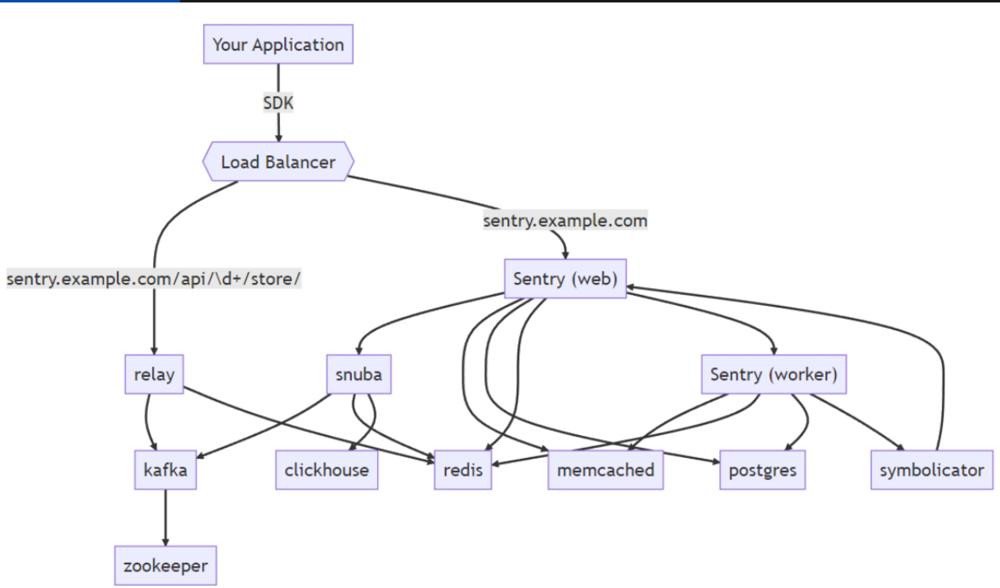

# 🚨 Sentry 错误监控完全指南

> Sentry 是一套开源的实时的异常收集、追踪、监控系统。这套解决方案由对应各种语言的 SDK 和一套庞大的数据后台服务组成，通过 Sentry SDK 的配置，还可以上报错误关联的版本信息、发布环境。同时 Sentry SDK 会自动捕捉异常发生前的相关操作，便于后续异常追踪。异常数据上报到数据服务之后，会通过过滤、关键信息提取、归纳展示在数据后台的 Web 界面中。

## 📖 概述

### ✨ 主要功能

| 功能分类 | 具体功能 | 应用价值 |
|----------|----------|----------|
| 🔍 **异常收集** | 自动捕获和上报错误 | 及时发现问题 |
| 📊 **性能监控** | 页面性能指标分析 | 优化用户体验 |
| 🎯 **错误追踪** | 详细的错误上下文 | 快速定位问题 |
| 📈 **数据分析** | 可视化错误统计 | 辅助决策分析 |
| 🚨 **实时告警** | 错误实时通知 | 快速响应处理 |
| 🔧 **版本管理** | 关联版本信息 | 追踪发布影响 |

## 📊 Sentry 性能监控

通过 `window.performance.getEntries` 和 `PerformanceObserver` 这两个 API，获取用户在使用应用过程中涉及的 load 相关、FCP、LCP、FID、CLS 等指标数据，然后通过接口上报。监控平台拿到数据以后，通过可视化图表的方式展示性能指标数据，帮助分析性能问题。

### 🔧 性能指标获取

```javascript
// getEntries 获取所有 performanceEntry 条目
performance.getEntries().filter(item => item.name === "first-paint")[0]; // 获取 FP 时间
performance.getEntries().filter(item => item.name === "first-contentful-paint")[0]; // 获取 FCP 时间

// getEntriesByName 根据名字进行搜索
performance.getEntriesByName("first-paint"); // 获取 FP 时间
performance.getEntriesByName("first-contentful-paint"); // 获取 FCP 时间

// 也可以通过 PerformanceObserver 的方式获取
const observer = new PerformanceObserver(function (entryList, obj) {
  entryList.getEntries().forEach(item => {
    if (item.name === "first-paint") {
      console.log("筛选出首次绘制时间");
    }
    if (item.name === "first-contentful-paint") {
      console.log("筛选出首次内容绘制时间");
    }
  });
});
observer.observe({ type: "paint" });

// 获取 LCP (Largest-Contentful-Paint) 最大内容绘制时间
observer.observe({ type: "largest-contentful-paint", buffered: true });

// 获取 FID (First Input Delay) 首次输入延迟时间
observer.observe({ type: "first-input", buffered: true });

// 获取 CLS (Cumulative Layout Shift) 累积布局偏移
observer.observe({ type: "layout-shift", buffered: true });
```

### 📈 性能指标说明

| 指标 | 全称 | 含义 | 重要性 |
|------|------|------|--------|
| **FP** | First Paint | 首次绘制时间 | 用户感知加载开始 |
| **FCP** | First Contentful Paint | 首次内容绘制时间 | 用户看到内容的时间 |
| **LCP** | Largest Contentful Paint | 最大内容绘制时间 | 主要内容加载完成 |
| **FID** | First Input Delay | 首次输入延迟时间 | 交互响应性能 |
| **CLS** | Cumulative Layout Shift | 累积布局偏移 | 视觉稳定性 |

## 🚨 常见错误及监控方式

### 💥 JavaScript 代码执行异常

JavaScript 代码执行异常，是最常遇到的异常。这一类型的异常，又可以具体细分为：

#### 📋 错误类型详解

| 错误类型 | 描述 | 常见场景 |
|----------|------|----------|
| **Error** | 最基本的错误类型 | 其他错误类型的基类 |
| **RangeError** | 范围错误 | 堆栈溢出、数组长度异常 |
| **ReferenceError** | 引用错误 | 引用不存在的变量 |
| **SyntaxError** | 语法错误 | 代码语法不正确 |
| **TypeError** | 类型错误 | 类型使用不当 |
| **URIError** | URI 错误 | URI 处理函数参数不合法 |
| **EvalError** | Eval 错误 | 已废弃，不会被抛出 |

#### 🔧 捕获方式

```javascript
// 1. try...catch 捕获
try {
  // 可能出错的代码
  someRiskyFunction();
} catch (error) {
  console.error('捕获到错误:', error);
}

// 2. 全局错误捕获
window.onerror = function(message, source, lineno, colno, error) {
  console.error('全局错误:', { message, source, lineno, colno, error });
  return true; // 阻止默认错误处理
};

// 或者使用 addEventListener
window.addEventListener('error', function(event) {
  console.error('全局错误事件:', event.error);
});
```

### 🔄 Promise 异常

在使用 Promise 时，如果 Promise 被 reject，就会抛出 Promise 类异常。Promise 类型的异常无法被 `try...catch` 捕获，也无法被 `window.onerror` 全局捕获。

#### 📊 Promise 异常分类

| 处理状态 | 捕获方式 | 事件类型 |
|----------|----------|----------|
| **被 catch 处理** | `rejectionhandled` 事件 | 延迟处理的 Promise |
| **没有被处理** | `unhandledrejection` 事件 | 未处理的 Promise 拒绝 |

#### 🔧 捕获 Promise 异常

```javascript
// 捕获未处理的 Promise 拒绝
window.addEventListener('unhandledrejection', function(event) {
  console.error('未处理的 Promise 拒绝:', event.reason);
  event.preventDefault(); // 阻止默认的错误处理
});

// 捕获延迟处理的 Promise
window.addEventListener('rejectionhandled', function(event) {
  console.log('Promise 拒绝被延迟处理:', event.reason);
});

// 示例：未处理的 Promise
Promise.reject('这是一个未处理的错误');

// 示例：延迟处理的 Promise
const p = Promise.reject('延迟处理的错误');
setTimeout(() => {
  p.catch(err => console.log('延迟捕获:', err));
}, 1000);
```

### 📁 资源加载异常

页面的 img、js、css 等资源加载失败，就会提示资源类型加载异常。

#### ⚠️ 重要提示

::: warning 🔍 捕获注意事项
使用 `window.onerror = callback` 的方式是无法捕获静态资源类异常的。原因是资源类型错误没有冒泡，只能在捕获阶段捕获，而 `window.onerror` 是通过在冒泡阶段捕获错误，对静态资源加载类型异常无效。
:::

#### 🔧 正确的捕获方式

```javascript
// 正确：使用捕获阶段监听
window.addEventListener('error', function(event) {
  if (event.target !== window) {
    console.error('资源加载失败:', {
      type: event.target.tagName,
      source: event.target.src || event.target.href,
      message: event.message
    });
  }
}, true); // 注意第三个参数为 true，表示在捕获阶段监听

// 错误：这种方式无法捕获资源加载异常
// window.onerror = function() { ... }
```

### 🌐 接口请求异常

在浏览器端发起接口请求时，如果请求失败，也会抛出异常。

#### 📊 不同请求方式的异常处理

| 请求方式 | 异常捕获方法 | 示例代码 |
|----------|-------------|----------|
| **Fetch API** | `.catch()` 方法 | `fetch(url).catch(handleError)` |
| **XMLHttpRequest** | `onerror` 事件 | `xhr.onerror = handleError` |
| **Axios** | 拦截器或 `.catch()` | `axios.interceptors.response.use()` |

#### 🔧 实际应用示例

```javascript
// Fetch 异常处理
fetch('/api/data')
  .then(response => {
    if (!response.ok) {
      throw new Error(`HTTP error! status: ${response.status}`);
    }
    return response.json();
  })
  .catch(error => {
    console.error('Fetch 请求失败:', error);
  });

// XMLHttpRequest 异常处理
const xhr = new XMLHttpRequest();
xhr.open('GET', '/api/data');

xhr.onload = function() {
  if (xhr.status >= 200 && xhr.status < 300) {
    console.log('请求成功:', xhr.responseText);
  } else {
    console.error('请求失败:', xhr.status, xhr.statusText);
  }
};

xhr.onerror = function() {
  console.error('网络错误或请求被阻止');
};

xhr.send();

// Axios 异常处理
axios.interceptors.response.use(
  response => response,
  error => {
    console.error('Axios 请求异常:', error.response?.data || error.message);
    return Promise.reject(error);
  }
);
```

### 🔒 跨域脚本执行异常

当项目中引用的第三方脚本执行发生错误时，会抛出一类特殊的异常。这类型异常和之前讲过的异常都不同，它的 `message` 只有 `'Script error'` 信息，没有具体的行、列、类型信息。

#### 🔍 产生原因

这是因为浏览器的安全机制：**浏览器只允许同域下的脚本捕获具体异常信息，跨域脚本中的异常，不会报告错误的细节**。

#### 🛠️ 解决方案

如果我们想获取这类异常的详情，需要做以下两个操作：

```html
<!-- 1. 在 script 标签上添加 crossorigin 属性 -->
<script src="https://cdn.example.com/script.js" crossorigin="anonymous"></script>
```

```javascript
// 2. 服务器响应头中添加 CORS 头
// Access-Control-Allow-Origin: *
// 或者指定具体域名
// Access-Control-Allow-Origin: https://your-domain.com
```

#### 🔧 捕获跨域脚本异常

```javascript
window.addEventListener('error', function(event) {
  if (event.message === 'Script error.') {
    console.warn('捕获到跨域脚本异常，但无法获取详细信息');
    // 可以上报基本信息
    reportError({
      type: 'script-error',
      source: event.filename || 'unknown',
      message: 'Cross-origin script error'
    });
  } else {
    console.error('脚本异常:', event);
  }
});
```

## 🔧 Sentry 异常监控原理

为了能自动捕获应用异常，Sentry 劫持覆写了 `window.onerror` 和 `window.onunhandledrejection` 这两个 API。

### 📝 核心实现原理

```javascript
// 劫持覆写 window.onerror 的代码如下：
const oldErrorHandler = window.onerror;
window.onerror = function (msg, url, line, column, error) {
  // 收集异常信息并上报
  triggerHandlers("error", {
    column: column,
    error: error,
    line: line,
    msg: msg,
    url: url,
  });
  
  if (oldErrorHandler) {
    return oldErrorHandler.apply(this, arguments);
  }
  return false;
};

// 劫持覆写 window.onunhandledrejection 的代码如下:
const oldOnUnhandledRejectionHandler = window.onunhandledrejection;
window.onunhandledrejection = function (e) {
  // 收集异常信息并上报
  triggerHandlers("unhandledrejection", e);
  
  if (oldOnUnhandledRejectionHandler) {
    return oldOnUnhandledRejectionHandler.apply(this, arguments);
  }
  return true;
};
```

### 🎯 上下文信息收集

为了能获取更详尽的异常信息，Sentry 在内部对异常发生的特殊上下文做了标记。这些特殊上下文包括：

| 上下文类型 | 收集信息 | 用途 |
|------------|----------|------|
| **DOM 事件回调** | 事件名称、DOM 节点描述、处理函数名 | 定位事件处理异常 |
| **定时器回调** | setTimeout/setInterval 上下文 | 追踪异步操作异常 |
| **XHR 接口调用** | 请求 URL、状态码、响应信息 | 分析接口异常 |
| **动画回调** | requestAnimationFrame 上下文 | 动画相关异常 |

#### 🔍 示例说明

举个例子，如果是 click 事件的 handler 中发生了异常，Sentry 会捕获这个异常，并将异常发生时的事件 name、DOM 节点描述、handler 函数名等信息上报。

```javascript
// Sentry 会为这样的代码添加上下文信息
button.addEventListener('click', function handleClick() {
  // 如果这里发生异常，Sentry 会记录：
  // - 事件类型：click
  // - DOM 元素：<button id="submit-btn">
  // - 函数名：handleClick
  throw new Error('点击处理异常');
});
```

## 🏗️ Sentry 整体架构



### 🏢 架构层级详解

#### 🔄 第一层：负载均衡器
- **Load Balancer** 负责路由转发
- 错误上报转发到 `/api/\d+/store`
- 承担数据入口职责

#### 🌐 第二层：Web 服务层
- **Sentry Web**: 处理配置等持久化数据，创建项目、权限控制、限流分配
- **Snuba**: 处理查询搜索错误消息、Dashboard 聚合，将用户查询条件转化为 SQL 语句发给 ClickHouse

#### ⚙️ 第三层：核心服务层

| 服务名称 | 主要职责 | 功能描述 |
|----------|----------|----------|
| **Relay** | 消息中继转发 | 将数据汇集到 Kafka |
| **Snuba** | 数据聚合搜索 | 接收 Web 请求，进行数据处理 |
| **Sentry Worker** | 队列服务 | 负责数据存储处理 |

#### 💾 第四层：存储层

| 组件名称 | 用途 | 存储内容 |
|----------|------|----------|
| **Kafka** | 消息队列 | 异步消息处理 |
| **ClickHouse** | 实时数据分析 | 错误事件数据 |
| **Redis/Memcached** | 缓存存储 | 项目配置、错误统计 |
| **Postgres** | 关系型数据库 | 项目、用户权限管理 |
| **Symbolicator** | 符号化服务 | 错误信息格式化 |

#### 🔗 第五层：协调层
- **Zookeeper**: Kafka 节点信息同步，ClickHouse 集群管理

## 🚀 Sentry 安装部署

Sentry 的管理后台是基于 Python Django 开发的。这个管理后台由背后的 Postgres 数据库、ClickHouse、relay、kafka、redis 等一些基础服务或由 Sentry 官方维护的总共 **23 个服务**支撑运行。

### 📋 部署复杂性

如果独立的部署和维护这 23 个服务将是异常复杂和困难的。幸运的是，官方提供了基于 Docker 镜像的一键部署实现。

### 🏗️ 部署方案

具体落地方案可将 Sentry 应用单机单节点部署在某一台独立服务器上，保证各环境数据上报网络通畅即可，具体环境和项目可以通过设置合理规范的前缀名区分，重要项目数据需要设置定时备份策略。

### 📦 安装步骤

#### 1️⃣ 安装 Docker

```bash
# Ubuntu/Debian
sudo apt-get update
sudo apt-get install docker.io docker-compose

# CentOS/RHEL
sudo yum install docker docker-compose

# 启动 Docker 服务
sudo systemctl start docker
sudo systemctl enable docker
```

#### 2️⃣ 克隆并安装 Sentry

```bash
# 克隆官方仓库
git clone https://github.com/getsentry/onpremise.git
cd ./onpremise

# 给安装脚本添加执行权限
chmod u+x ./install.sh

# 执行安装脚本
./install.sh
# 如果需要 sudo 权限
# sudo ./install.sh
```

#### 3️⃣ Sentry 环境配置

| 配置项 | 描述 | 重要性 |
|--------|------|--------|
| **Root URL** | 异常上报接口的公网根地址 | ⭐⭐⭐⭐⭐ |
| **Outbound Email** | 邮件服务配置 | ⭐⭐⭐⭐ |
| **语言和时区** | 界面语言和时区设置 | ⭐⭐⭐ |
| **团队和项目** | 选取平台语言创建团队和项目 | ⭐⭐⭐⭐⭐ |
| **DSN 配置** | 获取项目绑定的客户端秘钥 | ⭐⭐⭐⭐⭐ |
| **报警配置** | SMTP 授权码等 | ⭐⭐⭐⭐ |

## 💻 前端接入 Sentry

### 📦 安装 Sentry 插件

```bash
# Vue 项目
npm install --save @sentry/vue @sentry/tracing

# React 项目
npm install --save @sentry/react @sentry/tracing

# 原生 JavaScript
npm install --save @sentry/browser @sentry/tracing
```

### ⚙️ Vue 项目配置

```typescript
import * as Sentry from "@sentry/vue";
import { Integrations } from "@sentry/tracing";
import { createApp } from 'vue';
import router from './router';

const app = createApp(App);

// 初始化 Sentry 配置
Sentry.init({
  app,
  
  // 是否开启错误上报
  enabled: process.env.NODE_ENV === 'production',
  
  // 指定 Sentry 项目的 DSN（数据源名称）
  dsn: "https://your-dsn@sentry.io/project-id",
  
  // 环境标识
  environment: process.env.NODE_ENV,
  
  // 版本信息
  release: process.env.VUE_APP_VERSION,
  
  // 集成配置
  integrations: [
    // 浏览器性能追踪
    new Integrations.BrowserTracing({
      // Vue 路由追踪
      routingInstrumentation: Sentry.vueRouterInstrumentation(router),
      tracingOrigins: ["localhost", "your-api-domain.com", /^\//],
    }),
    
    // 用户会话回放（可选）
    new Sentry.Replay({
      maskAllText: false,
      blockAllMedia: false,
    }),
  ],
  
  // 性能监控采样率 (0.0 到 1.0)
  tracesSampleRate: 0.1,
  
  // 会话回放采样率
  replaysSessionSampleRate: 0.1,
  replaysOnErrorSampleRate: 1.0,
  
  // 错误过滤
  beforeSend(event, hint) {
    // 过滤掉某些不需要上报的错误
    if (event.exception) {
      const error = hint.originalException;
      if (error && error.message && error.message.includes('Script error')) {
        return null; // 不上报跨域脚本错误
      }
    }
    return event;
  },
  
  // 用户信息
  initialScope: {
    tags: { component: "frontend" },
    user: {
      id: "user-id",
      email: "user@example.com"
    }
  }
});

app.use(router);
app.mount('#app');
```

### 🎛️ 高级配置选项

```typescript
// 自定义错误边界
Sentry.withErrorBoundary(MyComponent, {
  fallback: ({ error, resetError }) => (
    <div>
      <h2>出现了错误</h2>
      <button onClick={resetError}>重试</button>
    </div>
  )
});

// 手动上报错误
try {
  riskyFunction();
} catch (error) {
  Sentry.captureException(error, {
    tags: {
      section: "payment"
    },
    extra: {
      userId: currentUser.id,
      action: "process-payment"
    }
  });
}

// 上报自定义消息
Sentry.captureMessage("用户执行了重要操作", "info");

// 添加面包屑
Sentry.addBreadcrumb({
  message: "用户点击了提交按钮",
  category: "ui.click",
  level: "info"
});

// 设置用户上下文
Sentry.setUser({
  id: "123",
  email: "user@example.com",
  username: "john_doe"
});

// 设置标签
Sentry.setTag("page", "checkout");

// 设置额外信息
Sentry.setExtra("shopping_cart_size", 3);
```

## 🎯 最佳实践

### ✅ 推荐做法

::: tip 🎯 最佳实践
1. **环境区分**: 不同环境使用不同的 DSN 和配置
2. **采样控制**: 生产环境适当降低采样率避免过多数据
3. **错误过滤**: 过滤掉无意义的错误（如跨域脚本错误）
4. **上下文丰富**: 添加用户信息、业务上下文等有助于调试的信息
5. **性能监控**: 合理配置性能监控，关注关键指标
6. **告警配置**: 设置合理的告警规则，避免告警疲劳
:::

### 🚫 避免的做法

::: warning ⚠️ 注意事项
- 不要在开发环境上报错误到生产 Sentry
- 避免上报敏感信息（密码、token 等）
- 不要设置过高的采样率，会产生大量数据
- 避免在错误处理中再次抛出异常
- 不要忽略 Sentry 的性能影响
:::

### 📊 监控指标建议

| 指标类型 | 关注重点 | 告警阈值建议 |
|----------|----------|-------------|
| **错误率** | 应用整体健康度 | > 1% |
| **响应时间** | 用户体验 | > 2s |
| **错误趋势** | 版本发布影响 | 环比增长 > 50% |
| **用户影响** | 受影响用户数 | > 100 用户/小时 |

## 🌟 总结

Sentry 作为现代化的错误监控平台，提供了：

- ✅ **全面的异常捕获**: 支持各种类型的前端异常
- ✅ **强大的性能监控**: 完整的 Web Vitals 指标追踪
- ✅ **丰富的上下文信息**: 帮助快速定位和解决问题
- ✅ **灵活的部署方案**: 支持 SaaS 和私有化部署
- ✅ **完善的生态支持**: 支持多种前端框架和库
- ✅ **实时告警机制**: 及时发现和响应问题

通过合理配置和使用 Sentry，可以显著提升应用的稳定性和用户体验，是现代前端开发不可缺少的工具之一。
