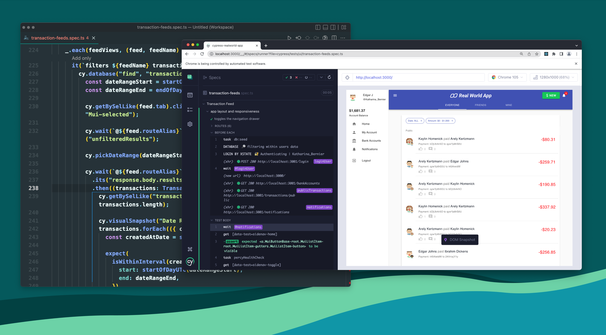
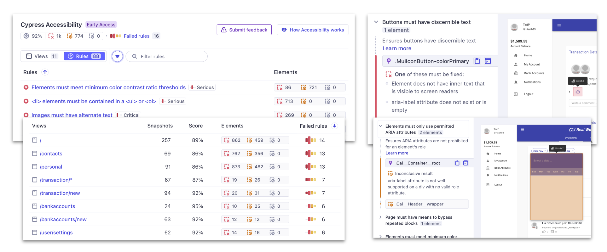

# 🧪 Cypress 现代化测试框架完全指南

> Cypress 是为现代 Web 构建的下一代前端测试工具，在测试现代应用程序和维护测试套件时，解决团队的关键痛点。

::: info 📚 相关资源
- [Node 内置测试库](/afterEnd/node/test)  
- [Node 内置断言库](/afterEnd/node/assert)
:::

## 🎯 Cypress 概述

Cypress 用户通常是开发人员、QA 工程师和希望构建 Web 应用程序并提高其现有应用程序质量的团队。Cypress 后面是一个 Node 服务器进程，Cypress 和 Node 不断处理代表彼此通信、同步和执行任务。

### 🏗️ 架构特点

拥有访问这两个部分（前端和后端）使我们能够响应您的应用程序的事件，同时在浏览器中执行需要更高权限的任务。由于 Cypress 安装在本地计算机上，因此它还可以利用操作系统执行自动化任务。

### 🚀 核心能力

Cypress 为以下方面提供解决方案：

| 测试类型 | 描述 | 适用场景 |
|----------|------|----------|
| **端到端测试** | 完整用户流程测试 | 🌐 用户旅程验证 |
| **组件测试** | 独立组件测试 | 🧩 组件功能验证 |
| **辅助功能测试** | 无障碍性测试 | ♿ 可访问性检查 |
| **UI 覆盖率** | 界面覆盖率分析 | 📊 测试覆盖度量 |

### ⭐ 核心特性

| 特性 | 描述 | 优势 |
|------|------|------|
| **时间旅行** | 测试运行时拍摄快照 | 🕰️ 精确查看每个步骤 |
| **可调试性** | 从熟悉的开发工具调试 | 🔍 快如闪电的调试 |
| **自动等待** | 自动等待命令和断言 | ⏱️ 无需手动等待 |
| **间谍、存根和时钟** | 验证和控制函数行为 | 🕵️ 单元测试功能 |
| **网络流量控制** | 控制、存根和测试边缘情况 | 🌐 无需涉及服务器 |
| **一致的结果** | 不使用 Selenium 或 WebDriver | 🎯 快速、一致、可靠 |
| **跨浏览器测试** | 多浏览器支持 | 🌍 Firefox、Chrome 系列 |



## 🌐 端到端测试

Cypress 最初旨在对在浏览器中运行的应用程序进行测试。典型的 E2E 测试会在浏览器中访问应用程序，然后通过 UI 执行操作，就像真实用户一样。

### 📝 基础示例

```javascript
// 简单的待办事项添加测试
it("adds todos", () => {
  cy.visit("https://example.cypress.io/");
  cy.get('[data-cy="new-todo"]').type("write tests{enter}");
  // 确认应用程序显示一个项目
  cy.get('[data-cy="todos"]').should("have.length", 1);
});
```

### 🔄 复杂交互测试

```javascript
it("adds and completes todos", () => {
  cy.visit("/");
  cy.get(".new-todo")
    .type("write code{enter}")
    .type("write tests{enter}")
    .type("deploy{enter}");

  cy.get(".todo").should("have.length", 3);

  cy.get(".todo").first().find(".toggle").check();

  cy.get(".todo").first().should("have.class", "completed");
});
```

## 🧩 组件测试

Cypress Component Testing 为您提供了一个组件工作台，让您能够快速从多个前端 UI 库构建和测试组件 — 无论多么简单或复杂。

### 🎨 Vue 组件测试

```javascript
import Button from "./Button.vue";

it("uses custom text for the button label", () => {
  cy.mount(Button, {
    slots: {
      default: "Click me!",
    },
  });
  // 断言按钮组件具有正确的文本
  cy.get("button").should("contains.text", "Click me!");
});
```

### ⚛️ React 组件测试

```javascript
it("adds and completes todos", () => {
  cy.mount(<AddTodo />);
  cy.get(".new-todo")
    .type("write code{enter}")
    .type("write tests{enter}")
    .type("deploy{enter}");

  cy.get(".todo").should("have.length", 3);

  cy.get(".todo").first().find(".toggle").check();

  cy.get(".todo").first().should("have.class", "completed");
});
```

### 🎭 Svelte 组件测试

```javascript
import Button from "./Button.svelte";

it("uses custom text for the button label", () => {
  cy.mount(Button, { props: { msg: "Click me!" } });
  // 断言按钮组件具有正确的文本
  cy.get("button").should("contains.text", "Click me!");
});
```

## 🔬 单元测试

Cypress 也支持传统的单元测试，可以测试纯函数和模块。

```javascript
// add.js
function add(a, b) {
  return a + b;
}
module.exports = { add };

// add.cy.js
const { add } = require("./add");

it("adds numbers", () => {
  expect(add(2, 3)).to.equal(5);
});
```

## ♿ 可访问性测试

可以编写 Cypress 测试来检查应用程序的可访问性，并使用插件运行广泛的可访问性扫描。当与 Cypress Cloud 中的 Cypress 辅助功能结合使用时，可以在特定测试不符合辅助功能标准时显示见解 - 无需配置。

```javascript
it("adds todos", () => {
  cy.visit("https://example.cypress.io/");
  cy.get("img#logo")
    // 断言图像具有正确的 alt 文本
    .should("have.attr", "alt", "Cypress Logo");
});
```



## 📊 UI 覆盖率 & 代码覆盖率

可以通过使用 UI 覆盖率缩小关键应用程序流中的测试差距来提高发布置信度。利用数据驱动的洞察来覆盖未测试的区域，减少事件并提高应用程序质量。


### 🛠️ 代码覆盖率配置

```javascript
// 安装代码覆盖率插件
npm install @cypress/code-coverage --save-dev

// cypress/support/e2e.js
import '@cypress/code-coverage/support'

// 配置 e2e 测试
const { defineConfig } = require('cypress')
module.exports = defineConfig({
  // setupNodeEvents 可以在 e2e 或 component 配置中定义
  e2e: {
    setupNodeEvents(on, config) {
      require('@cypress/code-coverage/task')(on, config)
      // 包含任何其他插件代码...

      // 重要：返回 config 对象
      // 包含任何更改的环境变量
      return config
    },
  },
})
```

## 🌐 API 测试

Cypress 可以执行任意 HTTP 调用，可以将其用于 API 测试。通过大量官方和第三方插件，还可以编写许多其他类型的测试！

```javascript
it("adds a todo", () => {
  cy.request("POST", "/todos", { title: "Write API Tests" })
    .its("body")
    .should("contain", { title: "Write API Tests" });
});
```

## 🔍 断言库详解

Cypress 捆绑了流行的 Chai 断言库，以及 Sinon-Chai 和 Chai-jQuery 断言。

### 📋 Chai 断言语法

#### 🚫 否定断言

```javascript
// not - 否定断言
.should('not.equal', 'Jane')
expect(name).to.not.equal('Jane')
```

#### 🔍 深度比较

```javascript
// deep - 深度比较
.should('deep.equal', { name: 'Jane' })
expect(obj).to.deep.equal({ name: 'Jane' })
```

#### 🎯 嵌套属性

```javascript
// nested - 嵌套属性
.should('have.nested.property', 'a.b[1]')
.should('nested.include', {'a.b[1]': 'y'})
expect({a: {b: 'x'}}).to.have.nested.property('a.b')
expect({a: {b: 'x'}}).to.nested.include({'a.b': 'x'})
```

#### 📊 有序比较

```javascript
// ordered - 有序比较
.should('have.ordered.members', [1, 2])
expect([1, 2]).to.have.ordered.members([1, 2])
expect([1, 2]).not.to.have.ordered.members([2, 1])
```

#### 🔑 任意键检查

```javascript
// any - 任意键
.should('have.any.keys', 'age')
expect(arr).to.have.any.keys('age')
```

### 🎭 常用断言模式

| 断言类型 | 语法示例 | 用途 |
|----------|----------|------|
| **存在性** | `.should('exist')` | 元素是否存在 |
| **可见性** | `.should('be.visible')` | 元素是否可见 |
| **文本内容** | `.should('contain.text', 'Hello')` | 文本内容检查 |
| **属性值** | `.should('have.attr', 'href', '/link')` | 属性值验证 |
| **CSS 类** | `.should('have.class', 'active')` | CSS 类检查 |
| **长度** | `.should('have.length', 3)` | 集合长度 |

## 🛠️ 最佳实践

### 📝 测试组织

```javascript
// 推荐的测试文件结构
cypress/
├── e2e/
│   │   ├── auth/
│   │   │   ├── login.cy.js
│   │   │   └── register.cy.js
│   │   │   └── dashboard/
│   │   │   └── dashboard.cy.js
│   │   └── shared/
│   │       └── navigation.cy.js
│   ├── component/
│   │   ├── Button.cy.js
│   │   └── Modal.cy.js
│   ├── fixtures/
│   │   └── users.json
│   └── support/
│       ├── commands.js
│       └── e2e.js
```

### 🎯 选择器策略

```javascript
// 推荐：使用 data-cy 属性
cy.get('[data-cy="submit-button"]').click();

// 避免：依赖 CSS 类或 ID
cy.get('.btn-primary').click(); // 不推荐
cy.get('#submit').click(); // 不推荐

// 自定义命令
Cypress.Commands.add('getByCy', (selector) => {
  return cy.get(`[data-cy=${selector}]`);
});

// 使用自定义命令
cy.getByCy('submit-button').click();
```

### 🔄 等待策略

```javascript
// 好的做法：使用 Cypress 的自动等待
cy.get('[data-cy="loading"]').should('not.exist');
cy.get('[data-cy="content"]').should('be.visible');

// 避免：使用硬编码等待
cy.wait(5000); // 不推荐

// 网络请求等待
cy.intercept('GET', '/api/users').as('getUsers');
cy.visit('/users');
cy.wait('@getUsers');
```

### 🧪 测试数据管理

```javascript
// 使用 fixtures
cy.fixture('users').then((users) => {
  cy.get('[data-cy="username"]').type(users.validUser.email);
  cy.get('[data-cy="password"]').type(users.validUser.password);
});

// 环境变量
cy.visit(Cypress.env('baseUrl'));

// 自定义命令进行登录
Cypress.Commands.add('login', (email, password) => {
  cy.session([email, password], () => {
    cy.visit('/login');
    cy.get('[data-cy="email"]').type(email);
    cy.get('[data-cy="password"]').type(password);
    cy.get('[data-cy="login-button"]').click();
    cy.url().should('include', '/dashboard');
  });
});
```

## 🚀 高级功能

### 📸 截图和视频

```javascript
// 自动截图（失败时）
// 配置在 cypress.config.js 中
{
  screenshotOnRunFailure: true,
  video: true,
  videosFolder: 'cypress/videos'
}

// 手动截图
cy.screenshot('my-image');
cy.get('.my-component').screenshot();
```

### 🌐 网络拦截

```javascript
// 拦截和模拟 API 响应
cy.intercept('GET', '/api/todos', { fixture: 'todos.json' }).as('getTodos');

// 拦截并修改响应
cy.intercept('POST', '/api/todos', (req) => {
  req.body.createdAt = new Date().toISOString();
  req.reply();
}).as('createTodo');

// 网络故障模拟
cy.intercept('GET', '/api/users', { forceNetworkError: true });
```

### 🕰️ 时间控制

```javascript
// 控制时间
const now = new Date(2021, 3, 14); // April 14, 2021
cy.clock(now);

// 快进时间
cy.tick(10000); // 快进 10 秒

// 恢复时间
cy.clock().invoke('restore');
```

::: tip 💡 性能优化建议
1. **并行执行** - 使用 Cypress Dashboard 并行运行测试
2. **选择器优化** - 使用高效的选择器策略
3. **测试隔离** - 确保测试之间的独立性
4. **数据清理** - 在测试后清理测试数据
:::

::: warning ⚠️ 注意事项
- Cypress 在同一个域内运行，不能跨域操作
- 不支持多标签页测试
- 对于某些复杂的用户交互可能需要特殊处理
:::

## 📚 扩展阅读

- [Cypress 官方文档](https://docs.cypress.io/)
- [Cypress 最佳实践](https://docs.cypress.io/guides/references/best-practices)
- [Testing Library](https://testing-library.com/) - 测试理念和方法
- [Jest 测试框架](https://jestjs.io/) - 单元测试补充
