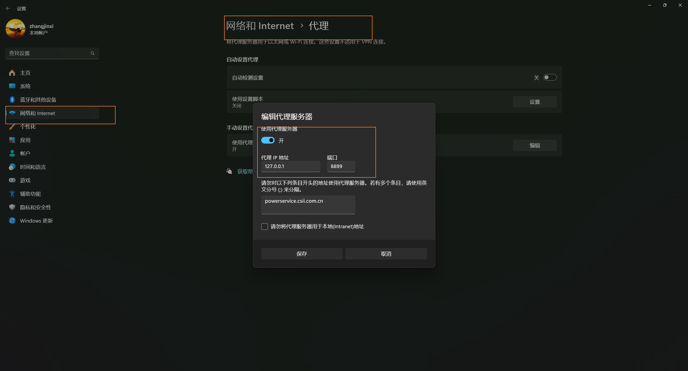
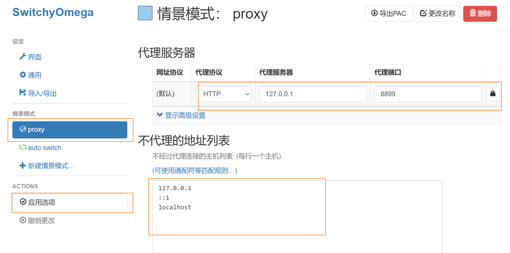
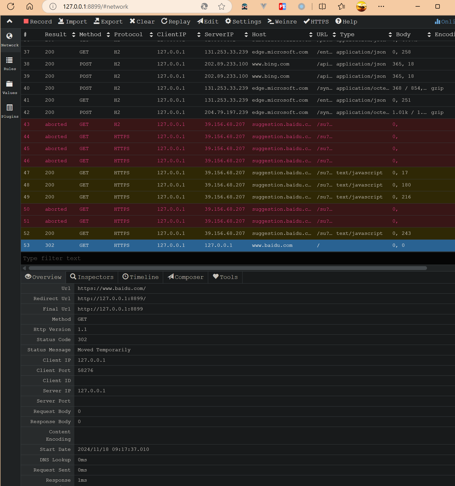
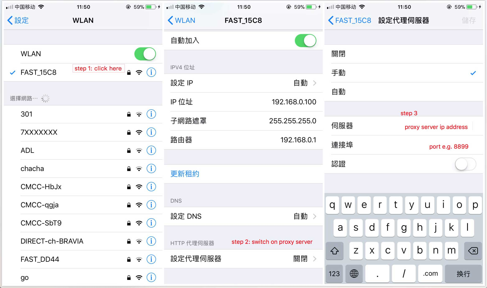
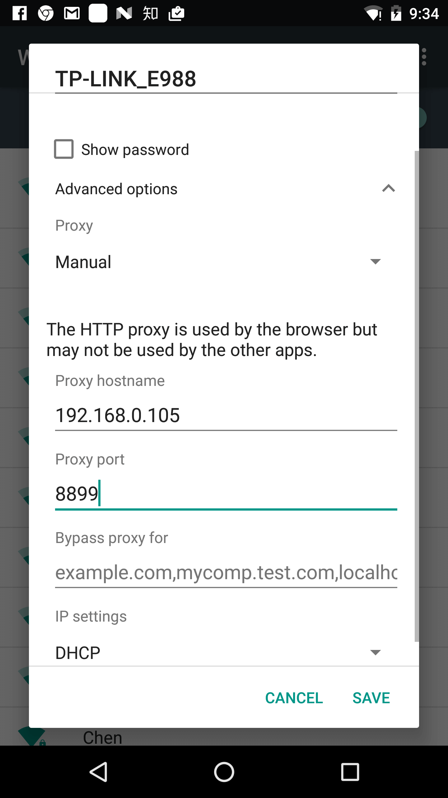
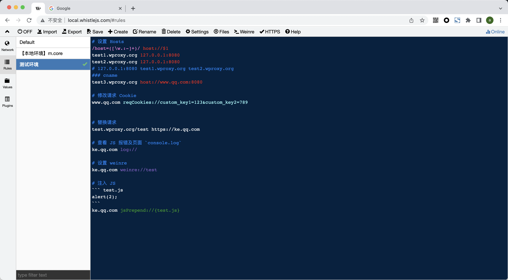
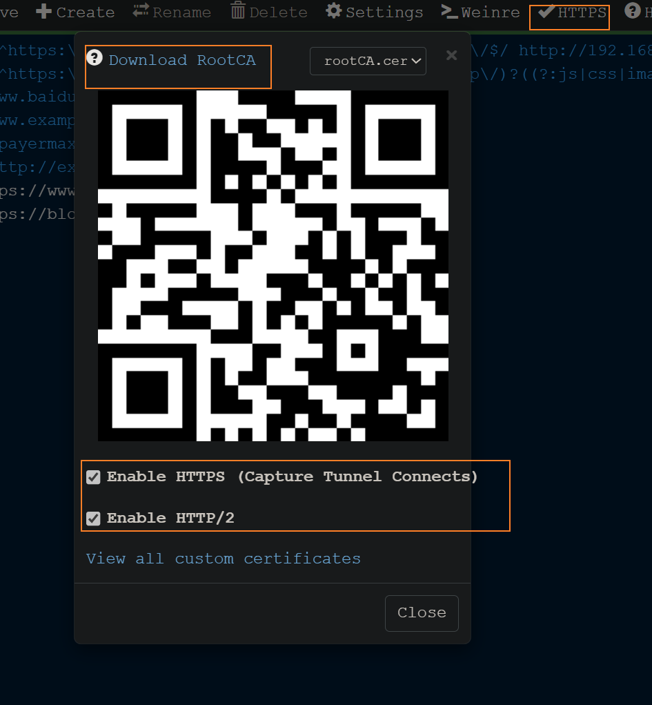
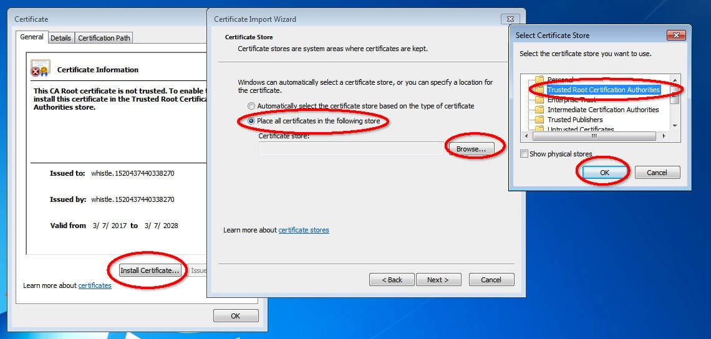

# 🔍 Whistle 代理调试工具完全指南

> Whistle 是一款基于 Node.js 实现的，类似 Fiddler、Charles 的代理工具，可用于 HTTP、WebSocket 等请求的抓取、编辑、重放等功能。

## 📖 概述

与 Fiddler 等其他代理工具不同，Whistle 采用了类似于配置系统 hosts 的方式，使得一切操作都可以通过配置来实现。这使得使用 Whistle 变得更加简单和直观。

### ✨ 主要功能

| 功能分类 | 具体功能 | 应用场景 |
|----------|----------|----------|
| 🔍 **抓包调试** | HTTP/HTTPS/WebSocket 抓包 | 接口调试、问题排查 |
| 🎭 **数据模拟** | Mock 数据、修改返回数据 | 前端开发、测试 |
| 🌐 **代理转发** | 请求转发、环境切换 | 开发环境配置 |
| 📝 **脚本注入** | 注入自定义脚本 | 自动化测试、提效工具 |
| 🐌 **网络模拟** | 延迟模拟弱网 | 性能测试 |

## 📦 安装和启动

### 🔧 安装 Whistle

```bash
# 通过 npm 全局安装 Whistle
npm install -g whistle

# 使用 yarn 安装
yarn global add whistle

# 使用 pnpm 安装
pnpm add -g whistle
```

### 🚀 启动命令

```bash
# 启动 Whistle 代理服务
w2 start

# 重新启动 Whistle 代理服务
w2 restart

# 查看运行状态
w2 status

# 停止运行
w2 stop

# 查看帮助信息
w2 help
```

::: tip 💡 默认配置
默认情况下，Whistle 服务器会监听本地的 **8899** 端口。
访问管理后台：`http://127.0.0.1:8899/`
:::

## 🌐 代理配置

### 🔧 配置方式对比

| 配置方式 | 影响范围 | 优点 | 缺点 | 推荐度 |
|----------|----------|------|------|--------|
| **全局代理** | 系统全局 | 覆盖所有应用 | 影响其他应用 | ⭐⭐ |
| **浏览器代理** | 当前浏览器 | 不影响其他应用 | 需要插件支持 | ⭐⭐⭐⭐⭐ |
| **移动端代理** | 移动设备 | 支持移动端调试 | 配置相对复杂 | ⭐⭐⭐⭐ |

### 🌍 全局代理配置

::: warning ⚠️ 注意
全局代理会影响所有应用的网络请求，不建议日常使用。
:::

1. 在系统设置中搜索「代理」
2. 找到代理服务器配置
3. 开启代理服务器
4. 输入 Whistle 代理服务的 IP 地址和端口号 (8899)
5. 保存配置



### 🔌 浏览器代理配置（推荐）

推荐使用 **SwitchyOmega** 插件进行浏览器代理配置：

#### 📥 安装 SwitchyOmega

1. 在浏览器扩展商店搜索 `SwitchyOmega`
2. 安装 SwitchyOmega 扩展

#### ⚙️ 配置代理

1. 打开 SwitchyOmega 设置页面
2. 创建新的情景模式或编辑现有模式
3. 配置代理参数：
   - **代理协议**: HTTP
   - **代理服务器**: 127.0.0.1 (或 Whistle 服务器 IP)
   - **端口**: 8899
4. 配置不走代理的地址列表（可选）
5. 应用配置并选择该情景模式




### 📱 移动端代理配置

#### 🔧 配置步骤

1. **确保网络连通**: 移动设备与 Whistle 服务器在同一网络
2. **获取服务器 IP**: 查看 Whistle 服务器的局域网 IP 地址
3. **配置移动端代理**:
   - 打开移动端 WiFi 设置
   - 进入详细配置
   - 找到代理服务器配置
   - 输入 Whistle 的 IP 地址和端口号 (8899)




#### 🚫 防火墙问题解决

如果配置完代理后手机无法访问，可能是防火墙限制：

::: warning 🔥 防火墙设置
- 关闭 Windows 防火墙
- 或者设置防火墙白名单允许 8899 端口
- 参考: [防火墙配置教程](http://jingyan.baidu.com/article/870c6fc317cae7b03ee4be48.html)
:::

## 🎯 使用界面

### 📊 Network 面板

在 Whistle 管理后台 (`http://127.0.0.1:8899/`) 的 Network 面板中：

- 📋 **查看请求列表**: 显示所有被拦截的 HTTP 请求
- 🎨 **状态颜色区分**: 不同状态的请求显示不同颜色
- 🔍 **请求详情**: 点击请求查看详细内容
- 📈 **实时监控**: 实时显示网络请求


### ⚙️ Rules 面板

在 Rules 面板中可以：

- 📝 **配置转发规则**: 设置请求拦截和转发
- ✅ **启用/禁用规则**: 灵活控制规则状态
- 🔄 **正则模式**: 支持正则表达式匹配
- 💾 **规则管理**: 保存和管理多套规则




## 🔒 HTTPS 和 WebSocket 支持

### 📜 证书安装

要拦截 HTTPS 请求，需要安装 CA 证书：

#### 💻 桌面端证书安装

1. 在 Whistle 后台打开 Network 面板
2. 点击 **HTTPS** 按钮
3. 勾选以下两个选项：
   - ☑️ Capture HTTPS CONNECTs
   - ☑️ Enable HTTPS
4. 点击 **Download RootCA** 下载证书
5. 安装证书到系统信任区域




#### 📱 移动端证书安装

- 扫描 Whistle 后台提供的二维码
- 下载并安装证书到移动设备

::: tip 💡 证书说明
安装证书后，Whistle 就能够拦截和分析 HTTPS 和 WebSocket 请求了。
:::

## 📜 规则配置语法

### 🏠 基础 Hosts 配置

```bash
# 基础域名映射 (从左到右，等同于 hosts 从右到左)
test1.wproxy.org 127.0.0.1
test2.wproxy.org 127.0.0.1

# 支持端口和路径
test1.wproxy.org/path/to 127.0.0.1:6001
https://test2.wproxy.org/path1/to1 127.0.0.1:6001

# 正则匹配
/google/ 127.0.0.1:6001
/host=([\w.:-]+)/ host://$1

# CNAME 支持
test1.wproxy.org/path/to host://www.qq.com:8080
```

### 🍪 请求修改

```bash
# 修改请求 Cookie
www.qq.com reqCookies://custom_key1=123&custom_key2=789

# 设置请求头
http://example.com/* reqHeaders://`host=${url.host}`
m.aliexpress.com reqHeaders://{req-headers}

# 请求替换
test.wproxy.org/test file:///Users/xx/statics
test.wproxy.org/test https://ke.qq.com
```

### 🎨 界面和调试

```bash
# 设置列表样式
baidu.com style://color=@fff&fontStyle=italic&bgColor=red

# 查看 JS 报错及页面 console.log
ke.qq.com log://

# 设置 weinre 用于调试远程页面
ke.qq.com weinre://test
```

### 🔄 响应控制

```bash
# 模拟响应 500 (请求不会到后台服务)
test3.wproxy.org/path/to statusCode://500

# 修改响应状态码 (请求会到后台服务)
test4.wproxy.org/path/to replaceStatus://400

# 302 重定向
test5.wproxy.org/path redirect://https://ke.qq.com/

# 301 重定向
test6.wproxy.org/path redirect://https://ke.qq.com/ replaceStatus://301
```

### 💉 脚本注入

```bash
# 注入 JavaScript
ke.qq.com jsPrepend://{test.js}

# 返回 HTML 文件
www.test.com/index.html file://{test.html}
```

### 🔧 变量使用

```bash
# 使用变量
www.test.com/api http://`${clientIp}:8080`

# 使用文件变量
http://`{test.json}`
```

## 🚀 高级功能

### 📋 完整协议列表

| 协议类别 | 协议名称 | 功能描述 |
|----------|----------|----------|
| **功能扩展** | `@` | 功能扩展及引入远程规则 |
| **UI 样式** | `style` | 设置抓包列表样式 |
| **代理设置** | `proxy` | HTTP 代理服务器 |
| | `https-proxy` | HTTPS 代理服务器 |
| | `socks` | SOCKS 代理服务器 |
| | `pac` | PAC 脚本设置 |
| **请求控制** | `reqDelay` | 延迟请求 |
| | `reqSpeed` | 限制请求速度 |
| | `method` | 修改请求方法 |
| **请求头修改** | `referer` | 修改请求 referer |
| | `auth` | 修改用户名密码 |
| | `ua` | 修改 user-agent |
| | `reqHeaders` | 修改请求头 |
| **响应控制** | `resDelay` | 延迟响应 |
| | `resSpeed` | 限制响应速度 |
| | `statusCode` | 直接响应状态码 |
| | `resHeaders` | 修改响应头 |

### 🔄 内容修改

```bash
# 请求内容修改
reqPrepend://data    # 往请求内容前面添加数据
reqBody://data       # 替换请求内容
reqAppend://data     # 往请求内容后面追加数据
reqReplace://pattern # 正则替换请求内容

# 响应内容修改
resPrepend://data    # 往响应内容前面添加数据
resBody://data       # 替换响应内容
resAppend://data     # 往响应内容后面追加数据
resReplace://pattern # 正则替换响应内容
```

### 📁 文件替换

```bash
# 文件替换协议
file://path          # 替换本地文件
xfile://path         # 替换本地文件，找不到继续请求线上
tpl://path           # 模板文件，支持 jsonp
rawfile://path       # HTTP 响应格式文件
```

## 🎯 实际应用场景

### 🔧 开发环境配置

```bash
# 将生产环境的前端资源代理到本地开发环境
prod.example.com/static/ 127.0.0.1:3000/static/

# 将特定接口代理到测试环境
prod.example.com/api/user http://test-api.example.com/api/user
```

### 🎭 数据 Mock

```bash
# Mock 接口返回数据
api.example.com/user/info file://{user-info.json}

# Mock 错误状态
api.example.com/error statusCode://500
```

### 🐛 调试辅助

```bash
# 注入调试脚本
m.example.com jsPrepend://{debug.js}

# 启用远程调试
m.example.com weinre://mobile-debug
```

### 🌐 网络模拟

```bash
# 模拟慢网络
slow.example.com reqSpeed://10kb resSpeed://10kb

# 模拟网络延迟
delay.example.com reqDelay://2000 resDelay://1000
```

## 🎨 最佳实践

### ✅ 推荐做法

::: tip 🎯 最佳实践
1. **规则分组管理**: 按项目或功能对规则进行分组
2. **使用注释**: 为复杂规则添加注释说明
3. **环境隔离**: 不同环境使用不同的规则集
4. **定期清理**: 删除不再使用的规则和证书
5. **备份配置**: 定期备份重要的规则配置
:::

### 🚫 注意事项

::: warning ⚠️ 安全提醒
- 不要在生产环境使用代理
- 注意保护敏感信息不被泄露
- 及时关闭不需要的代理服务
- 定期更新 Whistle 版本
:::

## 🌟 总结

Whistle 是一个功能强大的代理调试工具，特别适合：

- ✅ **前端开发**: 接口调试、数据 Mock、环境切换
- ✅ **移动端调试**: 移动端网络请求分析
- ✅ **性能测试**: 网络条件模拟
- ✅ **自动化测试**: 脚本注入、数据拦截
- ✅ **问题排查**: 网络请求分析、错误定位

通过灵活的规则配置，Whistle 能够满足各种复杂的调试需求，是前端开发者必备的调试工具之一。
